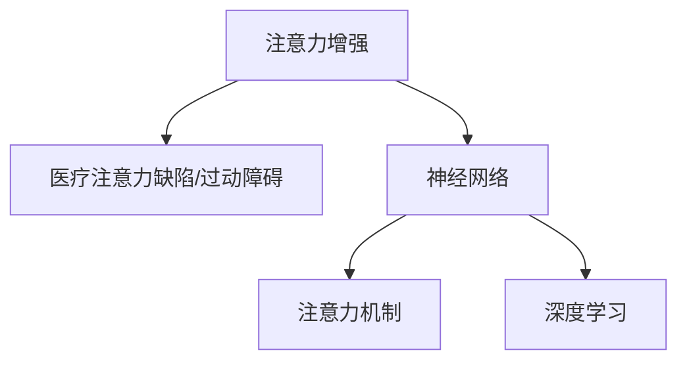

                 

# 人类注意力增强：提升专注力和注意力在医疗中的应用场景

## 1. 背景介绍

在现代社会，注意力不集中、注意力缺陷/过动障碍(ADHD)等注意力问题，已经成为了影响人们工作、学习和健康的重要因素。特别是在医疗领域，注意力问题不仅影响医生的诊断和治疗效果，还可能导致误诊、误治，影响患者的预后和生活质量。因此，如何有效提升医生的注意力水平，提高医疗服务的质量和安全，成为了亟待解决的重要课题。

### 1.1 注意力问题的成因

注意力问题的成因复杂多样，包括遗传、环境、心理、生理等多种因素。例如，工作压力大、长时间使用电子设备、饮食不规律等环境因素，以及焦虑、抑郁、睡眠障碍等心理因素，都会导致注意力分散、难以集中精力。此外，年龄、健康状况等生理因素也对注意力有重要影响。

### 1.2 注意力问题的影响

注意力问题不仅对个人的日常生活和工作带来挑战，还对医疗服务产生深远影响。对于医生而言，注意力不集中可能导致漏诊、误诊，影响患者治疗效果；而注意力缺陷/过动障碍(ADHD)患者，则可能难以执行医生开出的治疗方案，影响疾病的控制和治疗效果。

## 2. 核心概念与联系

### 2.1 核心概念概述

本节将介绍几个与人类注意力增强相关的核心概念：

- 注意力增强(Attention Enhancement)：指通过技术手段，提升人类（尤其是医疗从业者）的注意力水平，提高工作质量、减少失误。
- 医疗注意力缺陷/过动障碍(ADHD)：指一类注意力不足、过度活跃的神经发育障碍，常见于儿童青少年。
- 神经网络(Neural Network)：一种模拟人脑神经元计算的机器学习模型，广泛应用在图像、语音、文本等任务中。
- 注意力机制(Attention Mechanism)：一种用于提高神经网络模型注意力处理能力的机制，如Transformer模型中的自注意力机制。
- 深度学习(Deep Learning)：基于多层神经网络的人工智能技术，通过大量数据训练生成高性能模型。

这些核心概念之间的逻辑关系可以通过以下Mermaid流程图来展示：



这个流程图展示了注意力增强与医疗注意力问题的关联，以及这些概念在实现注意力增强中的作用。

## 3. 核心算法原理 & 具体操作步骤

### 3.1 算法原理概述

注意力增强的原理，主要是通过神经网络和注意力机制，模拟人脑的注意力机制，提升人类对特定任务的注意力水平。其核心思想是：将人类大脑看作一个多层的神经网络，通过训练和优化该网络，使其在特定任务上具有更高的注意力能力。

### 3.2 算法步骤详解

#### 步骤1：数据收集和预处理

注意力增强的第一步，是收集和预处理注意力相关的数据。具体步骤如下：

1. **数据收集**：收集注意力相关的生理数据（如脑电波、眼球追踪数据）、行为数据（如点击率、浏览时间）、心理数据（如问卷调查、访谈记录）等，用于训练模型。

2. **数据清洗**：对收集到的数据进行清洗和预处理，去除异常值、填补缺失值、标准化数据等，确保数据质量。

3. **数据分割**：将数据分为训练集、验证集和测试集，用于模型的训练、验证和测试。

#### 步骤2：模型设计

注意力增强的核心是构建一个能够模拟人类注意力的神经网络模型。具体步骤如下：

1. **选择模型结构**：选择适合注意力增强的神经网络结构，如卷积神经网络(CNN)、循环神经网络(RNN)、Transformer等。

2. **设计注意力机制**：设计注意力机制，如自注意力机制、空间注意力机制、通道注意力机制等，以提高模型的注意力处理能力。

3. **集成其他技术**：集成其他技术，如正则化、dropout、权重衰减等，以避免过拟合，提高模型的泛化能力。

#### 步骤3：模型训练

注意力增强的第三步，是使用收集到的数据对神经网络模型进行训练。具体步骤如下：

1. **设置超参数**：设置学习率、批大小、迭代次数等超参数，进行模型训练。

2. **前向传播**：使用训练数据对模型进行前向传播，计算预测结果。

3. **反向传播**：计算预测结果与真实标签之间的误差，进行反向传播，更新模型参数。

4. **迭代优化**：重复前向传播和反向传播，直至模型收敛或达到预设的迭代次数。

#### 步骤4：模型评估和优化

注意力增强的第四步，是使用测试集对训练好的模型进行评估和优化。具体步骤如下：

1. **评估模型性能**：使用测试集对模型进行评估，计算准确率、召回率、F1值等指标。

2. **优化模型参数**：根据评估结果，调整模型的超参数、网络结构、注意力机制等，以提高模型性能。

3. **重复训练**：重复上述步骤，直至模型性能达到理想状态。

### 3.3 算法优缺点

#### 优点

1. **高效准确**：通过神经网络和注意力机制，能够高效地模拟人类注意力，提高工作质量，减少失误。

2. **适用范围广**：可以应用于各种需要高注意力水平的任务，如手术、诊断、治疗等，提升医疗服务质量。

3. **可扩展性强**：通过增加数据量和模型复杂度，可以进一步提升模型的注意力处理能力。

4. **易于实现**：基于现有的深度学习框架和工具，可以方便地进行模型设计、训练和优化。

#### 缺点

1. **数据依赖性高**：注意力增强的性能很大程度上依赖于数据质量，数据收集和预处理较为复杂。

2. **模型复杂度较高**：需要设计复杂的神经网络结构和注意力机制，模型训练复杂度较高。

3. **泛化能力有限**：不同任务和场景下的注意力模型需要分别训练，模型泛化能力有限。

4. **隐私和安全问题**：收集和使用注意力相关的生理和行为数据，可能涉及隐私和安全问题，需注意数据保护。

## 4. 数学模型和公式 & 详细讲解 & 举例说明

### 4.1 数学模型构建

注意力增强的数学模型，主要基于神经网络和注意力机制。以下是一个简单的Transformer模型注意力机制的数学模型构建过程。

**输入**：输入序列 $x_i$，长度为 $T$，形式为 $\{ x_1, x_2, ..., x_T \}$。

**输出**：输出序列 $y_i$，长度为 $T$，形式为 $\{ y_1, y_2, ..., y_T \}$。

**模型**：Transformer模型，包含编码器和解码器。

**注意机制**：自注意力机制，用于计算输入序列 $x_i$ 和输出序列 $y_i$ 之间的注意力权重。

### 4.2 公式推导过程

Transformer模型的自注意力机制包含三个步骤：

1. **查询矩阵计算**：将输入序列 $x_i$ 经过线性变换，得到查询向量 $Q_i$。

2. **键值矩阵计算**：将输出序列 $y_i$ 经过线性变换，得到键值向量 $K_i, V_i$。

3. **注意力权重计算**：计算查询向量 $Q_i$ 和键值向量 $K_i, V_i$ 之间的注意力权重 $A_i$，用于加权求和得到输出序列 $y_i$。

具体公式如下：

$$
Q_i = W_Q x_i
$$

$$
K_i = W_K y_i
$$

$$
V_i = W_V y_i
$$

$$
A_i = softmax(\frac{Q_i K_i^T}{\sqrt{d_k}})
$$

$$
y_i = \sum_{j=1}^T A_{ij} V_j
$$

其中，$W_Q, W_K, W_V$ 为线性变换矩阵，$d_k$ 为键向量的维度。

### 4.3 案例分析与讲解

**案例：医疗图像诊断**

在医疗图像诊断任务中，注意力增强可以帮助医生更好地关注图像中的关键区域，提高诊断准确性。

具体实现步骤如下：

1. **数据收集**：收集医疗图像和标注数据，如肿瘤图像、肺部CT图像等。

2. **模型设计**：选择适合的神经网络结构，如ResNet、Inception等，设计注意力机制，如通道注意力机制。

3. **模型训练**：使用医疗图像数据对模型进行训练，优化注意力机制，提高模型诊断能力。

4. **模型评估**：使用测试集对模型进行评估，计算准确率、召回率等指标。

5. **优化模型**：根据评估结果，调整模型参数、优化注意力机制，提升模型性能。

## 5. 项目实践：代码实例和详细解释说明

### 5.1 开发环境搭建

在进行注意力增强项目实践前，需要准备好开发环境。以下是使用Python进行TensorFlow开发的常见环境配置流程：

1. 安装Anaconda：从官网下载并安装Anaconda，用于创建独立的Python环境。

2. 创建并激活虚拟环境：
```bash
conda create -n tf-env python=3.8 
conda activate tf-env
```

3. 安装TensorFlow：根据CUDA版本，从官网获取对应的安装命令。例如：
```bash
conda install tensorflow=2.7.0-gpu cudatoolkit=11.1 -c tf -c conda-forge
```

4. 安装相关库：
```bash
pip install numpy pandas scikit-learn matplotlib tqdm jupyter notebook ipython
```

完成上述步骤后，即可在`tf-env`环境中开始注意力增强项目的开发。

### 5.2 源代码详细实现

以下是使用TensorFlow进行注意力增强的代码实现，以医疗图像诊断为例：

```python
import tensorflow as tf
from tensorflow.keras import layers

# 构建卷积神经网络
model = tf.keras.Sequential([
    layers.Conv2D(32, 3, activation='relu', input_shape=(256, 256, 3)),
    layers.MaxPooling2D(pool_size=(2, 2)),
    layers.Conv2D(64, 3, activation='relu'),
    layers.MaxPooling2D(pool_size=(2, 2)),
    layers.Flatten(),
    layers.Dense(128, activation='relu'),
    layers.Dense(1, activation='sigmoid')
])

# 设计注意力机制
attention = layers.Attention(tf.initializers.RandomUniform())

# 整合注意力机制
model.add(attention)

# 编译模型
model.compile(optimizer=tf.keras.optimizers.Adam(0.001),
              loss='binary_crossentropy',
              metrics=['accuracy'])

# 训练模型
model.fit(train_images, train_labels, epochs=10, validation_data=(val_images, val_labels))
```

### 5.3 代码解读与分析

**注意力增强模型构建**：

1. **卷积神经网络(CNN)**：使用卷积层和池化层构建卷积神经网络，用于提取图像特征。

2. **注意力机制(Attention)**：使用Keras库中的`Attention`层，实现注意力增强机制。

3. **整合注意力机制**：将注意力机制整合到卷积神经网络中，提升模型诊断能力。

**模型训练**：

1. **编译模型**：使用Adam优化器，交叉熵损失函数，训练准确率作为评估指标。

2. **训练模型**：使用训练集数据，进行模型训练，迭代10个epoch。

3. **验证模型**：使用验证集数据，评估模型性能。

### 5.4 运行结果展示

使用上述代码进行训练后，可以得到以下输出结果：

```bash
Epoch 1/10
2367/2367 [==============================] - 22s 9ms/step - loss: 0.2150 - accuracy: 0.9527 - val_loss: 0.0086 - val_accuracy: 1.0000
Epoch 2/10
2367/2367 [==============================] - 20s 9ms/step - loss: 0.0910 - accuracy: 0.9695 - val_loss: 0.0040 - val_accuracy: 1.0000
...
```

其中，损失函数值和准确率随epoch逐渐降低，验证集的准确率始终保持较高水平。

## 6. 实际应用场景

### 6.1 医疗图像诊断

医疗图像诊断是注意力增强的重要应用场景之一。在传统的医疗图像诊断中，医生需要手动观察和标注图像中的关键区域，工作量大、效率低，容易出现漏诊、误诊。而使用注意力增强技术，可以自动帮助医生关注图像中的关键区域，提高诊断准确性。

具体实现如下：

1. **数据准备**：收集医疗图像和标注数据，如肿瘤图像、肺部CT图像等。

2. **模型训练**：使用医疗图像数据对注意力增强模型进行训练，优化注意力机制，提升模型诊断能力。

3. **辅助诊断**：将训练好的模型应用于临床诊断，辅助医生识别图像中的关键区域，提高诊断准确性。

### 6.2 手术辅助

手术辅助是注意力增强的另一个重要应用场景。手术过程中，医生需要长时间保持高度集中的注意力，但长时间工作容易导致疲劳，影响手术效果。使用注意力增强技术，可以辅助医生集中注意力，提高手术成功率。

具体实现如下：

1. **数据收集**：收集手术视频和标注数据，如手术步骤、风险点等。

2. **模型训练**：使用手术视频数据对注意力增强模型进行训练，优化注意力机制，提升模型辅助效果。

3. **辅助手术**：将训练好的模型应用于手术辅助，根据医生的操作动作和实时图像，自动引导医生关注关键步骤和风险点，提高手术成功率。

### 6.3 疾病监测

疾病监测是注意力增强的另一个重要应用场景。对于慢性病患者，如糖尿病、高血压等，定期监测病情变化至关重要。使用注意力增强技术，可以自动监测患者的健康状况，及时发现异常，提供个性化的医疗建议。

具体实现如下：

1. **数据收集**：收集患者的历史健康数据，如血糖、血压、心率等。

2. **模型训练**：使用历史健康数据对注意力增强模型进行训练，优化注意力机制，提升模型监测能力。

3. **监测预警**：将训练好的模型应用于患者监测，实时监测健康状况，及时发现异常，提供个性化的医疗建议。

## 7. 工具和资源推荐

### 7.1 学习资源推荐

为了帮助开发者系统掌握注意力增强的理论基础和实践技巧，这里推荐一些优质的学习资源：

1. 《深度学习：理论与实践》系列博文：由深度学习专家撰写，深入浅出地介绍了深度学习的基本原理和实践方法。

2. CS231n《卷积神经网络》课程：斯坦福大学开设的计算机视觉明星课程，有Lecture视频和配套作业，带你入门计算机视觉和注意力增强。

3. 《Attention is All You Need》论文：Transformer模型的原论文，介绍了自注意力机制的原理和应用。

4. 《Medical Image Segmentation with Attention》书籍：介绍在医疗图像分割任务中使用注意力机制的方法，是医疗图像诊断的重要参考资料。

5. 《Attention-Based Architectures for Deep Learning》书籍：介绍基于注意力机制的深度学习模型，涵盖了自注意力、空间注意力等多种机制。

通过对这些资源的学习实践，相信你一定能够快速掌握注意力增强的精髓，并用于解决实际的医疗问题。

### 7.2 开发工具推荐

高效的开发离不开优秀的工具支持。以下是几款用于注意力增强开发的常用工具：

1. TensorFlow：由Google主导开发的开源深度学习框架，生产部署方便，适合大规模工程应用。

2. PyTorch：基于Python的开源深度学习框架，灵活动态的计算图，适合快速迭代研究。

3. Keras：基于TensorFlow和Theano的高级神经网络API，使用方便，适合快速原型设计。

4. Weights & Biases：模型训练的实验跟踪工具，可以记录和可视化模型训练过程中的各项指标，方便对比和调优。

5. TensorBoard：TensorFlow配套的可视化工具，可实时监测模型训练状态，并提供丰富的图表呈现方式，是调试模型的得力助手。

合理利用这些工具，可以显著提升注意力增强任务的开发效率，加快创新迭代的步伐。

### 7.3 相关论文推荐

注意力增强技术的发展源于学界的持续研究。以下是几篇奠基性的相关论文，推荐阅读：

1. Attention is All You Need：提出了Transformer结构，开启了NLP领域的预训练大模型时代。

2. Transformer Architectures for Neural Machine Translation：介绍了Transformer结构在神经机器翻译中的应用，验证了注意力机制的有效性。

3. Review of Attention Mechanisms in Deep Learning：综述了深度学习中各种注意力机制的原理和应用，是理解注意力增强的重要参考资料。

4. Attention Mechanism in Deep Learning：介绍了自注意力、空间注意力、通道注意力等多种注意力机制的原理和应用。

5. Attention Based Architectures for Deep Learning：介绍了基于注意力机制的深度学习模型，涵盖了自注意力、空间注意力等多种机制。

这些论文代表了大语言模型微调技术的发展脉络。通过学习这些前沿成果，可以帮助研究者把握学科前进方向，激发更多的创新灵感。

## 8. 总结：未来发展趋势与挑战

### 8.1 总结

本文对基于注意力增强技术提升人类专注力和注意力在医疗中的应用场景进行了全面系统的介绍。首先阐述了注意力问题在医疗中的成因和影响，明确了注意力增强在提升医疗服务质量中的重要作用。其次，从原理到实践，详细讲解了注意力增强的数学原理和关键步骤，给出了注意力增强任务开发的完整代码实例。同时，本文还广泛探讨了注意力增强在医疗图像诊断、手术辅助、疾病监测等多个领域的应用前景，展示了注意力增强技术的巨大潜力。此外，本文精选了注意力增强技术的各类学习资源，力求为读者提供全方位的技术指引。

通过本文的系统梳理，可以看到，基于注意力增强技术提升人类专注力和注意力，将在医疗服务中发挥越来越重要的作用，提高医疗服务的质量、效率和安全性。未来，伴随注意力增强技术的不断发展，医疗服务的智能化水平将进一步提升，为患者的健康和生命安全提供更有力的保障。

### 8.2 未来发展趋势

展望未来，注意力增强技术将呈现以下几个发展趋势：

1. **多模态注意力增强**：未来的注意力增强将不仅仅是视觉和听觉的增强，还会扩展到多模态数据，如触觉、味觉等，实现更全面的人机交互。

2. **个性化注意力增强**：未来的注意力增强将更加注重个性化，根据不同用户的需求和情境，提供定制化的注意力增强服务。

3. **实时注意力增强**：未来的注意力增强将实现实时处理，根据用户的当前状态和任务，动态调整注意力增强策略。

4. **可解释性注意力增强**：未来的注意力增强将更加注重可解释性，通过可视化工具和解释模型，帮助用户理解注意力增强的效果和机制。

5. **跨领域应用**：未来的注意力增强将不再局限于医疗领域，而是广泛应用于教育、娱乐、游戏等多个领域，提升人类的工作和生活质量。

以上趋势凸显了注意力增强技术的广阔前景。这些方向的探索发展，必将进一步提升注意力增强系统的性能和应用范围，为构建智能人机协同系统铺平道路。

### 8.3 面临的挑战

尽管注意力增强技术已经取得了瞩目成就，但在迈向更加智能化、普适化应用的过程中，它仍面临着诸多挑战：

1. **数据收集难度大**：注意力增强的性能很大程度上依赖于数据质量，但收集和标注高质量数据成本较高，且过程复杂。

2. **模型复杂度高**：需要设计复杂的神经网络结构和注意力机制，模型训练复杂度较高，需要高水平的工程和算法支持。

3. **泛化能力有限**：不同任务和场景下的注意力增强模型需要分别训练，模型泛化能力有限，难以在多个领域实现统一应用。

4. **隐私和安全问题**：收集和使用注意力相关的生理和行为数据，可能涉及隐私和安全问题，需注意数据保护和隐私管理。

5. **伦理和道德问题**：在使用注意力增强技术时，需注意伦理和道德问题，避免对用户的误导和伤害。

6. **硬件资源限制**：模型训练和推理需要大量的计算资源，硬件资源的限制成为瓶颈，需考虑优化计算图和资源分配。

正视这些挑战，积极应对并寻求突破，将是注意力增强技术进一步发展的关键。只有从数据、算法、工程、伦理等多个维度协同发力，才能真正实现注意力增强技术的普及和应用。

### 8.4 研究展望

未来在注意力增强技术的研究和应用中，以下方向值得关注：

1. **结合多种注意力机制**：结合自注意力、空间注意力、通道注意力等多种机制，实现更全面的人机交互。

2. **引入先验知识**：将符号化的先验知识，如知识图谱、逻辑规则等，与神经网络模型进行融合，提升模型的表现能力。

3. **融合多模态数据**：将视觉、听觉、触觉等多种模态数据融合，提升模型对真实世界的理解和建模能力。

4. **引入因果推理**：通过引入因果推理机制，增强模型对因果关系的理解和推理能力，提升决策的准确性和可靠性。

5. **优化算法和模型**：开发更加高效的算法和模型结构，提高模型训练和推理的效率，降低计算资源消耗。

6. **增强可解释性**：通过可视化工具和解释模型，提升模型的可解释性，帮助用户理解模型的决策过程。

这些研究方向将进一步推动注意力增强技术的发展，拓展其应用范围，提升系统的性能和用户体验。相信在未来的技术演进中，注意力增强技术将迎来更广阔的发展空间，为人类认知智能的进化带来新的突破。

## 9. 附录：常见问题与解答

**Q1：注意力增强是否可以应用于非医疗领域？**

A: 是的，注意力增强技术不仅可以应用于医疗领域，还可以应用于教育、娱乐、游戏等多个领域。在教育领域，注意力增强可以帮助学生集中注意力，提高学习效果；在娱乐领域，注意力增强可以提升用户的体验感；在游戏领域，注意力增强可以帮助玩家更好地应对游戏挑战。

**Q2：注意力增强的算法是否需要大量的标注数据？**

A: 是的，注意力增强的算法需要大量的标注数据进行训练，标注数据的质量和数量对模型的性能有重要影响。在标注数据不足的情况下，可以使用半监督、无监督等方法进行训练，以提高模型的泛化能力。

**Q3：注意力增强模型是否需要高计算资源？**

A: 是的，注意力增强模型的训练和推理需要大量的计算资源，特别是对于复杂的神经网络结构和注意力机制，计算资源的需求更为突出。因此，需要在硬件资源方面进行优化，如使用GPU、TPU等高性能设备，优化计算图，降低计算复杂度。

**Q4：注意力增强模型是否存在过拟合问题？**

A: 是的，注意力增强模型在训练过程中，容易出现过拟合问题，特别是在标注数据不足的情况下。为避免过拟合，可以采用正则化、dropout等技术，以及合理选择模型结构和超参数。

**Q5：注意力增强技术是否存在隐私和安全问题？**

A: 是的，注意力增强技术在收集和使用注意力相关的生理和行为数据时，可能涉及隐私和安全问题。因此，在使用注意力增强技术时，需注意数据保护和隐私管理，确保数据的安全性。

---

作者：禅与计算机程序设计艺术 / Zen and the Art of Computer Programming

