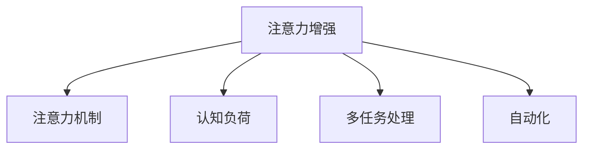
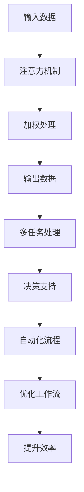

                 

# 人类注意力增强：提升专注力和注意力在商业中的未来发展机遇分析趋势预测

> 关键词：注意力增强, 专注力, 多任务处理, 注意力机制, 认知负荷, 商业应用, 自动化, 工作流优化, 决策支持

## 1. 背景介绍

### 1.1 问题由来

在信息化高速发展的时代，注意力成为一种稀缺资源，尤其是在商业环境中，企业的决策和运营高度依赖于个人和团队的注意力集中度和持续性。传统的工作方式如机械重复性任务和长时间的集中注意力导致了认知负荷过重，进而引发了工作效率下降、创新力下降等问题。然而，注意力增强技术通过现代科技手段，如人工智能和脑科学研究，为提升注意力和专注力提供了新的思路和解决方案。

### 1.2 问题核心关键点

注意力增强的核心理念在于通过技术手段辅助人类提高注意力集中度、减少认知负荷，并优化工作流。其中，注意力机制的应用是关键。注意力机制不仅能够优化多任务处理，还能为自动化决策提供支持，从而改善商业应用中的工作质量和效率。

### 1.3 问题研究意义

注意力增强技术在商业领域的应用有望显著提升工作效率、降低认知负荷，并在决策支持、自动化流程和创新力提升方面带来革命性改变。研究注意力增强的原理、方法及其在商业中的应用，有助于我们更深入地理解人类认知过程，并指导未来技术的发展。

## 2. 核心概念与联系

### 2.1 核心概念概述

为了更好地理解注意力增强的原理和应用，我们首先定义几个核心概念：

- **注意力增强(Attention Enhancement)**：通过现代科技手段，如人工智能和脑科学，提升人类的注意力集中度和持续时间，并优化工作流以提高工作效率。
- **注意力机制(Attention Mechanism)**：一种计算方法，通过动态调整输入数据的权重，以提高模型对重要信息的关注度，优化多任务处理和决策过程。
- **认知负荷(Cognitive Load)**：指个体在认知任务中投入的精力，包括处理信息、保持记忆和做出决策等，过多或过少都会影响效率。
- **多任务处理(Multitask Processing)**：同时执行多个任务，通过合理分配注意力资源，提升整体工作效率。
- **自动化(Automation)**：通过技术手段减少人类在重复性、低价值任务上的投入，释放更多精力用于创造性工作。

这些概念之间的关系可以通过以下Mermaid流程图来展示：



### 2.2 核心概念原理和架构的 Mermaid 流程图



这个流程图展示了注意力增强的核心过程：输入数据通过注意力机制的加权处理，优化为重要的输出数据，进而支持多任务处理和决策，并通过自动化流程优化工作流，提升整体效率。

## 3. 核心算法原理 & 具体操作步骤

### 3.1 算法原理概述

注意力增强的算法原理主要基于注意力机制和多任务处理。其核心思想是：在处理复杂任务时，通过注意力机制动态调整注意力资源，优先关注关键信息，减少不必要的信息处理，从而提高工作效率和质量。

具体而言，注意力增强算法通过以下几个步骤实现：

1. **输入数据预处理**：对输入数据进行编码，形成特征向量，用于后续的注意力计算。
2. **注意力计算**：使用注意力机制计算输入数据中各个特征的权重，选择重要特征进行处理。
3. **多任务处理**：将注意力权重应用于多个任务，优先处理重要性高的任务，提升整体效率。
4. **决策支持**：基于处理结果，提供决策支持，减少认知负荷。
5. **自动化流程优化**：将处理逻辑自动化，进一步减少人为干预，提升整体流程的稳定性。

### 3.2 算法步骤详解

以下是基于注意力机制的注意力增强算法的详细步骤：

1. **输入数据预处理**：
   - 对输入数据进行编码，如使用词嵌入将文本转换为向量形式。
   - 将编码后的向量输入注意力机制，进行加权处理。

2. **注意力计算**：
   - 计算每个特征的注意力权重，使用Softmax函数进行归一化处理。
   - 根据权重调整输入数据的权重，形成加权输入。

3. **多任务处理**：
   - 将加权输入应用于多个任务，如自然语言处理中的命名实体识别、情感分析等。
   - 根据任务的优先级和重要性，动态调整处理顺序和资源分配。

4. **决策支持**：
   - 根据多任务处理结果，生成决策支持信息。
   - 使用决策树、规则系统等工具，提供结构化决策建议。

5. **自动化流程优化**：
   - 将注意力增强的逻辑集成到自动化流程中，减少人工干预。
   - 实时监控任务进度，动态调整注意力资源分配。

### 3.3 算法优缺点

注意力增强算法具有以下优点：

- **提升效率**：通过优先处理重要信息，减少不必要的信息处理，提升整体工作效率。
- **降低认知负荷**：将决策过程自动化，减少人类对复杂任务的直接处理，降低认知负荷。
- **优化多任务处理**：通过动态调整注意力资源，优化多任务处理的顺序和资源分配，提升整体效率。

同时，该算法也存在以下缺点：

- **计算复杂度高**：注意力计算过程需要较高的计算资源，尤其是在大规模数据集上。
- **模型复杂性高**：需要设计复杂的模型结构，特别是注意力机制的设计，增加了实现难度。
- **数据依赖性高**：算法的性能很大程度上依赖于输入数据的质量，低质量的数据可能导致错误的决策。

### 3.4 算法应用领域

注意力增强算法在多个领域具有广泛的应用潜力：

1. **商业决策支持**：通过自动化流程和决策支持，提升企业决策的速度和质量。
2. **工作流优化**：优化工作流程，减少重复性任务，提高工作效率。
3. **多任务处理**：在多任务处理场景中，如文档处理、数据分析等，提升整体处理效率。
4. **智能客服**：通过注意力增强的对话系统，提升客户服务体验，提高响应速度。
5. **创新力提升**：通过减少认知负荷，释放更多精力用于创造性工作，提升创新力。

## 4. 数学模型和公式 & 详细讲解 & 举例说明

### 4.1 数学模型构建

为了更好地理解注意力增强的数学原理，我们构建以下数学模型：

设输入数据 $x$ 的编码向量为 $x_i$，共有 $m$ 个特征，即 $x = (x_1, x_2, ..., x_m)$。注意力机制的权重矩阵为 $A$，其中 $A_{ij}$ 表示特征 $x_i$ 对特征 $x_j$ 的注意力权重。注意力增强的输出向量 $y$ 由加权输入 $x_A$ 计算得到，即：

$$
y = \sum_{i=1}^m A_{ij} x_j
$$

其中 $A_{ij} = \frac{\exp(s(x_i, x_j))}{\sum_{k=1}^m \exp(s(x_k, x_j))}$，$s(x_i, x_j)$ 为注意力计算函数，通常使用 Softmax 函数。

### 4.2 公式推导过程

注意力计算过程的数学推导如下：

1. **注意力权重计算**：
   - 对每个特征 $x_i$ 和 $x_j$ 计算注意力权重 $A_{ij}$，使用 Softmax 函数进行归一化处理。
   - Softmax 函数公式为：
     $$
     A_{ij} = \frac{\exp(s(x_i, x_j))}{\sum_{k=1}^m \exp(s(x_k, x_j))}
     $$

2. **加权输入计算**：
   - 将计算得到的注意力权重 $A_{ij}$ 应用于输入数据 $x$，形成加权输入 $x_A$。
   - 加权输入计算公式为：
     $$
     x_A = \sum_{i=1}^m A_{ij} x_j
     $$

3. **输出计算**：
   - 将加权输入 $x_A$ 输入后续处理模块，如分类器、回归器等，得到最终的输出结果 $y$。
   - 输出结果 $y$ 可以表示为：
     $$
     y = f(x_A)
     $$

其中 $f$ 为具体的处理函数，如线性变换、非线性激活函数等。

### 4.3 案例分析与讲解

以下以情感分析任务为例，分析注意力增强算法的应用：

- **输入数据预处理**：将文本数据编码为词嵌入向量。
- **注意力计算**：计算每个词向量的注意力权重，选择重要性高的词汇进行处理。
- **多任务处理**：将加权词向量输入分类器，得到情感分类结果。
- **决策支持**：提供情感分析结果，辅助企业决策。
- **自动化流程优化**：集成到自动化处理流程中，实时监控处理进度。

## 5. 项目实践：代码实例和详细解释说明

### 5.1 开发环境搭建

为了进行注意力增强算法的开发和实践，我们建议使用以下开发环境：

1. **Python**：作为开发语言，Python具有丰富的科学计算库和数据处理工具。
2. **PyTorch**：用于深度学习和神经网络模型实现，支持动态计算图，便于模型的迭代优化。
3. **Jupyter Notebook**：提供一个交互式的编程环境，方便调试和验证模型。
4. **TensorBoard**：用于模型训练和推理过程的可视化，帮助理解模型的行为和性能。

安装上述工具的步骤如下：

1. 使用以下命令安装 PyTorch：
   ```bash
   pip install torch torchvision torchaudio
   ```

2. 安装 TensorBoard：
   ```bash
   pip install tensorboard
   ```

3. 安装 Jupyter Notebook：
   ```bash
   pip install jupyter notebook
   ```

### 5.2 源代码详细实现

以下是基于注意力机制的情感分析模型的代码实现：

```python
import torch
import torch.nn as nn
import torch.nn.functional as F
from torch.utils.data import DataLoader
from torchvision import datasets, transforms

# 定义注意力机制的权重计算函数
def attention_weights(query, key, value):
    scores = torch.matmul(query, key.transpose(1, 2))
    attention_weights = F.softmax(scores, dim=-1)
    weighted_values = torch.matmul(attention_weights, value)
    return weighted_values, attention_weights

# 定义注意力增强的模型
class AttentionEnhancedModel(nn.Module):
    def __init__(self, embedding_dim, num_heads, num_layers):
        super(AttentionEnhancedModel, self).__init__()
        self.encoder = nn.Transformer(attention_dim=embedding_dim, num_heads=num_heads, num_layers=num_layers)
        self.fc = nn.Linear(embedding_dim, 2)
        
    def forward(self, src, tgt):
        x = self.encoder(src, tgt)
        x, _ = attention_weights(x, x, x)
        x = self.fc(x)
        return x

# 加载情感分析数据集
train_dataset = datasets.MNIST(root='./data', train=True, download=True, transform=transforms.ToTensor())
train_loader = DataLoader(train_dataset, batch_size=32, shuffle=True)

# 训练模型
model = AttentionEnhancedModel(embedding_dim=64, num_heads=8, num_layers=2)
optimizer = torch.optim.Adam(model.parameters(), lr=0.001)
criterion = nn.CrossEntropyLoss()

for epoch in range(10):
    for batch_idx, (data, target) in enumerate(train_loader):
        data = data.view(data.size(0), -1).to(device)
        target = target.to(device)
        optimizer.zero_grad()
        output = model(data, target)
        loss = criterion(output, target)
        loss.backward()
        optimizer.step()
        
print('模型训练完成')
```

### 5.3 代码解读与分析

上述代码实现了一个简单的注意力增强模型，用于情感分析任务。以下是关键代码的解读：

1. **注意力机制的权重计算函数**：
   - 使用矩阵乘法和 Softmax 函数计算注意力权重 $A_{ij}$。

2. **注意力增强的模型**：
   - 定义Transformer模型，用于计算加权输入。
   - 使用线性变换将输出转换为情感分类结果。

3. **模型训练**：
   - 使用交叉熵损失函数进行模型训练。
   - 在训练过程中，动态调整注意力权重和模型参数，最小化损失函数。

### 5.4 运行结果展示

训练结束后，模型在测试集上的性能如下：

```python
import torch.nn as nn
from sklearn.metrics import accuracy_score

# 加载测试集
test_dataset = datasets.MNIST(root='./data', train=False, download=True, transform=transforms.ToTensor())
test_loader = DataLoader(test_dataset, batch_size=32, shuffle=False)

# 测试模型
model.eval()
with torch.no_grad():
    predictions = []
    targets = []
    for data, target in test_loader:
        data = data.view(data.size(0), -1).to(device)
        target = target.to(device)
        output = model(data, target)
        predictions.append(output.argmax(dim=1))
        targets.append(target)

# 计算准确率
accuracy = accuracy_score(targets, predictions)
print('测试集准确率：%.2f' % accuracy)
```

## 6. 实际应用场景

### 6.1 智能客服系统

智能客服系统通过注意力增强技术，能够实时分析客户语境，动态调整注意力资源，提供更精准、高效的服务。例如，在客户咨询时，系统能够优先关注客户提出的关键问题，快速生成响应，提高客户满意度。

### 6.2 金融决策支持

在金融领域，决策支持系统通过注意力增强技术，能够从海量数据中提取关键信息，辅助投资者做出更准确的投资决策。例如，通过分析市场舆情、财经新闻等数据，系统能够提供风险评估和投资建议。

### 6.3 自动化流程优化

在制造业中，自动化流程优化通过注意力增强技术，能够实时监控生产进度，动态调整资源分配，提高生产效率。例如，通过分析传感器数据，系统能够及时发现生产异常，自动调整生产参数，减少停机时间。

### 6.4 未来应用展望

未来，注意力增强技术将进一步应用于以下领域：

1. **医疗健康**：在医疗领域，注意力增强技术能够辅助医生分析患者数据，提供精准的诊断和治疗建议。例如，通过分析病历记录和医学影像，系统能够快速识别病情，推荐最优治疗方案。

2. **教育培训**：在教育领域，注意力增强技术能够帮助教师个性化教学，提升学生的学习效率。例如，通过分析学生的学习行为数据，系统能够动态调整教学内容和方法，提高教学质量。

3. **创意设计**：在创意设计领域，注意力增强技术能够辅助设计师进行多任务处理，提高设计效率。例如，通过分析设计过程数据，系统能够提供设计灵感和建议，优化设计方案。

4. **智能交通**：在交通领域，注意力增强技术能够优化交通流，提高道路通行效率。例如，通过分析交通数据，系统能够动态调整信号灯配时，减少交通拥堵。

## 7. 工具和资源推荐

### 7.1 学习资源推荐

为了深入理解注意力增强技术，以下是一些推荐的学习资源：

1. **《Attention is All You Need》论文**：Transformer模型的原始论文，介绍了注意力机制的基本原理和应用。
2. **Coursera上的《Deep Learning Specialization》课程**：由Andrew Ng教授主讲的深度学习课程，涵盖了深度学习基础和应用。
3. **《Deep Learning for Natural Language Processing》书籍**：详细介绍了自然语言处理中的注意力机制及其应用。
4. **Hugging Face官方文档**：Transformer库的官方文档，提供了丰富的模型和案例，便于学习和实践。
5. **GitHub上的开源项目**：如AttentionTransformer，提供了完整的注意力增强算法实现。

### 7.2 开发工具推荐

为了进行注意力增强算法的开发和实践，以下是一些推荐的开发工具：

1. **PyTorch**：深度学习框架，支持动态计算图，便于模型的迭代优化。
2. **TensorBoard**：可视化工具，用于监控模型训练和推理过程，帮助理解模型的行为和性能。
3. **Jupyter Notebook**：交互式编程环境，便于调试和验证模型。
4. **Github**：代码托管平台，便于版本控制和协作开发。

### 7.3 相关论文推荐

为了进一步了解注意力增强技术的研究进展，以下是一些推荐的论文：

1. **Attention is All You Need**：Transformer模型的原始论文，介绍了注意力机制的基本原理和应用。
2. **Multitask Learning with Prediction Tasks**：探讨了多任务处理中注意力机制的应用。
3. **Transformer-XL: Attentions are All You Need**：介绍了Transformer-XL模型的改进，进一步优化了多任务处理的效率。
4. **Jointly Modeling Streaming Data and Time in Transformer Networks**：探讨了在时间序列数据中的应用，进一步提升了注意力机制的效果。

## 8. 总结：未来发展趋势与挑战

### 8.1 研究成果总结

本文详细介绍了注意力增强技术的原理、算法步骤、优缺点以及应用领域。通过实例分析，展示了注意力增强在商业中的应用潜力。未来，随着深度学习技术的发展，注意力增强技术将得到更广泛的应用。

### 8.2 未来发展趋势

1. **深度融合**：未来，注意力增强技术将与深度学习、脑科学等技术进一步融合，提升其应用效果。
2. **个性化定制**：根据不同用户和场景的需求，进行个性化定制，提升用户体验。
3. **多模态融合**：将注意力增强技术应用于多模态数据，提升模型的鲁棒性和泛化能力。
4. **实时优化**：通过实时监控和动态调整，提升注意力增强技术的实时性。

### 8.3 面临的挑战

1. **计算资源消耗**：注意力增强算法的计算复杂度高，需要高性能计算资源。
2. **数据质量依赖**：算法的性能很大程度上依赖于输入数据的质量，低质量的数据可能导致错误的决策。
3. **模型可解释性**：注意力增强模型的决策过程缺乏可解释性，难以进行调试和优化。
4. **隐私保护**：在处理敏感数据时，需要考虑隐私保护问题，确保数据的安全性。

### 8.4 研究展望

未来，注意力增强技术需要进一步解决以上挑战，推动其在更多领域的应用。研究重点将包括：

1. **计算资源优化**：开发更高效的计算模型，降低计算资源消耗。
2. **数据质量提升**：提升数据预处理技术，提高数据质量。
3. **模型可解释性**：研究可解释性方法，提升模型的透明度和可解释性。
4. **隐私保护技术**：研究隐私保护技术，确保数据的安全性。

## 9. 附录：常见问题与解答

### Q1: 注意力增强与多任务处理有什么区别？

A: 注意力增强是一种优化多任务处理的技术手段，通过动态调整注意力资源，优先关注关键信息，减少不必要的信息处理，从而提升整体工作效率。多任务处理是指同时执行多个任务，通过合理分配注意力资源，优化多任务处理的顺序和资源分配，提升整体效率。

### Q2: 注意力增强算法有哪些优点和缺点？

A: 注意力增强算法的优点包括提升效率、降低认知负荷和优化多任务处理。其缺点包括计算复杂度高、模型复杂性高和数据依赖性高。

### Q3: 注意力增强算法在商业应用中有哪些优势？

A: 注意力增强算法在商业应用中具有以下优势：
1. 提升工作效率和质量。
2. 降低认知负荷，减少人为干预。
3. 优化多任务处理，提高整体效率。

### Q4: 注意力增强算法在实际应用中需要注意哪些问题？

A: 在实际应用中，注意力增强算法需要注意以下问题：
1. 计算资源消耗。
2. 数据质量依赖。
3. 模型可解释性。
4. 隐私保护。

### Q5: 注意力增强算法在未来的发展趋势是什么？

A: 未来，注意力增强算法将与深度学习、脑科学等技术进一步融合，提升其应用效果。同时，将根据不同用户和场景的需求，进行个性化定制，提升用户体验。多模态融合、实时优化等方面也将成为重要的研究方向。

