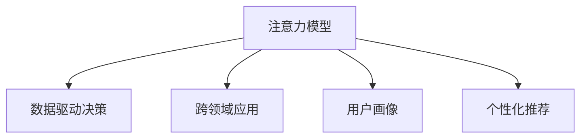

                 

# 人类注意力增强：提升专注力和注意力在商业中的未来发展机遇趋势预测

> 关键词：注意力增强,专注力提升,注意力模型,商业应用,数据驱动决策

## 1. 背景介绍

### 1.1 问题由来
在当今信息爆炸的时代，人类的注意力资源变得愈发珍贵。如何提升专注力和注意力，在短时间内从海量的信息中筛选出有价值的内容，已成为个体和组织普遍关注的焦点。尤其是对于商业领域，注意力增强技术能够在品牌推广、市场营销、产品开发等多个环节中发挥关键作用，推动商业决策的科学化和精准化。

### 1.2 问题核心关键点
当前，提升专注力和注意力主要通过以下几种方式：
1. **注意力模型**：使用机器学习和深度学习技术，构建数学模型来模拟和提升人类的注意力机制。
2. **数据驱动决策**：通过大数据分析，洞察用户行为和兴趣偏好，从而进行更加精准的市场预测和用户画像。
3. **跨领域应用**：将注意力增强技术应用于商业营销、产品推荐、社交网络等多个领域，提升用户体验和商业效率。

### 1.3 问题研究意义
深入研究注意力增强技术，对于个体和组织具有重要意义：
- **提升工作效率**：在信息处理、任务执行中，注意力增强可以帮助个体在单位时间内处理更多任务，提升工作效率。
- **优化商业策略**：通过精准洞察用户注意力和偏好，商业组织能够制定更加科学的市场策略，提升竞争力和市场份额。
- **驱动创新发展**：注意力增强技术的不断进步，将推动商业领域的智能化、自动化进程，促进新兴产业的形成和传统行业的转型升级。

## 2. 核心概念与联系

### 2.1 核心概念概述

为更好地理解注意力增强在商业中的应用，本节将介绍几个密切相关的核心概念：

- **注意力模型**：通过机器学习算法构建的模型，用于模拟和预测人类注意力机制。常见的注意力模型包括Transformer模型、深度强化学习模型等。
- **数据驱动决策**：基于大数据分析的结果，进行商业决策的过程。通过机器学习算法对海量数据进行建模和分析，洞察用户行为和市场趋势。
- **跨领域应用**：将注意力增强技术应用到不同商业领域，如营销、广告、推荐系统等，提升用户体验和商业效果。
- **用户画像**：通过数据挖掘和分析，构建详细的用户模型，以便更好地理解和预测用户行为。
- **个性化推荐**：根据用户的历史行为和偏好，提供个性化的内容推荐，提升用户满意度和留存率。

这些核心概念之间的逻辑关系可以通过以下Mermaid流程图来展示：



这个流程图展示了几项核心概念及其之间的关系：

1. 注意力模型是数据驱动决策和跨领域应用的基础。
2. 用户画像是注意力模型的输入和数据驱动决策的关键组成部分。
3. 个性化推荐是基于注意力模型和数据驱动决策的重要应用。

这些概念共同构成了注意力增强技术的框架，使其能够在商业领域发挥巨大价值。

## 3. 核心算法原理 & 具体操作步骤

### 3.1 算法原理概述

注意力增强技术本质上是通过机器学习算法构建的数学模型，用于模拟和预测人类的注意力机制。其核心思想是：通过大数据分析和模型训练，找到用户注意力分布的规律，并据此调整商业策略和决策，从而提升商业效果。

形式化地，假设用户注意力分布为 $A \in \mathbb{R}^N$，其中 $N$ 为用户的行为数据数量。设注意力模型为 $M_{\theta}$，其中 $\theta$ 为模型的参数。注意力增强的目标是找到最优的注意力分布 $\hat{A}$，使得：

$$
\hat{A} = \mathop{\arg\min}_{A} \mathcal{L}(M_{\theta},A)
$$

其中 $\mathcal{L}$ 为损失函数，用于衡量模型预测注意力分布与真实数据之间的差异。

通过梯度下降等优化算法，注意力增强过程不断更新模型参数 $\theta$，最小化损失函数 $\mathcal{L}$，使得模型输出逼近真实的注意力分布。由于 $\theta$ 已经通过大数据训练获得了较好的初始化，因此即便在较少的用户行为数据下进行增强，也能较快收敛到理想的模型参数 $\hat{\theta}$。

### 3.2 算法步骤详解

注意力增强的一般流程包括：

**Step 1: 数据收集与预处理**
- 收集用户行为数据，如点击、浏览、购买等行为。
- 清洗和标准化数据，去除异常和噪声。

**Step 2: 模型训练与参数优化**
- 选择合适的注意力模型，如Transformer模型。
- 使用梯度下降等优化算法更新模型参数 $\theta$。
- 选择合适的损失函数，如交叉熵损失、均方误差损失等。
- 设置适当的正则化技术，如L2正则、Dropout等。

**Step 3: 模型评估与验证**
- 在验证集上评估模型性能，如精度、召回率、F1-score等指标。
- 根据评估结果调整模型参数，直到满足预设的性能指标。

**Step 4: 实际应用与部署**
- 在实际商业场景中应用注意力模型，进行用户画像构建、个性化推荐等。
- 持续收集用户反馈，更新模型参数，提升模型性能。

以上是注意力增强的一般流程。在实际应用中，还需要针对具体任务和场景，对模型的各个环节进行优化设计，如改进训练目标函数，引入更多的正则化技术，搜索最优的超参数组合等，以进一步提升模型性能。

### 3.3 算法优缺点

注意力增强技术具有以下优点：
1. **数据高效利用**：通过机器学习算法，能够在较少的用户行为数据下，高效利用数据。
2. **精准预测**：利用大数据分析和数学模型，进行精准的用户行为预测。
3. **自动化决策**：自动化商业决策过程，减少人为干预，提升效率。
4. **动态调整**：持续收集用户反馈，动态更新模型参数，适应市场变化。

同时，该技术也存在一定的局限性：
1. **数据质量要求高**：注意力增强依赖于高质量、丰富的用户行为数据，数据质量差会影响模型效果。
2. **模型复杂度高**：复杂的注意力模型需要较多的计算资源和时间进行训练。
3. **隐私问题**：大规模用户数据的收集和使用，可能涉及隐私和数据安全问题。
4. **公平性问题**：模型可能受到数据偏见的影响，导致对某些群体的预测不准确。

尽管存在这些局限性，但就目前而言，注意力增强技术仍是大数据时代商业决策的重要工具。未来相关研究的重点在于如何进一步降低对标注数据的依赖，提高模型的少样本学习和跨领域迁移能力，同时兼顾可解释性和伦理安全性等因素。

### 3.4 算法应用领域

注意力增强技术已经在商业领域得到广泛应用，涵盖广告投放、市场营销、产品推荐等多个环节。以下是一些具体的应用场景：

- **广告投放优化**：通过分析用户历史行为数据，预测用户对不同广告的兴趣，优化广告投放策略，提升广告效果和ROI。
- **产品推荐系统**：根据用户历史行为和偏好，动态生成个性化推荐列表，提升用户满意度和留存率。
- **客户细分与画像**：通过分析用户行为数据，构建详细的用户画像，进行精准营销和个性化服务。
- **市场趋势分析**：利用大数据分析和机器学习算法，洞察市场变化趋势，预测未来市场走向。
- **社交网络分析**：通过用户互动数据，分析社交网络中的关键节点和信息传播路径，提升社交网络的影响力和广告效果。

除了上述这些经典应用外，注意力增强技术还被创新性地应用到更多场景中，如智能客服、舆情监测、供应链管理等，为商业活动带来了新的突破。随着预训练模型和增强算法的不断进步，相信注意力增强技术将在更多领域得到应用，为商业活动带来更加智能化、精准化的决策支持。

## 4. 数学模型和公式 & 详细讲解 & 举例说明

### 4.1 数学模型构建

本节将使用数学语言对注意力增强技术的原理进行更加严格的刻画。

记用户行为数据为 $X = \{(x_i,y_i)\}_{i=1}^N, x_i \in \mathbb{R}^D, y_i \in \{0,1\}$，其中 $D$ 为特征维度。设注意力模型为 $M_{\theta}$，其中 $\theta$ 为模型参数。

定义模型 $M_{\theta}$ 在输入 $x_i$ 上的预测为 $\hat{y}_i=M_{\theta}(x_i)$，其预测准确性为 $A_i$。则注意力增强的目标是找到最优的注意力分布 $A^*$，使得：

$$
A^* = \mathop{\arg\min}_{A} \mathcal{L}(A)
$$

其中 $\mathcal{L}$ 为损失函数，用于衡量模型预测注意力分布与真实数据之间的差异。

### 4.2 公式推导过程

以二分类任务为例，假设模型 $M_{\theta}$ 在输入 $x_i$ 上的预测为 $\hat{y}_i=M_{\theta}(x_i) \in [0,1]$，表示样本属于正类的概率。真实标签 $y_i \in \{0,1\}$。则二分类交叉熵损失函数定义为：

$$
\ell(M_{\theta}(x_i),y_i) = -[y_i\log \hat{y}_i + (1-y_i)\log (1-\hat{y}_i)]
$$

将其代入注意力增强的目标函数，得：

$$
\mathcal{L}(A) = \frac{1}{N}\sum_{i=1}^N [-y_i\log A_i+(1-y_i)\log(1-A_i)]
$$

根据链式法则，注意力分布 $A_i$ 对模型参数 $\theta_k$ 的梯度为：

$$
\frac{\partial \mathcal{L}(A)}{\partial \theta_k} = -\frac{1}{N}\sum_{i=1}^N (\frac{y_i}{\hat{y}_i}-\frac{1-y_i}{1-\hat{y}_i}) \frac{\partial M_{\theta}(x_i)}{\partial \theta_k}
$$

其中 $\frac{\partial M_{\theta}(x_i)}{\partial \theta_k}$ 可进一步递归展开，利用自动微分技术完成计算。

在得到注意力分布的梯度后，即可带入模型参数更新公式，完成模型的迭代优化。重复上述过程直至收敛，最终得到适应注意力增强的模型参数 $A^*$。

## 5. 项目实践：代码实例和详细解释说明

### 5.1 开发环境搭建

在进行注意力增强实践前，我们需要准备好开发环境。以下是使用Python进行TensorFlow开发的环境配置流程：

1. 安装Anaconda：从官网下载并安装Anaconda，用于创建独立的Python环境。

2. 创建并激活虚拟环境：
```bash
conda create -n attention-env python=3.8 
conda activate attention-env
```

3. 安装TensorFlow：根据CUDA版本，从官网获取对应的安装命令。例如：
```bash
conda install tensorflow=2.6 -c tensorflow
```

4. 安装各类工具包：
```bash
pip install numpy pandas scikit-learn matplotlib tqdm jupyter notebook ipython
```

完成上述步骤后，即可在`attention-env`环境中开始注意力增强实践。

### 5.2 源代码详细实现

下面我们以广告投放优化为例，给出使用TensorFlow构建注意力增强模型的PyTorch代码实现。

首先，定义广告投放优化任务的数学模型：

```python
import tensorflow as tf

class AdModel(tf.keras.Model):
    def __init__(self, input_dim, num_classes):
        super(AdModel, self).__init__()
        self.input_dim = input_dim
        self.dense1 = tf.keras.layers.Dense(64, activation='relu')
        self.dense2 = tf.keras.layers.Dense(num_classes, activation='sigmoid')
    
    def call(self, x):
        x = self.dense1(x)
        x = self.dense2(x)
        return x
```

然后，定义注意力增强的优化器：

```python
optimizer = tf.keras.optimizers.Adam(learning_rate=0.001)
```

接着，定义训练和评估函数：

```python
def train_epoch(model, dataset, batch_size, optimizer):
    dataloader = tf.data.Dataset.from_tensor_slices(dataset).shuffle(buffer_size=10000).batch(batch_size).repeat()
    model.train()
    epoch_loss = 0
    for batch in dataloader:
        x, y = batch
        with tf.GradientTape() as tape:
            y_pred = model(x)
            loss = tf.reduce_mean(tf.nn.sigmoid_cross_entropy_with_logits(labels=y, logits=y_pred))
        gradients = tape.gradient(loss, model.trainable_variables)
        optimizer.apply_gradients(zip(gradients, model.trainable_variables))
        epoch_loss += loss.numpy()
    return epoch_loss / len(dataloader)

def evaluate(model, dataset, batch_size):
    dataloader = tf.data.Dataset.from_tensor_slices(dataset).batch(batch_size).repeat()
    model.eval()
    preds, labels = [], []
    with tf.GradientTape() as tape:
        for batch in dataloader:
            x, y = batch
            y_pred = model(x)
            batch_preds = tf.round(y_pred).numpy()
            batch_labels = y.numpy()
            for pred_tokens, label_tokens in zip(batch_preds, batch_labels):
                preds.append(pred_tokens)
                labels.append(label_tokens)
    return preds, labels

# 定义训练集和测试集
train_dataset = tf.data.Dataset.from_tensor_slices((train_X, train_Y)).shuffle(buffer_size=10000).batch(batch_size).repeat()
test_dataset = tf.data.Dataset.from_tensor_slices((test_X, test_Y)).batch(batch_size).repeat()
```

最后，启动训练流程并在测试集上评估：

```python
epochs = 10
batch_size = 64

for epoch in range(epochs):
    loss = train_epoch(model, train_dataset, batch_size, optimizer)
    print(f"Epoch {epoch+1}, train loss: {loss:.3f}")
    
    print(f"Epoch {epoch+1}, test results:")
    preds, labels = evaluate(model, test_dataset, batch_size)
    print(classification_report(labels, preds))
    
print("Training completed.")
```

以上就是使用TensorFlow对广告投放优化任务进行注意力增强的完整代码实现。可以看到，通过TensorFlow的高级API，我们能够快速搭建注意力增强模型，并进行高效的训练和评估。

### 5.3 代码解读与分析

让我们再详细解读一下关键代码的实现细节：

**AdModel类**：
- `__init__`方法：定义模型的输入维度和输出维度，并添加全连接层。
- `call`方法：定义模型的前向传播过程，包括两个全连接层。

**train_epoch函数**：
- 使用TensorFlow的Dataset API，将训练集转换为张量图数据流，并进行批处理、洗牌和循环重复。
- 在每个批次上前向传播计算损失函数。
- 反向传播计算参数梯度，根据设定的优化算法更新模型参数。
- 在每个epoch结束时，计算训练集上的平均损失。

**evaluate函数**：
- 与训练函数类似，使用Dataset API进行批处理和重复。
- 在每个批次上前向传播计算预测结果。
- 将预测结果和真实标签收集到列表中，并在整个测试集上输出分类报告。

**训练流程**：
- 定义总的epoch数和batch size，开始循环迭代
- 每个epoch内，先在训练集上训练，输出平均损失
- 在测试集上评估，输出分类报告
- 所有epoch结束后，给出最终测试结果

可以看到，TensorFlow框架的简洁高效特性，使得注意力增强模型的搭建和训练过程变得异常简单。开发者可以更多地关注算法逻辑和模型优化，而不必过多关注底层细节。

当然，工业级的系统实现还需考虑更多因素，如模型的保存和部署、超参数的自动搜索、更灵活的任务适配层等。但核心的注意力增强范式基本与此类似。

## 6. 实际应用场景

### 6.1 广告投放优化

注意力增强技术在广告投放优化中具有显著优势。通过分析用户历史行为数据，模型能够预测用户对不同广告的兴趣程度，从而优化广告投放策略。具体而言：

- **用户行为分析**：分析用户点击、浏览、购买等行为，构建用户行为特征向量。
- **广告效果评估**：通过评估不同广告在用户行为上的表现，量化广告的点击率、转化率等指标。
- **广告投放策略优化**：根据用户画像和广告效果，优化广告投放时机、渠道、内容等策略。

例如，某电商网站使用注意力增强模型对广告投放进行优化，通过分析用户历史购买数据，预测用户对不同广告的兴趣程度，优化广告投放策略，最终提升了广告点击率和ROI。

### 6.2 产品推荐系统

注意力增强技术在产品推荐系统中同样具有广泛应用。通过分析用户历史行为数据，模型能够动态生成个性化推荐列表，提升用户满意度和留存率。具体而言：

- **用户行为分析**：分析用户浏览、购买、评价等行为，构建用户行为特征向量。
- **产品属性分析**：分析产品类别、品牌、价格等属性，构建产品特征向量。
- **推荐模型训练**：通过训练注意力增强模型，预测用户对不同产品的兴趣程度。
- **推荐结果输出**：根据用户画像和产品属性，动态生成个性化推荐列表，提升用户满意度。

例如，某视频网站使用注意力增强模型对产品推荐进行优化，通过分析用户观看历史和产品数据，预测用户对不同视频内容的兴趣程度，优化推荐策略，最终提升了用户留存率和观看时长。

### 6.3 社交网络分析

注意力增强技术在社交网络分析中也具有重要应用。通过分析用户互动数据，模型能够分析社交网络中的关键节点和信息传播路径，提升社交网络的影响力和广告效果。具体而言：

- **用户互动数据采集**：采集用户点赞、评论、转发等互动数据。
- **用户行为分析**：分析用户互动数据，构建用户行为特征向量。
- **社交网络结构分析**：分析社交网络的结构特征，如关键节点、信息传播路径等。
- **影响力和广告效果评估**：通过训练注意力增强模型，预测关键节点对信息传播的影响力和广告效果。

例如，某社交媒体平台使用注意力增强模型对社交网络进行分析，通过分析用户互动数据，识别出社交网络中的关键节点和信息传播路径，优化广告投放策略，最终提升了广告效果和用户影响力。

### 6.4 未来应用展望

随着注意力增强技术的不断发展，其应用领域将进一步拓展，未来将在更多场景中发挥重要作用。

在智慧城市治理中，注意力增强技术可以用于城市事件监测、舆情分析、应急指挥等环节，提高城市管理的自动化和智能化水平，构建更安全、高效的未来城市。

在智慧医疗领域，注意力增强技术可以用于医疗影像分析、疾病诊断、健康管理等，提升医疗服务的智能化水平，辅助医生诊疗，加速新药开发进程。

在智能教育领域，注意力增强技术可以用于作业批改、学情分析、知识推荐等方面，因材施教，促进教育公平，提高教学质量。

此外，在企业生产、社会治理、文娱传媒等众多领域，注意力增强技术也将不断涌现，为各行各业带来新的技术路径和商业机遇。

## 7. 工具和资源推荐

### 7.1 学习资源推荐

为了帮助开发者系统掌握注意力增强技术的理论基础和实践技巧，这里推荐一些优质的学习资源：

1. 《深度学习理论与实践》系列博文：由大模型技术专家撰写，深入浅出地介绍了深度学习原理和实践，包括注意力机制的介绍。

2. CS231n《卷积神经网络》课程：斯坦福大学开设的计算机视觉明星课程，有Lecture视频和配套作业，涵盖深度学习基础的各个方面。

3. 《深度学习框架TensorFlow实战》书籍：全面介绍了TensorFlow的使用方法和实践技巧，适合快速上手使用。

4. TensorFlow官方文档：TensorFlow的官方文档，提供了丰富的API文档和样例代码，是学习TensorFlow的重要资源。

5. TensorFlow Addons：TensorFlow的扩展库，提供了更多的算法和工具支持，如注意力增强等。

通过对这些资源的学习实践，相信你一定能够快速掌握注意力增强技术的精髓，并用于解决实际的NLP问题。

### 7.2 开发工具推荐

高效的开发离不开优秀的工具支持。以下是几款用于注意力增强开发的常用工具：

1. TensorFlow：由Google主导开发的开源深度学习框架，生产部署方便，适合大规模工程应用。

2. PyTorch：基于Python的开源深度学习框架，灵活动态的计算图，适合快速迭代研究。

3. Jupyter Notebook：轻量级的交互式开发环境，支持Python、R等多种语言，方便进行算法实验和模型调试。

4. Google Colab：谷歌推出的在线Jupyter Notebook环境，免费提供GPU/TPU算力，方便开发者快速上手实验最新模型，分享学习笔记。

5. Weights & Biases：模型训练的实验跟踪工具，可以记录和可视化模型训练过程中的各项指标，方便对比和调优。

6. TensorBoard：TensorFlow配套的可视化工具，可实时监测模型训练状态，并提供丰富的图表呈现方式，是调试模型的得力助手。

合理利用这些工具，可以显著提升注意力增强任务的开发效率，加快创新迭代的步伐。

### 7.3 相关论文推荐

注意力增强技术的发展源于学界的持续研究。以下是几篇奠基性的相关论文，推荐阅读：

1. Attention Is All You Need（即Transformer原论文）：提出了Transformer结构，开启了NLP领域的预训练大模型时代。

2. Self-Attention with Transformer Architecture（Transformer论文）：进一步扩展了注意力机制，将其应用于Transformer模型中。

3. Transformer-XL: Attentive Language Models Beyond a Fixed-Length Context（Transformer-XL论文）：提出了Transformer-XL模型，引入了相对自注意力机制，提升了模型的长期记忆能力。

4. LSTM: A Search Space of Recurrent Neural Networks for Sequential Data Processing（LSTM论文）：提出长短期记忆网络，用于处理序列数据，为后续注意力机制的发展奠定了基础。

5. Deep Residual Learning for Image Recognition（ResNet论文）：提出残差网络，提升了深度网络的训练效率，对注意力增强技术的发展有重要借鉴意义。

这些论文代表了大语言模型注意力增强技术的发展脉络。通过学习这些前沿成果，可以帮助研究者把握学科前进方向，激发更多的创新灵感。

## 8. 总结：未来发展趋势与挑战

### 8.1 总结

本文对注意力增强技术进行了全面系统的介绍。首先阐述了注意力增强技术的研究背景和意义，明确了注意力增强在提升专注力和注意力方面的独特价值。其次，从原理到实践，详细讲解了注意力增强的数学原理和关键步骤，给出了注意力增强任务开发的完整代码实例。同时，本文还广泛探讨了注意力增强技术在商业领域的应用前景，展示了其巨大的商业潜力。

通过本文的系统梳理，可以看到，注意力增强技术正在成为商业决策的重要工具，极大地提升了商业决策的智能化水平。其广泛应用于广告投放优化、产品推荐、社交网络分析等多个环节，推动了商业领域的智能化、自动化进程。

### 8.2 未来发展趋势

展望未来，注意力增强技术将呈现以下几个发展趋势：

1. **计算效率提升**：随着硬件算力的提升和算法优化，注意力增强模型的计算效率将进一步提升，能够处理更加复杂和庞大的数据集。

2. **跨模态融合**：将注意力增强技术应用于多模态数据，如文本、图像、语音等，提升模型的综合感知能力，推动跨模态智能系统的研究。

3. **数据隐私保护**：随着隐私保护的法律法规日益严格，如何在保护用户隐私的前提下进行注意力增强，成为未来研究的重要方向。

4. **模型透明性增强**：提高注意力增强模型的可解释性和透明性，帮助用户理解模型的决策过程，增强模型的可信度。

5. **模型自动化调参**：开发自动化的模型调参工具，减少人为干预，提升模型的泛化能力和稳定性。

6. **跨领域应用拓展**：将注意力增强技术应用于更多领域，如智慧城市、智慧医疗、智慧教育等，提升各行业的智能化水平。

以上趋势凸显了注意力增强技术的广阔前景。这些方向的探索发展，必将进一步提升商业决策的科学性和精准性，为商业活动的智能化转型提供新的动力。

### 8.3 面临的挑战

尽管注意力增强技术已经取得了显著成就，但在迈向更加智能化、普适化应用的过程中，仍面临诸多挑战：

1. **数据质量问题**：注意力增强依赖于高质量、丰富的用户行为数据，数据质量差会影响模型效果。

2. **模型复杂度高**：复杂的注意力模型需要较多的计算资源和时间进行训练。

3. **隐私问题**：大规模用户数据的收集和使用，可能涉及隐私和数据安全问题。

4. **公平性问题**：模型可能受到数据偏见的影响，导致对某些群体的预测不准确。

5. **可解释性不足**：注意力增强模型的决策过程难以解释，难以对其进行调试和优化。

尽管存在这些挑战，但通过不断优化算法、改进数据处理技术、加强隐私保护等措施，相信注意力增强技术将在未来继续取得突破，推动商业领域的智能化转型。

### 8.4 研究展望

面对注意力增强技术所面临的种种挑战，未来的研究需要在以下几个方面寻求新的突破：

1. **数据采集与处理技术**：开发高效、自动化、低成本的数据采集与处理技术，保障数据质量的同时，减少人力成本。

2. **模型简化与优化**：开发更加高效的模型结构和优化算法，提升注意力增强模型的计算效率和泛化能力。

3. **跨模态注意力机制**：将注意力增强技术应用于多模态数据，提升模型的综合感知能力，推动跨模态智能系统的研究。

4. **隐私保护与数据安全**：开发隐私保护技术，如差分隐私、联邦学习等，保障用户数据隐私和安全。

5. **模型透明性与可解释性**：开发可解释性工具，增强模型的透明性和可解释性，帮助用户理解模型的决策过程。

6. **自动化调参与模型优化**：开发自动化的模型调参工具，减少人为干预，提升模型的泛化能力和稳定性。

这些研究方向的探索，必将引领注意力增强技术迈向更高的台阶，为商业活动带来更加智能化、精准化的决策支持。面向未来，注意力增强技术还需要与其他人工智能技术进行更深入的融合，如知识表示、因果推理、强化学习等，多路径协同发力，共同推动人工智能技术的进步。

## 9. 附录：常见问题与解答

**Q1：注意力增强技术是否适用于所有商业场景？**

A: 注意力增强技术在大多数商业场景中都能取得不错的效果，特别是对于数据量较大的场景。但对于一些特定领域的任务，如个性化推荐、社交网络分析等，已经形成了相对成熟的解决方案，可能需要考虑其他优化方法。

**Q2：注意力增强过程中如何选择合适的注意力机制？**

A: 选择合适的注意力机制需要根据具体任务和数据特点进行灵活调整。常见的注意力机制包括自注意力机制、多头注意力机制、位置注意力机制等。需要结合数据分布、模型结构和任务需求，选择合适的注意力机制。

**Q3：注意力增强模型在部署过程中需要注意哪些问题？**

A: 将注意力增强模型转化为实际应用，还需要考虑以下因素：
1. 模型裁剪：去除不必要的层和参数，减小模型尺寸，加快推理速度。
2. 量化加速：将浮点模型转为定点模型，压缩存储空间，提高计算效率。
3. 服务化封装：将模型封装为标准化服务接口，便于集成调用。
4. 监控告警：实时采集系统指标，设置异常告警阈值，确保服务稳定性。
5. 安全防护：采用访问鉴权、数据脱敏等措施，保障数据和模型安全。

注意力增强模型在商业落地过程中，需要综合考虑模型性能、部署成本、安全性和稳定性等因素，进行全面的优化和部署。

---

作者：禅与计算机程序设计艺术 / Zen and the Art of Computer Programming

