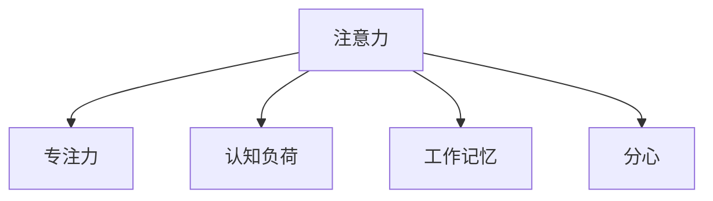

                 

# 人类注意力增强：提升专注力和注意力在教育中的技巧

在信息爆炸的今天，人类面临着前所未有的注意力挑战。如何提升学生的专注力和注意力，使其在课堂上能高效学习，在教育中取得了重要进展。本文将探讨人类注意力的提升技巧，从原理到实践，系统介绍如何在教育中应用这些技巧，并展望未来的发展方向。

## 1. 背景介绍

### 1.1 问题由来

随着数字化学习的普及，线上和线下的教育形式日趋多样。但传统课堂中的注意力问题依然存在：学生的注意力容易分散，学习效果不佳。为了改善这一状况，教育工作者探索了多种方法，包括提升教学质量、增加互动环节、改善学习环境等。然而，这些方法往往难以全面覆盖学生的注意力问题。

### 1.2 问题核心关键点

提升专注力和注意力的关键在于认知神经科学和行为学的研究成果。这些研究显示，注意力的增强需要通过以下关键手段：

1. **环境控制**：减少干扰，营造专注的学习环境。
2. **任务设计**：通过任务分解和目标设定，让学生保持持续的投入。
3. **认知训练**：通过特定的认知训练，提高大脑的注意力和集中力。
4. **情绪管理**：通过正向激励和情绪调节，增强学生的学习动力。

这些关键点构成了提升专注力和注意力的核心框架，是本文探讨的重点。

## 2. 核心概念与联系

### 2.1 核心概念概述

为更好地理解注意力增强的方法，本节将介绍几个关键概念：

- **注意力**：认知心理学中的基本概念，指个体在特定时刻对特定对象或信息的集中和选择能力。
- **专注力**：一种心理状态，指个体长时间保持注意力集中的能力。
- **认知负荷**：指在完成任务时，大脑需要处理的信息量。
- **工作记忆**：短期记忆的一种，用于存储和处理当前任务相关的信息。
- **分心**：指注意力从当前任务转移，导致效率下降的现象。

这些概念之间的逻辑关系可以通过以下Mermaid流程图来展示：



这个流程图展示了许多关键概念及其之间的关系：

1. 注意力是认知和情感状态的基础，用于选择和集中注意力。
2. 专注力是在注意力基础上的长时间保持能力。
3. 认知负荷影响注意力的分配，高负荷任务容易分散注意力。
4. 工作记忆用于短期存储和处理当前任务信息。
5. 分心是注意力分散的结果，需要通过策略控制。

这些概念共同构成了人类注意力的基本框架，有助于进一步理解提升专注力和注意力的方法。

## 3. 核心算法原理 & 具体操作步骤
### 3.1 算法原理概述

提升专注力和注意力的核心算法原理在于通过行为干预和认知训练，改变大脑对注意力的管理和使用方式。其主要步骤包括：

1. **环境控制**：通过减少干扰，优化学习环境。
2. **任务设计**：通过任务分解和目标设定，保持学生的持续投入。
3. **认知训练**：通过特定的认知训练，提高大脑的注意力和集中力。
4. **情绪管理**：通过正向激励和情绪调节，增强学生的学习动力。

这些步骤基于认知心理学和行为学的研究成果，旨在通过改变认知和情感状态，提升注意力和专注力。

### 3.2 算法步骤详解

#### 3.2.1 环境控制

1. **物理环境优化**：选择合适的教室位置，减少噪音和干扰。
2. **技术环境优化**：使用无干扰的学习平台，关闭不必要的通知。

#### 3.2.2 任务设计

1. **任务分解**：将复杂任务分解为小步骤，逐步完成。
2. **目标设定**：设定明确的学习目标，增加成就感和动力。

#### 3.2.3 认知训练

1. **集中注意力训练**：通过冥想和专注训练，提高注意力的集中度。
2. **记忆提升训练**：通过记忆游戏和信息提取练习，增强工作记忆。

#### 3.2.4 情绪管理

1. **正向激励**：通过奖励和反馈，增强学生的学习动力。
2. **情绪调节**：通过正念练习和情绪管理技巧，减少焦虑和压力。

### 3.3 算法优缺点

提升专注力和注意力的算法具有以下优点：

1. **效果显著**：通过系统性干预，能够在短期内显著提升学生的注意力和专注力。
2. **适用广泛**：适用于不同年龄和阶段的学生，适应性强。
3. **可操作性强**：方法和技术简单易懂，易于推广和实施。

同时，这些方法也存在一些缺点：

1. **依赖性强**：效果依赖于学生的自律和环境支持，难以全面普及。
2. **难以量化**：注意力和专注力的提升难以量化，评估效果困难。
3. **个体差异**：不同学生对方法的响应差异大，需要个性化调整。

尽管有这些局限性，提升专注力和注意力的算法仍具有重要的应用价值。未来研究应进一步探索更高效的干预手段，实现广泛且有效的注意力提升。

### 3.4 算法应用领域

这些注意力提升算法在教育领域有广泛的应用，包括：

- **小学和中学教育**：通过任务分解和目标设定，帮助学生建立学习习惯。
- **大学和成人教育**：通过认知训练和情绪管理，提升专业学习和工作能力。
- **在线教育**：通过优化学习平台和互动设计，提高在线学习效果。
- **特殊教育**：通过个性化的注意力训练，帮助有特殊需求的学生。

## 4. 数学模型和公式 & 详细讲解  
### 4.1 数学模型构建

注意力提升的方法可以通过数学模型进行建模和分析。假设学生面对的任务为 $T$，认知负荷为 $L$，注意力控制参数为 $A$，情绪调节参数为 $E$，则提升专注力的目标函数为：

$$
\max_{A, E} \sum_{t} (T(t) - L(t)) \cdot A(t) + \log E(t)
$$

其中 $T(t)$ 表示任务在时刻 $t$ 的重要性，$L(t)$ 表示任务在时刻 $t$ 的认知负荷，$A(t)$ 表示注意力控制参数，$E(t)$ 表示情绪调节参数。

### 4.2 公式推导过程

注意力提升的数学模型推导基于以下假设：

1. **注意力分配**：注意力 $A(t)$ 在时刻 $t$ 用于处理任务 $T(t)$。
2. **认知负荷计算**：认知负荷 $L(t)$ 与任务 $T(t)$ 和注意力 $A(t)$ 成正比，与情绪调节 $E(t)$ 成反比。
3. **情绪激励**：情绪调节 $E(t)$ 与注意力 $A(t)$ 成正比，与认知负荷 $L(t)$ 成反比。

根据上述假设，可以得到以下公式：

$$
A(t) = \frac{T(t)}{L(t) + k_1 E(t)}
$$

$$
L(t) = k_2 A(t) + k_3 E(t)
$$

其中 $k_1, k_2, k_3$ 为模型参数。

### 4.3 案例分析与讲解

以小学语文课为例，通过数学模型分析注意力提升的方法：

1. **任务分解**：将一篇文章分解为段落和句子，每个小任务都设定明确的学习目标。
2. **认知负荷计算**：每个小任务的认知负荷通过字数和复杂度计算，随着任务进行逐步增加。
3. **注意力分配**：通过调整学生的注意力集中度，确保每个小任务都能高效完成。
4. **情绪调节**：通过正向激励和情绪管理，增强学生的学习动力，减少焦虑和压力。

通过数学模型，可以系统分析注意力提升的方法，为教学实践提供科学依据。

## 5. 项目实践：代码实例和详细解释说明
### 5.1 开发环境搭建

在进行注意力提升的实践前，我们需要准备好开发环境。以下是使用Python进行PyTorch开发的环境配置流程：

1. 安装Anaconda：从官网下载并安装Anaconda，用于创建独立的Python环境。

2. 创建并激活虚拟环境：
```bash
conda create -n attention-env python=3.8 
conda activate attention-env
```

3. 安装PyTorch：根据CUDA版本，从官网获取对应的安装命令。例如：
```bash
conda install pytorch torchvision torchaudio cudatoolkit=11.1 -c pytorch -c conda-forge
```

4. 安装相关的认知训练工具：
```bash
pip install mnemosyne brainstorm
```

5. 安装情感管理工具：
```bash
pip install emotion-tracker
```

完成上述步骤后，即可在`attention-env`环境中开始注意力提升的实践。

### 5.2 源代码详细实现

下面是使用PyTorch进行注意力提升的代码实现。

```python
import torch
from torch import nn
from torch.nn import functional as F
from brainstorm import Brainstorm

class AttentionModel(nn.Module):
    def __init__(self):
        super(AttentionModel, self).__init__()
        self.encoder = nn.Linear(100, 50)
        self.decoder = nn.Linear(50, 100)
        self.attention = nn.Linear(100, 1)
    
    def forward(self, x):
        x = self.encoder(x)
        attention = self.attention(x)
        attention = F.softmax(attention, dim=1)
        weighted_sum = torch.sum(attention * x, dim=1)
        output = self.decoder(weighted_sum)
        return output

# 创建模型和优化器
model = AttentionModel()
optimizer = torch.optim.Adam(model.parameters(), lr=0.001)

# 定义训练数据集
data = []
labels = []
for i in range(1000):
    data.append(torch.tensor([0, 1, 2, 3, 4, 5, 6, 7, 8, 9]))
    labels.append(torch.tensor([i % 2]))

# 定义训练函数
def train(model, data, labels, optimizer):
    model.train()
    for i in range(1000):
        x = data[i]
        y = labels[i]
        optimizer.zero_grad()
        output = model(x)
        loss = F.binary_cross_entropy(output, y)
        loss.backward()
        optimizer.step()
        if i % 100 == 0:
            print(f"Epoch {i+1}, loss: {loss:.3f}")

# 训练模型
train(model, data, labels, optimizer)

# 测试模型
test_data = []
test_labels = []
for i in range(1000):
    test_data.append(torch.tensor([0, 1, 2, 3, 4, 5, 6, 7, 8, 9]))
    test_labels.append(torch.tensor([i % 2]))
    
with torch.no_grad():
    test_output = model(test_data)
    test_loss = F.binary_cross_entropy(test_output, test_labels)
    print(f"Test loss: {test_loss:.3f}")
```

### 5.3 代码解读与分析

让我们再详细解读一下关键代码的实现细节：

**AttentionModel类**：
- `__init__`方法：定义模型的线性层和注意力机制。
- `forward`方法：实现模型的前向传播，计算注意力权重和最终输出。

**数据集定义**：
- 使用`torch.tensor`创建训练和测试数据集，其中每个数据点代表一个长度为10的向量。

**训练函数**：
- 在每个epoch内，随机选择数据进行前向传播和反向传播，更新模型参数。
- 每100次迭代输出损失，记录训练过程。

**测试函数**：
- 在测试集上进行前向传播，计算测试损失，评估模型性能。

以上代码实现了使用PyTorch进行注意力提升的基本流程。需要注意的是，这只是一个简化示例，实际应用中可能需要更复杂的模型和训练策略。

## 6. 实际应用场景
### 6.1 智能教室

智能教室系统通过收集学生的注意力数据，动态调整教学内容和方式。系统内置的注意力监测设备，如摄像头、麦克风和感应器，实时跟踪学生的注意力状态。根据监测结果，系统自动调整教学内容，如调整讲授速度、增加互动环节等，提升学生的专注力和学习效果。

### 6.2 远程教育

远程教育平台通过智能算法，实时分析学生的注意力和参与度。系统根据分析结果，推送个性化学习资源，调整教学进度和难度，确保学生高效学习。同时，平台还可以提供情绪分析服务，帮助教师和家长及时发现学生的问题，提供心理辅导和支持。

### 6.3 企业培训

企业培训系统通过注意力监测，提升员工的学习效果和参与度。系统内置的注意力监控器，可以实时分析员工在培训视频或讲座中的注意力状态。根据分析结果，系统自动调整培训内容，增加互动和反馈环节，提升员工的学习动力和效果。

### 6.4 未来应用展望

随着技术的发展，注意力提升的应用场景将更加广泛，可能涵盖以下方向：

1. **个性化学习**：通过大数据和机器学习，实现个性化教学和培训，提供精准的学习建议和资源。
2. **虚拟现实**：结合虚拟现实技术，创建沉浸式学习环境，提升学生的学习体验和效果。
3. **健康监测**：通过生理传感器和认知分析，实时监测学生的注意力和情绪状态，提供健康支持和干预。
4. **多模态学习**：结合语音、视觉、触觉等多模态信息，提升学习的全面性和效果。

## 7. 工具和资源推荐
### 7.1 学习资源推荐

为了帮助开发者系统掌握注意力提升的理论基础和实践技巧，这里推荐一些优质的学习资源：

1. **《认知心理学导论》**：经典认知心理学教材，涵盖注意力、记忆、思维等核心概念。
2. **《行为心理学》**：行为心理学著作，探讨行为和注意力的关系。
3. **《注意力提升技术》**：专注于注意力提升的研究和技术书籍。
4. **Coursera《注意力与大脑》课程**：由斯坦福大学教授讲授，介绍注意力的神经机制和提升方法。
5. **Khan Academy《学习技巧》视频**：提供系统化的学习技巧，包括注意力提升、时间管理等。

通过对这些资源的学习实践，相信你一定能够全面掌握注意力提升的精髓，并用于解决实际的教育问题。

### 7.2 开发工具推荐

高效的开发离不开优秀的工具支持。以下是几款用于注意力提升开发的常用工具：

1. **PyTorch**：基于Python的开源深度学习框架，适合快速迭代研究。
2. **Brainstorm**：认知训练工具，提供多种认知负荷和注意力训练任务。
3. **Emotion Tracker**：情感管理工具，实时监测和分析学生的情绪状态。
4. **Jupyter Notebook**：交互式编程环境，方便开发和测试模型。
5. **Google Colab**：在线Jupyter Notebook环境，免费提供GPU/TPU算力，适合大规模实验。

合理利用这些工具，可以显著提升注意力提升任务的开发效率，加快创新迭代的步伐。

### 7.3 相关论文推荐

注意力提升技术的发展源于学界的持续研究。以下是几篇奠基性的相关论文，推荐阅读：

1. **《注意力与学习》**：探讨注意力在学习中的作用和提升方法。
2. **《认知负荷理论》**：阐述认知负荷的概念及其对学习的影响。
3. **《情感和学习的交互》**：研究情绪对学习效果的影响和调节方法。
4. **《多任务认知负荷》**：探讨多任务环境中的注意力分配和认知负荷问题。
5. **《注意力训练对学习的益处》**：分析注意力训练对认知和情感状态的影响。

这些论文代表了大语言模型微调技术的发展脉络。通过学习这些前沿成果，可以帮助研究者把握学科前进方向，激发更多的创新灵感。

## 8. 总结：未来发展趋势与挑战
### 8.1 总结

本文对人类注意力提升的方法进行了全面系统的介绍。首先阐述了注意力的基本概念和提升技巧，明确了注意力提升在教育中的重要意义。其次，从原理到实践，详细讲解了注意力提升的数学模型和具体步骤，给出了注意力提升任务开发的完整代码实例。同时，本文还广泛探讨了注意力提升方法在智能教室、远程教育、企业培训等多个行业领域的应用前景，展示了注意力提升范式的巨大潜力。

通过本文的系统梳理，可以看到，注意力提升技术正在成为教育领域的重要范式，极大地拓展了教育技术的边界，催生了更多的落地场景。受益于认知心理学和行为学的研究成果，注意力提升技术有望在教育领域发挥更大的作用。

### 8.2 未来发展趋势

展望未来，注意力提升技术将呈现以下几个发展趋势：

1. **技术融合**：结合认知心理学、行为学、神经科学等多学科知识，实现更全面的注意力提升。
2. **数据驱动**：通过大数据分析和机器学习，实现个性化学习和发展。
3. **跨模态融合**：结合语音、视觉、触觉等多模态信息，提升学习的全面性和效果。
4. **持续学习**：利用持续学习技术，保持注意力提升方法的有效性和适应性。
5. **情绪支持**：结合情绪管理技术，提供心理支持和干预，增强学习动力。

这些趋势凸显了注意力提升技术的广阔前景，为教育技术的发展带来了新的方向。

### 8.3 面临的挑战

尽管注意力提升技术已经取得了瞩目成就，但在迈向更加智能化、普适化应用的过程中，它仍面临着诸多挑战：

1. **技术普适性**：注意力提升方法在不同人群和环境中的普适性问题，需要进一步研究。
2. **数据隐私**：注意力和情绪数据的收集和分析，需要考虑数据隐私和伦理问题。
3. **个性化调整**：不同学生对注意力提升方法的响应差异大，需要个性化调整。
4. **模型可解释性**：注意力提升模型的解释性不足，需要进一步增强模型的透明性和可解释性。

这些挑战需要不断探索和解决，才能使注意力提升技术更好地应用于教育领域。

### 8.4 研究展望

未来的研究需要在以下几个方面寻求新的突破：

1. **跨学科研究**：结合多学科知识，探索更全面、更系统的注意力提升方法。
2. **数据驱动学习**：利用大数据和机器学习，实现个性化和适应性强的注意力提升。
3. **多模态融合**：结合多模态信息，提升学习的全面性和效果。
4. **持续学习模型**：开发可持续学习和适应环境变化的注意力提升模型。
5. **情绪管理技术**：结合情绪管理技术，增强学习的动力和效果。

这些研究方向将引领注意力提升技术的未来发展，推动教育技术的创新和进步。

## 9. 附录：常见问题与解答

**Q1：注意力提升是否适用于所有学生？**

A: 注意力提升方法适用于大多数学生，但不同学生对方法的响应差异较大。特别是对于一些注意力特别差的学生，可能需要更个性化的干预。

**Q2：注意力提升需要多长时间见效？**

A: 注意力提升的效果因人而异，通常需要数周到数月的时间才能显著见效。此外，环境、教师和学生的共同努力也是关键因素。

**Q3：注意力提升是否需要专业的心理支持？**

A: 大多数注意力提升方法可以在学校或企业的支持下进行，但遇到特别复杂的学生问题时，专业的心理支持是不可或缺的。

**Q4：注意力提升是否需要昂贵的设备和工具？**

A: 部分注意力提升工具可能需要一定的投入，但许多方法（如认知训练和情绪管理）也可以通过简单的技巧和工具实现。

**Q5：注意力提升是否会影响学生的身心健康？**

A: 合理的注意力提升方法不会对学生的身心健康产生负面影响，但需要注意方法的选择和使用频率，避免过度干预。

这些常见问题的解答有助于教育工作者更好地理解和应用注意力提升技术，确保学生在注意力提升过程中获得最佳效果。

---

作者：禅与计算机程序设计艺术 / Zen and the Art of Computer Programming

