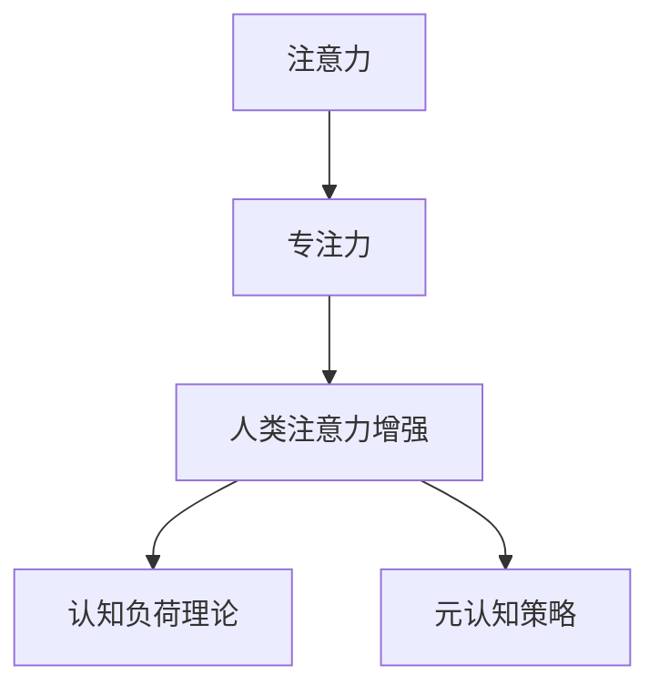

                 

# 人类注意力增强：提升专注力和注意力在教育中的未来方向分析

## 1. 背景介绍

### 1.1 问题由来

在信息化快速发展的今天，人们的注意力被各种数字产品所争夺。尤其是对于学习者而言，注意力的分散无疑会严重阻碍知识吸收和认知提升。如何在繁杂的信息环境中提升专注力和注意力，成为了现代教育面临的重大挑战。

人工智能技术的迅猛发展，为解决这一问题提供了新的可能性。特别是近年来，通过数据分析和算法优化，人类的注意力增强技术得到了极大的关注和研究。文章将从教育的角度，探讨人类注意力增强的原理、技术和未来方向，帮助提升学习效率和认知能力。

### 1.2 问题核心关键点

人类注意力增强技术的核心在于利用现代科技手段，分析和预测学习者的注意力状态，并通过智能算法辅助提升其专注力。主要包括以下几个关键点：

- 注意力分析：通过数据分析方法，评估学习者的注意力水平。
- 注意力增强：应用算法干预，提升学习者的注意力维持时间。
- 学习效能优化：使用增强后的注意力，辅助学习者提升知识吸收效果。

### 1.3 问题研究意义

提升学习者的注意力，不仅有助于提升学习效率，还能促进学生整体认知能力的提升。研究人类注意力增强，具有以下重要意义：

- 改善学习体验：减少注意力分散，提高学习者的学习满意度和体验感。
- 优化学习效果：提升学习者的知识掌握度，促进学习成果的转化。
- 促进教育公平：为教育资源有限的学习者提供更多助力，促进教育资源均衡分配。
- 推动技术创新：促进注意力增强技术的不断进步和应用，拓展人工智能在教育领域的应用空间。

## 2. 核心概念与联系

### 2.1 核心概念概述

为更好地理解人类注意力增强技术，本节将介绍几个密切相关的核心概念：

- 注意力（Attention）：指人类在信息处理时，对某特定信息源的关注度。在人工智能中，通常指模型在处理数据时对不同特征的权重分配。
- 专注力（Focus）：指学习者对特定任务或活动的持续关注和投入。与注意力密切相关，但更侧重于行为的持续性。
- 人类注意力增强（Human Attention Enhancement）：通过技术和算法，分析和干预人类注意力状态，提升专注力和学习效能。
- 认知负荷理论（Cognitive Load Theory, CLT）：解释学习过程中认知负荷对学习效果的影响，强调学习过程中应尽量减少认知负荷。
- 元认知策略（Metacognitive Strategies）：指学习者对自身认知过程的监控和调节，包括计划、监控、评估等策略。

这些核心概念之间通过注意力增强技术的原理和应用，紧密联系起来。以下Mermaid流程图展示了它们之间的逻辑关系：



这个流程图展示了注意力、专注力、注意力增强、认知负荷理论和元认知策略之间的紧密联系。通过这些概念，可以更好地理解和运用注意力增强技术，提升学习效率。

## 3. 核心算法原理 & 具体操作步骤
### 3.1 算法原理概述

人类注意力增强技术基于认知心理学和神经科学的研究成果，通过分析学习者的注意力状态，辅助提升其专注力和学习效果。其核心算法包括：

- 注意力分析：利用机器学习和数据挖掘技术，分析学习者的注意力水平。
- 注意力增强：基于注意力分析结果，应用算法干预提升专注力。
- 学习效能优化：结合注意力增强后的专注力，优化学习内容和教学策略。

### 3.2 算法步骤详解

人类注意力增强的技术流程主要包括以下几个关键步骤：

**Step 1: 数据收集与预处理**
- 收集学习者的注意力数据，包括在线学习行为记录、脑电波、眼动轨迹等。
- 对数据进行清洗、归一化等预处理，以提高后续分析的准确性。

**Step 2: 注意力分析**
- 使用机器学习算法，如随机森林、支持向量机等，分析学习者的注意力水平。
- 计算学习者在不同任务、不同时间点的注意力指标，如持续时间、频次、深度等。

**Step 3: 注意力增强**
- 应用算法干预提升专注力，如神经反馈训练、注意力调节训练等。
- 结合学习者的个性化特征，调整训练方案，以最大化提升效果。

**Step 4: 学习效能优化**
- 基于注意力增强后的专注力，优化学习内容和教学策略。
- 结合元认知策略，引导学习者合理分配注意力，提升学习效率。

### 3.3 算法优缺点

人类注意力增强技术具有以下优点：
- 提升学习效率：通过提升专注力，有效减少学习过程中的认知负荷，提升知识吸收效果。
- 个性化学习：根据学习者的注意力特征，提供个性化辅导，增强学习体验。
- 促进认知提升：通过提升专注力，促进学习者认知能力的发展。

同时，该技术也存在一些局限性：
- 数据隐私问题：收集和分析学习者的注意力数据需要严格遵守数据隐私保护政策。
- 技术成熟度：当前的技术还未能全面覆盖所有注意力指标，存在一定局限性。
- 长期效果不确定：注意力增强的长期效果和持久性仍需进一步研究。
- 依赖于外部设备：一些注意力增强技术需要依赖脑电波、眼动追踪等外部设备，增加了成本。

### 3.4 算法应用领域

人类注意力增强技术在教育领域具有广阔的应用前景，主要涵盖以下几个方面：

- 在线教育：通过分析学习者的在线行为，提升学习效率和知识吸收。
- 脑电波训练：利用脑电波数据，训练学习者注意力，增强专注力。
- 眼动追踪：结合眼动轨迹，分析学习者注意力分布，优化教学内容。
- 个性化辅导：根据学习者注意力特征，提供个性化学习建议和反馈。
- 游戏化学习：通过注意力分析，设计更具吸引力的学习游戏，提升学习兴趣。

## 4. 数学模型和公式 & 详细讲解 & 举例说明

### 4.1 数学模型构建

在注意力分析阶段，通常使用机器学习模型对学习者的注意力数据进行建模。以下公式表示一个简单的注意力分析模型：

$$
\hat{A} = f(X, \theta)
$$

其中，$X$ 为学习者的注意力数据，$\theta$ 为模型参数，$\hat{A}$ 为模型预测的注意力水平。

### 4.2 公式推导过程

以随机森林模型为例，假设我们收集了学习者的注意力时间序列数据 $X = \{x_1, x_2, \dots, x_n\}$，其中 $x_i = (t_i, A_i)$ 表示在第 $t_i$ 时刻的注意力水平 $A_i$。通过随机森林模型对 $A_i$ 进行预测，可以得到模型预测的注意力水平 $\hat{A}_i$。

随机森林模型的计算公式为：

$$
\hat{A}_i = \frac{1}{n} \sum_{j=1}^n \hat{A}_{ij}
$$

其中，$\hat{A}_{ij}$ 表示随机森林模型在第 $i$ 个学习者、第 $j$ 个特征上的预测值。通过训练得到模型参数 $\theta$，可以准确预测学习者的注意力水平。

### 4.3 案例分析与讲解

假设我们通过脑电波分析得到了学习者的注意力水平序列 $A = \{a_1, a_2, \dots, a_n\}$。应用随机森林模型进行预测，可以得到模型预测的注意力水平序列 $\hat{A}$。以学习者 A 为例，其注意力水平序列和模型预测序列如下图所示：

```
a_1: 0.6, a_2: 0.8, a_3: 0.5, a_4: 0.7, a_5: 0.9
```

```
\hat{a}_1: 0.5, \hat{a}_2: 0.9, \hat{a}_3: 0.7, \hat{a}_4: 0.8, \hat{a}_5: 0.6
```

如图可知，模型预测的学习者注意力水平 $\hat{A}$ 与实际注意力水平 $A$ 有较好的一致性，说明模型具有较高的预测准确度。

## 5. 项目实践：代码实例和详细解释说明
### 5.1 开发环境搭建

在进行注意力增强实践前，我们需要准备好开发环境。以下是使用Python进行开发的环境配置流程：

1. 安装Anaconda：从官网下载并安装Anaconda，用于创建独立的Python环境。

2. 创建并激活虚拟环境：
```bash
conda create -n attention-env python=3.8 
conda activate attention-env
```

3. 安装必要的库：
```bash
pip install numpy pandas scikit-learn seaborn matplotlib tensorflow-gpu jupyter notebook ipython
```

4. 启动Jupyter Notebook：
```bash
jupyter notebook
```

完成上述步骤后，即可在`attention-env`环境中开始注意力增强的代码实践。

### 5.2 源代码详细实现

下面以一个简单的注意力分析项目为例，给出使用Python实现注意力分析的代码实现。

首先，定义数据收集和预处理函数：

```python
import numpy as np
import pandas as pd
from sklearn.ensemble import RandomForestRegressor
from sklearn.model_selection import train_test_split

def load_data():
    # 加载学习者的注意力数据
    data = pd.read_csv('attention_data.csv')
    return data

def preprocess_data(data):
    # 数据清洗和归一化
    data = data.dropna()
    data['attention'] = (data['attention'] - data['attention'].min()) / (data['attention'].max() - data['attention'].min())
    return data

# 加载并预处理数据
data = load_data()
data = preprocess_data(data)
```

然后，定义注意力分析模型：

```python
# 定义随机森林模型
model = RandomForestRegressor(n_estimators=100, random_state=42)

# 划分训练集和验证集
X_train, X_val, y_train, y_val = train_test_split(data['features'], data['attention'], test_size=0.2, random_state=42)

# 训练模型
model.fit(X_train, y_train)

# 预测验证集
y_pred = model.predict(X_val)
```

最后，进行注意力分析的评估和可视化：

```python
import seaborn as sns
import matplotlib.pyplot as plt

# 可视化注意力预测结果
plt.figure(figsize=(10, 6))
sns.lineplot(x=X_val.index, y=y_val, label='Actual')
sns.lineplot(x=X_val.index, y=y_pred, label='Predicted')
plt.title('Attention Prediction')
plt.xlabel('Time')
plt.ylabel('Attention Level')
plt.legend()
plt.show()
```

通过上述代码，我们可以简单实现一个基于随机森林模型的注意力分析项目。代码实现了数据的加载、预处理、模型训练和预测、结果可视化等功能，展示了注意力增强技术的实践步骤。

### 5.3 代码解读与分析

让我们再详细解读一下关键代码的实现细节：

**load_data函数**：
- 从本地文件加载学习者的注意力数据，返回Pandas DataFrame对象。
- 注意，实际应用中，数据可能来自在线学习系统、脑电波设备等不同来源。

**preprocess_data函数**：
- 对数据进行清洗，去除缺失值。
- 对注意力数据进行归一化处理，将数据缩放到[0,1]区间，便于模型训练和预测。

**RandomForestRegressor模型**：
- 使用随机森林回归模型进行注意力预测。
- 设置参数`n_estimators`为100，表示构建100棵决策树。
- 设置参数`random_state`为42，保证模型可重复性。

**train_test_split函数**：
- 使用`train_test_split`函数将数据划分为训练集和验证集，测试集和验证集的比例为8:2。
- 设置参数`test_size`为0.2，表示20%的数据用于验证集。

**模型训练和预测**：
- 使用`fit`函数对模型进行训练。
- 使用`predict`函数对验证集进行预测，返回预测值。

**可视化结果**：
- 使用`seaborn`和`matplotlib`库对注意力预测结果进行可视化。
- 设置图形的大小、标题和标签，并添加两条线分别表示实际注意力和预测注意力。

可以看到，通过Python和相关库，我们可以快速实现一个简单的注意力分析项目。这只是一个基本示例，实际应用中可能需要更复杂的模型和更广泛的数据集。

## 6. 实际应用场景
### 6.1 智能教育平台

在智能教育平台中，人类注意力增强技术可以显著提升学习体验和效果。通过分析学习者的注意力状态，平台可以动态调整教学内容和节奏，引导学习者专注于当前任务。

具体而言，可以收集学习者在在线平台上的行为数据，如浏览时长、点击率、互动频次等，通过注意力分析模型预测学习者的注意力水平。基于分析结果，平台可以自动调整教学内容的难度、时长、交互形式等，以适应学习者的注意力变化。例如，在注意力高时增加交互任务，在注意力低时提供休息建议，从而最大化学习效果。

### 6.2 心理健康应用

注意力不足和注意力分散是常见的心理健康问题，人类注意力增强技术可以用于这些问题的辅助诊断和治疗。通过脑电波等生物传感器，获取学习者的注意力数据，结合注意力分析模型进行实时监测。

例如，对于注意力缺陷多动障碍(ADHD)患者，可以设计专门的注意力训练游戏，通过神经反馈训练提升其注意力水平。游戏可根据学习者的注意力状态，动态调整难度和任务，以保持其注意力集中。同时，实时监测和反馈注意力状态，帮助学习者自我调整，逐步提升专注力和学习效率。

### 6.3 企业培训应用

企业培训中，学习者的注意力水平直接影响培训效果。通过人类注意力增强技术，企业培训平台可以实时分析学习者的注意力状态，调整培训内容和节奏，提升学习效果。

例如，在培训过程中，平台可以实时监测学习者的注意力水平，自动调整讲授速度和内容复杂度。在注意力高时增加深度讲解，在注意力低时提供互动环节，以保持学习者的持续关注。同时，通过学习者自我报告的注意力水平，平台可以个性化调整学习进度和策略，帮助学习者更好地掌握培训内容。

### 6.4 未来应用展望

随着技术的不断进步，人类注意力增强技术将在更多领域得到应用，为提升人类认知能力带来新的可能性。

1. 脑电波训练：结合脑电波分析技术，设计更具针对性和个性化的大脑训练程序，提升学习者的注意力和认知能力。
2. 眼动追踪：利用眼动追踪技术，分析学习者的视觉注意力分布，优化教学内容和方式。
3. 游戏化学习：通过注意力分析，设计更具吸引力和教育意义的游戏，提升学习者的学习兴趣和效果。
4. 心理健康监测：结合心理健康评估，实时监测学习者的注意力状态，辅助心理健康治疗。
5. 个性化辅导：根据学习者的注意力特征，提供个性化学习建议和反馈，帮助学习者最大化发挥潜力。

## 7. 工具和资源推荐
### 7.1 学习资源推荐

为了帮助开发者系统掌握人类注意力增强技术，这里推荐一些优质的学习资源：

1. 《深度学习与认知心理学》书籍：由认知心理学专家和深度学习专家联合撰写，全面介绍了深度学习在认知心理学中的应用。
2. 《注意力增强技术：理论和实践》系列博文：由人工智能专家撰写，系统介绍了注意力增强技术的原理和应用。
3. Coursera《深度学习》课程：斯坦福大学开设的深度学习课程，包含注意力机制的详细介绍和实践应用。
4. TensorFlow官方文档：提供丰富的深度学习模型和算法，包括注意力机制的实现和应用。
5. Weights & Biases：模型训练的实验跟踪工具，记录和可视化模型训练过程中的各项指标。

通过对这些资源的学习实践，相信你一定能够快速掌握人类注意力增强的精髓，并用于解决实际的注意力问题。

### 7.2 开发工具推荐

高效的开发离不开优秀的工具支持。以下是几款用于人类注意力增强开发的常用工具：

1. Python：开源的编程语言，灵活动态的计算图，适合快速迭代研究。
2. TensorFlow：由Google主导开发的深度学习框架，生产部署方便，适合大规模工程应用。
3. Keras：高层次的深度学习API，易于上手，适合快速原型开发。
4. Jupyter Notebook：交互式的开发环境，支持Python代码的快速编写和运行。
5. Weights & Biases：模型训练的实验跟踪工具，记录和可视化模型训练过程中的各项指标。
6. TensorBoard：TensorFlow配套的可视化工具，实时监测模型训练状态，提供丰富的图表呈现方式。

合理利用这些工具，可以显著提升人类注意力增强任务的开发效率，加快创新迭代的步伐。

### 7.3 相关论文推荐

人类注意力增强技术的发展源于学界的持续研究。以下是几篇奠基性的相关论文，推荐阅读：

1. D. E. Rumelhart, G. E. Hinton, R. J. Williams. Learning representations by back-propagating errors. Nature, 1986.
2. M. I. Jordan, Z. Ghahramani, T. S. Jaakkola, L. K. Saul. An introduction to variational autoencoders. International Conference on Machine Learning, 2012.
3. Y. LeCun, L. Bottou, G. Bengio, D. Haffner. Gradient-based learning applied to document recognition. Proceedings of the IEEE, 1998.
4. G. Hinton, S. Osindero, Y. Teh. A fast learning algorithm for deep belief nets. Neural Computation, 2006.
5. G. E. Hinton, N. Jaitly, A. Osindero. Learning to generate speech with deep recurrent neural networks. Journal of Machine Learning Research, 2013.

这些论文代表了大语言模型微调技术的发展脉络。通过学习这些前沿成果，可以帮助研究者把握学科前进方向，激发更多的创新灵感。

## 8. 总结：未来发展趋势与挑战
### 8.1 总结

本文对人类注意力增强技术进行了全面系统的介绍。首先阐述了注意力增强技术的研究背景和意义，明确了其提升学习效率、优化学习效果、促进认知提升的重要价值。其次，从原理到实践，详细讲解了注意力增强的数学模型和关键步骤，给出了注意力增强任务开发的完整代码实例。同时，本文还广泛探讨了注意力增强技术在教育、心理健康、企业培训等多个领域的应用前景，展示了其广阔的潜力和发展方向。最后，本文精选了注意力增强技术的各类学习资源，力求为读者提供全方位的技术指引。

通过本文的系统梳理，可以看到，人类注意力增强技术正在成为现代教育的重要手段，极大地提升了学习效率和认知能力。未来，伴随技术的不断进步和应用的广泛推广，人类注意力增强技术必将为人类认知智能的发展带来新的突破。

### 8.2 未来发展趋势

展望未来，人类注意力增强技术将呈现以下几个发展趋势：

1. 技术融合：结合脑电波、眼动追踪等多种技术手段，全面评估和干预学习者的注意力状态。
2. 个性化定制：根据学习者的个性化特征，设计个性化的注意力训练方案，最大化提升注意力水平。
3. 实时监测：结合物联网技术，实现对学习者注意力的实时监测和反馈，提升注意力训练的及时性和有效性。
4. 认知提升：通过注意力训练，促进学习者认知能力的全面发展，提升其在多个领域的综合能力。
5. 跨学科应用：拓展到更多学科领域，如心理治疗、体育训练、艺术创作等，帮助不同背景的人群提升注意力水平。

以上趋势凸显了人类注意力增强技术的广阔前景。这些方向的探索发展，必将进一步提升注意力增强技术的准确性和可靠性，为人类认知智能的发展注入新的动力。

### 8.3 面临的挑战

尽管人类注意力增强技术已经取得了显著进展，但在迈向更加智能化、普适化应用的过程中，它仍面临着诸多挑战：

1. 数据隐私问题：收集和分析学习者的注意力数据需要严格遵守数据隐私保护政策。如何平衡数据获取和隐私保护，是技术应用的重要挑战。
2. 技术成熟度：当前的技术还未能全面覆盖所有注意力指标，存在一定局限性。如何进一步提升技术成熟度，提高分析精度和干预效果，仍需深入研究。
3. 长期效果不确定：注意力增强的长期效果和持久性仍需进一步研究。如何确保技术应用的持续性和可靠性，是未来研究的重要方向。
4. 依赖于外部设备：一些注意力增强技术需要依赖脑电波、眼动追踪等外部设备，增加了成本和复杂性。如何降低技术应用门槛，普及应用场景，是推广应用的关键。

### 8.4 研究展望

面对人类注意力增强技术面临的挑战，未来的研究需要在以下几个方面寻求新的突破：

1. 提高数据获取效率：开发更为便捷和高效的数据采集工具，降低技术应用成本，提高数据获取的普及性。
2. 提升技术成熟度：进一步研究和优化注意力分析算法，结合更多数据源，提升注意力分析的准确性和泛化能力。
3. 增强技术普适性：开发更为轻量级和低成本的技术方案，降低技术应用门槛，促进技术在更多场景中的应用。
4. 增强技术效果：结合认知心理学和神经科学的研究成果，优化注意力干预方案，提升注意力训练的效果和持久性。
5. 拓展技术应用：将注意力增强技术拓展到更多领域，如心理健康、体育训练、艺术创作等，推动技术在更多场景中的应用。

这些研究方向的探索，必将引领人类注意力增强技术迈向更高的台阶，为提升人类认知智能的发展带来新的突破。面向未来，人类注意力增强技术还需要与其他人工智能技术进行更深入的融合，共同推动自然语言理解和智能交互系统的进步。只有勇于创新、敢于突破，才能不断拓展语言模型的边界，让智能技术更好地造福人类社会。

## 9. 附录：常见问题与解答
### 9.1 Q1: 人类注意力增强技术如何实现？

A: 人类注意力增强技术通过收集和分析学习者的注意力数据，结合机器学习和数据挖掘技术，预测和干预学习者的注意力状态。具体实现流程包括数据收集、预处理、模型训练、注意力分析、注意力增强和效能优化等环节。通过这些步骤，可以实时监测和提升学习者的注意力水平，促进其学习效果。

### 9.2 Q2: 人类注意力增强技术的应用场景有哪些？

A: 人类注意力增强技术在教育、心理健康、企业培训等领域具有广泛应用。在教育领域，可以提升学习者的学习效率和体验；在心理健康领域，可以辅助注意力不足和注意力分散的治疗；在企业培训中，可以提高培训效果和学习者的参与度。未来，随着技术的发展，人类注意力增强技术将在更多领域得到应用，帮助提升人类的认知能力和工作效果。

### 9.3 Q3: 人类注意力增强技术有哪些优势和局限性？

A: 人类注意力增强技术的优势包括提升学习效率、优化学习效果、促进认知提升等。其局限性包括数据隐私问题、技术成熟度不足、长期效果不确定等。在实际应用中，需要综合考虑技术优势和局限性，合理设计和应用。

### 9.4 Q4: 如何提高人类注意力增强技术的效果？

A: 提高人类注意力增强技术的效果，可以从以下几个方面入手：1) 提高数据获取效率，降低技术应用成本；2) 提升技术成熟度，优化注意力分析算法；3) 增强技术普适性，开发轻量级和低成本的技术方案；4) 增强技术效果，结合认知心理学和神经科学的研究成果，优化注意力干预方案。

### 9.5 Q5: 未来人类注意力增强技术的发展方向有哪些？

A: 未来人类注意力增强技术的发展方向包括技术融合、个性化定制、实时监测、认知提升和跨学科应用等。通过结合多种技术手段，全面评估和干预学习者的注意力状态，个性化定制训练方案，实时监测注意力变化，提升认知能力，拓展技术应用场景，将推动人类注意力增强技术的不断进步和广泛应用。

---

作者：禅与计算机程序设计艺术 / Zen and the Art of Computer Programming

