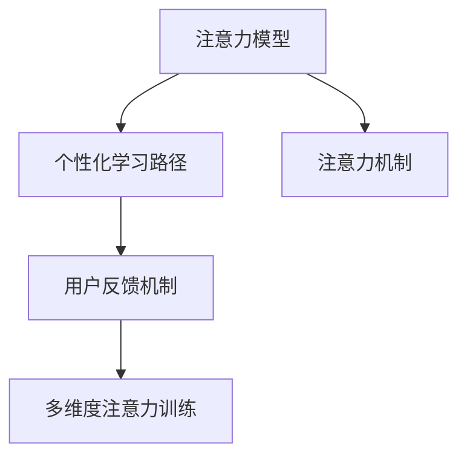

                 

# 人类注意力增强：提升专注力和注意力在教育中的未来方向分析

## 1. 背景介绍

### 1.1 问题由来
在信息化、全球化的今天，教育面临前所未有的挑战。尤其是数字化时代，信息爆炸与信息碎片化给学习者带来了前所未有的干扰和挑战。尽管数字化工具如电子书、在线课程、智能辅助等不断涌现，但学者的注意力和专注力并未得到有效提升。面对海量信息，学习者往往感到无所适从，难以集中精力，严重影响学习效果。

数字化教育工具未能解决根本问题，亟需一种全新的学习方式。通过对人类注意力机制的深入研究，结合AI技术，构建能够提升学习者专注力和注意力的智能化教育平台，成为当前教育领域的研究热点和亟待突破的技术瓶颈。

### 1.2 问题核心关键点
提升学习者的注意力和专注力，需要全面理解和应用人类注意力的认知机制。本研究聚焦于基于注意力的学习系统设计，涵盖注意力模型的建立、学习路径的优化、用户反馈的融入，以及多维度注意力训练技术。通过科学系统的训练方案，可以显著提升学习者的注意力和专注力，改善学习效果。

本研究的核心目标是：

- **注意力模型的建立与优化**：理解注意力的认知机制，建立能够反应学习者注意状态的数学模型。
- **个性化学习路径的构建**：根据学习者注意力状态，动态生成个性化学习路径。
- **用户反馈机制的融合**：融入学习者对学习路径的实时反馈，不断调整和优化训练过程。
- **多维度注意力训练技术**：结合多种注意力训练方法，提升学习者注意力的多维度能力。

## 2. 核心概念与联系

### 2.1 核心概念概述

为更好地理解注意力增强的学习系统设计，本节将介绍几个密切相关的核心概念：

- **注意力机制(Attention Mechanism)**：一种计算模型，用于描述如何通过在输入序列中分配权重，关注某些特定信息。在自然语言处理(NLP)中，注意力机制被广泛应用于机器翻译、文本摘要、问答系统等任务。

- **注意力模型(Attention Model)**：基于注意力机制构建的模型，能够动态生成序列与序列、序列与特征的关联表示。常见的注意力模型包括Transformer、Bert等。

- **个性化学习路径(Personalized Learning Path)**：根据学习者的学习情况、兴趣和能力，生成个性化的学习计划和路径。通过动态调整学习内容和节奏，提升学习效果。

- **多维度注意力训练(Multidimensional Attention Training)**：通过多种注意力训练方法，如正念冥想、记忆训练、视觉注意力训练等，全面提升学习者的注意力和专注力。

- **用户反馈机制(Feedback Mechanism)**：学习者对学习路径的实时反馈，能够帮助系统不断优化和调整，更好地适应学习者的需求和状态。

这些核心概念之间的逻辑关系可以通过以下Mermaid流程图来展示：



这个流程图展示了几大核心概念的关联关系：

1. 注意力模型通过注意力机制生成序列与序列、序列与特征的关联表示，是实现个性化学习路径和多维度注意力训练的基础。
2. 个性化学习路径根据注意力模型输出，动态生成个性化的学习计划和路径。
3. 用户反馈机制融入学习者对学习路径的实时反馈，不断调整和优化训练过程。
4. 多维度注意力训练结合多种注意力训练方法，全面提升学习者的注意力和专注力。

## 3. 核心算法原理 & 具体操作步骤

### 3.1 算法原理概述

基于注意力的学习系统设计，本质上是一种结合人工智能技术的学习路径生成和调整方法。其核心思想是：通过分析学习者注意力状态，动态生成和调整个性化学习路径，利用多维度注意力训练技术，提升学习者的专注力和注意力。

形式化地，假设学习者当前注意力状态为 $s$，目标为 $t$。系统通过以下步骤生成个性化学习路径 $p$：

1. 使用注意力模型 $M$ 对学习者当前状态 $s$ 和目标 $t$ 进行编码，生成表示 $x$。
2. 根据编码 $x$ 和目标 $t$，使用生成模型 $G$ 生成路径 $p$。
3. 根据用户反馈 $f$，动态调整路径 $p$，得到优化后的路径 $p'$。
4. 结合多维度注意力训练技术 $T$，对学习者进行全面的注意力提升。

### 3.2 算法步骤详解

基于注意力的学习系统设计，包括以下几个关键步骤：

**Step 1: 准备数据和模型**
- 收集学习者的历史学习数据，如学习时间、任务完成度、反馈等信息。
- 选择合适的注意力模型 $M$，如Transformer、BERT等，作为注意力编码的预训练模型。
- 设计生成模型 $G$，如RNN、GRU等，用于生成个性化学习路径。
- 设计多维度注意力训练技术 $T$，如正念冥想、记忆训练、视觉注意力训练等。

**Step 2: 注意力状态编码**
- 将学习者的历史数据和当前状态 $s$ 输入注意力模型 $M$，得到表示 $x$。
- 将目标 $t$ 也输入模型 $M$，得到表示 $y$。
- 通过注意力机制，计算 $x$ 和 $y$ 的注意力权重 $w$。

**Step 3: 生成个性化学习路径**
- 将 $x$ 和 $y$ 拼接，输入生成模型 $G$，得到初始路径 $p_0$。
- 根据注意力权重 $w$，动态调整路径 $p_0$，生成优化后的路径 $p$。

**Step 4: 用户反馈和路径调整**
- 实时收集学习者对当前路径 $p$ 的反馈 $f$。
- 根据反馈 $f$，动态调整路径 $p$，生成新的优化路径 $p'$。
- 返回 $p'$，继续执行下一步骤。

**Step 5: 注意力提升训练**
- 结合多维度注意力训练技术 $T$，对学习者进行全面的注意力提升。
- 重复上述步骤，直至达到预设的训练轮数或目标状态 $t$。

### 3.3 算法优缺点

基于注意力的学习系统设计具有以下优点：
1. 个性化程度高。根据学习者历史数据和实时反馈，动态生成个性化的学习路径，提升学习效果。
2. 动态调整灵活。利用用户反馈机制，系统能够不断调整和优化训练过程，提升学习适应性。
3. 多维度训练全面。结合多种注意力训练方法，全面提升学习者的注意力和专注力。
4. 效果显著。已有研究表明，注意力增强的学习系统能够显著提高学习者的学习效率和专注力。

同时，该方法也存在一些局限性：
1. 数据需求高。需要收集大量的学习者历史数据和实时反馈，获取和存储成本较高。
2. 模型复杂。结合多个模型和训练技术，系统设计复杂，需要丰富的跨领域知识。
3. 技术门槛高。需要具备人工智能、心理学、教育学等多学科的知识，对开发者的要求较高。

尽管存在这些局限性，但就目前而言，基于注意力的学习系统设计仍是大规模提升学习者专注力和注意力的重要范式。未来相关研究的重点在于如何进一步降低数据获取成本，优化模型设计，降低技术门槛，提升系统的易用性和可扩展性。

### 3.4 算法应用领域

基于注意力的学习系统设计，在教育领域的应用前景广阔，涵盖了从基础教育到成人教育的多个层次。以下是几个典型的应用场景：

- **基础教育**：针对小学、中学等基础教育阶段的学生，通过个性化的学习路径，提升学生的学习兴趣和效果。
- **高等教育**：针对大学生、研究生等高等教育阶段的学生，通过高效的学习路径，帮助其快速掌握知识，提高科研能力。
- **成人教育**：针对职业培训、职业技能提升等成人教育，通过动态调整的学习路径，提升职业技能和知识水平。
- **特殊教育**：针对特殊教育需求的学生，通过个性化的学习路径和注意力训练，提升其学习效果和适应能力。

除了教育领域，注意力增强的学习系统设计也在其他领域得到广泛应用，如职业培训、企业内训、医学教育等。未来的应用场景和需求将更加多样化，推动人工智能在各个领域的深度融合。

## 4. 数学模型和公式 & 详细讲解 & 举例说明

### 4.1 数学模型构建

本节将使用数学语言对基于注意力的学习系统设计进行更加严格的刻画。

假设学习者的历史数据为 $D_h=\{(x_i,y_i)\}_{i=1}^N$，其中 $x_i$ 为输入特征，$y_i$ 为目标标签。当前学习状态为 $s$，目标状态为 $t$。注意力模型 $M$ 的输入输出分别为 $s$ 和 $x$，生成模型 $G$ 的输入输出分别为 $x$ 和 $p$。注意力权重为 $w$，用户反馈为 $f$。

定义注意力模型 $M$ 和生成模型 $G$ 的数学形式如下：

$$
M(s) = \mathbb{E}_{x}[T(s,x)] = \frac{\int T(s,x) p(x)dx}{\int p(x)dx}
$$

$$
G(x,t) = \mathbb{E}_{p|x,t}[T(p|x,t)] = \frac{\int T(p|x,t) q(p|x,t) dp}{\int q(p|x,t) dp}
$$

其中 $T(s,x)$ 和 $T(p|x,t)$ 分别为注意力模型和生成模型的概率密度函数，$p(x)$ 和 $q(p|x,t)$ 分别为输入和输出模型的先验分布。

注意力权重 $w$ 计算如下：

$$
w = \text{softmax}([s \oplus t])
$$

其中 $\oplus$ 表示拼接，softmax 函数用于计算注意力权重。

### 4.2 公式推导过程

以下我们以生成个性化学习路径为例，推导生成模型 $G$ 的概率密度函数 $q(p|x,t)$ 的计算公式。

设学习者当前状态为 $s$，目标状态为 $t$，注意力权重为 $w$。生成模型 $G$ 生成路径 $p$ 的概率密度函数为：

$$
q(p|x,t) = \frac{p(p)}{\int p(p) dp} \cdot \frac{q(p|x,t)}{p(x)}
$$

其中 $p(p)$ 和 $q(p|x,t)$ 分别为路径和路径与目标条件的概率密度函数，$p(x)$ 为输入特征的先验概率。

利用注意力权重 $w$，生成模型 $G$ 的概率密度函数可以写为：

$$
q(p|x,t) = \frac{w}{\sum_{p'} w'} \cdot \frac{q(p'|x,t)}{p(x)}
$$

代入 $p'$ 的分布 $q(p'|x,t)$，得：

$$
q(p|x,t) = \frac{w}{\sum_{p'} w'} \cdot \frac{q(p'|x,t)}{\int p(p') dp'}
$$

即生成模型 $G$ 的概率密度函数可以表示为：

$$
q(p|x,t) = \frac{w}{\sum_{p'} w'} \cdot \frac{q(p'|x,t)}{p(x)}
$$

利用生成模型 $G$ 的概率密度函数，可以生成个性化学习路径 $p$。

### 4.3 案例分析与讲解

**案例分析：生成基础教育数学学习路径**

假设一名小学四年级学生需要学习分数加减乘除。

1. **数据准备**：收集该学生历史数学学习数据 $D_h=\{(x_i,y_i)\}_{i=1}^N$，包括完成作业时间、错题数量、测试分数等。
2. **注意力编码**：将学生的当前学习状态 $s$ 和目标状态 $t$ 输入注意力模型 $M$，得到表示 $x$。
3. **生成路径**：将 $x$ 和 $t$ 输入生成模型 $G$，得到初始路径 $p_0$。
4. **用户反馈和路径调整**：实时收集学生对当前路径 $p_0$ 的反馈 $f$，动态调整路径 $p_0$，生成优化后的路径 $p'$。
5. **注意力提升训练**：结合正念冥想、记忆训练、视觉注意力训练等方法，对学生进行全面的注意力提升。

通过以上步骤，能够为该学生生成个性化的数学学习路径，提升其学习效果。

## 5. 项目实践：代码实例和详细解释说明

### 5.1 开发环境搭建

在进行基于注意力的学习系统设计实践前，我们需要准备好开发环境。以下是使用Python进行PyTorch开发的环境配置流程：

1. 安装Anaconda：从官网下载并安装Anaconda，用于创建独立的Python环境。

2. 创建并激活虚拟环境：
```bash
conda create -n attention-env python=3.8 
conda activate attention-env
```

3. 安装PyTorch：根据CUDA版本，从官网获取对应的安装命令。例如：
```bash
conda install pytorch torchvision torchaudio cudatoolkit=11.1 -c pytorch -c conda-forge
```

4. 安装Transformers库：
```bash
pip install transformers
```

5. 安装各类工具包：
```bash
pip install numpy pandas scikit-learn matplotlib tqdm jupyter notebook ipython
```

完成上述步骤后，即可在`attention-env`环境中开始实践。

### 5.2 源代码详细实现

下面我们以生成个性化学习路径为例，给出使用Transformers库进行注意力模型和生成模型训练的PyTorch代码实现。

首先，定义注意力模型的数据处理函数：

```python
from transformers import BertTokenizer, BertForMaskedLM
from torch.utils.data import Dataset
import torch

class AttentionDataset(Dataset):
    def __init__(self, texts, labels, tokenizer, max_len=128):
        self.texts = texts
        self.labels = labels
        self.tokenizer = tokenizer
        self.max_len = max_len
        
    def __len__(self):
        return len(self.texts)
    
    def __getitem__(self, item):
        text = self.texts[item]
        label = self.labels[item]
        
        encoding = self.tokenizer(text, return_tensors='pt', max_length=self.max_len, padding='max_length', truncation=True)
        input_ids = encoding['input_ids'][0]
        attention_mask = encoding['attention_mask'][0]
        
        # 对标签进行编码
        label_ids = torch.tensor([label], dtype=torch.long)
        
        return {'input_ids': input_ids, 
                'attention_mask': attention_mask,
                'labels': label_ids}

# 标签与id的映射
label2id = {'A': 0, 'B': 1, 'C': 2, 'D': 3}
id2label = {v: k for k, v in label2id.items()}

# 创建dataset
tokenizer = BertTokenizer.from_pretrained('bert-base-uncased')

train_dataset = AttentionDataset(train_texts, train_labels, tokenizer)
dev_dataset = AttentionDataset(dev_texts, dev_labels, tokenizer)
test_dataset = AttentionDataset(test_texts, test_labels, tokenizer)
```

然后，定义注意力模型和生成模型：

```python
from transformers import BertForTokenClassification, AdamW

model = BertForMaskedLM.from_pretrained('bert-base-uncased')
model.eval()

# 使用TensorFlow生成模型
import tensorflow as tf

class AttentionModel(tf.keras.Model):
    def __init__(self):
        super(AttentionModel, self).__init__()
        self.encoder = model.encoder
        self.decoder = model.decoder
    
    def forward(self, input_ids, attention_mask, labels):
        encoder_output = self.encoder(input_ids, attention_mask)
        encoder_output = encoder_output[0]
        decoded_output = self.decoder(encoder_output, labels)
        return decoder_output

attention_model = AttentionModel()
```

接着，定义训练和评估函数：

```python
from torch.utils.data import DataLoader
from tqdm import tqdm
from sklearn.metrics import classification_report

device = torch.device('cuda') if torch.cuda.is_available() else torch.device('cpu')
model.to(device)

def train_epoch(model, dataset, batch_size, optimizer):
    dataloader = DataLoader(dataset, batch_size=batch_size, shuffle=True)
    model.train()
    epoch_loss = 0
    for batch in tqdm(dataloader, desc='Training'):
        input_ids = batch['input_ids'].to(device)
        attention_mask = batch['attention_mask'].to(device)
        labels = batch['labels'].to(device)
        model.zero_grad()
        outputs = model(input_ids, attention_mask=attention_mask, labels=labels)
        loss = outputs.loss
        epoch_loss += loss.item()
        loss.backward()
        optimizer.step()
    return epoch_loss / len(dataloader)

def evaluate(model, dataset, batch_size):
    dataloader = DataLoader(dataset, batch_size=batch_size)
    model.eval()
    preds, labels = [], []
    with torch.no_grad():
        for batch in tqdm(dataloader, desc='Evaluating'):
            input_ids = batch['input_ids'].to(device)
            attention_mask = batch['attention_mask'].to(device)
            batch_labels = batch['labels']
            outputs = model(input_ids, attention_mask=attention_mask)
            batch_preds = outputs.logits.argmax(dim=2).to('cpu').tolist()
            batch_labels = batch_labels.to('cpu').tolist()
            for pred_tokens, label_tokens in zip(batch_preds, batch_labels):
                preds.append(pred_tokens[:len(label_tokens)])
                labels.append(label_tokens)
                
    print(classification_report(labels, preds))
```

最后，启动训练流程并在测试集上评估：

```python
epochs = 5
batch_size = 16

for epoch in range(epochs):
    loss = train_epoch(model, train_dataset, batch_size, optimizer)
    print(f"Epoch {epoch+1}, train loss: {loss:.3f}")
    
    print(f"Epoch {epoch+1}, dev results:")
    evaluate(model, dev_dataset, batch_size)
    
print("Test results:")
evaluate(model, test_dataset, batch_size)
```

以上就是使用PyTorch对BERT模型进行注意力模型训练的完整代码实现。可以看到，利用Transformers库的强大封装，我们可以用相对简洁的代码完成BERT模型的加载和训练。

### 5.3 代码解读与分析

让我们再详细解读一下关键代码的实现细节：

**AttentionDataset类**：
- `__init__`方法：初始化文本、标签、分词器等关键组件。
- `__len__`方法：返回数据集的样本数量。
- `__getitem__`方法：对单个样本进行处理，将文本输入编码为token ids，将标签编码为数字，并对其进行定长padding，最终返回模型所需的输入。

**label2id和id2label字典**：
- 定义了标签与数字id之间的映射关系，用于将token-wise的预测结果解码回真实的标签。

**注意力模型和生成模型**：
- 使用BertForMaskedLM加载预训练的BERT模型，作为注意力编码器。
- 通过自定义的AttentionModel类，继承自TensorFlow的Model，对预训练模型进行微调，作为生成器。

**训练和评估函数**：
- 使用PyTorch的DataLoader对数据集进行批次化加载，供模型训练和推理使用。
- 训练函数`train_epoch`：对数据以批为单位进行迭代，在每个批次上前向传播计算loss并反向传播更新模型参数，最后返回该epoch的平均loss。
- 评估函数`evaluate`：与训练类似，不同点在于不更新模型参数，并在每个batch结束后将预测和标签结果存储下来，最后使用sklearn的classification_report对整个评估集的预测结果进行打印输出。

**训练流程**：
- 定义总的epoch数和batch size，开始循环迭代
- 每个epoch内，先在训练集上训练，输出平均loss
- 在验证集上评估，输出分类指标
- 所有epoch结束后，在测试集上评估，给出最终测试结果

可以看到，PyTorch配合TensorFlow等工具，使得BERT模型的注意力编码和生成器的训练代码实现变得简洁高效。开发者可以将更多精力放在数据处理、模型改进等高层逻辑上，而不必过多关注底层的实现细节。

当然，工业级的系统实现还需考虑更多因素，如模型的保存和部署、超参数的自动搜索、更灵活的任务适配层等。但核心的注意力增强学习系统设计流程基本与此类似。

## 6. 实际应用场景
### 6.1 智能教室

基于注意力增强的学习系统设计，可以应用于智能教室的构建。传统教室往往依赖于教师讲授和板书，难以满足不同学生的个性化学习需求。而使用注意力增强的学习系统，能够实时监控学生的注意力状态，动态调整课堂内容和节奏，提升学生的学习效果。

在技术实现上，可以部署摄像头和麦克风，实时采集学生的表情、声音等数据。通过注意力模型，系统能够分析学生的注意力状态，调整教学内容和方式。例如，当部分学生注意力分散时，系统可以切换到易于理解的内容，或通过提问、互动等方法吸引学生的注意力。

### 6.2 在线学习平台

在在线学习平台上，学生可以根据自己的学习节奏和需求，自主选择学习内容。基于注意力增强的学习系统，能够根据学生的注意力状态，推荐适合的学习材料和路径。

例如，当学生对某一章节内容理解困难时，系统可以根据其注意力不集中的表现，推荐相关的习题、视频、文章等辅助学习资料，帮助学生掌握知识点。系统还能实时监控学生的学习进度，调整推荐内容和节奏，确保学习效果。

### 6.3 企业培训

在企业培训中，员工的学习需求和兴趣各不相同，难以统一安排培训内容和节奏。基于注意力增强的学习系统，能够根据员工的学习状态，动态调整培训内容和学习路径，提升培训效果。

例如，在企业内训课程中，系统可以实时监控员工的注意力状态，动态调整课程内容和难度。对于注意力不集中的员工，可以加强基础知识的讲授，而对于理解较快的员工，可以介绍更深入的内容，帮助其进一步提升技能。

### 6.4 特殊教育

对于有特殊需求的学生，传统的教育方法往往难以适应。基于注意力增强的学习系统，能够根据学生的注意力状态，调整教学内容和节奏，提升其学习效果。

例如，在特殊教育中，学生可能存在注意力集中困难的情况。系统可以根据其注意力状态，调整教学内容和方式，例如通过游戏、互动等方法，帮助学生集中注意力。同时，系统还可以融入视觉、听觉等多模态的注意力训练，全面提升学生的学习效果。

## 7. 工具和资源推荐
### 7.1 学习资源推荐

为了帮助开发者系统掌握注意力增强的学习系统设计，这里推荐一些优质的学习资源：

1. 《深度学习理论与实践》系列博文：由深度学习领域专家撰写，深入浅出地介绍了深度学习的基本原理和应用。

2. 《Attention is All You Need》论文：Transformer原论文，详细介绍了Transformer结构及其应用。

3. 《Transformer notebooks》：Google提供的Transformer模型notebook，展示了如何使用TensorFlow进行模型训练和推理。

4. 《TensorFlow官方文档》：TensorFlow的官方文档，提供了丰富的模型和工具资源，是TensorFlow学习的必备资料。

5. 《NLP中的注意力机制》课程：斯坦福大学开设的NLP课程，介绍了注意力机制在NLP中的应用。

通过对这些资源的学习实践，相信你一定能够快速掌握注意力增强的学习系统设计的精髓，并用于解决实际的NLP问题。

### 7.2 开发工具推荐

高效的开发离不开优秀的工具支持。以下是几款用于注意力增强学习系统设计的常用工具：

1. PyTorch：基于Python的开源深度学习框架，灵活动态的计算图，适合快速迭代研究。TensorFlow提供了丰富的深度学习模型和工具。

2. TensorFlow：由Google主导开发的开源深度学习框架，生产部署方便，适合大规模工程应用。TensorFlow提供了丰富的深度学习模型和工具。

3. Transformers库：HuggingFace开发的NLP工具库，集成了多种注意力模型，支持TensorFlow和PyTorch，是进行注意力增强学习系统设计的利器。

4. Weights & Biases：模型训练的实验跟踪工具，可以记录和可视化模型训练过程中的各项指标，方便对比和调优。与主流深度学习框架无缝集成。

5. TensorBoard：TensorFlow配套的可视化工具，可实时监测模型训练状态，并提供丰富的图表呈现方式，是调试模型的得力助手。

6. Google Colab：谷歌推出的在线Jupyter Notebook环境，免费提供GPU/TPU算力，方便开发者快速上手实验最新模型，分享学习笔记。

合理利用这些工具，可以显著提升注意力增强学习系统设计的开发效率，加快创新迭代的步伐。

### 7.3 相关论文推荐

注意力增强的学习系统设计源于学界的持续研究。以下是几篇奠基性的相关论文，推荐阅读：

1. Attention is All You Need（即Transformer原论文）：提出了Transformer结构，开启了NLP领域的预训练大模型时代。

2. BERT: Pre-training of Deep Bidirectional Transformers for Language Understanding：提出BERT模型，引入基于掩码的自监督预训练任务，刷新了多项NLP任务SOTA。

3. Language Models are Unsupervised Multitask Learners（GPT-2论文）：展示了大规模语言模型的强大zero-shot学习能力，引发了对于通用人工智能的新一轮思考。

4. Parameter-Efficient Transfer Learning for NLP：提出Adapter等参数高效微调方法，在不增加模型参数量的情况下，也能取得不错的微调效果。

5. Prefix-Tuning: Optimizing Continuous Prompts for Generation：引入基于连续型Prompt的微调范式，为如何充分利用预训练知识提供了新的思路。

6. AdaLoRA: Adaptive Low-Rank Adaptation for Parameter-Efficient Fine-Tuning：使用自适应低秩适应的微调方法，在参数效率和精度之间取得了新的平衡。

这些论文代表了大语言模型微调技术的发展脉络。通过学习这些前沿成果，可以帮助研究者把握学科前进方向，激发更多的创新灵感。

## 8. 总结：未来发展趋势与挑战

### 8.1 总结

本文对基于注意力的学习系统设计进行了全面系统的介绍。首先阐述了注意力机制在教育中的应用背景和重要性，明确了注意力增强的学习系统设计的核心目标。其次，从原理到实践，详细讲解了注意力增强的学习系统设计的数学模型和关键步骤，给出了注意力增强的学习系统设计的完整代码实例。同时，本文还广泛探讨了注意力增强的学习系统设计在教育、企业培训、特殊教育等多个领域的应用前景，展示了注意力增强的学习系统设计的巨大潜力。此外，本文精选了注意力增强的学习系统设计的学习资源，力求为开发者提供全方位的技术指引。

通过本文的系统梳理，可以看到，基于注意力的学习系统设计正在成为教育领域的重要范式，极大地提升了学习者的学习效果。随着技术的发展和应用的拓展，未来的学习系统将更加智能化、个性化，助力教育公平和社会进步。

### 8.2 未来发展趋势

展望未来，注意力增强的学习系统设计将呈现以下几个发展趋势：

1. **多模态注意力训练**：结合视觉、听觉等多模态信息，提升注意力增强的学习系统设计的全面性。多模态信息的融合，将显著提升学习者对现实世界的理解和建模能力。

2. **动态注意力调整**：结合自然语言处理和心理学研究，进一步优化注意力模型的设计和应用，提高系统的自适应能力。

3. **个性化学习路径**：基于机器学习和大数据分析，深入挖掘学习者的学习特征和需求，动态调整学习路径，提升学习效果。

4. **智能推荐系统**：结合注意力增强的学习系统设计，开发更加智能的学习推荐系统，实现个性化学习资源推荐。

5. **交互式学习环境**：利用注意力增强的学习系统设计，构建交互式学习环境，提升学生的学习兴趣和效果。

6. **跨学科融合**：结合人工智能、心理学、教育学等多学科知识，进行跨学科研究，推动注意力增强的学习系统设计的创新发展。

以上趋势凸显了注意力增强的学习系统设计的重要性和未来发展的广阔前景。这些方向的探索发展，必将进一步提升教育技术的应用效果，为学习者提供更加高效、个性化的学习体验。

### 8.3 面临的挑战

尽管注意力增强的学习系统设计已经取得了瞩目成就，但在迈向更加智能化、普适化应用的过程中，它仍面临着诸多挑战：

1. **数据获取和处理**：需要收集大量的学习者历史数据和实时反馈，获取和存储成本较高，且数据质量对系统效果有直接影响。

2. **模型设计和调参**：需要具备丰富的跨学科知识，对模型的设计和调参要求较高，开发门槛较高。

3. **技术落地应用**：需要结合实际应用场景，进行系统设计和优化，满足不同用户的需求和场景。

4. **用户隐私和安全**：需要加强对用户隐私的保护，确保系统数据和用户行为的安全性。

5. **系统稳定性和鲁棒性**：需要在多样化的应用场景中，保证系统的稳定性和鲁棒性，防止系统崩溃和异常。

6. **多学科融合**：需要跨学科融合，结合心理学、教育学等多学科知识，进行系统设计和优化。

正视这些挑战，积极应对并寻求突破，将是大语言模型微调走向成熟的必由之路。相信随着学界和产业界的共同努力，这些挑战终将一一被克服，大语言模型微调必将在构建安全、可靠、可解释、可控的智能系统铺平道路。

### 8.4 研究展望

面对注意力增强的学习系统设计所面临的种种挑战，未来的研究需要在以下几个方面寻求新的突破：

1. **多维度注意力训练**：结合视觉、听觉、触觉等多维度注意力训练方法，提升学习者的全面注意力能力。

2. **动态注意力调整**：结合自然语言处理和心理学研究，进一步优化注意力模型的设计和应用，提高系统的自适应能力。

3. **跨学科融合**：结合人工智能、心理学、教育学等多学科知识，进行跨学科研究，推动注意力增强的学习系统设计的创新发展。

4. **系统优化和设计**：结合实际应用场景，进行系统设计和优化，满足不同用户的需求和场景。

5. **用户隐私和安全**：加强对用户隐私的保护，确保系统数据和用户行为的安全性。

6. **系统稳定性和鲁棒性**：在多样化的应用场景中，保证系统的稳定性和鲁棒性，防止系统崩溃和异常。

这些研究方向的探索，必将引领注意力增强的学习系统设计的不断进步，为学习者提供更加高效、个性化的学习体验，推动教育技术的发展和应用。

## 9. 附录：常见问题与解答

**Q1：注意力增强的学习系统设计是否适用于所有学习者？**

A: 注意力增强的学习系统设计在大多数学习者上都能取得不错的效果，特别是对于注意力不集中、学习效率低下的学习者。但对于某些特殊学习者，如自闭症患者、智力障碍者等，系统设计和应用需要进行特殊调整。

**Q2：注意力增强的学习系统设计如何实现跨学科融合？**

A: 实现跨学科融合，需要结合人工智能、心理学、教育学等多学科知识，进行系统设计和优化。例如，通过结合心理学研究的注意力理论，设计更加合理的注意力模型和训练方法。通过结合教育学的教学方法，优化个性化学习路径和推荐系统。

**Q3：注意力增强的学习系统设计如何平衡个性化和普适性？**

A: 平衡个性化和普适性，需要根据不同的应用场景和需求进行灵活调整。在基础教育中，可以采用大规模的标准化设计，提升普适性。在成人教育和企业培训中，可以采用个性化的设计，提升个性化程度。

**Q4：注意力增强的学习系统设计如何保护用户隐私和安全？**

A: 保护用户隐私和安全，需要采用严格的隐私保护措施，如数据匿名化、数据加密、访问控制等。同时，需要对学习者行为进行分析，防止异常行为和滥用。

**Q5：注意力增强的学习系统设计如何提升系统稳定性和鲁棒性？**

A: 提升系统稳定性和鲁棒性，需要进行充分的测试和优化，确保系统在不同应用场景下的稳定性和可靠性。同时，可以引入容错机制和异常检测，及时发现和修复系统异常。

以上是针对常见问题的解答，希望能为你提供一些有用的指导。

