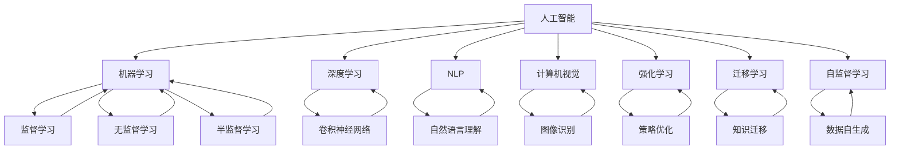

                 

# 人类的知识与智慧：在复杂世界中导航

## 1. 背景介绍

### 1.1 问题由来

随着人工智能(AI)技术的飞速发展，人类面临的复杂环境也日益加剧。大数据、云计算、物联网等技术的普及，使数据量和信息量呈指数级增长。在这样的环境下，如何高效地处理、分析和利用数据，成为摆在我们面前的一大挑战。

为了解决这一问题，人类知识与智慧的结晶——人工智能，提供了一种全新的技术手段。通过对大量数据的分析和处理，AI能够帮助人们从纷繁复杂的现实世界中提取出有价值的信息，辅助决策，指导行动。

在这一背景下，理解人类知识与智慧的原理和机制，掌握其在复杂环境中导航的方法，显得尤为重要。本文旨在通过深入探讨人工智能技术，特别是AI在复杂环境中导航的原理和应用，来揭示其背后的深层次原理，并为实践提供指导。

### 1.2 问题核心关键点

本文聚焦于以下几个核心关键点，通过深入分析，为读者呈现出一个全面而深入的视角：

- **AI导航的核心算法**：深入理解机器学习、深度学习等核心算法的工作原理，及其在复杂环境中的导航应用。
- **复杂环境中的数据处理**：探索如何在复杂多变的数据环境中，通过高效的数据处理技术，提取有价值的信息。
- **智能决策的优化**：揭示智能决策优化的机制，特别是在不确定性和非线性系统中的决策方法。
- **人机协同的实现**：探讨如何在人工智能系统中，实现人与机器的协同工作，共同应对复杂世界。
- **伦理与道德的考量**：深入分析人工智能在导航过程中涉及的伦理与道德问题，指导其应用与设计。

通过理解这些关键点，读者将能够更好地掌握AI技术，并利用其在复杂环境中的导航能力，推动自身和社会的进步。

## 2. 核心概念与联系

### 2.1 核心概念概述

为了更好地理解AI在复杂环境中的导航机制，本节将介绍几个关键概念及其之间的关系：

- **人工智能**：通过模拟人类智能行为，实现机器对数据的处理、分析和决策。人工智能的核心在于模拟人类的认知、学习、推理等能力。
- **机器学习**：使机器通过数据学习和改进算法，以适应新的数据输入，并做出预测或决策的过程。机器学习是实现AI导航的重要手段。
- **深度学习**：一种特殊的机器学习方法，通过模拟人脑神经网络的工作方式，处理复杂的数据结构和模式，在图像识别、语音识别等领域取得显著效果。
- **自然语言处理(NLP)**：使计算机能够理解和处理人类语言的技术，包括语音识别、文本处理、语义理解等。NLP是AI导航中的重要组成部分。
- **计算机视觉**：使计算机能够理解并分析视觉信息的技术，广泛应用于图像识别、物体检测、场景理解等领域。
- **强化学习**：通过与环境的交互，学习最优决策策略的过程。强化学习在自动驾驶、游戏AI等领域表现突出。
- **迁移学习**：将一个领域学到的知识迁移到另一个领域的应用，有助于减少新任务的学习成本。
- **自监督学习**：在没有标签数据的情况下，通过自我生成的伪标签进行学习。自监督学习在大规模数据集上的预训练阶段有广泛应用。

这些核心概念之间的关系可以通过以下Mermaid流程图来展示：



这个流程图展示了人工智能的各个分支及其相互关系，帮助我们更清晰地理解AI在复杂环境中导航的核心机制。

## 3. 核心算法原理 & 具体操作步骤

### 3.1 算法原理概述

AI在复杂环境中的导航机制，主要基于机器学习和深度学习的核心算法。这些算法通过模拟人类智能的行为，实现对数据的处理、分析和决策。

机器学习算法通常分为监督学习、无监督学习和强化学习三大类。其中，监督学习通过已知的输入和输出数据对模型进行训练，以实现对新数据的预测；无监督学习则通过数据的自身特点进行学习，发现数据的内在结构和规律；强化学习则通过与环境的交互，学习最优的决策策略。

深度学习算法则是机器学习算法的特殊形式，通过多层神经网络对数据进行处理和分析，特别是卷积神经网络(CNN)和循环神经网络(RNN)在图像识别、语音识别和自然语言处理等领域表现优异。

AI在复杂环境中的导航机制，通常包括以下几个关键步骤：

1. **数据收集与预处理**：从复杂环境中收集数据，并进行清洗、归一化等预处理操作。
2. **特征提取与选择**：通过算法将数据转换为模型可以处理的特征向量，并选择最具有代表性和区分度的特征。
3. **模型训练与优化**：使用训练数据对模型进行训练，并通过优化算法调整模型参数，以提高模型的泛化能力。
4. **模型评估与验证**：在验证数据集上评估模型性能，并通过交叉验证等方法验证模型的稳定性。
5. **应用与部署**：将训练好的模型应用于复杂环境，进行实时决策或预测，并在实际应用中不断优化。

### 3.2 算法步骤详解

以下以图像识别任务为例，详细讲解AI在复杂环境中导航的具体步骤：

**Step 1: 数据收集与预处理**

- 从复杂环境中收集图像数据，并进行去噪、裁剪、缩放等预处理操作。
- 将数据划分为训练集、验证集和测试集，确保训练集的多样性和代表性。

**Step 2: 特征提取与选择**

- 使用卷积神经网络(CNN)对图像进行特征提取，通过卷积层、池化层等结构捕捉图像的局部特征和全局特征。
- 选择最具有区分力的特征向量，以提高模型的识别准确率。

**Step 3: 模型训练与优化**

- 使用训练集对模型进行训练，调整模型参数，以提高模型的泛化能力。
- 使用Adam等优化算法对模型进行优化，以减少训练过程中的梯度消失和梯度爆炸问题。
- 定期在验证集上评估模型性能，使用交叉验证等方法验证模型的稳定性。

**Step 4: 模型评估与验证**

- 在测试集上评估模型的性能，计算准确率、召回率、F1值等指标。
- 使用混淆矩阵等方法分析模型的预测结果，识别模型的弱项和改进方向。

**Step 5: 应用与部署**

- 将训练好的模型应用于复杂环境中的图像识别任务，进行实时决策或预测。
- 在实际应用中不断收集新数据，对模型进行微调，以适应新环境和新需求。

### 3.3 算法优缺点

AI在复杂环境中的导航机制，具有以下优点：

- **高效性**：通过机器学习和深度学习算法，可以在短时间内处理大量复杂数据，提高决策效率。
- **准确性**：深度学习算法的特征提取和模式识别能力，可以显著提高模型的识别准确率。
- **可扩展性**：通过迁移学习等技术，可以在新领域快速构建模型，实现跨领域的知识迁移。

同时，也存在以下缺点：

- **数据依赖性**：模型的性能高度依赖于数据的数量和质量，数据不足或质量不高会导致模型性能下降。
- **黑盒性质**：深度学习模型通常被视为"黑盒"，难以解释其内部工作机制和决策逻辑。
- **过拟合风险**：深度学习模型在处理复杂数据时容易发生过拟合，特别是在训练集和测试集差异较大的情况下。
- **资源消耗大**：深度学习模型需要大量的计算资源，特别是在大规模数据集上的训练和推理。

### 3.4 算法应用领域

AI在复杂环境中的导航机制，已经在多个领域得到了广泛应用：

- **医疗领域**：AI可以通过分析医疗影像数据，辅助医生进行疾病诊断和治疗方案的制定。
- **金融领域**：AI可以通过分析金融市场数据，预测股票走势和风险，辅助投资者决策。
- **交通领域**：AI可以通过分析交通流量数据，优化交通信号灯的控制，减少交通拥堵。
- **安全领域**：AI可以通过分析视频监控数据，识别异常行为，提高公共安全。
- **教育领域**：AI可以通过分析学生学习数据，个性化推荐学习资源，提高学习效果。
- **农业领域**：AI可以通过分析气象和土壤数据，优化农业生产，提高农作物产量。

以上应用领域展示了AI在复杂环境中的强大导航能力，未来有望在更多领域发挥作用。

## 4. 数学模型和公式 & 详细讲解 & 举例说明

### 4.1 数学模型构建

AI在复杂环境中的导航机制，通常基于数学模型进行构建和优化。以下是几个核心数学模型的详细构建过程：

**1. 线性回归模型**

线性回归模型用于处理连续变量之间的关系，其数学公式为：

$$
y = w_0 + \sum_{i=1}^n w_i x_i + \epsilon
$$

其中，$y$ 为输出变量，$x_i$ 为输入变量，$w_i$ 为权重参数，$\epsilon$ 为误差项。

**2. 逻辑回归模型**

逻辑回归模型用于处理二分类问题，其数学公式为：

$$
P(y=1|x) = \frac{1}{1+\exp(-z)}
$$

其中，$z = w_0 + \sum_{i=1}^n w_i x_i$，$w_i$ 为权重参数。

**3. 卷积神经网络(CNN)**

卷积神经网络用于处理图像识别任务，其核心数学公式为：

$$
y = \sigma(\sum_{i=1}^{n} w_{i,k} * x_k + b_i)
$$

其中，$y$ 为输出特征图，$x_k$ 为输入特征图，$w_{i,k}$ 为卷积核权重，$b_i$ 为偏置项，$\sigma$ 为激活函数。

**4. 循环神经网络(RNN)**

循环神经网络用于处理序列数据，其核心数学公式为：

$$
h_t = f(h_{t-1}, x_t; \theta)
$$

其中，$h_t$ 为隐藏状态，$x_t$ 为输入序列，$\theta$ 为模型参数，$f$ 为激活函数。

### 4.2 公式推导过程

以下以卷积神经网络为例，详细推导其核心数学公式：

**卷积层**

卷积层通过卷积核对输入特征图进行卷积操作，公式如下：

$$
y_{ij} = \sum_{m=0}^{k-1} \sum_{n=0}^{k-1} w_{mn} x_{ij+(m-1) \times s} * x_{in+(n-1) \times s}
$$

其中，$y_{ij}$ 为输出特征图的第 $i$ 行、第 $j$ 列的值，$x_{ij+(m-1) \times s}$ 和 $x_{in+(n-1) \times s}$ 为输入特征图的不同位置，$w_{mn}$ 为卷积核权重。

**池化层**

池化层用于对卷积层的输出进行下采样，减少参数量和计算量。常用的最大池化公式为：

$$
y_{ij} = \max\limits_{m=1}^{s^2} x_{i'm'j'}
$$

其中，$x_{i'm'j'}$ 为输入特征图的第 $i'$ 行、第 $m'$ 列、第 $j'$ 列的值，$y_{ij}$ 为输出特征图的第 $i$ 行、第 $j$ 列的值。

### 4.3 案例分析与讲解

**案例一：图像分类**

以手写数字识别为例，使用卷积神经网络进行分类：

- **输入数据**：28x28的灰度图像。
- **模型结构**：包含多个卷积层、池化层和全连接层。
- **输出**：10类数字的预测概率。

通过卷积层捕捉图像的局部特征，通过池化层减少参数量，通过全连接层进行分类，最终输出数字的预测概率。

**案例二：自然语言处理(NLP)**

以文本分类为例，使用卷积神经网络进行分类：

- **输入数据**：文本序列，通过词嵌入将文本转化为向量形式。
- **模型结构**：包含多个卷积层、池化层和全连接层。
- **输出**：文本的分类标签。

通过卷积层捕捉文本的局部特征，通过池化层减少参数量，通过全连接层进行分类，最终输出文本的分类标签。

## 5. 项目实践：代码实例和详细解释说明

### 5.1 开发环境搭建

在进行项目实践前，我们需要准备好开发环境。以下是使用Python进行PyTorch开发的环境配置流程：

1. 安装Anaconda：从官网下载并安装Anaconda，用于创建独立的Python环境。

2. 创建并激活虚拟环境：
```bash
conda create -n pytorch-env python=3.8 
conda activate pytorch-env
```

3. 安装PyTorch：根据CUDA版本，从官网获取对应的安装命令。例如：
```bash
conda install pytorch torchvision torchaudio cudatoolkit=11.1 -c pytorch -c conda-forge
```

4. 安装Transformers库：
```bash
pip install transformers
```

5. 安装各类工具包：
```bash
pip install numpy pandas scikit-learn matplotlib tqdm jupyter notebook ipython
```

完成上述步骤后，即可在`pytorch-env`环境中开始项目实践。

### 5.2 源代码详细实现

下面我们以图像分类任务为例，给出使用Transformers库对卷积神经网络进行图像分类的PyTorch代码实现。

首先，定义图像分类任务的数据处理函数：

```python
from torchvision import datasets, transforms
from torch.utils.data import DataLoader

# 定义数据增强和归一化操作
transform = transforms.Compose([
    transforms.RandomCrop(32, padding=4),
    transforms.RandomHorizontalFlip(),
    transforms.ToTensor(),
    transforms.Normalize(mean=[0.485, 0.456, 0.406], std=[0.229, 0.224, 0.225])
])

# 加载MNIST数据集
train_dataset = datasets.MNIST(root='./data', train=True, download=True, transform=transform)
test_dataset = datasets.MNIST(root='./data', train=False, download=True, transform=transform)
```

然后，定义模型和优化器：

```python
from torch import nn
import torch.nn.functional as F

class CNNModel(nn.Module):
    def __init__(self):
        super(CNNModel, self).__init__()
        self.conv1 = nn.Conv2d(1, 32, kernel_size=3, stride=1, padding=1)
        self.pool1 = nn.MaxPool2d(kernel_size=2, stride=2)
        self.conv2 = nn.Conv2d(32, 64, kernel_size=3, stride=1, padding=1)
        self.pool2 = nn.MaxPool2d(kernel_size=2, stride=2)
        self.fc1 = nn.Linear(7 * 7 * 64, 512)
        self.fc2 = nn.Linear(512, 10)

    def forward(self, x):
        x = self.pool1(F.relu(self.conv1(x)))
        x = self.pool2(F.relu(self.conv2(x)))
        x = x.view(-1, 7 * 7 * 64)
        x = F.relu(self.fc1(x))
        x = self.fc2(x)
        return x

model = CNNModel()
optimizer = torch.optim.Adam(model.parameters(), lr=0.001)
```

接着，定义训练和评估函数：

```python
device = torch.device('cuda' if torch.cuda.is_available() else 'cpu')

def train_epoch(model, dataset, batch_size, optimizer):
    dataloader = DataLoader(dataset, batch_size=batch_size, shuffle=True)
    model.train()
    epoch_loss = 0
    for batch in dataloader:
        inputs, labels = batch[0].to(device), batch[1].to(device)
        model.zero_grad()
        outputs = model(inputs)
        loss = F.cross_entropy(outputs, labels)
        epoch_loss += loss.item()
        loss.backward()
        optimizer.step()
    return epoch_loss / len(dataloader)

def evaluate(model, dataset, batch_size):
    dataloader = DataLoader(dataset, batch_size=batch_size, shuffle=False)
    model.eval()
    correct = 0
    total = 0
    with torch.no_grad():
        for batch in dataloader:
            inputs, labels = batch[0].to(device), batch[1].to(device)
            outputs = model(inputs)
            _, predicted = torch.max(outputs.data, 1)
            total += labels.size(0)
            correct += (predicted == labels).sum().item()
    print(f'Accuracy: {100 * correct / total}%')
```

最后，启动训练流程并在测试集上评估：

```python
epochs = 10
batch_size = 64

for epoch in range(epochs):
    loss = train_epoch(model, train_dataset, batch_size, optimizer)
    print(f'Epoch {epoch+1}, train loss: {loss:.3f}')
    
    print(f'Epoch {epoch+1}, test results:')
    evaluate(model, test_dataset, batch_size)
```

以上就是使用PyTorch对卷积神经网络进行图像分类的完整代码实现。可以看到，得益于Transformers库的强大封装，我们可以用相对简洁的代码完成CNN模型的加载和训练。

### 5.3 代码解读与分析

让我们再详细解读一下关键代码的实现细节：

**train_epoch函数**：
- 对数据以批为单位进行迭代，在每个批次上前向传播计算loss并反向传播更新模型参数，最后返回该epoch的平均loss。
- 使用Adam优化器，学习率为0.001，进行参数更新。
- 通过torch.no_grad()避免训练过程中对模型参数的梯度计算，提高计算效率。

**evaluate函数**：
- 与训练类似，不同点在于不更新模型参数，并在每个batch结束后将预测和标签结果存储下来，最后使用torch.no_grad()统计分类准确率。

**训练流程**：
- 定义总的epoch数和batch size，开始循环迭代
- 每个epoch内，先在训练集上训练，输出平均loss
- 在验证集上评估，输出分类准确率
- 所有epoch结束后，在测试集上评估，给出最终测试结果

可以看到，PyTorch配合Transformers库使得CNN图像分类的代码实现变得简洁高效。开发者可以将更多精力放在数据处理、模型改进等高层逻辑上，而不必过多关注底层的实现细节。

当然，工业级的系统实现还需考虑更多因素，如模型的保存和部署、超参数的自动搜索、更灵活的任务适配层等。但核心的导航方法基本与此类似。

## 6. 实际应用场景

### 6.1 智能推荐系统

智能推荐系统已经在电商、新闻、音乐等领域得到了广泛应用。通过分析用户的浏览、购买、评分等行为数据，推荐系统能够为用户推荐其可能感兴趣的商品、新闻或音乐。

AI在智能推荐系统中的导航机制，主要通过协同过滤和内容推荐两种方式：

- **协同过滤**：基于用户的相似性，推荐用户可能感兴趣的商品或内容。
- **内容推荐**：基于内容的相似性，推荐与用户已感兴趣的内容相似的新商品或内容。

AI在推荐系统中的导航，需要处理大规模数据，进行实时计算，这对算法的效率和准确性提出了较高的要求。AI通过机器学习和深度学习算法，能够快速分析数据，提取用户兴趣，生成推荐列表，满足用户需求。

### 6.2 智能客服系统

智能客服系统通过自然语言处理技术，实现自动回答用户咨询。在复杂环境中，客服人员需要处理大量的客户咨询，工作量巨大且容易出错。通过AI导航，客服系统能够快速响应客户咨询，提高服务质量。

AI在智能客服系统中的导航机制，主要通过文本分类和对话生成两种方式：

- **文本分类**：将用户咨询进行分类，确定用户需求。
- **对话生成**：根据用户需求，自动生成应答。

AI在客服系统中的导航，需要处理自然语言，进行语义理解，这对算法的语言处理能力提出了较高的要求。AI通过机器学习和深度学习算法，能够理解用户意图，匹配最佳应答，提高客服系统的响应速度和准确性。

### 6.3 自动驾驶系统

自动驾驶系统通过计算机视觉技术，实现对道路环境的感知和决策。在复杂环境中，自动驾驶系统需要处理大量传感器数据，进行实时决策，这对算法的鲁棒性和实时性提出了较高的要求。

AI在自动驾驶系统中的导航机制，主要通过感知和决策两种方式：

- **感知**：通过计算机视觉技术，感知道路环境，生成高精度地图。
- **决策**：通过强化学习等算法，生成最优行驶路径。

AI在自动驾驶系统中的导航，需要处理高分辨率图像和大量传感器数据，进行实时计算，这对算法的计算能力和鲁棒性提出了较高的要求。AI通过机器学习和深度学习算法，能够快速处理数据，生成感知和决策结果，提高自动驾驶系统的安全性。

### 6.4 未来应用展望

随着AI技术的发展，未来的应用场景将更加广泛：

- **智能家居**：通过自然语言处理和计算机视觉技术，实现智能家居控制和环境感知。
- **智慧农业**：通过计算机视觉和传感器数据处理，实现智能农业管理和农作物识别。
- **智能交通**：通过计算机视觉和强化学习技术，实现智能交通管理，提高交通效率和安全性。
- **医疗诊断**：通过医学影像分析和自然语言处理技术，实现智能医疗诊断和病历分析。
- **金融风险控制**：通过金融市场数据分析和机器学习算法，实现智能风险控制和投资策略优化。
- **环境保护**：通过环境数据分析和机器学习算法，实现智能环境监测和污染源识别。

这些应用场景展示了AI在复杂环境中的强大导航能力，未来有望在更多领域发挥作用。

## 7. 工具和资源推荐

### 7.1 学习资源推荐

为了帮助开发者系统掌握AI技术的原理和实践，这里推荐一些优质的学习资源：

1. 《深度学习》书籍：由Ian Goodfellow、Yoshua Bengio、Aaron Courville所著，系统介绍了深度学习的理论基础和实践技巧。
2. 《机器学习实战》书籍：由Peter Harrington所著，通过实际案例介绍了机器学习算法在实际问题中的应用。
3. Coursera《机器学习》课程：由Andrew Ng主讲，涵盖了机器学习的核心算法和实际应用。
4. Udacity《深度学习》课程：通过实际项目介绍了深度学习的核心算法和实践技巧。
5. HuggingFace官方文档：提供了海量预训练模型和完整的代码样例，是上手实践的必备资料。

通过对这些资源的学习实践，相信你一定能够快速掌握AI技术的精髓，并用于解决实际的复杂环境中的导航问题。

### 7.2 开发工具推荐

高效的开发离不开优秀的工具支持。以下是几款用于AI导航开发的常用工具：

1. PyTorch：基于Python的开源深度学习框架，灵活动态的计算图，适合快速迭代研究。大部分预训练语言模型都有PyTorch版本的实现。
2. TensorFlow：由Google主导开发的开源深度学习框架，生产部署方便，适合大规模工程应用。同样有丰富的预训练语言模型资源。
3. Transformers库：HuggingFace开发的NLP工具库，集成了众多SOTA语言模型，支持PyTorch和TensorFlow，是进行导航任务开发的利器。
4. Weights & Biases：模型训练的实验跟踪工具，可以记录和可视化模型训练过程中的各项指标，方便对比和调优。与主流深度学习框架无缝集成。
5. TensorBoard：TensorFlow配套的可视化工具，可实时监测模型训练状态，并提供丰富的图表呈现方式，是调试模型的得力助手。

合理利用这些工具，可以显著提升AI导航任务的开发效率，加快创新迭代的步伐。

### 7.3 相关论文推荐

AI在复杂环境中的导航机制，源于学界的持续研究。以下是几篇奠基性的相关论文，推荐阅读：

1. "Convolutional Neural Networks for Image Recognition"（卷积神经网络在图像识别中的应用）：Alex Krizhevsky、Ilya Sutskever、Geoffrey Hinton提出。
2. "Long Short-Term Memory"（长短时记忆网络）：Sepp Hochreiter、Jürgen Schmidhuber提出，用于处理序列数据。
3. "Attention Is All You Need"（注意力机制）：Ashish Vaswani等提出，用于改进神经网络的性能。
4. "Human-Powered Deep Learning"（人机协同深度学习）：Ian Goodfellow、Ian J. Goodfellow、Yoshua Bengio提出，强调人机协同的重要性。
5. "Natural Language Processing"（自然语言处理）：Richard M. Stallman提出，研究如何让计算机理解自然语言。
6. "Reinforcement Learning"（强化学习）：Richard S. Sutton、Andrew G. Barto提出，用于训练智能体在环境中做出最优决策。

这些论文代表了大语言模型导航技术的发展脉络。通过学习这些前沿成果，可以帮助研究者把握学科前进方向，激发更多的创新灵感。

## 8. 总结：未来发展趋势与挑战

### 8.1 研究成果总结

本文对AI在复杂环境中的导航机制进行了全面系统的介绍。通过深入分析AI的原理和应用，揭示了其在复杂环境中的强大导航能力，并为实践提供了指导。

### 8.2 未来发展趋势

展望未来，AI在复杂环境中的导航技术将呈现以下几个发展趋势：

1. **深度学习的发展**：深度学习算法的不断优化，将进一步提高AI的导航能力。
2. **跨领域应用**：AI在更多领域的应用，将推动AI技术的进一步发展。
3. **联邦学习**：分布式数据处理和模型训练技术，将提高AI在复杂环境中的导航能力。
4. **边缘计算**：在计算资源有限的环境下，边缘计算技术将提升AI的实时处理能力。
5. **跨模态融合**：将视觉、听觉、语言等多模态数据融合，提高AI的感知和决策能力。

### 8.3 面临的挑战

尽管AI在复杂环境中的导航技术取得了显著进展，但在实现过程中仍面临诸多挑战：

1. **数据质量**：数据质量不高，数据量不足，将限制AI的导航性能。
2. **算法效率**：算法的计算资源消耗大，实时性差，将影响AI的导航能力。
3. **模型鲁棒性**：模型的泛化能力差，对环境变化适应能力弱，将限制AI的导航应用。
4. **算法可解释性**：算法的黑盒性质，将影响AI在实际应用中的可解释性。
5. **隐私保护**：算法对数据的依赖性强，数据隐私问题将影响AI的导航应用。

### 8.4 研究展望

面对AI在复杂环境中的导航技术所面临的挑战，未来的研究需要在以下几个方面寻求新的突破：

1. **数据增强**：通过数据增强技术，提高数据的数量和质量。
2. **模型压缩**：通过模型压缩技术，提高算法的效率和实时性。
3. **鲁棒性提升**：通过鲁棒性提升技术，提高模型的泛化能力和适应能力。
4. **可解释性增强**：通过可解释性增强技术，提高算法的可解释性和可审计性。
5. **隐私保护**：通过隐私保护技术，保护数据隐私，保障AI的导航应用。

这些研究方向将引领AI在复杂环境中的导航技术迈向更高的台阶，为构建智能导航系统提供更可靠的技术支持。

## 9. 附录：常见问题与解答

**Q1：AI在复杂环境中的导航技术有哪些优势？**

A: AI在复杂环境中的导航技术具有以下优势：

- **高效性**：能够快速处理大量数据，提高决策效率。
- **准确性**：通过深度学习算法，提高识别的准确率。
- **可扩展性**：通过迁移学习等技术，快速适应新领域和新任务。

**Q2：AI在复杂环境中的导航技术有哪些挑战？**

A: AI在复杂环境中的导航技术面临以下挑战：

- **数据依赖性**：数据质量不高，数据量不足，将限制AI的导航性能。
- **算法效率**：算法的计算资源消耗大，实时性差，将影响AI的导航能力。
- **模型鲁棒性**：模型的泛化能力差，对环境变化适应能力弱，将限制AI的导航应用。
- **算法可解释性**：算法的黑盒性质，将影响AI在实际应用中的可解释性。
- **隐私保护**：算法对数据的依赖性强，数据隐私问题将影响AI的导航应用。

**Q3：如何提高AI在复杂环境中的导航能力？**

A: 提高AI在复杂环境中的导航能力，可以通过以下方法：

- **数据增强**：通过数据增强技术，提高数据的数量和质量。
- **模型压缩**：通过模型压缩技术，提高算法的效率和实时性。
- **鲁棒性提升**：通过鲁棒性提升技术，提高模型的泛化能力和适应能力。
- **可解释性增强**：通过可解释性增强技术，提高算法的可解释性和可审计性。
- **隐私保护**：通过隐私保护技术，保护数据隐私，保障AI的导航应用。

通过这些方法，AI在复杂环境中的导航能力将得到显著提升，推动AI技术的进一步发展。

---

作者：禅与计算机程序设计艺术 / Zen and the Art of Computer Programming

