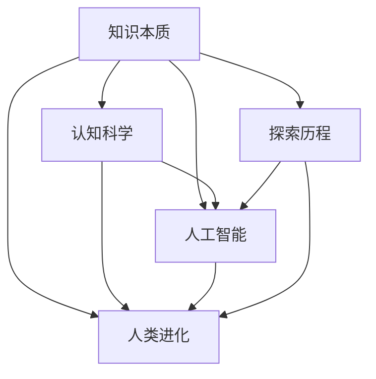

                 

# 人类知识的本质：一场永不停歇的探索长河

> 关键词：知识本质,认知科学,人工智能,人类进化,探索历程

## 1. 背景介绍

### 1.1 问题由来

知识是人类生存和发展的基石，自古以来，人类就在不断地探索和积累知识。无论是原始的狩猎技巧、火的使用，还是现代的科学理论、工程技术，知识的积累和传播始终是人类文明进步的重要动力。然而，知识的本质是什么？知识是如何被认识、存储和运用的？这些问题虽然看似简单，但实际上却触及了人类认知科学的深层领域。

在现代信息技术的推动下，知识获取、处理和利用的方式发生了翻天覆地的变化。特别是人工智能技术的发展，使得机器能够处理和运用大规模数据，逐步模拟甚至超越人类在某些领域的认知能力。面对这些技术变革，理解知识的本质变得更加重要。

### 1.2 问题核心关键点

理解知识的本质，不仅涉及对知识本身的定义和分类，还涉及到人类认知机制、人工智能算法和技术的应用等多个层面。本节的目的是帮助读者建立关于知识本质的基本认知框架，并探讨人类认知与人工智能技术之间的联系。

## 2. 核心概念与联系

### 2.1 核心概念概述

为了更好地理解知识的本质，本节将介绍几个与知识本质相关的核心概念：

- **知识本质(Knowledge Essence)**：指知识的基本属性、来源和存在形式。知识既包括人类通过观察、推理和实验所获得的直接经验，也包括通过逻辑推理和抽象思维所形成的间接知识。
- **认知科学(Cognitive Science)**：研究人类认知过程的科学，包括感知、记忆、思维、语言、情感等各个方面。认知科学的目标是揭示人类认知的机制和规律。
- **人工智能(Artificial Intelligence)**：模拟人类智能行为的技术，包括推理、学习、感知、自然语言处理等。人工智能技术的发展，使得机器能够在一定程度上理解和应用知识。
- **人类进化(Human Evolution)**：人类作为生物体，其认知能力是在漫长的进化过程中逐渐发展的。认知的进化与大脑结构和功能的变化密切相关。
- **探索历程(Exploration Process)**：人类从原始文明到现代科技的演进过程中，对知识本质的探索从未停止。从古希腊的哲学思辨到现代的神经科学研究，知识的探索不断深入。

这些核心概念之间的逻辑关系可以通过以下Mermaid流程图来展示：



这个流程图展示了一些关键概念之间的联系：

1. 知识的本质是认知科学研究的对象。
2. 人工智能技术的发展受到认知科学和人类进化的影响。
3. 探索历程贯穿人类进化的整个过程，同时也是知识累积的历程。

## 3. 核心算法原理 & 具体操作步骤

### 3.1 算法原理概述

理解知识本质，首先需要明确知识的定义和分类。知识可以大致分为显性知识和隐性知识。显性知识通常以文本、图像、视频等形式存在，可以通过感官直接获取。而隐性知识则是指那些难以言传、需要通过经验和直觉推断的知识。

认知科学和人工智能技术的发展，为知识的获取和应用提供了新的手段。例如，人工智能可以通过数据挖掘和模式识别技术，自动从大规模数据中提取有用的显性知识。而隐性知识的获取则涉及到更高级的认知过程，如情感推理、创造性思维等。

### 3.2 算法步骤详解

理解知识的本质，涉及多个层次的分析和推理。以下是一个简单的算法流程，帮助读者逐步构建知识本质的认知框架：

1. **数据收集**：收集与知识本质相关的数据，包括文献资料、实验数据、认知心理学研究成果等。
2. **数据处理**：对收集的数据进行清洗、标注和预处理，以便后续分析。
3. **知识分类**：基于数据的特征，对知识进行分类，区分显性知识和隐性知识。
4. **认知模型构建**：构建认知模型，模拟人类认知过程，包括感知、记忆、思维、情感等。
5. **算法选择**：选择适合的知识获取和应用算法，如机器学习、深度学习、自然语言处理等。
6. **模型训练和优化**：使用收集的数据对认知模型进行训练和优化，确保其能够准确地表示人类认知过程。
7. **知识应用**：将训练好的认知模型应用于实际问题中，验证其效果和适用性。

### 3.3 算法优缺点

理解知识本质的算法，具有以下优点：

- **系统性**：通过多个步骤的系统分析，可以全面理解知识的本质。
- **可操作性**：算法步骤具体，易于实施和验证。
- **可扩展性**：可以通过添加新的数据和算法，不断扩展对知识本质的认知。

同时，该算法也存在一些缺点：

- **复杂性**：步骤较多，实施过程可能较为复杂。
- **数据依赖**：依赖高质量的数据集，数据不足可能影响分析结果。
- **模型假设**：认知模型是对人类认知过程的模拟，假设可能与实际情况有所偏差。

### 3.4 算法应用领域

理解知识本质的算法，可以应用于多个领域，包括：

- **认知心理学**：研究人类认知过程，理解知识获取和应用的机制。
- **神经科学**：研究大脑结构和功能，揭示知识存储和运用的神经基础。
- **教育学**：理解知识传递和学习的规律，改进教学方法和效果。
- **人工智能**：模拟人类认知过程，开发更加智能化的知识获取和应用算法。
- **哲学**：探讨知识本质的哲学问题，如知识与现实的对应关系、知识与信仰的关系等。

## 4. 数学模型和公式 & 详细讲解 & 举例说明

### 4.1 数学模型构建

知识的本质可以通过数学模型来刻画。以下是一个简单的数学模型，用于描述知识的分类和应用：

$$
\text{知识} = \{k_i | k_i \in \{\text{显性知识}, \text{隐性知识}\}, i \in \{1,2,...,n\}
$$

其中，$k_i$表示第$i$个知识元素，$n$表示知识元素的总数。

### 4.2 公式推导过程

知识的分类可以进一步细化，显性知识和隐性知识可以通过不同的特征进行区分。例如，显性知识可以通过文本特征、图像特征等进行描述，而隐性知识则需要通过更高级的认知过程进行推理。

假设显性知识可以通过文本表示为$T = (t_1, t_2, ..., t_n)$，其中$t_i$表示第$i$个文本特征。隐性知识可以通过情感推理模型表示为$E = (e_1, e_2, ..., e_m)$，其中$e_i$表示第$i$个情感特征。

可以将知识的分类模型表示为：

$$
\text{分类器} = \arg\min_{C} \frac{1}{N} \sum_{i=1}^{N} \ell(C(k_i), y_i)
$$

其中$C$表示分类器，$\ell$表示损失函数，$y_i$表示真实标签。

### 4.3 案例分析与讲解

以自然语言处理(NLP)为例，分析如何通过机器学习技术获取和应用显性知识。假设有一个文档集合$D = \{d_1, d_2, ..., d_m\}$，每个文档$d_i$可以表示为一个词向量序列$w_{i,j} \in \mathbb{R}^d$。通过文本分类器，可以对每个文档$d_i$进行分类，得到标签$y_i$。

训练过程可以表示为：

$$
\theta = \arg\min_{\theta} \frac{1}{m} \sum_{i=1}^{m} \ell(M_{\theta}(d_i), y_i)
$$

其中$M_{\theta}$表示文本分类模型，$\theta$表示模型参数。

## 5. 项目实践：代码实例和详细解释说明

### 5.1 开发环境搭建

在进行项目实践前，我们需要准备好开发环境。以下是使用Python进行PyTorch开发的环境配置流程：

1. 安装Anaconda：从官网下载并安装Anaconda，用于创建独立的Python环境。

2. 创建并激活虚拟环境：
```bash
conda create -n pytorch-env python=3.8 
conda activate pytorch-env
```

3. 安装PyTorch：根据CUDA版本，从官网获取对应的安装命令。例如：
```bash
conda install pytorch torchvision torchaudio cudatoolkit=11.1 -c pytorch -c conda-forge
```

4. 安装TensorFlow：如果需要，安装TensorFlow：
```bash
conda install tensorflow
```

5. 安装各类工具包：
```bash
pip install numpy pandas scikit-learn matplotlib tqdm jupyter notebook ipython
```

完成上述步骤后，即可在`pytorch-env`环境中开始项目实践。

### 5.2 源代码详细实现

我们以文本分类任务为例，给出使用Transformers库对BERT模型进行分类的PyTorch代码实现。

首先，定义分类任务的数据处理函数：

```python
from transformers import BertTokenizer
from torch.utils.data import Dataset
import torch

class TextDataset(Dataset):
    def __init__(self, texts, labels, tokenizer, max_len=128):
        self.texts = texts
        self.labels = labels
        self.tokenizer = tokenizer
        self.max_len = max_len
        
    def __len__(self):
        return len(self.texts)
    
    def __getitem__(self, item):
        text = self.texts[item]
        label = self.labels[item]
        
        encoding = self.tokenizer(text, return_tensors='pt', max_length=self.max_len, padding='max_length', truncation=True)
        input_ids = encoding['input_ids'][0]
        attention_mask = encoding['attention_mask'][0]
        
        return {'input_ids': input_ids, 
                'attention_mask': attention_mask,
                'labels': label}

# 标签与id的映射
label2id = {'positive': 1, 'negative': 0}
id2label = {v: k for k, v in label2id.items()}

# 创建dataset
tokenizer = BertTokenizer.from_pretrained('bert-base-cased')

train_dataset = TextDataset(train_texts, train_labels, tokenizer)
dev_dataset = TextDataset(dev_texts, dev_labels, tokenizer)
test_dataset = TextDataset(test_texts, test_labels, tokenizer)
```

然后，定义模型和优化器：

```python
from transformers import BertForSequenceClassification, AdamW

model = BertForSequenceClassification.from_pretrained('bert-base-cased', num_labels=len(label2id))

optimizer = AdamW(model.parameters(), lr=2e-5)
```

接着，定义训练和评估函数：

```python
from torch.utils.data import DataLoader
from tqdm import tqdm
from sklearn.metrics import classification_report

device = torch.device('cuda') if torch.cuda.is_available() else torch.device('cpu')
model.to(device)

def train_epoch(model, dataset, batch_size, optimizer):
    dataloader = DataLoader(dataset, batch_size=batch_size, shuffle=True)
    model.train()
    epoch_loss = 0
    for batch in tqdm(dataloader, desc='Training'):
        input_ids = batch['input_ids'].to(device)
        attention_mask = batch['attention_mask'].to(device)
        labels = batch['labels'].to(device)
        model.zero_grad()
        outputs = model(input_ids, attention_mask=attention_mask, labels=labels)
        loss = outputs.loss
        epoch_loss += loss.item()
        loss.backward()
        optimizer.step()
    return epoch_loss / len(dataloader)

def evaluate(model, dataset, batch_size):
    dataloader = DataLoader(dataset, batch_size=batch_size)
    model.eval()
    preds, labels = [], []
    with torch.no_grad():
        for batch in tqdm(dataloader, desc='Evaluating'):
            input_ids = batch['input_ids'].to(device)
            attention_mask = batch['attention_mask'].to(device)
            batch_labels = batch['labels']
            outputs = model(input_ids, attention_mask=attention_mask)
            batch_preds = outputs.logits.argmax(dim=2).to('cpu').tolist()
            batch_labels = batch_labels.to('cpu').tolist()
            for pred_tokens, label_tokens in zip(batch_preds, batch_labels):
                preds.append(pred_tokens)
                labels.append(label_tokens)
                
    print(classification_report(labels, preds))
```

最后，启动训练流程并在测试集上评估：

```python
epochs = 5
batch_size = 16

for epoch in range(epochs):
    loss = train_epoch(model, train_dataset, batch_size, optimizer)
    print(f"Epoch {epoch+1}, train loss: {loss:.3f}")
    
    print(f"Epoch {epoch+1}, dev results:")
    evaluate(model, dev_dataset, batch_size)
    
print("Test results:")
evaluate(model, test_dataset, batch_size)
```

以上就是使用PyTorch对BERT进行文本分类任务分类的完整代码实现。可以看到，得益于Transformers库的强大封装，我们可以用相对简洁的代码完成BERT模型的加载和训练。

### 5.3 代码解读与分析

让我们再详细解读一下关键代码的实现细节：

**TextDataset类**：
- `__init__`方法：初始化文本、标签、分词器等关键组件。
- `__len__`方法：返回数据集的样本数量。
- `__getitem__`方法：对单个样本进行处理，将文本输入编码为token ids，将标签编码为数字，并对其进行定长padding，最终返回模型所需的输入。

**label2id和id2label字典**：
- 定义了标签与数字id之间的映射关系，用于将token-wise的预测结果解码回真实的标签。

**训练和评估函数**：
- 使用PyTorch的DataLoader对数据集进行批次化加载，供模型训练和推理使用。
- 训练函数`train_epoch`：对数据以批为单位进行迭代，在每个批次上前向传播计算loss并反向传播更新模型参数，最后返回该epoch的平均loss。
- 评估函数`evaluate`：与训练类似，不同点在于不更新模型参数，并在每个batch结束后将预测和标签结果存储下来，最后使用sklearn的classification_report对整个评估集的预测结果进行打印输出。

**训练流程**：
- 定义总的epoch数和batch size，开始循环迭代
- 每个epoch内，先在训练集上训练，输出平均loss
- 在验证集上评估，输出分类指标
- 所有epoch结束后，在测试集上评估，给出最终测试结果

可以看到，PyTorch配合Transformers库使得BERT分类的代码实现变得简洁高效。开发者可以将更多精力放在数据处理、模型改进等高层逻辑上，而不必过多关注底层的实现细节。

当然，工业级的系统实现还需考虑更多因素，如模型的保存和部署、超参数的自动搜索、更灵活的任务适配层等。但核心的分类范式基本与此类似。

## 6. 实际应用场景

### 6.1 金融舆情监测

金融行业需要实时监测市场舆论动向，以便及时应对负面信息传播，规避金融风险。传统的人工监测方式成本高、效率低，难以应对网络时代海量信息爆发的挑战。基于大语言模型分类的文本分类技术，为金融舆情监测提供了新的解决方案。

具体而言，可以收集金融领域相关的新闻、报道、评论等文本数据，并对其进行主题标注和情感标注。在此基础上对预训练语言模型进行分类训练，使其能够自动判断文本属于何种主题，情感倾向是正面、中性还是负面。将分类后的模型应用到实时抓取的网络文本数据，就能够自动监测不同主题下的情感变化趋势，一旦发现负面信息激增等异常情况，系统便会自动预警，帮助金融机构快速应对潜在风险。

### 6.2 医疗健康应用

在医疗健康领域，文本分类技术可以用于病历、报告、咨询等各类文本的自动分类，提高医生的工作效率和诊断精度。例如，可以构建基于BERT的疾病分类模型，自动分类患者的病历信息，帮助医生快速识别病情。同时，还可以通过文本情感分析，判断患者的态度和情绪，提供更个性化的医疗服务。

### 6.3 电子商务推荐

电子商务平台需要根据用户的历史行为和评价信息，推荐符合其兴趣的商品。通过文本分类技术，可以自动分析和分类用户评论和反馈，理解用户偏好和需求，从而提供更加个性化的商品推荐。

例如，可以构建基于BERT的商品评论分类模型，自动分类用户评论的情感极性，生成商品推荐列表，提升用户体验和购买转化率。

### 6.4 未来应用展望

随着文本分类技术的不断进步，其在更多领域的应用前景广阔。

在智慧医疗领域，基于分类技术的医疗问答、病历分析、药物研发等应用将提升医疗服务的智能化水平，辅助医生诊疗，加速新药开发进程。

在智能教育领域，文本分类技术可应用于作业批改、学情分析、知识推荐等方面，因材施教，促进教育公平，提高教学质量。

在智慧城市治理中，分类技术可应用于城市事件监测、舆情分析、应急指挥等环节，提高城市管理的自动化和智能化水平，构建更安全、高效的未来城市。

此外，在企业生产、社会治理、文娱传媒等众多领域，文本分类技术也将不断涌现，为NLP技术带来了全新的突破。相信随着预训练语言模型和分类方法的不断进步，文本分类技术必将在更广阔的应用领域大放异彩。

## 7. 工具和资源推荐

### 7.1 学习资源推荐

为了帮助开发者系统掌握文本分类技术，这里推荐一些优质的学习资源：

1. 《Natural Language Processing with Transformers》书籍：Transformer库的作者所著，全面介绍了如何使用Transformers库进行NLP任务开发，包括分类在内的诸多范式。

2. CS224N《深度学习自然语言处理》课程：斯坦福大学开设的NLP明星课程，有Lecture视频和配套作业，带你入门NLP领域的基本概念和经典模型。

3. 《Transformer from Principle to Practice》系列博文：由大模型技术专家撰写，深入浅出地介绍了Transformer原理、BERT模型、分类技术等前沿话题。

4. HuggingFace官方文档：Transformer库的官方文档，提供了海量预训练模型和完整的分类样例代码，是上手实践的必备资料。

通过对这些资源的学习实践，相信你一定能够快速掌握文本分类的精髓，并用于解决实际的NLP问题。

### 7.2 开发工具推荐

高效的开发离不开优秀的工具支持。以下是几款用于文本分类开发的常用工具：

1. PyTorch：基于Python的开源深度学习框架，灵活动态的计算图，适合快速迭代研究。大部分预训练语言模型都有PyTorch版本的实现。

2. TensorFlow：由Google主导开发的开源深度学习框架，生产部署方便，适合大规模工程应用。同样有丰富的预训练语言模型资源。

3. Transformers库：HuggingFace开发的NLP工具库，集成了众多SOTA语言模型，支持PyTorch和TensorFlow，是进行分类任务开发的利器。

4. Weights & Biases：模型训练的实验跟踪工具，可以记录和可视化模型训练过程中的各项指标，方便对比和调优。与主流深度学习框架无缝集成。

5. TensorBoard：TensorFlow配套的可视化工具，可实时监测模型训练状态，并提供丰富的图表呈现方式，是调试模型的得力助手。

6. Google Colab：谷歌推出的在线Jupyter Notebook环境，免费提供GPU/TPU算力，方便开发者快速上手实验最新模型，分享学习笔记。

合理利用这些工具，可以显著提升文本分类任务的开发效率，加快创新迭代的步伐。

### 7.3 相关论文推荐

文本分类技术的发展源于学界的持续研究。以下是几篇奠基性的相关论文，推荐阅读：

1. Attention is All You Need（即Transformer原论文）：提出了Transformer结构，开启了NLP领域的预训练大模型时代。

2. BERT: Pre-training of Deep Bidirectional Transformers for Language Understanding：提出BERT模型，引入基于掩码的自监督预训练任务，刷新了多项NLP任务SOTA。

3. Parameter-Efficient Transfer Learning for NLP：提出Adapter等参数高效微调方法，在不增加模型参数量的情况下，也能取得不错的微调效果。

4. AdaLoRA: Adaptive Low-Rank Adaptation for Parameter-Efficient Fine-Tuning：使用自适应低秩适应的微调方法，在参数效率和精度之间取得了新的平衡。

这些论文代表了大语言模型分类技术的发展脉络。通过学习这些前沿成果，可以帮助研究者把握学科前进方向，激发更多的创新灵感。

## 8. 总结：未来发展趋势与挑战

### 8.1 总结

本文对基于监督学习的文本分类方法进行了全面系统的介绍。首先阐述了文本分类的研究背景和意义，明确了分类在拓展预训练模型应用、提升下游任务性能方面的独特价值。其次，从原理到实践，详细讲解了文本分类的数学原理和关键步骤，给出了文本分类任务开发的完整代码实例。同时，本文还广泛探讨了分类方法在金融舆情监测、医疗健康、电子商务等多个行业领域的应用前景，展示了分类范式的巨大潜力。此外，本文精选了分类技术的各类学习资源，力求为读者提供全方位的技术指引。

通过本文的系统梳理，可以看到，基于大语言模型的分类方法正在成为NLP领域的重要范式，极大地拓展了预训练语言模型的应用边界，催生了更多的落地场景。受益于大规模语料的预训练，分类模型以更低的时间和标注成本，在小样本条件下也能取得不俗的效果，有力推动了NLP技术的产业化进程。未来，伴随预训练语言模型和分类方法的不断进步，分类技术必将在更广阔的应用领域大放异彩，深刻影响人类的生产生活方式。

### 8.2 未来发展趋势

展望未来，文本分类技术将呈现以下几个发展趋势：

1. 模型规模持续增大。随着算力成本的下降和数据规模的扩张，预训练语言模型的参数量还将持续增长。超大规模语言模型蕴含的丰富语言知识，有望支撑更加复杂多变的分类任务。

2. 分类方法日趋多样。除了传统的全参数分类外，未来会涌现更多参数高效的分类方法，如Adapter、Prefix等，在节省计算资源的同时也能保证分类精度。

3. 持续学习成为常态。随着数据分布的不断变化，分类模型也需要持续学习新知识以保持性能。如何在不遗忘原有知识的同时，高效吸收新样本信息，将成为重要的研究课题。

4. 标注样本需求降低。受启发于提示学习(Prompt-based Learning)的思路，未来的分类方法将更好地利用大模型的语言理解能力，通过更加巧妙的任务描述，在更少的标注样本上也能实现理想的分类效果。

5. 多模态分类崛起。当前的分类主要聚焦于纯文本数据，未来会进一步拓展到图像、视频、语音等多模态数据分类。多模态信息的融合，将显著提升语言模型对现实世界的理解和建模能力。

6. 模型通用性增强。经过海量数据的预训练和多领域任务的分类，未来的语言模型将具备更强大的常识推理和跨领域迁移能力，逐步迈向通用人工智能(AGI)的目标。

以上趋势凸显了文本分类技术的广阔前景。这些方向的探索发展，必将进一步提升NLP系统的性能和应用范围，为人类认知智能的进化带来深远影响。

### 8.3 面临的挑战

尽管文本分类技术已经取得了瞩目成就，但在迈向更加智能化、普适化应用的过程中，它仍面临着诸多挑战：

1. 标注成本瓶颈。虽然分类方法大大降低了标注数据的需求，但对于长尾应用场景，难以获得充足的高质量标注数据，成为制约分类性能的瓶颈。如何进一步降低分类对标注样本的依赖，将是一大难题。

2. 模型鲁棒性不足。当前分类模型面对域外数据时，泛化性能往往大打折扣。对于测试样本的微小扰动，分类模型的预测也容易发生波动。如何提高分类模型的鲁棒性，避免灾难性遗忘，还需要更多理论和实践的积累。

3. 推理效率有待提高。大规模语言模型虽然精度高，但在实际部署时往往面临推理速度慢、内存占用大等效率问题。如何在保证性能的同时，简化模型结构，提升推理速度，优化资源占用，将是重要的优化方向。

4. 可解释性亟需加强。当前分类模型更像是"黑盒"系统，难以解释其内部工作机制和决策逻辑。对于医疗、金融等高风险应用，算法的可解释性和可审计性尤为重要。如何赋予分类模型更强的可解释性，将是亟待攻克的难题。

5. 安全性有待保障。预训练语言模型难免会学习到有偏见、有害的信息，通过分类传递到下游任务，产生误导性、歧视性的输出，给实际应用带来安全隐患。如何从数据和算法层面消除模型偏见，避免恶意用途，确保输出的安全性，也将是重要的研究课题。

6. 知识整合能力不足。现有的分类模型往往局限于任务内数据，难以灵活吸收和运用更广泛的先验知识。如何让分类过程更好地与外部知识库、规则库等专家知识结合，形成更加全面、准确的信息整合能力，还有很大的想象空间。

正视分类面临的这些挑战，积极应对并寻求突破，将是大语言模型分类走向成熟的必由之路。相信随着学界和产业界的共同努力，这些挑战终将一一被克服，大语言模型分类必将在构建安全、可靠、可解释、可控的智能系统铺平道路。

### 8.4 研究展望

面对大语言模型分类所面临的种种挑战，未来的研究需要在以下几个方面寻求新的突破：

1. 探索无监督和半监督分类方法。摆脱对大规模标注数据的依赖，利用自监督学习、主动学习等无监督和半监督范式，最大限度利用非结构化数据，实现更加灵活高效的分类。

2. 研究参数高效和计算高效的分类范式。开发更加参数高效的分类方法，在固定大部分预训练参数的同时，只更新极少量的任务相关参数。同时优化分类模型的计算图，减少前向传播和反向传播的资源消耗，实现更加轻量级、实时性的部署。

3. 融合因果和对比学习范式。通过引入因果推断和对比学习思想，增强分类模型建立稳定因果关系的能力，学习更加普适、鲁棒的语言表征，从而提升模型泛化性和抗干扰能力。

4. 引入更多先验知识。将符号化的先验知识，如知识图谱、逻辑规则等，与神经网络模型进行巧妙融合，引导分类过程学习更准确、合理的语言模型。同时加强不同模态数据的整合，实现视觉、语音等多模态信息与文本信息的协同建模。

5. 结合因果分析和博弈论工具。将因果分析方法引入分类模型，识别出模型决策的关键特征，增强输出解释的因果性和逻辑性。借助博弈论工具刻画人机交互过程，主动探索并规避模型的脆弱点，提高系统稳定性。

6. 纳入伦理道德约束。在模型训练目标中引入伦理导向的评估指标，过滤和惩罚有偏见、有害的输出倾向。同时加强人工干预和审核，建立模型行为的监管机制，确保输出符合人类价值观和伦理道德。

这些研究方向的探索，必将引领大语言模型分类技术迈向更高的台阶，为构建安全、可靠、可解释、可控的智能系统铺平道路。面向未来，大语言模型分类技术还需要与其他人工智能技术进行更深入的融合，如知识表示、因果推理、强化学习等，多路径协同发力，共同推动自然语言理解和智能交互系统的进步。只有勇于创新、敢于突破，才能不断拓展语言模型的边界，让智能技术更好地造福人类社会。

## 9. 附录：常见问题与解答

**Q1：文本分类是否适用于所有NLP任务？**

A: 文本分类在大多数NLP任务上都能取得不错的效果，特别是对于数据量较小的任务。但对于一些特定领域的任务，如医学、法律等，仅仅依靠通用语料预训练的模型可能难以很好地适应。此时需要在特定领域语料上进一步预训练，再进行分类，才能获得理想效果。此外，对于一些需要时效性、个性化很强的任务，如对话、推荐等，分类方法也需要针对性的改进优化。

**Q2：如何选择合适的学习率？**

A: 文本分类的学习率一般要比预训练时小1-2个数量级，如果使用过大的学习率，容易破坏预训练权重，导致过拟合。一般建议从1e-5开始调参，逐步减小学习率，直至收敛。也可以使用warmup策略，在开始阶段使用较小的学习率，再逐渐过渡到预设值。需要注意的是，不同的优化器(如AdamW、Adafactor等)以及不同的学习率调度策略，可能需要设置不同的学习率阈值。

**Q3：采用大模型分类时会面临哪些资源瓶颈？**

A: 目前主流的预训练大模型动辄以亿计的参数规模，对算力、内存、存储都提出了很高的要求。GPU/TPU等高性能设备是必不可少的，但即便如此，超大批次的训练和推理也可能遇到显存不足的问题。因此需要采用一些资源优化技术，如梯度积累、混合精度训练、模型并行等，来突破硬件瓶颈。同时，模型的存储和读取也可能占用大量时间和空间，需要采用模型压缩、稀疏化存储等方法进行优化。

**Q4：如何缓解分类过程中的过拟合问题？**

A: 过拟合是分类面临的主要挑战，尤其是在标注数据不足的情况下。常见的缓解策略包括：
1. 数据增强：通过回译、近义替换等方式扩充训练集
2. 正则化：使用L2正则、Dropout、Early Stopping等避免过拟合
3. 对抗训练：引入对抗样本，提高模型鲁棒性
4. 参数高效分类：只调整少量参数(如Adapter、Prefix等)，减小过拟合风险
5. 多模型集成：训练多个分类模型，取平均输出，抑制过拟合

这些策略往往需要根据具体任务和数据特点进行灵活组合。只有在数据、模型、训练、推理等各环节进行全面优化，才能最大限度地发挥大模型分类的威力。

**Q5：分类模型在落地部署时需要注意哪些问题？**

A: 将分类模型转化为实际应用，还需要考虑以下因素：
1. 模型裁剪：去除不必要的层和参数，减小模型尺寸，加快推理速度
2. 量化加速：将浮点模型转为定点模型，压缩存储空间，提高计算效率
3. 服务化封装：将模型封装为标准化服务接口，便于集成调用
4. 弹性伸缩：根据请求流量动态调整资源配置，平衡服务质量和成本
5. 监控告警：实时采集系统指标，设置异常告警阈值，确保服务稳定性
6. 安全防护：采用访问鉴权、数据脱敏等措施，保障数据和模型安全

大语言模型分类为NLP应用开启了广阔的想象空间，但如何将强大的性能转化为稳定、高效、安全的业务价值，还需要工程实践的不断打磨。唯有从数据、算法、工程、业务等多个维度协同发力，才能真正实现人工智能技术在垂直行业的规模化落地。总之，分类需要开发者根据具体任务，不断迭代和优化模型、数据和算法，方能得到理想的效果。

---

作者：禅与计算机程序设计艺术 / Zen and the Art of Computer Programming

