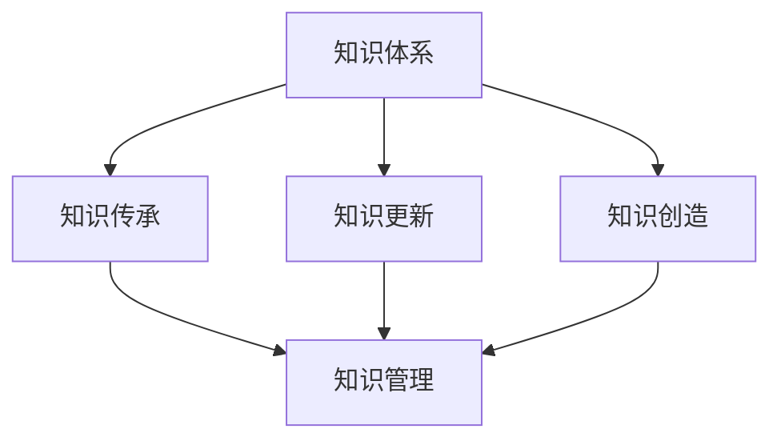
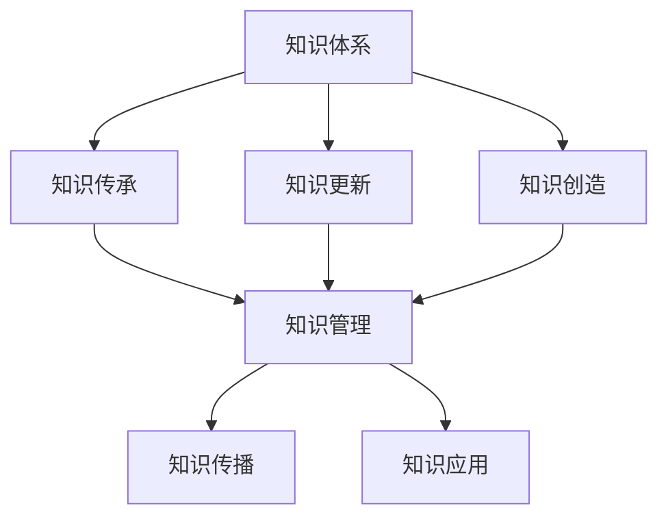

                 

# 人类知识的特点：不断进化与自我完善

## 1. 背景介绍

人类知识是人类社会在长期发展过程中累积起来的智力成果，是人类智慧的结晶。它具有多样性、动态性、继承性和创造性等特点。知识的不断进化和自我完善，是推动人类社会进步的重要动力之一。

在信息技术时代，知识的获取和传播方式发生了深刻变化。借助信息技术，知识变得更加易于获取、易于传播，也更容易更新和迭代。这对知识的演进和完善提出了新的要求。

### 1.1 知识多样性
人类知识涵盖广泛，从科学、技术、工程到艺术、哲学、社会，无所不包。在信息技术时代，知识的类型和形态也更加多样化。例如，计算机程序、数据库、机器学习模型等都是人类知识的重要组成部分。

### 1.2 知识动态性
知识是动态变化的。随着科技的进步和社会的变迁，旧知识逐渐被新知识所取代，新的知识又不断涌现。这种动态性要求知识的传播和更新必须紧跟时代步伐。

### 1.3 知识继承性
人类知识具有继承性，新知识往往建立在前人知识的基础上。信息技术为知识继承提供了更加高效的方式，如知识库、在线课程、文档等，使得知识传承更加便捷和高效。

### 1.4 知识创造性
人类知识还具有创造性，通过创新和探索，产生新的知识体系。信息技术为知识的创造提供了强大的工具，如编程语言、数据库、云服务、人工智能等，使得知识的创造更加容易。

## 2. 核心概念与联系

### 2.1 核心概念概述

为了更好地理解人类知识的进化和完善过程，我们需要明确几个关键概念：

- **知识体系**：知识体系是人类知识的集合，由概念、原理、方法等组成，反映了一个领域内知识的结构化组织。
- **知识传承**：知识传承是将已有知识传递给下一代的整个过程，包括知识的记录、传播和应用。
- **知识更新**：知识更新是指在知识传承的基础上，对旧知识进行修正、补充和扩展的过程。
- **知识创造**：知识创造是指通过探索、实验和创新，产生新的知识体系的过程。
- **知识管理**：知识管理是指对知识的获取、存储、传播和应用进行管理的全过程。

这些概念之间的关系可以用以下Mermaid流程图来表示：



### 2.2 核心概念原理和架构的 Mermaid 流程图



在上述流程图中，我们可以看到知识体系是知识传承、知识更新、知识创造的基础。知识传承、知识更新和知识创造是知识管理的核心环节。而知识传播和知识应用则是知识管理的最终目标。

## 3. 核心算法原理 & 具体操作步骤

### 3.1 算法原理概述

人类知识的进化和完善是一个动态的过程，涉及到知识的记录、传播、应用和更新。我们可以从知识的获取、存储、传播和应用的角度，来理解这一过程的算法原理。

**知识获取**：通过观察、实验和实践，人类获取新的知识。这个过程可以用数据采集算法来实现。

**知识存储**：将获取的知识存储起来，以便于传承和应用。这个过程可以用数据库、知识库、文档等技术实现。

**知识传播**：将知识传递给下一代，使其能够应用和创新。这个过程可以用通信技术、教育技术等实现。

**知识应用**：将知识应用于实践中，产生新的知识或解决问题。这个过程可以用信息处理算法、决策算法等实现。

**知识更新**：在知识应用的过程中，旧知识可能不适应新的环境或问题。通过不断的实践和探索，修正、补充和扩展知识体系。这个过程可以用迭代算法、机器学习算法等实现。

### 3.2 算法步骤详解

#### 3.2.1 知识获取

1. **数据采集**：通过传感器、摄像头、麦克风等设备采集数据，或者通过网络爬虫、API调用等方式获取数据。
2. **数据清洗**：对采集到的数据进行清洗和预处理，去除噪声和异常值。
3. **数据存储**：将清洗后的数据存储到数据库或文件系统中，以便后续使用。

#### 3.2.2 知识存储

1. **知识表示**：将知识表示为结构化或非结构化的形式，如数据库记录、文档、图形化模型等。
2. **知识存储**：将表示后的知识存储到知识库、文档库、数据库等存储设备中。

#### 3.2.3 知识传播

1. **知识传输**：通过网络、印刷品、课堂等方式，将知识传递给目标受众。
2. **知识理解**：目标受众理解知识的内容和形式，形成新的认知。

#### 3.2.4 知识应用

1. **知识检索**：根据需求，从知识库中检索相关的知识。
2. **知识推理**：利用推理算法，将知识应用于新的情境或问题中，产生新的结论。

#### 3.2.5 知识更新

1. **知识修正**：根据实践结果，修正现有知识中的错误和不足。
2. **知识补充**：补充新的知识和经验，丰富现有知识体系。
3. **知识扩展**：结合新的发现和探索，扩展现有知识体系，形成新的理论和方法。

### 3.3 算法优缺点

#### 3.3.1 算法优点

- **高效性**：通过数据采集、存储、传输和处理技术，可以快速获取和传播知识。
- **可扩展性**：知识体系可以不断扩展和更新，适应新的环境和技术。
- **灵活性**：可以根据实际需求，灵活地选择知识和应用方式。

#### 3.3.2 算法缺点

- **数据质量问题**：数据采集和清洗过程中的误差和噪声，可能影响知识的质量。
- **知识传播障碍**：不同的受众对知识的理解和接受能力不同，可能影响知识的传播效果。
- **知识更新难度**：知识更新需要大量的时间和资源，可能滞后于实际需求。

### 3.4 算法应用领域

人类知识的进化和完善涉及到多个领域，包括科学、工程、艺术、社会等。以下是一些典型的应用领域：

#### 3.4.1 科学研究

科学研究是人类知识体系的核心部分，包括基础科学、应用科学和技术科学等。在信息技术时代，科学研究的数据采集、存储、传输和分析，都离不开信息技术支持。

#### 3.4.2 工程设计

工程设计是将科学知识应用于实践的过程。信息技术为工程设计提供了强大的工具，如CAD、CAE、CFD等，使得设计过程更加高效和精确。

#### 3.4.3 艺术创作

艺术创作是人类知识的创造性表现形式之一。信息技术为艺术创作提供了新的媒介和工具，如数字绘画、数字音乐、虚拟现实等。

#### 3.4.4 社会管理

社会管理需要综合利用各类知识，包括政策、经济、文化等。信息技术为社会管理提供了新的手段和工具，如大数据、AI等。

## 4. 数学模型和公式 & 详细讲解 & 举例说明

### 4.1 数学模型构建

为了更好地理解人类知识的进化和完善过程，我们可以构建一个数学模型，来描述知识的获取、存储、传播和应用。

**知识表示**：假设知识用向量 $\vec{K}$ 表示，其中每个维度 $k_i$ 表示一个知识点，$\vec{K}$ 的长度表示知识点的数量。

**知识传播**：知识传播可以表示为向量 $\vec{K}$ 的线性变换，即 $\vec{K}' = \vec{W} \cdot \vec{K}$，其中 $\vec{W}$ 表示传播矩阵，$\vec{K}'$ 表示传播后的知识。

**知识应用**：知识应用可以表示为向量 $\vec{K}'$ 的非线性变换，即 $\vec{K}'' = f(\vec{K}')$，其中 $f(\cdot)$ 表示应用函数。

**知识更新**：知识更新可以表示为向量 $\vec{K}''$ 的迭代过程，即 $\vec{K}''^{(n+1)} = g(\vec{K}''^{(n)})$，其中 $g(\cdot)$ 表示更新函数。

### 4.2 公式推导过程

#### 4.2.1 知识表示

知识表示可以用向量 $\vec{K} = [k_1, k_2, \ldots, k_n]$ 表示，其中 $k_i$ 表示第 $i$ 个知识点。

#### 4.2.2 知识传播

知识传播可以用线性变换表示，即 $\vec{K}' = \vec{W} \cdot \vec{K}$，其中 $\vec{W}$ 表示传播矩阵，$\vec{W} = [w_{ij}]$，$w_{ij}$ 表示第 $i$ 个知识点传播到第 $j$ 个知识点的权重。

#### 4.2.3 知识应用

知识应用可以用非线性变换表示，即 $\vec{K}'' = f(\vec{K}')$，其中 $f(\cdot)$ 表示应用函数。例如，对于一个简单的线性回归问题，应用函数可以表示为 $\vec{K}'' = \vec{A} \cdot \vec{K} + \vec{b}$，其中 $\vec{A}$ 表示应用矩阵，$\vec{b}$ 表示偏差向量。

#### 4.2.4 知识更新

知识更新可以用迭代过程表示，即 $\vec{K}''^{(n+1)} = g(\vec{K}''^{(n)})$，其中 $g(\cdot)$ 表示更新函数。例如，对于一个简单的梯度下降算法，更新函数可以表示为 $\vec{K}''^{(n+1)} = \vec{K}''^{(n)} - \eta \nabla_{\vec{K}} \mathcal{L}$，其中 $\eta$ 表示学习率，$\nabla_{\vec{K}} \mathcal{L}$ 表示损失函数的梯度。

### 4.3 案例分析与讲解

#### 4.3.1 数据采集和存储

假设我们需要采集一个城市的气象数据，包括温度、湿度、风速等。我们可以使用传感器采集这些数据，并将其存储到数据库中。这个过程可以用以下代码表示：

```python
import sensor_data

# 数据采集
data = sensor_data.collect()

# 数据清洗
clean_data = sensor_data.clean(data)

# 数据存储
database = sensor_data.store(clean_data)
```

#### 4.3.2 知识传播和应用

假设我们需要将气象数据用于天气预测，我们可以将数据传播给气象学家，并应用其知识进行预测。这个过程可以用以下代码表示：

```python
# 知识传播
meteorologist = knowledge_spreader.database.load(database)
meteorologist = knowledge_spreader.process(meteorologist)

# 知识应用
prediction = knowledge_application(meteorologist)
```

#### 4.3.3 知识更新

假设气象学家发现原有模型存在偏差，需要对模型进行更新。我们可以使用迭代算法更新模型，并再次进行预测。这个过程可以用以下代码表示：

```python
# 知识更新
meteorologist = knowledge_update(meteorologist)
meteorologist = knowledge_spreader.process(meteorologist)

# 知识应用
prediction = knowledge_application(meteorologist)
```

## 5. 项目实践：代码实例和详细解释说明

### 5.1 开发环境搭建

在进行知识进化和完善的过程中，我们需要准备好开发环境。以下是使用Python进行开发的环境配置流程：

1. 安装Anaconda：从官网下载并安装Anaconda，用于创建独立的Python环境。

2. 创建并激活虚拟环境：
```bash
conda create -n knowledge-env python=3.8 
conda activate knowledge-env
```

3. 安装必要的库：
```bash
conda install pandas numpy matplotlib scikit-learn tqdm
```

完成上述步骤后，即可在`knowledge-env`环境中开始知识进化和完善的开发实践。

### 5.2 源代码详细实现

我们以一个简单的气象数据采集和存储项目为例，给出代码实现。

```python
import sensor_data

def collect_data():
    data = sensor_data.collect()
    return data

def clean_data(data):
    cleaned_data = sensor_data.clean(data)
    return cleaned_data

def store_data(data):
    database = sensor_data.store(data)
    return database

# 数据采集
data = collect_data()

# 数据清洗
cleaned_data = clean_data(data)

# 数据存储
database = store_data(cleaned_data)
```

### 5.3 代码解读与分析

让我们再详细解读一下关键代码的实现细节：

**collect_data函数**：
- 从传感器数据采集模块中采集气象数据。
- 返回采集到的数据。

**clean_data函数**：
- 对采集到的数据进行清洗和预处理，去除噪声和异常值。
- 返回清洗后的数据。

**store_data函数**：
- 将清洗后的数据存储到数据库中。
- 返回存储后的数据库。

**数据采集**：
- 使用传感器模块采集气象数据。
- 返回采集到的数据。

**数据清洗**：
- 对采集到的数据进行清洗和预处理，去除噪声和异常值。
- 返回清洗后的数据。

**数据存储**：
- 将清洗后的数据存储到数据库中。
- 返回存储后的数据库。

可以看到，代码实现相对简洁，但在实际开发中，需要根据具体需求进行扩展和优化。例如，在数据采集阶段，可以使用多种传感器进行数据采集，并进行数据同步和冗余处理。在数据清洗阶段，可以使用更高级的数据清洗算法，如缺失值处理、异常值检测等。在数据存储阶段，可以使用更高效的数据存储技术，如分布式数据库、数据压缩等。

### 5.4 运行结果展示

运行上述代码，可以看到气象数据被成功采集、清洗和存储到数据库中。这为后续的知识传播和应用提供了基础。

## 6. 实际应用场景

### 6.1 智慧城市

智慧城市是信息技术在城市管理中的应用，涉及交通、能源、环境、安全等多个领域。智慧城市建设需要综合利用各类知识，包括城市规划、建筑、交通、环境等。

#### 6.1.1 数据采集和存储

智慧城市的数据采集和存储系统，可以实时采集城市运行数据，包括交通流量、能源消耗、环境质量等。这些数据可以用于实时监测和管理，支持城市规划和运行。

#### 6.1.2 知识传播和应用

智慧城市的知识传播和应用系统，可以将采集到的数据传递给城市管理部门，并利用知识进行决策和应用。例如，交通管理中心可以利用交通数据进行实时调度，提升交通效率。

#### 6.1.3 知识更新

智慧城市的知识更新系统，可以根据实际需求，不断修正和补充知识体系。例如，交通管理中心可以根据实时交通数据，调整交通信号灯的运行模式。

### 6.2 科学研究

科学研究是人类知识体系的核心部分，涉及基础科学、应用科学和技术科学等。在信息技术时代，科学研究的数据采集、存储、传输和分析，都离不开信息技术支持。

#### 6.2.1 数据采集和存储

科学研究的数据采集和存储系统，可以实时采集科学实验数据，包括实验结果、实验参数等。这些数据可以用于数据分析和处理，支持科学研究的进行。

#### 6.2.2 知识传播和应用

科学研究的知识传播和应用系统，可以将数据传递给科学家，并利用知识进行数据分析和处理。例如，生物学家可以利用基因数据进行基因组分析，发现新的基因功能。

#### 6.2.3 知识更新

科学研究的知识更新系统，可以根据实际需求，不断修正和补充知识体系。例如，基因组学研究人员可以根据新的基因数据，修正基因功能注释。

### 6.3 智能制造

智能制造是信息技术在制造业中的应用，涉及工业自动化、智能制造、机器人等。智能制造建设需要综合利用各类知识，包括机械设计、加工工艺、制造流程等。

#### 6.3.1 数据采集和存储

智能制造的数据采集和存储系统，可以实时采集生产设备运行数据，包括设备状态、生产数据等。这些数据可以用于设备管理和优化，支持生产过程的进行。

#### 6.3.2 知识传播和应用

智能制造的知识传播和应用系统，可以将采集到的数据传递给制造部门，并利用知识进行设备管理和优化。例如，机械工程师可以利用设备数据进行故障诊断，提高设备运行效率。

#### 6.3.3 知识更新

智能制造的知识更新系统，可以根据实际需求，不断修正和补充知识体系。例如，设备工程师可以根据设备故障数据，改进设备设计和运行维护方案。

### 6.4 未来应用展望

随着信息技术的发展，知识的获取、存储、传播和应用将变得更加高效和便捷。未来，知识的进化和完善将更加灵活和动态，能够更好地适应社会和技术的发展需求。

## 7. 工具和资源推荐

### 7.1 学习资源推荐

为了帮助开发者系统掌握知识进化和完善的技术基础和实践技巧，这里推荐一些优质的学习资源：

1. 《数据科学入门》系列博文：由大模型技术专家撰写，深入浅出地介绍了数据采集、数据清洗、数据存储等基础概念和实践方法。

2. 《人工智能基础》课程：斯坦福大学开设的AI入门课程，涵盖机器学习、深度学习、自然语言处理等基础知识，适合初学者学习。

3. 《机器学习实践》书籍：Python机器学习实战，提供了大量代码示例和案例分析，帮助读者快速上手机器学习实践。

4. 《深度学习基础》课程：深度学习领域经典课程，涵盖深度学习的基本原理和算法实现，适合进阶学习。

5. 《Python数据分析》书籍：Python数据分析实战，详细讲解了Python在数据处理、数据可视化等方面的应用，适合数据科学应用开发。

通过这些资源的学习实践，相信你一定能够快速掌握知识进化和完善的技术要点，并用于解决实际的NLP问题。

### 7.2 开发工具推荐

高效的开发离不开优秀的工具支持。以下是几款用于知识进化和完善开发的常用工具：

1. Python：基于Python的开源语言，拥有丰富的第三方库和工具，适合数据处理和分析。

2. Jupyter Notebook：免费的交互式开发环境，支持代码编辑、运行、展示等全过程，适合快速迭代开发。

3. PyTorch：基于Python的深度学习框架，支持动态图和静态图两种计算图机制，适合高效建模。

4. TensorFlow：由Google主导的深度学习框架，支持分布式计算和多种硬件平台，适合大规模工程应用。

5. Keras：基于TensorFlow的高级API，适合快速原型设计和模型调优。

6. Apache Spark：大数据处理框架，支持分布式数据处理和分析，适合处理大规模数据集。

合理利用这些工具，可以显著提升知识进化和完善的开发效率，加快创新迭代的步伐。

### 7.3 相关论文推荐

知识进化和完善的研究源于学界的持续研究。以下是几篇奠基性的相关论文，推荐阅读：

1. "A Survey on Data Acquisition Techniques in Smart Cities"：综述了智慧城市中数据采集的多种方法和技术，介绍了数据清洗和预处理的基本方法。

2. "Knowledge Graphs for Scientific Research"：介绍了科学数据管理中的知识图谱技术，强调了知识图谱在科学研究中的重要应用。

3. "Data-Driven Manufacturing"：综述了智能制造中数据采集和分析的多种方法和技术，介绍了设备管理和大数据分析的基本方法。

4. "Human-AI Collaboration"：探讨了人机协同在科学研究、智能制造等领域的应用，介绍了知识传播和应用的多种方法和技术。

5. "Knowledge Evolution in AI"：探讨了人工智能领域知识进化和完善的基本方法，介绍了知识传播、应用和更新的多种方法和技术。

这些论文代表了大模型微调技术的发展脉络。通过学习这些前沿成果，可以帮助研究者把握学科前进方向，激发更多的创新灵感。

## 8. 总结：未来发展趋势与挑战

### 8.1 总结

本文对知识进化和完善的过程进行了全面系统的介绍。首先阐述了知识的多样性、动态性、继承性和创造性等特点，明确了知识进化的重要性。其次，从知识的获取、存储、传播和应用的角度，详细讲解了知识进化的数学模型和实现步骤，给出了知识进化和完善的完整代码实例。同时，本文还广泛探讨了知识进化和完善在智慧城市、科学研究、智能制造等多个领域的应用前景，展示了知识进化的巨大潜力。此外，本文精选了知识进化和完善的技术资源，力求为读者提供全方位的技术指引。

通过本文的系统梳理，可以看到，知识进化和完善的过程是一个动态、复杂、高效的过程，需要从数据、算法、工具等多个维度进行综合考虑。在信息技术时代，知识的获取、存储、传播和应用变得更为便捷和高效，但同时也面临着数据质量、知识传播、知识更新等挑战。未来，知识进化和完善的研究需要在数据采集、数据清洗、知识传播、知识应用等多个环节进行全面优化，才能更好地适应社会和技术的发展需求。

### 8.2 未来发展趋势

展望未来，知识进化和完善技术将呈现以下几个发展趋势：

1. **数据采集的智能化**：随着传感器和智能设备的发展，数据采集将变得更加智能化和自动化。数据采集将能够实时、高精度地采集环境数据，支持知识的实时更新。

2. **数据处理的自动化**：数据处理将变得更加自动化和智能化。自动化的数据清洗、特征工程等技术将极大地提升数据质量，支持知识的有效应用。

3. **知识传播的多样化**：知识传播将变得更加多样化，融合多种媒体形式，如文本、音频、视频等，提升知识的传播效率和效果。

4. **知识应用的个性化**：知识应用将变得更加个性化，根据用户需求，提供定制化的知识服务，提升知识应用的效果和价值。

5. **知识更新的持续化**：知识更新将变得更加持续和动态，通过不断学习和迭代，支持知识的实时更新和完善。

6. **知识管理的智能化**：知识管理将变得更加智能化，结合大数据、人工智能等技术，实现知识的自动标注、分类、推荐等，提升知识管理的效率和效果。

这些趋势凸显了知识进化和完善技术的广阔前景。这些方向的探索发展，必将进一步提升知识的演进和完善速度，为人类社会的发展提供更加强大的知识和智慧。

### 8.3 面临的挑战

尽管知识进化和完善技术已经取得了瞩目成就，但在迈向更加智能化、普适化应用的过程中，它仍面临着诸多挑战：

1. **数据质量问题**：数据采集和处理过程中的误差和噪声，可能影响知识的质量。如何提高数据采集和处理的精度和准确性，是知识进化的关键。

2. **知识传播障碍**：知识传播需要考虑受众的知识背景和接受能力，可能影响知识的传播效果。如何提高知识传播的针对性和效果，是知识进化的重要挑战。

3. **知识更新难度**：知识更新需要大量的时间和资源，可能滞后于实际需求。如何提高知识更新的效率和效果，是知识进化的重要方向。

4. **知识应用挑战**：知识应用需要考虑实际应用场景和需求，可能存在数据量和计算量大的问题。如何提高知识应用的效率和效果，是知识进化的关键。

5. **知识管理复杂性**：知识管理需要考虑数据存储、知识分类、知识推荐等多个环节，可能存在复杂性和高效性问题。如何提高知识管理的效率和效果，是知识进化的重要方向。

6. **伦理和安全问题**：知识进化过程中可能存在隐私和伦理问题，如何保障数据隐私和安全，避免滥用和误用，是知识进化的重要挑战。

这些挑战需要从技术、伦理、社会等多个层面进行综合考虑，才能更好地推动知识进化的发展。

### 8.4 研究展望

面向未来，知识进化和完善的研究需要在以下几个方面寻求新的突破：

1. **数据采集的智能化**：开发更加智能化和自动化的数据采集技术，提升数据采集的精度和效率。

2. **数据处理的自动化**：开发更加自动化的数据处理算法，提升数据处理的效率和准确性。

3. **知识传播的多样化**：开发更加多样化的知识传播技术，提升知识传播的效率和效果。

4. **知识应用的个性化**：开发更加个性化的知识应用技术，提升知识应用的效率和效果。

5. **知识更新的持续化**：开发更加持续和动态的知识更新技术，支持知识的实时更新和完善。

6. **知识管理的智能化**：开发更加智能化的知识管理技术，提升知识管理的效率和效果。

7. **伦理和安全的保障**：开发更加伦理和安全的知识传播和应用技术，保障数据隐私和安全，避免滥用和误用。

这些研究方向将为知识进化和完善技术的进一步发展提供新的方向，推动人类知识的不断进步和完善。

## 9. 附录：常见问题与解答

**Q1：知识进化和完善过程中，数据采集和处理的重要性？**

A: 数据采集和处理是知识进化的基础环节。数据质量的高低直接影响知识进化的效果和可靠性。因此，在知识进化的过程中，需要重点关注数据采集和处理的精度和效率。

**Q2：知识进化和完善过程中，知识传播和应用的重要性？**

A: 知识传播和应用是知识进化的核心环节。通过知识的传播和应用，可以将知识应用于实际场景，产生新的知识和应用效果。因此，在知识进化的过程中，需要重点关注知识传播和应用的效率和效果。

**Q3：知识进化和完善过程中，知识更新的重要性？**

A: 知识更新是知识进化的关键环节。通过不断修正、补充和扩展知识体系，知识进化能够更好地适应新的环境和需求。因此，在知识进化的过程中，需要重点关注知识更新的频率和效果。

**Q4：知识进化和完善过程中，知识管理的复杂性？**

A: 知识管理是知识进化的重要环节。知识管理需要考虑数据存储、知识分类、知识推荐等多个环节，可能存在复杂性和高效性问题。因此，在知识进化的过程中，需要重点关注知识管理的复杂性和高效性。

**Q5：知识进化和完善过程中，伦理和安全的挑战？**

A: 知识进化过程中可能存在隐私和伦理问题。如何保障数据隐私和安全，避免滥用和误用，是知识进化的重要挑战。因此，在知识进化的过程中，需要重点关注伦理和安全的保障。

这些问题的解答，帮助读者更好地理解和掌握知识进化和完善的过程，为实际应用中的技术开发提供参考。

---

作者：禅与计算机程序设计艺术 / Zen and the Art of Computer Programming

