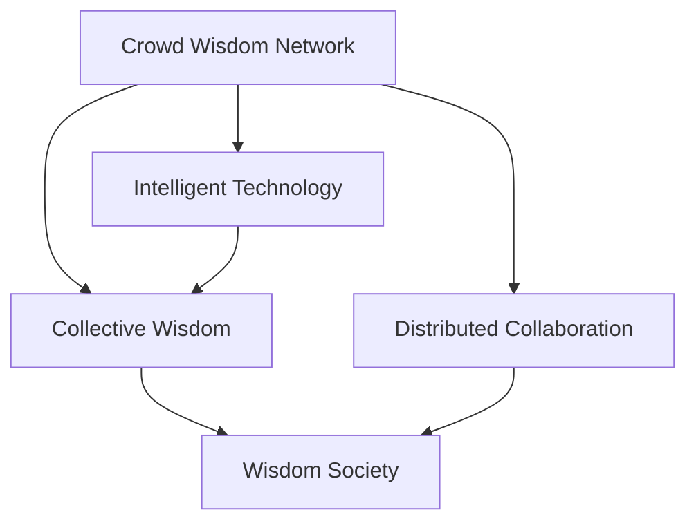

                 

# 人类知识的集体智慧：众智成城

> 关键词：众智成城,人类知识,集体智慧,分布式协作,智慧社会

## 1. 背景介绍

### 1.1 问题由来
人类社会的进步离不开知识的积累与传播。知识的获取、保存与共享，始终是推动人类文明发展的核心动力。然而，随着信息爆炸与知识碎片化，如何将庞大的知识体系有效地整理、整合，并快速应用于实际问题，成为了新的挑战。

在互联网时代，大数据和人工智能技术的兴起，为人类知识的整合与运用提供了新的可能。众智成城，正是一种通过分布式协作和智能技术，将人类智慧汇聚成更强大集体智慧的探索方向。

### 1.2 问题核心关键点
众智成城的核心理念在于将人类的智慧和经验，通过算法和技术的加工处理，形成集体智慧，并用于解决实际问题。其关键点包括：
- 分布式协作：人类智慧通过网络汇聚，形成众智网络。
- 智能技术：利用人工智能、大数据等技术，对众智网络进行高效处理和应用。
- 集体智慧：通过智能技术处理后的数据，形成集体智慧，应用于实际问题解决。

### 1.3 问题研究意义
众智成城的提出，对于知识经济时代的人类社会有着深远的意义：
- 提升知识获取效率：通过分布式协作和智能技术，大幅提升知识获取和整合的效率。
- 优化知识应用效果：集体智慧的形成，使得知识的应用更加精准和有效。
- 促进社会进步：智慧社会的发展离不开知识的普及和应用，众智成城为构建智慧社会提供了新的路径。
- 创新驱动发展：通过集体智慧的应用，推动科技创新和产业升级，促进经济增长。

## 2. 核心概念与联系

### 2.1 核心概念概述

为更好地理解众智成城的概念，本节将介绍几个密切相关的核心概念：

- **众智网络(Crowd Wisdom Network)**：由多个智慧节点（个体或团队）构成的分布式网络，每个节点提供其独有的知识和智慧。
- **集体智慧(Collective Wisdom)**：通过智能技术对众智网络中的知识进行整合、处理和应用，形成具有更强集体效应的智慧。
- **分布式协作(Distributed Collaboration)**：在众智网络中，智慧节点通过算法和机制进行协同工作，提升知识整合效率。
- **智能技术(Intelligent Technology)**：如人工智能、大数据、区块链等，用于处理和应用众智网络中的知识。
- **智慧社会(Intelligent Society)**：通过集体智慧的应用，构建的更加智能化、高效化、人本化的社会形态。

这些概念之间的逻辑关系可以通过以下Mermaid流程图来展示：



这个流程图展示了众智成城的关键组件及其之间的关系：

1. 众智网络提供基础的智慧资源。
2. 智能技术对众智网络中的知识进行整合处理，形成集体智慧。
3. 集体智慧应用于智慧社会，推动社会进步。
4. 分布式协作机制提升知识整合效率。

## 3. 核心算法原理 & 具体操作步骤
### 3.1 算法原理概述

众智成城的核心算法原理基于分布式协作和智能技术，具体步骤如下：

1. **众智网络构建**：建立众智网络，每个智慧节点提供其独有的知识和经验。
2. **智能技术整合**：利用人工智能、大数据等智能技术，对众智网络中的知识进行整合和处理。
3. **集体智慧形成**：通过算法将处理后的知识形成集体智慧，提升知识应用效果。
4. **智慧社会应用**：将集体智慧应用于实际问题解决，推动智慧社会的发展。

### 3.2 算法步骤详解

众智成城的核心步骤包括：

**Step 1: 众智网络构建**
- 定义智慧节点的标识和提供知识的方式。
- 通过互联网、社交媒体等平台，汇聚智慧节点。
- 确保智慧节点的多样性和覆盖面，涵盖不同的领域和角度。

**Step 2: 智能技术整合**
- 选择适合的技术，如深度学习、知识图谱等，对众智网络中的知识进行整合。
- 利用大数据分析，找出知识间的关联性和差异性。
- 应用人工智能技术，如聚类、分类、推荐等，对知识进行结构化处理。

**Step 3: 集体智慧形成**
- 定义集体智慧的目标和应用场景。
- 设计算法，将处理后的知识转化为集体智慧。
- 通过智能平台发布和共享集体智慧，提供查询和使用接口。

**Step 4: 智慧社会应用**
- 确定集体智慧的应用场景，如医疗、教育、交通等。
- 设计系统架构，集成集体智慧的应用。
- 不断反馈和优化集体智慧，提升应用效果。

### 3.3 算法优缺点

众智成城的算法具有以下优点：
1. 高效整合知识：通过智能技术，可以快速高效地整合和处理海量知识，形成集体智慧。
2. 提升应用效果：集体智慧的决策具有集体优势，能够更精准地解决实际问题。
3. 广泛覆盖领域：由于众智网络的多样性，智慧涵盖的领域更加广泛，能够应对更多实际问题。
4. 促进社会创新：通过集体智慧的应用，推动各领域的创新和发展。

同时，众智成城的算法也存在一些局限性：
1. 依赖智慧节点：众智成城的成效高度依赖于智慧节点的质量和数量，需要持续维护和管理。
2. 隐私和安全问题：众智网络中的知识可能涉及隐私和敏感信息，需要建立有效的隐私保护机制。
3. 技术复杂度：智能技术的应用需要较高的技术门槛，对技术开发和维护人员的要求较高。
4. 知识冲突处理：智慧节点提供的知识可能存在冲突，需要设计合理的冲突处理机制。

尽管存在这些局限性，但就目前而言，众智成城的算法对于构建智慧社会具有重要的指导意义。未来相关研究的重点在于如何进一步降低技术门槛，提高数据隐私保护，同时兼顾知识的冲突处理。

### 3.4 算法应用领域

众智成城的算法已经在多个领域得到了应用，包括但不限于：

- **医疗健康**：利用众智网络汇聚医学专家和患者的经验，通过智能技术形成集体智慧，用于疾病诊断、治疗方案推荐等。
- **教育培训**：通过众智网络收集教师和学生的知识，应用人工智能技术进行教育资源的整合，提升教学效果和学习效率。
- **城市管理**：利用众智网络汇聚城市管理者的智慧，通过智能技术形成集体智慧，用于交通规划、环境监测等。
- **金融服务**：汇集金融从业者的智慧，通过智能技术处理和分析，形成集体智慧，用于风险评估、投资策略制定等。
- **环境保护**：通过众智网络汇聚环保专家的知识，应用智能技术处理数据，形成集体智慧，用于环境监测、资源管理等。

除了这些经典应用外，众智成城的算法还将随着技术的不断演进，拓展到更多领域，为社会发展和进步提供更多支持。

## 4. 数学模型和公式 & 详细讲解 & 举例说明
### 4.1 数学模型构建

假设众智网络中的智慧节点数为 $N$，每个节点的知识表示为 $x_i$，其中 $i=1,2,\ldots,N$。利用智能技术 $\mathcal{T}$ 对知识进行整合，形成集体智慧 $\mathcal{W}$。

数学模型构建如下：

$$
\mathcal{W} = f_\mathcal{T}(\{x_i\}_{i=1}^N)
$$

其中 $f_\mathcal{T}$ 表示智能技术 $\mathcal{T}$ 的函数形式。

### 4.2 公式推导过程

以深度学习中的神经网络为例，进行集体智慧的推导：

假设众智网络中的智慧节点提供的知识为词向量，记为 $\{x_i\}_{i=1}^N$。使用深度神经网络 $\mathcal{N}$ 进行知识整合：

$$
\mathcal{W} = \mathcal{N}(\{x_i\}_{i=1}^N)
$$

神经网络的输入为 $x_i$，输出为 $w$，表示集体智慧。神经网络的隐藏层表示为 $h$，定义如下：

$$
h = \sigma(W_h x + b_h)
$$

其中 $W_h$ 为权重矩阵，$b_h$ 为偏置向量，$\sigma$ 为激活函数。

输出层定义为：

$$
w = \sigma(W_w h + b_w)
$$

其中 $W_w$ 为权重矩阵，$b_w$ 为偏置向量。

最终集体智慧的数学形式为：

$$
\mathcal{W} = \mathcal{N}(\{x_i\}_{i=1}^N) = \sigma(W_w \sigma(W_h x + b_h) + b_w)
$$

### 4.3 案例分析与讲解

假设在医疗领域，众智网络汇聚了多名医生的知识，每个医生提供关于某种疾病的诊断报告，记为 $x_i$。利用深度神经网络进行知识整合，形成集体智慧 $w$。

具体实现步骤如下：

1. **知识表示**：将每个医生的诊断报告转换为词向量形式 $x_i$。
2. **神经网络模型**：设计深度神经网络模型，将词向量作为输入，输出诊断结果 $w$。
3. **训练模型**：利用标注的疾病诊断数据，对神经网络模型进行训练。
4. **集体智慧应用**：根据新病例的诊断报告，利用训练好的模型生成集体智慧 $w$，用于辅助医生诊断。

## 5. 项目实践：代码实例和详细解释说明
### 5.1 开发环境搭建

在进行众智成城的实践前，我们需要准备好开发环境。以下是使用Python进行众智成城的开发环境配置流程：

1. 安装Anaconda：从官网下载并安装Anaconda，用于创建独立的Python环境。

2. 创建并激活虚拟环境：
```bash
conda create -n crowd_wisdom_env python=3.8 
conda activate crowd_wisdom_env
```

3. 安装相关库：
```bash
pip install numpy pandas torch transformers
```

4. 安装TensorBoard：用于可视化模型训练过程和结果。

完成上述步骤后，即可在`crowd_wisdom_env`环境中开始众智成城的开发实践。

### 5.2 源代码详细实现

以下是一个简化的代码示例，演示如何使用TensorFlow进行众智成城的知识整合和集体智慧生成：

```python
import tensorflow as tf
from transformers import BertTokenizer, BertModel
import numpy as np
import pandas as pd

# 定义神经网络模型
class CrowdWisdomNet(tf.keras.Model):
    def __init__(self, num_classes):
        super(CrowdWisdomNet, self).__init__()
        self.bert = BertModel.from_pretrained('bert-base-uncased')
        self.dense = tf.keras.layers.Dense(num_classes, activation='softmax')
        
    def call(self, x):
        with tf.name_scope('bert'):
            _, pooled_output = self.bert(x, return_dict=False, attention_mask=True)
        with tf.name_scope('dense'):
            return self.dense(pooled_output)

# 构建众智网络
tokenizer = BertTokenizer.from_pretrained('bert-base-uncased')
def load_knowledge(knowledge_path):
    df = pd.read_csv(knowledge_path)
    inputs = tokenizer(df['text'].tolist(), return_tensors='tf', padding='max_length', truncation=True, max_length=512)
    return inputs['input_ids']

# 训练神经网络模型
model = CrowdWisdomNet(num_classes=2)
inputs = load_knowledge('knowledge.csv')
labels = df['label'].tolist()
model.compile(optimizer=tf.keras.optimizers.Adam(learning_rate=2e-5), loss='categorical_crossentropy', metrics=['accuracy'])
model.fit(inputs, labels, epochs=10, batch_size=32)

# 生成集体智慧
new_knowledge = load_knowledge('new_knowledge.csv')
predictions = model.predict(new_knowledge)
```

这个代码示例展示了如何使用TensorFlow和Bert模型，对众智网络中的知识进行整合和应用。具体步骤如下：

1. **构建神经网络模型**：定义Bert模型的输入和输出层。
2. **加载知识数据**：使用BertTokenizer将知识数据转换为模型输入。
3. **训练模型**：利用标注数据训练神经网络模型。
4. **生成集体智慧**：对新的知识数据进行预测，生成集体智慧。

### 5.3 代码解读与分析

让我们再详细解读一下关键代码的实现细节：

**CrowdWisdomNet类**：
- `__init__`方法：初始化神经网络模型，包含Bert模型的输入层和输出层。
- `call`方法：定义神经网络的前向传播过程，通过Bert模型提取特征，再经过全连接层生成输出。

**load_knowledge函数**：
- 使用BertTokenizer将知识数据转换为模型输入，设置最大长度和填充方式。

**训练模型**：
- 定义优化器、损失函数和评估指标。
- 使用训练数据训练模型，设置迭代次数和批量大小。

**生成集体智慧**：
- 对新的知识数据进行预测，生成集体智慧。

可以看到，通过TensorFlow和Bert模型，我们可以高效地进行众智成城的知识整合和应用。开发者可以将更多精力放在数据处理、模型改进等高层逻辑上，而不必过多关注底层的实现细节。

当然，工业级的系统实现还需考虑更多因素，如模型的保存和部署、超参数的自动搜索、更灵活的任务适配层等。但核心的众智成城范式基本与此类似。

## 6. 实际应用场景
### 6.1 智慧医疗

利用众智成城的理念，智慧医疗可以通过汇聚医疗专家的知识和经验，形成集体智慧，辅助医生的诊断和治疗决策。具体应用场景包括：

- **疾病诊断**：众智网络汇聚大量的临床医生和治疗专家，通过智能技术整合知识，形成针对某种疾病的集体智慧。当新病例出现时，医生可以通过查询集体智慧，快速获得疾病诊断建议。
- **治疗方案推荐**：根据病人的症状和历史治疗记录，众智网络中的知识可以通过智能技术整合，形成个性化的治疗方案推荐。

### 6.2 智能教育

在教育领域，众智成城的理念可以用于构建智能教育平台，提升教学效果和学习效率。具体应用场景包括：

- **个性化学习**：众智网络汇聚教师和学生的知识，通过智能技术整合，形成个性化的学习资源和推荐系统。学生可以通过众智平台获取适合自己的学习内容和资源。
- **智能答疑**：通过众智网络汇聚教师的知识和经验，应用智能技术形成集体智慧，用于回答学生的疑难问题。

### 6.3 智慧城市

在智慧城市建设中，众智成城的理念可以用于优化城市管理和公共服务。具体应用场景包括：

- **交通规划**：众智网络汇聚城市交通专家的知识，通过智能技术整合，形成集体智慧，用于交通流量预测和优化。
- **环境监测**：众智网络汇聚环境专家的知识，应用智能技术处理环境数据，形成集体智慧，用于环境监测和治理。

### 6.4 未来应用展望

随着众智成城技术的发展，未来的应用场景将更加广泛，潜力无限：

- **智慧政府**：众智网络汇聚政府各部门的知识，形成集体智慧，用于公共政策制定和决策支持。
- **智慧农业**：众智网络汇聚农业专家的知识，通过智能技术整合，形成集体智慧，用于农作物病虫害防治、农业技术推广等。
- **智慧安全**：众智网络汇聚安全专家的知识，通过智能技术整合，形成集体智慧，用于公共安全监测和预警。

此外，在医疗、教育、金融、环保等众多领域，众智成城的理念将不断拓展应用，为社会发展和进步提供更多支持。

## 7. 工具和资源推荐
### 7.1 学习资源推荐

为了帮助开发者系统掌握众智成城的理论基础和实践技巧，这里推荐一些优质的学习资源：

1. **众智成城框架**：由知名科研机构和公司推出的众智成城框架，包含从数据采集、知识整合到集体智慧应用的全流程工具。
2. **众智成城平台**：通过互联网平台汇聚智慧节点，提供知识共享和协作的解决方案。
3. **深度学习课程**：如斯坦福大学的深度学习课程，涵盖深度神经网络、知识图谱等众智成城核心技术。
4. **智慧社会白皮书**：介绍智慧社会的发展历程和应用前景，提供众智成城的实践案例和应用指南。
5. **众智成城论文集**：收集和总结众智成城的最新研究成果，涵盖技术创新和应用实践。

通过对这些资源的学习实践，相信你一定能够快速掌握众智成城的精髓，并用于解决实际的智慧社会问题。

### 7.2 开发工具推荐

高效的开发离不开优秀的工具支持。以下是几款用于众智成城的开发工具：

1. **TensorFlow**：开源深度学习框架，灵活的计算图和分布式训练功能，适合大规模知识整合项目。
2. **PyTorch**：动态计算图框架，高效易用的开发环境，适合快速迭代研究。
3. **Hadoop**：分布式计算平台，支持大规模数据处理和存储。
4. **Elasticsearch**：分布式搜索引擎，高效处理和查询海量数据。
5. **Kafka**：分布式消息队列，实现众智网络中的数据流传输和处理。

合理利用这些工具，可以显著提升众智成城的开发效率，加快创新迭代的步伐。

### 7.3 相关论文推荐

众智成城的理念源于学界的持续研究。以下是几篇奠基性的相关论文，推荐阅读：

1. **分布式人工智能（Distributed Artificial Intelligence, DAI）**：介绍分布式协作在人工智能中的应用，为众智成城提供了理论基础。
2. **智慧城市的概念与实践**：探讨智慧城市的发展历程和应用前景，提供众智成城在城市管理中的应用案例。
3. **基于知识图谱的众智成城应用**：研究知识图谱在众智成城中的作用，提供基于知识图谱的智慧社会构建方法。
4. **智能教育平台的设计与实现**：介绍智能教育平台的设计思路和关键技术，提供众智成城在教育领域的应用案例。
5. **众智成城的数据安全和隐私保护**：探讨众智成城中的数据安全和隐私保护问题，提供解决方案和最佳实践。

这些论文代表了大智成城的发展脉络。通过学习这些前沿成果，可以帮助研究者把握学科前进方向，激发更多的创新灵感。

## 8. 总结：未来发展趋势与挑战
### 8.1 总结

本文对众智成城的概念、原理和应用进行了全面系统的介绍。首先阐述了众智成城的核心理念，明确了通过分布式协作和智能技术形成集体智慧的独特价值。其次，从原理到实践，详细讲解了众智成城的数学模型和操作步骤，给出了具体的代码实例。同时，本文还广泛探讨了众智成城在智慧医疗、智能教育、智慧城市等多个领域的应用前景，展示了众智成城的巨大潜力。此外，本文精选了众智成城的各类学习资源，力求为读者提供全方位的技术指引。

通过本文的系统梳理，可以看到，众智成城作为一种通过分布式协作和智能技术形成集体智慧的方法，正在为知识经济时代的人类社会提供新的解决方案。众智成城的理念和技术，有望推动智慧社会的发展，提升各领域的创新能力和效率，带来深远的影响。

### 8.2 未来发展趋势

展望未来，众智成城的理念和技术将呈现以下几个发展趋势：

1. **技术多样化**：众智成城的实现将不再局限于深度学习，更多先进技术，如知识图谱、图神经网络等，将被引入，提升知识整合的效率和效果。
2. **应用场景拓展**：众智成城的理念将进一步应用于更多领域，如智慧农业、智慧能源、智慧环境等，推动各行业的智能化升级。
3. **数据质量提升**：众智成城的效果将高度依赖于数据的准确性和多样性。未来的发展将更加注重数据的清洗和预处理，提升数据质量。
4. **隐私保护加强**：众智成城中的数据隐私和安全问题将得到更多关注。未来的发展将更加注重隐私保护技术的应用，确保数据安全。
5. **系统架构优化**：众智成城的系统架构将更加复杂和多样，需要结合分布式计算、云计算等技术，构建高效、稳定、可扩展的智慧系统。

以上趋势凸显了众智成城技术的广阔前景。这些方向的探索发展，必将进一步提升众智成城的效果和应用范围，为构建智慧社会提供更多支持。

### 8.3 面临的挑战

尽管众智成城理念和技术已经取得了瞩目成就，但在迈向更加智能化、普适化应用的过程中，仍面临诸多挑战：

1. **技术门槛高**：众智成城的实施需要较高的技术门槛，对技术开发和维护人员的要求较高，难以大规模推广。
2. **数据质量和多样性**：众智成城的效果高度依赖于数据的质量和多样性，获取高质量、多样化的数据是关键挑战。
3. **隐私和安全问题**：众智成城中的数据隐私和安全问题，需要建立有效的隐私保护机制和数据安全策略。
4. **系统复杂度**：众智成城的系统架构和实现将更加复杂，需要结合分布式计算、云计算等技术，构建高效、稳定、可扩展的智慧系统。
5. **成本和资源消耗**：众智成城的实施需要大量计算资源和时间，对于中小型企业和小规模项目，成本较高。

尽管存在这些挑战，但通过持续的技术创新和实践探索，相信众智成城将成为构建智慧社会的重要手段，为人类社会的发展提供新的动力。

### 8.4 研究展望

面对众智成城所面临的挑战，未来的研究需要在以下几个方面寻求新的突破：

1. **技术自动化**：开发更多自动化工具，降低技术门槛，推动众智成城在各领域的广泛应用。
2. **数据整合优化**：研究如何高效地整合和处理海量数据，提升数据质量和多样性。
3. **隐私保护机制**：引入更多隐私保护技术，确保数据安全和用户隐私。
4. **系统架构优化**：设计更高效、更灵活的系统架构，提升系统性能和可扩展性。
5. **众智平台建设**：构建统一的众智平台，促进智慧节点的协作和知识共享。

这些研究方向将推动众智成城技术的不断演进，为智慧社会的发展提供更多支持。面向未来，众智成城技术还需要与其他人工智能技术进行更深入的融合，如知识表示、因果推理、强化学习等，多路径协同发力，共同推动自然语言理解和智能交互系统的进步。只有勇于创新、敢于突破，才能不断拓展知识体系的边界，让智能技术更好地服务于人类社会。

## 9. 附录：常见问题与解答

**Q1：众智成城是否适用于所有智慧应用场景？**

A: 众智成城的理念和技术在许多智慧应用场景中都有广泛的应用潜力。但需要注意的是，众智成城的效果高度依赖于数据的质量和多样性，对于数据量较小或数据质量不高的场景，效果可能有限。因此，在使用众智成城时，需要评估数据质量和多样性，确保其适用于该场景。

**Q2：如何确保众智成城中的数据隐私和安全？**

A: 众智成城中的数据隐私和安全问题需要得到高度重视。以下是一些常见的隐私保护措施：
1. 数据匿名化：在数据共享前，对数据进行匿名化处理，保护用户隐私。
2. 差分隐私：应用差分隐私技术，限制对个体数据的识别能力，保护数据隐私。
3. 联邦学习：通过分布式学习，在不共享数据的前提下，实现众智成城中的知识整合。
4. 访问控制：设置严格的访问权限，确保只有授权人员可以访问和操作数据。

**Q3：众智成城中的知识整合技术有哪些？**

A: 众智成城中的知识整合技术包括但不限于：
1. 深度学习：利用神经网络模型对知识进行整合，形成集体智慧。
2. 知识图谱：通过图神经网络等技术，构建知识图谱，提升知识整合的效果。
3. 自然语言处理：利用自然语言处理技术，对文本数据进行结构化处理，形成集体智慧。
4. 基于规则的系统：通过制定和应用规则，对知识进行整合和应用。

这些技术在众智成城的实施中，可以根据具体需求进行灵活组合，提升知识整合的效果。

**Q4：众智成城在实际应用中需要注意哪些问题？**

A: 在实际应用中，众智成城需要注意以下几个问题：
1. 数据质量：确保众智成城中的数据质量，避免数据噪声和错误对知识整合的影响。
2. 知识冲突：处理众智网络中不同知识之间的冲突，确保集体智慧的一致性和准确性。
3. 技术实现：选择适合的技术和工具，确保众智成城的实施高效和稳定。
4. 系统性能：优化系统架构和实现，提升众智成城的性能和可扩展性。
5. 用户反馈：定期收集用户反馈，优化众智成城的实施效果。

**Q5：众智成城的未来发展方向是什么？**

A: 众智成城的未来发展方向包括：
1. 技术多样化：引入更多先进技术，提升知识整合的效率和效果。
2. 应用场景拓展：将众智成城的理念和技术应用于更多领域，推动各行业的智能化升级。
3. 数据质量提升：提升数据质量和多样性，确保众智成城的实施效果。
4. 隐私保护加强：建立有效的隐私保护机制，确保数据安全和用户隐私。
5. 系统架构优化：设计更高效、更灵活的系统架构，提升系统性能和可扩展性。

这些方向将推动众智成城技术的不断演进，为构建智慧社会提供更多支持。

---

作者：禅与计算机程序设计艺术 / Zen and the Art of Computer Programming

