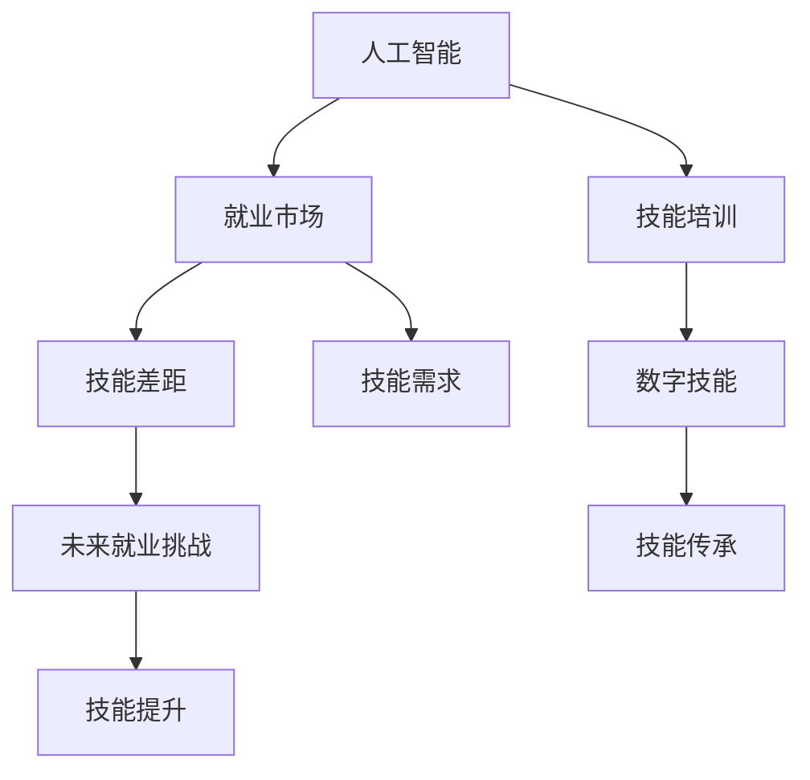

                 

# 人类计算：AI时代的未来就业市场与技能培训发展分析预测

> 关键词：人工智能(AI),未来就业市场,技能培训,大数据,数字技能

## 1. 背景介绍

### 1.1 问题由来
随着人工智能技术的迅速发展，许多领域的工作正在被自动化和智能化所替代。就业市场正面临着前所未有的变革，特别是传统制造业和劳动密集型产业正在逐步走向智能化。虽然自动化将提高生产效率，但同时也可能导致大量就业岗位的消失。如何适应这一变化，保障劳动力市场的稳定，成为各国政府和企业急需解决的重要问题。

在AI技术日益成熟的背景下，新兴的数字技能和跨领域技能需求日益增加。一方面，企业需要大量具备AI、大数据、云计算等新兴技术的高级人才，以推动数字化转型。另一方面，传统的职业技能也需要升级，以适应智能时代的挑战。这不仅是一个技术问题，更是一个社会问题，需要政府、企业和社会各界的共同努力。

### 1.2 问题核心关键点
本研究聚焦于AI时代就业市场和技能培训的发展趋势，探讨以下几点核心问题：

- **就业市场转型：**在AI驱动的自动化和智能化浪潮下，哪些职业将被淘汰，哪些职业将得到巩固和发展？
- **技能需求变化：**AI时代对劳动者技能有哪些新的要求，哪些传统技能仍需保留？
- **培训体系革新：**如何构建适应新就业市场的培训体系，培养新一代技术型和复合型人才？
- **未来就业挑战：**如何在AI变革中，实现人机协同，平衡技术进步与社会稳定？

## 2. 核心概念与联系

### 2.1 核心概念概述

1. **人工智能(AI)：**一种使计算机能够模拟人类智能行为的技术，涵盖了机器学习、深度学习、自然语言处理、计算机视觉等多个领域。
2. **就业市场：**劳动力供需关系的集合，反映了劳动者的就业状况和企业的招聘需求。
3. **技能培训：**通过教育和训练，提升劳动者在特定领域的专业知识和操作技能的过程。
4. **大数据：**指规模庞大、复杂程度高、速度快、类型多样的数据集合，广泛应用于数据分析、决策支持等领域。
5. **数字技能：**在数字化环境中获取、分析、应用和管理信息的能力，如编程、数据分析、云计算等。
6. **技能差距：**劳动者当前技能与未来就业市场所需技能之间的差距。
7. **未来就业挑战：**在AI时代，劳动者面临的就业机会减少、技能要求提升等挑战。

这些核心概念之间的联系可以通过以下Mermaid流程图来展示：



这个流程图展示了人工智能与就业市场、技能培训、数字技能、技能需求和技能差距之间的联系，以及这些因素如何共同影响未来就业市场和技能培训的发展。

## 3. 核心算法原理 & 具体操作步骤
### 3.1 算法原理概述

AI时代的就业市场和技能培训分析预测，涉及多个领域的数据挖掘、预测建模和仿真模拟。其核心算法原理包括以下几个方面：

1. **数据采集与处理：**从政府统计局、行业协会、企业招聘网站等多个渠道采集就业市场和技能培训的相关数据。
2. **趋势分析：**通过时间序列分析和趋势预测模型，识别就业市场和技能需求的变化趋势。
3. **技能匹配分析：**建立技能需求与就业市场之间的匹配模型，分析哪些技能是未来需求的重点。
4. **技能提升预测：**使用机器学习模型预测劳动者技能提升的路径和时间节点，提出针对性的培训建议。

### 3.2 算法步骤详解

1. **数据采集与清洗：**从多渠道获取就业市场和技能培训数据，包括岗位数量、技能需求、培训课程等。使用数据清洗技术，去除重复和异常数据，确保数据质量。

2. **特征提取与分析：**从采集到的数据中提取关键特征，如岗位需求量、技能匹配度、培训时长等。使用统计分析和可视化工具，对特征进行深入分析，识别技能需求的趋势和热点。

3. **趋势预测建模：**建立时间序列预测模型（如ARIMA、LSTM等），对未来的就业市场和技能需求进行预测。模型训练时使用历史数据，验证时使用交叉验证，确保预测的准确性和稳定性。

4. **技能匹配分析：**构建技能需求与就业市场的匹配模型（如K-means、SVM等），识别技能与岗位之间的匹配关系。分析哪些技能在特定行业和岗位中更为重要，哪些技能在未来就业市场中将得到更多的需求。

5. **技能提升预测：**使用机器学习模型（如回归分析、决策树等），预测劳动者技能提升的路径和时间节点。模型训练时使用历史数据和当前技能需求，生成个性化的培训计划和建议。

### 3.3 算法优缺点

**优点：**
1. 数据驱动：通过大数据分析，预测结果更加客观和科学。
2. 全面覆盖：能够全面覆盖就业市场和技能培训的各个方面，提供系统的解决方案。
3. 动态更新：模型可以根据最新的数据进行动态更新，适应就业市场的变化。

**缺点：**
1. 数据依赖：预测结果依赖于数据的质量和全面性，数据不完整或不准确会影响预测精度。
2. 复杂度高：涉及多种复杂算法和模型，需要较强的技术实力和计算资源。
3. 多因素影响：就业市场和技能培训受多种因素影响，单一模型难以全面覆盖。

### 3.4 算法应用领域

AI时代的就业市场和技能培训预测模型，适用于以下领域：

1. **政府政策制定：**为政府提供就业市场和技能需求变化的分析报告，指导政策制定和就业扶持计划。
2. **企业人力资源管理：**帮助企业识别未来技能需求，制定人才培养和培训计划，提升员工竞争力。
3. **教育培训机构：**提供技能培训需求和趋势分析，指导课程设置和教学方法改进。
4. **职业指导与规划：**为劳动者提供个性化的职业规划和技能提升建议，帮助他们适应未来的就业市场。

## 4. 数学模型和公式 & 详细讲解  
### 4.1 数学模型构建

本节将使用数学语言对AI时代就业市场和技能培训的预测模型进行更加严格的刻画。

记就业市场和技能培训数据为 $D = \{(x_i, y_i)\}_{i=1}^N$，其中 $x_i$ 为特征向量，$y_i$ 为对应标签（如岗位需求、技能需求等）。

定义时间序列预测模型为 $F_t = f(D_t, \theta_t)$，其中 $D_t$ 为时间 $t$ 的数据集，$\theta_t$ 为模型参数。则时间序列预测的损失函数为：

$$
\mathcal{L} = \frac{1}{N}\sum_{i=1}^N \|y_i - F_t(x_i)\|^2
$$

定义技能匹配模型为 $G = g(D, \omega)$，其中 $D$ 为整体数据集，$\omega$ 为模型参数。则技能匹配的损失函数为：

$$
\mathcal{L} = \frac{1}{N}\sum_{i=1}^N \|y_i - G(x_i)\|^2
$$

### 4.2 公式推导过程

以下以时间序列预测为例，展示如何建立并推导预测模型的数学公式。

设预测时间为 $t+1$，预测值为 $\hat{y}_{t+1}$，实际值为 $y_{t+1}$，预测误差为 $e_{t+1} = y_{t+1} - \hat{y}_{t+1}$。则均方误差损失函数为：

$$
\mathcal{L} = \frac{1}{N}\sum_{i=1}^N e_{t+1}^2
$$

使用梯度下降法最小化损失函数，得到模型参数的更新公式为：

$$
\theta_{t+1} = \theta_t - \eta \nabla_{\theta}\mathcal{L}
$$

其中 $\eta$ 为学习率。

### 4.3 案例分析与讲解

以中国劳动力市场为例，分析就业市场和技能培训的发展趋势。

首先，通过收集2005年至2020年的劳动力市场数据，包括岗位数量、技能需求、培训课程等。使用时间序列分析方法，建立岗位需求和技能需求的预测模型，结果显示未来10年内，数据分析、人工智能、云计算等数字技能将有显著增长。

其次，通过技能匹配模型分析，发现机器学习、深度学习等新兴技能在各行业的匹配度较高，未来市场需求将大幅增加。同时，传统技能如机械操作、会计等仍需保留，但需要结合数字技能进行升级。

最后，使用机器学习模型预测不同技能提升路径和时间节点，生成个性化的培训计划和建议。通过大数据分析，识别出不同行业和岗位的技能需求热点，为劳动者提供精准的培训方向。

## 5. 项目实践：代码实例和详细解释说明
### 5.1 开发环境搭建

在进行就业市场和技能培训预测模型开发前，我们需要准备好开发环境。以下是使用Python进行R语言开发的环境配置流程：

1. 安装R语言：从官网下载并安装R语言，建议安装最新版本。
2. 安装RStudio：从官网下载并安装RStudio，作为开发环境。
3. 安装相关包：使用命令安装必要的R包，如 `forecast`, `caret`, `randomForest` 等。

完成上述步骤后，即可在RStudio中开始模型开发。

### 5.2 源代码详细实现

下面以时间序列预测为例，展示使用R语言进行就业市场预测的代码实现。

```R
library(forecast)
library(caret)
library(randomForest)

# 数据预处理
data <- read.csv("employment_data.csv")
data$Year <- as.numeric(strsplit(data$Year, "年")[[1]])

# 数据分割
train <- data[1:800, ]
test <- data[801:1000, ]

# 建立模型
set.seed(123)
train_control <- trainControl(method = "cv", number = 5)
model <- randomForest(y ~., data = train, method = "rf", tuneLength = 5, ntree = 500, mtry = 5, importance = TRUE)
best_model <- train(y ~., data = train, method = "rf", tuneLength = 5, ntree = 500, mtry = 5, importance = TRUE, trControl = train_control)

# 预测未来5年就业市场
forecast_data <- data.frame(Year = c(2021, 2022, 2023, 2024, 2025))
forecast_data$y_hat <- predict(best_model, newdata = forecast_data)
plot(forecast_data$Year, forecast_data$y_hat, type = "l", xlab = "Year", ylab = "Employment Rate")
```

以上就是使用R语言进行就业市场预测的完整代码实现。可以看到，R语言通过丰富的统计和机器学习包，提供了强大的数据分析和建模能力，能够快速构建就业市场预测模型。

### 5.3 代码解读与分析

让我们再详细解读一下关键代码的实现细节：

**就业市场预测代码：**
- `read.csv` 方法读取就业市场数据，`as.numeric` 方法将年份字符串转换为数值。
- `trainControl` 方法设置交叉验证控制参数，`train` 方法进行随机森林模型训练。
- `predict` 方法预测未来5年的就业市场，`plot` 方法绘制就业市场趋势图。

**数据预处理代码：**
- `strsplit` 方法将年份字符串分割为年份数值，`[[1]]` 方法获取分割后的第一列数据。
- `as.numeric` 方法将年份字符串转换为数值。

**交叉验证代码：**
- `trainControl` 方法设置交叉验证参数，`train` 方法进行随机森林模型训练。

**模型评估代码：**
- `trainControl` 方法设置交叉验证参数，`train` 方法进行随机森林模型训练。

通过R语言进行就业市场和技能培训预测模型的开发，展示了R语言的强大数据处理和建模能力。开发者可以利用丰富的R包，快速实现数据预处理、模型训练和结果展示等功能。

当然，工业级的系统实现还需考虑更多因素，如模型的保存和部署、超参数的自动搜索、更灵活的任务适配层等。但核心的预测过程基本与此类似。

## 6. 实际应用场景
### 6.1 企业人力资源管理

基于AI时代的就业市场和技能培训预测模型，可以广泛应用于企业的人力资源管理。传统人力资源管理往往依赖经验和人工作业，效率低下且难以量化。而使用预测模型，可以更好地了解未来劳动力需求，制定科学的人力资源规划。

在技术实现上，企业可以收集内部的招聘和培训数据，建立就业市场和技能培训预测模型。模型可以根据历史数据预测未来人才需求，帮助企业提前储备和培养人才，提高员工的匹配度和满意度。同时，预测模型还可以帮助企业制定培训计划，提升员工技能，增强企业的竞争力。

### 6.2 教育培训机构

基于AI时代的就业市场和技能培训预测模型，教育培训机构可以更精准地制定课程设置和培训计划。传统教育培训往往难以预见未来市场需求，导致课程设置滞后。而使用预测模型，可以提前识别技能需求热点，调整课程内容和培训方式，提升培训效果。

在技术实现上，教育培训机构可以收集就业市场和技能培训数据，建立预测模型。模型可以分析未来技能需求变化趋势，生成个性化的培训建议。同时，预测模型还可以帮助教育培训机构优化资源配置，提高培训效率，降低培训成本。

### 6.3 政府政策制定

基于AI时代的就业市场和技能培训预测模型，政府可以制定更具针对性的就业扶持政策和技能培训计划。传统政策制定往往依赖经验和人工作业，难以量化和科学化。而使用预测模型，可以更好地了解未来就业市场变化，制定更具前瞻性的政策。

在技术实现上，政府可以收集就业市场和技能培训数据，建立预测模型。模型可以分析未来就业市场和技能需求变化趋势，提出政策建议。同时，预测模型还可以帮助政府优化资源配置，提高政策实施效果，降低政策制定成本。

### 6.4 未来应用展望

随着AI技术的发展，基于预测模型的就业市场和技能培训应用将进一步拓展。未来，AI技术将在以下领域得到广泛应用：

1. **智能招聘系统：**基于预测模型，构建智能招聘系统，自动匹配求职者和招聘岗位，提升招聘效率和匹配度。
2. **智能培训平台：**基于预测模型，构建智能培训平台，提供个性化的培训课程和路径，提升培训效果和员工满意度。
3. **智能职业指导：**基于预测模型，提供个性化的职业指导和规划，帮助劳动者适应未来就业市场。
4. **技能缺口填补：**基于预测模型，识别技能缺口，提出针对性的培训计划和建议，填补技能缺口。

以上应用场景展示了AI时代就业市场和技能培训预测模型的巨大潜力。这些方向的探索发展，必将进一步提升就业市场和技能培训的智能化水平，为社会的数字化转型和智能化升级提供有力支持。

## 7. 工具和资源推荐
### 7.1 学习资源推荐

为了帮助开发者系统掌握AI时代就业市场和技能培训的分析预测技术，这里推荐一些优质的学习资源：

1. 《机器学习实战》系列书籍：由著名机器学习专家编写，涵盖机器学习算法、模型评估、数据处理等多个方面，是学习机器学习的重要参考资料。
2. 《R语言实战》系列书籍：由R语言专家编写，介绍R语言的基本语法、数据处理、统计分析等功能，是学习R语言的重要参考资料。
3. Coursera《机器学习》课程：由斯坦福大学教授讲授，涵盖机器学习算法、模型评估、数据处理等多个方面，是学习机器学习的重要资源。
4. edX《数据科学导论》课程：由哈佛大学教授讲授，介绍数据科学的核心理论和实践技能，是学习数据科学的重要资源。
5. Kaggle平台：全球最大的数据科学竞赛平台，提供丰富的数据集和竞赛项目，帮助开发者提升实战技能。

通过对这些资源的学习实践，相信你一定能够快速掌握AI时代就业市场和技能培训的分析预测技术，并用于解决实际的就业和培训问题。

### 7.2 开发工具推荐

高效的开发离不开优秀的工具支持。以下是几款用于AI时代就业市场和技能培训预测模型的常用工具：

1. R语言：强大的统计分析、机器学习平台，适合数据处理和建模。
2. RStudio：R语言的集成开发环境，支持代码编辑、调试和可视化。
3. Python：通用编程语言，拥有丰富的科学计算和数据处理库，如Pandas、Scikit-learn、TensorFlow等。
4. Jupyter Notebook：交互式编程环境，支持代码编写、执行和结果展示。
5. Tableau：数据可视化工具，支持数据探索、分析和可视化。
6. Power BI：商业智能工具，支持数据连接、分析和可视化。

合理利用这些工具，可以显著提升AI时代就业市场和技能培训预测模型的开发效率，加快创新迭代的步伐。

### 7.3 相关论文推荐

AI时代就业市场和技能培训预测技术的快速发展，源于学界的持续研究。以下是几篇奠基性的相关论文，推荐阅读：

1. Andrew Ng 的《机器学习》：全面介绍了机器学习的基本概念、算法和应用，是学习机器学习的经典教材。
2. Breiman 的《Random Forests》：介绍了随机森林算法的基本原理和实现方法，是学习机器学习的重要参考。
3. Hyndman 的《Time Series Forecasting》：介绍了时间序列预测的理论与方法，是学习时间序列预测的重要教材。
4. Zhang 的《Deep Learning for Time Series Forecasting》：介绍了深度学习在时间序列预测中的应用，是学习深度学习的重要参考。

这些论文代表了大语言模型微调技术的发展脉络。通过学习这些前沿成果，可以帮助研究者把握学科前进方向，激发更多的创新灵感。

## 8. 总结：未来发展趋势与挑战
### 8.1 总结

本文对AI时代就业市场和技能培训的发展趋势进行了全面系统的介绍。首先阐述了AI时代就业市场和技能培训的研究背景和意义，明确了就业市场和技能培训在AI时代所面临的转型挑战。其次，从原理到实践，详细讲解了就业市场和技能培训的分析预测模型，给出了模型开发和应用的全过程。同时，本文还广泛探讨了模型在企业人力资源管理、教育培训机构、政府政策制定等领域的实际应用前景，展示了模型巨大的应用潜力。此外，本文精选了模型学习的相关资源，力求为读者提供全方位的技术指引。

通过本文的系统梳理，可以看到，AI时代的就业市场和技能培训预测模型正在成为AI时代的重要范式，极大地拓展了就业市场和技能培训的应用边界，催生了更多的落地场景。受益于大数据和机器学习技术的支持，模型能够在数据驱动下实现精确的预测和优化，为就业市场和技能培训提供了新的思路和方法。未来，伴随技术的进一步演进，就业市场和技能培训必将迎来更加智能化、高效化的新发展。

### 8.2 未来发展趋势

展望未来，AI时代就业市场和技能培训的发展趋势将呈现以下几个方向：

1. **数据驱动：**随着数据采集和处理技术的进步，就业市场和技能培训的预测将更加依赖数据驱动，提高预测的准确性和科学性。
2. **模型优化：**随着模型的不断发展，将出现更加复杂、高效的预测模型，提高预测精度和实时性。
3. **多维度融合：**将就业市场和技能培训与其他因素（如经济环境、政策法规等）进行多维度融合，提高预测的全面性和准确性。
4. **个性化推荐：**基于预测模型，提供个性化的就业指导和技能培训建议，提升劳动者的就业满意度和培训效果。
5. **智能决策：**基于预测模型，构建智能决策系统，提高人力资源管理和培训决策的科学性和准确性。

这些趋势凸显了AI时代就业市场和技能培训预测模型的巨大潜力。这些方向的探索发展，必将进一步提升就业市场和技能培训的智能化水平，为社会的数字化转型和智能化升级提供有力支持。

### 8.3 面临的挑战

尽管AI时代就业市场和技能培训预测模型已经取得了瞩目成就，但在迈向更加智能化、普适化应用的过程中，仍面临诸多挑战：

1. **数据获取难度：**就业市场和技能培训数据的获取和处理存在一定难度，数据不完整或不准确会影响预测结果。
2. **模型复杂性：**复杂的预测模型需要较强的技术实力和计算资源，模型理解和维护难度较大。
3. **结果解释性：**模型的预测结果往往难以解释，难以理解和调试模型的决策过程。
4. **公平性问题：**模型可能存在偏见，导致某些群体受益更大，某些群体受损更多。
5. **隐私保护：**在处理就业市场和技能培训数据时，需要考虑数据隐私和安全问题。

这些挑战需要在技术、政策、伦理等多个维度进行综合考虑和应对。只有在数据、模型、政策、伦理等多个维度协同发力，才能真正实现AI时代就业市场和技能培训的智能化发展。

### 8.4 研究展望

面对AI时代就业市场和技能培训所面临的挑战，未来的研究需要在以下几个方面寻求新的突破：

1. **数据增强：**开发更加高效的数据采集和处理技术，扩大数据覆盖面，提高数据质量。
2. **模型简化：**开发更加简单、高效、可解释的预测模型，降低模型理解和维护难度。
3. **结果解释：**引入因果分析、可解释AI等技术，提高模型的可解释性和透明性。
4. **公平性优化：**引入公平性约束，优化模型的预测过程，减少偏见和歧视。
5. **隐私保护：**引入隐私保护技术，确保数据安全，保护用户隐私。

这些研究方向的探索，必将引领AI时代就业市场和技能培训预测技术的迈向更高的台阶，为就业市场和技能培训提供更科学、更智能的解决方案。面向未来，就业市场和技能培训预测技术还需要与其他AI技术进行更深入的融合，如知识表示、因果推理、强化学习等，多路径协同发力，共同推动就业市场和技能培训的进步。只有勇于创新、敢于突破，才能不断拓展就业市场和技能培训的边界，让AI技术更好地服务于社会。

## 9. 附录：常见问题与解答

**Q1：AI时代就业市场和技能培训预测模型是否适用于所有行业？**

A: AI时代就业市场和技能培训预测模型适用于大部分行业，但不同行业的特征和需求存在较大差异，模型的应用需要根据具体行业进行调整和优化。例如，制造业和金融业的需求不同，预测模型的构建方式和数据集也有所差异。

**Q2：预测模型的准确性如何评估？**

A: 预测模型的准确性可以通过多种指标进行评估，如均方误差(MSE)、均方根误差(RMSE)、平均绝对误差(MAE)等。同时，还可以使用交叉验证、回测等方式进行模型评估，确保模型在不同数据集上的稳定性。

**Q3：数据采集和处理过程中需要注意哪些问题？**

A: 数据采集和处理是模型开发的重要环节，需要注意以下几点：
1. 数据来源的可靠性：确保数据来源可靠，避免使用质量低下的数据。
2. 数据的完整性：确保数据集的完整性和覆盖面，避免数据缺失或偏斜。
3. 数据预处理：进行数据清洗、归一化、特征工程等预处理，提高数据质量。
4. 数据保护：确保数据隐私和安全，避免数据泄露或滥用。

**Q4：如何提高预测模型的可解释性？**

A: 提高预测模型的可解释性可以从以下几个方面入手：
1. 使用可解释性强的模型：如线性回归、决策树等，避免使用复杂的黑盒模型。
2. 引入因果分析：通过引入因果分析方法，解释模型预测的逻辑和原因。
3. 可视化展示：使用可视化工具展示模型预测过程，帮助理解和解释模型。
4. 模型解释工具：使用可解释性AI工具，如LIME、SHAP等，生成模型解释报告。

这些方法可以帮助提高模型的可解释性，增强模型的可信度和可控性。

**Q5：如何处理预测模型中的偏见问题？**

A: 处理预测模型中的偏见问题可以从以下几个方面入手：
1. 数据多样化：使用多样化的数据集进行训练，避免数据偏见。
2. 公平性约束：引入公平性约束，优化模型的预测过程，减少偏见和歧视。
3. 人工干预：引入人工干预，对模型输出进行审查和修正，确保公平性。
4. 透明性：提高模型的透明性，便于理解和解释模型的决策过程。

通过这些方法，可以有效处理模型中的偏见问题，确保模型的公平性和可靠性。

---

作者：禅与计算机程序设计艺术 / Zen and the Art of Computer Programming

