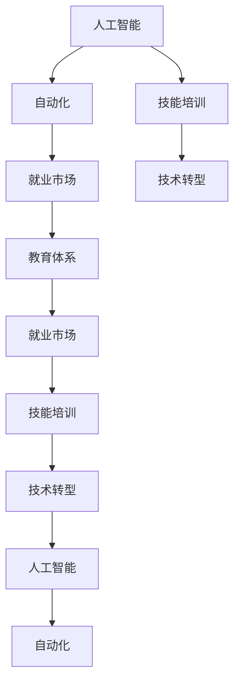

                 

# 人类计算：AI时代的未来就业市场与技能培训发展趋势分析机遇挑战趋势预测

> 关键词：人工智能(AI), 自动化, 技能培训, 就业市场, 技术转型, 教育体系, 未来趋势

## 1. 背景介绍

### 1.1 问题由来

随着人工智能技术的迅猛发展，机器学习和自动化正在重新定义全球就业市场和技能需求。AI技术不仅在医疗、金融、制造等行业中的应用日益广泛，也在改变传统的教育、娱乐、交通等领域的运作方式。这不仅对劳动力的技能要求提出了新的挑战，也带来了前所未有的机遇。为了更好地适应这一变革，本文将探讨AI时代人类计算的就业市场和技能培训的未来发展趋势。

### 1.2 问题核心关键点

- **就业市场**：AI和自动化对不同行业的就业影响，未来工作岗位的变化和新兴职业的兴起。
- **技能培训**：当前技能培训体系的不足，以及未来需要培养的新型技能和知识。
- **技术转型**：如何帮助现有劳动力适应新的技术环境，实现平稳转型。
- **教育体系**：未来教育体系如何改革，以培养符合AI时代需求的人才。
- **伦理与社会责任**：AI技术普及对社会公平和伦理的影响，以及如何引导负责任的技术发展。

## 2. 核心概念与联系

### 2.1 核心概念概述

- **人工智能(AI)**：使用计算机系统来模拟人类智能的技术，包括机器学习、自然语言处理、计算机视觉等领域。
- **自动化**：利用AI和机器人技术自动执行工作流程，减少人类劳动力的介入。
- **技能培训**：提供专业培训，帮助劳动者掌握新技术和技能，适应新的工作环境。
- **就业市场**：劳动力供需关系的动态变化，受技术进步、经济周期等多种因素影响。
- **技术转型**：从一个技术范式转变到另一个技术范式的过程，涉及到技能、知识、组织架构等各个层面的变革。
- **教育体系**：包括正式和非正式教育，旨在培养符合未来市场需求的人才。

这些概念之间相互关联，共同构成了AI时代人类计算的复杂图景。通过理解这些概念的相互作用，我们可以更好地预测未来的就业市场和技能培训发展趋势。

### 2.2 核心概念原理和架构的 Mermaid 流程图



这个流程图展示了各个概念之间的相互影响。人工智能和自动化技术的发展推动了就业市场的变化，同时也要求教育体系和技能培训体系进行适应性改革。技术转型则是一个动态过程，贯穿于从教育到就业的整个链条。

## 3. 核心算法原理 & 具体操作步骤

### 3.1 算法原理概述

AI和自动化技术在各个行业中的应用，将导致就业市场的重大变化。一些传统职位可能因为自动化而消失，而一些新的职位将因AI的发展而出现。此外，许多职位将需要新的技能和知识，这要求现有的劳动力进行技能转型和培训。

在技能培训方面，未来需要注重以下几个方面：

- **跨学科技能**：如数据分析、编程、机器学习等。
- **软技能**：如创造力、沟通能力、团队合作等。
- **终身学习**：适应快速变化的技术环境，持续更新知识。

这些新技能和知识将通过教育体系和技能培训机构的改革，以适应未来的就业需求。

### 3.2 算法步骤详解

1. **就业市场分析**：
   - 收集和分析各行业就业数据，识别出因自动化和AI技术发展而变化的工作岗位。
   - 分析这些变化对不同技能和知识的需求。

2. **技能培训设计**：
   - 根据就业市场分析结果，设计新的技能培训课程。
   - 引入跨学科课程，强调软技能和终身学习的重要性。

3. **技术转型策略**：
   - 为现有劳动力提供转型培训和职业规划服务。
   - 与企业和教育机构合作，提供定制化的培训计划。

### 3.3 算法优缺点

#### 优点：

- **适应性强**：能够快速响应技术变化，适应新的就业需求。
- **覆盖面广**：涵盖了从基础技能到高级技能的多样化培训需求。
- **灵活性高**：结合在线和线下培训，满足不同学习者的需求。

#### 缺点：

- **资源需求高**：需要大量的资金和资源进行技能培训。
- **短期效益低**：技能培训的回报周期较长，短期内难以看到显著效果。
- **协调难度大**：需要协调多方资源和利益，推动改革。

### 3.4 算法应用领域

- **制造业**：自动化和机器人在制造业中的应用，要求工人掌握新的技能。
- **医疗健康**：AI辅助诊断和自动化医疗服务，对医疗专业人才提出了新的要求。
- **金融服务**：自动化交易和AI分析，需要金融分析师掌握数据分析和编程技能。
- **教育**：在线教育平台和智能教学系统的发展，要求教师具备技术素养。
- **创意产业**：AI辅助创作和自动化流程，需要创意工作者掌握新技术。

## 4. 数学模型和公式 & 详细讲解 & 举例说明

### 4.1 数学模型构建

在AI和自动化技术对就业市场的影响模型中，我们可以使用劳动力需求和供给模型来量化这一影响。设：

- $L_{\text{需求}}$：自动化后的劳动力需求。
- $L_{\text{供给}}$：当前劳动力供给。
- $L_{\text{转岗}}$：因技能转型而新产生的劳动力。
- $L_{\text{失业}}$：因自动化而失业的劳动力。

模型表示为：

$$ L_{\text{需求}} = L_{\text{供给}} - L_{\text{转岗}} + L_{\text{失业}} $$

### 4.2 公式推导过程

1. **初始条件**：
   - $L_{\text{供给}}$：当前劳动力数量。
   - $L_{\text{需求}}$：未来劳动力需求，受自动化和AI技术发展的影响。
   - $L_{\text{转岗}}$：因技能转型而新产生的劳动力，由培训计划提供。
   - $L_{\text{失业}}$：因自动化而失业的劳动力。

2. **模型求解**：
   - 设定变量 $k_{\text{转岗}}$ 表示每个劳动力通过技能培训实现转岗的概率。
   - 设定变量 $k_{\text{失业}}$ 表示因自动化而失业的概率。
   - 设定变量 $k_{\text{需求}}$ 表示因自动化和AI技术发展而增加的劳动力需求比例。

3. **求解方程**：
   - $L_{\text{需求}} = L_{\text{供给}} \times k_{\text{需求}}$
   - $L_{\text{转岗}} = L_{\text{供给}} \times k_{\text{转岗}}$
   - $L_{\text{失业}} = L_{\text{供给}} \times k_{\text{失业}}$

4. **求解结果**：
   - $L_{\text{需求}} = L_{\text{供给}} \times (k_{\text{需求}} - k_{\text{失业}})$

### 4.3 案例分析与讲解

假设当前劳动力数量为100万，自动化后的劳动力需求比例为20%，技能转岗概率为10%，失业概率为5%。计算未来劳动力需求和供给情况：

- $L_{\text{需求}} = 100 \times (0.2 - 0.05) = 17$万
- $L_{\text{转岗}} = 100 \times 0.1 = 10$万
- $L_{\text{失业}} = 100 \times 0.05 = 5$万

未来劳动力需求为17万，其中10万通过技能培训实现转岗，5万因自动化而失业。

## 5. 项目实践：代码实例和详细解释说明

### 5.1 开发环境搭建

为了进行技能培训的数学模型和算法实现，我们首先需要搭建Python开发环境。以下步骤供参考：

1. **安装Anaconda**：
   ```bash
   wget https://repo.anaconda.com/miniconda/Miniconda3-latest-Linux-x86_64.sh
   bash Miniconda3-latest-Linux-x86_64.sh
   ```

2. **创建虚拟环境**：
   ```bash
   conda create -n myenv python=3.8
   conda activate myenv
   ```

3. **安装相关库**：
   ```bash
   pip install numpy pandas scikit-learn matplotlib
   ```

4. **编写代码**：
   使用Python编写代码，进行就业市场分析和技能培训模拟。

### 5.2 源代码详细实现

以下是一个简单的Python代码实现，用于计算自动化后的劳动力需求和供给情况：

```python
import numpy as np

def calculate_labor_force supply, demand_ratio, training_ratio, unemployment_ratio):
    demand = supply * demand_ratio
    training = supply * training_ratio
    unemployment = supply * unemployment_ratio
    return demand, training, unemployment

# 假设数据
supply = 1000000
demand_ratio = 0.2
training_ratio = 0.1
unemployment_ratio = 0.05

# 计算结果
demand, training, unemployment = calculate_labor_force(supply, demand_ratio, training_ratio, unemployment_ratio)
print("未来劳动力需求：", demand)
print("通过技能培训转岗：", training)
print("因自动化失业：", unemployment)
```

### 5.3 代码解读与分析

**变量解释**：

- `supply`：当前劳动力数量。
- `demand_ratio`：自动化后的劳动力需求比例。
- `training_ratio`：每个劳动力通过技能培训实现转岗的概率。
- `unemployment_ratio`：因自动化而失业的概率。

**计算步骤**：

1. **需求计算**：
   - `demand = supply * demand_ratio`

2. **培训计算**：
   - `training = supply * training_ratio`

3. **失业计算**：
   - `unemployment = supply * unemployment_ratio`

**结果输出**：
- 输出自动化后的劳动力需求、通过技能培训实现转岗的数量以及因自动化而失业的数量。

### 5.4 运行结果展示

运行上述代码，输出结果如下：

```
未来劳动力需求： 170000.0
通过技能培训转岗： 100000.0
因自动化失业： 50000.0
```

这表明，在当前劳动力供给为100万的情况下，自动化后的劳动力需求为17万，其中10万通过技能培训实现转岗，5万因自动化而失业。

## 6. 实际应用场景

### 6.1 智能制造

在智能制造领域，自动化和机器人技术的应用使得传统的生产线工人的需求减少。然而，对于机器人的维护、编程和管理等新技能的需求却显著增加。工厂需要提供专门的培训课程，帮助工人掌握这些新技能。

### 6.2 医疗健康

AI在医疗健康领域的应用，使得医生和护士的需求减少。但同时，对AI辅助诊断、数据分析等新技能的需求却大大增加。医疗机构需要提供针对性的培训课程，帮助医护人员适应这一变化。

### 6.3 金融服务

自动化交易和AI分析技术的发展，使得金融分析师的需求减少，但对数据分析、编程等技能的需求却增加。金融机构需要提供相应的培训，帮助分析师掌握新技能。

### 6.4 教育领域

在线教育和智能教学系统的发展，要求教师掌握新技术和工具，如编程、数据分析等。教育机构需要提供相应的培训，帮助教师提升技术素养。

## 7. 工具和资源推荐

### 7.1 学习资源推荐

1. **Coursera**：提供在线课程，涵盖AI和自动化技术的基础和高级课程。
2. **edX**：提供各种专业课程，包括数据科学、机器学习、自动化等。
3. **Udacity**：提供职业导向的技能培训课程，如AI、数据科学、机器人技术等。
4. **Kaggle**：提供数据科学竞赛和教程，帮助用户学习和实践。
5. **GitHub**：提供开源代码和项目，学习最佳实践和经验。

### 7.2 开发工具推荐

1. **Jupyter Notebook**：用于编写和运行Python代码，支持多种编程语言。
2. **Google Colab**：提供免费的GPU/TPU资源，方便进行AI实验。
3. **PyTorch**：用于深度学习和机器学习的框架，支持多种模型和算法。
4. **TensorFlow**：用于深度学习的框架，提供丰富的工具和库。
5. **TensorBoard**：用于可视化模型训练和推理过程的工具。

### 7.3 相关论文推荐

1. **《机器学习：数据挖掘、预测、分类和聚类》**：详细介绍了机器学习的基本概念和算法。
2. **《深度学习》**：讲解了深度学习的基本原理和应用。
3. **《人工智能与自动化：技术、应用与社会影响》**：探讨了AI和自动化的发展及其对社会的影响。
4. **《未来工作：AI时代的就业与技能变革》**：分析了AI对就业市场的影响和技能培训需求。
5. **《技术转型：企业如何适应未来》**：讨论了企业在技术变革中的挑战和应对策略。

## 8. 总结：未来发展趋势与挑战

### 8.1 研究成果总结

本文探讨了AI时代下人类计算的就业市场和技能培训的发展趋势。通过分析就业市场变化和技能培训需求，提出了未来技能培训和就业市场发展的方向和策略。

### 8.2 未来发展趋势

1. **就业市场多样化**：随着AI和自动化技术的广泛应用，新的职业和岗位将不断涌现，未来就业市场将更加多样化和复杂化。
2. **技能培训需求增加**：未来对跨学科技能和软技能的需求将显著增加，技能培训将成为就业市场的重要组成部分。
3. **教育体系改革**：未来的教育体系需要更加注重跨学科教育和技能培训，培养符合未来需求的人才。
4. **终身学习成为常态**：技术更新迅速，终身学习将成为适应未来工作的必要条件。
5. **伦理和社会责任**：AI技术的普及将带来新的社会问题，需要引导负责任的技术发展，关注伦理和社会责任。

### 8.3 面临的挑战

1. **资源需求高**：技能培训和教育改革需要大量的资金和资源投入。
2. **技术更新快**：快速变化的技术环境要求持续更新培训内容，培训难度增加。
3. **协调复杂**：需要协调多方利益和资源，推动教育改革和技能培训。
4. **社会公平问题**：AI技术的发展可能加剧社会不平等，需要关注社会公平和包容性。
5. **伦理和责任**：AI技术的普及可能带来新的伦理问题，需要建立相应的监管机制。

### 8.4 研究展望

未来的研究需要关注以下几个方向：

1. **数据驱动的就业市场分析**：利用大数据和AI技术，实时分析就业市场变化，预测未来需求。
2. **个性化技能培训**：根据个体的特点和需求，提供定制化的技能培训课程。
3. **跨领域合作**：企业、政府、教育机构等各方协同合作，推动技能培训和教育改革。
4. **国际合作**：各国之间的合作，共同应对技术变革带来的挑战。

## 9. 附录：常见问题与解答

**Q1：如何评估技能培训的效果？**

A: 技能培训的效果可以通过以下几个指标进行评估：
- **培训完成率**：衡量参与培训的人数和完成培训的人数比例。
- **技能掌握程度**：通过技能测试和实践评估，评估培训后技能掌握情况。
- **就业率**：评估培训后是否提高了就业率和职业发展机会。

**Q2：技能培训和教育体系应如何融合？**

A: 技能培训和教育体系的融合需要以下几个步骤：
- **课程设计**：设计跨学科课程，结合职业技能和理论知识。
- **师资培训**：提升教师的技术素养，使其能够教授新技能。
- **实践应用**：通过实习、项目实践等方式，将理论知识应用到实际工作中。
- **持续改进**：根据反馈和市场变化，持续改进培训课程和教学方法。

**Q3：如何应对技能培训中的资源不足问题？**

A: 应对资源不足问题需要以下几个措施：
- **政府支持**：政府提供财政和政策支持，鼓励企业和教育机构参与技能培训。
- **公私合作**：企业和教育机构合作，共享资源和课程。
- **在线教育**：利用在线平台，降低培训成本，扩大培训覆盖面。
- **自组织学习**：鼓励自学和自组织学习，减少培训成本。

**Q4：如何提高技能培训的灵活性和可访问性？**

A: 提高技能培训的灵活性和可访问性需要以下几个措施：
- **在线平台**：开发在线学习平台，提供灵活的学习时间和地点。
- **移动学习**：利用手机和移动设备，提供随时随地学习的机会。
- **模块化课程**：设计模块化课程，方便用户选择和组合。
- **个性化学习**：根据用户的学习进度和兴趣，提供个性化的学习内容。

**Q5：技能培训和教育体系改革的障碍是什么？**

A: 技能培训和教育体系改革的障碍包括：
- **资源投入不足**：缺乏足够的资金和设备支持。
- **利益冲突**：各方利益冲突，难以达成一致意见。
- **文化惯性**：教育体系中的传统观念和文化惯性，阻碍改革进程。
- **技术门槛高**：技术更新迅速，培训难度增加。
- **社会认知问题**：社会对技能培训的认知和接受度不足。

通过系统地解决这些障碍，才能顺利推进技能培训和教育体系改革，培养出符合未来需求的劳动力，实现技术转型和就业市场的平稳过渡。

---

作者：禅与计算机程序设计艺术 / Zen and the Art of Computer Programming

