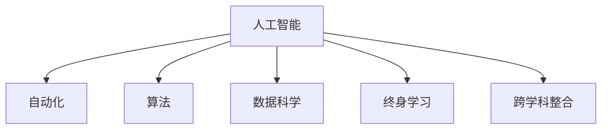

                 

# 人类计算：AI时代的未来就业趋势与技能发展分析

> 关键词：人工智能, 就业趋势, 技能发展, 自动化, 算法, 数据科学, 教育, 终身学习

## 1. 背景介绍

### 1.1 问题由来
随着人工智能技术的飞速发展，自动化和智能化进程正在加速推进，给各行各业带来深刻变革。未来，人们的工作方式、职业路径以及所需的技能将面临重大调整。人工智能（AI）技术不仅会在技术领域产生深远影响，也将对普通职业产生巨大冲击。

### 1.2 问题核心关键点
探讨人工智能对就业趋势的影响，分析AI时代人类需要具备的技能，研究如何通过教育和持续学习适应技术变革，是当前社会关注的重要课题。

### 1.3 问题研究意义
通过对AI时代就业趋势与技能发展的深入分析，可以为政策制定、企业规划和个人职业规划提供有力依据，帮助社会各界更好地适应技术变革，促进经济和社会的持续健康发展。

## 2. 核心概念与联系

### 2.1 核心概念概述

为更好地理解AI时代就业趋势与技能发展，本节将介绍几个密切相关的核心概念：

- **人工智能（AI）**：通过计算机程序模拟、延伸和扩展人的智能，能够进行感知、学习、推理、规划等认知过程的技术体系。
- **自动化**：指利用机器和计算机系统自动执行原本需要人工操作的任务，提升效率和准确性。
- **算法**：解决特定问题的方法和策略，是AI的核心组成部分，决定着AI系统的表现。
- **数据科学**：通过数据收集、分析和解释来揭示隐藏在数据中的知识和规律，是构建AI系统的基础。
- **终身学习**：强调在职业生涯中持续学习新技能和新知识，以适应技术快速发展的需求。
- **跨学科整合**：AI技术发展需要多学科的知识融合，包括计算机科学、数学、心理学、伦理学等。

这些概念之间的逻辑关系可以通过以下Mermaid流程图来展示：



这个流程图展示了人工智能的各个关键组成部分及其相互关系：

1. 人工智能通过自动化和算法实现任务执行。
2. 数据科学提供构建和训练AI系统的数据基础。
3. 终身学习强调个人在职业生涯中不断更新和掌握新技能。
4. 跨学科整合促进了AI技术的全面发展。

## 3. 核心算法原理 & 具体操作步骤
### 3.1 算法原理概述

AI时代，就业趋势和技能发展的主要驱动力是自动化和算法的应用。自动化通过机器和系统自动执行任务，提高效率和准确性；算法则通过设计和优化机器学习模型，赋予机器学习和解决问题的能力。AI时代的就业和技能发展受到这两个核心驱动力的共同影响。

### 3.2 算法步骤详解

AI时代的工作场景通常包括以下步骤：

1. **数据准备**：收集和清洗数据，为模型训练提供数据基础。
2. **模型训练**：使用算法训练模型，学习数据的特征和规律。
3. **模型部署**：将训练好的模型部署到实际应用中，进行任务执行。
4. **持续优化**：根据应用反馈，持续优化模型，提升性能。

### 3.3 算法优缺点

**优点**：

- **效率提升**：自动化和算法能够迅速处理大量数据，提高工作效率。
- **精准度提高**：通过数据科学和算法优化，模型的预测和决策能力更强。
- **新技能需求**：推动了数据科学、算法工程、机器学习等新技能的发展。

**缺点**：

- **就业结构变化**：自动化可能导致部分岗位消失，影响就业结构。
- **技能升级需求**：需要不断学习新技能，以适应AI技术的发展。
- **伦理与法律问题**：AI技术应用可能引发隐私、安全等问题，需要相关法规保障。

### 3.4 算法应用领域

AI技术的应用已经遍及各个领域，包括但不限于：

- **医疗健康**：通过算法分析医疗数据，提升疾病诊断和治疗效率。
- **金融服务**：使用自动化进行风险评估、投资决策等。
- **制造业**：实现智能制造、预测维护等，提高生产效率。
- **教育**：利用算法进行个性化教育、智能辅导等。
- **零售**：通过自动化和算法进行库存管理、营销策略等。
- **农业**：使用智能设备进行精准农业，提升农业生产效率。

## 4. 数学模型和公式 & 详细讲解  
### 4.1 数学模型构建

在AI时代，模型构建通常采用监督学习和无监督学习两种方法。监督学习需要标注数据，通过模型训练，预测新数据的标签；无监督学习则直接从数据中学习模式和规律，无需标注数据。

假设训练数据集为 $\{(x_i, y_i)\}_{i=1}^N$，其中 $x_i$ 为输入，$y_i$ 为标签。模型 $f$ 通过训练数据学习映射关系 $f: X \rightarrow Y$，预测新输入 $x$ 的标签 $y$。

### 4.2 公式推导过程

以线性回归模型为例，假设模型为 $f(x) = w \cdot x + b$，其中 $w$ 为权重向量，$b$ 为偏置项。

1. **模型训练**：通过最小化损失函数 $\mathcal{L}(f)$ 来训练模型，常见的损失函数包括均方误差（MSE）、交叉熵等。
2. **公式推导**：求解最小化损失函数的权重 $w$ 和偏置 $b$。

假设训练样本 $(x_i, y_i)$，均方误差损失函数为 $\mathcal{L}(f) = \frac{1}{2N}\sum_{i=1}^N (y_i - f(x_i))^2$。求偏导数并令其为0，解得 $w = \frac{1}{N}\sum_{i=1}^N (x_i y_i)$，$b = \frac{1}{N}\sum_{i=1}^N y_i - w \cdot \bar{x}$，其中 $\bar{x}$ 为样本均值。

### 4.3 案例分析与讲解

以手写数字识别为例，使用MNIST数据集进行模型训练。通过神经网络模型，将手写数字图像转换为数字标签。

```python
import numpy as np
from sklearn.linear_model import LinearRegression
from sklearn.metrics import mean_squared_error

# 加载数据集
from sklearn.datasets import load_digits
digits = load_digits()
X, y = digits.data, digits.target

# 训练模型
model = LinearRegression()
model.fit(X, y)

# 预测新数据
new_data = np.array([[1.0, 1.0, 1.0, 0.0, 0.0, 0.0, 0.0, 1.0, 0.0, 0.0]])
prediction = model.predict(new_data)
print(prediction)
```

在实际应用中，通过不断迭代和优化模型，可以提升模型的准确性和泛化能力。

## 5. 项目实践：代码实例和详细解释说明
### 5.1 开发环境搭建

在AI时代，开发环境的选择直接影响开发效率和项目质量。常用的开发环境包括：

1. **Python**：AI领域的主流编程语言，拥有丰富的第三方库和工具。
2. **Jupyter Notebook**：交互式编程环境，适合进行数据分析和模型验证。
3. **TensorFlow**：Google开发的深度学习框架，支持分布式计算。
4. **PyTorch**：Facebook开发的深度学习框架，易于使用和调试。
5. **Keras**：高层次的深度学习库，支持多种后端（如TensorFlow、Theano）。

### 5.2 源代码详细实现

以Keras为例，使用TensorFlow后端构建简单的神经网络模型：

```python
import tensorflow as tf
from tensorflow import keras

# 加载数据集
(x_train, y_train), (x_test, y_test) = keras.datasets.mnist.load_data()

# 预处理数据
x_train = x_train / 255.0
x_test = x_test / 255.0

# 定义模型
model = keras.models.Sequential([
    keras.layers.Flatten(input_shape=(28, 28)),
    keras.layers.Dense(128, activation='relu'),
    keras.layers.Dense(10, activation='softmax')
])

# 编译模型
model.compile(optimizer='adam',
              loss='sparse_categorical_crossentropy',
              metrics=['accuracy'])

# 训练模型
model.fit(x_train, y_train, epochs=10, batch_size=32)

# 评估模型
model.evaluate(x_test, y_test)
```

### 5.3 代码解读与分析

上述代码展示了使用Keras构建简单的神经网络模型，对MNIST手写数字数据集进行训练和评估。代码解释如下：

1. **数据加载和预处理**：使用Keras内置函数加载MNIST数据集，并进行归一化处理。
2. **模型定义**：通过Sequential模型定义一个包含两个全连接层的神经网络，使用ReLU激活函数和softmax输出层。
3. **模型编译**：设置优化器、损失函数和评估指标。
4. **模型训练**：使用fit函数进行模型训练，设置训练轮数和批次大小。
5. **模型评估**：使用evaluate函数评估模型在测试集上的性能。

## 6. 实际应用场景
### 6.1 医疗健康

AI在医疗健康领域的应用包括疾病预测、药物研发、医疗影像分析等。通过算法和大数据分析，能够提升医疗服务的精准度和效率，改善患者的治疗效果。

### 6.2 金融服务

金融行业利用AI进行风险评估、投资决策、客户服务自动化等。通过自动化和算法，提升金融服务的效率和质量，降低风险。

### 6.3 制造业

智能制造、预测维护、质量控制等是AI在制造业中的应用。通过自动化和算法，提升生产效率，减少成本。

### 6.4 教育

AI在教育领域的应用包括个性化教育、智能辅导、学习分析等。通过算法和大数据分析，提升教育质量，促进教育公平。

### 6.5 零售

智能推荐、库存管理、营销策略等是AI在零售领域的应用。通过自动化和算法，提升零售服务的精准度和效率，提升客户满意度。

### 6.6 农业

智能设备、精准农业等是AI在农业领域的应用。通过算法和大数据分析，提升农业生产效率，减少资源浪费。

## 7. 工具和资源推荐
### 7.1 学习资源推荐

为帮助开发者系统掌握AI技术，以下是一些优质的学习资源：

1. **《深度学习》课程**：斯坦福大学吴恩达教授开设的深度学习课程，讲解深度学习的基本概念和算法。
2. **《Python机器学习》书籍**：Sebastian Raschka著，全面介绍了Python在机器学习中的应用。
3. **《动手学深度学习》**：李沐等人著，结合实践项目，讲解深度学习的原理和应用。
4. **TensorFlow官方文档**：Google提供的TensorFlow文档，包括教程、API文档和案例。
5. **Kaggle竞赛平台**：数据科学和机器学习竞赛平台，提供大量数据集和算法挑战。

### 7.2 开发工具推荐

AI开发需要多种工具的支持，以下是几款常用的开发工具：

1. **Jupyter Notebook**：交互式编程环境，适合进行数据分析和模型验证。
2. **TensorFlow**：Google开发的深度学习框架，支持分布式计算。
3. **PyTorch**：Facebook开发的深度学习框架，易于使用和调试。
4. **Keras**：高层次的深度学习库，支持多种后端（如TensorFlow、Theano）。
5. **Scikit-learn**：Python的机器学习库，提供常用的算法和工具。

### 7.3 相关论文推荐

AI技术的发展源于学界的持续研究。以下是几篇奠基性的相关论文，推荐阅读：

1. **AlexNet**：Hinton等人提出的卷积神经网络，开启了深度学习的新时代。
2. **ResNet**：He等人提出的残差网络，解决了深度神经网络训练的退化问题。
3. **AlphaGo**：DeepMind开发的AI程序，首次在围棋领域击败人类世界冠军。
4. **GAN**：Goodfellow等人提出的生成对抗网络，在图像生成和增强等领域表现出色。
5. **BERT**：Google开发的预训练语言模型，提升了自然语言处理任务的性能。

## 8. 总结：未来发展趋势与挑战
### 8.1 总结

本文对AI时代就业趋势与技能发展的核心概念进行了全面系统的介绍。首先阐述了AI技术的驱动作用及其对就业和技能发展的影响，明确了AI时代技能升级和终身学习的必要性。其次，从原理到实践，详细讲解了AI技术的应用场景和数学模型，给出了具体的代码实现。

通过本文的系统梳理，可以看到，AI技术正在深刻影响各行各业，带来就业结构和技能要求的重大变化。伴随AI技术的不断演进，未来的就业和技能发展将面临新的挑战和机遇。

### 8.2 未来发展趋势

展望未来，AI技术的发展趋势包括：

1. **智能化水平提升**：AI技术将不断提升自动化和智能化水平，提高效率和精度。
2. **跨领域融合**：AI技术与各行业深度融合，创造新的应用场景和商业模式。
3. **伦理与法律规范**：AI技术的应用将引发伦理与法律问题，需要相关法规和规范。
4. **终身学习普及**：终身学习将成为职场必备技能，推动个人持续发展。

### 8.3 面临的挑战

尽管AI技术带来了诸多便利，但在实际应用中仍面临一些挑战：

1. **就业结构变化**：自动化可能导致部分岗位消失，需要社会各界共同应对。
2. **技能升级需求**：需要不断学习新技能，以适应技术快速发展的需求。
3. **伦理与法律问题**：AI技术应用可能引发隐私、安全等问题，需要相关法规保障。
4. **技术普及难题**：AI技术复杂度高，需要更多教育和培训资源支持。

### 8.4 研究展望

面向未来，AI技术的研究方向包括：

1. **智能算法优化**：研究更高效、更普适的算法，提升AI系统的性能。
2. **跨学科整合**：推动AI技术与其他学科的深度融合，推动创新应用。
3. **伦理与法律规范**：建立AI技术的伦理与法律规范，保障应用安全。
4. **教育与培训**：加强AI技术教育与培训，提升全社会的智能化水平。

## 9. 附录：常见问题与解答

**Q1：AI技术是否会完全取代人类工作？**

A: AI技术将自动化处理大量重复性、低技能的工作，提高效率。但AI无法完全取代人类工作，特别是在创造性、复杂性、情感沟通等方面，仍需人类的参与。

**Q2：AI技术如何改变就业结构？**

A: AI技术将自动化处理大量重复性、低技能的工作，导致部分岗位消失。同时，AI技术也将创造新的岗位，如数据科学家、算法工程师等，需要社会各界共同应对。

**Q3：AI技术对教育有何影响？**

A: AI技术将改变教育方式，推动个性化教育和智能辅导。AI技术能够根据学生的学习情况进行个性化推荐，提升教育效果。

**Q4：AI技术如何提升医疗健康？**

A: AI技术能够通过算法和大数据分析，提升疾病预测和诊断的准确性，改善患者的治疗效果。

**Q5：AI技术如何影响金融服务？**

A: AI技术能够通过自动化处理数据，提升金融服务的效率和质量。AI技术能够进行风险评估、投资决策等，提升金融服务的安全性和稳定性。

本文深入探讨了AI时代的就业趋势与技能发展，分析了AI技术在各领域的应用前景和未来挑战。通过系统的梳理和案例分析，帮助读者更好地理解AI技术的影响，并为未来的学习和工作提供参考。

