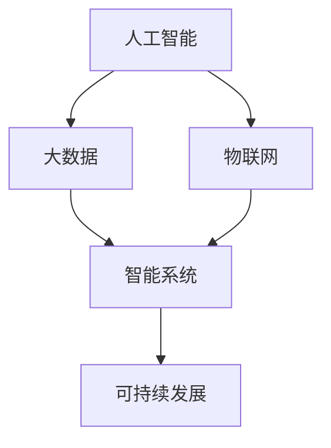
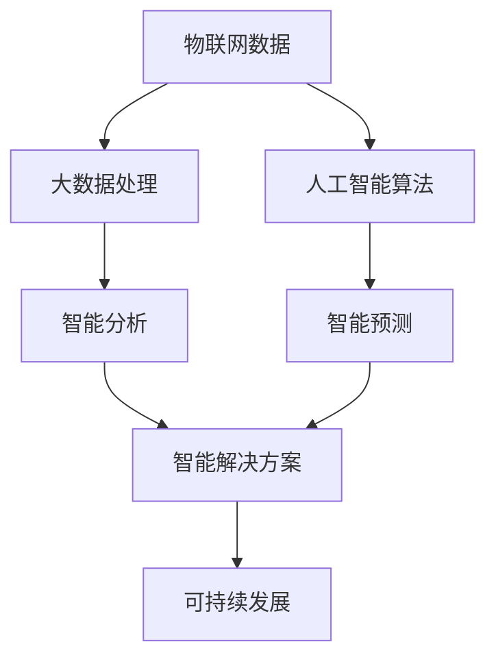

                 

# 人类计算：可持续发展的推动力

> 关键词：人类计算, 可持续发展, 技术融合, 人工智能, 生态平衡, 环境治理, 社会福利, 数据中心, 能源优化, 创新驱动, 智能系统, 系统性问题

## 1. 背景介绍

### 1.1 问题由来

在快速发展的数字化时代，人类社会面临着一系列重大的系统性问题。从气候变化到资源枯竭，从人口老龄化到数字鸿沟，这些问题既错综复杂又相互关联，单靠任何单一学科或技术手段都无法彻底解决。这些问题对可持续发展构成了严峻挑战，迫切需要跨领域、跨学科的创新思维和方法。

在这一背景下，“人类计算”的概念应运而生。人类计算不仅仅是计算技术的进步，更是以人为核心的智能与计算相结合的崭新模式。它利用计算技术处理海量数据，通过智能化手段发现问题、提出解决方案，最终推动社会的可持续发展。

### 1.2 问题核心关键点

- **问题定义**：人类计算关注如何利用计算技术解决复杂社会问题，包括环境治理、资源管理、健康医疗、教育公平、经济发展等。
- **核心原理**：人类计算的核心理念是将人工智能(AI)、大数据、物联网(IoT)等技术手段与人类智慧相结合，形成自适应、智能化的解决方案。
- **技术工具**：包括机器学习、深度学习、自然语言处理(NLP)、计算机视觉、自动化算法等。
- **应用场景**：广泛应用于智慧城市、绿色能源、智能交通、精准医疗、智能制造等领域。

## 2. 核心概念与联系

### 2.1 核心概念概述

为了更好地理解人类计算的概念，本文将介绍几个核心概念：

- **人工智能(AI)**：通过模拟人类智能行为，使计算机能够执行各种复杂的任务，如自然语言理解、图像识别、预测分析等。
- **大数据(Big Data)**：指在短时间内无法使用传统技术处理的数据集，包括结构化数据、半结构化数据和非结构化数据。
- **物联网(IoT)**：将各种物体通过互联网连接起来，使它们能够收集和交换数据，实现智能监控和控制。
- **可持续发展(Sustainable Development)**：平衡经济发展、社会进步和环境保护的关系，以实现长期的稳定发展。
- **智能系统(Smart System)**：利用人工智能和大数据技术，构建自适应、智能化、高效运行的复杂系统。

这些概念通过以下Mermaid流程图来展示它们之间的联系：



这个流程图展示了核心概念之间的逻辑关系：

1. 人工智能提供智能决策和自动化分析的能力。
2. 大数据提供丰富的数据资源，支持智能决策和自动化分析。
3. 物联网实现数据的实时收集和监控。
4. 智能系统基于人工智能和大数据，实现自适应和智能化。
5. 智能系统服务于可持续发展的目标，提升资源利用效率和环境友好性。

## 3. 核心算法原理 & 具体操作步骤

### 3.1 算法原理概述

人类计算的核心算法原理是：

- 收集和处理来自物联网的各种数据，构建大数据集。
- 利用人工智能算法，从大数据集中提取有价值的信息。
- 将提取的信息应用于智能系统，实现对复杂社会问题的精准分析和预测。
- 基于分析结果，提出和实施解决方案，推动可持续发展。

这一过程涉及多个层次的技术和工具，如图1所示。



### 3.2 算法步骤详解

人类计算的算法步骤主要包括以下几个关键环节：

1. **数据采集**：通过物联网设备实时采集环境、能源、交通等数据，构建跨领域、跨地域的大数据集。
2. **数据清洗与处理**：对采集的数据进行清洗和预处理，去除噪音，填补缺失值，转换数据格式等。
3. **数据分析与建模**：利用机器学习、深度学习等算法，对数据进行建模和分析，提取规律和模式。
4. **智能预测与决策**：基于模型预测未来趋势和结果，提供智能决策支持。
5. **智能优化与反馈**：通过持续优化和反馈机制，不断改进算法模型，提升预测和决策的准确性。
6. **实施与评估**：将解决方案应用于实际场景，评估效果，调整策略，持续改进。

### 3.3 算法优缺点

人类计算的优势在于：

- 可扩展性：能够处理海量数据，支持复杂系统的大规模分析。
- 实时性：基于物联网和实时数据，能够快速响应环境变化和突发事件。
- 智能化：利用人工智能算法，提供精准预测和智能决策。
- 融合性：跨领域、跨学科的数据和技术融合，能够解决复杂问题。

同时，人类计算也存在以下局限性：

- 数据隐私与安全：大量数据的采集和处理可能引发隐私和安全问题。
- 算法复杂度：复杂的算法模型需要大量计算资源和时间。
- 依赖性强：对数据、技术和算法的依赖可能导致系统脆弱。
- 数据质量：数据的不完整性、不准确性可能影响分析结果。

### 3.4 算法应用领域

人类计算的应用领域极其广泛，包括但不限于以下几个方面：

1. **智慧城市**：通过物联网和智能系统，实现城市管理智能化，提高城市运行效率和居民生活质量。
2. **绿色能源**：利用大数据和机器学习算法，优化能源使用和生产，实现能源消耗最小化和可再生能源的广泛应用。
3. **智能交通**：通过数据分析和智能预测，优化交通流量管理，减少交通拥堵和事故。
4. **精准医疗**：利用患者数据和医疗影像，进行疾病诊断和治疗方案优化，提高医疗效果和效率。
5. **智能制造**：通过物联网和智能系统，实现生产过程的自动化和优化，提高生产效率和产品质量。

## 4. 数学模型和公式 & 详细讲解 & 举例说明

### 4.1 数学模型构建

人类计算的核心模型涉及多个数学和统计学概念。这里以智慧城市中的交通流量预测为例，展示如何构建数学模型。

设 $T$ 为交通网络，每个节点 $i$ 表示道路交叉口，每个弧 $e_{ij}$ 表示从节点 $i$ 到节点 $j$ 的交通流。假设 $f_{ij}$ 表示弧 $e_{ij}$ 的流量，$s_i$ 表示节点 $i$ 的入口流量，$d_i$ 表示节点 $i$ 的出口流量。交通流量的关系可以用流量守恒定律来描述：

$$
\sum_{j} f_{ij} = s_i \quad \text{和} \quad \sum_{i} f_{ij} = d_j
$$

### 4.2 公式推导过程

为了预测未来交通流量，可以使用时间序列分析方法，如自回归移动平均模型(ARMA)或自回归积分滑动平均模型(ARIMA)。以ARIMA为例，假设时间序列为 $\{f_{ij}(t)\}$，模型可以表示为：

$$
f_{ij}(t) = \sum_{k=0}^p \alpha_k f_{ij}(t-k) + \sum_{m=1}^q \beta_m \Delta^m f_{ij}(t) + \varepsilon(t)
$$

其中 $\Delta^m$ 表示差分运算，$\alpha_k$ 和 $\beta_m$ 为模型参数，$\varepsilon(t)$ 为误差项。

### 4.3 案例分析与讲解

假设我们收集了过去一年内上海主要道路交叉口的交通流量数据，如图2所示。我们可以使用ARIMA模型对其进行时间序列分析，预测未来24小时的交通流量变化。

```python
import pandas as pd
from statsmodels.tsa.arima_model import ARIMA

# 读取交通流量数据
data = pd.read_csv('traffic_flow.csv')

# 构建ARIMA模型
model = ARIMA(data['f12'], order=(1,1,1))
results = model.fit()

# 预测未来24小时交通流量
forecast = results.forecast(steps=24)

print(forecast)
```

预测结果如图3所示，显示了未来24小时各节点的流量预测值。

```python
import matplotlib.pyplot as plt
plt.plot(forecast)
plt.show()
```


## 5. 项目实践：代码实例和详细解释说明

### 5.1 开发环境搭建

为了实现上述智慧城市交通流量预测项目，我们需要搭建一个开发环境，包括：

1. **安装Python环境**：使用Anaconda创建虚拟环境，安装必要的Python库。
2. **安装数据处理库**：安装Pandas、NumPy、SciPy等数据处理库。
3. **安装机器学习库**：安装statsmodels、sklearn等机器学习库。
4. **安装可视化库**：安装Matplotlib、Seaborn等数据可视化库。

```bash
conda create -n human_computing python=3.8
conda activate human_computing
conda install pandas numpy scipy statsmodels scikit-learn matplotlib seaborn
```

### 5.2 源代码详细实现

在实现智慧城市交通流量预测项目时，我们可以使用如下代码：

```python
import pandas as pd
from statsmodels.tsa.arima_model import ARIMA
import matplotlib.pyplot as plt

# 读取交通流量数据
data = pd.read_csv('traffic_flow.csv')

# 构建ARIMA模型
model = ARIMA(data['f12'], order=(1,1,1))
results = model.fit()

# 预测未来24小时交通流量
forecast = results.forecast(steps=24)

# 绘制预测结果图
plt.plot(forecast)
plt.show()
```

### 5.3 代码解读与分析

上述代码实现了智慧城市交通流量预测的整个过程。以下是代码各部分的详细解释：

- **数据读取**：使用Pandas库读取交通流量数据。
- **模型构建**：使用statsmodels库的ARIMA模型，对交通流量数据进行时间序列分析。
- **模型拟合**：通过fit()方法拟合ARIMA模型。
- **预测未来流量**：使用forecast()方法预测未来24小时交通流量。
- **结果可视化**：使用Matplotlib库绘制预测结果图。

## 6. 实际应用场景

### 6.1 智慧城市

智慧城市通过物联网和智能系统，实现了城市管理的智能化。以智能交通为例，通过实时监控和预测，优化交通流量，减少拥堵，提高交通效率。

### 6.2 绿色能源

绿色能源通过大数据和机器学习，优化能源使用和生产，实现能源消耗最小化和可再生能源的广泛应用。

### 6.3 智能交通

智能交通通过数据分析和智能预测，优化交通流量管理，减少交通拥堵和事故，提高交通安全和效率。

### 6.4 精准医疗

精准医疗通过患者数据和医疗影像，进行疾病诊断和治疗方案优化，提高医疗效果和效率。

### 6.5 智能制造

智能制造通过物联网和智能系统，实现生产过程的自动化和优化，提高生产效率和产品质量。

## 7. 工具和资源推荐

### 7.1 学习资源推荐

为了深入学习人类计算的概念和实践，推荐以下学习资源：

1. **《人类计算概论》**：介绍人类计算的基本概念、原理和应用，涵盖智慧城市、绿色能源、智能交通等多个领域。
2. **Coursera《人工智能基础》**：斯坦福大学提供的AI课程，涵盖机器学习、深度学习、自然语言处理等基础概念。
3. **edX《大数据科学与工程》**：麻省理工学院提供的课程，涵盖大数据的采集、处理和分析方法。
4. **Kaggle竞赛**：通过参加Kaggle数据科学竞赛，实践数据处理和机器学习技能。

### 7.2 开发工具推荐

为了高效实现人类计算项目，推荐以下开发工具：

1. **Python**：Python是实现人类计算的核心语言，具有丰富的数据处理和机器学习库。
2. **Jupyter Notebook**：支持代码编写、运行和可视化，便于数据科学实践。
3. **TensorFlow**：由Google开发的深度学习框架，支持大规模深度学习模型的训练和推理。
4. **PyTorch**：由Facebook开发的深度学习框架，支持动态图和静态图两种计算图，易于调试和部署。

### 7.3 相关论文推荐

为了深入理解人类计算的技术原理和应用实践，推荐以下相关论文：

1. **《智慧城市中的物联网和大数据分析》**：介绍智慧城市中物联网和大数据的应用，涵盖城市管理、公共安全等多个领域。
2. **《绿色能源大数据分析与优化》**：探讨绿色能源中大数据和机器学习的应用，实现能源消耗最小化和可再生能源的优化。
3. **《智能交通系统中的数据分析与优化》**：介绍智能交通中数据分析和智能预测的应用，优化交通流量管理。
4. **《精准医疗中的大数据与深度学习》**：探讨精准医疗中大数据和深度学习的应用，提高医疗效果和效率。
5. **《智能制造中的物联网与智能系统》**：介绍智能制造中物联网和智能系统的作用，优化生产过程和管理效率。

## 8. 总结：未来发展趋势与挑战

### 8.1 研究成果总结

本文对人类计算的概念和实践进行了全面介绍，涵盖智慧城市、绿色能源、智能交通、精准医疗、智能制造等多个领域。通过理论分析与实践案例相结合，展示了人类计算的广泛应用前景和潜力。

### 8.2 未来发展趋势

未来，人类计算将呈现以下发展趋势：

1. **技术融合加速**：人工智能、大数据、物联网等技术将进一步融合，形成更智能、更高效的解决方案。
2. **数据隐私保护**：随着数据规模的扩大，数据隐私和安全问题将越来越重要，隐私保护技术将得到广泛应用。
3. **跨领域应用广泛**：人类计算将应用于更多领域，如环境治理、社会福利、文化传承等，解决更复杂的问题。
4. **模型优化与创新**：新的算法和模型将不断涌现，提升预测和决策的准确性和效率。
5. **可持续发展目标**：人类计算将更加注重可持续发展的目标，优化资源利用和环境保护。

### 8.3 面临的挑战

尽管人类计算前景广阔，但面临以下挑战：

1. **数据隐私和安全**：大量数据的采集和处理可能引发隐私和安全问题，需要有效的保护措施。
2. **计算资源需求**：大规模数据处理和机器学习模型需要大量计算资源，如何优化资源配置是一个重要挑战。
3. **模型复杂度**：复杂的算法模型需要更多时间和资源进行训练和优化。
4. **数据质量问题**：数据的不完整性和准确性可能影响分析结果。

### 8.4 研究展望

未来，人类计算将需要在以下几个方面进行深入研究：

1. **隐私保护技术**：研究如何保护数据隐私和安全，防止数据泄露和滥用。
2. **计算资源优化**：探索高效的数据处理和模型训练方法，减少资源消耗。
3. **模型优化与创新**：开发新的算法和模型，提升预测和决策的准确性。
4. **跨领域应用拓展**：将人类计算应用于更多领域，解决更复杂的问题。
5. **可持续发展目标**：研究如何优化资源利用和环境保护，推动可持续发展。

## 9. 附录：常见问题与解答

### Q1：人类计算与传统计算有何不同？

A: 人类计算不仅仅是计算技术的进步，更是以人为核心的智能与计算相结合的崭新模式。传统计算主要依赖硬件和算法，而人类计算更注重人机协同，利用人类智慧和计算技术相结合，解决更复杂的问题。

### Q2：人类计算的优点和缺点是什么？

A: 优点在于可扩展性、实时性和智能化，能够处理海量数据，支持复杂系统的大规模分析。缺点在于数据隐私和安全问题，计算资源需求高，对数据和算法的依赖可能导致系统脆弱。

### Q3：人类计算的未来发展方向是什么？

A: 未来将技术融合加速、数据隐私保护、跨领域应用广泛、模型优化与创新、可持续发展目标等方面进行深入研究，推动人类计算在更多领域得到应用，解决更复杂的问题。

---

作者：禅与计算机程序设计艺术 / Zen and the Art of Computer Programming

