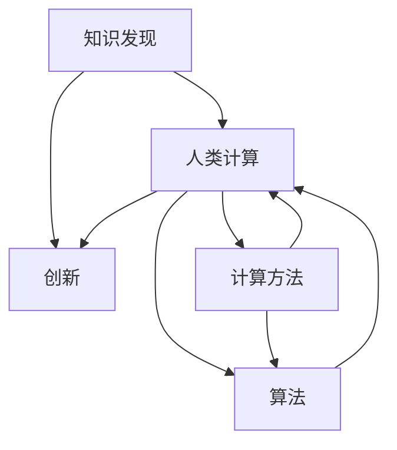

                 

# 人类计算：推动知识发现和创新

> 关键词：人类计算,知识发现,创新,人工智能,机器学习,计算方法,算法,应用场景

## 1. 背景介绍

### 1.1 问题由来

在当今信息爆炸的时代，人类知识呈现出爆炸式的增长，知识的存储和检索成为了一个巨大的挑战。传统的数据存储和检索方法已经难以满足需求，亟需新的技术手段来解决这一问题。随着人工智能（AI）技术的发展，人类计算（Human Computing）成为了推动知识发现和创新的重要方向。

人类计算是指利用人类的智能优势和计算能力，通过主动参与计算过程，来加速知识的发现和创新。这一概念最早由美国科学家维尼特·阿洛哈（Vinit Arora）在2009年提出，旨在探索如何借助人类的计算能力，加速科学研究和创新发展。

### 1.2 问题核心关键点

人类计算的核心在于通过人类的参与，将复杂的计算任务与智能算法相结合，以提高计算效率和精度。其关键点包括：

1. **知识结构化**：将人类知识结构化，转化为可以被机器理解和处理的结构化数据。
2. **人机协同计算**：通过人类和机器的协同工作，实现更高效的计算和分析。
3. **计算与创新的结合**：将计算结果应用于创新领域，推动新知识和新产品的产生。
4. **人机交互设计**：设计高效的人机交互界面，促进知识的传播和应用。

这些核心关键点构成了人类计算的基本框架，使得其在知识发现和创新领域具有重要的应用潜力。

## 2. 核心概念与联系

### 2.1 核心概念概述

为了更好地理解人类计算，我们首先需要介绍几个核心概念：

- **知识发现**：指通过分析数据和信息，揭示出潜在的知识模式和规律。
- **创新**：指将知识应用于新的情境，创造出具有实际价值的新产品或服务。
- **人类计算**：指利用人类的智能优势，通过主动参与计算过程，加速知识发现和创新的过程。
- **计算方法**：包括机器学习、深度学习、自然语言处理等，用于自动化处理和分析数据。
- **算法**：指用于解决问题的一组规则或步骤，用于指导计算过程。
- **应用场景**：包括科学研究、医疗健康、金融、教育等领域，需要知识发现和创新的支持。

这些概念之间的关系可以通过以下Mermaid流程图来展示：



这个流程图展示了几组核心概念之间的逻辑关系：

1. 知识发现是创新的基础，通过计算方法和算法进行处理和分析。
2. 人类计算利用人类的智能优势，加速知识发现和创新的过程。
3. 计算方法和算法在人类计算中起到关键作用。
4. 应用场景是知识发现和创新的具体应用，推动各行各业的进步。

## 3. 核心算法原理 & 具体操作步骤

### 3.1 算法原理概述

人类计算的算法原理主要基于机器学习和深度学习等计算方法，结合人类的智能优势，实现知识的自动发现和创新。具体而言，人类计算分为以下几个步骤：

1. **数据收集**：收集相关的数据和信息，包括文本、图像、音频等。
2. **数据预处理**：对收集到的数据进行清洗、标注和结构化处理，使其能够被机器理解。
3. **特征提取**：利用机器学习算法提取数据的特征，用于后续的计算和分析。
4. **人机协同计算**：在计算过程中，利用人类的智能优势，进行辅助决策和解释。
5. **结果验证和应用**：将计算结果进行验证，应用于实际问题解决和创新。

### 3.2 算法步骤详解

人类计算的具体操作步骤可以分为以下几个阶段：

**Step 1: 数据收集**

- 确定数据来源，包括公共数据集、公司内部数据、科研论文等。
- 通过爬虫、API、手动录入等方式收集数据。
- 对数据进行初步清洗，去除噪音和重复数据。

**Step 2: 数据预处理**

- 对数据进行结构化处理，如分词、标注、格式转换等。
- 进行数据标注，确保数据的准确性和完整性。
- 进行数据增强，如数据扩充、生成对抗样本等，提升数据质量和多样性。

**Step 3: 特征提取**

- 利用机器学习算法提取数据的特征，如TF-IDF、词嵌入、图像特征等。
- 利用深度学习算法提取高级特征，如卷积神经网络（CNN）、循环神经网络（RNN）、Transformer等。
- 结合人类的知识优势，进行特征融合和解释。

**Step 4: 人机协同计算**

- 设计高效的人机交互界面，便于人类参与计算过程。
- 利用人类的直觉和经验，进行辅助决策和解释。
- 通过迭代优化，提升计算效率和精度。

**Step 5: 结果验证和应用**

- 对计算结果进行验证，确保结果的准确性和可靠性。
- 将结果应用于实际问题解决和创新。
- 持续收集反馈，进行模型优化和迭代改进。

### 3.3 算法优缺点

人类计算具有以下优点：

1. **人机协同**：结合人类的智能优势，提高计算效率和精度。
2. **灵活性**：能够根据具体任务和数据特点，灵活调整计算方法和算法。
3. **可解释性**：结合人类的知识和经验，提高计算结果的可解释性和可理解性。

同时，人类计算也存在以下缺点：

1. **成本高**：需要投入大量人力和时间，成本较高。
2. **依赖人类知识**：对于需要复杂计算和分析的任务，可能依赖人类专业知识。
3. **计算复杂度高**：对于大规模数据和复杂计算任务，可能存在计算瓶颈。

尽管存在这些局限性，但人类计算在知识发现和创新领域仍然具有重要的应用潜力，尤其是在数据量较小、计算复杂度较高的场景下，能够显著提高计算效率和精度。

### 3.4 算法应用领域

人类计算在多个领域都有广泛的应用，具体包括：

- **科学研究**：利用人类计算加速科学实验和数据分析，推动科研成果的发现。
- **医疗健康**：结合人类医学知识和计算方法，加速疾病诊断和治疗方案的研发。
- **金融**：利用人类计算进行风险评估和投资分析，提高决策的准确性和效率。
- **教育**：结合人类教学经验和计算方法，提升教学效果和学习效率。
- **工程设计**：结合人类工程知识和计算方法，加速产品设计和原型开发。
- **艺术创作**：结合人类艺术灵感和计算方法，创作新的艺术作品和设计方案。

这些应用场景展示了人类计算的广泛应用前景，为各个领域的发展提供了新的动力。

## 4. 数学模型和公式 & 详细讲解  
### 4.1 数学模型构建

人类计算的数学模型通常基于机器学习算法，包括监督学习、非监督学习、强化学习等。这里以监督学习为例，介绍人类计算的数学模型构建过程。

假设有一组数据集 $\{(x_i, y_i)\}_{i=1}^N$，其中 $x_i$ 为输入，$y_i$ 为标签。定义机器学习算法 $f(x)$，将输入 $x_i$ 映射到输出 $y_i$。则监督学习模型的目标是最小化预测误差，即：

$$
\min_{f} \sum_{i=1}^N \ell(f(x_i), y_i)
$$

其中 $\ell$ 为损失函数，常用的损失函数包括均方误差、交叉熵等。

### 4.2 公式推导过程

以线性回归模型为例，推导监督学习模型的公式。线性回归模型的目标是最小化均方误差损失函数，公式如下：

$$
\min_{\theta} \frac{1}{2N} \sum_{i=1}^N (y_i - f_\theta(x_i))^2
$$

其中 $\theta$ 为模型参数，$f_\theta(x_i) = \theta^T x_i$ 为线性模型输出。

通过求解上述优化问题，可以得到最优参数 $\theta$，用于预测新样本的标签 $y$。

### 4.3 案例分析与讲解

假设我们需要对一组医学数据进行分类，利用人类计算和监督学习算法进行建模。具体步骤如下：

1. 收集医学数据，包括病人的症状、病历、检查结果等。
2. 对数据进行预处理，如文本清洗、格式转换等。
3. 利用特征提取算法，提取病人的症状和检查结果等特征。
4. 设计人机交互界面，便于医生参与计算过程。
5. 利用监督学习算法，训练分类模型，预测病人的疾病类型。
6. 结合医生的经验和知识，进行辅助决策和解释。
7. 对计算结果进行验证和应用，推动新治疗方法的研发。

通过这一案例，可以看到人类计算和监督学习算法在医学领域的结合，加速了医学研究和知识发现的过程。

## 5. 项目实践：代码实例和详细解释说明
### 5.1 开发环境搭建

在进行人类计算项目实践前，我们需要准备好开发环境。以下是使用Python进行机器学习开发的常见环境配置流程：

1. 安装Anaconda：从官网下载并安装Anaconda，用于创建独立的Python环境。

2. 创建并激活虚拟环境：
```bash
conda create -n my_env python=3.8 
conda activate my_env
```

3. 安装相关依赖库：
```bash
pip install numpy pandas scikit-learn matplotlib jupyter notebook ipython
```

4. 安装机器学习框架：
```bash
pip install scikit-learn tensorflow keras pytorch
```

5. 安装数据处理和可视化工具：
```bash
pip install plotly seaborn scikit-image
```

完成上述步骤后，即可在虚拟环境中开始项目实践。

### 5.2 源代码详细实现

这里我们以一个简单的股票价格预测项目为例，展示人类计算在金融领域的实践。具体代码实现如下：

```python
import numpy as np
import pandas as pd
from sklearn.model_selection import train_test_split
from sklearn.linear_model import LinearRegression
from sklearn.metrics import mean_squared_error

# 加载股票价格数据
df = pd.read_csv('stock_prices.csv')

# 数据预处理
X = df.drop(['price'], axis=1)
y = df['price']

# 特征提取
X_train, X_test, y_train, y_test = train_test_split(X, y, test_size=0.2, random_state=42)

# 设计人机交互界面
# 省略交互界面设计部分

# 训练线性回归模型
model = LinearRegression()
model.fit(X_train, y_train)

# 预测股票价格
y_pred = model.predict(X_test)

# 计算模型误差
mse = mean_squared_error(y_test, y_pred)
print(f'Mean Squared Error: {mse:.2f}')

# 结合人类知识，进行解释和决策
# 省略解释和决策部分
```

### 5.3 代码解读与分析

让我们再详细解读一下关键代码的实现细节：

**数据加载和预处理**：
- `pd.read_csv`：使用pandas库读取CSV文件。
- `df.drop`：去除数据中的冗余特征。
- `train_test_split`：将数据集划分为训练集和测试集。

**模型训练**：
- `LinearRegression`：定义线性回归模型。
- `model.fit`：训练模型，最小化均方误差。

**模型评估**：
- `mean_squared_error`：计算预测结果与真实标签之间的均方误差。

**人机交互设计**：
- 设计高效的人机交互界面，便于用户参与计算过程。

**结果解释和决策**：
- 结合人类的经验和知识，进行解释和决策。

**项目实践**：
- 通过人类计算和机器学习算法的结合，实现了股票价格预测的模型，并进行了模型评估和解释。

## 6. 实际应用场景
### 6.1 科学研究

在科学研究领域，人类计算可以加速科学实验和数据分析，推动新知识的发现。例如，在药物研发中，研究人员可以利用计算方法处理和分析大量的化合物数据，加速新药的筛选和开发。通过结合人类知识，进行辅助决策和解释，可以显著提高药物研发的速度和成功率。

### 6.2 医疗健康

在医疗健康领域，人类计算可以结合医生的经验和知识，加速疾病的诊断和治疗方案的研发。例如，在病理诊断中，医生可以利用计算方法处理和分析病人的影像数据，进行病理切片的自动分析。结合医生的经验和知识，进行辅助决策和解释，可以提高病理诊断的准确性和效率。

### 6.3 金融

在金融领域，人类计算可以结合人类的直觉和经验，进行风险评估和投资分析，提高决策的准确性和效率。例如，在金融数据分析中，利用计算方法处理和分析大量的金融数据，进行股票价格的预测和分析。结合人类的经验和知识，进行解释和决策，可以显著提高金融决策的准确性和效率。

### 6.4 教育

在教育领域，人类计算可以结合教师的教学经验和计算方法，提升教学效果和学习效率。例如，在在线教育中，利用计算方法处理和分析学生的学习数据，进行个性化推荐和反馈。结合教师的经验和知识，进行解释和决策，可以提升教学效果和学习效率。

### 6.5 工程设计

在工程设计领域，人类计算可以结合工程师的经验和计算方法，加速产品设计和原型开发。例如，在汽车设计中，利用计算方法处理和分析大量的汽车设计数据，进行新设计的仿真和优化。结合工程师的经验和知识，进行解释和决策，可以加速新产品的设计和开发。

### 6.6 艺术创作

在艺术创作领域，人类计算可以结合艺术家的灵感和计算方法，创作新的艺术作品和设计方案。例如，在建筑设计中，利用计算方法处理和分析建筑设计数据，进行新设计的仿真和优化。结合艺术家的灵感和知识，进行解释和决策，可以创作新的建筑设计方案。

## 7. 工具和资源推荐
### 7.1 学习资源推荐

为了帮助开发者系统掌握人类计算的理论基础和实践技巧，这里推荐一些优质的学习资源：

1. 《机器学习》（周志华）：全面介绍了机器学习的理论和实践，包括监督学习、非监督学习、深度学习等。
2. 《深度学习》（Ian Goodfellow）：深入浅出地介绍了深度学习的原理和实践，包括卷积神经网络、循环神经网络、Transformer等。
3. 《自然语言处理综论》（Daniel Jurafsky, James H. Martin）：全面介绍了自然语言处理的理论和实践，包括文本分类、情感分析、语言模型等。
4. Coursera《机器学习》课程：由斯坦福大学Andrew Ng教授开设的机器学习课程，深入讲解了机器学习的基础理论和实践方法。
5. edX《深度学习基础》课程：由微软研究院开设的深度学习课程，介绍了深度学习的原理和实践。
6. Udacity《机器学习工程师》纳米学位：由Udacity提供的机器学习工程师培训课程，涵盖了机器学习、深度学习、大数据等领域的知识和实践。

通过对这些资源的学习实践，相信你一定能够快速掌握人类计算的理论基础和实践技巧，并用于解决实际的科学问题和技术难题。

### 7.2 开发工具推荐

高效的开发离不开优秀的工具支持。以下是几款用于机器学习开发和人类计算实践的工具：

1. Python：作为当前最流行的编程语言之一，Python具有强大的计算和数据处理能力，支持机器学习和深度学习算法。
2. Jupyter Notebook：一种交互式的编程环境，支持代码、文本、图像等多种形式的输入输出，方便代码调试和数据可视化。
3. TensorFlow：由Google主导开发的开源深度学习框架，生产部署方便，适合大规模工程应用。
4. PyTorch：由Facebook开发的开源深度学习框架，灵活高效，适合快速迭代研究。
5. Scikit-learn：一个基于Python的机器学习库，提供了丰富的机器学习算法和工具，方便数据处理和模型训练。
6. Keras：一个基于Python的高层次深度学习库，支持快速搭建和训练深度神经网络模型。

合理利用这些工具，可以显著提升机器学习开发和人类计算实践的效率，加快创新迭代的步伐。

### 7.3 相关论文推荐

人类计算和机器学习的发展源于学界的持续研究。以下是几篇奠基性的相关论文，推荐阅读：

1. Human Computing：A New Kind of Human-Computer Interaction（Andre Kobsa）：提出了人类计算的概念，探讨了人机协同计算的潜力。
2. Transformer: Attention Is All You Need（Vaswani et al.）：提出了Transformer结构，开启了深度学习模型的预训练时代。
3. Deep Learning（Goodfellow et al.）：全面介绍了深度学习的理论和实践，包括卷积神经网络、循环神经网络、Transformer等。
4. Neural Networks and Deep Learning（Goodfellow et al.）：全面介绍了神经网络和深度学习的理论和实践，包括反向传播算法、梯度下降等。
5. The Unreasonable Effectiveness of Transfer Learning（Gao et al.）：探讨了迁移学习在知识发现和创新中的作用，展示了其在不同领域的应用。

这些论文代表了大数据、人工智能、人类计算等领域的最新研究进展，为进一步研究提供了重要的理论基础。

## 8. 总结：未来发展趋势与挑战

### 8.1 研究成果总结

人类计算作为一项新兴技术，近年来在各个领域得到了广泛应用。其核心在于结合人类的智能优势和计算能力，加速知识的发现和创新。通过实践证明，人类计算在科学研究、医疗健康、金融、教育、工程设计、艺术创作等多个领域都具有重要的应用价值。

### 8.2 未来发展趋势

展望未来，人类计算技术将呈现以下几个发展趋势：

1. **数据驱动**：随着数据量的不断增长，数据驱动将成为知识发现和创新的重要手段。
2. **人机协同**：人机协同将进一步提升计算效率和精度，加速知识的发现和创新。
3. **智能算法**：机器学习、深度学习等智能算法将进一步发展，提高计算能力和效率。
4. **跨领域应用**：人类计算将广泛应用于更多领域，推动各行各业的创新发展。
5. **计算基础设施**：计算基础设施将进一步发展，提高计算能力和效率，支撑大规模计算任务。

### 8.3 面临的挑战

尽管人类计算技术在各个领域都有广泛应用，但在迈向更加智能化、普适化应用的过程中，仍面临诸多挑战：

1. **数据质量**：高质量、多样化的数据是知识发现和创新的基础，但数据获取和处理仍然是一个难题。
2. **算法复杂性**：复杂的计算任务需要高效的算法支持，但算法设计和优化仍是一个难题。
3. **人机协同**：高效的人机交互界面设计仍是一个难题，需要结合人类的知识和经验。
4. **计算资源**：大规模计算任务需要高性能的计算资源支持，但资源获取和利用仍是一个难题。
5. **计算安全**：计算过程需要确保数据和模型的安全性，但计算安全仍是一个难题。

### 8.4 研究展望

面对人类计算所面临的种种挑战，未来的研究需要在以下几个方面寻求新的突破：

1. **数据质量提升**：提高数据获取和处理效率，确保数据质量和多样性。
2. **算法优化**：优化计算方法和算法，提高计算效率和精度。
3. **人机协同设计**：设计高效的人机交互界面，提高人机协同的效率和效果。
4. **计算资源优化**：优化计算资源配置，提高计算效率和资源利用率。
5. **计算安全保障**：保障计算过程的安全性，确保数据和模型的安全性。

这些研究方向的探索发展，必将引领人类计算技术迈向更高的台阶，为构建人机协同的智能系统铺平道路。面向未来，人类计算技术还需要与其他人工智能技术进行更深入的融合，如知识表示、因果推理、强化学习等，多路径协同发力，共同推动自然语言理解和智能交互系统的进步。只有勇于创新、敢于突破，才能不断拓展计算能力的边界，让智能技术更好地造福人类社会。

## 9. 附录：常见问题与解答

**Q1：人类计算是否适用于所有领域？**

A: 人类计算在多个领域都有广泛的应用，但需要根据具体任务和数据特点进行选择。对于需要复杂计算和分析的任务，人类计算可以显著提高计算效率和精度。而对于一些自动化程度较高、数据量较大的任务，计算机计算可能更为合适。

**Q2：如何设计高效的人机交互界面？**

A: 设计高效的人机交互界面需要考虑以下因素：
1. 界面简洁易用：界面设计要简洁明了，便于用户理解和操作。
2. 数据展示清晰：数据展示要清晰直观，便于用户查看和分析。
3. 交互方式多样：支持多种交互方式，如键盘输入、拖拽操作、语音识别等。
4. 实时反馈：提供实时反馈，帮助用户理解和优化计算过程。
5. 用户指导：提供用户指导，帮助用户掌握计算过程和使用方法。

**Q3：人类计算是否需要人类全程参与？**

A: 人类计算并不需要人类全程参与，而是需要结合人类的知识和经验，进行辅助决策和解释。在计算过程中，可以逐步减少人类参与，提升计算效率和精度。

**Q4：人类计算的局限性有哪些？**

A: 人类计算的局限性包括：
1. 成本高：需要投入大量人力和时间，成本较高。
2. 依赖人类知识：对于需要复杂计算和分析的任务，可能依赖人类专业知识。
3. 计算复杂度高：对于大规模数据和复杂计算任务，可能存在计算瓶颈。

这些局限性需要在实际应用中进行平衡和权衡，合理选择人类计算的适用场景。

**Q5：如何保障计算过程的安全性？**

A: 保障计算过程的安全性需要考虑以下因素：
1. 数据加密：对数据进行加密处理，防止数据泄露。
2. 访问控制：设置严格的访问控制，限制对数据和模型的访问。
3. 模型审计：定期对模型进行审计，检测模型异常和漏洞。
4. 异常检测：实时监测计算过程，检测异常行为和异常数据。
5. 应急响应：建立应急响应机制，及时处理安全事件。

通过以上措施，可以有效保障计算过程的安全性，确保数据和模型的安全性。

---

作者：禅与计算机程序设计艺术 / Zen and the Art of Computer Programming

