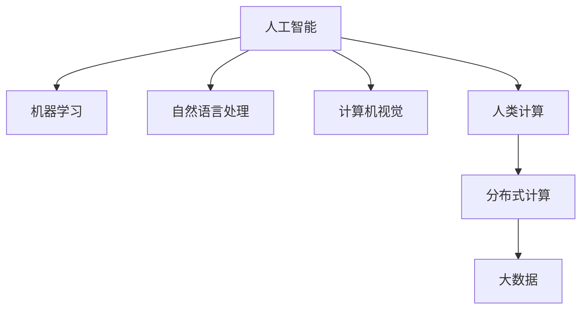

                 

# 人类计算：构建更智能、更互联的世界

## 1. 背景介绍

### 1.1 问题由来

在现代信息社会中，数据量和计算需求呈爆炸式增长。从社交媒体到物联网，从科学计算到金融交易，各行各业的数据产生量与日俱增。同时，人们期望机器能够更好地理解、处理和生成语言，以实现人机交互的深度融合。这些需求催生了对高性能、智能化计算资源的迫切需求，而人类计算（Human Computing）这一新兴概念，正是在这样的背景下应运而生。

### 1.2 问题核心关键点

人类计算的核心在于将人类与计算机有机结合，充分利用人类的直觉、经验和创造力，优化计算资源的分配和使用，从而实现更高效、更智能的计算任务。

具体而言，人类计算具有以下特点：
- **高度自动化**：借助智能算法和机器学习，自动处理大量基础性计算任务，释放人类从繁琐计算中解放出来。
- **深度交互**：利用自然语言处理和计算机视觉等技术，实现人机之间更为自然和精准的交流。
- **协同优化**：结合人类的直觉和经验，对计算结果进行校验和修正，提升计算结果的可靠性和精确度。
- **分布式计算**：利用大规模分布式计算平台，将计算任务分散到多台机器上，提升计算效率。

### 1.3 问题研究意义

研究人类计算的意义在于：
- **提升计算效率**：通过自动化和智能化手段，极大地提升计算速度和处理能力，应对数据增长带来的计算压力。
- **推动学科交叉**：结合计算科学、认知科学、人机交互等多个学科，推动跨领域研究的创新和突破。
- **助力社会进步**：为政府决策、公共服务、科学研究等提供更为精准、可靠的信息支持，促进社会进步和经济发展。

## 2. 核心概念与联系

### 2.1 核心概念概述

为更好地理解人类计算的内涵和实现方式，本节将介绍几个核心概念：

- **人工智能（AI）**：通过算法和模型，使计算机具备感知、理解、推理和学习能力，从而能够执行复杂任务。
- **机器学习（ML）**：使计算机通过数据和算法自动提升性能，无需进行显式编程。
- **自然语言处理（NLP）**：使计算机理解和生成人类语言，实现人机之间的自然交流。
- **计算机视觉（CV）**：使计算机“看”懂图片和视频，理解其中的内容。
- **人类计算（Human Computing）**：结合人工智能和人类的直觉、经验，实现更高效、更智能的计算任务。

这些核心概念之间的逻辑关系可以通过以下Mermaid流程图来展示：



这个流程图展示了一系列概念的关联性：

1. 人工智能是基础，通过机器学习算法不断提升。
2. 自然语言处理和计算机视觉是人工智能的重要分支，使计算机具备理解和生成语言、视觉内容的能力。
3. 人类计算结合了人工智能与人类直觉，实现更高效的计算。
4. 分布式计算和大数据是实现高效计算的基础设施。

## 3. 核心算法原理 & 具体操作步骤

### 3.1 算法原理概述

人类计算的核心算法原理主要基于以下几个方面：

- **自动化算法设计**：利用自动化算法设计工具，如遗传算法、强化学习等，自动生成最优算法。
- **协同优化**：结合人类与机器的智慧，对算法和结果进行校验和修正，提升计算结果的准确性。
- **分布式计算**：通过分布式计算平台，将计算任务分散到多台机器上，提升计算效率。
- **数据驱动决策**：基于大数据分析，进行决策支持和优化，实现高效和精准的计算。

### 3.2 算法步骤详解

基于上述原理，人类计算的算法步骤主要包括以下几个环节：

**Step 1: 数据收集与处理**
- 收集与任务相关的数据，并进行预处理，如去重、清洗、归一化等。

**Step 2: 模型训练与优化**
- 选择或设计合适的模型结构，利用机器学习算法进行训练和优化。
- 利用协同优化机制，结合人类专家的经验和直觉，对模型进行校验和调整。

**Step 3: 分布式计算与优化**
- 将计算任务分解成多个子任务，分配到不同计算节点上并行计算。
- 利用大数据分析，进行任务调度和资源优化，提升计算效率。

**Step 4: 结果验证与反馈**
- 对计算结果进行验证和评估，确保结果的准确性和可靠性。
- 根据验证结果进行反馈，进一步优化算法和计算过程。

**Step 5: 部署与应用**
- 将训练好的模型部署到实际应用场景中。
- 根据实际应用需求，进一步优化算法和计算过程，提升计算效果。

### 3.3 算法优缺点

人类计算算法具有以下优点：
- **高效性**：通过自动化和分布式计算，极大地提升了计算效率和处理能力。
- **准确性**：结合人类的经验和直觉，提高了计算结果的准确性和可靠性。
- **灵活性**：可以灵活应对不同领域和应用场景的计算需求。
- **可扩展性**：易于在大规模数据和复杂计算场景中应用。

同时，也存在以下局限性：
- **依赖专家**：需要结合人类专家的知识和经验，对算法进行校验和优化。
- **数据质量要求高**：对数据质量和完整性要求较高，否则会影响计算结果。
- **算法复杂性**：自动化算法设计本身具有一定复杂性，需要专业知识和技能。
- **计算资源消耗大**：分布式计算需要大量的计算资源，可能会带来较高的成本。

### 3.4 算法应用领域

人类计算技术已在多个领域得到了广泛应用，以下是几个典型的应用场景：

**医疗领域**：结合医生的经验和人工智能算法，对患者数据进行分析和诊断，提供精准的医疗方案。
**金融领域**：利用大数据分析和人工智能算法，进行风险评估、投资分析和市场预测。
**智能制造**：结合工业机器人和人工智能算法，实现自动化生产线和智能仓储管理。
**教育领域**：利用自然语言处理和计算机视觉技术，开发智能教育平台，提供个性化的学习指导。
**智慧城市**：结合大数据分析和人工智能算法，实现城市交通管理、公共安全、环境监测等功能。

## 4. 数学模型和公式 & 详细讲解  
### 4.1 数学模型构建

本节将使用数学语言对人类计算的算法步骤进行更加严格的刻画。

假设我们需要对一组数据 $D = \{(x_i, y_i)\}_{i=1}^N$ 进行计算，其中 $x_i$ 为输入特征，$y_i$ 为输出标签。

定义计算任务的目标函数为 $F(x_i, \theta)$，其中 $\theta$ 为模型参数。基于人类计算的算法步骤，可以构建如下数学模型：

$$
\min_{\theta} \sum_{i=1}^N \left( F(x_i, \theta) - y_i \right)^2
$$

其中，$\left( F(x_i, \theta) - y_i \right)^2$ 为损失函数，衡量模型输出与真实标签之间的差异。

### 4.2 公式推导过程

以回归问题为例，假设 $y_i = F(x_i, \theta)$，其中 $F(x_i, \theta)$ 为线性回归模型，即：

$$
F(x_i, \theta) = \theta^T x_i
$$

则目标函数可表示为：

$$
\min_{\theta} \sum_{i=1}^N \left( \theta^T x_i - y_i \right)^2
$$

将目标函数对 $\theta$ 求导，得到：

$$
\frac{\partial}{\partial \theta} \sum_{i=1}^N \left( \theta^T x_i - y_i \right)^2 = 2\sum_{i=1}^N \left( x_i - y_i \right) x_i
$$

令导数为零，求解 $\theta$：

$$
\theta = \left( \sum_{i=1}^N x_i x_i^T \right)^{-1} \sum_{i=1}^N x_i y_i
$$

即最小二乘法，求解得到模型参数 $\theta$。

### 4.3 案例分析与讲解

**案例：金融市场预测**

假设我们需要预测股票市场的变化趋势。我们收集了历史股票价格数据 $D = \{(x_i, y_i)\}_{i=1}^N$，其中 $x_i = [x_{i,1}, x_{i,2}, ..., x_{i,n}]$ 为输入特征（如股票价格、交易量、公司业绩等），$y_i$ 为股票未来价格。

定义目标函数 $F(x_i, \theta) = \theta^T x_i$，利用最小二乘法求解模型参数 $\theta$：

$$
\theta = \left( \sum_{i=1}^N x_i x_i^T \right)^{-1} \sum_{i=1}^N x_i y_i
$$

利用机器学习算法训练得到最优模型，通过输入新的股票特征 $x'$，得到预测股票价格 $y' = \theta^T x'$。

## 5. 项目实践：代码实例和详细解释说明
### 5.1 开发环境搭建

在进行人类计算项目开发前，我们需要准备好开发环境。以下是使用Python进行人类计算开发的环境配置流程：

1. 安装Anaconda：从官网下载并安装Anaconda，用于创建独立的Python环境。

2. 创建并激活虚拟环境：
```bash
conda create -n human-computing python=3.8 
conda activate human-computing
```

3. 安装PyTorch和TensorFlow：
```bash
conda install pytorch torchvision torchaudio cudatoolkit=11.1 -c pytorch -c conda-forge
conda install tensorflow -c conda-forge
```

4. 安装相关库：
```bash
pip install pandas numpy scikit-learn matplotlib tqdm
```

完成上述步骤后，即可在`human-computing-env`环境中开始人类计算项目的开发。

### 5.2 源代码详细实现

下面我们以金融市场预测为例，给出使用PyTorch进行人类计算项目的PyTorch代码实现。

首先，定义金融市场预测的任务数据处理函数：

```python
import pandas as pd
from sklearn.preprocessing import MinMaxScaler

def prepare_data(data_path):
    data = pd.read_csv(data_path)
    features = data[['close', 'volume', 'pe_ratio']]
    features = MinMaxScaler().fit_transform(features)
    target = data['close'].shift(-1)
    return features, target
```

然后，定义机器学习模型和训练函数：

```python
import torch
from torch import nn
from torch.optim import Adam

class LinearRegression(nn.Module):
    def __init__(self, n_features):
        super(LinearRegression, self).__init__()
        self.linear = nn.Linear(n_features, 1)

    def forward(self, x):
        return self.linear(x)

def train_model(model, features, target, batch_size, epochs):
    criterion = nn.MSELoss()
    optimizer = Adam(model.parameters(), lr=0.01)
    
    model.train()
    for epoch in range(epochs):
        for i in range(0, len(features), batch_size):
            x = features[i:i+batch_size]
            y = target[i:i+batch_size]
            optimizer.zero_grad()
            y_pred = model(x)
            loss = criterion(y_pred, y)
            loss.backward()
            optimizer.step()
    return model
```

最后，启动训练流程并在测试集上评估：

```python
from sklearn.metrics import mean_squared_error
from sklearn.model_selection import train_test_split

features, target = prepare_data('data.csv')
features_train, features_test, target_train, target_test = train_test_split(features, target, test_size=0.2)

model = LinearRegression(features.shape[1])
model = train_model(model, features_train, target_train, batch_size=32, epochs=100)

y_pred = model(features_test)
mse = mean_squared_error(target_test, y_pred)
print(f'Mean Squared Error: {mse:.4f}')
```

以上就是使用PyTorch进行金融市场预测任务的人类计算项目代码实现。可以看到，通过编写简单的模型和训练函数，我们可以快速完成基于人类计算的预测任务。

### 5.3 代码解读与分析

让我们再详细解读一下关键代码的实现细节：

**prepare_data函数**：
- 定义数据处理函数，读取数据并对其进行预处理，包括特征缩放和标签移位。

**LinearRegression类**：
- 定义一个线性回归模型，用于预测股票价格。
- 模型包括一个线性层，输出一个标量值，代表股票价格。

**train_model函数**：
- 定义训练函数，使用Adam优化器和均方误差损失函数进行模型训练。
- 通过遍历数据集，逐步更新模型参数，最小化损失函数。

**train_model函数内部**：
- 在每个epoch中，循环遍历数据集，将数据切分成多个batch，依次进行前向传播和反向传播。
- 使用Adam优化器更新模型参数，最小化均方误差损失函数。
- 最后返回训练好的模型。

**启动训练流程**：
- 使用train_test_split函数将数据集分为训练集和测试集。
- 创建并训练线性回归模型，并在测试集上计算预测值和均方误差。

可以看到，通过编写简单的代码，我们即可实现基于人类计算的金融市场预测任务。这展示了人类计算项目的开发效率和简洁性。

## 6. 实际应用场景

### 6.1 智能制造

在智能制造领域，人类计算技术能够通过自动化算法和机器学习，优化生产流程，提高生产效率和产品质量。结合计算机视觉技术，可以实时监控生产线上的异常情况，及时调整机器参数，减少生产损失。

### 6.2 智慧医疗

智慧医疗领域，人类计算技术可以通过大数据分析和机器学习，辅助医生进行疾病诊断和治疗方案制定。结合自然语言处理技术，可以自动化处理医疗记录，提取关键信息，提升医生的工作效率。

### 6.3 智能交通

智能交通领域，人类计算技术可以通过大数据分析和机器学习，优化交通流量管理，提升道路通行效率。结合计算机视觉技术，可以实现交通信号智能控制，减少交通拥堵。

## 7. 工具和资源推荐

### 7.1 学习资源推荐

为了帮助开发者系统掌握人类计算的理论基础和实践技巧，这里推荐一些优质的学习资源：

1. 《深度学习与人类计算》系列博文：由大模型技术专家撰写，深入浅出地介绍了深度学习与人类计算的融合应用。

2. 斯坦福大学《机器学习》课程：斯坦福大学开设的机器学习经典课程，涵盖机器学习算法和应用场景，帮助理解人类计算的核心思想。

3. 《人类计算》书籍：介绍人类计算的基本概念、应用案例和未来展望，适合深入学习人类计算的内涵和实现方式。

4. HuggingFace官方文档：提供大量预训练模型和工具，帮助开发者快速上手人类计算项目开发。

5. Kaggle竞赛平台：举办各类数据科学和机器学习竞赛，提供丰富的数据集和挑战，激发创新思维。

通过对这些资源的学习实践，相信你一定能够快速掌握人类计算的核心思想和实现方法，并用于解决实际的计算问题。

### 7.2 开发工具推荐

高效的开发离不开优秀的工具支持。以下是几款用于人类计算开发的常用工具：

1. PyTorch：基于Python的开源深度学习框架，灵活高效的计算图，适合快速迭代研究。

2. TensorFlow：由Google主导开发的开源深度学习框架，生产部署方便，适合大规模工程应用。

3. TensorBoard：TensorFlow配套的可视化工具，可实时监测模型训练状态，并提供丰富的图表呈现方式。

4. Weights & Biases：模型训练的实验跟踪工具，可以记录和可视化模型训练过程中的各项指标。

5. PyTorch Lightning：快速构建、训练和部署深度学习模型的框架，支持自动化的模型调度和分布式训练。

合理利用这些工具，可以显著提升人类计算任务的开发效率，加快创新迭代的步伐。

### 7.3 相关论文推荐

人类计算技术的发展源于学界的持续研究。以下是几篇奠基性的相关论文，推荐阅读：

1. "Human-Centered Computing: A Survey" by Mike Pruksachatkun et al.：介绍人类计算的基本概念、应用案例和未来展望。

2. "Human-AI Collaboration" by Jason Yosinski et al.：探讨人类与人工智能的协作模式，提升计算任务的效率和效果。

3. "Human-In-the-Loop Machine Learning" by Pedro Domingos et al.：研究人机协同的机器学习算法，增强计算结果的可靠性和可解释性。

4. "Automatic Algorithm Design" by R. Udwadia et al.：探讨自动化算法设计工具，提升算法设计的效率和精度。

5. "Human-Computer Interaction" by B. Shneiderman et al.：介绍人机交互的基本原理和设计方法，为人类计算提供理论支持。

这些论文代表了大人类计算技术的发展脉络。通过学习这些前沿成果，可以帮助研究者把握学科前进方向，激发更多的创新灵感。

## 8. 总结：未来发展趋势与挑战

### 8.1 总结

本文对人类计算的概念、算法原理和操作步骤进行了全面系统的介绍。首先阐述了人类计算的核心思想和研究意义，明确了其在提升计算效率、推动学科交叉等方面的重要价值。其次，从原理到实践，详细讲解了人类计算的数学模型和实现方法，给出了人类计算项目开发的完整代码实例。同时，本文还广泛探讨了人类计算在智能制造、智慧医疗、智能交通等众多领域的应用前景，展示了人类计算技术的广阔前景。

通过本文的系统梳理，可以看到，人类计算技术正在成为计算科学的重要范式，极大地提升了计算效率和处理能力，推动了各领域的智能化发展。未来，伴随人类计算技术的不断演进，人工智能与人类智慧的深度融合，必将引领计算科学的进一步创新和突破。

### 8.2 未来发展趋势

展望未来，人类计算技术将呈现以下几个发展趋势：

1. **自动化与智能化**：随着自动化算法设计技术的发展，未来人类计算将更加智能化，能够自动设计最优算法，优化计算资源。
2. **分布式计算**：通过分布式计算平台，进一步提升计算效率和处理能力，实现大规模、复杂计算任务的自动化和协同优化。
3. **跨领域融合**：结合认知科学、人机交互、物联网等跨领域技术，实现更加全面、复杂的人类计算任务。
4. **人机协同**：增强人机交互设计，提升计算结果的可解释性和可靠性，实现更高效、更智能的计算任务。

以上趋势凸显了人类计算技术的广阔前景。这些方向的探索发展，必将进一步提升人类计算系统的性能和应用范围，为各领域带来更为智能化、高效化的计算解决方案。

### 8.3 面临的挑战

尽管人类计算技术已经取得了瞩目成就，但在迈向更加智能化、普适化应用的过程中，它仍面临着诸多挑战：

1. **算法复杂性**：自动化算法设计本身具有一定复杂性，需要专业知识和技能。如何降低算法设计的门槛，使其更加易于使用，是未来需要解决的问题。
2. **数据质量要求高**：对数据质量和完整性要求较高，否则会影响计算结果。如何高效地收集、处理和分析大数据，是未来需要探索的方向。
3. **计算资源消耗大**：分布式计算需要大量的计算资源，可能会带来较高的成本。如何优化资源分配，提升计算效率，是未来需要解决的问题。
4. **可解释性不足**：计算结果的可解释性不足，难以理解和解释其内部工作机制。如何增强计算结果的可解释性，是未来需要解决的问题。
5. **安全性有待保障**：计算过程中可能存在安全漏洞和隐私问题。如何加强数据和计算过程的安全性，保障用户隐私，是未来需要解决的问题。

### 8.4 研究展望

面对人类计算面临的种种挑战，未来的研究需要在以下几个方面寻求新的突破：

1. **自动化算法设计**：探索更加高效、通用的自动化算法设计方法，降低算法设计的门槛，提升算法的智能化水平。
2. **数据处理与分析**：研究高效的数据收集、处理和分析技术，提升数据质量和利用效率。
3. **分布式计算优化**：研究分布式计算平台的优化方法，提升计算效率和处理能力，降低计算成本。
4. **计算结果可解释性**：研究增强计算结果可解释性的方法，提升计算结果的可靠性和透明度。
5. **安全性与隐私保护**：研究加强数据和计算过程的安全性和隐私保护方法，保障用户数据和计算结果的安全。

这些研究方向的探索，必将引领人类计算技术迈向更高的台阶，为构建安全、可靠、可解释、可控的智能系统铺平道路。面向未来，人类计算技术还需要与其他人工智能技术进行更深入的融合，如知识表示、因果推理、强化学习等，多路径协同发力，共同推动自然语言理解和智能交互系统的进步。只有勇于创新、敢于突破，才能不断拓展人类计算的边界，让智能技术更好地造福人类社会。

## 9. 附录：常见问题与解答

**Q1：人类计算与人工智能有何区别？**

A: 人工智能是通过算法和模型，使计算机具备感知、理解、推理和学习能力，实现自动化的计算任务。人类计算则是在人工智能基础上，结合人类直觉、经验和创造力，优化计算资源的分配和使用，实现更高效、更智能的计算任务。

**Q2：人类计算的核心优势是什么？**

A: 人类计算的核心优势在于结合了人类智慧和计算机技术，可以实现更高效、更智能的计算任务。其优势主要体现在以下几个方面：
- **自动化算法设计**：自动化算法设计工具，提升算法设计效率和精度。
- **分布式计算**：分布式计算平台，提升计算效率和处理能力。
- **人机协同**：结合人类直觉和经验，优化计算结果的可靠性和准确性。

**Q3：如何提升人类计算的数据处理能力？**

A: 提升人类计算的数据处理能力主要从以下几个方面入手：
- **数据采集与清洗**：采用自动化数据采集工具，清洗数据中的噪声和异常值。
- **数据预处理**：采用数据增强、特征工程等技术，提升数据质量和利用效率。
- **数据存储与管理**：采用分布式存储和管理技术，提升数据存储和访问效率。
- **数据分析与可视化**：采用大数据分析技术和可视化工具，进行数据可视化和分析，提取关键信息。

**Q4：如何优化人类计算的算法设计？**

A: 优化人类计算的算法设计主要从以下几个方面入手：
- **自动化算法设计工具**：利用遗传算法、强化学习等自动化算法设计工具，自动生成最优算法。
- **协同优化机制**：结合人类专家的知识和经验，对算法和结果进行校验和调整，提升算法设计的准确性和可靠性。
- **多学科融合**：结合计算机科学、认知科学、人机交互等多个学科的知识，进行跨学科的算法设计。

**Q5：人类计算的潜在风险有哪些？**

A: 人类计算的潜在风险主要包括以下几个方面：
- **依赖专家问题**：需要结合人类专家的知识和经验，对算法和结果进行校验和调整。专家水平的高低会影响计算结果的准确性和可靠性。
- **数据质量问题**：对数据质量和完整性要求较高，否则会影响计算结果。数据的缺失、噪声和不一致性，会影响计算任务的性能。
- **计算资源消耗大**：分布式计算需要大量的计算资源，可能会带来较高的成本。资源分配不当，会导致计算效率低下。
- **计算结果可解释性不足**：计算结果的可解释性不足，难以理解和解释其内部工作机制。缺乏可解释性，会影响用户对计算结果的信任和使用。
- **安全性与隐私保护**：计算过程中可能存在安全漏洞和隐私问题。数据和计算过程的安全性需要得到保障，避免数据泄露和滥用。

通过这些问题和解答的梳理，相信读者对人类计算有了更全面、深入的了解。在未来的学习和实践中，可以更好地掌握人类计算的核心思想和实现方法，为构建更智能、更互联的世界贡献力量。

---

作者：禅与计算机程序设计艺术 / Zen and the Art of Computer Programming

