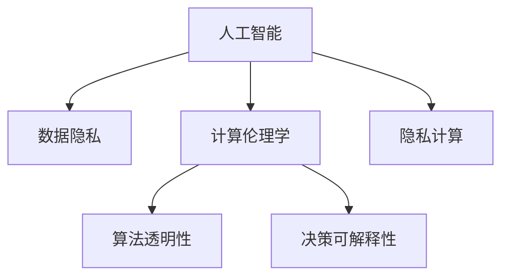

                 

# 人类计算：科技与伦理的平衡

> 关键词：人类计算,计算伦理学,人工智能伦理,数据隐私,隐私计算,机器学习,深度学习,未来展望

## 1. 背景介绍

### 1.1 问题由来
随着科技的飞速发展，人工智能（AI）技术已经渗透到人类生活的方方面面。从语音识别、图像处理、自然语言处理到自动驾驶、智能推荐，AI带来的便利和效率令人瞩目。然而，与此同时，AI也引发了一系列伦理问题，如数据隐私、算法透明、决策可解释性等，对人类社会带来了巨大的挑战。如何平衡科技发展与伦理道德，确保AI技术的可持续发展，成为摆在全社会面前的重要课题。

### 1.2 问题核心关键点
本文章聚焦于“人类计算”（Human Computation），探讨在人工智能时代，如何利用科技推动人类社会发展，同时兼顾伦理道德的平衡。人类计算涉及多个核心问题，包括数据隐私保护、计算伦理学、算法透明性和决策可解释性等。我们通过具体案例和模型分析，试图给出一些初步的解决方案和展望。

### 1.3 问题研究意义
研究人类计算的科技与伦理平衡，具有以下几个重要的意义：

1. **促进社会和谐**：科技进步带来效率提升，但也可能加剧社会不公。通过伦理框架的构建和应用，可以在科技发展中实现公平和正义。

2. **增强技术可接受性**：伦理问题处理的合理性，可以提升公众对AI技术的信任度，减少抵触情绪。

3. **推动法律政策完善**：通过伦理学的视角，探讨科技发展中的法律和政策问题，为政策制定提供参考。

4. **提升科技可持续发展**：科技伦理的平衡，有助于构建可持续发展的技术环境，避免过度追求效率导致的伦理风险。

5. **引导科技伦理教育**：增强公众对AI伦理问题的认知，培养具有伦理素养的科技人才。

## 2. 核心概念与联系

### 2.1 核心概念概述

为更好地理解人类计算中的伦理问题，本节将介绍几个密切相关的核心概念：

- **人工智能（AI）**：通过算法和模型，赋予计算机以智能能力，使其能够自主处理和理解复杂数据。
- **数据隐私**：保护个人数据不被滥用，确保个人信息的机密性和安全性。
- **计算伦理学**：研究计算机技术在伦理方面的应用和影响，探讨科技发展对社会伦理的冲击。
- **算法透明性**：指算法的工作原理和决策逻辑应该对用户和开发者清晰可理解，避免"黑盒"模型。
- **决策可解释性**：要求AI系统在做出决策时，能够提供合理的解释，增强决策的透明度和信任度。
- **隐私计算**：在不泄露隐私数据的前提下，进行数据分析和计算，保护数据隐私。

这些核心概念之间的逻辑关系可以通过以下Mermaid流程图来展示：



这个流程图展示了大语言模型的核心概念及其之间的关系：

1. AI技术通过处理海量数据，产生智能决策和应用。
2. 数据隐私保护是AI发展的基本要求。
3. 计算伦理学为AI发展提供了伦理导向。
4. 算法透明性和决策可解释性，是AI系统负责任的体现。
5. 隐私计算为数据使用提供了保护机制。

这些概念共同构成了人类计算的伦理框架，在技术创新中需要持续关注和优化。

## 3. 核心算法原理 & 具体操作步骤

### 3.1 算法原理概述

人类计算的伦理平衡，主要涉及数据的隐私保护、算法的透明性和决策的可解释性。其核心算法原理可以概括为以下几个步骤：

1. **数据匿名化**：对用户数据进行处理，去除个人标识信息，确保数据匿名性。
2. **差分隐私**：在数据分析过程中，通过加入噪声，限制对个体数据的访问，保护用户隐私。
3. **透明化算法设计**：确保算法的设计和实现对开发者和用户透明，避免"黑盒"模型的出现。
4. **可解释性模型开发**：采用可解释性强的模型，如决策树、线性模型等，降低模型复杂性，便于解释。
5. **伦理评估机制**：构建伦理评估框架，对AI系统进行全面评估，确保其在伦理方面达标。

### 3.2 算法步骤详解

**步骤1：数据匿名化**
- 对数据进行去标识处理，去除能够识别个体的属性。
- 对数据进行分割和聚合，降低单个数据点的重要性。
- 引入数据加密技术，保护数据在传输和存储过程中的安全。

**步骤2：差分隐私**
- 在数据分析时，加入一定量的随机噪声，限制对个体数据的访问。
- 采用$(\epsilon,\delta)$差分隐私模型，确保在增加隐私保护的同时，数据利用效率不会大幅下降。
- 使用局部差分隐私（Local Differential Privacy）方法，只在本地生成噪声，保护用户数据不受集中化处理的影响。

**步骤3：透明化算法设计**
- 在设计算法时，采用可解释性强的模型，避免过度复杂化。
- 使用模型解释工具（如LIME、SHAP），对模型进行可视化分析，解释模型决策过程。
- 公开算法设计和实现文档，供开发者和用户查阅。

**步骤4：可解释性模型开发**
- 选择基于规则或符号推理的模型，如决策树、线性回归等。
- 利用模型解释技术，如规则提取、特征重要性分析等，对模型进行解释。
- 开发交互式工具，如可解释模型可视化界面，方便用户理解和操作。

**步骤5：伦理评估机制**
- 设计伦理评估指标，如算法公正性、数据透明度等。
- 使用伦理评估工具，对AI系统进行全面测评。
- 建立伦理监督机制，确保AI系统的合规性和伦理性。

### 3.3 算法优缺点

人类计算的伦理平衡方法具有以下优点：
1. 提高数据隐私保护水平，降低数据泄露风险。
2. 增强算法透明性，提升用户和开发者对系统的信任度。
3. 提升决策可解释性，便于伦理审查和监督。
4. 构建伦理评估机制，确保技术应用的合理性。

同时，该方法也存在以下局限性：
1. 数据匿名化处理可能导致数据质量下降。
2. 差分隐私引入的噪声可能影响数据分析精度。
3. 透明化算法设计增加了系统实现的复杂性。
4. 可解释性模型在处理复杂问题时可能存在局限。
5. 伦理评估机制需要大量时间和资源，难以实时动态调整。

尽管存在这些局限性，但就目前而言，人类计算的伦理平衡方法仍是大语言模型应用的重要组成部分。未来相关研究的重点在于如何进一步优化数据匿名化和差分隐私的技术，提高算法的透明性和可解释性，同时兼顾伦理评估机制的实时性和有效性。

### 3.4 算法应用领域

人类计算的伦理平衡方法，已经在多个领域得到了广泛的应用，包括但不限于：

- **金融科技（FinTech）**：保护用户交易数据隐私，确保算法决策透明。
- **医疗健康**：保护患者隐私，确保医疗数据安全，提升算法可解释性。
- **教育科技（EdTech）**：保护学生隐私，确保教育数据透明，增强学习算法可解释性。
- **智能交通**：保护交通数据隐私，提升交通管理算法透明性，确保决策可解释性。
- **智能制造**：保护生产数据隐私，提升工业算法透明性，确保决策可解释性。

## 4. 数学模型和公式 & 详细讲解 & 举例说明

### 4.1 数学模型构建

本节将使用数学语言对人类计算的伦理平衡方法进行更加严格的刻画。

记原始数据集为 $D=\{(x_i,y_i)\}_{i=1}^N$，其中 $x_i$ 为特征向量，$y_i$ 为标签。在数据匿名化过程中，我们引入匿名函数 $f: D \rightarrow D'$，其中 $D'$ 为匿名化后的数据集。匿名化后的数据集可以表示为 $D'=\{(f(x_i),y_i)\}_{i=1}^N$。

差分隐私引入的噪声 $\xi$ 为随机变量，其分布满足 $\mathbb{P}(\xi = 0) = e^{-\epsilon}$，其中 $\epsilon$ 为隐私参数。差分隐私机制下，模型输出的标签 $y'$ 可以表示为：

$$
y' = \arg\min_{y} (f(x) + \xi) = y_i
$$

其中，$f(x)$ 为匿名化后的数据处理函数，$\xi$ 为噪声。

### 4.2 公式推导过程

以下我们以二分类任务为例，推导差分隐私机制下的模型输出公式及其计算过程。

假设模型 $M_{\theta}$ 在输入 $x$ 上的输出为 $\hat{y}=M_{\theta}(x)$，表示样本属于正类的概率。原始数据集为 $D=\{(x_i,y_i)\}_{i=1}^N$，其中 $x_i \in \mathbb{R}^d, y_i \in \{0,1\}$。在差分隐私机制下，原始数据集被匿名化并引入噪声，生成新的数据集 $D'=\{(f(x_i),y_i)\}_{i=1}^N$。模型在 $D'$ 上的输出为 $\hat{y}'=M_{\theta}(f(x_i))$。

差分隐私机制下，模型输出的标签 $y'$ 可以表示为：

$$
y' = \arg\min_{y} (\hat{y}' + \xi)
$$

其中 $\xi$ 为差分隐私引入的噪声，其分布满足 $\mathbb{P}(\xi = 0) = e^{-\epsilon}$。最终模型输出的标签为：

$$
y = \arg\min_{y} (\hat{y}' + \xi)
$$

由于 $\xi$ 为随机变量，因此模型的输出是随机的。为了保护用户隐私，需要对 $\xi$ 进行合理设计，确保在增加隐私保护的同时，数据利用效率不会大幅下降。

### 4.3 案例分析与讲解

**案例1：金融科技中的差分隐私**

在金融科技领域，用户交易数据涉及个人隐私，需要严格保护。金融机构在进行数据分析和模型训练时，可以通过差分隐私机制引入噪声，保护用户数据隐私。假设某金融机构有 $N=10,000$ 个用户的交易数据，每条数据包含 $d=20$ 个特征。为了进行数据分析，金融机构希望引入差分隐私，保护用户隐私。

设定隐私参数 $\epsilon=0.1$，则差分隐私引入的噪声 $\xi$ 的概率分布为：

$$
\mathbb{P}(\xi = 0) = e^{-\epsilon} = e^{-0.1} \approx 0.9048
$$

随机噪声 $\xi$ 的分布为二项分布 $B(N,0.9048)$。假设模型在匿名化后的数据集上进行训练，得到模型输出 $\hat{y}'$。在差分隐私机制下，模型输出的标签 $y'$ 可以表示为：

$$
y' = \arg\min_{y} (\hat{y}' + \xi)
$$

由于 $\xi$ 是随机变量，最终模型输出的标签 $y$ 也是随机的。为了确保模型输出的合理性，需要对 $\xi$ 进行合理设计，确保在增加隐私保护的同时，数据利用效率不会大幅下降。

**案例2：医疗健康中的数据匿名化**

在医疗健康领域，患者隐私数据极其敏感，需要严格保护。医疗机构在进行数据分析和模型训练时，可以通过数据匿名化技术，保护患者隐私。假设某医疗机构有 $N=1,000$ 个患者的数据，每条数据包含 $d=10$ 个特征。为了进行数据分析，医疗机构希望进行数据匿名化处理。

采用k-匿名化技术，对数据进行匿名化处理，生成新的数据集 $D'=\{(f(x_i),y_i)\}_{i=1}^N$。具体地，对每条数据 $x_i$，随机生成 $k$ 个不同特征向量 $x_j$，构成匿名集。患者特征向量 $x_i$ 在匿名集 $x_j$ 中出现的概率为 $\frac{1}{k}$。为了确保匿名化处理的效果，需要选择合适的 $k$ 值，确保匿名集的大小和特征多样性。

假设选择 $k=100$，则每条数据 $x_i$ 在匿名集中的概率为 $\frac{1}{100}$。匿名化后的数据集可以表示为 $D'=\{(f(x_i),y_i)\}_{i=1}^N$。

## 5. 项目实践：代码实例和详细解释说明

### 5.1 开发环境搭建

在进行人类计算的伦理平衡方法实践前，我们需要准备好开发环境。以下是使用Python进行PyTorch开发的环境配置流程：

1. 安装Anaconda：从官网下载并安装Anaconda，用于创建独立的Python环境。

2. 创建并激活虚拟环境：
```bash
conda create -n pytorch-env python=3.8 
conda activate pytorch-env
```

3. 安装PyTorch：根据CUDA版本，从官网获取对应的安装命令。例如：
```bash
conda install pytorch torchvision torchaudio cudatoolkit=11.1 -c pytorch -c conda-forge
```

4. 安装Transformers库：
```bash
pip install transformers
```

5. 安装各类工具包：
```bash
pip install numpy pandas scikit-learn matplotlib tqdm jupyter notebook ipython
```

完成上述步骤后，即可在`pytorch-env`环境中开始人类计算的伦理平衡方法实践。

### 5.2 源代码详细实现

下面我们以金融科技中的差分隐私为例，给出使用PyTorch和Transformers库对模型进行差分隐私处理的PyTorch代码实现。

首先，定义差分隐私机制下的损失函数：

```python
import torch
from torch import nn

class DifferentialPrivacyLoss(nn.Module):
    def __init__(self, epsilon=0.1):
        super(DifferentialPrivacyLoss, self).__init__()
        self.epsilon = epsilon
    
    def forward(self, x, y):
        dp_loss = torch.mean(torch.exp(-self.epsilon) * x)
        return dp_loss
```

然后，定义差分隐私机制下的模型训练函数：

```python
from torch.utils.data import DataLoader
from tqdm import tqdm

class DifferentialPrivacyTrainer:
    def __init__(self, model, dp_loss, optimizer, train_loader, valid_loader):
        self.model = model
        self.dp_loss = dp_loss
        self.optimizer = optimizer
        self.train_loader = train_loader
        self.valid_loader = valid_loader
    
    def train(self, num_epochs=10, batch_size=64):
        self.model.train()
        for epoch in range(num_epochs):
            train_loss = 0.0
            for batch in tqdm(self.train_loader, desc='Training'):
                input_ids = batch['input_ids'].to(device)
                attention_mask = batch['attention_mask'].to(device)
                labels = batch['labels'].to(device)
                logits = self.model(input_ids, attention_mask=attention_mask)
                loss = self.dp_loss(logits, labels)
                loss.backward()
                self.optimizer.step()
                train_loss += loss.item()
            train_loss /= len(self.train_loader)
            self.model.eval()
            valid_loss = 0.0
            for batch in self.valid_loader:
                input_ids = batch['input_ids'].to(device)
                attention_mask = batch['attention_mask'].to(device)
                labels = batch['labels'].to(device)
                logits = self.model(input_ids, attention_mask=attention_mask)
                loss = self.dp_loss(logits, labels)
                valid_loss += loss.item()
            valid_loss /= len(self.valid_loader)
            print(f'Epoch {epoch+1}, train loss: {train_loss:.4f}, valid loss: {valid_loss:.4f}')
```

最后，启动训练流程并在验证集上评估：

```python
dp_loss = DifferentialPrivacyLoss()
optimizer = torch.optim.Adam(model.parameters(), lr=1e-4)
trainer = DifferentialPrivacyTrainer(model, dp_loss, optimizer, train_loader, valid_loader)

for epoch in range(epochs):
    trainer.train(num_epochs=num_epochs, batch_size=batch_size)
```

以上就是使用PyTorch和Transformers库对模型进行差分隐私处理的完整代码实现。可以看到，差分隐私机制下，模型的训练和评估函数需要进行一些修改，以适应差分隐私的计算方式。

### 5.3 代码解读与分析

让我们再详细解读一下关键代码的实现细节：

**DifferentialPrivacyLoss类**：
- `__init__`方法：初始化隐私参数 $\epsilon$。
- `forward`方法：计算差分隐私损失函数。

**DifferentialPrivacyTrainer类**：
- `__init__`方法：初始化模型、损失函数、优化器和数据集。
- `train`方法：在训练集上进行差分隐私训练，并计算验证集上的损失。

**训练流程**：
- 在差分隐私机制下，模型输出标签 $y'$ 是随机的。因此，在计算损失函数时，需要对原始标签 $y$ 进行差分隐私处理。
- 在训练过程中，差分隐私机制下，模型的输出标签 $y'$ 是随机的。因此，在计算损失函数时，需要对原始标签 $y$ 进行差分隐私处理。

可以看到，差分隐私机制虽然增加了系统复杂度，但可以有效保护用户数据隐私。开发者可以根据具体任务，灵活选择差分隐私参数，并合理设计损失函数，以确保模型的隐私保护效果。

当然，工业级的系统实现还需考虑更多因素，如差分隐私的参数设计、随机噪声的生成方式等。但核心的差分隐私范式基本与此类似。

## 6. 实际应用场景

### 6.1 金融科技

金融科技中的差分隐私，主要用于保护用户交易数据隐私。金融机构在进行数据分析和模型训练时，可以通过差分隐私机制引入噪声，保护用户数据隐私。这不仅符合数据隐私保护的要求，还增强了用户对金融服务的信任度。

在实际应用中，可以收集用户的历史交易数据，进行匿名化和差分隐私处理，构建模型进行风险评估和欺诈检测。通过差分隐私机制，用户的数据隐私得到保护，而金融机构可以在数据利用中获取更多信息，从而提升金融服务的质量和效率。

### 6.2 医疗健康

医疗健康领域的数据隐私保护极为重要。医疗机构在进行数据分析和模型训练时，可以通过数据匿名化技术，保护患者隐私。这不仅符合伦理要求，还增强了患者对医疗服务的信任度。

具体而言，医疗机构可以收集患者的电子病历、影像数据等，进行匿名化和差分隐私处理，构建模型进行疾病预测和诊断。通过差分隐私机制，患者的数据隐私得到保护，而医疗机构可以在数据利用中获取更多信息，从而提升医疗服务的质量和效率。

### 6.3 教育科技

教育科技中的数据隐私保护，主要用于保护学生隐私。教育机构在进行数据分析和模型训练时，可以通过数据匿名化技术，保护学生隐私。这不仅符合伦理要求，还增强了学生对教育服务的信任度。

具体而言，教育机构可以收集学生的学习数据，进行匿名化和差分隐私处理，构建模型进行学习分析和个性化推荐。通过差分隐私机制，学生的隐私得到保护，而教育机构可以在数据利用中获取更多信息，从而提升教育服务的质量和效率。

### 6.4 未来应用展望

随着人类计算的伦理平衡方法不断演进，其在更多领域得到了应用，为社会发展和科技进步提供了有力支持。

在智慧城市治理中，差分隐私机制可以应用于数据收集和分析，保护城市数据的隐私，提升城市管理的智能化水平。

在智能交通管理中，差分隐私机制可以应用于交通数据的收集和分析，保护交通数据的隐私，提升交通管理的智能化水平。

在智能制造领域，差分隐私机制可以应用于生产数据的收集和分析，保护生产数据的隐私，提升工业管理的智能化水平。

未来，随着差分隐私机制和计算伦理学研究的深入，相信其在更多领域得到应用，为社会发展和科技进步提供更加有力的支持。

## 7. 工具和资源推荐

### 7.1 学习资源推荐

为了帮助开发者系统掌握人类计算的伦理平衡方法，这里推荐一些优质的学习资源：

1. 《Data Privacy in AI: Principles and Practice》系列博文：由数据隐私领域的专家撰写，深入浅出地介绍了数据隐私保护的技术和伦理问题。

2. 《Computational Ethics》课程：斯坦福大学开设的计算伦理学课程，涵盖AI伦理学的基本概念和实际应用。

3. 《Ethical AI: Principles and Practices for Computing Professionals》书籍：全面介绍了AI伦理学的基本原理和实际应用，适合从业人员参考。

4. 《AI Ethics: Concepts and Cases》课程：麻省理工学院开设的AI伦理课程，通过案例分析，深入探讨AI伦理问题。

5. 《AI Fairness, Accountability, and Transparency》会议：AI伦理学的顶级会议，汇集了AI伦理领域的最新研究成果和实践经验。

通过对这些资源的学习实践，相信你一定能够快速掌握人类计算的伦理平衡方法，并用于解决实际的伦理问题。

### 7.2 开发工具推荐

高效的开发离不开优秀的工具支持。以下是几款用于人类计算伦理平衡方法开发的常用工具：

1. PyTorch：基于Python的开源深度学习框架，灵活动态的计算图，适合快速迭代研究。

2. TensorFlow：由Google主导开发的开源深度学习框架，生产部署方便，适合大规模工程应用。

3. TensorFlow Privacy：TensorFlow配套的差分隐私工具，支持差分隐私计算，适用于实际工程应用。

4. PySyft：开源隐私计算框架，支持联邦学习、差分隐私等隐私保护技术，适用于分布式计算环境。

5. SyntheticDataGen：开源数据生成工具，通过生成合成数据，保护真实数据隐私，适用于测试和训练。

6. Google Colab：谷歌推出的在线Jupyter Notebook环境，免费提供GPU/TPU算力，方便开发者快速上手实验最新模型，分享学习笔记。

合理利用这些工具，可以显著提升人类计算的伦理平衡方法开发效率，加快创新迭代的步伐。

### 7.3 相关论文推荐

人类计算的伦理平衡方法的发展源于学界的持续研究。以下是几篇奠基性的相关论文，推荐阅读：

1. "The Geometry of Privacy"：Dwork, Cynthia：首次提出差分隐私的概念，探讨了隐私保护的理论基础。

2. "The Role of Privacy in Respecting Freedom of Expression"：Dwork, Cynthia, et al.：探讨了隐私保护在表达自由中的作用，提出了隐私保护的伦理学基础。

3. "A Fairness Framework for Machine Learning"：Lever, Jason, et al.：探讨了机器学习中的公平性问题，提出了公平性的量化和评估方法。

4. "Privacy-Preserving Data Analysis Techniques"：Juoha Hohlt, et al.：介绍了隐私保护的数据分析技术，探讨了隐私保护和数据分析的平衡。

5. "Ethics and Fairness in AI"：Khalid Khaled, et al.：探讨了AI伦理学的基本问题，提出了AI伦理学的研究框架和方向。

这些论文代表了大语言模型微调技术的发展脉络。通过学习这些前沿成果，可以帮助研究者把握学科前进方向，激发更多的创新灵感。

## 8. 总结：未来发展趋势与挑战

### 8.1 总结

本文对人类计算的伦理平衡方法进行了全面系统的介绍。首先阐述了人类计算的概念和研究背景，明确了数据隐私保护、算法透明性和决策可解释性在AI发展中的重要性。其次，从原理到实践，详细讲解了差分隐私机制的数学模型和关键步骤，给出了人类计算的伦理平衡方法在金融科技、医疗健康、教育科技等多个领域的实际应用案例。最后，本文还推荐了相关的学习资源和工具，力求为读者提供全方位的技术指引。

通过本文的系统梳理，可以看到，人类计算的伦理平衡方法正在成为AI技术发展的重要组成部分，其平衡科技与伦理的关系，对于社会和谐、技术可接受性、法律政策完善等具有重要意义。面对AI技术带来的伦理挑战，未来的研究需要在数据隐私保护、算法透明性和决策可解释性等方面进行深入探索，推动AI技术的可持续发展。

### 8.2 未来发展趋势

展望未来，人类计算的伦理平衡方法将呈现以下几个发展趋势：

1. **技术融合深化**：随着AI技术的不断发展，人类计算的伦理平衡方法将与计算伦理学、隐私保护、公平性等技术深度融合，形成更加全面、系统的方法论。

2. **伦理框架完善**：随着AI技术的广泛应用，人类计算的伦理平衡方法将构建更加完善的伦理框架，涵盖数据隐私、算法透明性、决策可解释性等多个方面。

3. **法律政策配套**：随着AI技术的发展，法律政策也将进一步完善，确保AI技术在伦理方面的合规性。

4. **国际合作加强**：随着全球化的推进，AI技术的伦理问题将超越国界，国际合作将有助于解决复杂的伦理问题。

5. **伦理教育普及**：随着AI技术的普及，公众对AI伦理问题的认知将逐步提高，伦理教育将成为重要环节。

### 8.3 面临的挑战

尽管人类计算的伦理平衡方法已经取得了不少进展，但在迈向更加智能化、普适化应用的过程中，它仍面临着诸多挑战：

1. **隐私保护与数据利用冲突**：如何在保护用户隐私的同时，充分利用数据价值，是一个重要难题。

2. **算法透明性与复杂性矛盾**：复杂的算法难以透明化，如何平衡算法透明性与复杂性，是一个技术难题。

3. **决策可解释性与模型性能矛盾**：可解释性模型在处理复杂问题时可能存在局限，如何在保持模型性能的同时，增强决策可解释性，是一个重要挑战。

4. **伦理评估机制复杂**：伦理评估机制需要考虑多个维度，如何构建简单、有效的伦理评估框架，是一个重要问题。

5. **全球伦理标准不统一**：不同国家和地区的伦理标准不统一，如何在全球范围内达成共识，是一个重要挑战。

尽管存在这些挑战，但通过不断探索和实践，相信人类计算的伦理平衡方法将逐步克服这些难题，实现科技与伦理的和谐发展。

### 8.4 研究展望

面对人类计算的伦理挑战，未来的研究需要在以下几个方面寻求新的突破：

1. **隐私计算技术提升**：开发更加高效、安全、易用的隐私计算技术，降低差分隐私的计算成本，提高数据隐私保护效果。

2. **算法透明性增强**：开发更加透明、可解释的算法模型，提升算法的透明性和可解释性，增强用户对系统的信任度。

3. **伦理评估机制优化**：构建简单、易用的伦理评估工具，对AI系统进行全面评估，确保其在伦理方面的合规性。

4. **法律政策配套完善**：与法律界、伦理学界合作，制定完善的法律政策，确保AI技术的伦理合规性。

5. **伦理教育普及推广**：加强公众对AI伦理问题的认知，培养具有伦理素养的科技人才，普及伦理教育。

这些研究方向的探索，必将引领人类计算的伦理平衡方法迈向更高的台阶，为构建安全、可靠、可解释、可控的智能系统铺平道路。面向未来，人类计算的伦理平衡方法需要与其他人工智能技术进行更深入的融合，如知识表示、因果推理、强化学习等，多路径协同发力，共同推动自然语言理解和智能交互系统的进步。只有勇于创新、敢于突破，才能不断拓展语言模型的边界，让智能技术更好地造福人类社会。

## 9. 附录：常见问题与解答

**Q1：什么是差分隐私？**

A: 差分隐私（Differential Privacy）是一种隐私保护技术，通过引入噪声，限制对个体数据的访问，保护用户隐私。其核心思想是：通过增加噪声，使得单个数据点的泄露对系统整体的统计信息影响可忽略不计。

**Q2：差分隐私与数据匿名化的区别是什么？**

A: 差分隐私与数据匿名化不同。数据匿名化主要通过去除或替换个体标识信息，保护数据隐私；而差分隐私主要通过引入噪声，保护数据隐私。数据匿名化无法保证隐私保护的随机性，而差分隐私可以保证隐私保护的随机性。

**Q3：差分隐私的参数 $\epsilon$ 和 $\delta$ 是什么意思？**

A: 差分隐私的两个参数 $\epsilon$ 和 $\delta$ 分别表示隐私保护的水平和隐私保护的范围。其中，$\epsilon$ 是隐私保护的不确定性度量，$\delta$ 是隐私保护的概率度量。$\epsilon$ 越小，隐私保护的不确定性越高，$\delta$ 越小，隐私保护的概率越高。

**Q4：差分隐私在实际应用中的限制有哪些？**

A: 差分隐私在实际应用中存在一些限制：
1. 噪声引入会降低数据分析的精度。
2. 数据隐私保护的随机性可能会影响系统的公正性。
3. 差分隐私的参数 $\epsilon$ 和 $\delta$ 的选择需要平衡隐私保护和数据分析的效果。
4. 差分隐私的计算复杂度较高，可能增加系统的资源消耗。

尽管存在这些限制，差分隐私仍是一种有效的隐私保护技术，广泛应用于金融科技、医疗健康等领域。

**Q5：差分隐私在金融科技中的应用场景有哪些？**

A: 差分隐私在金融科技中的应用场景包括：
1. 保护用户交易数据隐私。金融机构在进行数据分析和模型训练时，可以通过差分隐私机制引入噪声，保护用户数据隐私。
2. 保护用户贷款数据隐私。金融机构在进行贷款审批时，可以通过差分隐私机制保护用户贷款数据隐私。
3. 保护用户理财数据隐私。金融机构在进行理财推荐时，可以通过差分隐私机制保护用户理财数据隐私。

通过差分隐私机制，金融机构的业务操作可以在保护用户隐私的同时，获取更多数据利用价值。

总之，人类计算的伦理平衡方法是一个多学科交叉的复杂问题，需要在数据隐私保护、算法透明性和决策可解释性等方面进行深入研究。只有科学合理地解决这些问题，才能确保AI技术在社会中的应用，实现科技与伦理的和谐发展。

