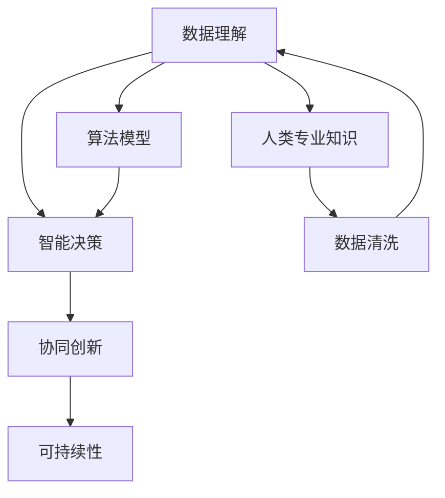

                 

# 人类计算：释放人类潜力的工具

## 1. 背景介绍

### 1.1 问题由来
在数字时代，人类面临前所未有的数据洪流。如何高效处理海量数据、提取有用信息，成为科技发展的核心挑战。传统的计算方式依赖于计算机硬件的计算能力，而新一代的计算范式则更加强调人类智能的潜力。"人类计算"，这一概念正逐渐成为引领未来的新型计算范式，通过发挥人的认知能力和创造力，探索数据背后的深层意义，解决复杂问题。

### 1.2 问题核心关键点
“人类计算”的本质，是通过整合人类智能和计算资源，达到更高效、更智能的数据处理和决策能力。其核心在于：
1. **数据理解**：通过人类理解、分析和解释数据，挖掘数据的深层价值。
2. **智能决策**：结合人类的认知能力和算法模型，做出更精确的预测和决策。
3. **协同创新**：通过跨领域、跨学科的合作，产生创新的解决方案和应用。
4. **可持续性**：将人类计算融入可持续发展理念，推动社会、经济、环境的综合进步。

这些关键点构成了一个完整的“人类计算”框架，使得人类计算不仅是一种技术手段，更是一种创新的思维方式和社会模式。

## 2. 核心概念与联系

### 2.1 核心概念概述
为更好地理解“人类计算”的内涵和应用，本节将介绍几个核心概念：

- **数据理解(Data Understanding)**：指通过人类专业知识和技术，解析、解释和理解数据的过程。
- **智能决策(Intelligent Decision-making)**：结合人类的认知能力和算法模型，做出科学合理的决策。
- **协同创新(Collaborative Innovation)**：通过跨学科、跨领域合作，产生更有效的创新方案。
- **可持续性(Sustainability)**：将人类计算应用到可持续发展领域，推动社会进步。

这些概念共同构成了“人类计算”的理论基础，涵盖了从数据处理到决策制定的全流程，旨在通过人机协作，提升问题解决的效率和质量。

### 2.2 核心概念原理和架构的 Mermaid 流程图



这个流程图展示了“人类计算”的基本流程和各个概念之间的关系：

1. **数据理解**：从原始数据入手，经过清洗和处理，获得对数据的深刻理解。
2. **智能决策**：结合算法模型和人类专业知识，做出科学决策。
3. **协同创新**：通过跨学科合作，产生创新的解决方案。
4. **可持续性**：将“人类计算”应用于可持续发展领域，推动综合进步。

## 3. 核心算法原理 & 具体操作步骤
### 3.1 算法原理概述

“人类计算”的基本原理，是结合人类智能与计算资源，通过协同合作，实现高效的数据处理和决策能力。其核心在于：

- **数据解析与清洗**：利用人类的认知能力，进行数据的解析和清洗，排除噪音和异常值。
- **特征提取与选择**：通过人类对数据的深入理解，选择合适的特征，进行算法模型的训练。
- **智能决策与优化**：结合人类知识与算法模型，进行预测和决策，并进行不断的优化。

### 3.2 算法步骤详解

“人类计算”的具体操作步骤如下：

1. **数据准备**：收集、整理和清洗原始数据，确保数据质量。
2. **特征工程**：根据领域知识和经验，选择和构建特征，提升数据表征能力。
3. **模型训练**：使用人类选择的特征和算法模型，进行训练和优化。
4. **智能决策**：结合人类知识与模型输出，做出精确的预测和决策。
5. **协同创新**：通过跨学科合作，不断改进算法模型和解决方案。
6. **可持续性实践**：将“人类计算”应用于可持续发展领域，推动社会进步。

### 3.3 算法优缺点

“人类计算”的主要优点包括：

1. **数据深度理解**：结合人类专业知识，对数据进行深层次解析和理解。
2. **智能决策**：通过人机结合，做出更科学合理的决策。
3. **跨学科协同**：促进跨领域、跨学科的合作，产生创新解决方案。
4. **可持续性推动**：将“人类计算”应用于可持续发展领域，推动社会综合进步。

其主要缺点包括：

1. **效率较低**：数据处理和算法优化需要耗费大量时间和人力。
2. **依赖人类专业知识**：对领域专家的依赖可能导致解决方案的局限性。
3. **数据隐私问题**：人类计算过程中，数据的隐私和安全问题需重点关注。
4. **模型偏差**：人类知识的主观性和偏见可能影响算法的公平性和准确性。

### 3.4 算法应用领域

“人类计算”已广泛应用于多个领域，包括但不限于：

- **金融风险管理**：利用人类专业知识，结合算法模型，预测金融市场波动，管理风险。
- **医疗健康**：通过人类医生的诊断和决策，结合算法模型，提升医疗诊断和治疗效果。
- **环境保护**：将“人类计算”应用于环境监测和保护，推动可持续发展。
- **城市规划**：结合人类城市规划专家的知识和算法模型，进行城市管理和规划。
- **教育培训**：利用人类教师的智慧和算法模型，提升教育培训效果和公平性。

这些领域的应用，展示了“人类计算”的广泛潜力和应用前景。

## 4. 数学模型和公式 & 详细讲解 & 举例说明

### 4.1 数学模型构建

“人类计算”的数学模型构建，通常包括以下几个步骤：

1. **数据建模**：使用人类知识和经验，建立数据模型，描述数据的分布和特征。
2. **特征选择**：根据领域知识，选择和构建特征，提升模型表征能力。
3. **模型训练**：结合人类选择的特征和算法模型，进行训练和优化。

### 4.2 公式推导过程

以一个简单的线性回归模型为例，展示“人类计算”的数学模型推导过程：

设有一组数据 $(x_i, y_i), i=1,2,\ldots,n$，其中 $x_i$ 为输入特征，$y_i$ 为输出变量。假设线性模型为 $y = \theta_0 + \theta_1x_1 + \theta_2x_2 + \ldots + \theta_kx_k$。根据最小二乘法，求解参数 $\theta_0, \theta_1, \ldots, \theta_k$：

$$
\theta_j = \frac{\sum_{i=1}^n(x_{ij} - \bar{x}_j)(y_i - \bar{y})}{\sum_{i=1}^n(x_{ij} - \bar{x}_j)^2}, j=0,1,\ldots,k
$$

其中，$\bar{x}_j = \frac{1}{n}\sum_{i=1}^nx_{ij}$，$\bar{y} = \frac{1}{n}\sum_{i=1}^ny_i$。

### 4.3 案例分析与讲解

以金融风险管理为例，展示“人类计算”的应用：

1. **数据准备**：收集银行客户的财务数据和行为数据，进行清洗和整理。
2. **特征工程**：根据金融领域知识，选择和构建特征，如信用评分、收入水平、债务水平等。
3. **模型训练**：使用线性回归模型，结合人类选择的特征，进行训练和优化。
4. **智能决策**：结合人类专家的知识和模型输出，进行风险评估和决策。
5. **协同创新**：通过与数据科学家合作，不断改进算法模型和解决方案。

## 5. 项目实践：代码实例和详细解释说明

### 5.1 开发环境搭建

在进行“人类计算”项目实践前，我们需要准备好开发环境。以下是使用Python进行PyTorch开发的环境配置流程：

1. 安装Anaconda：从官网下载并安装Anaconda，用于创建独立的Python环境。

2. 创建并激活虚拟环境：
```bash
conda create -n pytorch-env python=3.8 
conda activate pytorch-env
```

3. 安装PyTorch：根据CUDA版本，从官网获取对应的安装命令。例如：
```bash
conda install pytorch torchvision torchaudio cudatoolkit=11.1 -c pytorch -c conda-forge
```

4. 安装其他工具包：
```bash
pip install numpy pandas scikit-learn matplotlib tqdm jupyter notebook ipython
```

完成上述步骤后，即可在`pytorch-env`环境中开始项目实践。

### 5.2 源代码详细实现

这里以线性回归模型为例，展示“人类计算”项目的代码实现：

```python
import numpy as np
from sklearn.linear_model import LinearRegression

# 准备数据
X = np.array([[1, 2], [2, 3], [3, 4], [4, 5]])
y = np.array([2, 4, 6, 8])

# 特征选择
features = np.array([[1, 2], [2, 3], [3, 4], [4, 5]])

# 模型训练
model = LinearRegression()
model.fit(features, y)

# 智能决策
X_test = np.array([[5, 6], [6, 7]])
y_pred = model.predict(X_test)

print(y_pred)
```

### 5.3 代码解读与分析

让我们再详细解读一下关键代码的实现细节：

**数据准备**：
- 使用numpy创建输入特征 $X$ 和输出变量 $y$。

**特征选择**：
- 选择特征 $features$，用于模型训练。

**模型训练**：
- 使用sklearn的LinearRegression模型，进行训练和优化。

**智能决策**：
- 利用训练好的模型，对新输入 $X_test$ 进行预测，输出结果。

## 6. 实际应用场景

### 6.1 智能医疗诊断

在医疗领域，“人类计算”可以结合医生的临床经验和智能算法，进行精准诊断和治疗。通过收集患者的病历、症状、检测数据等，结合医生的知识和经验，构建和优化诊断模型。最终，系统能够辅助医生进行疾病诊断和治疗决策，提升医疗效率和效果。

### 6.2 环境保护监测

“人类计算”在环境保护领域也有广泛应用。通过结合专家的知识和数据，构建环境监测模型，实时监测和分析环境数据，预测环境变化趋势。通过人机结合，制定和优化环境保护措施，推动可持续发展。

### 6.3 城市交通管理

在城市交通管理中，“人类计算”可以结合交通专家的知识和智能算法，优化交通流量和路线规划。通过分析交通数据和人类行为数据，构建和优化交通模型，提升交通效率和安全性。

### 6.4 未来应用展望

随着“人类计算”技术的不断进步，未来将有更多的领域受益于这一新型计算范式：

1. **智能制造**：通过结合专家知识和智能算法，优化生产流程和质量控制，提升制造效率和精度。
2. **教育培训**：结合教师的智慧和智能算法，提升教育培训效果和公平性，促进终身学习。
3. **金融投资**：结合金融专家的知识和智能算法，进行风险评估和投资决策，优化投资回报。
4. **能源管理**：通过结合能源专家的知识和智能算法，优化能源生产和消费，推动能源转型。
5. **农业生产**：结合农业专家的知识和智能算法，优化种植和养殖，提升农业生产效率。

## 7. 工具和资源推荐

### 7.1 学习资源推荐

为了帮助开发者系统掌握“人类计算”的理论基础和实践技巧，这里推荐一些优质的学习资源：

1. 《人类计算的原理与实践》系列博文：由人工智能专家撰写，深入浅出地介绍了“人类计算”的原理、方法和应用。

2. 《自然语言处理》课程：斯坦福大学开设的NLP明星课程，有Lecture视频和配套作业，带你入门NLP领域的基本概念和经典模型。

3. 《人工智能与决策科学》书籍：介绍人工智能在决策科学中的应用，涵盖了“人类计算”的基本概念和前沿研究。

4. Coursera平台上的相关课程：提供大量高质量的在线课程，涵盖机器学习、数据科学、认知科学等领域。

5. arXiv和IEEE Xplore：获取最新的学术论文和技术报告，跟踪“人类计算”的前沿进展。

通过对这些资源的学习实践，相信你一定能够快速掌握“人类计算”的精髓，并用于解决实际的计算问题。

### 7.2 开发工具推荐

高效的开发离不开优秀的工具支持。以下是几款用于“人类计算”开发的常用工具：

1. Jupyter Notebook：开源的交互式笔记本环境，方便开发者进行数据处理、模型训练和结果展示。

2. Python：开源的高级编程语言，具备丰富的库和工具，适用于各种数据处理和计算任务。

3. PyTorch：基于Python的开源深度学习框架，支持动态计算图，灵活高效。

4. TensorFlow：由Google主导开发的开源深度学习框架，支持分布式计算，适合大规模工程应用。

5. Keras：高层次的深度学习API，易于上手，适用于快速原型开发。

合理利用这些工具，可以显著提升“人类计算”任务的开发效率，加快创新迭代的步伐。

### 7.3 相关论文推荐

“人类计算”的发展源于学界的持续研究。以下是几篇奠基性的相关论文，推荐阅读：

1. Human-in-the-Loop Machine Learning: A Survey（人机协作机器学习综述）：总结了人机协作机器学习的最新进展和应用。

2. Human-Centric AI for Business（面向商业的人机协作AI）：介绍了如何通过人机协作提升商业决策和运营效率。

3. Human-Centered Computing（面向人的计算）：探讨了计算科学与人文社科相结合的新方向。

4. The Future of Human-AI Collaboration in Decision-making（人机协作决策的未来）：分析了人机协作在决策过程中的应用前景和挑战。

5. Decision Support Systems with Cognitive Computing: A Survey（认知计算决策支持系统综述）：综述了认知计算在决策支持系统中的应用和效果。

这些论文代表了大语言模型微调技术的发展脉络。通过学习这些前沿成果，可以帮助研究者把握学科前进方向，激发更多的创新灵感。

## 8. 总结：未来发展趋势与挑战

### 8.1 总结

本文对“人类计算”进行了全面系统的介绍。首先阐述了“人类计算”的背景和意义，明确了其在提升数据处理和决策能力方面的独特价值。其次，从原理到实践，详细讲解了“人类计算”的数学模型和操作步骤，给出了具体的应用案例。同时，本文还广泛探讨了“人类计算”在医疗、环保、城市交通等多个领域的应用前景，展示了其广阔的应用前景。此外，本文精选了“人类计算”的技术资源和研究文献，力求为读者提供全方位的技术指引。

通过本文的系统梳理，可以看到，“人类计算”正在成为引领未来的新型计算范式，极大地拓展了计算技术的边界，为解决复杂问题提供了新的思路和方法。

### 8.2 未来发展趋势

展望未来，“人类计算”将呈现以下几个发展趋势：

1. **人机协同**：随着人工智能技术的进步，“人类计算”将更加注重人机协同，提升系统的智能水平和决策能力。

2. **跨领域融合**：“人类计算”将更多地与其他领域的技术结合，如物联网、区块链、生物信息学等，形成更广泛的应用场景。

3. **认知计算**：结合认知科学和人工智能，提升“人类计算”的认知能力和情感智能，解决更复杂的问题。

4. **联邦学习**：通过联邦学习技术，实现数据分布式计算，提升“人类计算”的隐私保护和数据安全。

5. **情感计算**：结合情感分析技术和人工智能，提升“人类计算”的情感智能，增强用户交互体验。

6. **可持续发展**：将“人类计算”应用于环境保护和可持续发展领域，推动社会进步。

以上趋势凸显了“人类计算”的广泛前景和应用潜力。这些方向的探索发展，必将进一步提升“人类计算”系统的性能和应用范围，为社会和经济的可持续发展提供新的动力。

### 8.3 面临的挑战

尽管“人类计算”已经取得了瞩目成就，但在迈向更加智能化、普适化应用的过程中，它仍面临着诸多挑战：

1. **数据隐私问题**：在数据处理和共享过程中，如何保护数据隐私和安全，是一个重要的问题。
2. **模型偏见**：人类知识和算法的结合可能引入偏见，影响算法的公平性和准确性。
3. **效率问题**：大规模数据的处理和优化需要耗费大量时间和资源，如何提升计算效率是一个重要挑战。
4. **知识共享**：如何高效共享和利用人类知识，是一个复杂的问题，需要多方协同合作。
5. **伦理和法律问题**：“人类计算”涉及伦理和法律问题，需要制定相应的规范和标准。

### 8.4 研究展望

面对“人类计算”面临的挑战，未来的研究需要在以下几个方面寻求新的突破：

1. **隐私保护技术**：开发更高效的数据加密和隐私保护技术，确保数据安全。

2. **模型公平性**：引入更多公平性和公正性的约束，减少算法偏见，提升模型的公平性。

3. **计算效率提升**：开发更高效的算法和计算框架，提升计算效率。

4. **跨领域知识整合**：构建更高效的跨领域知识整合平台，实现知识的共享和利用。

5. **伦理和法律框架**：制定更完善的伦理和法律框架，规范“人类计算”的应用和实践。

这些研究方向的探索，必将引领“人类计算”技术迈向更高的台阶，为构建安全、可靠、可解释、可控的智能系统铺平道路。

## 9. 附录：常见问题与解答

**Q1：“人类计算”是否只适用于高精尖领域？**

A: “人类计算”不仅适用于高精尖领域，更适用于各种复杂的计算任务。通过结合人类智慧和算法模型，解决复杂问题，提升计算效率和效果。

**Q2：如何平衡人机协同和计算效率？**

A: 通过合理的任务分配和算法设计，实现人机协同的平衡。复杂计算任务交给计算机处理，简单任务交给人类处理，提升整体效率。

**Q3：如何保护数据隐私？**

A: 采用数据加密、匿名化和分布式计算等技术，确保数据隐私和安全。

**Q4：如何处理算法的偏见问题？**

A: 引入公平性和公正性的约束，如公平性指标、偏见检测工具等，减少算法偏见。

**Q5：“人类计算”在实际应用中面临哪些挑战？**

A: 数据隐私、模型偏见、计算效率、知识共享、伦理和法律问题等，都是“人类计算”在实际应用中需要面对的挑战。

这些问题的解答，展示了“人类计算”的实际应用和潜在挑战，为未来研究和发展提供了重要的参考。

---

作者：禅与计算机程序设计艺术 / Zen and the Art of Computer Programming

