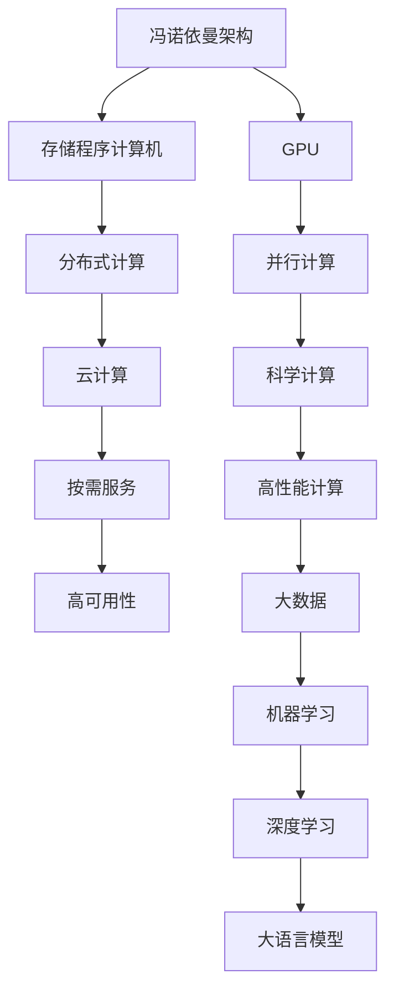

                 

# 从CPU到LLM：计算架构的演进历程

计算架构，或者说计算机硬件与软件协同工作的方式，一直在不断演进，从早期的CPU架构到如今的大语言模型(Large Language Model, LLM)，这一变化深刻地影响了人工智能的发展轨迹。本文将从计算架构的演进历程出发，探讨其背后的科学原理和工程实践，以及这些变化如何催生了大语言模型这一划时代的产物。

## 1. 背景介绍

### 1.1 计算架构的起点：冯诺依曼架构
早在1945年，冯诺依曼提出了现代计算机的核心架构——冯诺依曼架构，也称为“存储程序计算机”。这一架构将程序存储在内存中，指令和数据共享同一个总线系统，CPU从内存中读取指令并执行。这一架构一直沿用至今，成为计算世界的基石。

### 1.2 硬件加速的崛起：GPU的兴起
随着图形处理器的出现，计算机架构进入了一个新的时代。GPU能够并行处理大量的计算任务，特别适合于图形渲染和科学计算。1985年，图形芯片公司NVIDIA发布了一款基于大规模并行处理设计的图形芯片：NV1。这款芯片大幅提升了图像处理速度，开启了硬件加速的革命。

## 2. 核心概念与联系

### 2.1 核心概念概述
要理解计算架构的演进，我们首先需要了解一些核心概念：

- **冯诺依曼架构**：将程序和数据分开存储，通过执行指令来处理数据，典型的硬件结构包括CPU、内存和IO设备。
- **GPU**：专门用于图形处理和科学计算的高并行化处理器，拥有数千个计算核心，能够高效处理大规模并行任务。
- **分布式计算**：通过多个计算节点协同工作，实现更大规模、更高效率的计算任务，如云计算、大数据等。
- **云计算**：将计算资源通过互联网提供给用户，用户按需使用，可大大降低计算成本。
- **大语言模型(LLM)**：基于Transformer架构和自监督学习的深度学习模型，能够理解和生成自然语言，广泛应用于NLP、计算机视觉、语音识别等领域。

### 2.2 核心概念原理和架构的 Mermaid 流程图


这个流程图展示了计算架构演进的关键节点和它们之间的关系：

1. **冯诺依曼架构**作为起点，奠定了现代计算机的基础。
2. **GPU**的出现推动了并行计算的发展，特别在图形处理和科学计算领域。
3. **分布式计算**和**云计算**使计算能力得到极大扩展，提升了计算资源的灵活性和利用效率。
4. **高性能计算**和**大数据**处理的需求催生了深度学习技术的崛起。
5. **机器学习和深度学习**为复杂的自然语言处理任务提供了新的方法。
6. **大语言模型**的诞生，标志着一个全新的计算时代，推动了人工智能的发展。

## 3. 核心算法原理 & 具体操作步骤

### 3.1 算法原理概述
大语言模型(LLM)是基于深度学习技术，通过自监督学习进行预训练，然后通过微调适应特定任务的模型。它的核心原理包括：

- **自监督学习**：使用未标注的数据进行训练，学习通用的语言表示。
- **Transformer架构**：一种专门用于处理序列数据的神经网络架构，能够高效并行处理输入和输出序列。
- **注意力机制**：一种重要的神经网络组件，用于捕捉序列中的重要特征，提升模型的表达能力。
- **微调**：在预训练模型的基础上，通过下游任务的标注数据进行有监督学习，适应特定任务需求。

### 3.2 算法步骤详解
大语言模型的训练通常包括以下几个步骤：

**Step 1: 数据准备**
- 收集大规模无标签文本数据，作为预训练语料。
- 将语料划分为训练集、验证集和测试集。

**Step 2: 模型预训练**
- 使用自监督学习任务（如语言模型、掩码语言模型）训练通用语言模型。
- 通过Transformer架构和多层注意力机制，学习复杂的语言表征。

**Step 3: 模型微调**
- 收集下游任务的标注数据，如问答、分类、生成等。
- 使用微调技术，将预训练模型适应特定任务。
- 通过优化算法（如Adam、SGD等）最小化损失函数，更新模型参数。

**Step 4: 模型评估**
- 在验证集上评估模型性能，调整超参数。
- 在测试集上最终评估模型效果，输出最终结果。

### 3.3 算法优缺点
**优点**：
- **通用性**：预训练模型能够适应多种下游任务，提升模型泛化能力。
- **高效性**：相较于从头训练，微调所需的数据和计算资源较少。
- **稳定性**：微调模型能够稳定处理各类输入，减少过拟合风险。

**缺点**：
- **依赖标注数据**：微调效果高度依赖标注数据的质量和数量。
- **模型复杂性**：大模型参数量巨大，推理和存储成本较高。
- **泛化能力**：在面对全新领域时，微调模型可能表现较差。

### 3.4 算法应用领域
大语言模型已经在诸多领域展现出其强大的能力，包括但不限于：

- **自然语言处理(NLP)**：文本分类、情感分析、机器翻译、对话系统等。
- **计算机视觉**：图像识别、物体检测、图像生成等。
- **语音识别**：语音转文本、文本转语音等。
- **推荐系统**：个性化推荐、广告推荐等。

## 4. 数学模型和公式 & 详细讲解

### 4.1 数学模型构建
大语言模型的核心数学模型为Transformer。Transformer模型包括两个主要组件：编码器和解码器。编码器将输入序列转化为高维向量表示，解码器根据目标序列生成输出序列。数学上，Transformer模型可以表示为：

$$
Y = T_{dec}(T_{enc}(X) + QKV)
$$

其中，$X$ 为输入序列，$Y$ 为输出序列，$T_{enc}$ 和 $T_{dec}$ 分别为编码器和解码器，$QKV$ 为多头自注意力机制的输出。

### 4.2 公式推导过程
Transformer的核心组成部分是多头自注意力机制，其数学表达为：

$$
Attention(Q, K, V) = \text{softmax}(\frac{QK^T}{\sqrt{d_k}})V
$$

其中，$Q$ 为查询向量，$K$ 为键向量，$V$ 为值向量，$d_k$ 为注意力向量的维度。该机制通过计算输入序列中的每个元素与每个位置的注意力权重，得到每个位置的重要性得分，然后将重要性得分与值向量进行加权平均，得到最终的输出。

### 4.3 案例分析与讲解
以BERT模型为例，BERT是一种基于Transformer的预训练语言模型，使用两个预训练任务：掩码语言模型和下一句预测。掩码语言模型的数学表达为：

$$
L_{mask} = -\frac{1}{2L}\sum_{i=1}^L[\text{log}P(w_i|\bar{w_i}) + \text{log}(1-P(w_i|\bar{w_i}))]
$$

其中，$L$ 为序列长度，$\bar{w_i}$ 为掩码后的输入序列，$P(w_i|\bar{w_i})$ 为模型对输入序列的预测概率。

## 5. 项目实践：代码实例和详细解释说明

### 5.1 开发环境搭建

**Step 1: 安装依赖包**
- Python 3.x
- TensorFlow
- PyTorch
- Transformers

**Step 2: 准备数据集**
- 下载BERT预训练模型
- 收集下游任务的数据集，如SST-2情感分类数据集

**Step 3: 编写代码**
- 导入BERT模型
- 定义模型结构
- 加载数据集
- 训练模型
- 评估模型

### 5.2 源代码详细实现

```python
import tensorflow as tf
import tensorflow_datasets as tfds
import transformers
from transformers import BertTokenizer, BertForSequenceClassification

# 加载BERT预训练模型和分词器
tokenizer = BertTokenizer.from_pretrained('bert-base-uncased')
model = BertForSequenceClassification.from_pretrained('bert-base-uncased', num_labels=2)

# 加载数据集
train_dataset, test_dataset = tfds.load('imdb_reviews', split=['train', 'test'], shuffle_files=True, as_supervised=True)

# 定义模型结构
def model_fn(features, labels):
    input_ids = tf.expand_dims(features['input_ids'], 0)
    attention_mask = tf.expand_dims(features['attention_mask'], 0)
    outputs = model(input_ids, attention_mask=attention_mask, labels=labels)
    return outputs

# 训练模型
model.compile(optimizer=tf.keras.optimizers.Adam(learning_rate=3e-5),
              loss=tf.keras.losses.SparseCategoricalCrossentropy(from_logits=True),
              metrics=[tf.keras.metrics.SparseCategoricalAccuracy()])

model.fit(train_dataset, epochs=3)

# 评估模型
test_loss, test_acc = model.evaluate(test_dataset)
print('Test accuracy:', test_acc)
```

### 5.3 代码解读与分析
在代码中，我们首先导入了必要的库，然后加载了BERT预训练模型和分词器。接着定义了一个自定义的模型结构函数`model_fn`，用于将输入特征转换为模型输入。在模型训练阶段，我们使用了Adam优化器和稀疏分类交叉熵损失函数，并在3个epoch内进行了训练。最后，我们评估了模型的性能，并输出了测试准确率。

## 6. 实际应用场景

### 6.1 自然语言处理
BERT模型已经广泛应用于自然语言处理领域，包括情感分析、问答系统、文本分类等。例如，可以使用BERT模型对产品评论进行情感分析，判断用户对产品的态度是积极还是消极。

### 6.2 计算机视觉
Transformer架构同样适用于计算机视觉任务，如目标检测、图像分类等。通过将图像特征序列化，然后应用Transformer进行编码和解码，可以得到更加精确的视觉表示。

### 6.3 语音识别
使用大语言模型进行语音识别，可以提升系统的准确率和鲁棒性。将语音信号转化为文本，然后通过BERT等模型进行分类或生成，可以得到更加自然的语音输出。

### 6.4 未来应用展望

未来的计算架构将进一步向深度学习和分布式计算的方向演进。预计会有更多基于Transformer的预训练模型被开发，并广泛应用于各个领域。同时，计算架构也将变得更加灵活，能够适应更加复杂和多样化的计算需求。

## 7. 工具和资源推荐

### 7.1 学习资源推荐
- Coursera上的《Deep Learning Specialization》课程
- CS224N《自然语言处理与深度学习》课程
- 《Deep Learning》一书，由Ian Goodfellow等著

### 7.2 开发工具推荐
- PyTorch：适用于深度学习模型开发，具有强大的动态图和静态图功能。
- TensorFlow：广泛应用于生产环境，支持大规模分布式训练。
- Transformers：提供预训练模型和微调API，简化模型开发流程。

### 7.3 相关论文推荐
- Attention is All You Need
- BERT: Pre-training of Deep Bidirectional Transformers for Language Understanding
- Parameter-Efficient Transfer Learning for NLP

## 8. 总结：未来发展趋势与挑战

### 8.1 研究成果总结
本文详细探讨了计算架构从CPU到LLM的演进历程，分析了其背后的科学原理和工程实践。通过对大语言模型核心原理的阐述，以及实际应用场景的展示，展示了计算架构演进的巨大潜力。

### 8.2 未来发展趋势
未来计算架构的发展趋势可能包括以下几个方向：
- **硬件加速**：GPU、TPU等加速设备将进一步提升计算效率。
- **分布式计算**：云计算和边缘计算将进一步扩展计算资源。
- **量子计算**：有望在处理大规模数据和复杂问题上取得突破。
- **异构计算**：结合CPU和GPU的优点，提升计算效能。

### 8.3 面临的挑战
计算架构的演进也面临诸多挑战：
- **能耗问题**：大规模计算带来了能源消耗的问题，如何降低能耗是一个重要的研究方向。
- **数据隐私**：大规模数据处理带来了数据隐私和安全的问题，如何在保护隐私的前提下进行高效计算。
- **计算架构的扩展性**：如何设计更加灵活和可扩展的计算架构，以适应未来的计算需求。

### 8.4 研究展望
未来计算架构的研究方向可能包括：
- **量子计算和光子计算**：探索新型的计算模型，突破现有计算极限。
- **混合计算架构**：结合多种计算技术，提升计算效能和灵活性。
- **智能计算架构**：通过引入AI技术，提升计算架构的智能性和自适应性。

## 9. 附录：常见问题与解答

**Q1: 大语言模型和传统机器学习模型有何不同？**

A: 大语言模型基于深度学习技术，使用自监督学习进行预训练，通过微调适应特定任务。相较于传统机器学习模型，大语言模型可以自动学习语言结构和语义，适应性更强。

**Q2: 大语言模型是否适用于所有计算任务？**

A: 大语言模型适用于自然语言处理任务，如图像识别、语音识别等任务目前尚不适用。但未来随着技术进步，可能会有更多基于Transformer的模型应用于其他计算领域。

**Q3: 大语言模型训练需要多少计算资源？**

A: 大语言模型训练需要大规模的计算资源，包括高性能CPU、GPU、TPU等加速设备。同时需要大量标注数据进行微调，成本较高。

**Q4: 如何优化大语言模型的推理速度？**

A: 可以通过模型裁剪、量化加速、推理优化等技术提升大语言模型的推理速度。同时也可以采用模型并行、分布式计算等手段，进一步提升计算效能。

**Q5: 大语言模型是否会导致数据隐私问题？**

A: 大语言模型训练和推理需要大量数据，如果这些数据包含敏感信息，可能带来隐私风险。需要采取数据脱敏、隐私保护等措施，确保数据安全和隐私保护。

总之，从CPU到LLM的计算架构演进，是一个不断探索和创新的过程。大语言模型的崛起，标志着计算架构进入了一个全新的时代，为人工智能的应用提供了强大的引擎。未来的计算架构将继续演进，推动人类社会的进步和发展。

