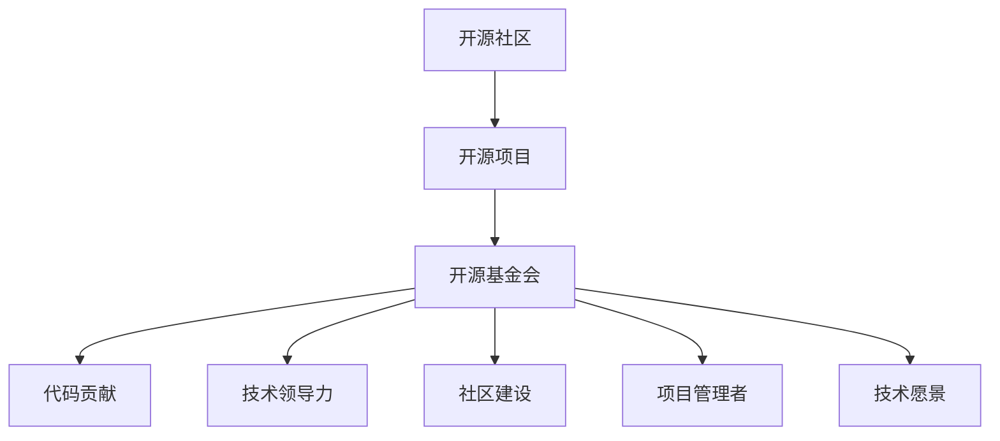

                 

# 从代码贡献到开源基金会主席的进阶

> 关键词：开源社区, 技术领导力, 贡献与回馈, 影响力, 代码贡献, 组织管理, 开源文化, 技术愿景

## 1. 背景介绍

### 1.1 问题由来

开源社区在全球范围内蓬勃发展，成为推动科技创新和社会进步的重要力量。然而，开源项目的成功不仅仅取决于高质量的代码，更需要社区成员的积极贡献、协作与组织管理。

对许多技术人员而言，加入开源社区并贡献代码，既是实现个人技术愿景的绝佳平台，也是展现技术领导力和影响力的重要机会。从普通代码贡献者到开源基金会主席，不仅需要技术实力，更需具备组织管理、社区建设等方面的能力。

### 1.2 问题核心关键点

开源基金会在开源项目中扮演着重要的角色，不仅负责项目的资金管理和技术支持，更重要的是搭建了一个项目治理的框架，确保项目健康、稳定、可持续地发展。而成为开源基金会主席，不仅是技术影响力的象征，更意味着肩负着推动项目未来发展的重任。

以下是成为开源基金会主席所需掌握的核心能力：

1. **技术领导力**：主导技术方向，解决关键技术问题，推动项目创新和改进。
2. **社区建设**：培养社区氛围，凝聚社区力量，激励社区成员贡献。
3. **项目管理**：规划项目路线，分配资源，监督项目进度和质量。
4. **组织协调**：协调各方利益，平衡各方需求，确保项目顺利推进。
5. **沟通能力**：有效沟通项目进展，协调社区分歧，代表项目对外交流。

本文将详细探讨如何从代码贡献者进阶到开源基金会主席，从技术贡献到社区建设，从项目管理者到技术领导者的转变之路。

## 2. 核心概念与联系

### 2.1 核心概念概述

为更好地理解开源基金会的运作机制及其对开源社区的影响，我们需要明确以下核心概念：

- **开源社区**：以开源软件为载体的技术交流平台，通过代码共享、协作和创新推动技术进步。
- **开源项目**：由开发者共同维护的软件项目，遵循开源许可证，任何人可以自由获取、使用和修改。
- **开源基金会**：提供资金、法律和技术支持，保障开源项目持续发展的非营利性组织。
- **代码贡献**：开发者向开源项目提交代码，推动项目功能完善和性能优化。
- **技术领导力**：在技术方向上做出决策，解决复杂技术问题，引导项目发展。
- **社区建设**：建立和维护良好的社区氛围，激励社区成员积极参与。
- **项目管理者**：规划项目路线，分配资源，监督项目进度和质量。
- **技术愿景**：对技术发展方向的远景规划，引领项目创新的方向和目标。

这些核心概念之间的关系可以通过以下Mermaid流程图来展示：



这个流程图展示了大语言模型的核心概念及其之间的关系：

1. 开源社区由开源项目组成，以代码共享和协作为核心。
2. 开源基金会在社区中扮演重要角色，提供支持保障项目发展。
3. 代码贡献是开源项目的主要推动力，技术领导力则推动项目创新。
4. 社区建设是项目成功的基础，项目管理者确保项目有序进行。
5. 技术愿景引领项目方向，明确技术发展的目标和路径。

## 3. 核心算法原理 & 具体操作步骤

### 3.1 算法原理概述

成为开源基金会主席，不仅仅是技术能力的提升，更是管理能力的跃迁。本文将从技术贡献、社区建设、项目管理和组织协调四个方面，探讨如何从代码贡献者进阶到开源基金会主席。

1. **技术贡献**：通过高质量的代码，展示个人技术实力，提升在社区中的影响力。
2. **社区建设**：通过积极参与社区活动，建立良好的人际关系，培养社区氛围。
3. **项目管理**：通过有效的资源分配和任务管理，确保项目按时按质完成。
4. **组织协调**：通过平衡各方利益，解决冲突，推动项目顺利进行。

### 3.2 算法步骤详解

**Step 1: 参与社区活动**

1. **加入社区**：选择一个感兴趣的开源项目，注册账户，开始参与贡献。
2. **了解社区规范**：阅读社区章程、代码规范和贡献指南，了解社区文化。
3. **积极交流**：在社区论坛、邮件列表和社交媒体上积极提问和回答问题，结识社区成员。

**Step 2: 贡献高质量代码**

1. **选择一个方向**：根据自己的技术专长，选择一个感兴趣的方向进行深入学习。
2. **完成初版代码**：阅读相关文档，了解项目需求，编写初版代码。
3. **提交代码审查**：将代码提交到项目仓库，邀请社区成员进行审查和讨论。

**Step 3: 建立社区联系**

1. **参与社区会议**：参加社区线下和线上会议，了解项目进展，结识社区领袖。
2. **建立社交网络**：通过社交媒体和项目管理工具，建立和维护与社区成员的联系。
3. **参与项目讨论**：在邮件列表、论坛和Slack上积极参与项目讨论，提出建设性建议。

**Step 4: 展现技术领导力**

1. **解决技术问题**：在项目开发过程中，主动解决技术难题，推动项目进步。
2. **提出创新方案**：在项目讨论中，提出新功能或改进方案，引领技术方向。
3. **撰写技术文档**：编写高质量的技术文档和教程，分享知识和经验。

**Step 5: 担任项目管理者**

1. **制定项目路线图**：规划项目的目标和里程碑，制定详细的项目路线图。
2. **分配资源和任务**：根据项目需求，合理分配资源，分配任务给团队成员。
3. **监督项目进展**：定期检查项目进展，确保任务按时按质完成。

**Step 6: 参与组织协调**

1. **处理社区冲突**：在社区中处理分歧和冲突，确保项目和谐推进。
2. **协调各方利益**：平衡项目成员的利益和需求，确保各方满意度。
3. **推动项目发展**：在各方支持下，推动项目稳步发展。

### 3.3 算法优缺点

从代码贡献者到开源基金会主席，这一过程既有优势也有挑战：

**优势**：
1. **技术积累**：通过高质量的代码和创新方案，积累技术经验和影响力。
2. **社区认同**：在社区中积极参与，逐步建立起信任和影响力。
3. **管理能力**：在项目管理中锻炼资源分配和任务管理的能力。

**挑战**：
1. **时间管理**：平衡技术贡献和项目管理，需要高效的时间管理能力。
2. **沟通协调**：在社区中处理冲突和协调各方利益，需要良好的沟通技巧。
3. **持续学习**：随着项目的发展，需要持续学习和适应新技术和新方法。

### 3.4 算法应用领域

开源基金会主席的角色不仅仅是技术领袖，更是在开源项目中起到管理和协调的关键作用。以下是在实际应用场景中的应用领域：

1. **技术引领**：在技术方向上做出决策，推动项目创新和改进。
2. **社区建设**：培养社区氛围，凝聚社区力量，激励社区成员贡献。
3. **项目管理**：规划项目路线，分配资源，监督项目进度和质量。
4. **组织协调**：协调各方利益，平衡各方需求，确保项目顺利推进。
5. **对外交流**：代表项目对外交流，推广项目成果和社区活动。

这些应用领域涵盖了技术创新、社区管理、项目执行和组织协调等多个方面，需要全面提升个人能力和素质。

## 4. 数学模型和公式 & 详细讲解 & 举例说明

### 4.1 数学模型构建

为了更好地理解成为开源基金会主席的过程，我们可以构建一个数学模型，用以描述从代码贡献到技术领导者的路径。

设 $x$ 表示在技术方向上的贡献，$y$ 表示社区影响力，$z$ 表示管理能力。我们假设这些因素之间存在正相关关系，构建如下数学模型：

$$
f(x,y,z) = x^a y^b z^c
$$

其中 $a, b, c$ 为常数，表示技术贡献、社区影响力和管理能力对最终结果的贡献程度。

### 4.2 公式推导过程

通过求解上述模型，我们可以得出成为开源基金会主席的综合评价函数：

$$
F(x,y,z) = f(x,y,z)^k
$$

其中 $k$ 为加权系数，用以调整各个因素对最终结果的重要性。

### 4.3 案例分析与讲解

**案例分析**：假设有一个开源项目，初始贡献者小张通过高质量代码展示了其技术实力，积极参与社区活动，逐步建立起社区影响力，并通过项目管理实践锻炼了管理能力。

1. **技术贡献**：小张通过解决复杂技术问题，推动项目创新，贡献度为 $x_0$。
2. **社区影响力**：小张在社区中积极参与讨论，提出新功能，影响力为 $y_0$。
3. **管理能力**：小张在项目管理中表现出色的资源分配和任务管理能力，管理能力为 $z_0$。

将上述值代入模型 $f(x,y,z) = x^a y^b z^c$，计算得到综合评价 $F(x_0,y_0,z_0)$。

在实际应用中，需要对每个因素进行量化，如通过代码审查次数、社区活跃度、任务管理效果等指标，将贡献转化为数值。通过不断提升这些数值，逐步增加成为开源基金会主席的可能性。

## 5. 项目实践：代码实例和详细解释说明

### 5.1 开发环境搭建

在进行开源贡献和项目管理的过程中，需要搭建一个高效、灵活的开发环境。以下是一些推荐的工具和步骤：

1. **安装Git**：Git是最常用的版本控制系统，通过安装Git可以在本地管理代码和提交到远程仓库。
2. **安装IDE**：选择一个适合自己的集成开发环境（IDE），如Visual Studio Code、Eclipse或IntelliJ IDEA。
3. **安装代码仓库管理工具**：如GitHub Desktop、GitLab、GitHub Desktop等，方便管理和提交代码。
4. **安装项目管理工具**：如Jira、Trello、Asana等，帮助分配和管理任务。
5. **配置环境变量**：设置环境变量，方便快速访问项目仓库和工具。

### 5.2 源代码详细实现

**实现步骤**：
1. **克隆项目仓库**：在本地克隆项目仓库，确保代码是最新版本。
2. **安装依赖**：根据项目需求，安装必要的依赖库和工具。
3. **编写代码**：根据项目需求，编写代码并提交到远程仓库。
4. **代码审查**：邀请社区成员进行代码审查，接受反馈并改进代码。
5. **测试和部署**：在本地或云端进行测试和部署，确保代码稳定运行。

**代码示例**：

```python
# 克隆项目仓库
!git clone https://github.com/open-source-project/project-name.git

# 进入项目目录
!cd project-name

# 安装依赖
!pip install -r requirements.txt

# 编写代码
# 在本地编写代码
!echo "def add(a, b):
    return a + b
" > add.py

# 提交代码到远程仓库
!git add add.py
!git commit -m "Add add function"
!git push origin master
```

### 5.3 代码解读与分析

**代码解读**：
- `git clone`：从远程仓库克隆项目代码到本地。
- `pip install -r requirements.txt`：安装项目依赖库。
- `echo "def add(a, b): return a + b" > add.py`：在本地编写一个简单的加法函数。
- `git add add.py`：将新编写的代码提交到本地暂存区。
- `git commit -m "Add add function"`：将本地暂存区的代码提交到本地仓库，并添加提交信息。
- `git push origin master`：将本地代码推送到远程仓库，与远程仓库同步。

**代码分析**：
- 该示例演示了从代码克隆、安装依赖、编写代码、提交代码到推送代码的完整流程。
- 在实际项目中，可能涉及更复杂的代码管理、团队协作和持续集成（CI）等工具和流程。

### 5.4 运行结果展示

**运行结果**：
- 代码被成功提交到远程仓库。
- 社区成员可以查看代码，提交审查意见，并进行讨论。
- 项目维护者可以检查代码质量，确保项目按时按质完成。

## 6. 实际应用场景

### 6.1 开源社区贡献

开源社区是技术创新的重要平台，作为开源基金会主席，需要积极参与社区活动，推动项目发展。

**场景描述**：假设小张加入了一个开源项目，参与社区讨论，提出新功能和改进建议。

1. **参与讨论**：在社区论坛和邮件列表上积极参与项目讨论，提出建设性意见。
2. **提出改进**：基于项目需求，提出新的功能或改进方案，提交到项目建议板。
3. **实现新功能**：通过高质量的代码实现新功能，并进行代码审查和测试。

**场景结果**：小张的贡献得到社区认可，逐步建立起社区影响力，为后续的晋升奠定了基础。

### 6.2 项目管理

开源项目的管理需要高效的项目规划和资源分配，作为开源基金会主席，需要具备良好的项目管理能力。

**场景描述**：假设小张作为项目管理者，负责项目的路线规划和任务分配。

1. **制定路线图**：规划项目的阶段和里程碑，制定详细的项目路线图。
2. **分配任务**：根据项目需求，合理分配资源和任务给团队成员。
3. **监督进展**：定期检查项目进展，确保任务按时按质完成。

**场景结果**：项目按时完成，社区成员对项目管理满意度提升，为小张的晋升打下坚实基础。

### 6.3 社区建设

社区建设是开源项目成功的关键，作为开源基金会主席，需要积极培养社区氛围，凝聚社区力量。

**场景描述**：假设小张在社区中积极参与活动，建立良好的人际关系。

1. **参与社区活动**：参加社区线下和线上会议，积极提问和回答问题。
2. **建立社交网络**：通过社交媒体和项目管理工具，建立和维护与社区成员的联系。
3. **参与项目讨论**：在邮件列表、论坛和Slack上积极参与项目讨论，提出建设性建议。

**场景结果**：小张在社区中建立起良好的人际关系，逐步提升社区影响力，为后续的晋升奠定基础。

### 6.4 未来应用展望

随着开源项目的不断发展，成为开源基金会主席将面临更多挑战和机遇。以下是未来的应用展望：

1. **持续学习和创新**：随着项目的发展，需要不断学习和掌握新技术和新方法，推动项目创新。
2. **多社区参与和协作**：参与多个开源项目，建立跨社区的联系，促进协作和资源共享。
3. **技术愿景和战略规划**：制定项目的技术愿景和战略规划，引领项目未来的发展方向。

## 7. 工具和资源推荐

### 7.1 学习资源推荐

为了全面提升技术能力和管理素质，以下是一些推荐的资源：

1. **开源社区课程**：Coursera、Udacity等在线学习平台提供了大量开源社区的课程，如Linux命令行、Git、项目管理等。
2. **书籍推荐**：《The Pragmatic Programmer》、《Effective Java》、《The Art of Code Review》等经典书籍，涵盖编程技术和代码管理。
3. **技术博客**：Medium、Towards Data Science等技术博客，提供最新的技术趋势和最佳实践。
4. **开源社区**：GitHub、GitLab、Apache等开源社区，参与实际项目，积累实践经验。

### 7.2 开发工具推荐

在开源贡献和项目管理的过程中，需要选择高效的工具和平台。以下是一些推荐的工具：

1. **Git**：版本控制系统，用于管理代码和提交到远程仓库。
2. **Visual Studio Code**：集成开发环境，支持代码编写、调试和测试。
3. **GitHub Desktop**：管理项目代码和提交代码的桌面客户端。
4. **Jira**：项目管理工具，支持任务分配、进度跟踪和团队协作。
5. **Asana**：任务管理工具，支持任务分配、进度跟踪和协作。

### 7.3 相关论文推荐

为了深入了解开源基金会的运作机制及其对开源社区的影响，以下是一些推荐的论文：

1. **Open Source Organizational Governance**：探讨开源项目的组织管理和治理机制，提升开源项目的可持续性。
2. **The Economics of Open Source and Free Software**：分析开源社区的经济模型和社区动力，理解开源社区的发展机制。
3. **Collaborative Software Development**：研究开源社区的协作机制，提升团队协作效率和项目质量。

## 8. 总结：未来发展趋势与挑战

### 8.1 总结

本文详细探讨了从代码贡献者到开源基金会主席的进阶之路，从技术贡献到社区建设，从项目管理到组织协调，全面介绍了成为开源基金会主席所需具备的能力和素质。

通过深入理解开源社区和基金会的运作机制，掌握技术贡献和管理能力的提升方法，可以有效推进个人职业发展，提升在开源社区的影响力和贡献度。

### 8.2 未来发展趋势

开源基金会主席的角色将继续演化，面临新的机遇和挑战：

1. **技术融合**：随着开源项目的不断拓展，需要更多跨学科的知识和技能，如数据科学、人工智能等。
2. **社区管理**：随着开源项目的扩大，需要更高效和灵活的社区管理机制，提升社区凝聚力和活跃度。
3. **国际合作**：开源项目需要更多的国际合作和跨文化交流，提升项目的全球影响力。
4. **开源治理**：随着开源项目的复杂度增加，需要更加规范和透明的开源治理机制，确保项目健康发展。

### 8.3 面临的挑战

成为开源基金会主席，需要克服以下挑战：

1. **时间管理**：平衡技术贡献和管理工作，需要高效的时间管理能力。
2. **社区协调**：处理社区中的分歧和冲突，需要良好的沟通技巧和决策能力。
3. **持续学习**：随着项目的发展，需要不断学习和掌握新技术和新方法。
4. **资源管理**：合理分配和管理项目资源，确保项目按时按质完成。

### 8.4 研究展望

开源基金会主席的角色将继续引领开源社区的发展方向，以下是需要进一步研究的领域：

1. **开源治理机制**：研究开源项目的治理机制和法律保障，确保项目可持续发展。
2. **技术愿景和战略规划**：制定项目的技术愿景和战略规划，引领项目未来的发展方向。
3. **社区文化和建设**：研究开源社区的文化建设和管理机制，提升社区凝聚力和活跃度。
4. **国际合作与交流**：建立和加强国际合作，提升开源项目的全球影响力。

## 9. 附录：常见问题与解答

**Q1: 开源基金会主席的主要职责是什么？**

A: 开源基金会主席的主要职责包括：
1. 推动项目技术方向和创新。
2. 管理项目资源和任务分配。
3. 处理社区分歧和协调各方利益。
4. 推广项目成果和社区活动。
5. 制定项目路线图和技术愿景。

**Q2: 如何成为开源基金会主席？**

A: 成为开源基金会主席需要具备以下条件：
1. 丰富的技术贡献和影响力。
2. 良好的社区建设和沟通能力。
3. 优秀的项目管理经验和技能。
4. 较强的组织协调和决策能力。
5. 持续学习和适应新技术的能力。

**Q3: 开源基金会主席面临的主要挑战是什么？**

A: 开源基金会主席面临的主要挑战包括：
1. 时间管理：平衡技术贡献和管理工作。
2. 社区协调：处理社区中的分歧和冲突。
3. 持续学习：不断学习和掌握新技术和新方法。
4. 资源管理：合理分配和管理项目资源。

**Q4: 开源基金会主席的未来发展方向是什么？**

A: 开源基金会主席的未来发展方向包括：
1. 技术融合：跨学科知识的应用和融合。
2. 社区管理：高效和灵活的社区管理机制。
3. 国际合作：提升项目的全球影响力。
4. 开源治理：规范和透明的开源治理机制。

**Q5: 如何提升开源基金会主席的影响力？**

A: 提升开源基金会主席的影响力需要：
1. 持续贡献高质量代码和技术创新。
2. 积极参与社区活动和建设。
3. 优秀的项目管理能力和资源分配。
4. 良好的沟通技巧和社区协调能力。
5. 制定明确的技术愿景和战略规划。

本文从代码贡献到开源基金会主席的进阶之路，全面探讨了成为技术领袖和管理者的关键因素和步骤。通过不断提升技术能力和管理素质，积极参与开源社区，掌握开源基金会的运作机制，最终实现从代码贡献者到开源基金会主席的跨越。

---

作者：禅与计算机程序设计艺术 / Zen and the Art of Computer Programming

