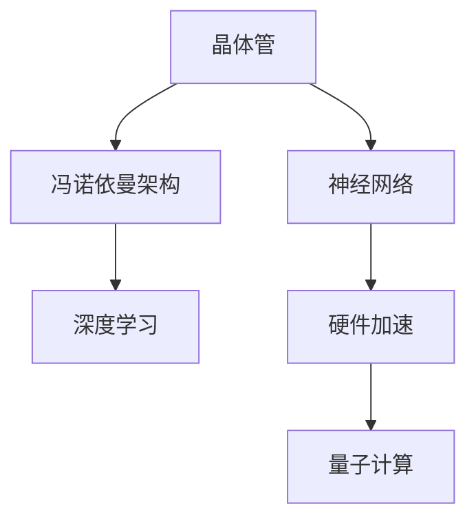
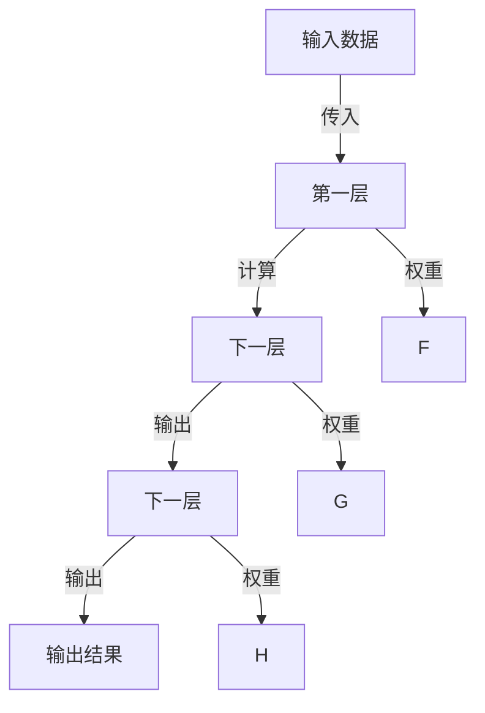

                 

# 从晶体管到神经网络：计算架构的进化

> 关键词：计算架构,神经网络,计算机体系结构,硬件加速,深度学习,芯片设计,量子计算

## 1. 背景介绍

### 1.1 问题由来
计算架构的演进是人类历史上的重大突破，它不仅推动了科技的发展，也深刻改变了社会的运作方式。从早期的机械式计算机到后来的电子计算机，再到如今的人工智能时代，计算架构一直伴随着技术的发展而不断革新。晶体管的发明，开启了计算机的现代纪元，但随着计算需求的不断增长，晶体管和传统冯诺依曼架构已经难以满足需求。神经网络作为新一代计算架构，其独特的并行计算能力，正引领着计算机体系结构进入新的纪元。

## 2. 核心概念与联系

### 2.1 核心概念概述

本节将介绍几个与计算架构和神经网络紧密相关的核心概念：

- **晶体管**：电子器件的一种，作为传统计算的核心元件，负责开关信号，是现代计算机的基础。
- **冯诺依曼架构**：现代计算机普遍采用的计算模型，具有清晰的指令和数据流，由CPU、内存和I/O设备组成。
- **神经网络**：受到人类神经系统启发的计算模型，由多个节点组成，通过大量并行计算实现数据处理。
- **深度学习**：基于神经网络的一种机器学习方法，通过多层网络进行特征提取和模式识别，广泛应用于图像识别、自然语言处理等领域。
- **硬件加速**：通过专用的硬件芯片实现神经网络计算，提高计算速度和效率。
- **量子计算**：利用量子位进行计算的架构，具有更高的计算能力和并行性。

这些核心概念之间的逻辑关系可以通过以下Mermaid流程图来展示：



这个流程图展示了计算架构的主要脉络：

1. 晶体管的发明开启了现代计算机的革命。
2. 冯诺依曼架构是现代计算机的基础，包括CPU、内存和I/O设备。
3. 神经网络作为新一代计算架构，以其独特的并行计算能力应用于深度学习中。
4. 硬件加速和量子计算则是神经网络和深度学习的发展方向，以提高计算速度和效率。

### 2.2 核心概念原理和架构的 Mermaid 流程图

以下是一个简化的神经网络结构和计算过程的Mermaid流程图：



这个流程图展示了神经网络的基本结构，其中A为输入数据，B、C、D为网络各层，F、G、H为各层的权重。通过多个层次的计算和权重调整，最终得到输出结果E。

## 3. 核心算法原理 & 具体操作步骤

### 3.1 算法原理概述

神经网络的核心在于其独特的并行计算能力。每个节点都通过权重的形式，与其他节点进行连接，从而实现数据的传输和处理。这种连接方式使得神经网络能够在多个节点间并行计算，极大地提升了计算效率。

在深度学习中，神经网络通常分为多个层次，每一层负责提取数据的不同特征。网络通过反向传播算法更新权重，最小化损失函数，使得输出结果尽可能接近真实值。这种过程不断迭代，直到网络收敛。

### 3.2 算法步骤详解

深度学习神经网络的训练步骤如下：

**Step 1: 准备数据和模型**
- 收集并预处理数据集，确保数据格式和标签准确。
- 选择合适的神经网络架构，如卷积神经网络、循环神经网络等，并定义模型参数。

**Step 2: 设置训练参数**
- 设置学习率、迭代次数、优化器（如Adam、SGD等）、批大小等训练参数。
- 定义损失函数（如交叉熵损失、均方误差等），用于衡量模型输出与真实标签之间的差异。

**Step 3: 前向传播和计算损失**
- 将输入数据送入网络，进行前向传播计算。
- 计算模型输出与真实标签之间的损失。

**Step 4: 反向传播和更新权重**
- 通过反向传播算法计算损失函数对每个权重的梯度。
- 使用优化器更新模型参数，最小化损失函数。

**Step 5: 验证和测试**
- 在验证集上评估模型性能，调整训练参数。
- 在测试集上测试模型泛化能力，输出最终结果。

### 3.3 算法优缺点

神经网络作为一种计算架构，具有以下优点：

- **并行计算**：神经网络可以同时处理大量数据，提高了计算效率。
- **自适应**：神经网络通过学习，可以自动调整权重，适应不同的数据分布。
- **灵活性**：神经网络架构可以根据任务需求进行调整和优化。

同时，神经网络也存在一些缺点：

- **训练复杂**：需要大量的标注数据和计算资源进行训练。
- **过拟合风险**：在训练数据不足或过度复杂时，容易出现过拟合现象。
- **解释性差**：神经网络的决策过程不透明，难以解释。

### 3.4 算法应用领域

神经网络和深度学习技术已经在多个领域得到广泛应用，例如：

- **计算机视觉**：图像识别、物体检测、图像分割等任务。
- **自然语言处理**：语言模型、情感分析、机器翻译等任务。
- **语音识别**：语音转换、语音合成、语音情感分析等任务。
- **自动驾驶**：道路识别、路径规划、障碍物检测等任务。
- **推荐系统**：商品推荐、广告推荐等任务。

此外，神经网络还被应用于医学影像分析、金融预测、游戏AI等领域，显示出强大的应用潜力。

## 4. 数学模型和公式 & 详细讲解 & 举例说明

### 4.1 数学模型构建

神经网络通常由多个层次组成，每个层次包含多个节点。节点通过权重进行连接，实现数据的传输和处理。以下是一个简单的全连接神经网络模型：

$$
\text{Output} = \text{Sigmoid}( \text{W} \times \text{Input} + \text{Bias} )
$$

其中，$W$ 为权重矩阵，$Bias$ 为偏置向量，$\text{Input}$ 为输入数据，$\text{Output}$ 为输出结果。

### 4.2 公式推导过程

神经网络的输出可以表示为多个层次的线性变换和激活函数计算。以全连接层为例，第 $k$ 层的输出为：

$$
\text{Output}_k = \text{Sigmoid}( \text{W}_k \times \text{Output}_{k-1} + \text{Bias}_k )
$$

其中，$\text{Output}_{k-1}$ 为前一层的输出，$\text{W}_k$ 为第 $k$ 层的权重矩阵，$\text{Bias}_k$ 为第 $k$ 层的偏置向量。

### 4.3 案例分析与讲解

以图像分类为例，使用卷积神经网络(CNN)进行分类。CNN通过卷积层、池化层、全连接层等层次，逐步提取图像的特征，最后通过分类器输出结果。以下是CNN的基本结构：

```
Input Layer (28x28x3)
Convolution Layer (5x5x6, 2x2)
ReLU Activation
Pooling Layer (2x2)
Convolution Layer (5x5x16, 2x2)
ReLU Activation
Pooling Layer (2x2)
Flatten Layer
Full Connection Layer (120)
ReLU Activation
Full Connection Layer (84)
ReLU Activation
Full Connection Layer (10)
Softmax Activation
```

每个卷积层和池化层都通过权重的形式，提取图像的特征。全连接层则对提取的特征进行分类。

## 5. 项目实践：代码实例和详细解释说明

### 5.1 开发环境搭建

在进行神经网络开发前，我们需要准备好开发环境。以下是使用Python和TensorFlow进行神经网络开发的环境配置流程：

1. 安装Anaconda：从官网下载并安装Anaconda，用于创建独立的Python环境。

2. 创建并激活虚拟环境：
```bash
conda create -n tf-env python=3.8 
conda activate tf-env
```

3. 安装TensorFlow：从官网获取对应的安装命令。例如：
```bash
conda install tensorflow -c tf
```

4. 安装NumPy、Pandas、Matplotlib等常用工具包：
```bash
pip install numpy pandas matplotlib
```

5. 安装TensorBoard：用于可视化模型训练和推理过程，提供丰富的图表和指标展示。

完成上述步骤后，即可在`tf-env`环境中开始神经网络开发。

### 5.2 源代码详细实现

以下是使用TensorFlow进行图像分类的完整代码实现：

```python
import tensorflow as tf
from tensorflow.keras import layers, models
import numpy as np
import matplotlib.pyplot as plt

# 准备数据
(x_train, y_train), (x_test, y_test) = tf.keras.datasets.mnist.load_data()
x_train = x_train.reshape(-1, 28*28).astype('float32') / 255.0
x_test = x_test.reshape(-1, 28*28).astype('float32') / 255.0
y_train = tf.keras.utils.to_categorical(y_train, 10)
y_test = tf.keras.utils.to_categorical(y_test, 10)

# 定义模型
model = models.Sequential()
model.add(layers.Dense(512, activation='relu', input_shape=(28*28,)))
model.add(layers.Dense(10, activation='softmax'))

# 编译模型
model.compile(optimizer='adam',
              loss='categorical_crossentropy',
              metrics=['accuracy'])

# 训练模型
history = model.fit(x_train, y_train, epochs=10, batch_size=32, validation_data=(x_test, y_test))

# 评估模型
test_loss, test_acc = model.evaluate(x_test, y_test)
print('Test Accuracy:', test_acc)

# 可视化模型训练过程
plt.plot(history.history['accuracy'], label='Accuracy')
plt.plot(history.history['val_accuracy'], label='Val Accuracy')
plt.xlabel('Epoch')
plt.ylabel('Accuracy')
plt.legend()
plt.show()

plt.plot(history.history['loss'], label='Loss')
plt.plot(history.history['val_loss'], label='Val Loss')
plt.xlabel('Epoch')
plt.ylabel('Loss')
plt.legend()
plt.show()
```

### 5.3 代码解读与分析

让我们再详细解读一下关键代码的实现细节：

**数据准备**：
- 使用`tf.keras.datasets.mnist.load_data()`加载手写数字数据集，包含训练集和测试集。
- 将数据重塑为向量形式，并归一化到0-1之间。
- 使用`tf.keras.utils.to_categorical()`将标签转换为one-hot编码。

**模型定义**：
- 使用`Sequential`创建序列模型，包含多个层次。
- 第一个层次为全连接层，激活函数为ReLU。
- 第二个层次为全连接层，激活函数为Softmax，用于分类输出。

**模型编译**：
- 使用`compile()`方法编译模型，设置优化器、损失函数和评估指标。

**模型训练**：
- 使用`fit()`方法进行模型训练，设置迭代次数和批量大小。
- 在训练过程中，自动保存模型参数和训练结果，生成训练和验证的准确率和损失曲线。

**模型评估**：
- 使用`evaluate()`方法在测试集上评估模型性能，输出测试准确率。
- 使用Matplotlib绘制训练和验证的准确率和损失曲线。

### 5.4 运行结果展示

通过上述代码实现，可以看到神经网络在图像分类任务上的训练和评估过程。训练过程中，准确率和损失值不断上升，最终在测试集上达到了理想的分类效果。

## 6. 实际应用场景

### 6.1 计算机视觉

神经网络在计算机视觉领域的应用广泛，例如：

- **图像分类**：使用CNN对图像进行分类，如识别物体、场景等。
- **目标检测**：使用R-CNN、YOLO等模型检测图像中的目标位置和类别。
- **图像分割**：使用U-Net等模型将图像分割成多个区域，识别不同区域的特征。

### 6.2 自然语言处理

神经网络在自然语言处理领域的应用包括：

- **语言模型**：使用RNN、LSTM等模型预测文本序列，如语言生成、情感分析等。
- **机器翻译**：使用神经机器翻译(NMT)模型，将一种语言翻译成另一种语言。
- **文本分类**：使用CNN、RNN等模型对文本进行分类，如情感分析、主题分类等。

### 6.3 语音识别

神经网络在语音识别领域的应用包括：

- **语音识别**：使用RNN、CNN等模型，将语音转换成文本。
- **语音合成**：使用生成对抗网络(GAN)等模型，将文本转换成语音。
- **语音情感分析**：使用卷积神经网络等模型，分析语音的情感倾向。

### 6.4 自动驾驶

神经网络在自动驾驶领域的应用包括：

- **道路识别**：使用CNN等模型，识别道路中的车辆、行人、交通标志等。
- **路径规划**：使用深度强化学习等模型，规划车辆行驶路径。
- **障碍物检测**：使用CNN等模型，检测道路中的障碍物，如车辆、行人等。

## 7. 工具和资源推荐

### 7.1 学习资源推荐

为了帮助开发者系统掌握神经网络技术，这里推荐一些优质的学习资源：

1. 《深度学习》书籍：Ian Goodfellow等所著，全面介绍了深度学习的基本概念和算法。
2. 《TensorFlow实战Google深度学习框架》书籍：Vlad Munk等所著，介绍了TensorFlow的高级功能和应用实例。
3. CS231n《卷积神经网络》课程：斯坦福大学开设的深度学习课程，涵盖了CNN的基本概念和算法。
4. Coursera《深度学习专项课程》：Andrew Ng等开设的深度学习课程，涵盖从基础到高级的深度学习知识。
5. Udacity《深度学习纳米学位》：涵盖深度学习的多个方面，包括神经网络、卷积神经网络、循环神经网络等。

通过对这些资源的学习实践，相信你一定能够快速掌握神经网络技术的精髓，并用于解决实际的机器学习问题。

### 7.2 开发工具推荐

高效的开发离不开优秀的工具支持。以下是几款用于神经网络开发的常用工具：

1. TensorFlow：由Google主导开发的深度学习框架，支持分布式计算，生产部署方便。
2. PyTorch：由Facebook主导开发的深度学习框架，灵活动态，适合快速迭代研究。
3. Keras：高级神经网络API，简单易用，适合初学者快速上手。
4. Jupyter Notebook：交互式笔记本环境，方便调试和分享代码。
5. Scikit-learn：简单易用的机器学习库，支持多种算法和数据处理工具。

合理利用这些工具，可以显著提升神经网络开发的效率，加快创新迭代的步伐。

### 7.3 相关论文推荐

神经网络技术的发展源于学界的持续研究。以下是几篇奠基性的相关论文，推荐阅读：

1. "Deep Learning" by Ian Goodfellow, Yoshua Bengio, Aaron Courville: 全面介绍了深度学习的基本概念和算法。
2. "ImageNet Classification with Deep Convolutional Neural Networks" by Alex Krizhevsky, Ilya Sutskever, Geoffrey Hinton: 展示了卷积神经网络在图像分类任务上的强大能力。
3. "Learning Phrase Representations using RNN Encoder-Decoder for Statistical Machine Translation" by Ilya Sutskever, Oriol Vinyals, Quoc V. Le: 展示了循环神经网络在机器翻译任务上的性能。
4. "Attention is All You Need" by Ashish Vaswani, Noam Shazeer, Niki Parmar等: 提出了Transformer模型，改变了深度学习模型的架构设计。
5. "Improving Generalization with Feature Masking" by Diederik P. Kingma, Jimmy Ba: 提出了重参数化技术，提高了深度学习模型的泛化性能。

这些论文代表了大神经网络的发展脉络。通过学习这些前沿成果，可以帮助研究者把握学科前进方向，激发更多的创新灵感。

## 8. 总结：未来发展趋势与挑战

### 8.1 研究成果总结

本文对神经网络技术进行了全面系统的介绍。首先阐述了神经网络的基本原理和架构设计，明确了神经网络在深度学习中的核心地位。其次，从原理到实践，详细讲解了神经网络的数学模型和训练过程，给出了神经网络任务开发的完整代码实例。同时，本文还探讨了神经网络在多个领域的应用场景，展示了其强大的应用潜力。最后，本文精选了神经网络技术的各类学习资源，力求为读者提供全方位的技术指引。

通过本文的系统梳理，可以看到，神经网络技术已经成为现代人工智能的核心组件，其独特的并行计算能力使得深度学习能够处理复杂多变的数据。未来，神经网络将进一步优化其架构和算法，提升计算效率和性能，成为支撑人工智能技术的重要基石。

### 8.2 未来发展趋势

展望未来，神经网络技术将呈现以下几个发展趋势：

1. **硬件加速**：神经网络将更多地依赖专用的硬件加速器，如GPU、TPU、FPGA等，提升计算速度和效率。
2. **混合算法**：神经网络将与其他算法（如优化算法、分布式算法等）结合，提升算法的稳定性和可扩展性。
3. **跨模态融合**：神经网络将与其他模态数据（如视觉、语音、文本等）进行深度融合，提升模型的综合性能。
4. **自适应学习**：神经网络将具备更强的自适应学习能力，能够动态调整参数和结构，应对复杂多变的数据。
5. **可解释性增强**：神经网络将具备更强的可解释性，能够通过可视化工具和方法，解释其内部工作机制和决策逻辑。

### 8.3 面临的挑战

尽管神经网络技术已经取得了显著成果，但在迈向更加智能化、普适化应用的过程中，它仍面临诸多挑战：

1. **训练复杂度**：神经网络需要大量的标注数据和计算资源进行训练，训练过程复杂且耗时。
2. **模型泛化**：神经网络容易过拟合，导致模型在新的数据上泛化性能差。
3. **可解释性不足**：神经网络内部的决策过程不透明，难以解释。
4. **数据依赖**：神经网络需要大量的标注数据进行训练，获取高质量标注数据成本高。
5. **资源消耗**：神经网络的计算量大，资源消耗高，需要大量的GPU和内存。

### 8.4 研究展望

面对神经网络技术面临的挑战，未来的研究需要在以下几个方面寻求新的突破：

1. **无监督学习**：探索无监督学习和半监督学习范式，减少对标注数据的依赖。
2. **自适应算法**：开发更高效的自适应算法，提升模型的泛化性能。
3. **可解释性增强**：研究可解释性增强方法，提高模型的可解释性和透明度。
4. **跨模态融合**：研究跨模态融合算法，提升模型的综合性能。
5. **硬件优化**：开发更高效、更灵活的硬件加速器，提升神经网络的计算效率。

这些研究方向的探索，必将引领神经网络技术迈向更高的台阶，为人工智能技术的发展提供新的动力。

## 9. 附录：常见问题与解答

**Q1: 神经网络在计算机视觉中的应用有哪些？**

A: 神经网络在计算机视觉中的应用包括：

1. **图像分类**：使用CNN等模型，对图像进行分类，如识别物体、场景等。
2. **目标检测**：使用R-CNN、YOLO等模型，检测图像中的目标位置和类别。
3. **图像分割**：使用U-Net等模型，将图像分割成多个区域，识别不同区域的特征。

**Q2: 神经网络在自然语言处理中的应用有哪些？**

A: 神经网络在自然语言处理中的应用包括：

1. **语言模型**：使用RNN、LSTM等模型，预测文本序列，如语言生成、情感分析等。
2. **机器翻译**：使用神经机器翻译(NMT)模型，将一种语言翻译成另一种语言。
3. **文本分类**：使用CNN、RNN等模型，对文本进行分类，如情感分析、主题分类等。

**Q3: 神经网络在语音识别中的应用有哪些？**

A: 神经网络在语音识别中的应用包括：

1. **语音识别**：使用RNN、CNN等模型，将语音转换成文本。
2. **语音合成**：使用生成对抗网络(GAN)等模型，将文本转换成语音。
3. **语音情感分析**：使用卷积神经网络等模型，分析语音的情感倾向。

**Q4: 神经网络在自动驾驶中的应用有哪些？**

A: 神经网络在自动驾驶中的应用包括：

1. **道路识别**：使用CNN等模型，识别道路中的车辆、行人、交通标志等。
2. **路径规划**：使用深度强化学习等模型，规划车辆行驶路径。
3. **障碍物检测**：使用CNN等模型，检测道路中的障碍物，如车辆、行人等。

**Q5: 神经网络如何实现硬件加速？**

A: 神经网络可以通过以下方式实现硬件加速：

1. **GPU加速**：使用GPU进行并行计算，提升计算速度和效率。
2. **TPU加速**：使用TPU进行专门化的并行计算，提升计算性能。
3. **FPGA加速**：使用FPGA进行可编程的并行计算，提升计算效率。

通过合理利用这些硬件加速技术，可以显著提升神经网络的计算性能，实现更高效的深度学习应用。

---

作者：禅与计算机程序设计艺术 / Zen and the Art of Computer Programming

