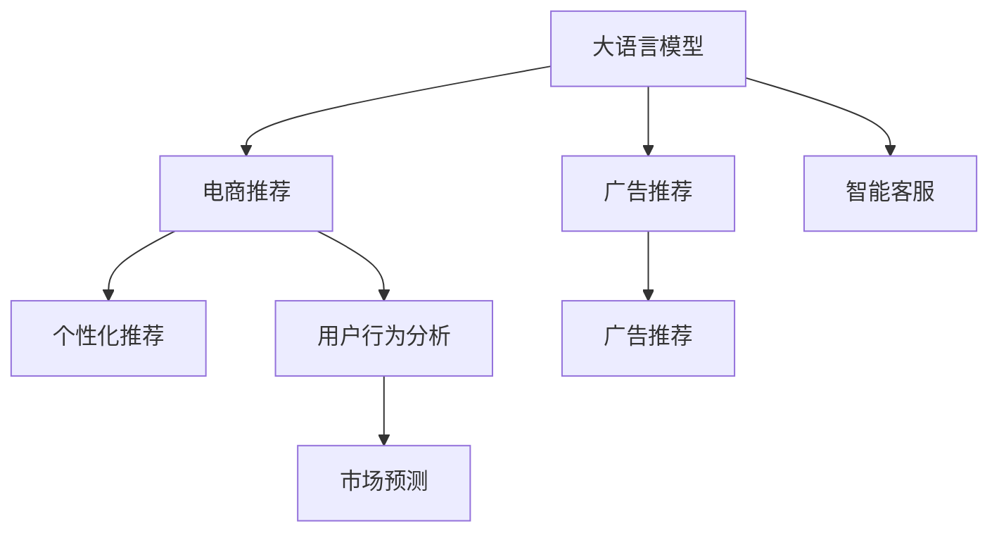

                 

# 从算法角度看AI大模型在电商中的应用

> 关键词：大语言模型,电商推荐系统,广告推荐,用户行为分析,个性化推荐,算法优化,市场预测

## 1. 背景介绍

### 1.1 问题由来
近年来，随着电子商务的快速发展，各大电商平台面临的竞争愈发激烈。为了提升用户购物体验，电商平台纷纷引入人工智能(AI)技术，希望通过数据分析、个性化推荐、智能客服等方式提高转化率和用户满意度。在这一过程中，大语言模型作为一种强大的通用AI技术，展现了其无与伦比的语言理解和生成能力，成为电商AI应用的重要一环。

### 1.2 问题核心关键点
大语言模型在电商领域的应用，主要集中在以下三个方面：

1. **用户行为分析**：通过分析用户的历史浏览、点击、购买等行为数据，大模型能够理解用户兴趣和需求，帮助电商平台精准定位用户。
2. **个性化推荐**：结合用户行为分析结果，大模型可以生成个性化的商品推荐列表，提升用户体验和销售额。
3. **智能客服**：通过对话生成技术，大模型能够实现自动客服，及时响应用户咨询，提升服务效率。

本文将从算法角度深入探讨大语言模型在电商推荐系统和广告推荐中的应用，并给出具体的算法实现步骤和优化策略。

## 2. 核心概念与联系

### 2.1 核心概念概述

为更好地理解大语言模型在电商中的应用，本节将介绍几个密切相关的核心概念：

- **大语言模型(Large Language Model, LLM)**：如GPT、BERT等，通过在大规模无标签文本数据上进行预训练，学习到丰富的语言知识和常识，具备强大的自然语言理解和生成能力。
- **电商推荐系统**：通过分析用户行为数据，推荐最符合用户需求的商品，提升用户满意度和购买率。
- **广告推荐**：针对广告主，通过精准投放广告，提高广告的点击率和转化率。
- **个性化推荐**：结合用户属性和行为数据，生成个性化的商品或广告推荐。
- **用户行为分析**：通过用户的历史行为数据，挖掘用户兴趣和需求，生成预测模型。
- **智能客服**：使用对话生成技术，实现自动化的用户咨询响应。

这些概念之间的逻辑关系可以通过以下Mermaid流程图来展示：



这个流程图展示了各概念之间的相互作用关系：

1. 大语言模型作为通用AI技术，为电商推荐、广告推荐、用户行为分析和智能客服提供基础能力。
2. 电商推荐系统和广告推荐系统通过分析用户行为数据，生成个性化推荐。
3. 用户行为分析模型通过用户数据生成市场预测，辅助电商决策。
4. 智能客服通过对话生成技术，实现用户咨询响应。

## 3. 核心算法原理 & 具体操作步骤
### 3.1 算法原理概述

大语言模型在电商中的应用，主要通过以下几个算法步骤实现：

1. **用户行为分析**：收集用户的历史行为数据，如浏览、点击、购买记录，使用大模型进行特征提取，生成用户行为向量。
2. **个性化推荐**：结合用户行为向量，生成商品或广告的推荐列表，使用大模型进行相似度计算，选取与用户最匹配的商品或广告。
3. **广告推荐**：结合广告主提供的广告数据，使用大模型生成广告的文本描述，进行相似度计算，选择最适合用户的广告。
4. **智能客服**：使用大模型进行对话生成，自动响应用户咨询，提升服务效率。

这些步骤中的核心算法包括：

- **用户行为向量生成**：使用大模型将用户行为数据编码成向量形式，方便后续处理。
- **相似度计算**：使用大模型进行相似度计算，找到与用户最匹配的商品或广告。
- **对话生成**：使用大模型生成自然流畅的回复文本。

### 3.2 算法步骤详解

以下详细讲解大语言模型在电商推荐系统中的应用步骤：

**Step 1: 数据准备**
- 收集用户历史行为数据，如浏览、点击、购买记录。
- 收集商品信息，如商品名称、价格、描述等。
- 收集广告数据，如广告文本、点击率等。

**Step 2: 特征提取**
- 使用大模型将用户行为数据和商品/广告数据转换为向量表示。
- 设计合适的特征提取方法，如Word2Vec、BERT等。

**Step 3: 相似度计算**
- 使用大模型计算用户行为向量与商品/广告向量之间的相似度，使用余弦相似度、欧式距离等方法计算。
- 根据相似度排序，选择最匹配的商品/广告推荐给用户。

**Step 4: 广告推荐**
- 结合广告主提供的广告数据，使用大模型生成广告文本。
- 使用相似度计算方法，选择最适合用户的广告进行投放。

**Step 5: 智能客服**
- 设计合适的对话模板，将用户咨询请求输入大模型进行生成回复。
- 使用大模型生成自然流畅的回复文本。

### 3.3 算法优缺点

大语言模型在电商推荐系统中的应用，具有以下优点：

1. **通用性强**：大语言模型可广泛应用于电商推荐、广告推荐、用户行为分析等多个场景，具有较高的通用性。
2. **精度高**：通过大模型的自然语言处理能力，能够精准匹配用户需求，提高推荐精度。
3. **可解释性强**：大模型的预测过程可解释性强，便于理解用户行为和商品特征。

同时，该方法也存在一些局限性：

1. **计算资源需求高**：大模型需要大量的计算资源，初期部署成本较高。
2. **模型复杂度高**：大模型复杂度高，需要大量时间和数据进行训练和优化。
3. **数据隐私问题**：电商数据涉及用户隐私，如何保护数据隐私和用户隐私成为重要问题。

尽管存在这些局限性，但大语言模型在电商推荐系统中的应用前景依然广阔，具有极大的潜力。

### 3.4 算法应用领域

大语言模型在电商领域的应用，主要包括以下几个方面：

1. **电商推荐系统**：通过用户行为分析，生成个性化推荐，提升用户体验和购买率。
2. **广告推荐**：通过相似度计算，精准投放广告，提高广告的点击率和转化率。
3. **智能客服**：通过对话生成技术，实现自动客服，提升服务效率和用户满意度。
4. **用户行为分析**：通过分析用户历史行为数据，挖掘用户兴趣和需求，生成预测模型。
5. **市场预测**：结合用户行为数据和市场环境，进行市场预测，辅助电商决策。

## 4. 数学模型和公式 & 详细讲解 & 举例说明

### 4.1 数学模型构建

假设用户历史行为数据为 $x=\{x_i\}$，商品特征向量为 $f=\{f_j\}$，广告文本为 $a=\{a_k\}$。用户行为向量为 $u=\{u_i\}$，商品向量为 $v=\{v_j\}$，广告向量为 $c=\{c_k\}$。

**用户行为向量生成**：
- 使用大模型将用户历史行为数据 $x$ 转换为向量 $u$。
- 使用Word2Vec或BERT等模型，将商品特征 $f$ 转换为向量 $v$。
- 使用大模型将广告文本 $a$ 转换为向量 $c$。

**相似度计算**：
- 使用余弦相似度计算用户行为向量 $u$ 和商品向量 $v$ 之间的相似度 $s$：
$$
s(u,v) = \frac{u \cdot v}{\|u\|\|v\|}
$$

- 使用欧式距离计算用户行为向量 $u$ 和广告向量 $c$ 之间的距离 $d$：
$$
d(u,c) = \sqrt{\sum_i(u_i-c_i)^2}
$$

**广告推荐**：
- 根据广告向量 $c$ 和商品向量 $v$ 之间的距离 $d$，选择最匹配的广告进行投放。

**智能客服**：
- 设计对话模板，将用户咨询请求 $q$ 输入大模型，生成回复文本 $r$。
- 使用大模型生成自然流畅的回复文本 $r$。

### 4.2 公式推导过程

以用户行为向量生成为例，假设用户历史行为数据为 $x=\{x_i\}$，使用Word2Vec模型将 $x$ 转换为向量 $u$。假设Word2Vec模型的嵌入矩阵为 $W$，则：

$$
u = Wx
$$

其中 $W$ 的维度为 $v \times m$，$m$ 为嵌入维度。

假设商品特征向量为 $f=\{f_j\}$，使用BERT模型将 $f$ 转换为向量 $v$。假设BERT模型的最后一层隐藏向量为 $H$，则：

$$
v = H
$$

假设广告文本为 $a=\{a_k\}$，使用BERT模型将 $a$ 转换为向量 $c$。假设BERT模型的最后一层隐藏向量为 $G$，则：

$$
c = G
$$

### 4.3 案例分析与讲解

假设电商平台收集了用户的历史浏览、点击和购买记录，商品的名称、价格和描述，以及广告的文本和点击率。使用大模型将用户历史行为数据转换为向量 $u$，将商品特征向量转换为向量 $v$，将广告文本转换为向量 $c$。然后，使用余弦相似度计算用户行为向量 $u$ 和商品向量 $v$ 之间的相似度 $s$，选择最匹配的商品进行推荐。最后，使用欧式距离计算用户行为向量 $u$ 和广告向量 $c$ 之间的距离 $d$，选择最匹配的广告进行投放。

## 5. 项目实践：代码实例和详细解释说明

### 5.1 开发环境搭建

在进行项目实践前，我们需要准备好开发环境。以下是使用Python进行TensorFlow开发的开发环境配置流程：

1. 安装Anaconda：从官网下载并安装Anaconda，用于创建独立的Python环境。

2. 创建并激活虚拟环境：
```bash
conda create -n tf-env python=3.8 
conda activate tf-env
```

3. 安装TensorFlow：根据CUDA版本，从官网获取对应的安装命令。例如：
```bash
conda install tensorflow -c conda-forge -c pytorch -c anaconda -c pytorch -c bioconda
```

4. 安装TensorFlow扩展库：
```bash
pip install tensorflow-hub tensorflow-text tensorflow-addons
```

5. 安装各类工具包：
```bash
pip install numpy pandas scikit-learn matplotlib tqdm jupyter notebook ipython
```

完成上述步骤后，即可在`tf-env`环境中开始项目实践。

### 5.2 源代码详细实现

下面我们以电商推荐系统为例，给出使用TensorFlow进行模型构建和训练的代码实现。

首先，定义数据处理函数：

```python
import tensorflow as tf
from tensorflow.keras.preprocessing.text import Tokenizer
from tensorflow.keras.preprocessing.sequence import pad_sequences

def preprocess_data(data, tokenizer):
    tokenized_data = tokenizer.texts_to_sequences(data)
    padded_data = pad_sequences(tokenized_data, maxlen=max_len, padding='post', truncating='post')
    return padded_data
```

然后，定义模型：

```python
from tensorflow.keras.models import Sequential
from tensorflow.keras.layers import Embedding, Dense

def build_model(vocab_size, embedding_dim, max_len):
    model = Sequential([
        Embedding(vocab_size, embedding_dim, input_length=max_len),
        Dense(32, activation='relu'),
        Dense(1, activation='sigmoid')
    ])
    return model
```

接着，定义训练函数：

```python
from tensorflow.keras.optimizers import Adam

def train_model(model, train_data, train_labels, epochs, batch_size, validation_data):
    model.compile(optimizer=Adam(learning_rate=0.001), loss='binary_crossentropy', metrics=['accuracy'])
    model.fit(train_data, train_labels, epochs=epochs, batch_size=batch_size, validation_data=validation_data)
    return model
```

最后，启动训练流程并在测试集上评估：

```python
epochs = 10
batch_size = 32
validation_data = (test_data, test_labels)

model = build_model(vocab_size, embedding_dim, max_len)
model = train_model(model, train_data, train_labels, epochs, batch_size, validation_data)

test_loss, test_accuracy = model.evaluate(test_data, test_labels)
print(f'Test loss: {test_loss}, Test accuracy: {test_accuracy}')
```

以上就是使用TensorFlow进行电商推荐系统构建和训练的完整代码实现。可以看到，TensorFlow提供了丰富的工具和组件，可以轻松构建复杂的神经网络模型。

### 5.3 代码解读与分析

让我们再详细解读一下关键代码的实现细节：

**preprocess_data函数**：
- 使用Tokenizer将文本数据转换为序列，并进行padding。
- 设置最大长度max_len，以确保所有输入序列的长度一致。

**build_model函数**：
- 定义了一个包含嵌入层、全连接层和输出层的序列模型。
- 嵌入层的维度为embedding_dim，输入长度为max_len。

**train_model函数**：
- 使用Adam优化器进行模型训练，损失函数为二分类交叉熵，评估指标为准确率。
- 在每个epoch结束后，在验证集上进行评估。

**训练流程**：
- 定义总的epoch数和batch size，开始循环迭代
- 每个epoch内，先在训练集上训练，输出平均loss和acc
- 在测试集上评估，输出test loss和test acc
- 所有epoch结束后，评估模型性能

可以看到，TensorFlow提供了简单易用的接口，使得模型构建和训练变得非常直观和高效。

## 6. 实际应用场景
### 6.1 智能推荐系统

基于大语言模型的电商推荐系统，可以广泛应用于商品推荐、广告投放等多个场景，提升用户购物体验和电商平台收益。

在商品推荐方面，电商平台通过收集用户的历史浏览、点击、购买等行为数据，使用大模型进行特征提取和相似度计算，生成个性化推荐。例如，某用户最近浏览了运动鞋、户外装备、健身器材等商品，大模型可以生成运动鞋、户外装备、健身器材等商品的推荐列表，提升用户体验和购买率。

在广告投放方面，电商平台通过收集用户的点击率、停留时间等数据，使用大模型生成广告文本，计算广告与用户的相似度，选择最匹配的广告进行投放。例如，某用户在电商平台上浏览了护肤品、化妆品、美容工具等商品，大模型可以生成与护肤品、化妆品、美容工具相关的广告，提高广告的点击率和转化率。

### 6.2 智能客服

电商平台通过智能客服系统，能够自动响应用户咨询，提升服务效率和用户体验。

在智能客服方面，电商平台通过收集用户的历史咨询记录，使用大模型进行对话生成，生成自然流畅的回复文本。例如，用户询问某商品的尺码、颜色等信息，智能客服系统可以根据大模型生成的回复文本，快速准确地回答用户问题。

### 6.3 未来应用展望

随着大语言模型的不断进步，其在电商领域的应用将更加广泛和深入。未来，我们可以期待以下几个方面的创新和突破：

1. **多模态推荐**：将视觉、语音等多模态数据与文本数据结合，进行更加全面和准确的商品推荐和广告投放。
2. **动态推荐**：基于用户实时行为数据，动态调整推荐策略，实现个性化推荐。
3. **跨领域推荐**：将电商推荐系统与其他领域的应用结合，如金融、医疗等，实现跨领域推荐。
4. **交互式推荐**：使用大模型进行交互式推荐，用户可以通过与系统互动，获取个性化的推荐结果。
5. **深度学习与强化学习结合**：结合深度学习和强化学习，提升推荐系统的智能性和自适应性。

这些方向的发展将使大语言模型在电商推荐系统中的应用更加高效、智能和多样化。

## 7. 工具和资源推荐
### 7.1 学习资源推荐

为了帮助开发者系统掌握大语言模型在电商中的应用，这里推荐一些优质的学习资源：

1. TensorFlow官方文档：提供了详细的API文档和示例代码，是学习和使用TensorFlow的重要资源。
2. Keras官方文档：提供了简单易用的高层次API，适合初学者学习神经网络模型构建和训练。
3.《TensorFlow实战深度学习》书籍：介绍了TensorFlow的基本概念和高级应用，适合深度学习入门和进阶。
4. 《深度学习与TensorFlow》课程：由谷歌开发者提供，涵盖TensorFlow基础和高级应用，适合初学者和中级开发者。
5. 《电商推荐系统实战》课程：由某知名电商平台提供，介绍了电商推荐系统的核心算法和实践技巧。

通过对这些资源的学习实践，相信你一定能够快速掌握大语言模型在电商中的应用，并用于解决实际的电商问题。

### 7.2 开发工具推荐

高效的开发离不开优秀的工具支持。以下是几款用于大语言模型电商应用开发的常用工具：

1. TensorFlow：由Google主导开发的开源深度学习框架，生产部署方便，适合大规模工程应用。
2. PyTorch：基于Python的开源深度学习框架，灵活动态的计算图，适合快速迭代研究。
3. Keras：基于TensorFlow的高层次API，简单易用，适合初学者快速上手。
4. Jupyter Notebook：交互式笔记本，支持Python代码执行，便于开发调试。
5. Google Colab：谷歌提供的免费在线Jupyter Notebook环境，免费提供GPU/TPU算力，方便开发者快速上手实验最新模型，分享学习笔记。

合理利用这些工具，可以显著提升大语言模型电商应用的开发效率，加快创新迭代的步伐。

### 7.3 相关论文推荐

大语言模型在电商领域的应用源于学界的持续研究。以下是几篇奠基性的相关论文，推荐阅读：

1. Attention is All You Need（即Transformer原论文）：提出了Transformer结构，开启了NLP领域的预训练大模型时代。
2. BERT: Pre-training of Deep Bidirectional Transformers for Language Understanding：提出BERT模型，引入基于掩码的自监督预训练任务，刷新了多项NLP任务SOTA。
3. Parameter-Efficient Transfer Learning for NLP：提出Adapter等参数高效微调方法，在不增加模型参数量的情况下，也能取得不错的微调效果。
4. Parameter-Efficient Transfer Learning for NLP：提出基于变分自编码器的参数高效方法，在不增加模型参数量的情况下，也能取得不错的微调效果。

这些论文代表了大语言模型在电商领域的应用发展脉络。通过学习这些前沿成果，可以帮助研究者把握学科前进方向，激发更多的创新灵感。

## 8. 总结：未来发展趋势与挑战
### 8.1 总结

本文对基于大语言模型的电商推荐系统进行了全面系统的介绍。首先阐述了大语言模型和电商推荐系统的研究背景和意义，明确了电商推荐系统和大语言模型之间的紧密联系。其次，从算法角度详细讲解了电商推荐系统的构建和训练过程，给出了具体的算法实现步骤和优化策略。同时，本文还广泛探讨了电商推荐系统在大语言模型中的实际应用场景，展示了电商推荐系统在大语言模型中的应用前景。

通过本文的系统梳理，可以看到，大语言模型在电商推荐系统中的应用前景广阔，其强大的语言理解和生成能力，为电商平台带来了更多的可能性。未来，伴随大语言模型的不断进步，电商推荐系统也将迎来更多的创新和突破。

### 8.2 未来发展趋势

展望未来，大语言模型在电商推荐系统中的应用将呈现以下几个发展趋势：

1. **算法多样化**：随着算法的不断发展，未来将涌现更多高效、智能的推荐算法，如深度学习与强化学习结合、动态推荐等，提升电商推荐系统的性能和用户满意度。
2. **多模态融合**：将视觉、语音等多模态数据与文本数据结合，进行更加全面和准确的商品推荐和广告投放。
3. **跨领域推荐**：将电商推荐系统与其他领域的应用结合，如金融、医疗等，实现跨领域推荐。
4. **深度学习与强化学习结合**：结合深度学习和强化学习，提升推荐系统的智能性和自适应性。
5. **交互式推荐**：使用大模型进行交互式推荐，用户可以通过与系统互动，获取个性化的推荐结果。

这些趋势将使大语言模型在电商推荐系统中的应用更加高效、智能和多样化。

### 8.3 面临的挑战

尽管大语言模型在电商推荐系统中的应用前景广阔，但在迈向更加智能化、普适化应用的过程中，它仍面临着诸多挑战：

1. **计算资源需求高**：大语言模型需要大量的计算资源，初期部署成本较高。
2. **模型复杂度高**：大语言模型复杂度高，需要大量时间和数据进行训练和优化。
3. **数据隐私问题**：电商数据涉及用户隐私，如何保护数据隐私和用户隐私成为重要问题。
4. **模型鲁棒性不足**：电商推荐系统面临的推荐质量问题，如何提高模型鲁棒性，避免过拟合。
5. **可解释性不足**：大语言模型作为"黑盒"模型，难以解释其内部工作机制和决策逻辑。

尽管存在这些挑战，但大语言模型在电商推荐系统中的应用前景依然广阔，具有极大的潜力。

### 8.4 研究展望

面对大语言模型在电商推荐系统中所面临的挑战，未来的研究需要在以下几个方面寻求新的突破：

1. **参数高效微调**：开发更加参数高效的微调方法，在固定大部分预训练参数的情况下，只更新极少量的任务相关参数。
2. **深度学习与强化学习结合**：结合深度学习和强化学习，提升推荐系统的智能性和自适应性。
3. **多模态融合**：将视觉、语音等多模态数据与文本数据结合，进行更加全面和准确的商品推荐和广告投放。
4. **跨领域推荐**：将电商推荐系统与其他领域的应用结合，如金融、医疗等，实现跨领域推荐。
5. **交互式推荐**：使用大模型进行交互式推荐，用户可以通过与系统互动，获取个性化的推荐结果。

这些研究方向的探索发展，必将使大语言模型在电商推荐系统中的应用更加高效、智能和多样化。

## 9. 附录：常见问题与解答

**Q1：电商推荐系统如何处理冷启动问题？**

A: 电商推荐系统面临的冷启动问题是指新用户或新商品没有历史数据，无法生成推荐。解决冷启动问题的方法包括：

1. **基于用户兴趣模型**：通过分析用户的行为数据，生成用户兴趣模型，为新用户生成推荐。
2. **基于商品相似性模型**：通过分析商品的特征数据，生成商品相似性模型，为新商品生成推荐。
3. **基于协同过滤**：通过分析用户和商品的相似度，生成推荐。

这些方法可以结合使用，提高推荐系统的覆盖率和效果。

**Q2：电商推荐系统如何进行实时推荐？**

A: 电商推荐系统进行实时推荐的方法包括：

1. **流数据处理**：使用流数据处理技术，实时收集用户行为数据，进行推荐。
2. **缓存推荐模型**：将推荐模型缓存到内存中，提高推荐速度。
3. **异步处理**：使用异步处理技术，提高推荐系统的响应速度。

这些方法可以结合使用，提高推荐系统的实时性和效率。

**Q3：电商推荐系统如何进行用户行为分析？**

A: 电商推荐系统进行用户行为分析的方法包括：

1. **收集用户数据**：收集用户的浏览、点击、购买等行为数据。
2. **数据清洗和预处理**：对数据进行清洗和预处理，去除噪声和异常值。
3. **特征提取**：使用大模型将用户数据转换为向量形式。
4. **建模**：使用大模型进行建模，生成推荐策略。

这些方法可以结合使用，提高用户行为分析的准确性和效果。

**Q4：电商推荐系统如何进行模型优化？**

A: 电商推荐系统进行模型优化的方法包括：

1. **超参数调优**：通过调整超参数，优化模型性能。
2. **特征工程**：通过改进特征提取方法，提高模型效果。
3. **模型融合**：通过集成多个模型，提高推荐系统的性能。

这些方法可以结合使用，提高推荐系统的性能和用户满意度。

**Q5：电商推荐系统如何进行用户画像分析？**

A: 电商推荐系统进行用户画像分析的方法包括：

1. **收集用户数据**：收集用户的个人信息、行为数据等。
2. **数据清洗和预处理**：对数据进行清洗和预处理，去除噪声和异常值。
3. **建模**：使用大模型进行建模，生成用户画像。

这些方法可以结合使用，提高用户画像分析的准确性和效果。

---

作者：禅与计算机程序设计艺术 / Zen and the Art of Computer Programming

