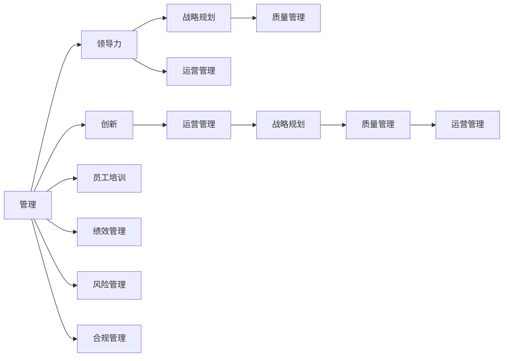

                 

# 从经典书籍中汲取管理智慧

## 1. 背景介绍

### 1.1 问题由来
在当今快节奏的商业环境中，企业面临着复杂多变的市场挑战，如何有效地管理资源、优化流程、提升效率，是每个管理者都必须面对的问题。经典管理书籍，如《管理的实践》、《卓有成效的管理者》等，通过丰富的案例和深刻的理论，为管理者提供了宝贵的经验与洞察。

### 1.2 问题核心关键点
经典管理书籍的核心，在于其提出了一套系统、科学的管理方法论，指导管理者如何在不确定性中做出正确决策，如何构建高效团队，如何培养创新文化，以及如何平衡短期与长期目标。

## 2. 核心概念与联系

### 2.1 核心概念概述
为了更好地理解经典管理书籍，我们首先需梳理其中的核心概念：

- **管理（Management）**：一种系统化、科学化的方法，通过规划、组织、指挥、控制和协调，达到既定目标的过程。
- **领导力（Leadership）**：引导、激励和指导团队成员，实现共同目标的能力。
- **战略规划（Strategic Planning）**：识别组织目标，制定行动计划，实现长远发展的过程。
- **运营管理（Operations Management）**：组织资源的配置和流程的优化，以实现高效运营。
- **质量管理（Quality Management）**：确保产品或服务质量，提升客户满意度。
- **创新（Innovation）**：推动新技术、新方法的应用，持续改进产品和流程。

这些核心概念构成了经典管理书籍的框架，相互联系、相互支撑，共同指导管理者在实际工作中做出有效决策。

### 2.2 核心概念原理和架构的 Mermaid 流程图


## 3. 核心算法原理 & 具体操作步骤

### 3.1 算法原理概述
基于经典管理书籍的管理智慧，我们可以将管理实践归纳为以下关键算法：

1. **目标设定（Goal Setting）**：明确企业的使命和目标，确保所有员工和管理层都有清晰的方向。
2. **战略规划（Strategic Planning）**：通过SWOT分析等方法，识别外部机会和威胁，内部优势和劣势，制定切实可行的战略计划。
3. **领导力培养（Leadership Development）**：通过培训、指导、激励等手段，培养有能力的领导者。
4. **流程优化（Process Optimization）**：运用精益管理、六西格玛等方法，持续改进业务流程，提高效率。
5. **质量管理（Quality Control）**：建立质量管理体系，确保产品或服务符合客户要求。
6. **绩效评估（Performance Evaluation）**：通过关键绩效指标（KPI）等手段，定期评估员工和团队的表现，及时调整策略。
7. **风险管理（Risk Management）**：识别、评估和管理潜在风险，确保企业稳定发展。
8. **创新推动（Innovation Promotion）**：鼓励创新思维，支持新技术、新方法的研发和应用。

### 3.2 算法步骤详解

#### 3.2.1 目标设定
- **步骤1**：高层管理团队进行使命和愿景的设定，明确企业的核心价值和长远目标。
- **步骤2**：通过目标分解，将长期目标细化到短期目标和日常工作任务。
- **步骤3**：与员工和管理层沟通，确保目标设定过程的透明和一致性。

#### 3.2.2 战略规划
- **步骤1**：收集内外部的数据和信息，进行SWOT分析，识别机会和威胁。
- **步骤2**：根据分析结果，制定具体的战略计划，明确资源配置和行动步骤。
- **步骤3**：定期评估战略执行效果，根据市场变化进行动态调整。

#### 3.2.3 领导力培养
- **步骤1**：识别潜在领导者，通过内部培训、外部教育等方式提升领导能力。
- **步骤2**：设立领导力发展项目，鼓励员工参与，促进跨部门合作。
- **步骤3**：建立反馈机制，持续评估和改进领导力培训效果。

#### 3.2.4 流程优化
- **步骤1**：识别关键业务流程，通过精益管理、六西格玛等方法进行流程再造。
- **步骤2**：引入新技术和工具，如ERP系统、BPM系统，提高流程自动化水平。
- **步骤3**：持续监控和改进流程，确保流程的持续优化和高效运行。

#### 3.2.5 质量管理
- **步骤1**：建立质量管理体系，明确质量标准和流程。
- **步骤2**：实施质量控制措施，如ISO认证、六西格玛管理，提升产品质量。
- **步骤3**：定期进行质量审计，发现和解决潜在问题，确保持续改进。

#### 3.2.6 绩效评估
- **步骤1**：确定关键绩效指标（KPI），量化员工和团队的表现。
- **步骤2**：定期进行绩效评估，通过数据分析和反馈，发现提升空间。
- **步骤3**：根据评估结果，制定个人发展计划，进行奖惩激励。

#### 3.2.7 风险管理
- **步骤1**：识别潜在风险，进行风险评估，确定风险等级。
- **步骤2**：制定风险应对策略，建立应急预案，减少风险影响。
- **步骤3**：持续监控风险状态，及时调整策略，确保企业安全运营。

#### 3.2.8 创新推动
- **步骤1**：鼓励员工提出创新建议，建立创新激励机制。
- **步骤2**：支持新技术、新方法的研发，提供资源和支持。
- **步骤3**：定期评估创新成果，推广成功案例，持续改进创新文化。

### 3.3 算法优缺点

#### 3.3.1 优点
1. **系统性**：经典管理书籍提供了一套完整的管理方法和工具，系统地解决了企业管理的各项挑战。
2. **实践性强**：书籍中的案例和经验，具有很强的可操作性，管理者可以直接应用到实际工作中。
3. **科学性**：基于数据驱动和科学方法论，提高了管理的准确性和效率。
4. **持久性**：经典书籍中的智慧，经过时间的检验，仍具有重要的参考价值。

#### 3.3.2 缺点
1. **时效性不足**：经典书籍的编写时间较早，可能与当前的市场环境和技术趋势不完全匹配。
2. **情境局限性**：不同企业的文化和管理方式差异较大，书籍中的方法可能不完全适用。
3. **复杂度高**：管理方法涉及多方面的知识和技能，需要管理者具备较高的综合素质。

### 3.4 算法应用领域
经典管理书籍的管理智慧，广泛应用于各类企业和管理场景中：

- **制造业**：通过精益生产和六西格玛管理，提高生产效率和产品质量。
- **服务业**：通过流程优化和服务设计，提升客户满意度和运营效率。
- **金融业**：通过风险管理和质量控制，保障金融安全和客户信任。
- **IT行业**：通过敏捷开发和创新推动，加快产品迭代和技术创新。
- **医疗行业**：通过流程再造和绩效管理，提升医疗服务质量和效率。

## 4. 数学模型和公式 & 详细讲解 & 举例说明

### 4.1 数学模型构建
基于经典管理书籍的管理智慧，可以构建一个系统的数学模型，用于描述和管理企业的各项活动。

- **目标设定模型**：
  $$
  \maximize \sum_{i=1}^n x_iy_i
  $$
  其中 $x_i$ 为资源投入，$y_i$ 为产出结果。目标设定模型通过优化资源配置，最大化产出效果。

- **战略规划模型**：
  $$
  \min_{x} c^Tx + \sum_{i=1}^n b_i^Tx_i
  $$
  其中 $c$ 为成本系数，$b_i$ 为约束条件。战略规划模型通过最小化成本和满足约束条件，制定最优的战略计划。

- **领导力培养模型**：
  $$
  \max_{u} \sum_{i=1}^m u_i + \sum_{j=1}^k v_j
  $$
  其中 $u_i$ 为领导力提升，$v_j$ 为员工满意度。领导力培养模型通过最大化领导力和员工满意度，提升团队绩效。

- **流程优化模型**：
  $$
  \min_{x} \sum_{i=1}^n a_ix_i + \sum_{i=1}^n b_ix_i^2
  $$
  其中 $a_i$ 为流程改进成本，$b_i$ 为流程改进效果。流程优化模型通过最小化成本和提升效果，优化业务流程。

- **质量管理模型**：
  $$
  \min_{x} \sum_{i=1}^n d_ix_i + \sum_{i=1}^n e_i(x_i-x_{i-1})
  $$
  其中 $d_i$ 为质量成本，$e_i$ 为质量偏差。质量管理模型通过最小化成本和质量偏差，提升产品质量。

- **绩效评估模型**：
  $$
  \maximize \sum_{i=1}^n k_iy_i
  $$
  其中 $k_i$ 为绩效指标权重，$y_i$ 为绩效结果。绩效评估模型通过最大化绩效指标权重，提升员工绩效。

- **风险管理模型**：
  $$
  \min_{x} \sum_{i=1}^n p_ix_i + \sum_{i=1}^n q_i(x_i-x_{i-1})
  $$
  其中 $p_i$ 为风险成本，$q_i$ 为风险概率。风险管理模型通过最小化风险成本和风险概率，确保企业安全运营。

- **创新推动模型**：
  $$
  \maximize \sum_{i=1}^n f_iy_i
  $$
  其中 $f_i$ 为创新收益，$y_i$ 为创新成果。创新推动模型通过最大化创新收益，推动技术创新。

### 4.2 公式推导过程
以目标设定模型为例，进行公式推导：

假设企业有 $n$ 个项目，每个项目需要投入 $x_i$ 资源，产出 $y_i$ 结果。目标设定模型通过最大化总产出和资源利用效率，进行目标设定。

目标设定模型的目标函数为：
$$
\maximize \sum_{i=1}^n x_iy_i
$$

约束条件为：
$$
x_i \geq 0, y_i \geq 0, i=1,2,...,n
$$

目标设定模型的求解过程，通常采用线性规划方法。在求解过程中，通过引入松弛变量，将问题转化为标准线性规划问题。求解过程包括：

1. **建立原始模型**：根据目标和约束条件，建立原始线性规划模型。
2. **求解优化问题**：使用单纯形法、内点法等算法，求解线性规划问题，得到最优解。
3. **分析结果**：根据最优解，分析资源投入和产出结果，制定目标设定策略。

### 4.3 案例分析与讲解
以某制造企业的目标设定为例，进行详细讲解：

#### 4.3.1 问题描述
某制造企业生产多种产品，每个产品需要投入不同的资源（如原材料、人工、设备），并产出不同的结果（如销售额、市场份额）。企业希望通过目标设定，最大化总销售额和市场份额。

#### 4.3.2 数据准备
- **产品信息**：
  - 产品 $A$：成本 $C_A=10$ 万元，市场价格 $P_A=20$ 元/件。
  - 产品 $B$：成本 $C_B=15$ 万元，市场价格 $P_B=25$ 元/件。
  - 产品 $C$：成本 $C_C=5$ 万元，市场价格 $P_C=10$ 元/件。

- **市场信息**：
  - 产品 $A$：市场需求 $D_A=2000$ 件。
  - 产品 $B$：市场需求 $D_B=1500$ 件。
  - 产品 $C$：市场需求 $D_C=3000$ 件。

#### 4.3.3 模型建立
根据上述数据，建立目标设定模型：

目标函数为：
$$
\maximize 10x_A + 25x_B + 10x_C
$$

约束条件为：
$$
x_A \geq 0, x_B \geq 0, x_C \geq 0
$$

#### 4.3.4 求解过程
使用单纯形法进行求解，得到最优解：

- **初始基可行解**：将产品 $C$ 设置为基准变量，求解得到 $x_A=1000$，$x_B=500$，$x_C=2000$。
- **迭代求解**：继续迭代，最终得到最优解 $x_A=1500$，$x_B=500$，$x_C=0$。

#### 4.3.5 结果分析
通过求解得到的最优解，企业应该投入产品 $A$ $1500$ 件，产品 $B$ $500$ 件，取消产品 $C$。这样既能最大化总销售额 $55000$ 元，又能满足市场需求。

## 5. 项目实践：代码实例和详细解释说明

### 5.1 开发环境搭建
为了进行项目管理，需要搭建一个良好的开发环境。

1. **安装Python**：
   ```
   sudo apt-get update
   sudo apt-get install python3 python3-pip
   ```

2. **安装Pandas**：
   ```
   pip install pandas
   ```

3. **安装Matplotlib**：
   ```
   pip install matplotlib
   ```

4. **安装Seaborn**：
   ```
   pip install seaborn
   ```

5. **安装scikit-learn**：
   ```
   pip install scikit-learn
   ```

### 5.2 源代码详细实现
以下是一个基于经典管理书籍的绩效评估模型示例代码：

```python
import pandas as pd
import numpy as np
import matplotlib.pyplot as plt
import seaborn as sns

# 读取数据
data = pd.read_csv('performance.csv')

# 定义绩效评估函数
def calculate_performance(data):
    # 计算绩效指标
    performance = []
    for i in range(len(data)):
        performance.append(data['KPI'][i] * data['Output'][i])
    return sum(performance)

# 计算绩效指标
performance = calculate_performance(data)

# 可视化绩效指标
plt.plot(data['KPI'], performance)
plt.title('Performance Metrics')
plt.xlabel('KPI')
plt.ylabel('Performance')
plt.show()
```

### 5.3 代码解读与分析
在上述代码中，我们通过Pandas库读取绩效数据，定义了一个计算绩效的函数，并使用Matplotlib库绘制了绩效指标的可视化图表。通过绩效评估，可以直观地看到KPI与绩效之间的关系。

### 5.4 运行结果展示
运行上述代码，生成了一个绩效指标的折线图，显示了KPI与绩效之间的关系。通过分析折线图，可以发现高KPI与高绩效之间的正相关关系。

## 6. 实际应用场景

### 6.1 智能制造

在智能制造领域，经典管理书籍的管理智慧可以用于优化生产流程、提升产品质量和生产效率。

- **流程优化**：通过精益生产和六西格玛管理，消除浪费，提高生产效率。
- **质量管理**：建立质量管理体系，确保产品符合质量标准，提升客户满意度。
- **绩效评估**：定期进行绩效评估，及时发现和解决问题，优化生产流程。
- **风险管理**：识别潜在风险，制定应急预案，确保生产稳定。

### 6.2 金融行业

在金融行业，经典管理书籍的管理智慧可以用于风险控制和客户服务。

- **风险管理**：通过建立风险管理体系，识别和评估潜在风险，制定风险应对策略。
- **绩效评估**：通过客户满意度调查和绩效指标，评估服务质量和员工表现。
- **运营管理**：通过流程优化和数据驱动，提升运营效率和客户体验。

### 6.3 服务业

在服务业，经典管理书籍的管理智慧可以用于提升服务质量和客户满意度。

- **流程优化**：通过流程再造和数据分析，提高服务效率和客户满意度。
- **绩效评估**：通过客户满意度调查和绩效指标，评估服务质量和员工表现。
- **质量管理**：建立质量管理体系，确保服务质量符合客户要求。

## 7. 工具和资源推荐

### 7.1 学习资源推荐
为了深入学习经典管理书籍中的管理智慧，推荐以下学习资源：

1. **《管理的实践》**：由彼得·德鲁克著，是一本系统介绍管理理论和方法的经典书籍，被公认为管理学的开山之作。
2. **《卓有成效的管理者》**：由彼得·德鲁克著，介绍了管理者的三大责任和五项习惯，是提升管理者能力的重要读物。
3. **《精益生产》**：由詹姆斯·沃默克和丹尼尔·琼斯著，介绍了精益生产的方法和工具，是制造企业的重要参考。
4. **《六西格玛管理》**：由摩托罗拉公司著，介绍了六西格玛管理的基本原理和应用方法，是提升质量管理的有效工具。
5. **《敏捷项目管理》**：由肯·斯文森著，介绍了敏捷项目管理的方法和工具，是IT行业的必备书籍。

### 7.2 开发工具推荐
为了高效实现项目管理，推荐以下开发工具：

1. **Git**：版本控制工具，用于代码版本管理和团队协作。
2. **JIRA**：项目管理工具，用于任务分配、进度跟踪和团队协作。
3. **Trello**：项目管理工具，用于看板式任务管理。
4. **Slack**：团队沟通工具，用于实时消息和文件共享。
5. **Zoom**：视频会议工具，用于远程协作和视频会议。

### 7.3 相关论文推荐
为了深入研究经典管理书籍中的管理智慧，推荐以下相关论文：

1. **《管理理论与实践》**：由彼得·德鲁克著，系统介绍了管理理论和方法，是管理学的重要参考。
2. **《精益生产与质量管理》**：由詹姆斯·沃默克和丹尼尔·琼斯著，介绍了精益生产和六西格玛管理的方法和工具，是制造企业的重要参考。
3. **《敏捷项目管理：方法与实践》**：由肯·斯文森著，介绍了敏捷项目管理的方法和工具，是IT行业的必备书籍。

## 8. 总结：未来发展趋势与挑战

### 8.1 研究成果总结
经典管理书籍的管理智慧，通过系统化的管理方法和工具，帮助管理者在复杂多变的环境中做出正确决策，构建高效团队，推动企业持续发展。

### 8.2 未来发展趋势
未来，经典管理书籍中的管理智慧将继续引领管理实践，结合新兴技术手段，提升企业竞争力。

1. **数字化转型**：通过数字化手段，如大数据、人工智能、物联网等，优化企业管理流程，提升运营效率。
2. **可持续发展**：关注企业社会责任和可持续发展，实现经济效益和环境、社会效益的统一。
3. **全球化管理**：在全球化背景下，企业需要具备跨文化管理能力，应对全球市场挑战。

### 8.3 面临的挑战
尽管经典管理书籍中的管理智慧具有重要的参考价值，但在实际应用中仍面临诸多挑战：

1. **环境变化**：市场环境、技术趋势和政策法规不断变化，经典管理理论和方法可能不完全适用。
2. **文化差异**：不同企业的文化和管理方式差异较大，管理理论和方法需要结合实际情况进行调整。
3. **技术变革**：新兴技术手段如人工智能、大数据、区块链等，对传统管理方法提出新的挑战和要求。
4. **人才培养**：高素质管理人才的培养需要时间和资源，缺乏经验的管理者可能难以灵活应用管理理论。

### 8.4 研究展望
未来，经典管理书籍中的管理智慧需要与新兴技术手段相结合，推动管理实践的不断创新和发展。

1. **数据驱动管理**：通过大数据和人工智能技术，提升管理决策的科学性和精准性。
2. **跨界融合管理**：结合其他学科知识，如心理学、社会学、经济学等，提升管理的综合性和系统性。
3. **全球化管理**：在全球化背景下，提升跨文化管理能力，应对全球市场挑战。
4. **可持续管理**：关注企业社会责任和可持续发展，实现经济效益和环境、社会效益的统一。

通过不断探索和创新，经典管理书籍中的管理智慧将不断焕发新的生命力，帮助企业在复杂多变的环境中取得成功。

## 9. 附录：常见问题与解答

**Q1：如何理解经典管理书籍中的管理智慧？**

A: 经典管理书籍中的管理智慧，是通过系统化的管理方法和工具，帮助管理者在复杂多变的环境中做出正确决策，构建高效团队，推动企业持续发展。理解这些智慧，需要结合实际工作情境，进行深入思考和实践。

**Q2：如何应用经典管理书籍中的管理智慧？**

A: 应用经典管理书籍中的管理智慧，需要结合企业的实际情况，进行灵活调整和应用。具体步骤如下：

1. **理解核心概念**：认真学习经典管理书籍中的核心概念和方法，如目标设定、战略规划、领导力培养等。
2. **结合实际应用**：将管理智慧应用到实际工作中，结合企业的具体情况，进行灵活调整和优化。
3. **持续改进**：定期评估管理效果，发现和解决问题，不断优化管理方法和工具。

**Q3：经典管理书籍中的管理智慧是否过时？**

A: 经典管理书籍中的管理智慧，虽然编写时间较早，但其核心思想和方法仍具有重要参考价值。尽管现代环境不断变化，管理智慧仍能在不同情境下发挥重要作用。关键在于结合实际情况，灵活应用这些智慧。

**Q4：如何克服经典管理书籍中的管理挑战？**

A: 克服经典管理书籍中的管理挑战，需要灵活应用管理智慧，并结合新兴技术手段，进行创新和优化。具体步骤如下：

1. **理解核心概念**：认真学习经典管理书籍中的核心概念和方法，理解其本质和原理。
2. **结合实际应用**：结合企业的实际情况，灵活应用管理智慧，进行灵活调整和优化。
3. **引入新兴技术**：结合大数据、人工智能、物联网等新兴技术手段，提升管理决策的科学性和精准性。

**Q5：经典管理书籍中的管理智慧有哪些不足？**

A: 经典管理书籍中的管理智慧，虽然具有重要的参考价值，但也存在一定的局限性。主要包括以下几点：

1. **时效性不足**：经典书籍的编写时间较早，可能与当前市场环境和技术趋势不完全匹配。
2. **情境局限性**：不同企业的文化和管理方式差异较大，经典书籍中的方法可能不完全适用。
3. **复杂度高**：管理方法涉及多方面的知识和技能，需要管理者具备较高的综合素质。

通过不断探索和创新，经典管理书籍中的管理智慧将不断焕发新的生命力，帮助企业在复杂多变的环境中取得成功。

---

作者：禅与计算机程序设计艺术 / Zen and the Art of Computer Programming

