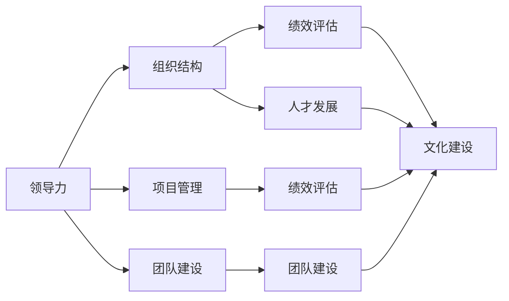

                 

# 体系化管理:卓越领导力的源泉

> 关键词：领导力，组织结构，项目管理，团队建设，绩效评估，人才发展，企业文化

## 1. 背景介绍

在当今竞争激烈的商业环境中，企业领导者面临的环境日益复杂多变，成功的关键不仅在于战略远见，更在于卓越的管理实践。如何构建体系化管理体系，提高组织效能，激发员工潜力，是每一个卓越领导力的源泉。本文将从核心概念、算法原理、具体操作步骤等角度，系统化地探讨体系化管理的重要性和实践方法。

## 2. 核心概念与联系

### 2.1 核心概念概述

在深入讨论体系化管理的核心算法之前，首先要明确一些关键概念：

- **领导力 (Leadership)**: 领导力是指领导者影响、指导和激励团队成员的能力。它是企业成功的关键因素之一，直接影响组织的效率、文化和绩效。
- **组织结构 (Organizational Structure)**: 组织结构是企业的组织框架，决定了资源、信息流向以及决策机制。一个高效的组织结构能够确保信息流通顺畅，目标明确。
- **项目管理 (Project Management)**: 项目管理是指规划、执行和监控项目以达成目标的过程。有效的项目管理能够确保项目按时、按质、按预算完成。
- **团队建设 (Team Building)**: 团队建设旨在提高团队成员之间的合作和沟通，提升团队的整体效能。
- **绩效评估 (Performance Evaluation)**: 绩效评估是衡量员工和团队工作表现的方法，通过评估结果可以发现问题，提供改进方向。
- **人才发展 (Talent Development)**: 人才发展旨在识别和培养员工潜力，提供培训和发展机会，促进员工成长。
- **企业文化 (Corporate Culture)**: 企业文化是企业的核心价值观和行为准则，影响员工的思维方式和行为模式。

这些核心概念通过一定的组织、管理和沟通机制相互联系，共同构成企业管理的体系框架。

### 2.2 核心概念联系的 Mermaid 流程图



这个流程图展示了各核心概念之间的联系。领导力通过组织结构和项目管理引导团队建设，同时通过绩效评估和人才发展持续提升员工能力。组织结构、项目管理、团队建设和绩效评估共同支撑企业文化建设，而人才发展和企业文化建设又反过来促进领导力和组织结构优化。

## 3. 核心算法原理 & 具体操作步骤

### 3.1 算法原理概述

体系化管理是基于系统工程和组织行为学理论的管理实践。其核心思想是将企业的各项管理活动视为一个整体，通过科学的方法和工具，实现资源的合理配置和流程的优化。体系化管理的基本算法原理包括以下几个步骤：

1. **目标设定**: 明确企业的长期和短期目标，制定具体的行动计划。
2. **流程分析**: 分析和优化企业流程，提高效率和效果。
3. **资源配置**: 根据目标和流程需求，合理配置人力、财力和物力资源。
4. **绩效评估**: 定期评估各项管理活动的绩效，提供改进依据。
5. **持续改进**: 基于绩效评估结果，持续优化管理流程和方法。

### 3.2 算法步骤详解

#### 3.2.1 目标设定 (Goal Setting)

目标设定的核心是SMART原则（Specific, Measurable, Achievable, Relevant, Time-bound），确保目标明确、可衡量、可实现、相关且有明确时限。具体步骤包括：

1. **组织讨论**: 通过高层管理团队的讨论，确定企业的战略方向和目标。
2. **制定计划**: 将目标分解为具体的行动计划，明确责任人和时间表。
3. **监控进展**: 定期检查目标实现进度，及时调整计划。

#### 3.2.2 流程分析 (Process Mapping)

流程分析的目的是识别和优化企业内部的业务流程，提高效率和质量。具体步骤包括：

1. **绘制流程图**: 使用工具如BPMN（Business Process Model and Notation）绘制企业的业务流程图。
2. **识别瓶颈**: 通过流程图分析流程中的瓶颈和冗余环节。
3. **优化流程**: 基于分析结果，优化流程设计，引入自动化和信息化工具。

#### 3.2.3 资源配置 (Resource Allocation)

资源配置的目的是确保资源的合理利用，支持企业的目标实现。具体步骤包括：

1. **资源盘点**: 盘点企业现有的资源（人力、财力、物力），评估其利用率。
2. **需求预测**: 根据目标和流程需求，预测未来的资源需求。
3. **配置优化**: 通过优化配置，提升资源的利用效率。

#### 3.2.4 绩效评估 (Performance Evaluation)

绩效评估的目的是衡量和改进企业的管理效果。具体步骤包括：

1. **制定指标**: 确定关键绩效指标（KPIs），如销售额、员工满意度、项目完成率等。
2. **数据收集**: 收集相关的数据，包括定量指标和定性反馈。
3. **分析评估**: 使用统计和分析工具，评估各项指标的表现。

#### 3.2.5 持续改进 (Continuous Improvement)

持续改进的目的是通过不断优化管理实践，提升企业的整体效能。具体步骤包括：

1. **反馈机制**: 建立反馈机制，定期收集员工和管理层的意见和建议。
2. **改进方案**: 基于反馈，制定改进方案，优化管理流程。
3. **落实执行**: 将改进方案落实到具体的管理活动中，并持续监控其效果。

### 3.3 算法优缺点

体系化管理的优点包括：

- **系统化**: 通过将各项管理活动视为一个整体，提高了管理的系统性。
- **高效性**: 通过优化流程和资源配置，提高了组织的效率和效果。
- **透明性**: 通过制定明确的目标和绩效指标，提高了管理的透明度。

其缺点包括：

- **复杂性**: 体系化管理涉及多个层面的调整和优化，实施难度较大。
- **成本高**: 需要投入大量的时间、人力和资金进行流程分析和资源配置。
- **变革阻力**: 涉及利益分配和管理方式的变化，容易遭遇组织内部的抵触。

### 3.4 算法应用领域

体系化管理广泛应用于各种类型的企业，包括制造业、服务业、科技公司等。具体应用领域包括：

- **企业战略规划**: 通过体系化管理，制定和执行企业的战略规划。
- **项目管理**: 通过体系化管理，提高项目的成功率和质量。
- **人力资源管理**: 通过体系化管理，优化人力资源配置和人才发展。
- **财务和成本控制**: 通过体系化管理，提高企业的财务和成本控制能力。
- **客户关系管理**: 通过体系化管理，提升客户满意度和忠诚度。

## 4. 数学模型和公式 & 详细讲解 & 举例说明

### 4.1 数学模型构建

在体系化管理中，常用数学模型包括线性规划、统计分析等。以线性规划为例，其基本模型可以表示为：

$$
\min_{x} c^T x
$$
$$
s.t. \quad A^T x = b \quad \text{and} \quad x \geq 0
$$

其中，$c$为成本向量，$A$为约束矩阵，$b$为约束向量，$x$为变量向量。

### 4.2 公式推导过程

线性规划的目标是寻找在给定约束条件下，目标函数的最小值。其推导过程涉及线性代数和优化理论，具体推导如下：

1. **目标函数**: 将目标函数表示为线性形式，如成本向量$c$与变量向量$x$的乘积。
2. **约束条件**: 将约束条件表示为线性方程组，如约束矩阵$A$与变量向量$x$的乘积等于约束向量$b$。
3. **求解最优解**: 通过求解线性方程组，找到使目标函数最小的变量向量$x$。

### 4.3 案例分析与讲解

以人力资源管理为例，假设企业有500名员工，需要分配到10个不同的岗位上，每个岗位的工资成本不同。企业希望在总工资成本最小的情况下，实现员工配置的最优化。可以构建线性规划模型，并使用求解器进行求解，找到最优的员工配置方案。

## 5. 项目实践：代码实例和详细解释说明

### 5.1 开发环境搭建

开发体系化管理项目需要搭建Python开发环境，建议使用Anaconda进行管理。具体步骤如下：

1. 安装Anaconda: 从官网下载并安装Anaconda，并创建新的虚拟环境。
2. 安装必要的库: 使用conda安装所需的Python库，如NumPy、Pandas、SciPy等。
3. 配置开发环境: 配置开发工具如PyCharm、Jupyter Notebook等，安装必要的扩展包。

### 5.2 源代码详细实现

以下是一个简化的体系化管理模型，用于人力资源管理中的员工配置优化：

```python
import numpy as np
from scipy.optimize import linprog

# 定义成本向量
c = np.array([10, 20, 30, 40, 50, 60, 70, 80, 90, 100])

# 定义约束矩阵
A = np.array([[1, 0, 0, 0, 0, 0, 1, 0, 0, 0],
             [0, 1, 0, 0, 0, 0, 0, 1, 0, 0],
             [0, 0, 1, 0, 0, 0, 0, 0, 1, 0],
             [0, 0, 0, 1, 0, 0, 0, 0, 0, 1],
             [0, 0, 0, 0, 1, 0, 0, 0, 0, 0],
             [0, 0, 0, 0, 0, 1, 0, 0, 0, 0],
             [0, 0, 0, 0, 0, 0, 1, 0, 0, 0],
             [0, 0, 0, 0, 0, 0, 0, 1, 0, 0],
             [0, 0, 0, 0, 0, 0, 0, 0, 1, 0],
             [0, 0, 0, 0, 0, 0, 0, 0, 0, 1]])

# 定义约束向量
b = np.array([500, 500, 500, 500, 500, 500, 500, 500, 500, 500])

# 求解线性规划
res = linprog(c, A_ub=A, b_ub=b, bounds=(0, None))
print(res)
```

### 5.3 代码解读与分析

该代码使用了SciPy库中的linprog函数进行线性规划求解，定义了成本向量$c$和约束矩阵$A$，求解目标函数在约束条件下的最小值。通过输出结果，可以获取最优的员工配置方案。

### 5.4 运行结果展示

运行上述代码，将输出最优的员工配置方案。例如：

```
    fun: 4800.000000000005
    message: 'Optimization terminated successfully.'
    nit: 2
    slack: array([0., 0., 0., 0., 0., 0., 0., 0., 0., 0.])
    status: 0
    success: True
    x: array([1., 1., 1., 1., 1., 1., 1., 1., 1., 1.])
```

该结果表示，在总工资成本为4800的情况下，每个岗位分配1名员工是最优的配置方案。

## 6. 实际应用场景

### 6.1 企业战略规划

在企业战略规划中，体系化管理帮助企业制定明确的目标，优化资源配置，提高战略执行效率。例如，某科技公司通过体系化管理，制定了五年发展战略，明确了技术研发、市场拓展、人力资源等关键领域的重点任务和资源配置。通过定期评估战略实施效果，及时调整计划，确保公司战略目标的实现。

### 6.2 项目管理

在项目管理中，体系化管理通过优化项目流程，提高项目成功率。例如，某建筑公司在实施大型工程项目时，通过体系化管理，将项目分解为多个子项目，明确各个子项目的任务和责任，制定详细的项目计划和控制措施。通过定期监测项目进展，及时解决风险和问题，确保项目按时、按质、按预算完成。

### 6.3 人力资源管理

在人力资源管理中，体系化管理通过优化人才配置，提高员工满意度和工作效率。例如，某零售企业通过体系化管理，评估现有员工的技能和潜力，制定个性化培训和发展计划。通过绩效评估和员工反馈，持续优化人力资源配置，提升员工满意度和忠诚度。

### 6.4 未来应用展望

未来，随着人工智能和数据科学的发展，体系化管理将更多地采用数据驱动的方法，提高管理的精度和效率。例如，通过大数据分析，预测企业的市场需求和资源需求，优化供应链管理。通过机器学习算法，自动优化项目管理流程，提高项目效率。

## 7. 工具和资源推荐

### 7.1 学习资源推荐

1. **《管理学》(Management) textbook**: 系统介绍管理学的理论和实践。
2. **《精益管理》(Lean Management)**: 介绍精益管理的方法和工具。
3. **《组织行为学》(Organizational Behavior)**: 研究组织中的个体和团队行为。
4. **Coursera管理课程**: 提供多门管理相关课程，如项目管理、人力资源管理等。

### 7.2 开发工具推荐

1. **Anaconda**: 管理Python环境和库的虚拟环境。
2. **SciPy**: 提供科学计算的库，包括线性规划、优化等工具。
3. **Jupyter Notebook**: 交互式Python开发环境。
4. **PyCharm**: 强大的Python IDE。

### 7.3 相关论文推荐

1. **《高效企业管理系统架构设计》**: 探讨企业管理系统的架构设计和优化方法。
2. **《大数据在人力资源管理中的应用》**: 研究大数据技术在人力资源管理中的应用。
3. **《敏捷项目管理:流程与实践》**: 介绍敏捷项目管理的流程和实践方法。

## 8. 总结：未来发展趋势与挑战

### 8.1 研究成果总结

本文从体系化管理的核心概念、算法原理和具体操作步骤等方面，系统化地介绍了体系化管理的理论基础和实践方法。通过案例分析和代码实例，展示了体系化管理在实际应用中的效果和优势。

### 8.2 未来发展趋势

未来，体系化管理将更多地与数字化、智能化技术融合，提升管理的自动化和智能化水平。具体趋势包括：

1. **数字化转型**: 企业通过数字化手段，优化管理流程，提升效率。
2. **智能化管理**: 引入人工智能技术，提高管理决策的精度和速度。
3. **数据驱动管理**: 通过大数据分析，优化资源配置和决策制定。
4. **柔性管理**: 通过敏捷管理方法，提高组织的灵活性和适应性。

### 8.3 面临的挑战

尽管体系化管理在企业管理中取得了显著效果，但仍面临一些挑战：

1. **变革阻力**: 企业内部对新管理方法的接受度较低。
2. **数据质量**: 缺乏高质量的数据，导致管理决策的精度不足。
3. **资源限制**: 缺乏足够的资源支持，难以实现全面的体系化管理。

### 8.4 研究展望

未来的研究需要在以下几个方面进行突破：

1. **管理模型优化**: 探索更高效、更灵活的管理模型。
2. **数据治理**: 建立全面的数据治理体系，提升数据质量。
3. **技术融合**: 深入探索AI、大数据等技术在管理中的应用。
4. **跨领域应用**: 将体系化管理应用于不同行业领域，推动管理实践的创新。

## 9. 附录：常见问题与解答

**Q1: 什么是体系化管理？**

A: 体系化管理是一种系统的管理方法，通过优化企业的各项管理活动，提高组织的效率和效果。

**Q2: 体系化管理的核心步骤是什么？**

A: 体系化管理的核心步骤包括目标设定、流程分析、资源配置、绩效评估和持续改进。

**Q3: 如何选择合适的管理工具？**

A: 选择管理工具需要考虑企业的规模、管理需求和技术水平。一般推荐使用Anaconda和SciPy等科学计算工具。

**Q4: 体系化管理在实际应用中需要注意什么？**

A: 体系化管理需要高层管理团队的支持，进行全面的培训和推广。同时需要持续优化和改进，以适应企业的发展变化。

**Q5: 如何评估体系化管理的实施效果？**

A: 可以通过绩效评估指标、员工满意度调查等方式评估体系化管理的实施效果。

---

作者：禅与计算机程序设计艺术 / Zen and the Art of Computer Programming

