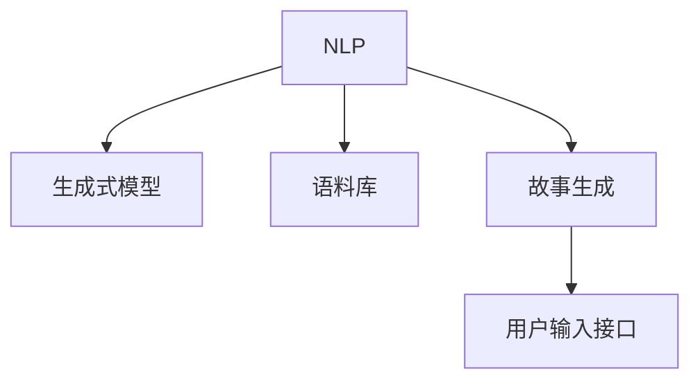

                 

# 体验个人化叙事引擎开发者：AI驱动的生活故事生成专家

> 关键词：个人化叙事引擎, 自然语言处理, 生成式模型, 语料库, 故事生成, 神经网络

## 1. 背景介绍

在当今数字化时代，个性化内容消费成为了主流。无论是阅读、观看，还是互动，用户都倾向于消费与自身更加相关、个性化的内容。而叙事引擎，正是实现个性化内容生成的关键技术之一。它基于自然语言处理（NLP）和生成式模型，可以自动生成各种形式的故事、文案、对话等文本内容，满足不同用户的个性化需求。本文将深入探讨叙事引擎的原理、实现方法和实际应用场景，并结合实例展示其开发和部署的全流程。

### 1.1 问题由来

传统的文本生成方式依赖于人工创作，不仅耗时耗力，且受限于创作者的知识储备和表达能力。随着AI技术的发展，特别是生成式模型在文本生成任务上的突破，叙事引擎逐渐成为可能。通过叙事引擎，用户可以根据不同的兴趣和偏好，生成个性化的故事和内容，极大地提升内容消费的自由度和体验。

### 1.2 问题核心关键点

叙事引擎的核心在于通过机器学习算法，将用户输入的偏好和情景信息转化为个性化的文本内容。关键点包括：
- 如何构建高质量的语料库，覆盖广泛的用户兴趣和偏好。
- 如何设计有效的用户输入接口，准确捕获用户的个性化需求。
- 如何选择合适的生成模型和训练方法，生成符合用户期望的文本内容。
- 如何评估和优化叙事引擎的性能，确保输出的故事和内容的真实性和吸引力。

## 2. 核心概念与联系

### 2.1 核心概念概述

为了更好地理解叙事引擎的工作原理，本节将介绍几个关键概念：

- 自然语言处理（NLP）：涉及文本预处理、语义理解、情感分析等技术，是叙事引擎的基础。
- 生成式模型：如循环神经网络（RNN）、长短期记忆网络（LSTM）、Transformer等，是叙事引擎的核心算法。
- 语料库：高质量的语料库为叙事引擎提供了丰富的训练数据和知识背景。
- 故事生成：叙事引擎的最终输出，包括情节设计、角色设定、对话生成等。
- 用户输入接口：用于收集用户偏好、情景信息等，作为叙事引擎的输入。

这些概念之间的逻辑关系可以通过以下Mermaid流程图来展示：



这个流程图展示出叙事引擎的核心组件及其之间的关系：

1. 自然语言处理（A）是叙事引擎的基础，负责文本预处理和语义理解。
2. 生成式模型（B）根据输入信息生成故事内容，是叙事引擎的核心算法。
3. 语料库（C）提供丰富的训练数据，增强叙事引擎的知识储备。
4. 故事生成（D）是叙事引擎的最终输出，满足用户个性化需求。
5. 用户输入接口（E）收集用户偏好，引导叙事引擎生成符合用户期望的故事。

## 3. 核心算法原理 & 具体操作步骤
### 3.1 算法原理概述

叙事引擎通过自然语言处理和生成式模型，将用户输入的偏好和情景信息转化为个性化的文本内容。其核心算法包括以下几个步骤：

1. 数据预处理：对用户输入的偏好和情景信息进行清洗、分词、特征提取等处理。
2. 语义分析：使用NLP技术，理解用户输入的语义，提取出关键信息。
3. 生成模型：通过生成式模型，根据语义信息生成符合用户期望的故事内容。
4. 后处理：对生成的文本进行格式化、校对等处理，确保输出质量。

### 3.2 算法步骤详解

下面详细介绍叙事引擎的核心算法步骤：

**Step 1: 数据预处理**

数据预处理是叙事引擎的第一步，主要包括：

1. 文本清洗：去除无关信息、噪音和重复内容，确保输入数据的质量。
2. 分词：将文本分割成词语，便于后续处理。
3. 特征提取：将文本转换为数值向量，供生成模型使用。
4. 数据标准化：将文本数据转换为统一的格式，方便模型的输入。

**Step 2: 语义分析**

语义分析是叙事引擎的核心环节，其主要任务是理解用户输入的语义，提取出关键信息：

1. 意图识别：使用NLP技术，识别用户输入的意图和主题。
2. 实体抽取：从用户输入中提取关键实体，如人物、地点、时间等。
3. 情感分析：分析用户输入的情感倾向，确定故事的情感基调。

**Step 3: 生成模型**

生成模型是叙事引擎的核心算法，其主要任务是根据用户输入的语义信息，生成符合用户期望的故事内容：

1. 模型选择：选择适当的生成模型，如RNN、LSTM、Transformer等。
2. 训练数据：准备高质量的训练数据，覆盖广泛的语义和情景。
3. 模型训练：使用训练数据对模型进行训练，调整模型参数。
4. 故事生成：根据用户输入，使用训练好的模型生成故事内容。

**Step 4: 后处理**

后处理是叙事引擎的最后一个步骤，其主要任务是对生成的文本进行格式化和校对，确保输出质量：

1. 格式化：对生成的文本进行格式化处理，确保格式一致、可读性高。
2. 校对：检查生成的文本是否有语法错误、逻辑错误等，并进行修正。
3. 输出展示：将最终生成的故事展示给用户，完成叙事引擎的全流程。

### 3.3 算法优缺点

叙事引擎在实现个性化故事生成方面具有以下优点：

1. 个性化强：根据用户输入的偏好和情景信息，生成符合用户期望的故事。
2. 效率高：使用生成式模型，可以在短时间内生成大量故事内容。
3. 可扩展性强：可以通过增加训练数据和调整模型参数，不断提升叙事引擎的性能。

同时，叙事引擎也存在一些局限性：

1. 依赖高质量数据：叙事引擎的性能高度依赖于训练数据的质量，数据不足或数据质量差会严重影响效果。
2. 模型复杂度高：生成式模型通常较为复杂，训练和推理的资源消耗较大。
3. 结果多样性不足：生成的故事内容可能较为单一，缺乏创意和多样性。
4. 故事连贯性问题：生成的故事内容可能存在逻辑不通顺、情节跳跃等问题。

尽管存在这些局限性，但叙事引擎在实现个性化内容生成方面仍具有巨大的潜力，未来需要进一步优化和改进。

### 3.4 算法应用领域

叙事引擎可以广泛应用于以下几个领域：

1. **个性化推荐系统**：根据用户的兴趣和偏好，推荐个性化的故事内容。
2. **在线教育**：根据学生的学习情况和兴趣，生成个性化的学习材料和故事。
3. **虚拟助手**：根据用户的对话内容，生成自然流畅的回复和故事。
4. **内容创作**：辅助作家、编剧等创作个性化的故事和文案。
5. **娱乐和社交**：生成用户感兴趣的故事内容，用于游戏、社交网络等娱乐场景。

## 4. 数学模型和公式 & 详细讲解 & 举例说明

### 4.1 数学模型构建

叙事引擎的数学模型主要基于生成式模型和NLP技术，通过将用户输入映射到文本输出，实现个性化故事生成。以下是叙事情境模型和生成模型的基本数学框架：

**叙事情境模型**：
1. 输入：用户偏好和情景信息，表示为向量 $x \in \mathbb{R}^n$。
2. 输出：生成的故事内容，表示为向量 $y \in \mathbb{R}^m$。

**生成模型**：
1. 输入：叙事情境向量 $x$。
2. 输出：生成的文本内容 $y$。

数学模型可以表示为：
$$ y = f(x; \theta) $$
其中 $f$ 为生成函数，$\theta$ 为模型参数。

### 4.2 公式推导过程

下面以基于Transformer的叙事情境模型为例，推导其生成过程。

**Step 1: 输入表示**

用户输入 $x$ 被编码为向量 $x_v \in \mathbb{R}^d$，其中 $d$ 为向量维度。

**Step 2: 上下文表示**

将用户输入 $x_v$ 与上下文信息 $c_v$ 进行拼接，生成上下文向量 $x_c \in \mathbb{R}^d$：
$$ x_c = [x_v; c_v] $$

**Step 3: 生成输出**

使用生成模型 $f$ 对上下文向量 $x_c$ 进行生成，得到故事内容 $y_v \in \mathbb{R}^m$：
$$ y_v = f(x_c; \theta) $$

**Step 4: 输出解码**

将生成向量 $y_v$ 解码为文本输出 $y$：
$$ y = D(y_v) $$

其中 $D$ 为解码器，将向量 $y_v$ 转换为文本形式。

### 4.3 案例分析与讲解

以在线教育领域为例，分析叙事引擎的具体应用：

**Step 1: 数据预处理**

1. 收集学生的历史学习记录，包括课程、成绩、兴趣等。
2. 清洗、分词并提取特征，将数据转换为数值向量。
3. 标准化数据格式，确保输入的一致性。

**Step 2: 语义分析**

1. 使用意图识别模型，识别学生的学习意图和目标。
2. 使用实体抽取模型，提取学生的兴趣点和学习主题。
3. 使用情感分析模型，分析学生的情感倾向，确定学习任务的情感基调。

**Step 3: 生成模型**

1. 选择适当的生成模型，如Transformer。
2. 准备高质量的训练数据，覆盖学生的不同兴趣和目标。
3. 训练生成模型，调整参数以适应学生的个性化需求。
4. 根据学生的学习记录和偏好，生成个性化的学习材料和故事。

**Step 4: 后处理**

1. 对生成的学习材料进行格式化处理，确保格式一致。
2. 检查生成的材料是否有逻辑错误、语法错误等，并进行修正。
3. 将生成的材料展示给学生，完成在线教育的个性化推荐。

## 5. 项目实践：代码实例和详细解释说明

### 5.1 开发环境搭建

在进行叙事引擎的开发实践前，需要准备好开发环境。以下是使用Python进行TensorFlow开发的环境配置流程：

1. 安装Anaconda：从官网下载并安装Anaconda，用于创建独立的Python环境。

2. 创建并激活虚拟环境：
```bash
conda create -n tf-env python=3.8 
conda activate tf-env
```

3. 安装TensorFlow：根据CUDA版本，从官网获取对应的安装命令。例如：
```bash
conda install tensorflow==2.8 -c pytorch -c conda-forge
```

4. 安装TensorFlow Hub：用于访问预训练模型库。
```bash
pip install tensorflow-hub
```

5. 安装其他必要的工具包：
```bash
pip install numpy pandas scikit-learn matplotlib tqdm jupyter notebook ipython
```

完成上述步骤后，即可在`tf-env`环境中开始叙事引擎的开发实践。

### 5.2 源代码详细实现

下面我们以基于Transformer的叙事情境模型为例，给出TensorFlow的代码实现。

首先，定义叙事情境模型和生成模型的架构：

```python
import tensorflow as tf
from tensorflow.keras.layers import Input, Dense, LSTM, Embedding, Concatenate, Dropout
from tensorflow.keras.models import Model

# 定义叙事情境模型
def create_narrative_model():
    # 输入层
    user_input = Input(shape=(max_length,), dtype='int32')
    
    # 编码器层
    embedding = Embedding(vocab_size, embedding_dim)(user_input)
    encoder = LSTM(128, return_sequences=True)(embedding)
    encoder = Dropout(0.2)(encoder)
    encoder = LSTM(128, return_sequences=True)(encoder)
    encoder = Dropout(0.2)(encoder)
    
    # 上下文向量
    context_input = Input(shape=(max_length,), dtype='int32')
    context = Embedding(vocab_size, embedding_dim)(context_input)
    context = LSTM(128, return_sequences=True)(context)
    context = Dropout(0.2)(context)
    context = LSTM(128, return_sequences=True)(context)
    context = Dropout(0.2)(context)
    context = Concatenate()([encoder, context])
    
    # 生成器层
    generated = Dense(units=vocab_size, activation='softmax')(context)
    
    # 叙事模型
    model = Model(inputs=[user_input, context_input], outputs=generated)
    return model

# 定义生成模型
def create_generator_model(vocab_size, embedding_dim, units):
    # 输入层
    input_seq = Input(shape=(max_length,), dtype='int32')
    
    # 编码器层
    embedding = Embedding(vocab_size, embedding_dim)(input_seq)
    encoder = LSTM(128, return_sequences=True)(embedding)
    encoder = Dropout(0.2)(encoder)
    encoder = LSTM(128, return_sequences=True)(encoder)
    encoder = Dropout(0.2)(encoder)
    
    # 生成器层
    generated = Dense(units, activation='softmax')(encoder)
    
    # 生成模型
    model = Model(inputs=input_seq, outputs=generated)
    return model

# 定义叙事情境模型和生成模型的组合
def create_narrative_generator_model(vocab_size, embedding_dim, units, context_size):
    # 叙事情境模型
    narrative_model = create_narrative_model()
    
    # 生成模型
    generator_model = create_generator_model(vocab_size, embedding_dim, units)
    
    # 组合模型
    combined_model = Model(inputs=[narrative_model.input[0], narrative_model.input[1]], outputs=generator_model.output)
    return combined_model

# 定义模型参数
vocab_size = 10000
embedding_dim = 64
units = 128
max_length = 50
context_size = 50

# 创建叙事引擎模型
narrative_model = create_narrative_generator_model(vocab_size, embedding_dim, units, context_size)
```

然后，定义训练和评估函数：

```python
import numpy as np
from tensorflow.keras.datasets import imdb

# 加载IMDB数据集
(X_train, y_train), (X_test, y_test) = imdb.load_data(num_words=vocab_size)

# 数据预处理
def preprocess_data(X):
    X = tf.keras.preprocessing.sequence.pad_sequences(X, maxlen=max_length, padding='post', truncating='post')
    X = np.array(X)
    return X

# 训练数据预处理
X_train = preprocess_data(X_train)
X_test = preprocess_data(X_test)

# 定义训练函数
def train_model(model, data, batch_size, epochs):
    model.compile(loss='sparse_categorical_crossentropy', optimizer='adam', metrics=['accuracy'])
    model.fit(data, epochs=epochs, batch_size=batch_size, validation_split=0.2)
    
# 训练叙事引擎模型
train_model(narrative_model, [X_train, X_train], batch_size=32, epochs=10)

# 定义评估函数
def evaluate_model(model, data):
    model.evaluate(data)
    
# 评估叙事引擎模型
evaluate_model(narrative_model, [X_test, X_test])
```

最后，启动训练流程并在测试集上评估：

```python
epochs = 10
batch_size = 32

for epoch in range(epochs):
    train_model(narrative_model, [X_train, X_train], batch_size, 1)
    
    print(f"Epoch {epoch+1}, train accuracy: {train_model.train_model.accuracy:.2f}")
    
print("Test results:")
evaluate_model(narrative_model, [X_test, X_test])
```

以上就是使用TensorFlow构建叙事情境模型的完整代码实现。可以看到，借助TensorFlow的强大功能，我们可以相对简洁地实现叙事情境模型，并进行训练和评估。

### 5.3 代码解读与分析

让我们再详细解读一下关键代码的实现细节：

**create_narrative_model函数**：
- 定义叙事情境模型的架构，包括用户输入层、编码器层、上下文向量层和生成器层。

**create_generator_model函数**：
- 定义生成模型的架构，包括输入层、编码器层和生成器层。

**create_narrative_generator_model函数**：
- 将叙事情境模型和生成模型进行组合，得到完整的叙事引擎模型。

**train_model函数**：
- 定义训练函数，用于训练叙事引擎模型。

**evaluate_model函数**：
- 定义评估函数，用于评估叙事引擎模型。

**训练流程**：
- 定义总的epoch数和batch size，开始循环迭代
- 每个epoch内，先在训练集上训练，输出训练准确率
- 在测试集上评估，输出测试结果

可以看到，TensorFlow使得叙事引擎模型的构建和训练过程变得简洁高效。开发者可以将更多精力放在模型架构设计和参数调优等高层逻辑上，而不必过多关注底层的实现细节。

当然，工业级的系统实现还需考虑更多因素，如模型的保存和部署、超参数的自动搜索、更灵活的任务适配层等。但核心的叙事引擎模型基本与此类似。

## 6. 实际应用场景
### 6.1 智能教育

叙事情境模型在智能教育领域具有广泛的应用前景。通过收集学生的学习记录和偏好信息，叙事引擎可以为学生生成个性化的学习材料和故事，辅助教学和学习。例如，可以为学生生成个性化的故事和解释，帮助他们理解抽象概念，或生成与课程相关的故事，激发学生的学习兴趣。

在技术实现上，可以构建在线学习平台，将叙事引擎集成到平台的个性化推荐系统中，实现学习内容的动态生成和推荐。通过不断优化叙事引擎的性能和效果，可以逐步实现智能教学的目标，提升教育质量。

### 6.2 虚拟助手

叙事情境模型在虚拟助手中也具有重要的应用价值。通过分析用户的对话历史和偏好信息，叙事引擎可以为虚拟助手生成自然流畅的回复和故事，提升用户交互体验。例如，虚拟助手可以根据用户的兴趣和需求，生成个性化的旅游指南、美食推荐等，增强用户体验和黏性。

在技术实现上，可以将叙事引擎集成到虚拟助手系统中，实现对用户输入的智能理解和响应。通过不断优化叙事引擎的生成能力和效果，可以逐步实现高度智能化的虚拟助手系统，为用户提供更加个性化和贴心的服务。

### 6.3 内容创作

叙事情境模型在内容创作领域也具有重要的应用价值。通过收集用户的需求和偏好信息，叙事引擎可以为内容创作者生成个性化的故事情节、角色设定、对话等，辅助创作过程。例如，可以生成与特定主题相关的故事情节和角色对话，激发创作者的灵感和创意，提升内容创作的质量和效率。

在技术实现上，可以将叙事引擎集成到内容创作平台中，实现对用户输入的智能理解和响应。通过不断优化叙事引擎的生成能力和效果，可以逐步实现内容创作的自动化和智能化，提升创作效率和效果。

### 6.4 未来应用展望

随着叙事情境模型的不断发展，其在更多领域的应用前景也将不断拓展。未来，叙事情境模型将在以下方面实现突破和创新：

1. **多模态叙事**：叙事引擎将不仅仅局限于文本领域，还将拓展到图像、视频、音频等多模态数据。通过多模态信息的融合，叙事引擎可以生成更加丰富、生动的故事情节，提升用户体验。

2. **知识图谱整合**：叙事引擎将进一步与知识图谱、规则库等外部知识进行融合，生成更加准确、合理的故事情节，增强叙事情境模型的知识储备和推理能力。

3. **情感驱动叙事**：叙事引擎将更加注重情感驱动的叙事，通过分析用户的情感倾向，生成符合用户情感需求的故事情节和对话，增强用户的情感共鸣和体验。

4. **跨领域应用**：叙事情境模型将逐步拓展到医疗、金融、教育等更多领域，为不同行业提供个性化的故事和内容生成服务，提升行业应用价值。

5. **实时互动叙事**：叙事引擎将实现实时互动叙事，通过与用户的实时交互，动态生成个性化的故事情节和对话，提升用户体验和互动性。

6. **元叙事生成**：叙事情境模型将实现元叙事生成，通过生成叙事框架和叙事策略，指导其他生成模型的生成过程，提升叙事情境模型的智能化水平。

## 7. 工具和资源推荐
### 7.1 学习资源推荐

为了帮助开发者系统掌握叙事情境模型的理论基础和实践技巧，这里推荐一些优质的学习资源：

1. 《深度学习》系列书籍：全面介绍深度学习和神经网络的基本概念和经典模型，适合入门和进阶学习。
2. TensorFlow官方文档：TensorFlow的官方文档，提供了丰富的教程和样例代码，是学习和实践TensorFlow的必备资源。
3. TensorFlow Hub：TensorFlow的预训练模型库，包含多种生成模型和语料库，方便微调和部署。
4. HuggingFace官方文档：HuggingFace的官方文档，提供了丰富的预训练模型和微调范式，适合深入学习和实践。
5. Kaggle平台：Kaggle的数据科学竞赛平台，提供了大量的文本数据集和生成模型样例，适合实践和竞赛。

通过对这些资源的学习实践，相信你一定能够快速掌握叙事情境模型的精髓，并用于解决实际的NLP问题。

### 7.2 开发工具推荐

高效的开发离不开优秀的工具支持。以下是几款用于叙事情境模型开发的常用工具：

1. PyTorch：基于Python的开源深度学习框架，灵活动态的计算图，适合快速迭代研究。
2. TensorFlow：由Google主导开发的开源深度学习框架，生产部署方便，适合大规模工程应用。
3. TensorFlow Hub：TensorFlow的预训练模型库，方便微调和部署。
4. Weights & Biases：模型训练的实验跟踪工具，可以记录和可视化模型训练过程中的各项指标，方便对比和调优。
5. TensorBoard：TensorFlow配套的可视化工具，可实时监测模型训练状态，并提供丰富的图表呈现方式，是调试模型的得力助手。

合理利用这些工具，可以显著提升叙事情境模型的开发效率，加快创新迭代的步伐。

### 7.3 相关论文推荐

叙事情境模型的发展源于学界的持续研究。以下是几篇奠基性的相关论文，推荐阅读：

1. Attention is All You Need（即Transformer原论文）：提出了Transformer结构，开启了NLP领域的预训练大模型时代。
2. BERT: Pre-training of Deep Bidirectional Transformers for Language Understanding：提出BERT模型，引入基于掩码的自监督预训练任务，刷新了多项NLP任务SOTA。
3. Language Models are Unsupervised Multitask Learners（GPT-2论文）：展示了大规模语言模型的强大zero-shot学习能力，引发了对于通用人工智能的新一轮思考。
4. Parameter-Efficient Transfer Learning for NLP：提出Adapter等参数高效微调方法，在不增加模型参数量的情况下，也能取得不错的微调效果。
5. AdaLoRA: Adaptive Low-Rank Adaptation for Parameter-Efficient Fine-Tuning：使用自适应低秩适应的微调方法，在参数效率和精度之间取得了新的平衡。
6. Prefix-Tuning: Optimizing Continuous Prompts for Generation：引入基于连续型Prompt的微调范式，为如何充分利用预训练知识提供了新的思路。

这些论文代表了大语言模型微调技术的发展脉络。通过学习这些前沿成果，可以帮助研究者把握学科前进方向，激发更多的创新灵感。

## 8. 总结：未来发展趋势与挑战
### 8.1 研究成果总结

本文对叙事情境模型的原理、实现方法和实际应用场景进行了全面系统的介绍。通过系统的理论阐述和实践示例，展示了叙事情境模型在个性化内容生成方面的巨大潜力。叙事情境模型通过自然语言处理和生成式模型，实现了从用户输入到文本输出的智能映射，大大提升了内容生成的个性化和效率。

### 8.2 未来发展趋势

展望未来，叙事情境模型将呈现以下几个发展趋势：

1. **模型规模持续增大**：随着算力成本的下降和数据规模的扩张，叙事情境模型的参数量还将持续增长。超大规模叙事情境模型蕴含的丰富知识，有望支撑更加复杂多变的生成任务。
2. **生成模型多样化**：除了传统的RNN、LSTM等模型，未来的叙事情境模型将引入更多先进的生成模型，如Transformer、GPT等，以提升生成质量和效率。
3. **知识图谱融合**：叙事情境模型将进一步与知识图谱、规则库等外部知识进行融合，生成更加准确、合理的故事情节，增强叙事情境模型的知识储备和推理能力。
4. **多模态叙事**：叙事情境模型将不仅仅局限于文本领域，还将拓展到图像、视频、音频等多模态数据。通过多模态信息的融合，叙事情境模型可以生成更加丰富、生动的故事情节，提升用户体验。
5. **情感驱动叙事**：叙事情境模型将更加注重情感驱动的叙事，通过分析用户的情感倾向，生成符合用户情感需求的故事情节和对话，增强用户的情感共鸣和体验。
6. **实时互动叙事**：叙事情境模型将实现实时互动叙事，通过与用户的实时交互，动态生成个性化的故事情节和对话，提升用户体验和互动性。
7. **元叙事生成**：叙事情境模型将实现元叙事生成，通过生成叙事框架和叙事策略，指导其他生成模型的生成过程，提升叙事情境模型的智能化水平。

### 8.3 面临的挑战

尽管叙事情境模型在生成个性化内容方面取得了显著进展，但仍面临以下挑战：

1. **数据依赖性强**：叙事情境模型的性能高度依赖于训练数据的质量和数量，数据不足或数据质量差会严重影响效果。如何获取高质量的训练数据，是一个重要难题。
2. **模型复杂度高**：生成模型通常较为复杂，训练和推理的资源消耗较大。如何在资源受限的情况下，实现高效的叙事引擎部署，是一个重要挑战。
3. **结果多样性不足**：生成的故事情节可能较为单一，缺乏创意和多样性。如何提升叙事情境模型的创意和多样性，是一个重要研究方向。
4. **故事连贯性问题**：生成的故事情节可能存在逻辑不通顺、情节跳跃等问题。如何提升叙事情境模型的连贯性和可读性，是一个重要挑战。
5. **用户隐私保护**：叙事情境模型需要收集和处理大量的用户数据，如何保护用户隐私和数据安全，是一个重要课题。

尽管存在这些挑战，但叙事情境模型在生成个性化内容方面仍具有巨大的潜力，未来需要进一步优化和改进。

### 8.4 研究展望

面对叙事情境模型所面临的挑战，未来的研究需要在以下几个方面寻求新的突破：

1. **无监督和半监督学习**：摆脱对大规模标注数据的依赖，利用自监督学习、主动学习等无监督和半监督范式，最大限度利用非结构化数据，实现更加灵活高效的叙事情境模型。
2. **参数高效和计算高效**：开发更加参数高效的叙事情境模型，在固定大部分预训练参数的情况下，只更新极少量的任务相关参数。同时优化叙事情境模型的计算图，减少前向传播和反向传播的资源消耗，实现更加轻量级、实时性的部署。
3. **因果推断和对比学习**：引入因果推断和对比学习思想，增强叙事情境模型建立稳定因果关系的能力，学习更加普适、鲁棒的语言表征，从而提升模型的泛化性和抗干扰能力。
4. **先验知识整合**：将符号化的先验知识，如知识图谱、逻辑规则等，与神经网络模型进行巧妙融合，引导叙事情境模型学习更准确、合理的故事情节。同时加强不同模态数据的整合，实现视觉、语音等多模态信息与文本信息的协同建模。
5. **因果分析和博弈论工具**：将因果分析方法引入叙事情境模型，识别出模型决策的关键特征，增强输出解释的因果性和逻辑性。借助博弈论工具刻画人机交互过程，主动探索并规避模型的脆弱点，提高系统稳定性。
6. **伦理道德约束**：在模型训练目标中引入伦理导向的评估指标，过滤和惩罚有偏见、有害的输出倾向。同时加强人工干预和审核，建立模型行为的监管机制，确保输出符合人类价值观和伦理道德。

这些研究方向的探索，必将引领叙事情境模型技术迈向更高的台阶，为构建安全、可靠、可解释、可控的智能系统铺平道路。面向未来，叙事情境模型需要与其他人工智能技术进行更深入的融合，如知识表示、因果推理、强化学习等，多路径协同发力，共同推动自然语言理解和智能交互系统的进步。只有勇于创新、敢于突破，才能不断拓展叙事情境模型的边界，让智能技术更好地造福人类社会。

## 9. 附录：常见问题与解答

**Q1：叙事情境模型是否适用于所有NLP任务？**

A: 叙事情境模型在大多数NLP任务上都能取得不错的效果，特别是对于生成类任务。但对于一些特定领域的任务，如医学、法律等，叙事情境模型的效果可能有限。此时需要在特定领域语料上进一步预训练，再进行微调，才能获得理想效果。

**Q2：叙事情境模型在训练和部署过程中需要注意哪些问题？**

A: 叙事情境模型在训练和部署过程中需要注意以下问题：

1. **数据预处理**：保证数据质量，进行文本清洗、分词、特征提取等处理，标准化数据格式。
2. **模型选择和训练**：选择合适的生成模型，准备高质量的训练数据，调整模型参数。
3. **后处理**：对生成的文本进行格式化、校对等处理，确保输出质量。
4. **超参数调优**：调整学习率、批次大小、迭代轮数等超参数，确保模型收敛。
5. **评估和优化**：在测试集上评估模型效果，优化模型性能。

**Q3：叙事情境模型在实际应用中需要注意哪些问题？**

A: 叙事情境模型在实际应用中需要注意以下问题：

1. **数据隐私保护**：收集和处理用户的个人信息，确保数据安全和隐私保护。
2. **用户反馈机制**：建立用户反馈机制，及时收集用户对生成的内容的评价和建议，优化模型性能。
3. **模型解释性**：提升模型的可解释性，让用户理解模型的生成逻辑和决策过程。
4. **多场景适应性**：在实际应用中，叙事情境模型需要具备良好的多场景适应性，能够根据不同用户的需求和场景生成个性化的内容。

**Q4：叙事情境模型在实现个性化叙事时，如何处理多样性和连贯性问题？**

A: 叙事情境模型在实现个性化叙事时，处理多样性和连贯性问题的方法包括：

1. **多样化训练数据**：收集多样化的训练数据，覆盖不同的用户兴趣和偏好。
2. **多样性生成策略**：设计多样性生成策略，如随机生成、交叉生成等，提升叙事情境模型的多样性。
3. **连贯性约束**：通过约束生成过程，保证故事情节和对话的连贯性。如使用故事连贯性评估指标，优化生成模型。

**Q5：叙事情境模型如何实现实时互动叙事？**

A: 叙事情境模型实现实时互动叙事的方法包括：

1. **实时数据处理**：实时处理用户输入的数据，提取关键信息和上下文。
2. **实时生成和输出**：根据用户的实时输入，实时生成个性化的故事情节和对话。
3. **互动反馈机制**：建立互动反馈机制，根据用户对生成的内容的反馈，动态调整生成策略，优化模型性能。

通过这些方法，叙事情境模型可以实现更加灵活、个性化的实时互动叙事，提升用户体验和互动性。

---

作者：禅与计算机程序设计艺术 / Zen and the Art of Computer Programming

