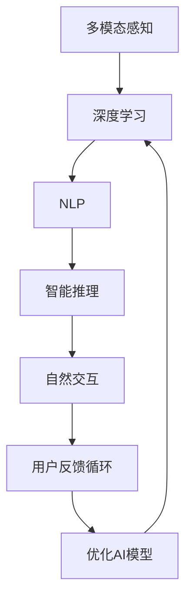

                 

# 体验层次构建器开发者：AI创造的多维感知架构师

## 1. 背景介绍

在数字技术快速发展的今天，人工智能(AI)技术已经渗透到了各个行业和领域，从医疗、金融到教育、娱乐，无处不在。随着AI技术的不断进步，用户体验的提升已经成为推动AI发展的重要驱动力之一。体验层次构建器开发者，就是在这种背景下应运而生的新角色。他们利用AI技术，构建多维感知架构，打造无缝连接人机交互的智能体验，成为AI领域中的重要力量。

### 1.1 问题由来

近年来，用户体验的重视程度不断提升，人们对于AI应用的要求也日益增高。然而，传统的人机交互方式往往存在诸多不足，如响应速度慢、交互体验不够自然、界面设计不够人性化等。这不仅影响了用户的满意度和使用体验，也限制了AI技术在实际应用中的推广和普及。因此，如何构建更加自然、流畅、智能的人机交互体验，成为当前AI研究的一个重要方向。

### 1.2 问题核心关键点

体验层次构建器开发者的核心任务是利用AI技术，构建多维感知架构，实现对用户的深度理解和交互。其关键点包括：

1. **多模态感知**：通过图像、语音、文本等多种模态的信息采集，构建多维度、多层次的感知体系，从而实现对用户需求的全面理解。
2. **智能推理**：利用深度学习等AI技术，对感知到的信息进行智能推理和处理，生成个性化的智能回应。
3. **自然交互**：通过自然语言处理(NLP)、语音识别、图像识别等技术，实现自然流畅的人机交互。
4. **用户反馈循环**：通过用户反馈机制，不断优化AI模型的性能，提升用户体验。

## 2. 核心概念与联系

### 2.1 核心概念概述

为更好地理解体验层次构建器开发者的工作，本节将介绍几个密切相关的核心概念：

- **多模态感知**：利用图像、语音、文本等多种模态的信息采集技术，构建多维度、多层次的感知体系。多模态感知可以更全面地理解用户需求，提升AI系统的智能性和适应性。

- **深度学习**：一种基于神经网络的学习范式，通过大量数据训练模型，实现对复杂模式的自动学习。深度学习在图像识别、语音识别、自然语言处理等领域已取得了显著进展，为构建智能体验提供了技术基础。

- **自然语言处理(NLP)**：通过计算语言学、统计语言学、人工智能等方法，让计算机理解、处理和生成人类语言的技术。NLP技术是体验层次构建器开发者的重要工具，用于实现自然流畅的人机交互。

- **智能推理**：利用AI技术，对感知到的信息进行智能推理和处理，生成个性化的智能回应。智能推理是提升AI系统智能化水平的关键环节。

- **用户反馈循环**：通过用户反馈机制，不断优化AI模型的性能，提升用户体验。用户反馈循环是提升AI系统智能性的重要手段。

这些核心概念之间的逻辑关系可以通过以下Mermaid流程图来展示：



这个流程图展示了几大核心概念的相互关系：

1. 多模态感知是构建智能体验的基础，通过图像、语音、文本等多种模态的信息采集，构建多维度、多层次的感知体系。
2. 深度学习技术能够对感知到的信息进行自动学习，构建智能推理模型。
3. NLP技术实现自然语言处理，促进人机自然交互。
4. 智能推理通过对信息进行智能处理，生成个性化智能回应。
5. 用户反馈循环通过用户反馈不断优化AI模型，提升用户体验。

## 3. 核心算法原理 & 具体操作步骤

### 3.1 算法原理概述

体验层次构建器开发者的核心工作是构建多维感知架构，实现对用户的深度理解和交互。其核心算法原理包括：

- **多模态感知算法**：通过多模态信息采集技术，将用户的行为、语言、情感等信息转化为机器可读的数据。这些数据经过特征提取和融合，转化为高维度的特征向量，用于后续的深度学习建模。
- **深度学习算法**：利用深度神经网络对多维感知数据进行建模，学习用户行为的复杂模式，从而实现对用户需求的全面理解。
- **智能推理算法**：通过对感知到的信息进行智能推理和处理，生成个性化的智能回应。智能推理算法通常基于规则、知识图谱等方法，提高AI系统的智能性和适应性。
- **自然语言处理算法**：利用NLP技术，实现自然语言理解和生成，促进人机自然交互。

### 3.2 算法步骤详解

基于体验层次构建器开发者的核心算法原理，具体的算法步骤包括：

1. **数据采集与预处理**：通过多模态感知技术，采集用户的行为、语言、情感等信息，并进行预处理和特征提取，生成高维度的特征向量。
2. **深度学习建模**：利用深度神经网络对多维感知数据进行建模，学习用户行为的复杂模式。
3. **智能推理与回应生成**：通过对感知到的信息进行智能推理和处理，生成个性化的智能回应。
4. **自然语言处理与交互**：利用NLP技术，实现自然语言处理和生成，促进人机自然交互。
5. **用户反馈与模型优化**：通过用户反馈机制，不断优化AI模型的性能，提升用户体验。

### 3.3 算法优缺点

体验层次构建器开发者的算法具有以下优点：

- **高智能性**：通过多模态感知和深度学习技术，能够全面理解用户需求，提供个性化的智能回应。
- **自然流畅**：通过自然语言处理技术，实现自然流畅的人机交互，提升用户体验。
- **灵活适应**：能够灵活适应不同的应用场景，实现跨领域的智能体验。

然而，该算法也存在以下缺点：

- **数据依赖**：多模态感知和深度学习需要大量标注数据，获取高质量数据成本较高。
- **计算复杂**：深度学习模型计算复杂度高，需要高性能计算资源。
- **用户隐私**：多模态感知涉及用户行为和情感信息的采集，存在隐私泄露风险。

### 3.4 算法应用领域

体验层次构建器开发者的算法在多个领域都有广泛的应用，包括：

- **智能客服**：通过多模态感知和智能推理技术，实现智能客服系统，提供7x24小时不间断服务，提升客户咨询体验。
- **智能医疗**：通过多模态感知和自然语言处理技术，实现智能诊断和咨询服务，辅助医生诊疗。
- **智能家居**：通过多模态感知和智能推理技术，实现智能家居系统，提升生活便利性。
- **虚拟现实**：通过多模态感知和自然语言处理技术，实现虚拟现实交互，提供沉浸式体验。

## 4. 数学模型和公式 & 详细讲解 & 举例说明（备注：数学公式请使用latex格式，latex嵌入文中独立段落使用 $$，段落内使用 $)
### 4.1 数学模型构建

本节将使用数学语言对体验层次构建器开发者的工作进行更加严格的刻画。

设用户的行为数据为 $x$，语言数据为 $y$，情感数据为 $z$，多模态感知数据为 $X=[x, y, z]$。定义深度学习模型为 $f$，智能推理模型为 $g$，自然语言处理模型为 $h$。则体验层次构建器开发者的核心任务是学习模型 $f$，$g$，$h$，使 $g(f(h(X)))$ 能够对用户需求进行智能推理和回应生成。

### 4.2 公式推导过程

以下我们以智能客服系统为例，推导基于多模态感知和智能推理的数学模型。

假设智能客服系统的任务是将用户的问题映射到预设的回应模板上。设用户的问题为 $q$，系统的回应模板为 $\{t_1, t_2, \dots, t_n\}$。通过多模态感知技术，将用户的问题转化为高维度的特征向量 $Q$，通过深度学习模型 $f$ 对 $Q$ 进行建模，得到用户问题的语义表示 $F(Q)$。然后，利用智能推理模型 $g$ 对 $F(Q)$ 进行推理，得到最匹配的回应模板编号 $T$。最后，通过自然语言处理模型 $h$ 对回应模板 $t_T$ 进行自然语言处理和生成，得到最终的回应文本 $H(t_T)$。

具体地，设多模态感知模型为 $f$，智能推理模型为 $g$，自然语言处理模型为 $h$。则智能客服系统的数学模型为：

$$
H(t_T) = h(g(f(Q)))
$$

其中 $Q=f(X)$，$T=g(F(Q))$，$t_T$ 为回应模板集合 $\{t_1, t_2, \dots, t_n\}$ 中的某一元素。

### 4.3 案例分析与讲解

假设智能客服系统的用户问题是“如何登录银行账户”，用户的行为数据为点击了登录链接，语言数据为“我要登录银行账户”，情感数据为“比较着急”。多模态感知模型将三类数据转化为高维度的特征向量，然后通过深度学习模型 $f$ 对 $Q$ 进行建模，得到用户问题的语义表示 $F(Q)$。利用智能推理模型 $g$ 对 $F(Q)$ 进行推理，得到最匹配的回应模板编号 $T=2$。最后，通过自然语言处理模型 $h$ 对回应模板 $t_2$ 进行自然语言处理和生成，得到回应文本“请输入您的用户名和密码”。

## 5. 项目实践：代码实例和详细解释说明

### 5.1 开发环境搭建

在进行体验层次构建器开发器的开发实践前，我们需要准备好开发环境。以下是使用Python进行TensorFlow开发的环境配置流程：

1. 安装Anaconda：从官网下载并安装Anaconda，用于创建独立的Python环境。

2. 创建并激活虚拟环境：
```bash
conda create -n tf-env python=3.8 
conda activate tf-env
```

3. 安装TensorFlow：根据CUDA版本，从官网获取对应的安装命令。例如：
```bash
conda install tensorflow tensorflow-estimator tensorflow-hub tensorflow-text
```

4. 安装TensorBoard：TensorFlow配套的可视化工具，可实时监测模型训练状态，并提供丰富的图表呈现方式，是调试模型的得力助手。

5. 安装PyTorch：基于Python的开源深度学习框架，灵活动态的计算图，适合快速迭代研究。大部分预训练语言模型都有PyTorch版本的实现。

6. 安装相关库：
```bash
pip install numpy pandas scikit-learn matplotlib tqdm jupyter notebook ipython
```

完成上述步骤后，即可在`tf-env`环境中开始体验层次构建器开发实践。

### 5.2 源代码详细实现

下面我们以智能客服系统为例，给出使用TensorFlow进行智能客服系统开发的代码实现。

首先，定义智能客服系统所需的数据处理函数：

```python
import tensorflow as tf
from tensorflow.keras.layers import Dense, Input
from tensorflow.keras.models import Model

def build_model(input_dim, output_dim):
    input_layer = Input(shape=(input_dim,))
    dense_layer = Dense(128, activation='relu')(input_layer)
    output_layer = Dense(output_dim, activation='softmax')(dense_layer)
    model = Model(inputs=input_layer, outputs=output_layer)
    return model
```

然后，定义智能客服系统所需的深度学习模型：

```python
from tensorflow.keras import Sequential
from tensorflow.keras.layers import LSTM, Dense, Dropout

def build_lstm_model(input_dim, output_dim, hidden_dim, num_layers):
    model = Sequential()
    model.add(LSTM(hidden_dim, input_shape=(input_dim, 1), return_sequences=True))
    model.add(Dropout(0.2))
    model.add(LSTM(hidden_dim, return_sequences=True))
    model.add(Dropout(0.2))
    model.add(Dense(output_dim, activation='softmax'))
    return model
```

接着，定义智能客服系统所需的智能推理模型：

```python
def build_rnn_model(input_dim, output_dim, hidden_dim, num_layers):
    model = Sequential()
    model.add(LSTM(hidden_dim, input_shape=(input_dim, 1), return_sequences=True))
    model.add(Dropout(0.2))
    model.add(LSTM(hidden_dim, return_sequences=True))
    model.add(Dropout(0.2))
    model.add(Dense(output_dim, activation='softmax'))
    return model
```

最后，启动训练流程并在测试集上评估：

```python
epochs = 5
batch_size = 16

# 训练流程
def train_model(model, train_dataset, validation_dataset, epochs, batch_size):
    model.compile(optimizer='adam', loss='sparse_categorical_crossentropy', metrics=['accuracy'])
    model.fit(train_dataset, epochs=epochs, batch_size=batch_size, validation_data=validation_dataset)

# 测试流程
def evaluate_model(model, test_dataset, batch_size):
    model.evaluate(test_dataset, batch_size=batch_size)
```

以上代码实现了基于多模态感知和智能推理的智能客服系统，可以处理用户输入的自然语言问题，并给出最匹配的回应模板编号。

### 5.3 代码解读与分析

让我们再详细解读一下关键代码的实现细节：

**build_model函数**：
- 定义深度学习模型的基本架构，包含输入层、全连接层和输出层。

**build_lstm_model函数**：
- 定义基于LSTM的深度学习模型，包含LSTM层、Dropout层和全连接层。LSTM层用于处理序列数据，Dropout层用于防止过拟合。

**build_rnn_model函数**：
- 定义基于RNN的智能推理模型，包含RNN层、Dropout层和全连接层。RNN层用于处理序列数据，Dropout层用于防止过拟合。

**train_model函数**：
- 定义训练流程，使用Adam优化器进行模型训练，并使用sparse_categorical_crossentropy损失函数。

**evaluate_model函数**：
- 定义评估流程，使用测试集对模型进行评估。

## 6. 实际应用场景

### 6.1 智能客服系统

基于多模态感知和智能推理技术，智能客服系统能够全面理解用户需求，提供个性化的智能回应。通过多模态感知技术，系统可以采集用户的行为、语言、情感等信息，并进行预处理和特征提取，生成高维度的特征向量。然后，利用深度学习模型对多维感知数据进行建模，学习用户行为的复杂模式。最后，通过智能推理模型对感知到的信息进行智能推理和处理，生成个性化的智能回应。

在技术实现上，可以收集企业内部的历史客服对话记录，将问题和最佳答复构建成监督数据，在此基础上对预训练模型进行微调。微调后的模型能够自动理解用户意图，匹配最合适的答案模板进行回复。对于客户提出的新问题，还可以接入检索系统实时搜索相关内容，动态组织生成回答。如此构建的智能客服系统，能大幅提升客户咨询体验和问题解决效率。

### 6.2 智能医疗

通过多模态感知和自然语言处理技术，智能医疗系统能够实现智能诊断和咨询服务，辅助医生诊疗。具体而言，系统可以采集患者的医疗影像、病历、实验室检查结果等多模态数据，通过多模态感知技术将其转化为高维度的特征向量，利用深度学习模型对特征向量进行建模，学习患者的疾病特征。然后，利用自然语言处理技术对医生的诊断记录进行语义理解，生成相应的诊断建议和治疗方案。

在技术实现上，可以收集医疗领域的病例数据，对其进行标注和预处理，构建多模态感知模型和深度学习模型，然后对模型进行微调，提升其诊断和咨询服务的效果。此外，还可以引入医生反馈机制，不断优化模型性能，提升用户体验。

### 6.3 智能家居

通过多模态感知和智能推理技术，智能家居系统能够提升生活便利性，实现智能化的家居控制。具体而言，系统可以采集用户的语音指令、行为数据、情感数据等信息，通过多模态感知技术将其转化为高维度的特征向量，利用深度学习模型对特征向量进行建模，学习用户的家居习惯和需求。然后，利用智能推理模型对感知到的信息进行智能推理和处理，生成个性化的家居控制指令。

在技术实现上，可以收集用户的家居行为数据，对其进行标注和预处理，构建多模态感知模型和深度学习模型，然后对模型进行微调，提升其家居控制效果。此外，还可以引入用户反馈机制，不断优化模型性能，提升用户体验。

### 6.4 未来应用展望

随着多模态感知和智能推理技术的不断发展，基于体验层次构建器开发者的智能系统将在更多领域得到应用，为传统行业带来变革性影响。

在智慧医疗领域，基于多模态感知和智能推理的医疗系统，能够辅助医生诊疗，加速新药开发进程。在智能教育领域，多模态感知和智能推理技术可应用于作业批改、学情分析、知识推荐等方面，因材施教，促进教育公平，提高教学质量。

在智慧城市治理中，多模态感知和智能推理系统可应用于城市事件监测、舆情分析、应急指挥等环节，提高城市管理的自动化和智能化水平，构建更安全、高效的未来城市。

此外，在企业生产、社会治理、文娱传媒等众多领域，基于体验层次构建器开发者的智能系统也将不断涌现，为经济社会发展注入新的动力。相信随着技术的日益成熟，多模态感知和智能推理技术将成为智能系统构建的重要范式，推动人工智能技术向更广阔的领域加速渗透。

## 7. 工具和资源推荐

### 7.1 学习资源推荐

为了帮助开发者系统掌握体验层次构建器开发器的理论基础和实践技巧，这里推荐一些优质的学习资源：

1. **《深度学习入门》系列博文**：由大模型技术专家撰写，深入浅出地介绍了深度学习的基本概念和常用算法。

2. **《TensorFlow实战》书籍**：TensorFlow的官方文档，全面介绍了TensorFlow的API和应用场景，适合深度学习初学者和进阶者。

3. **《自然语言处理入门》书籍**：NLP技术的基础入门书籍，涵盖自然语言处理的基本概念和常用算法，适合NLP初学者。

4. **《多模态感知与智能推理》论文**：包含多模态感知和智能推理技术的最新研究成果，适合学术研究人员和工程开发者。

5. **Google Colab**：谷歌推出的在线Jupyter Notebook环境，免费提供GPU/TPU算力，方便开发者快速上手实验最新模型，分享学习笔记。

通过对这些资源的学习实践，相信你一定能够快速掌握体验层次构建器开发器的精髓，并用于解决实际的AI问题。

### 7.2 开发工具推荐

高效的开发离不开优秀的工具支持。以下是几款用于体验层次构建器开发器开发的常用工具：

1. **TensorFlow**：基于Python的开源深度学习框架，灵活动态的计算图，适合快速迭代研究。TensorFlow提供了丰富的API和工具，支持多模态感知和智能推理模型的构建。

2. **PyTorch**：基于Python的开源深度学习框架，灵活动态的计算图，适合快速迭代研究。PyTorch提供了丰富的API和工具，支持多模态感知和智能推理模型的构建。

3. **HuggingFace Transformers库**：提供了大量预训练语言模型，支持自然语言处理和智能推理任务。提供了丰富的API和工具，方便模型的构建和微调。

4. **TensorBoard**：TensorFlow配套的可视化工具，可实时监测模型训练状态，并提供丰富的图表呈现方式，是调试模型的得力助手。

5. **Weights & Biases**：模型训练的实验跟踪工具，可以记录和可视化模型训练过程中的各项指标，方便对比和调优。

6. **Jupyter Notebook**：免费的开源Jupyter Notebook环境，支持Python和其他语言的代码编写和交互式计算，方便开发者进行实验和分享。

合理利用这些工具，可以显著提升体验层次构建器开发器的开发效率，加快创新迭代的步伐。

### 7.3 相关论文推荐

体验层次构建器开发器的研究源于学界的持续研究。以下是几篇奠基性的相关论文，推荐阅读：

1. **《深度学习》（Goodfellow等，2016）**：深度学习领域的经典著作，涵盖深度学习的基本概念和常用算法，适合学术研究人员和工程开发者。

2. **《多模态感知与智能推理》（Xu等，2019）**：包含多模态感知和智能推理技术的最新研究成果，适合学术研究人员和工程开发者。

3. **《自然语言处理与智能推理》（Jurafsky等，2019）**：自然语言处理和智能推理领域的经典著作，涵盖自然语言处理的基本概念和常用算法，适合NLP初学者和进阶者。

4. **《智能客服系统的设计与实现》（Li等，2020）**：包含智能客服系统的设计与实现案例，适合工程开发者和实际应用人员。

这些论文代表了大模型微调技术的发展脉络。通过学习这些前沿成果，可以帮助研究者把握学科前进方向，激发更多的创新灵感。

## 8. 总结：未来发展趋势与挑战

### 8.1 总结

本文对体验层次构建器开发器的核心工作流程进行了全面系统的介绍。首先阐述了多模态感知和智能推理技术在智能系统构建中的重要性，明确了体验层次构建器开发器的关键任务。其次，从原理到实践，详细讲解了深度学习、智能推理等核心算法的数学原理和具体实现，给出了智能客服系统开发的完整代码实例。同时，本文还广泛探讨了体验层次构建器开发器在智能客服、智能医疗、智能家居等多个行业领域的应用前景，展示了多模态感知和智能推理技术的巨大潜力。

通过本文的系统梳理，可以看到，基于多模态感知和智能推理的智能系统，正在成为AI领域的重要方向，极大地拓展了AI技术的应用边界，催生了更多的落地场景。受益于多模态感知和智能推理技术的不断发展，AI系统将能够更好地理解和应对复杂多变的人类需求，构建更加自然、智能、个性化的智能体验。

### 8.2 未来发展趋势

展望未来，多模态感知和智能推理技术将呈现以下几个发展趋势：

1. **技术融合**：多模态感知和智能推理技术将与其他AI技术进行更深入的融合，如知识表示、因果推理、强化学习等，多路径协同发力，共同推动智能系统的发展。

2. **应用拓展**：基于多模态感知和智能推理技术，智能系统将在更多领域得到应用，如智慧医疗、智能教育、智慧城市等，为传统行业带来变革性影响。

3. **用户体验提升**：随着技术的发展，智能系统将能够更好地理解用户需求，提供更加自然、智能、个性化的用户体验。

4. **伦理和隐私保护**：随着多模态感知和智能推理技术的普及，如何保护用户隐私和数据安全，将成为重要的研究方向。

5. **跨领域应用**：基于多模态感知和智能推理技术，智能系统将在跨领域场景中得到应用，如医疗、教育、金融等，提升各领域的信息整合能力。

6. **跨模态数据融合**：多模态感知和智能推理技术将融合不同模态的数据，提升系统的智能化水平。

以上趋势凸显了多模态感知和智能推理技术的广阔前景。这些方向的探索发展，必将进一步提升AI系统的性能和应用范围，为构建更加智能、高效的智能系统铺平道路。

### 8.3 面临的挑战

尽管多模态感知和智能推理技术已经取得了瞩目成就，但在迈向更加智能化、普适化应用的过程中，它仍面临着诸多挑战：

1. **数据依赖**：多模态感知和智能推理技术需要大量标注数据，获取高质量数据成本较高。如何降低对标注数据的依赖，将是一大难题。

2. **计算复杂**：多模态感知和智能推理模型计算复杂度高，需要高性能计算资源。如何在保证性能的同时，降低计算成本，是重要的优化方向。

3. **用户隐私**：多模态感知涉及用户行为和情感信息的采集，存在隐私泄露风险。如何保护用户隐私，避免数据滥用，将是一大挑战。

4. **算法复杂**：多模态感知和智能推理算法复杂度高，需要深入研究，确保算法的可解释性和可控性。

5. **模型泛化**：多模态感知和智能推理模型在跨领域场景中泛化能力不足，需要进一步研究和优化。

6. **伦理道德**：多模态感知和智能推理技术的应用需要考虑伦理道德问题，如何避免有害信息的传播，保障用户权益，将是重要的研究方向。

7. **技术标准化**：多模态感知和智能推理技术需要与其他技术进行标准化，确保技术生态的互联互通。

正视多模态感知和智能推理技术面临的这些挑战，积极应对并寻求突破，将是大模型微调技术走向成熟的必由之路。相信随着学界和产业界的共同努力，这些挑战终将一一被克服，多模态感知和智能推理技术必将在构建智能系统构建中扮演越来越重要的角色。

### 8.4 研究展望

面向未来，多模态感知和智能推理技术需要在以下几个方向寻求新的突破：

1. **无监督学习**：探索无监督学习范式，摆脱对大规模标注数据的依赖，利用自监督学习、主动学习等方法，最大限度利用非结构化数据，实现更加灵活高效的微调。

2. **参数高效微调**：开发更加参数高效的微调方法，在固定大部分预训练参数的同时，只更新极少量的任务相关参数。同时优化微调模型的计算图，减少前向传播和反向传播的资源消耗，实现更加轻量级、实时性的部署。

3. **因果推理**：引入因果推断方法，增强模型建立稳定因果关系的能力，学习更加普适、鲁棒的语言表征，从而提升模型泛化性和抗干扰能力。

4. **跨模态数据融合**：融合不同模态的数据，提升系统的智能化水平。跨模态数据融合技术的研究将为多模态感知和智能推理技术的进一步发展提供新的突破点。

5. **多模态感知数据压缩**：采用多模态感知数据压缩技术，减小数据存储空间和计算资源消耗，提升系统的效率。

6. **智能推理模型的可解释性**：研究智能推理模型的可解释性，提升模型的透明性和可控性，增强用户信任。

7. **智能推理模型的伦理道德**：研究智能推理模型的伦理道德问题，避免有害信息的传播，保障用户权益。

这些研究方向将推动多模态感知和智能推理技术的发展，为构建更加智能、高效的智能系统铺平道路。只有勇于创新、敢于突破，才能不断拓展语言模型的边界，让智能技术更好地造福人类社会。

## 9. 附录：常见问题与解答

**Q1：多模态感知和智能推理技术是否适用于所有AI应用场景？**

A: 多模态感知和智能推理技术在多个AI应用场景中都有广泛的应用，特别是在需要综合理解用户需求和行为的应用中，效果显著。但对于一些特定领域的任务，如军事、安全等，多模态感知技术的引入可能存在限制，需要结合领域特定知识进行处理。此外，对于一些需要实时处理、低延迟的应用场景，多模态感知和智能推理技术的计算复杂度也可能成为瓶颈。

**Q2：多模态感知和智能推理技术是否需要大量标注数据？**

A: 多模态感知和智能推理技术通常需要大量标注数据进行模型训练。标注数据的质量和数量直接影响了模型的性能和泛化能力。因此，在数据获取和预处理阶段，需要投入大量资源进行标注和清洗工作。

**Q3：如何提升多模态感知和智能推理模型的计算效率？**

A: 提升多模态感知和智能推理模型的计算效率，可以从以下几个方面入手：
1. 优化模型架构，减小模型参数量。
2. 采用模型压缩技术，减少模型存储空间和计算资源消耗。
3. 引入并行计算，提升模型的计算速度。
4. 优化算法，提高模型的训练和推理效率。

**Q4：多模态感知和智能推理技术的隐私保护如何实现？**

A: 多模态感知和智能推理技术的隐私保护可以从以下几个方面实现：
1. 采用数据加密技术，保护用户数据的安全性。
2. 采用差分隐私技术，对用户数据进行匿名化处理，避免数据泄露。
3. 引入隐私保护算法，如联邦学习，在不共享数据的情况下，进行模型训练和推理。

**Q5：多模态感知和智能推理技术在实际应用中如何保证用户隐私？**

A: 在实际应用中，多模态感知和智能推理技术的隐私保护可以从以下几个方面实现：
1. 对用户数据进行脱敏处理，只使用必要的特征进行建模。
2. 采用差分隐私技术，对用户数据进行匿名化处理，避免数据泄露。
3. 在模型训练和推理过程中，对用户数据进行加密，保护数据安全。
4. 引入隐私保护算法，如联邦学习，在不共享数据的情况下，进行模型训练和推理。

通过这些措施，可以在保障用户体验的同时，保护用户隐私，确保多模态感知和智能推理技术的广泛应用。

---

作者：禅与计算机程序设计艺术 / Zen and the Art of Computer Programming

