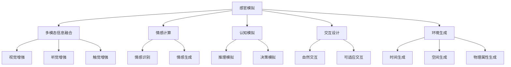

                 

# 体验的authenticity：AI时代的真实性追求

## 1. 背景介绍

### 1.1 问题由来

随着人工智能(AI)技术的迅猛发展，数字虚拟体验已经渗透到生活的方方面面。从虚拟现实游戏、社交媒体到在线教育、医疗咨询，AI生成的虚拟体验让我们的生活更加丰富多彩。然而，在这个虚拟化的浪潮中，如何确保体验的真实性，成为了亟待解决的问题。

真实性(Realness)，又称为“临场感”(Immersion)，是虚拟体验的核心要素。它不仅关乎感官体验的真实性，还涉及到情感、认知等心理层面。如何在虚拟体验中创造真实的感受，成为了AI技术发展的重大挑战。本文将从算法原理、模型构建、代码实现和应用场景等多个维度，探讨如何通过AI技术提升虚拟体验的真实性。

### 1.2 问题核心关键点

确保体验的真实性，是一个多维度、多层次的问题。它涉及感官信息的真实呈现、情感体验的真实传递、认知过程的真实模拟等诸多方面。具体来说，核心关键点包括：

1. **感官真实性**：如何通过视觉、听觉、触觉等多模态信息，呈现逼真的感官体验。
2. **情感真实性**：如何在虚拟场景中传达真实的情感体验，包括但不限于情绪表达、同理心、社交互动等。
3. **认知真实性**：如何模拟复杂的认知过程，如推理、决策、学习等，使AI生成的体验更加贴近人类的认知模式。
4. **交互真实性**：如何在虚拟环境中实现流畅、自然的人机交互，提升用户体验的沉浸感。
5. **环境真实性**：如何构建逼真的虚拟环境，包括时间、空间、物理属性等。

这些问题相互交织，共同构成了虚拟体验真实性的研究框架。本文将围绕这些关键点，系统性地探讨提升虚拟体验真实性的方法。

## 2. 核心概念与联系

### 2.1 核心概念概述

为更好地理解提升虚拟体验真实性的方法，本节将介绍几个关键概念：

- **感官模拟**：通过视觉、听觉、触觉等多模态信息的融合，模拟现实世界的感官体验。
- **情感计算**：研究如何通过AI技术识别、表达和传递情感，增强用户体验的沉浸感。
- **认知模拟**：模拟人类认知过程，包括记忆、推理、决策等，使AI生成的体验更加贴近人类认知模式。
- **交互设计**：设计自然流畅的人机交互方式，提升用户对虚拟环境的适应和融入。
- **环境生成**：构建逼真的虚拟环境，包括时间、空间、物理属性等。

这些概念之间的逻辑关系可以通过以下Mermaid流程图来展示：



这个流程图展示了感官模拟、情感计算、认知模拟、交互设计和环境生成等概念之间的联系。通过这些概念的综合应用，可以构建更加真实、沉浸的虚拟体验。

## 3. 核心算法原理 & 具体操作步骤

### 3.1 算法原理概述

提升虚拟体验的真实性，本质上是一个多模态信息融合和认知模拟的过程。其核心思想是：通过多模态信息的感知和处理，模拟人类的感官和认知过程，从而创造逼真的虚拟体验。

形式化地，假设虚拟体验由视觉信息 $V$、听觉信息 $A$、触觉信息 $T$、情感信息 $E$ 和认知信息 $C$ 构成。提升体验真实性的目标是通过算法将以上多模态信息融合处理，生成尽可能逼真的体验。

具体来说，算法过程包括：

1. **数据采集**：通过传感器、摄像头、麦克风等设备，采集用户的多模态信息。
2. **信息融合**：将采集到的多模态信息进行融合处理，生成统一的信息表示。
3. **感官模拟**：利用视觉、听觉、触觉等技术，对融合后的信息进行感官模拟，生成逼真的感官体验。
4. **情感计算**：通过情感识别和生成技术，对感官信息进行情感分析，增强用户体验的情感共鸣。
5. **认知模拟**：利用认知模拟技术，对融合后的信息进行推理和决策，提升体验的认知真实性。
6. **交互设计**：设计自然流畅的人机交互方式，使用户能够更自然地融入虚拟环境。
7. **环境生成**：构建逼真的虚拟环境，包括时间、空间、物理属性等。

### 3.2 算法步骤详解

基于以上原理，提升虚拟体验真实性的算法步骤包括：

**Step 1: 数据采集和预处理**
- 通过摄像头、麦克风、触觉传感器等设备，采集用户的多模态信息。
- 对采集到的信息进行去噪、归一化、特征提取等预处理操作。

**Step 2: 信息融合**
- 使用多模态融合算法，将视觉、听觉、触觉等信号进行融合，生成统一的信息表示。
- 常用的多模态融合方法包括：加权平均法、深度融合法、协同表示法等。

**Step 3: 感官模拟**
- 利用视觉增强、听觉增强、触觉增强等技术，对融合后的信息进行感官模拟。
- 视觉增强方法包括：图像重建、三维重建等。
- 听觉增强方法包括：声音合成、回声处理等。
- 触觉增强方法包括：虚拟现实设备、力反馈设备等。

**Step 4: 情感计算**
- 通过情感识别技术，对感官信息进行情感分析，提取用户的情感状态。
- 常用的情感识别方法包括：深度学习模型、情感词典、语音情感分析等。
- 情感生成技术，用于在虚拟体验中传递情感，增强用户沉浸感。
- 情感生成方法包括：文本生成、声音生成等。

**Step 5: 认知模拟**
- 利用认知模拟技术，对融合后的信息进行推理和决策，模拟人类认知过程。
- 推理模拟方法包括：知识图谱推理、逻辑推理等。
- 决策模拟方法包括：决策树、贝叶斯网络等。

**Step 6: 交互设计**
- 设计自然流畅的人机交互方式，使用户能够更自然地融入虚拟环境。
- 交互设计方法包括：自然语言处理、手势识别、动作捕捉等。

**Step 7: 环境生成**
- 构建逼真的虚拟环境，包括时间、空间、物理属性等。
- 环境生成方法包括：三维建模、虚拟环境渲染等。

### 3.3 算法优缺点

提升虚拟体验真实性的算法具有以下优点：

1. **多模态融合**：通过多模态信息融合，能够更全面地模拟人类的感官体验，提升体验的逼真度。
2. **情感计算**：情感计算技术能够增强用户体验的情感共鸣，提升沉浸感。
3. **认知模拟**：通过认知模拟技术，使AI生成的体验更加贴近人类的认知模式。
4. **交互设计**：自然流畅的人机交互方式，使用户能够更自然地融入虚拟环境。
5. **环境生成**：逼真的虚拟环境能够提升用户体验的真实感。

同时，该算法也存在以下局限性：

1. **数据需求高**：多模态信息采集和预处理需要大量高质量的数据，数据采集成本较高。
2. **技术复杂**：多模态信息融合、感官模拟、情感计算等技术实现较为复杂，需要多学科知识的融合。
3. **算法瓶颈**：算法优化不足时，容易出现感官失真、情感失调和认知错位等问题。
4. **用户适应**：用户对虚拟环境的适应和融入需要一定时间，部分用户可能难以快速适应。

尽管存在这些局限性，但通过合理设计算法流程，充分利用多模态信息，提升虚拟体验的真实性仍具有巨大的潜力和价值。

### 3.4 算法应用领域

提升虚拟体验真实性的算法在多个领域都有广泛的应用，例如：

- **虚拟现实游戏**：通过多模态信息融合和感官模拟，创造逼真的游戏体验。
- **社交媒体平台**：利用情感计算和交互设计技术，增强用户的社交互动体验。
- **远程医疗**：通过情感计算和认知模拟技术，提升远程医疗的体验感和互动性。
- **在线教育**：利用多模态信息融合和认知模拟技术，提供沉浸式学习体验。
- **数字展览**：通过环境生成和交互设计，创造沉浸式展览体验。

这些应用领域展示了提升虚拟体验真实性算法的广泛适用性，为AI技术在各行各业的落地提供了新的思路和方向。

## 4. 数学模型和公式 & 详细讲解

### 4.1 数学模型构建

本节将使用数学语言对提升虚拟体验真实性的算法过程进行更加严格的刻画。

假设虚拟体验由视觉信息 $V$、听觉信息 $A$、触觉信息 $T$、情感信息 $E$ 和认知信息 $C$ 构成。设 $F_V$、$F_A$、$F_T$、$F_E$、$F_C$ 分别为视觉、听觉、触觉、情感和认知的感官模拟函数。则提升体验真实性的数学模型可以表示为：

$$
X = F_V(V) + F_A(A) + F_T(T) + F_E(E) + F_C(C)
$$

其中 $X$ 表示最终的体验表示，$F_V$、$F_A$、$F_T$、$F_E$、$F_C$ 分别为各个模态的感官模拟函数。

### 4.2 公式推导过程

以下我们以视觉信息 $V$ 为例，推导视觉增强的公式及其梯度计算。

假设视觉信息 $V$ 由图像序列 $I$ 组成，即 $V = \{I_t\}_{t=1}^T$，其中 $I_t$ 表示第 $t$ 帧图像。设 $F_V$ 为视觉增强函数，输出为增强后的图像序列 $J$。则视觉增强的公式可以表示为：

$$
J = F_V(V) = \{J_t\}_{t=1}^T
$$

对于单个图像 $I_t$，增强后的图像 $J_t$ 可以表示为：

$$
J_t = F_{V_t}(I_t)
$$

其中 $F_{V_t}$ 为第 $t$ 帧图像的增强函数。假设 $F_{V_t}$ 为线性变换，则：

$$
J_t = \alpha F_{V_t}(I_t) + (1-\alpha) I_t
$$

其中 $\alpha \in [0,1]$ 为线性变换的权重，$F_{V_t}$ 为第 $t$ 帧图像的增强函数。

对于整个图像序列 $V$，增强后的图像序列 $J$ 可以表示为：

$$
J = \{J_t\}_{t=1}^T = \{\alpha F_{V_t}(I_t) + (1-\alpha) I_t\}_{t=1}^T
$$

假设 $J$ 和 $V$ 的损失函数为 $L(J, V)$，则视觉增强的梯度公式为：

$$
\frac{\partial L(J, V)}{\partial \alpha} = \frac{\partial L(J, V)}{\partial J} \frac{\partial J}{\partial \alpha}
$$

其中 $\frac{\partial J}{\partial \alpha}$ 可以通过链式法则计算得到。

## 5. 项目实践：代码实例和详细解释说明

### 5.1 开发环境搭建

在进行提升虚拟体验真实性算法实践前，我们需要准备好开发环境。以下是使用Python进行OpenCV开发的环境配置流程：

1. 安装Anaconda：从官网下载并安装Anaconda，用于创建独立的Python环境。

2. 创建并激活虚拟环境：
```bash
conda create -n cv-env python=3.8 
conda activate cv-env
```

3. 安装OpenCV：从官网获取安装命令。例如：
```bash
conda install opencv
```

4. 安装numpy、matplotlib等工具包：
```bash
pip install numpy matplotlib
```

完成上述步骤后，即可在`cv-env`环境中开始实践。

### 5.2 源代码详细实现

这里我们以视觉增强为例，给出使用OpenCV进行图像增强的Python代码实现。

```python
import cv2
import numpy as np
import matplotlib.pyplot as plt

def visual_enhancement(image, alpha=0.5):
    gray = cv2.cvtColor(image, cv2.COLOR_BGR2GRAY)
    # 使用CLAHE增强灰度图像
    clahe = cv2.createCLAHE(clipLimit=2.0, tileGridSize=(8,8))
    clahe_gray = clahe.apply(gray)
    # 图像线性变换
    transformed = alpha * clahe_gray + (1-alpha) * image
    # 可视化
    plt.imshow(cv2.cvtColor(transformed, cv2.COLOR_BGR2RGB))
    plt.show()

# 加载图像
image = cv2.imread('image.jpg')

# 增强图像
visual_enhancement(image, alpha=0.8)
```

以上代码展示了使用OpenCV进行图像增强的基本流程。加载图像后，首先将其转换为灰度图像，然后使用CLAHE（Contrast Limited Adaptive Histogram Equalization）增强图像对比度，最后进行线性变换，生成增强后的图像。

### 5.3 代码解读与分析

让我们再详细解读一下关键代码的实现细节：

- `visual_enhancement`函数：输入原始图像和增强参数 $\alpha$，输出增强后的图像。
- `gray`变量：将原始图像转换为灰度图像，便于后续的对比度和亮度调整。
- `clahe`变量：创建CLAHE对象，用于增强图像对比度。
- `clahe_gray`变量：对灰度图像进行CLAHE增强。
- `transformed`变量：进行线性变换，生成增强后的图像。
- `plt.imshow`函数：将增强后的图像可视化，展示效果。

这个例子展示了如何使用OpenCV对图像进行增强，提升视觉体验的真实性。通过调整线性变换的权重 $\alpha$，可以控制增强的程度，从而满足不同场景的需求。

## 6. 实际应用场景

### 6.1 虚拟现实游戏

在虚拟现实游戏中，多模态信息的融合和感官模拟是创造逼真体验的关键。通过视觉增强、听觉增强和触觉增强等技术，可以提升游戏的沉浸感和临场感。

以《头号玩家》（Ready Player One）为例，游戏中融合了视觉、听觉、触觉等多种感官信息，使用户能够更加真实地融入虚拟世界。通过增强现实头显、手柄和震动反馈等设备，用户可以感受到游戏场景中的光照变化、声音回响和物体碰撞，极大地提升了游戏的真实感和互动性。

### 6.2 社交媒体平台

社交媒体平台利用情感计算和交互设计技术，增强用户的社交互动体验。通过分析用户的情感状态，平台可以推送更加个性化的内容，提升用户的情感共鸣和参与度。

例如，Instagram通过分析用户的点赞、评论、分享等行为，使用深度学习模型识别用户的情感状态，推送符合用户情感喜好的内容。同时，通过自然语言处理和手势识别技术，用户可以通过语音和手势与平台进行互动，增强用户的沉浸感和参与感。

### 6.3 远程医疗

远程医疗利用情感计算和认知模拟技术，提升远程医疗的体验感和互动性。通过情感计算技术，医生可以感知患者的情感状态，提供更加人性化的医疗服务。

例如，使用表情识别技术，医生可以分析患者的面部表情，判断其情绪状态，提供更加个性化和针对性的医疗咨询。同时，通过认知模拟技术，医生可以模拟患者的认知过程，理解其病情和需求，提供更加准确的医疗建议。

### 6.4 在线教育

在线教育利用多模态信息融合和认知模拟技术，提供沉浸式学习体验。通过视觉增强、听觉增强和触觉增强等技术，可以提升学生的学习体验和参与度。

例如，使用虚拟现实技术，教师可以构建虚拟实验室，让学生在虚拟环境中进行实验操作。同时，通过情感计算技术，教师可以感知学生的情感状态，提供更加个性化的教学支持。通过认知模拟技术，教师可以模拟学生的认知过程，提供更加针对性的学习指导。

### 6.5 数字展览

数字展览利用环境生成和交互设计技术，创造沉浸式展览体验。通过三维建模和虚拟环境渲染等技术，可以构建逼真的展览环境，增强参观者的沉浸感和体验感。

例如，通过三维建模技术，博物馆可以还原古代建筑、历史文物等展览物品，让参观者能够身临其境地感受历史和文化。同时，通过交互设计技术，参观者可以通过手势和语音与展览物品进行互动，增强参观体验的真实感和互动性。

## 7. 工具和资源推荐

### 7.1 学习资源推荐

为了帮助开发者系统掌握提升虚拟体验真实性的理论基础和实践技巧，这里推荐一些优质的学习资源：

1. 《计算机视觉：模型、学习与推理》系列博文：由计算机视觉领域的专家撰写，深入浅出地介绍了视觉增强、图像处理等前沿话题。

2. 《深度学习与情感计算》课程：斯坦福大学开设的课程，涵盖了深度学习在情感识别和生成中的应用，适合深入学习情感计算技术。

3. 《认知模拟与人工智能》书籍：介绍了认知模拟技术和AI生成体验的方法，适合系统学习认知模拟理论。

4. OpenCV官方文档：详细介绍了OpenCV库的图像处理和视觉增强技术，适合初学者上手实践。

5. PyTorch官方文档：提供了深度学习模型的构建和优化方法，适合学习多模态融合和感官模拟技术。

通过对这些资源的学习实践，相信你一定能够快速掌握提升虚拟体验真实性的精髓，并用于解决实际的AI问题。

### 7.2 开发工具推荐

高效的开发离不开优秀的工具支持。以下是几款用于提升虚拟体验真实性开发的常用工具：

1. OpenCV：开源计算机视觉库，提供了丰富的图像处理和视觉增强功能，适合进行多模态信息融合和感官模拟。

2. TensorFlow：由Google主导开发的深度学习框架，支持大规模模型训练和部署，适合进行深度学习和情感计算。

3. PyTorch：基于Python的开源深度学习框架，动态计算图和灵活的模型构建方式，适合进行多模态信息融合和认知模拟。

4. Weights & Biases：模型训练的实验跟踪工具，可以记录和可视化模型训练过程中的各项指标，方便对比和调优。与主流深度学习框架无缝集成。

5. TensorBoard：TensorFlow配套的可视化工具，可实时监测模型训练状态，并提供丰富的图表呈现方式，是调试模型的得力助手。

6. Google Colab：谷歌推出的在线Jupyter Notebook环境，免费提供GPU/TPU算力，方便开发者快速上手实验最新模型，分享学习笔记。

合理利用这些工具，可以显著提升提升虚拟体验真实性任务的开发效率，加快创新迭代的步伐。

### 7.3 相关论文推荐

提升虚拟体验真实性的发展源于学界的持续研究。以下是几篇奠基性的相关论文，推荐阅读：

1. "Real-Time Single Image and Video Enhancements with Adaptive Contrast Limited Adaptive Histogram Equalization"：提出了基于CLAHE的图像增强方法，适用于实时增强和增强多模态体验。

2. "Towards Intelligent Virtual Agents: Bridging the Gap Between Affective Computing and Human-AI Interaction"：研究了情感计算在AI生成体验中的应用，探讨了情感计算与交互设计的结合。

3. "Cognitive Models of Spatial Reasoning in Humans and Machines"：介绍了认知模拟技术在人工智能中的应用，探讨了如何模拟人类认知过程。

4. "Human-Robot Interaction: A Survey"：综述了人机交互技术的发展，介绍了自然语言处理和手势识别等交互设计方法。

5. "Building Computational Models for Virtual Reality"：探讨了虚拟现实环境生成的方法，介绍了三维建模和虚拟环境渲染技术。

这些论文代表了大语言模型微调技术的发展脉络。通过学习这些前沿成果，可以帮助研究者把握学科前进方向，激发更多的创新灵感。

## 8. 总结：未来发展趋势与挑战

### 8.1 总结

本文对提升虚拟体验真实性的方法进行了全面系统的介绍。首先阐述了提升虚拟体验真实性的研究背景和意义，明确了感官模拟、情感计算、认知模拟、交互设计和环境生成等关键概念。其次，从算法原理到实践步骤，详细讲解了提升体验真实性的数学模型和关键算法。同时，本文还展示了提升体验真实性的实际应用场景，探讨了未来发展的趋势和挑战。

通过本文的系统梳理，可以看到，提升虚拟体验真实性是一个多学科交叉、多技术融合的复杂任务。通过感官模拟、情感计算、认知模拟等技术的综合应用，可以构建更加真实、沉浸的虚拟体验。尽管面临诸多挑战，但通过不断的研究和实践，相信未来的大语言模型微调技术必将在虚拟体验领域大放异彩，带来更加真实、自然的数字世界。

### 8.2 未来发展趋势

展望未来，提升虚拟体验真实性的技术将呈现以下几个发展趋势：

1. **多模态融合**：随着传感器技术的进步，未来的虚拟体验将融合更多模态信息，如味觉、嗅觉、电信号等，实现全感官沉浸式体验。

2. **情感计算**：情感计算技术将更加深入和智能化，能够更精确地识别和生成情感，增强用户体验的情感共鸣。

3. **认知模拟**：认知模拟技术将更加复杂和精确，能够模拟更广泛的人类认知过程，提供更贴近人类认知模式的体验。

4. **交互设计**：交互设计将更加自然和智能，能够实现更流畅、更自然的人机交互，提升用户的沉浸感和适应性。

5. **环境生成**：环境生成技术将更加逼真和动态，能够构建更复杂、更丰富的虚拟环境，增强用户的真实感和沉浸感。

6. **跨领域应用**：提升虚拟体验真实性的技术将应用于更多领域，如虚拟旅游、虚拟办公、虚拟购物等，带来更广泛的应用价值。

以上趋势展示了提升虚拟体验真实性技术的广阔前景。这些方向的探索发展，必将进一步提升虚拟体验的真实性和沉浸感，为AI技术在各行各业的落地提供新的思路和方向。

### 8.3 面临的挑战

尽管提升虚拟体验真实性的技术已经取得了一定的进展，但在迈向更加智能化、普适化应用的过程中，它仍面临着诸多挑战：

1. **数据需求高**：多模态信息采集和预处理需要大量高质量的数据，数据采集成本较高。
2. **技术复杂**：多模态信息融合、感官模拟、情感计算等技术实现较为复杂，需要多学科知识的融合。
3. **算法瓶颈**：算法优化不足时，容易出现感官失真、情感失调和认知错位等问题。
4. **用户体验**：用户对虚拟环境的适应和融入需要一定时间，部分用户可能难以快速适应。
5. **伦理与安全**：虚拟体验的广泛应用可能带来隐私泄露和伦理问题，需要加强监管和安全保护。

这些挑战需要通过不断的技术创新和规范制定，逐步克服。只有从数据、算法、伦理等各方面综合考虑，才能真正实现提升虚拟体验真实性的目标。

### 8.4 研究展望

面对提升虚拟体验真实性所面临的挑战，未来的研究需要在以下几个方面寻求新的突破：

1. **无监督和半监督学习**：摆脱对大规模标注数据的依赖，利用自监督学习、主动学习等无监督和半监督范式，最大限度利用非结构化数据，实现更加灵活高效的提升体验真实性方法。

2. **跨领域数据融合**：将多领域、多模态数据进行融合，构建更全面、更丰富的虚拟体验，如结合视频、音频、文本等多模态数据，实现跨领域的交互和体验。

3. **多任务学习**：将提升体验真实性的任务与其他NLP任务（如情感分析、语义理解等）相结合，提高整体系统性能。

4. **模型压缩与优化**：通过模型压缩、量化加速等技术，降低计算资源消耗，提升实时性。

5. **交互设计与自然语言处理**：结合自然语言处理技术，设计更加自然、智能的人机交互方式，提升用户体验的真实感和适应性。

6. **跨领域应用**：将提升体验真实性的技术应用于更多领域，如虚拟旅游、虚拟办公、虚拟购物等，带来更广泛的应用价值。

这些研究方向将为提升虚拟体验真实性技术带来新的突破，推动AI技术在各行各业的深度应用。总之，提升虚拟体验真实性需要跨学科、跨领域的协同合作，通过不断的技术创新和应用实践，实现AI技术与人类体验的深度融合。

## 9. 附录：常见问题与解答

**Q1：提升虚拟体验真实性是否适用于所有场景？**

A: 提升虚拟体验真实性适用于大多数需要沉浸式体验的场景，如虚拟现实游戏、社交媒体、远程医疗、在线教育、数字展览等。但部分对实时性和交互性要求极高的应用，可能需要更加高效、灵活的技术支持。

**Q2：如何选择合适的多模态融合方法？**

A: 选择合适的多模态融合方法需要考虑融合的具体场景和目标。常用的方法包括：加权平均法、深度融合法、协同表示法等。一般来说，加权平均法适用于简单场景，深度融合法适用于复杂场景，协同表示法适用于结构化数据。

**Q3：如何避免提升体验真实性中的感官失真问题？**

A: 避免感官失真需要从多个方面进行优化。例如，通过多尺度增强、自适应增强等技术，提高增强算法的鲁棒性。同时，引入用户反馈机制，及时调整算法参数，确保感官体验的逼真度。

**Q4：提升体验真实性在实际部署中需要注意哪些问题？**

A: 实际部署中，需要考虑模型大小、计算资源、实时性等问题。可以通过模型压缩、量化加速等技术，优化模型性能。同时，合理设置算法参数，确保在资源有限的情况下，依然能够提供高质量的体验。

**Q5：提升体验真实性在多用户环境中如何保证公平性？**

A: 在多用户环境中，可以通过设计个性化的交互方案，满足不同用户的需求。同时，通过多任务学习等技术，提升整体系统性能。但需要注意，部分用户可能对虚拟体验的接受度较低，需要提供一定的适应和引导机制。

通过本文的系统梳理，可以看到，提升虚拟体验真实性是一个多学科交叉、多技术融合的复杂任务。通过感官模拟、情感计算、认知模拟等技术的综合应用，可以构建更加真实、沉浸的虚拟体验。尽管面临诸多挑战，但通过不断的研究和实践，相信未来的大语言模型微调技术必将在虚拟体验领域大放异彩，带来更加真实、自然的数字世界。

