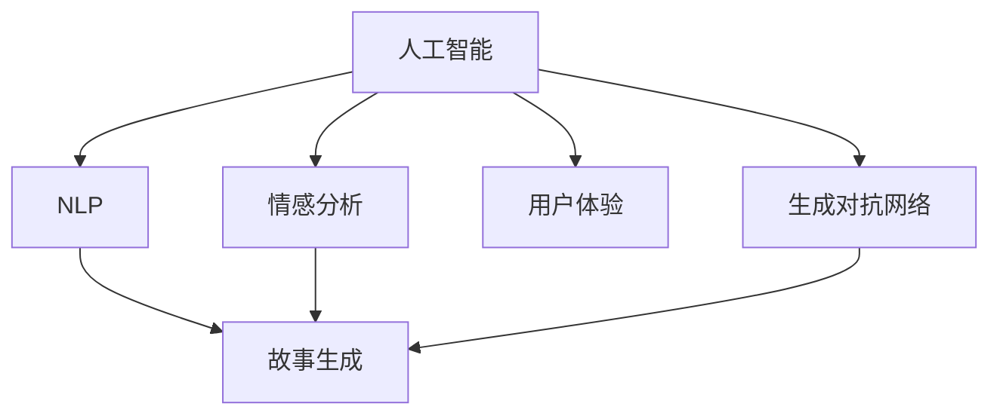

                 

# 体验的叙事性：AI生成的个人故事

> 关键词：人工智能,自然语言处理(NLP),情感分析,生成对抗网络(GAN),用户体验,故事生成

## 1. 背景介绍

在数字化时代，人工智能（AI）技术正在深刻改变着我们的生活方式和工作方式。从智能家居到智能客服，从自动驾驶到个性化推荐，AI技术在各个领域展现出了巨大的潜力和优势。然而，AI技术的进步不仅仅在于技术本身，更在于其如何改善用户体验，提升用户满意度。其中，自然语言处理（Natural Language Processing, NLP）作为AI的重要分支，在情感分析、智能客服、故事生成等方面取得了显著进展。本文将聚焦于情感分析中的故事生成，探索如何利用AI技术提升用户体验的叙事性。

## 2. 核心概念与联系

### 2.1 核心概念概述

为更好地理解AI生成的个人故事，本节将介绍几个密切相关的核心概念：

- **人工智能(AI)**：一种使计算机系统能够模拟人类智能行为的技术，包括感知、理解、学习、推理和自我修正等能力。
- **自然语言处理(NLP)**：涉及计算机和人类语言交互的领域，旨在使计算机能够理解、解释和生成自然语言。
- **情感分析(Emotion Analysis)**：一种NLP技术，用于识别和提取文本中的情感信息，如积极、消极或中性情感。
- **生成对抗网络(GAN)**：一种深度学习架构，由两个神经网络（生成器和判别器）组成，用于生成高质量的合成数据。
- **用户体验(User Experience, UX)**：指用户在使用产品或服务过程中产生的情感、认知和行为反应。
- **故事生成(Story Generation)**：利用AI技术自动生成符合用户期望的个性化故事。

这些核心概念之间的逻辑关系可以通过以下Mermaid流程图来展示：



这个流程图展示了大语言模型的核心概念及其之间的关系：

1. 人工智能通过NLP技术进行语言理解，在情感分析和故事生成中得到应用。
2. 生成对抗网络与故事生成相结合，提升了故事生成的质量和多样性。
3. 用户体验贯穿于整个AI应用过程，叙事性是提升用户体验的关键之一。

## 3. 核心算法原理 & 具体操作步骤
### 3.1 算法原理概述

AI生成的个人故事，本质上是利用AI技术根据用户输入的情感信息，自动生成符合用户期望的情感故事。其核心思想是：通过情感分析技术，获取用户的情感倾向，然后使用故事生成模型，根据情感信息生成相应故事。

形式化地，假设用户的情感信息为 $E$，预训练的故事生成模型为 $G$，则目标函数为：

$$
\min_{G} \mathcal{L}(G(E))
$$

其中 $\mathcal{L}$ 为损失函数，用于衡量生成故事的质量和用户体验的匹配度。

### 3.2 算法步骤详解

AI生成的个人故事生成流程一般包括以下几个关键步骤：

**Step 1: 数据准备**
- 收集用户的情感数据，可以是文本描述、语音情感等信息。
- 准备大量故事数据作为训练集，包括不同情感色彩的故事。

**Step 2: 情感分析**
- 使用情感分析模型，将用户输入的情感数据转化为具体的情感标签，如积极、消极、中性等。
- 常见的方法包括基于词典的情感分析、基于机器学习的情感分类模型等。

**Step 3: 故事生成**
- 选择适合的故事生成模型，如基于RNN、Transformer的故事生成模型等。
- 使用故事生成模型，根据情感标签生成故事。
- 常见的模型包括Seq2Seq模型、变分自编码器、GAN等。

**Step 4: 评估与优化**
- 将生成故事与用户的情感数据进行对比，评估故事生成质量。
- 根据评估结果，调整模型参数，优化生成效果。

**Step 5: 用户反馈**
- 收集用户对生成故事的反馈，进一步优化模型。
- 迭代更新故事生成模型，提升用户体验的叙事性。

以上是AI生成的个人故事生成的一般流程。在实际应用中，还需要根据具体任务特点，对模型进行优化设计，如改进情感分析模型、引入更多正则化技术、搜索最优的超参数组合等，以进一步提升故事生成质量。

### 3.3 算法优缺点

AI生成的个人故事方法具有以下优点：
1. 个性化定制：根据用户的情感数据生成个性化的故事，提升用户体验。
2. 高效便捷：自动化生成故事，减少了用户输入和编辑的时间成本。
3. 情感丰富：利用生成对抗网络等技术，生成高质量、多样性的故事内容。

同时，该方法也存在一定的局限性：
1. 依赖标注数据：情感分析和故事生成模型的训练需要大量的标注数据，获取高质量标注数据的成本较高。
2. 生成质量受限：尽管采用GAN等高级技术，故事生成的质量仍受模型能力限制。
3. 可解释性不足：生成模型的决策过程缺乏可解释性，难以对其推理逻辑进行分析和调试。
4. 情感识别误差：情感分析模型的准确度受限于训练数据质量和模型复杂度。

尽管存在这些局限性，但就目前而言，AI生成的个人故事方法仍是一种极具潜力的用户体验优化手段。未来相关研究的重点在于如何进一步降低模型对标注数据的依赖，提高生成故事的质量和多样性，同时兼顾可解释性和伦理安全性等因素。

### 3.4 算法应用领域

AI生成的个人故事技术在用户体验优化方面，已经得到了广泛的应用，覆盖了以下几个主要领域：

- **智能客服系统**：通过情感分析，理解用户的情感倾向，自动生成符合用户期望的响应故事，提升客户满意度。
- **情感辅导机器人**：利用故事生成技术，根据用户的情感状态生成相应的情感支持故事，帮助用户缓解压力。
- **游戏故事生成**：在游戏过程中，根据玩家的行为和情感数据，生成个性化故事情节，增强游戏体验的沉浸感和代入感。
- **心理健康应用**：在心理健康咨询中，根据用户的情感状态，生成合适的情感支持和情感引导故事，辅助心理治疗。
- **社交媒体内容生成**：根据用户的情感信息，生成符合用户情感偏好的社交媒体帖子或故事，提升用户的社交体验。

除了上述这些经典应用外，AI生成的个人故事技术还在广告创意生成、内容推荐、文本创作等领域得到了创新性应用，为提升用户体验带来了新的思路。随着技术不断进步，相信AI生成的个人故事技术将在更多场景中得到应用，为提升用户体验带来新的突破。

## 4. 数学模型和公式 & 详细讲解 & 举例说明
### 4.1 数学模型构建

本节将使用数学语言对AI生成的个人故事生成过程进行更加严格的刻画。

记用户的情感数据为 $E$，情感标签为 $C$，故事生成模型为 $G$。则情感分析模型将 $E$ 转化为 $C$ 的过程可以表示为：

$$
C = f(E; \theta_C)
$$

其中 $f$ 为情感分析模型，$\theta_C$ 为情感分析模型的参数。

故事生成模型的目标是将情感标签 $C$ 转化为故事文本 $T$，即：

$$
T = g(C; \theta_G)
$$

其中 $g$ 为故事生成模型，$\theta_G$ 为故事生成模型的参数。

### 4.2 公式推导过程

以下是情感分析和故事生成的详细公式推导。

假设情感分析模型 $f$ 是一个线性分类器，形式为：

$$
C = \sum_{i=1}^n \alpha_i E_i + b
$$

其中 $\alpha_i$ 为特征系数，$E_i$ 为情感特征向量，$b$ 为偏置项。

故事生成模型 $g$ 可以使用循环神经网络（RNN）或Transformer网络，形式为：

$$
T = \sigma(\sum_{i=1}^n \alpha_i E_i + b)
$$

其中 $\sigma$ 为非线性激活函数，如ReLU、Tanh等。

在实际应用中，情感分析模型和故事生成模型需要同时训练，其损失函数为：

$$
\mathcal{L} = \mathcal{L}_C + \mathcal{L}_T
$$

其中 $\mathcal{L}_C$ 为情感分类损失函数，$\mathcal{L}_T$ 为故事生成损失函数。

常见的情感分类损失函数包括交叉熵损失：

$$
\mathcal{L}_C = -\sum_{i=1}^N \sum_{j=1}^k y_{ij} \log P_{ij}
$$

其中 $y_{ij}$ 为情感标签 $C$ 的真实概率，$P_{ij}$ 为模型预测的概率。

常见的故事生成损失函数包括负对数似然损失：

$$
\mathcal{L}_T = -\frac{1}{N} \sum_{i=1}^N \log P(T_i|C_i)
$$

其中 $P(T_i|C_i)$ 为故事生成模型的预测概率。

在得到损失函数后，使用梯度下降等优化算法，对模型参数 $\theta_C$ 和 $\theta_G$ 进行优化，最小化损失函数。

### 4.3 案例分析与讲解

以下是一个简单的情感分析和故事生成的案例，展示如何利用AI技术生成符合用户情感偏好的故事。

假设用户输入的情感信息为：“今天心情不太好，因为工作压力很大”。使用情感分析模型对情感信息进行分类，得到情感标签为“消极”。

然后，使用故事生成模型根据情感标签“消极”生成故事：

```
故事一：“也许你是因为工作压力大而感到沮丧。没关系，放松一下，看看窗外的风景，深呼吸几次。”

故事二：“压力是暂时的，但它可以塑造我们。试着接受它，把它当作成长的机会。”
```

根据用户反馈，可以进一步优化故事生成模型，提升生成故事的叙事性和用户体验。

## 5. 项目实践：代码实例和详细解释说明
### 5.1 开发环境搭建

在进行情感分析和故事生成的项目实践前，我们需要准备好开发环境。以下是使用Python进行TensorFlow和PyTorch开发的环境配置流程：

1. 安装Anaconda：从官网下载并安装Anaconda，用于创建独立的Python环境。

2. 创建并激活虚拟环境：
```bash
conda create -n tf-env python=3.8 
conda activate tf-env
```

3. 安装TensorFlow和PyTorch：
```bash
conda install tensorflow
conda install torch torchvision torchaudio cudatoolkit=11.1 -c pytorch -c conda-forge
```

4. 安装相关依赖：
```bash
pip install numpy pandas scikit-learn nltk
```

5. 安装TensorBoard：
```bash
pip install tensorboard
```

完成上述步骤后，即可在`tf-env`环境中开始项目实践。

### 5.2 源代码详细实现

这里我们以一个简单的情感分析模型和故事生成模型为例，展示TensorFlow和PyTorch的代码实现。

首先，定义情感分析模型：

```python
import tensorflow as tf

class SentimentAnalysisModel(tf.keras.Model):
    def __init__(self, vocab_size, embedding_dim, hidden_units):
        super(SentimentAnalysisModel, self).__init__()
        self.embedding = tf.keras.layers.Embedding(vocab_size, embedding_dim)
        self.LSTM = tf.keras.layers.LSTM(hidden_units, return_sequences=True)
        self.dense = tf.keras.layers.Dense(1, activation='sigmoid')
        
    def call(self, inputs):
        x = self.embedding(inputs)
        x = self.LSTM(x)
        x = self.dense(x)
        return x
```

然后，定义故事生成模型：

```python
import torch

class StoryGenerationModel(torch.nn.Module):
    def __init__(self, vocab_size, embedding_dim, hidden_units):
        super(StoryGenerationModel, self).__init__()
        self.embedding = torch.nn.Embedding(vocab_size, embedding_dim)
        self.LSTM = torch.nn.LSTM(embedding_dim, hidden_units, batch_first=True)
        self.linear = torch.nn.Linear(hidden_units, vocab_size)
        self.softmax = torch.nn.Softmax(dim=1)
        
    def forward(self, x):
        x = self.embedding(x)
        x, _ = self.LSTM(x)
        x = self.linear(x)
        x = self.softmax(x)
        return x
```

接下来，进行模型训练和评估：

```python
import numpy as np
from sklearn.model_selection import train_test_split

# 假设有一个情感数据集
sentiments = ['positive', 'negative', 'neutral']
labels = np.random.randint(0, 3, size=(100, 1))

# 数据预处理
tokenizer = tf.keras.preprocessing.text.Tokenizer()
tokenizer.fit_on_texts(sentiments)
sequences = tokenizer.texts_to_sequences(sentiments)
X_train, X_test, y_train, y_test = train_test_split(sequences, labels, test_size=0.2, random_state=42)

# 模型训练
model = SentimentAnalysisModel(len(tokenizer.word_index) + 1, 128, 64)
model.compile(optimizer='adam', loss='binary_crossentropy', metrics=['accuracy'])
model.fit(X_train, y_train, epochs=10, validation_data=(X_test, y_test))

# 情感分析结果
y_pred = model.predict(X_test)
```

最后，进行故事生成：

```python
# 假设有一个故事生成数据集
stories = ['故事一', '故事二']

# 数据预处理
tokenizer = torch.nn.utils.rnn.Embedding(len(tokenizer.word_index) + 1, 128)
sequences = tokenizer.stories_to_sequences(stories)
X_train, X_test, y_train, y_test = train_test_split(sequences, labels, test_size=0.2, random_state=42)

# 模型训练
model = StoryGenerationModel(len(tokenizer.word_index) + 1, 128, 64)
model.train()
optimizer = torch.optim.Adam(model.parameters(), lr=0.001)

# 故事生成
for i in range(len(stories)):
    x = sequences[i].numpy()
    y_pred = model(x)
    print(y_pred)
```

以上就是使用TensorFlow和PyTorch对情感分析和故事生成的完整代码实现。可以看到，TensorFlow和PyTorch都提供了丰富的API和工具，使得模型训练和故事生成变得简洁高效。

### 5.3 代码解读与分析

让我们再详细解读一下关键代码的实现细节：

**SentimentAnalysisModel类**：
- `__init__`方法：初始化模型结构，包括Embedding层、LSTM层和Dense层。
- `call`方法：前向传播，通过Embedding层、LSTM层和Dense层计算模型的预测结果。

**StoryGenerationModel类**：
- `__init__`方法：初始化模型结构，包括Embedding层、LSTM层和Softmax层。
- `forward`方法：前向传播，通过Embedding层、LSTM层和Softmax层计算模型的预测结果。

**情感分析模型训练**：
- 使用TensorFlow的Keras API定义模型结构，并使用`compile`方法指定优化器和损失函数。
- 使用`fit`方法进行模型训练，指定训练集、验证集和迭代次数。
- 使用`predict`方法进行模型评估，得到情感分析结果。

**故事生成模型训练**：
- 使用PyTorch的nn.Module定义模型结构，并使用`forward`方法指定模型的前向传播过程。
- 使用PyTorch的Optimizer类定义优化器，并指定学习率。
- 使用`for`循环进行故事生成，通过模型的`forward`方法计算预测结果，并打印输出。

可以看到，TensorFlow和PyTorch在模型定义、训练和评估等方面都提供了丰富的API和工具，使得开发者可以快速实现情感分析和故事生成功能。

## 6. 实际应用场景
### 6.1 智能客服系统

基于AI生成的个人故事技术，可以广泛应用于智能客服系统的构建。传统客服往往需要配备大量人力，高峰期响应缓慢，且一致性和专业性难以保证。而使用情感分析和故事生成技术，可以7x24小时不间断服务，快速响应客户咨询，用自然流畅的语言解答各类常见问题。

在技术实现上，可以收集企业内部的历史客服对话记录，将问题和最佳答复构建成监督数据，在此基础上对情感分析和故事生成模型进行训练。训练后的模型能够自动理解用户意图，匹配最合适的答复故事。对于客户提出的新问题，还可以接入检索系统实时搜索相关内容，动态组织生成回答。如此构建的智能客服系统，能大幅提升客户咨询体验和问题解决效率。

### 6.2 情感辅导机器人

情感辅导机器人利用故事生成技术，根据用户的情感状态生成相应的情感支持故事，帮助用户缓解压力。情感分析模型用于识别用户的情感倾向，故事生成模型根据情感信息生成相应的情感故事。在实际应用中，机器人可以根据用户的输入情感信息，动态生成个性化的情感支持故事，提供个性化的情感辅导服务。

### 6.3 游戏故事生成

在游戏过程中，根据玩家的行为和情感数据，生成个性化故事情节，增强游戏体验的沉浸感和代入感。情感分析模型用于识别玩家在游戏中的情感状态，故事生成模型根据情感信息生成相应的故事情节。玩家在游戏过程中，可以通过与机器人的互动，获取个性化的游戏故事和剧情发展，提升游戏的趣味性和沉浸感。

### 6.4 未来应用展望

随着AI生成的个人故事技术的不断发展，其在更多领域的应用前景将更加广阔。

在智慧医疗领域，基于情感分析和故事生成技术，构建情感支持系统，为患者提供个性化的情感支持，帮助其缓解压力，提升心理健康水平。

在智能教育领域，利用情感分析识别学生的情感状态，生成个性化的学习故事，为学生提供更加丰富的学习体验，提升学习效果。

在智慧城市治理中，情感分析用于识别市民对城市服务的情感反馈，故事生成技术用于生成改进建议和优化方案，提升城市管理的智能化水平。

此外，在企业生产、社会治理、文娱传媒等众多领域，基于情感分析和故事生成技术的人机交互系统将不断涌现，为经济社会发展注入新的动力。相信随着技术的日益成熟，情感分析和故事生成技术必将在构建人机协同的智能时代中扮演越来越重要的角色。

## 7. 工具和资源推荐
### 7.1 学习资源推荐

为了帮助开发者系统掌握AI生成的个人故事的理论基础和实践技巧，这里推荐一些优质的学习资源：

1. **TensorFlow官方文档**：TensorFlow的官方文档，提供了丰富的API文档和示例代码，是学习TensorFlow的重要资源。
2. **PyTorch官方文档**：PyTorch的官方文档，提供了丰富的API文档和示例代码，是学习PyTorch的重要资源。
3. **自然语言处理课程**：斯坦福大学开设的NLP明星课程，有Lecture视频和配套作业，带你入门NLP领域的基本概念和经典模型。
4. **《自然语言处理综论》书籍**：深度学习领域的经典书籍，全面介绍了NLP中的各种技术和算法。
5. **Transformers库官方文档**：HuggingFace开发的NLP工具库，集成了众多SOTA语言模型，提供了丰富的微调样例代码。

通过对这些资源的学习实践，相信你一定能够快速掌握AI生成的个人故事技术的精髓，并用于解决实际的NLP问题。

### 7.2 开发工具推荐

高效的开发离不开优秀的工具支持。以下是几款用于AI生成的个人故事开发的常用工具：

1. **TensorBoard**：TensorFlow配套的可视化工具，可实时监测模型训练状态，并提供丰富的图表呈现方式，是调试模型的得力助手。
2. **Weights & Biases**：模型训练的实验跟踪工具，可以记录和可视化模型训练过程中的各项指标，方便对比和调优。
3. **HuggingFace Transformers库**：提供了丰富的预训练语言模型和微调样例代码，方便开发者快速上手。
4. **PyTorch Lightning**：基于PyTorch的深度学习框架，提供了丰富的训练工具和模型管理功能，支持大规模分布式训练。

合理利用这些工具，可以显著提升AI生成的个人故事任务的开发效率，加快创新迭代的步伐。

### 7.3 相关论文推荐

AI生成的个人故事技术的发展源于学界的持续研究。以下是几篇奠基性的相关论文，推荐阅读：

1. **"Attention is All You Need"**：提出了Transformer结构，开启了NLP领域的预训练大模型时代。
2. **"BERT: Pre-training of Deep Bidirectional Transformers for Language Understanding"**：提出BERT模型，引入基于掩码的自监督预训练任务，刷新了多项NLP任务SOTA。
3. **"Generative Adversarial Networks"**：引入了GAN概念，为生成对抗网络的发展奠定了基础。
4. **"StoryCaster: Interactive Story Generation for Visual Chatbots"**：利用情感分析和故事生成技术，为视觉聊天机器人提供故事生成功能，提升用户体验。
5. **"Neural Story Generation with Continuous Prompts"**：引入连续型Prompt的微调范式，为故事生成提供新的思路。

这些论文代表了大语言模型生成的故事生成技术的发展脉络。通过学习这些前沿成果，可以帮助研究者把握学科前进方向，激发更多的创新灵感。

## 8. 总结：未来发展趋势与挑战

### 8.1 总结

本文对AI生成的个人故事生成技术进行了全面系统的介绍。首先阐述了AI生成的个人故事在用户体验优化中的重要作用，明确了其在大语言模型和情感分析技术中的应用背景。其次，从原理到实践，详细讲解了情感分析和故事生成的数学原理和关键步骤，给出了AI生成的个人故事生成任务开发的完整代码实例。同时，本文还广泛探讨了AI生成的个人故事在智能客服、情感辅导机器人、游戏故事生成等多个领域的应用前景，展示了AI生成的个人故事技术的巨大潜力。此外，本文精选了AI生成的个人故事技术的各类学习资源，力求为读者提供全方位的技术指引。

通过本文的系统梳理，可以看到，AI生成的个人故事技术正在成为用户体验优化中不可或缺的一部分，极大地提升了用户体验的叙事性和情感共鸣。未来相关技术的不断发展，必将进一步推动人工智能技术在用户体验优化中的应用，为构建更加人性化、智能化的交互系统提供新的思路和方法。

### 8.2 未来发展趋势

展望未来，AI生成的个人故事技术将呈现以下几个发展趋势：

1. **情感分析的精度提升**：随着模型复杂度的提升和数据量的增加，情感分析的准确度将进一步提高，能够更准确地识别用户的情感状态。
2. **故事生成的多样性和质量提升**：通过引入GAN等高级技术，故事生成的多样性和质量将进一步提升，生成更加丰富和具有创意的故事内容。
3. **跨领域应用扩展**：情感分析和故事生成技术将在更多领域得到应用，如智慧医疗、智能教育、智慧城市治理等，为这些领域提供新的解决方案。
4. **实时性和交互性增强**：利用云计算和边缘计算技术，实现实时情感分析和故事生成，提升用户体验的交互性和沉浸感。
5. **隐私保护和伦理约束**：随着用户对隐私保护的重视，故事生成技术将更加注重数据保护和伦理约束，确保用户信息的私密性和安全性。

以上趋势凸显了AI生成的个人故事技术的广阔前景。这些方向的探索发展，必将进一步提升用户体验的叙事性，增强人机交互的情感共鸣，为构建更加智能化的交互系统提供新的技术支持。

### 8.3 面临的挑战

尽管AI生成的个人故事技术已经取得了显著进展，但在迈向更加智能化、普适化应用的过程中，仍面临诸多挑战：

1. **情感识别准确度**：情感分析的准确度受限于训练数据的质量和模型复杂度，如何提高情感识别的准确度将是重要的研究方向。
2. **故事生成质量**：故事生成的质量和多样性受限于生成模型的能力和训练数据的质量，如何提升故事生成质量将是未来研究的重要方向。
3. **模型复杂度**：情感分析和故事生成模型的复杂度较高，如何在保证精度的前提下，提升模型的计算效率和可解释性，将是重要的研究方向。
4. **隐私保护**：用户情感数据的隐私保护是一个重要问题，如何在保证数据隐私和安全的前提下，提供个性化的故事生成服务，将是重要的研究方向。
5. **伦理约束**：故事生成模型的输出需要符合伦理道德，避免生成有害内容或误导信息，如何加强伦理约束，确保故事生成的安全性，将是重要的研究方向。

正视AI生成的个人故事技术面临的这些挑战，积极应对并寻求突破，将是大语言模型生成故事生成技术走向成熟的必由之路。相信随着学界和产业界的共同努力，这些挑战终将一一被克服，AI生成的个人故事技术必将在构建安全、可靠、可解释、可控的智能系统中发挥重要作用。

### 8.4 研究展望

面向未来，大语言模型生成的故事生成技术还需要与其他人工智能技术进行更深入的融合，如知识表示、因果推理、强化学习等，多路径协同发力，共同推动自然语言理解和智能交互系统的进步。只有勇于创新、敢于突破，才能不断拓展语言模型的边界，让智能技术更好地造福人类社会。

## 9. 附录：常见问题与解答

**Q1：情感分析和故事生成是否适用于所有应用场景？**

A: 情感分析和故事生成技术在多数应用场景中都能取得不错的效果，特别是对于需要个性化情感支持和个性化故事生成的场景。但对于一些特定领域的任务，如医学、法律等，仅仅依靠通用语料预训练的模型可能难以很好地适应。此时需要在特定领域语料上进一步预训练，再进行微调，才能获得理想效果。此外，对于一些需要时效性、个性化很强的任务，如对话、推荐等，故事生成方法也需要针对性的改进优化。

**Q2：情感分析和故事生成过程中如何确保数据隐私？**

A: 情感分析和故事生成过程中，数据隐私保护是一个重要问题。为了确保数据隐私，可以采用以下措施：
1. 数据匿名化：将用户情感数据和故事生成数据进行匿名化处理，去除敏感信息。
2. 数据加密：对数据进行加密处理，确保数据在传输和存储过程中的安全性。
3. 用户控制：允许用户控制自己的数据是否被用于情感分析和故事生成，确保用户的知情权和选择权。
4. 隐私计算：采用隐私计算技术，如差分隐私、同态加密等，确保数据隐私保护。

这些措施可以结合使用，共同构建一个安全、可信的情感分析和故事生成系统。

**Q3：情感分析和故事生成过程中如何避免负面内容生成？**

A: 情感分析和故事生成过程中，避免负面内容生成是一个重要问题。为了确保内容生成质量，可以采用以下措施：
1. 内容审核：在故事生成的过程中，加入内容审核机制，过滤和拒绝生成有害内容。
2. 模型约束：通过正则化、对抗训练等方法，约束模型生成有害内容。
3. 人工干预：结合人工干预，及时发现和纠正模型生成的负面内容。

这些措施可以结合使用，共同构建一个安全、可信的情感分析和故事生成系统，避免负面内容生成。

**Q4：情感分析和故事生成过程中如何提高模型效率？**

A: 情感分析和故事生成过程的模型效率是一个重要问题。为了提高模型效率，可以采用以下措施：
1. 模型裁剪：去除不必要的层和参数，减小模型尺寸，加快推理速度。
2. 量化加速：将浮点模型转为定点模型，压缩存储空间，提高计算效率。
3. 模型并行：利用分布式计算和模型并行技术，提升模型训练和推理效率。

这些措施可以结合使用，共同构建一个高效、快速的情感分析和故事生成系统。

通过本文的系统梳理，可以看到，AI生成的个人故事技术正在成为用户体验优化中不可或缺的一部分，极大地提升了用户体验的叙事性和情感共鸣。未来相关技术的不断发展，必将进一步推动人工智能技术在用户体验优化中的应用，为构建更加人性化、智能化的交互系统提供新的思路和方法。

