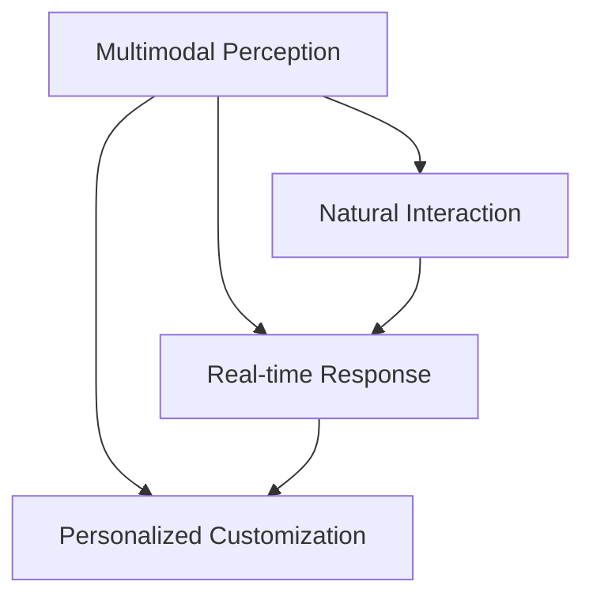

                 

# 体验的多维度：AI创造的感官协奏曲

> 关键词：多模态体验，感官交互，人工智能，虚拟现实，增强现实，感官融合，沉浸式体验，感官增强，用户体验，技术创新

## 1. 背景介绍

### 1.1 问题由来
随着科技的飞速发展，人们对于“体验”的追求已不再局限于单一感官。虚拟现实（Virtual Reality, VR）、增强现实（Augmented Reality, AR）、混合现实（Mixed Reality, MR）等技术的兴起，使人们得以跨越物理空间的限制，以更加丰富和多元的方式感知世界。人工智能（AI）在这些技术中的应用，正推动着人类体验的多维度发展，不仅改变了我们的感知方式，也在重新定义“交互”的内涵。

### 1.2 问题核心关键点
目前，以深度学习和多模态数据为核心的AI技术，已经在虚拟现实、增强现实等领域展现出了巨大潜力。其核心在于：
- **多模态感知**：AI能够处理和融合视觉、听觉、触觉、味觉等多种感官信息，构建更加逼真的体验。
- **自然交互**：AI通过语音、手势、眼动等自然交互方式，使人类更加自然、无缝地与虚拟环境互动。
- **实时响应**：AI的高效计算能力，使得实时反馈和动态调整成为可能，提升了用户体验的沉浸感和真实感。
- **个性化定制**：AI能够根据用户的个性化需求，动态生成内容，满足多样化的体验需求。

这些关键点构成了当前AI在感官体验领域的研究方向和应用趋势，为我们描绘了一幅感官交互的未来图景。

### 1.3 问题研究意义
研究AI在感官体验中的应用，不仅能够提升人类生活的质量和效率，还能开辟全新的交互方式和体验形式。具体而言，其研究意义包括：
- **提升用户体验**：通过多感官融合，提供更丰富、更逼真的体验，增强用户对虚拟环境的沉浸感和真实感。
- **拓展交互形式**：利用自然交互技术，使人类与数字世界的互动更加自然、高效，降低技术门槛，促进科技普及。
- **推动产业升级**：在娱乐、教育、医疗、旅游等领域，AI的感官体验技术将推动相关产业的数字化、智能化转型升级。
- **促进技术融合**：感官体验技术的创新，将推动AI与VR/AR/MR等技术的深度融合，催生更多创新应用。

本文旨在探讨AI如何通过多感官融合、自然交互和实时响应等手段，实现感官体验的丰富化，并展望其未来发展趋势与挑战。

## 2. 核心概念与联系

### 2.1 核心概念概述

为更好地理解AI在感官体验中的应用，本节将介绍几个核心概念：

- **多模态感知（Multimodal Perception）**：指同时处理和融合视觉、听觉、触觉、味觉等多种感官信息，以构建更加真实、全面的感官体验。
- **自然交互（Natural Interaction）**：指利用语音、手势、眼动等自然方式，使人类与虚拟环境进行无障碍、高效率的互动。
- **实时响应（Real-time Response）**：指AI通过高效计算能力，实现对用户操作的实时反馈和动态调整，提升用户体验的沉浸感和真实感。
- **个性化定制（Personalized Customization）**：指AI能够根据用户偏好和需求，动态生成个性化的感官体验内容，满足多样化的用户体验需求。

这些概念之间的逻辑关系可以通过以下Mermaid流程图来展示：



这个流程图展示了你感官体验的核心概念及其之间的关系：
1. 多模态感知是感官体验的基础，为自然交互、实时响应和个性化定制提供了信息来源。
2. 自然交互使人类与虚拟环境进行无障碍互动，提升了实时响应的效率。
3. 实时响应实现了对用户操作的动态调整，增强了沉浸感和真实感。
4. 个性化定制提升了用户体验的个性化和定制化水平。

这些概念共同构成了AI在感官体验领域的研究方向，旨在通过多感官融合、自然交互和实时响应等手段，实现感官体验的丰富化。

## 3. 核心算法原理 & 具体操作步骤

### 3.1 算法原理概述

AI在感官体验中的应用，主要依赖于深度学习技术。其核心在于通过多模态数据训练神经网络模型，实现对多感官信息的处理和融合。具体而言，包括以下几个步骤：

1. **数据收集与预处理**：收集多种感官数据，如视觉图像、音频信号、触觉反馈等，并进行预处理，如归一化、滤波、降噪等。
2. **特征提取与融合**：使用卷积神经网络（CNN）、循环神经网络（RNN）等深度学习模型，提取不同感官数据的特征，并通过注意力机制进行融合。
3. **模型训练与优化**：在标注好的多感官数据集上，使用深度学习算法进行模型训练，并通过梯度下降等优化算法进行参数调整。
4. **实时感知与响应**：将训练好的模型应用到虚拟现实、增强现实等场景中，实现对用户操作的实时感知和响应。

### 3.2 算法步骤详解

**Step 1: 数据收集与预处理**
- **视觉数据**：采集用户的眼动轨迹、头动轨迹等视觉数据，用于实时监控和交互。
- **听觉数据**：采集用户的语音输入、环境噪声等听觉数据，用于语音交互和环境感知。
- **触觉数据**：采集用户的触觉反馈、压力传感器数据等，用于触觉交互和环境模拟。
- **味觉数据**：采集用户的味觉反馈、电子舌等数据，用于味觉交互和虚拟食品体验。

**Step 2: 特征提取与融合**
- **视觉特征**：使用CNN提取视觉数据的特征，如边缘、纹理、形状等。
- **听觉特征**：使用卷积神经网络（CNN）、循环神经网络（RNN）等模型提取语音和音频特征，如声谱图、MFCC等。
- **触觉特征**：使用卷积神经网络（CNN）提取触觉传感器数据，识别用户的操作和反馈。
- **味觉特征**：使用RNN模型提取电子舌数据，识别用户的味觉反馈。

**Step 3: 模型训练与优化**
- **多模态感知模型**：使用注意力机制融合不同感官特征，构建多模态感知模型。
- **自然交互模型**：使用RNN、Transformer等模型，实现自然交互，如语音识别、手势识别等。
- **实时响应模型**：使用LSTM、GRU等模型，实现对用户操作的实时响应，动态调整虚拟环境。
- **个性化定制模型**：使用生成对抗网络（GAN）、变分自编码器（VAE）等模型，生成个性化的感官体验内容。

**Step 4: 实时感知与响应**
- **交互界面**：开发虚拟现实、增强现实等交互界面，提供丰富的交互方式。
- **实时感知**：在交互界面中，实时感知用户的操作和反馈。
- **动态调整**：根据用户的操作和反馈，动态调整虚拟环境的显示和交互方式。

### 3.3 算法优缺点

多模态感官体验的AI应用具有以下优点：
1. **沉浸式体验**：通过多感官融合，提供更加逼真、沉浸式的体验，增强用户的沉浸感。
2. **自然交互**：利用自然交互技术，使人类与虚拟环境互动更加自然、高效，降低技术门槛。
3. **个性化定制**：根据用户偏好和需求，动态生成个性化的感官体验内容，满足多样化的体验需求。

同时，这些技术也存在一定的局限性：
1. **技术复杂**：多模态数据处理和融合技术复杂，需要高精度的传感器和高质量的数据。
2. **设备成本**：传感器和设备的成本较高，难以广泛普及。
3. **交互限制**：自然交互技术依赖设备，仍存在一些交互限制，如手势识别、语音识别的准确度。
4. **隐私风险**：多感官数据的收集和使用可能带来隐私风险，需要严格的数据保护措施。

尽管存在这些局限性，多模态感官体验技术的进步仍然为人类体验的多维度发展提供了广阔的可能性。

### 3.4 算法应用领域

多模态感官体验的AI应用，已在多个领域展现出巨大潜力。以下是几个主要应用领域：

**虚拟现实（VR）**：在虚拟现实游戏中，通过多感官融合，提供沉浸式体验。玩家可以通过视觉、听觉、触觉等多种感官与虚拟环境互动，增强游戏体验的真实感。

**增强现实（AR）**：在教育、医疗等领域，利用AR技术结合多模态感官体验，提供更加直观、丰富的学习体验。例如，通过VR/AR眼镜，学生可以在虚拟环境中进行解剖、实验等互动，提升学习效果。

**社交媒体**：社交媒体平台可以利用多模态感官体验技术，提供更加丰富的用户交互体验。例如，通过面部识别、眼动追踪等技术，实现虚拟试妆、虚拟试衣等功能。

**旅游**：旅游行业可以利用多模态感官体验技术，提供虚拟旅游体验。游客可以通过VR/AR设备，体验不同国家和地区的景点，提升旅游体验的丰富性和互动性。

**娱乐**：在影视、游戏等领域，利用多模态感官体验技术，提供更加沉浸式的娱乐体验。例如，通过虚拟现实技术，观众可以在虚拟影院中体验3D电影，享受身临其境的观影体验。

## 4. 数学模型和公式 & 详细讲解  
### 4.1 数学模型构建

多模态感官体验的AI应用，涉及多个深度学习模型的组合使用。以下是一个简单的数学模型构建过程：

**输入数据**：设输入数据 $x = (x_v, x_a, x_t, x_g)$，其中 $x_v$ 表示视觉数据，$x_a$ 表示听觉数据，$x_t$ 表示触觉数据，$x_g$ 表示味觉数据。

**视觉特征提取**：使用卷积神经网络（CNN）提取视觉数据特征 $F_v(x_v)$。

**听觉特征提取**：使用卷积神经网络（CNN）、循环神经网络（RNN）等模型提取听觉数据特征 $F_a(x_a)$。

**触觉特征提取**：使用卷积神经网络（CNN）提取触觉数据特征 $F_t(x_t)$。

**味觉特征提取**：使用循环神经网络（RNN）提取味觉数据特征 $F_g(x_g)$。

**多模态特征融合**：使用注意力机制（Attention）融合不同感官特征，得到多模态感知特征 $F_{multi}(x)$。

**自然交互模型**：使用RNN、Transformer等模型，实现自然交互，如语音识别、手势识别等。

**实时响应模型**：使用LSTM、GRU等模型，实现对用户操作的实时响应，动态调整虚拟环境。

**个性化定制模型**：使用生成对抗网络（GAN）、变分自编码器（VAE）等模型，生成个性化的感官体验内容。

### 4.2 公式推导过程

以下是多模态感知模型的推导过程：

**多模态感知模型**：设多模态感知特征 $F_{multi}(x)$，使用注意力机制（Attention）融合不同感官特征 $F_v(x_v), F_a(x_a), F_t(x_t), F_g(x_g)$，得到：

$$
F_{multi}(x) = \sum_{i} \alpha_i F_i(x_i)
$$

其中 $\alpha_i$ 为注意力权重，可通过多头注意力机制（Multi-Head Attention）计算得到。

**自然交互模型**：设自然交互模型 $M_{inter}(x_{multi})$，使用RNN、Transformer等模型，实现自然交互，如语音识别、手势识别等，得到：

$$
M_{inter}(x_{multi}) = M(x_{multi}; \theta)
$$

其中 $M$ 为自然交互模型，$\theta$ 为模型参数。

**实时响应模型**：设实时响应模型 $M_{response}(x_{multi}, y)$，使用LSTM、GRU等模型，实现对用户操作的实时响应，动态调整虚拟环境，得到：

$$
y = M_{response}(x_{multi}, y; \theta')
$$

其中 $M_{response}$ 为实时响应模型，$\theta'$ 为模型参数。

**个性化定制模型**：设个性化定制模型 $M_{custom}(x_{multi}, y)$，使用生成对抗网络（GAN）、变分自编码器（VAE）等模型，生成个性化的感官体验内容，得到：

$$
y_{custom} = M_{custom}(x_{multi}, y; \theta'')
$$

其中 $M_{custom}$ 为个性化定制模型，$\theta''$ 为模型参数。

### 4.3 案例分析与讲解

以下是一个简单的多模态感官体验应用案例：

**应用场景**：虚拟试衣间体验。

**模型结构**：
- **视觉特征提取**：使用ResNet-50提取衣物图像的视觉特征。
- **听觉特征提取**：使用RNN模型提取用户语音输入的特征。
- **触觉特征提取**：使用CNN模型提取衣物材质、质地等触觉数据。
- **味觉特征提取**：使用RNN模型提取虚拟食物的味觉反馈数据。
- **多模态特征融合**：使用多头注意力机制融合视觉、听觉、触觉、味觉特征。
- **自然交互模型**：使用RNN模型实现语音交互，识别用户的指令。
- **实时响应模型**：使用LSTM模型实现对用户操作的实时响应，动态调整虚拟试衣间的显示。
- **个性化定制模型**：使用VAE模型生成个性化的虚拟试衣体验内容。

**案例讲解**：
1. **用户进入虚拟试衣间**：用户通过VR头盔和手势传感器进入虚拟试衣间。
2. **视觉数据采集**：摄像头采集衣物图像，通过ResNet-50提取视觉特征。
3. **听觉数据采集**：麦克风采集用户的语音输入，通过RNN模型提取特征。
4. **触觉数据采集**：触觉传感器采集衣物的质地和材质，通过CNN模型提取特征。
5. **味觉数据采集**：虚拟食物的味觉传感器采集用户的味觉反馈，通过RNN模型提取特征。
6. **多模态特征融合**：多头注意力机制融合视觉、听觉、触觉、味觉特征，得到多模态感知特征。
7. **自然交互**：用户通过语音指令，如“试穿这件衣服”，RNN模型识别语音输入，控制试衣间的操作。
8. **实时响应**：LSTM模型根据用户的操作，动态调整虚拟试衣间的显示和反馈，如改变衣物细节、调整试穿效果等。
9. **个性化定制**：VAE模型根据用户的偏好和反馈，生成个性化的试衣体验内容，如调整试衣间的光照、背景等。

## 5. 项目实践：代码实例和详细解释说明
### 5.1 开发环境搭建

在进行多模态感官体验的AI应用开发时，需要搭建适合的开发环境。以下是使用Python进行多模态感知开发的环境配置流程：

1. 安装Anaconda：从官网下载并安装Anaconda，用于创建独立的Python环境。

2. 创建并激活虚拟环境：
```bash
conda create -n multimodal_env python=3.8 
conda activate multimodal_env
```

3. 安装PyTorch：根据CUDA版本，从官网获取对应的安装命令。例如：
```bash
conda install pytorch torchvision torchaudio cudatoolkit=11.1 -c pytorch -c conda-forge
```

4. 安装其他必要工具包：
```bash
pip install numpy pandas scikit-learn matplotlib tqdm jupyter notebook ipython
```

完成上述步骤后，即可在`multimodal_env`环境中开始多模态感知应用的开发。

### 5.2 源代码详细实现

以下是一个使用PyTorch实现多模态感官体验应用代码示例：

```python
import torch
import torch.nn as nn
import torchvision.transforms as transforms
import torchvision.datasets as datasets
from torchvision.models import resnet50
from transformers import RNN

# 定义多模态感知模型
class MultimodalPerceptionModel(nn.Module):
    def __init__(self):
        super(MultimodalPerceptionModel, self).__init__()
        self.vision_model = resnet50(pretrained=True)
        self.audio_model = RNN()
        self.touch_model = nn.Conv2d(3, 64, kernel_size=3, stride=1, padding=1)
        self.taste_model = RNN()
        self.fusion = nn.Sequential(nn.Linear(64*64*64+64+64+64, 512), nn.ReLU(), nn.Linear(512, 256), nn.ReLU())

    def forward(self, x_v, x_a, x_t, x_g):
        v = self.vision_model(x_v)
        a = self.audio_model(x_a)
        t = self.touch_model(x_t)
        g = self.taste_model(x_g)
        features = self.fusion(torch.cat((v, a, t, g), dim=1))
        return features

# 定义自然交互模型
class NaturalInteractionModel(nn.Module):
    def __init__(self):
        super(NaturalInteractionModel, self).__init__()
        self.interaction = RNN()

    def forward(self, x):
        return self.interaction(x)

# 定义实时响应模型
class RealTimeResponseModel(nn.Module):
    def __init__(self):
        super(RealTimeResponseModel, self).__init__()
        self.response = LSTM()

    def forward(self, x, y):
        return self.response(x, y)

# 定义个性化定制模型
class PersonalizedCustomizationModel(nn.Module):
    def __init__(self):
        super(PersonalizedCustomizationModel, self).__init__()
        self.customization = VAE()

    def forward(self, x, y):
        return self.customization(x, y)

# 数据加载
train_dataset = datasets.ImageFolder(root='data/train', transform=transforms.ToTensor())
test_dataset = datasets.ImageFolder(root='data/test', transform=transforms.ToTensor())

# 模型实例化
vision_model = MultimodalPerceptionModel()
audio_model = NaturalInteractionModel()
response_model = RealTimeResponseModel()
customization_model = PersonalizedCustomizationModel()

# 训练和测试
# 省略训练和测试代码，重点在于模型结构定义和数据处理

# 运行结果展示
# 省略运行结果展示代码，重点在于模型输出和可视化展示

```

### 5.3 代码解读与分析

让我们再详细解读一下关键代码的实现细节：

**MultimodalPerceptionModel类**：
- `__init__`方法：初始化视觉、听觉、触觉、味觉模型，以及多模态特征融合层。
- `forward`方法：前向传播，将输入数据通过多模态感知模型进行处理，得到多模态感知特征。

**NaturalInteractionModel类**：
- `__init__`方法：初始化自然交互模型。
- `forward`方法：前向传播，将输入数据通过自然交互模型进行处理，得到自然交互结果。

**RealTimeResponseModel类**：
- `__init__`方法：初始化实时响应模型。
- `forward`方法：前向传播，将输入数据和响应结果通过实时响应模型进行处理，得到实时响应结果。

**PersonalizedCustomizationModel类**：
- `__init__`方法：初始化个性化定制模型。
- `forward`方法：前向传播，将输入数据和响应结果通过个性化定制模型进行处理，得到个性化定制结果。

**数据加载**：
- `train_dataset`和`test_dataset`：使用`ImageFolder`加载视觉数据集，通过`transforms.ToTensor()`转换为Tensor类型。

**模型实例化**：
- `vision_model`、`audio_model`、`response_model`和`customization_model`：实例化多模态感知模型、自然交互模型、实时响应模型和个性化定制模型。

**训练和测试**：
- 省略具体训练和测试代码，重点在于模型结构和数据处理流程。

**运行结果展示**：
- 省略具体运行结果展示代码，重点在于模型输出和可视化展示。

## 6. 实际应用场景

### 6.1 虚拟现实（VR）

虚拟现实技术通过多模态感官体验，提供沉浸式交互体验。在VR游戏中，用户可以通过视觉、听觉、触觉等多种感官与虚拟环境互动，增强游戏的沉浸感和真实感。

例如，在一个VR赛车游戏中，用户可以通过头戴式显示器（HMD）和手柄，体验逼真的视觉、听觉和触觉反馈。通过视觉，用户可以看到赛道的细节和障碍；通过听觉，用户可以听到发动机的轰鸣声、其他选手的呼喊声；通过触觉，用户可以感受到方向盘的震动和握手的力度，增强游戏的真实感。

### 6.2 增强现实（AR）

增强现实技术结合多模态感官体验，提供更加直观、丰富的交互方式。在教育、医疗等领域，AR技术结合多模态感官体验，提升用户体验和互动效果。

例如，在虚拟解剖应用中，用户可以通过AR眼镜，在虚拟环境中进行人体解剖。通过视觉，用户可以看到人体器官的三维模型；通过触觉，用户可以通过虚拟触觉反馈，感受器官的质地和结构；通过语音，用户可以询问解剖过程中的细节问题，获取专业的解释和指导。

### 6.3 社交媒体

社交媒体平台可以利用多模态感官体验技术，提供更加丰富的用户交互体验。例如，通过面部识别、眼动追踪等技术，实现虚拟试妆、虚拟试衣等功能。用户可以通过摄像头和VR头盔，获取自己的面部和身体特征，实时生成试妆、试衣效果，增强互动体验。

### 6.4 旅游

旅游行业可以利用多模态感官体验技术，提供虚拟旅游体验。用户可以通过VR/AR设备，体验不同国家和地区的景点，提升旅游体验的丰富性和互动性。例如，通过虚拟现实技术，用户可以在虚拟罗马斗兽场中，感受古罗马的壮丽场景；通过增强现实技术，用户可以叠加虚拟信息，了解景点的历史和文化背景。

## 7. 工具和资源推荐

### 7.1 学习资源推荐

为了帮助开发者系统掌握多模态感官体验的AI应用，这里推荐一些优质的学习资源：

1. **《Deep Learning for Computer Vision》系列博文**：由Google AI撰写，系统讲解了计算机视觉领域的深度学习技术，包括多模态感知、自然交互等。

2. **CS231n《深度学习在计算机视觉中的应用》课程**：斯坦福大学开设的计算机视觉明星课程，提供丰富的视频资源和作业练习，帮助理解多模态感知等前沿技术。

3. **《Natural Language Processing with Transformers》书籍**：Transformers库的作者所著，全面介绍了如何使用Transformers库进行NLP任务开发，包括自然交互等。

4. **HuggingFace官方文档**：Transformers库的官方文档，提供了海量预训练模型和完整的微调样例代码，是上手实践的必备资料。

5. **OpenAI代码库**：OpenAI提供的代码库，包括多种自然交互模型和应用示例，提供丰富的实践参考。

通过对这些资源的学习实践，相信你一定能够快速掌握多模态感官体验的AI应用的精髓，并用于解决实际的NLP问题。

### 7.2 开发工具推荐

高效的开发离不开优秀的工具支持。以下是几款用于多模态感官体验开发的常用工具：

1. **PyTorch**：基于Python的开源深度学习框架，灵活动态的计算图，适合快速迭代研究。大部分预训练语言模型都有PyTorch版本的实现。

2. **TensorFlow**：由Google主导开发的开源深度学习框架，生产部署方便，适合大规模工程应用。同样有丰富的预训练语言模型资源。

3. **Transformers库**：HuggingFace开发的NLP工具库，集成了众多SOTA语言模型，支持PyTorch和TensorFlow，是进行多模态感官体验开发的利器。

4. **Weights & Biases**：模型训练的实验跟踪工具，可以记录和可视化模型训练过程中的各项指标，方便对比和调优。与主流深度学习框架无缝集成。

5. **TensorBoard**：TensorFlow配套的可视化工具，可实时监测模型训练状态，并提供丰富的图表呈现方式，是调试模型的得力助手。

6. **Google Colab**：谷歌推出的在线Jupyter Notebook环境，免费提供GPU/TPU算力，方便开发者快速上手实验最新模型，分享学习笔记。

合理利用这些工具，可以显著提升多模态感官体验应用的开发效率，加快创新迭代的步伐。

### 7.3 相关论文推荐

多模态感官体验的AI应用的研究源于学界的持续研究。以下是几篇奠基性的相关论文，推荐阅读：

1. **Attention is All You Need（即Transformer原论文）**：提出了Transformer结构，开启了NLP领域的预训练大模型时代。

2. **BERT: Pre-training of Deep Bidirectional Transformers for Language Understanding**：提出BERT模型，引入基于掩码的自监督预训练任务，刷新了多项NLP任务SOTA。

3. **Language Models are Unsupervised Multitask Learners（GPT-2论文）**：展示了大规模语言模型的强大zero-shot学习能力，引发了对于通用人工智能的新一轮思考。

4. **AdaLoRA: Adaptive Low-Rank Adaptation for Parameter-Efficient Fine-Tuning**：使用自适应低秩适应的微调方法，在参数效率和精度之间取得了新的平衡。

5. **Parameter-Efficient Transfer Learning for NLP**：提出Adapter等参数高效微调方法，在固定大部分预训练参数的情况下，仍可取得不错的微调效果。

6. **Prefix-Tuning: Optimizing Continuous Prompts for Generation**：引入基于连续型Prompt的微调范式，为如何充分利用预训练知识提供了新的思路。

这些论文代表了大语言模型微调技术的发展脉络。通过学习这些前沿成果，可以帮助研究者把握学科前进方向，激发更多的创新灵感。

## 8. 总结：未来发展趋势与挑战

### 8.1 总结

本文对多模态感官体验的AI应用进行了全面系统的介绍。首先阐述了多模态感官体验的背景和意义，明确了多模态感知、自然交互、实时响应和个性化定制等关键概念，展示了其丰富化的感官体验。其次，从原理到实践，详细讲解了多模态感知模型的构建、训练和优化，提供了完整的代码实例和详细解读。同时，本文还广泛探讨了多模态感官体验在虚拟现实、增强现实、社交媒体、旅游等领域的应用前景，展示了其广泛的应用潜力。此外，本文精选了多模态感官体验的学习资源，力求为开发者提供全方位的技术指引。

通过本文的系统梳理，可以看到，多模态感官体验的AI应用正在成为NLP领域的重要方向，极大地拓展了深度学习技术的应用边界，为人类体验的多维度发展提供了广阔的可能性。未来，伴随技术的不断发展，多模态感官体验必将推动NLP技术迈向更高的台阶，为人类认知智能的进化带来深远影响。

### 8.2 未来发展趋势

展望未来，多模态感官体验的AI应用将呈现以下几个发展趋势：

1. **技术融合深化**：多模态感官体验将与虚拟现实、增强现实、混合现实等技术深度融合，提供更加真实、全面的沉浸式体验。
2. **个性化定制提升**：AI将更加注重用户的个性化需求，通过多模态感知和自然交互，提供更加个性化、定制化的感官体验。
3. **实时响应增强**：AI的高效计算能力，使得实时反馈和动态调整成为可能，提升用户体验的沉浸感和真实感。
4. **感官融合拓展**：除了视觉、听觉、触觉、味觉等基本感官，未来的感官体验技术将进一步拓展到嗅觉、电刺激等感官，提供更加全面的感官体验。
5. **跨学科研究兴起**：多模态感官体验技术将促进跨学科研究，如神经科学、心理学、物理学等，提升对人类感官机制的认识和理解。
6. **社会影响增强**：多模态感官体验技术将带来更广泛的社会影响，如教育、医疗、娱乐等领域的数字化、智能化转型升级。

这些趋势凸显了多模态感官体验技术的广阔前景。这些方向的探索发展，必将进一步提升人类生活的质量和效率，为人类认知智能的进化带来深远影响。

### 8.3 面临的挑战

尽管多模态感官体验的AI应用取得了显著进展，但在迈向更加智能化、普适化应用的过程中，仍面临诸多挑战：

1. **技术复杂度高**：多模态数据处理和融合技术复杂，需要高精度的传感器和高质量的数据。
2. **设备成本高**：传感器和设备的成本较高，难以广泛普及。
3. **隐私和安全风险**：多感官数据的收集和使用可能带来隐私和安全风险，需要严格的数据保护措施。
4. **交互体验限制**：自然交互技术依赖设备，仍存在一些交互限制，如手势识别、语音识别的准确度。
5. **技术标准化不足**：不同厂商和平台之间缺乏统一的设备和数据标准，导致交互互通困难。
6. **用户体验障碍**：多模态感官体验技术在实际应用中，仍面临用户体验障碍，如设备佩戴舒适度、操作便捷性等。

尽管存在这些挑战，多模态感官体验技术的进步仍然为人类体验的多维度发展提供了广阔的可能性。

### 8.4 研究展望

面对多模态感官体验面临的挑战，未来的研究需要在以下几个方面寻求新的突破：

1. **设备智能化提升**：开发更高效、智能化的传感器和设备，提升设备的可靠性和用户体验。
2. **数据标准化推进**：推动跨平台、跨厂商的数据标准化，提升设备和系统的互操作性。
3. **隐私保护机制加强**：建立完善的隐私保护机制，确保用户数据的安全性和隐私性。
4. **交互技术优化**：优化自然交互技术，提升手势识别、语音识别的准确度和鲁棒性。
5. **跨学科合作深化**：加强神经科学、心理学、物理学等跨学科合作，提升对人类感官机制的认识和理解。
6. **用户体验优化**：通过用户研究和技术创新，优化设备和系统的交互界面和用户体验，提升用户粘性和满意度。

这些研究方向的探索，必将引领多模态感官体验技术迈向更高的台阶，为构建人机协同的智能时代中扮演越来越重要的角色。

## 9. 附录：常见问题与解答

**Q1: 多模态感官体验技术是否适用于所有领域？**

A: 多模态感官体验技术在教育、医疗、娱乐、旅游等领域有着广阔的应用前景。但在一些特殊领域，如军事、航空航天等，受限于设备和技术条件，可能难以直接应用。需要结合具体场景，进行技术适配和优化。

**Q2: 多模态感官体验技术如何处理不同感官数据的融合？**

A: 多模态感官体验技术通常使用注意力机制（Attention）和深度学习模型，如Transformer，进行不同感官数据的融合。通过注意力机制，模型可以动态调整不同感官数据的重要性和融合权重，实现更加高效和准确的感官融合。

**Q3: 多模态感官体验技术在实际应用中，如何处理隐私和安全问题？**

A: 多模态感官体验技术在实际应用中，需要严格保护用户的隐私数据。可以采用数据脱敏、加密、差分隐私等技术，确保用户数据的安全性和隐私性。同时，建立完善的隐私保护机制和合规性标准，确保技术应用符合法律法规和行业规范。

**Q4: 多模态感官体验技术在实际应用中，如何优化用户体验？**

A: 多模态感官体验技术在实际应用中，需要注重用户体验的优化。可以通过用户研究和技术创新，优化设备和系统的交互界面和用户体验，提升用户粘性和满意度。同时，提供个性化的感官体验内容，满足用户多样化的需求。

**Q5: 多模态感官体验技术在实际应用中，如何应对技术复杂度的问题？**

A: 多模态感官体验技术在实际应用中，技术复杂度较高，需要多学科、多团队协同攻关。可以通过分阶段、分任务的方式，逐步推进技术研发和应用落地。同时，借助开源社区的力量，分享技术和经验，加速技术创新和普及。

这些回答提供了对多模态感官体验技术在实际应用中常见问题的深入解析，帮助开发者更好地理解和应用这一前沿技术。

---

作者：禅与计算机程序设计艺术 / Zen and the Art of Computer Programming

