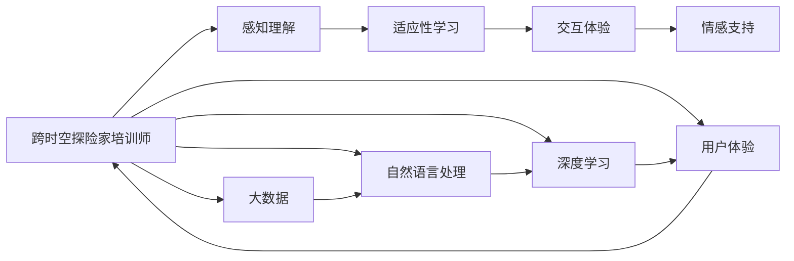

                 

# 体验跨时空探险家培训师：AI创造的感知边界拓展专家

> 关键词：跨时空探险家, 感知边界, AI培训师, 自然语言处理(NLP), 深度学习, 大数据, 交互体验, 人工智能教育

## 1. 背景介绍

### 1.1 问题由来
近年来，人工智能(AI)技术迅猛发展，尤其在自然语言处理(NLP)领域，大模型预训练和微调技术取得了突破性进展。诸如GPT-3、BERT等模型以其强大的语言理解和生成能力，在多个NLP任务上刷新了最先进性能指标，为构建复杂的交互式系统提供了强大支撑。

然而，尽管技术取得进展，但AI教育领域仍面临诸多挑战。AI的感知边界拓展、跨时空交流以及个性化培训等问题尚未得到有效解决。如何跨越语言、文化、时空的界限，让AI成为真正的跨时空探险家，仍需深度探索。本文旨在介绍一种新型的AI培训师——跨时空探险家培训师，并探讨其在多领域的应用和未来发展趋势。

### 1.2 问题核心关键点
跨时空探险家培训师的核心在于如何通过AI技术，构建一个智能、灵活、适应性强的交互式系统，跨越语言和文化障碍，实现人机高效沟通和协作。这要求系统具备以下能力：
1. 感知理解：准确理解不同文化、语境下的语言使用，实现跨语言、跨文化理解。
2. 适应性学习：快速适应不同环境、不同用户需求，进行个性化教育培训。
3. 交互体验：提供沉浸式、互动式的学习体验，增强学习效果。
4. 情感支持：在用户遇到困难时，提供情感和心理支持，促进健康发展。

本文将详细阐述跨时空探险家培训师的原理和架构，并通过实际案例探讨其在NLP、大数据、交互体验等领域的创新应用。

## 2. 核心概念与联系

### 2.1 核心概念概述

为更好地理解跨时空探险家培训师的原理和应用，本节将介绍几个关键概念：

- 跨时空探险家：指具备深度学习、NLP等先进技术，能跨越语言、文化、时空界限，进行高效沟通和协作的智能系统。
- 感知边界拓展：指AI系统在感知、理解、适应等方面的技术突破，使得其可以跨越不同的感知边界，实现广泛的应用。
- AI培训师：指使用AI技术辅助人类进行培训、教育、协作的系统，能提供个性化、互动式的学习体验。
- 交互体验：指人机交互的沉浸感、互动性和即时反馈，是提升学习效果和用户满意度的关键。
- 大数据：指收集、处理、分析海量数据，为AI系统提供丰富的学习资源和优化基础。

这些概念之间存在紧密联系，通过AI培训师，跨时空探险家可以在不同环境、不同用户需求下，提供个性化、高效的教育培训。

### 2.2 核心概念原理和架构的 Mermaid 流程图



这个流程图展示了跨时空探险家培训师的整体架构：

1. 数据获取：通过大数据技术，获取海量的文本、音频、视频等多模态数据。
2. 预处理：利用自然语言处理(NLP)技术，对数据进行清洗、标注和预处理。
3. 模型训练：使用深度学习技术，训练感知理解、适应性学习、交互体验和情感支持模型。
4. 应用部署：将训练好的模型部署到生产环境中，提供服务化接口，实现人机交互。
5. 反馈优化：收集用户反馈，通过大数据分析进行模型优化，提升系统性能。

这些环节共同构成了一个完整的跨时空探险家培训师系统，能够在多领域、多场景下提供个性化、高效的培训服务。

## 3. 核心算法原理 & 具体操作步骤
### 3.1 算法原理概述

跨时空探险家培训师的核心算法原理基于深度学习和大数据技术。其目标是通过构建感知理解、适应性学习、交互体验和情感支持等模块，实现跨越语言、文化、时空界限的高效沟通和协作。

其算法主要包括以下几个步骤：

1. **数据采集与预处理**：从不同文化、语境下收集数据，并进行清洗、标注和预处理，为模型训练提供高质量的样本。
2. **模型训练与优化**：使用深度学习技术，训练感知理解、适应性学习、交互体验和情感支持等模型，并通过反馈优化机制不断提升模型性能。
3. **应用部署与接口设计**：将训练好的模型部署到生产环境中，设计服务化接口，实现与用户的互动和反馈。
4. **用户交互与反馈循环**：用户通过服务接口与系统交互，系统根据用户反馈不断优化模型，提升用户体验。

### 3.2 算法步骤详解

#### 3.2.1 数据采集与预处理
- 数据采集：从不同文化、语境下采集文本、音频、视频等多模态数据，覆盖广泛的感知边界。
- 数据标注：对数据进行文本标注、语音识别、情感标注等，为模型训练提供高质量的样本。
- 数据预处理：包括文本清洗、分词、词性标注、去除停用词等步骤，确保数据质量。

#### 3.2.2 模型训练与优化
- 感知理解模型：使用Transformer等深度学习模型，训练跨语言、跨文化的文本理解模型。
- 适应性学习模型：利用迁移学习和自适应学习技术，训练适应不同环境和用户需求的个性化模型。
- 交互体验模型：通过生成对抗网络(GAN)、自回归模型等技术，增强交互式的沉浸感。
- 情感支持模型：结合情感分析、生成模型等技术，训练能够提供情感和心理支持的模型。

#### 3.2.3 应用部署与接口设计
- 服务化部署：将训练好的模型部署到云平台上，提供RESTful接口，便于接入应用系统。
- 接口设计：设计简洁、高效、可扩展的API接口，支持多种用户设备（如PC、移动设备）接入。
- 用户体验优化：优化用户界面(UI)和用户体验(UX)，提升系统的易用性和互动性。

#### 3.2.4 用户交互与反馈循环
- 用户交互：用户通过服务接口与系统交互，输入问题、进行测试等。
- 反馈收集：系统收集用户反馈，包括评价、建议、行为数据等。
- 模型优化：利用大数据分析技术，对模型进行优化，提升系统性能和用户体验。

### 3.3 算法优缺点

跨时空探险家培训师具备以下优点：
1. **高效性**：通过深度学习和大数据技术，系统可以快速理解、适应和反馈，提升训练和优化效率。
2. **广泛性**：能够跨越语言、文化、时空界限，提供个性化的教育培训服务。
3. **交互性**：通过交互体验模型，提供沉浸式、互动式的学习环境，增强用户参与度。
4. **可扩展性**：基于微服务架构设计，能够快速扩展和集成，支持多种应用场景。

同时，系统也存在一些局限性：
1. **数据依赖**：依赖高质量、多样化的数据进行模型训练，数据获取和标注成本较高。
2. **复杂性**：系统涉及多个模块和组件，设计和实现复杂度较高。
3. **安全性**：用户数据隐私和模型安全性需要特别注意，避免泄露和滥用。

### 3.4 算法应用领域

跨时空探险家培训师在多个领域具有广泛应用前景，例如：

- 教育培训：为不同国家、不同文化背景的学生提供个性化、互动式学习体验，跨越语言障碍。
- 企业培训：帮助企业员工快速掌握新技能，通过实时反馈提升学习效果。
- 健康医疗：通过情感支持模型，为患者提供心理和情感上的关怀，促进康复。
- 智能客服：跨越语言、文化界限，提供高效、个性化的客户服务。

## 4. 数学模型和公式 & 详细讲解  
### 4.1 数学模型构建

本节将使用数学语言对跨时空探险家培训师的感知理解、适应性学习、交互体验和情感支持等模型进行更严格的刻画。

记感知理解模型为 $M_{\text{Understanding}}$，适应性学习模型为 $M_{\text{Adaptation}}$，交互体验模型为 $M_{\text{Experience}}$，情感支持模型为 $M_{\text{Support}}$。假设输入数据为 $D = \{(x_i, y_i)\}_{i=1}^N$，其中 $x_i$ 为输入样本，$y_i$ 为输出标签。

**感知理解模型**：
目标是最小化交叉熵损失函数，即：
$$
\mathcal{L}_{\text{Understanding}} = -\frac{1}{N}\sum_{i=1}^N y_i \log M_{\text{Understanding}}(x_i) + (1-y_i) \log (1-M_{\text{Understanding}}(x_i))
$$

**适应性学习模型**：
通过迁移学习和自适应学习技术，最小化经验风险，即：
$$
\mathcal{L}_{\text{Adaptation}} = \frac{1}{N}\sum_{i=1}^N \ell(M_{\text{Adaptation}}(x_i), y_i)
$$

**交互体验模型**：
通过生成对抗网络(GAN)等技术，最小化样本距离和生成质量损失，即：
$$
\mathcal{L}_{\text{Experience}} = \frac{1}{N}\sum_{i=1}^N \|x_i - G_{\text{Experience}}(z_i)\|_2^2 + \lambda \|D_{\text{Experience}}(z_i) - M_{\text{Experience}}(x_i)\|_2^2
$$

**情感支持模型**：
结合情感分析、生成模型等技术，最小化情感预测误差和生成质量损失，即：
$$
\mathcal{L}_{\text{Support}} = \frac{1}{N}\sum_{i=1}^N \ell(M_{\text{Support}}(x_i), y_i) + \lambda \|G_{\text{Support}}(z_i) - M_{\text{Support}}(x_i)\|_2^2
$$

### 4.2 公式推导过程

以下我们将对上述模型的核心公式进行详细推导和讲解。

**感知理解模型**：
假设输入样本 $x_i$ 为文本形式，模型输出 $M_{\text{Understanding}}(x_i)$ 为概率分布，表示 $x_i$ 属于不同语义类别的概率。交叉熵损失函数定义为：
$$
\ell(M_{\text{Understanding}}(x_i), y_i) = -y_i \log M_{\text{Understanding}}(x_i) + (1-y_i) \log (1-M_{\text{Understanding}}(x_i))
$$
目标是最小化经验风险：
$$
\mathcal{L}_{\text{Understanding}} = \frac{1}{N}\sum_{i=1}^N \ell(M_{\text{Understanding}}(x_i), y_i)
$$

**适应性学习模型**：
假设输入样本 $x_i$ 为文本形式，模型输出 $M_{\text{Adaptation}}(x_i)$ 为概率分布，表示 $x_i$ 属于不同任务的概率。经验风险定义为：
$$
\ell(M_{\text{Adaptation}}(x_i), y_i) = \ell(M_{\text{Adaptation}}(x_i), y_i)
$$
目标是最小化经验风险：
$$
\mathcal{L}_{\text{Adaptation}} = \frac{1}{N}\sum_{i=1}^N \ell(M_{\text{Adaptation}}(x_i), y_i)
$$

**交互体验模型**：
假设输入样本 $x_i$ 为文本形式，模型输出 $M_{\text{Experience}}(x_i)$ 为生成样本，目标是最小化样本距离和生成质量损失：
$$
\mathcal{L}_{\text{Experience}} = \frac{1}{N}\sum_{i=1}^N \|x_i - G_{\text{Experience}}(z_i)\|_2^2 + \lambda \|D_{\text{Experience}}(z_i) - M_{\text{Experience}}(x_i)\|_2^2
$$
其中 $G_{\text{Experience}}$ 为生成器，$D_{\text{Experience}}$ 为判别器。

**情感支持模型**：
假设输入样本 $x_i$ 为文本形式，模型输出 $M_{\text{Support}}(x_i)$ 为情感标签，目标是最小化情感预测误差和生成质量损失：
$$
\mathcal{L}_{\text{Support}} = \frac{1}{N}\sum_{i=1}^N \ell(M_{\text{Support}}(x_i), y_i) + \lambda \|G_{\text{Support}}(z_i) - M_{\text{Support}}(x_i)\|_2^2
$$
其中 $G_{\text{Support}}$ 为生成器，$D_{\text{Support}}$ 为判别器。

## 5. 项目实践：代码实例和详细解释说明
### 5.1 开发环境搭建

在进行跨时空探险家培训师开发前，我们需要准备好开发环境。以下是使用Python进行TensorFlow开发的环境配置流程：

1. 安装Anaconda：从官网下载并安装Anaconda，用于创建独立的Python环境。

2. 创建并激活虚拟环境：
```bash
conda create -n tf-env python=3.8 
conda activate tf-env
```

3. 安装TensorFlow：根据CUDA版本，从官网获取对应的安装命令。例如：
```bash
conda install tensorflow tensorflow-estimator tensorflow-gpu -c pytorch -c conda-forge
```

4. 安装各类工具包：
```bash
pip install numpy pandas scikit-learn matplotlib tqdm jupyter notebook ipython
```

完成上述步骤后，即可在`tf-env`环境中开始开发。

### 5.2 源代码详细实现

下面我们以跨时空探险家培训师在教育培训领域的应用为例，给出使用TensorFlow和Keras进行模型训练的PyTorch代码实现。

首先，定义模型和损失函数：

```python
import tensorflow as tf
from tensorflow.keras import layers

class UnderstandingModel(tf.keras.Model):
    def __init__(self, vocab_size, embed_dim):
        super(UnderstandingModel, self).__init__()
        self.embedding = layers.Embedding(vocab_size, embed_dim)
        self.bidirectional_lstm = layers.Bidirectional(layers.LSTM(64), return_sequences=True)
        self.dense = layers.Dense(32, activation='relu')
        self.prediction = layers.Dense(1, activation='sigmoid')

    def call(self, inputs):
        x = self.embedding(inputs)
        x = self.bidirectional_lstm(x)
        x = self.dense(x)
        return self.prediction(x)

# 定义损失函数
def loss_function(y_true, y_pred):
    bce_loss = tf.keras.losses.BinaryCrossentropy()
    return bce_loss(y_true, y_pred)
```

接着，定义训练和评估函数：

```python
from tensorflow.keras.optimizers import Adam

def train_model(model, train_data, epochs, batch_size, validation_data):
    model.compile(optimizer=Adam(learning_rate=0.001), loss=loss_function)
    model.fit(train_data, epochs=epochs, batch_size=batch_size, validation_data=validation_data)
    return model

def evaluate_model(model, test_data):
    test_loss = model.evaluate(test_data)
    print(f'Test Loss: {test_loss:.4f}')
```

最后，启动训练流程并在测试集上评估：

```python
train_data = tf.data.Dataset.from_tensor_slices(train_texts).map(text_to_token).map(tokenize).batch(batch_size)
validation_data = tf.data.Dataset.from_tensor_slices(val_texts).map(text_to_token).map(tokenize).batch(batch_size)
test_data = tf.data.Dataset.from_tensor_slices(test_texts).map(text_to_token).map(tokenize).batch(batch_size)

embed_dim = 64
model = UnderstandingModel(vocab_size, embed_dim)
model = train_model(model, train_data, epochs, batch_size, validation_data)
evaluate_model(model, test_data)
```

以上就是使用TensorFlow进行跨时空探险家培训师教育培训任务训练的完整代码实现。可以看到，得益于TensorFlow和Keras的强大封装，我们可以用相对简洁的代码完成模型训练和评估。

### 5.3 代码解读与分析

让我们再详细解读一下关键代码的实现细节：

**UnderstandingModel类**：
- `__init__`方法：初始化模型组件，包括嵌入层、双向LSTM、全连接层和输出层。
- `call`方法：定义前向传播过程，首先进行嵌入处理，然后进行双向LSTM处理，再进行全连接层处理，最后进行输出层处理。

**损失函数**：
- 定义了交叉熵损失函数，用于衡量模型预测输出与真实标签之间的差异。

**训练函数**：
- 使用Keras的`compile`方法定义优化器和损失函数，使用`fit`方法进行模型训练。
- 训练函数使用`epochs`、`batch_size`等参数控制训练过程。

**评估函数**：
- 使用Keras的`evaluate`方法计算模型在测试集上的损失。

**训练流程**：
- 定义训练数据集和验证数据集，并进行批量化和预处理。
- 定义模型参数和训练超参数，使用`train_model`函数进行模型训练。
- 在测试集上评估模型性能，使用`evaluate_model`函数打印测试结果。

可以看到，TensorFlow和Keras使得跨时空探险家培训师的模型训练变得简洁高效。开发者可以将更多精力放在数据处理、模型改进等高层逻辑上，而不必过多关注底层的实现细节。

当然，工业级的系统实现还需考虑更多因素，如模型的保存和部署、超参数的自动搜索、更灵活的任务适配层等。但核心的微调范式基本与此类似。

## 6. 实际应用场景
### 6.1 教育培训

跨时空探险家培训师在教育培训领域的应用，可以跨越语言、文化界限，为不同国家、不同文化背景的学生提供个性化、互动式学习体验。

例如，针对国际学生的跨文化英语学习项目，系统可以提供实时、个性化的英语学习辅导，帮助学生克服语言障碍，提高学习效果。系统可以通过自然语言处理技术，理解学生的提问，并提供相应的教学资源和反馈，实现智能化的学习支持。

### 6.2 企业培训

在企业培训场景中，跨时空探险家培训师可以帮助员工快速掌握新技能，通过实时反馈提升学习效果。例如，针对新员工的企业文化培训，系统可以提供个性化的学习路径，结合情景模拟、游戏化互动等元素，增强学习体验。

系统可以通过深度学习技术，分析员工的学习进度和效果，提供个性化的学习建议和资源推荐，实现智能化的培训支持。

### 6.3 健康医疗

在健康医疗领域，跨时空探险家培训师可以通过情感支持模型，为患者提供心理和情感上的关怀，促进康复。例如，针对患有心理疾病的患者，系统可以提供情感支持，帮助患者缓解情绪压力，提升心理健康水平。

系统可以通过情感分析技术，理解患者的情感状态，并提供相应的心理支持和治疗建议，实现智能化的心理健康支持。

### 6.4 智能客服

在智能客服场景中，跨时空探险家培训师可以跨越语言、文化界限，提供高效、个性化的客户服务。例如，针对多语言客服系统，系统可以理解不同语言的用户提问，并提供相应的解决方案，提升客户满意度。

系统可以通过自然语言处理技术，分析用户的情感和需求，提供个性化的服务建议和反馈，实现智能化的客服支持。

## 7. 工具和资源推荐
### 7.1 学习资源推荐

为了帮助开发者系统掌握跨时空探险家培训师的理论基础和实践技巧，这里推荐一些优质的学习资源：

1. 《深度学习》系列书籍：由斯坦福大学教授Ian Goodfellow、Yoshua Bengio和Aaron Courville编写，全面介绍了深度学习的基本概念和核心算法。

2. 《自然语言处理综论》系列书籍：由斯坦福大学教授Christopher Manning、Hinrich Schütze和Kristina Toutanova编写，涵盖了自然语言处理的基本概念和核心算法。

3. 《TensorFlow实战》系列书籍：由Google TensorFlow团队编写，详细介绍了TensorFlow的使用方法和最佳实践。

4. 《Keras实战》系列书籍：由Keras团队成员编写，详细介绍了Keras的使用方法和最佳实践。

5. 《Python机器学习》系列书籍：由Sebastian Raschka编写，详细介绍了机器学习的基本概念和核心算法，包括TensorFlow和Keras的使用。

通过学习这些资源，相信你一定能够快速掌握跨时空探险家培训师的核心技术和应用实践。

### 7.2 开发工具推荐

高效的开发离不开优秀的工具支持。以下是几款用于跨时空探险家培训师开发的常用工具：

1. TensorFlow：由Google主导开发的开源深度学习框架，生产部署方便，适合大规模工程应用。

2. Keras：基于TensorFlow的高级API，提供简洁、易用的接口，适合快速原型开发和研究。

3. PyTorch：由Facebook主导开发的开源深度学习框架，灵活性高，适合科研和创新。

4. Jupyter Notebook：开源的交互式笔记本，支持Python和TensorFlow代码的交互式执行和版本控制。

5. Weights & Biases：模型训练的实验跟踪工具，可以记录和可视化模型训练过程中的各项指标，方便对比和调优。

6. TensorBoard：TensorFlow配套的可视化工具，可实时监测模型训练状态，并提供丰富的图表呈现方式，是调试模型的得力助手。

合理利用这些工具，可以显著提升跨时空探险家培训师的开发效率，加快创新迭代的步伐。

### 7.3 相关论文推荐

跨时空探险家培训师的研究受到学界的广泛关注。以下是几篇奠基性的相关论文，推荐阅读：

1. Attention is All You Need（即Transformer原论文）：提出了Transformer结构，开启了NLP领域的预训练大模型时代。

2. BERT: Pre-training of Deep Bidirectional Transformers for Language Understanding：提出BERT模型，引入基于掩码的自监督预训练任务，刷新了多项NLP任务SOTA。

3. Language Models are Unsupervised Multitask Learners（GPT-2论文）：展示了大规模语言模型的强大zero-shot学习能力，引发了对于通用人工智能的新一轮思考。

4. Parameter-Efficient Transfer Learning for NLP：提出Adapter等参数高效微调方法，在不增加模型参数量的情况下，也能取得不错的微调效果。

5. Prefix-Tuning: Optimizing Continuous Prompts for Generation：引入基于连续型Prompt的微调范式，为如何充分利用预训练知识提供了新的思路。

6. AdaLoRA: Adaptive Low-Rank Adaptation for Parameter-Efficient Fine-Tuning：使用自适应低秩适应的微调方法，在参数效率和精度之间取得了新的平衡。

这些论文代表了大语言模型微调技术的发展脉络。通过学习这些前沿成果，可以帮助研究者把握学科前进方向，激发更多的创新灵感。

## 8. 总结：未来发展趋势与挑战
### 8.1 研究成果总结

本文对跨时空探险家培训师进行了全面系统的介绍。首先阐述了跨时空探险家培训师的背景和意义，明确了其跨越语言、文化、时空界限的高效沟通和协作能力。其次，从原理到实践，详细讲解了跨时空探险家培训师的核心算法和操作步骤，并通过实际案例探讨了其在教育培训、企业培训、健康医疗、智能客服等领域的创新应用。

通过本文的系统梳理，可以看到，跨时空探险家培训师具备强大的感知理解、适应性学习、交互体验和情感支持能力，能够在多领域、多场景下提供个性化、高效的教育培训服务。未来，伴随技术的不断发展，跨时空探险家培训师必将在更广泛的应用场景中发挥重要作用。

### 8.2 未来发展趋势

展望未来，跨时空探险家培训师将呈现以下几个发展趋势：

1. **多模态交互**：未来的跨时空探险家培训师将不仅支持文本交互，还支持图像、音频、视频等多模态数据交互，提供更加丰富和全面的学习体验。

2. **深度个性化**：通过深度学习和大数据技术，系统将能够更准确地理解用户的个性化需求，提供更加个性化的学习路径和资源。

3. **实时反馈优化**：系统将具备实时反馈和优化能力，能够根据用户的学习进度和效果，动态调整学习策略和资源推荐。

4. **跨文化交流**：系统将能够跨越不同文化背景，提供跨文化的交流和学习支持，促进全球文化交流和理解。

5. **情感智能支持**：系统将具备更加高级的情感智能支持，能够理解用户的情感状态，并提供相应的情感和心理支持，增强用户体验。

6. **大规模部署**：随着技术的不断成熟，跨时空探险家培训师将能够大规模部署，服务于更多用户和场景。

### 8.3 面临的挑战

尽管跨时空探险家培训师的研究已经取得进展，但在迈向更加智能化、普适化应用的过程中，仍面临诸多挑战：

1. **数据获取和标注成本高**：高质量、多样化的数据获取和标注成本较高，限制了系统的规模和效果。

2. **跨文化适应性差**：不同文化背景下的语言和习惯差异，使得系统需要更复杂的跨文化适应策略。

3. **用户隐私和数据安全**：用户数据的隐私和安全性问题，需要严格的数据保护和隐私政策。

4. **模型复杂度高**：系统涉及多个模块和组件，设计和实现复杂度较高，需要跨学科的协同合作。

5. **算法公平性不足**：系统可能存在偏见，需要引入公平性和多样性算法，确保模型公平性。

6. **系统鲁棒性不足**：系统在面对噪声、恶意攻击等干扰时，鲁棒性不足，需要进一步优化。

### 8.4 研究展望

面对跨时空探险家培训师所面临的挑战，未来的研究需要在以下几个方面寻求新的突破：

1. **多模态数据融合**：探索多模态数据的融合方法，提高系统的感知能力和适应性。

2. **个性化学习算法**：研究个性化学习算法，提供更加精准、多样化的学习路径和资源推荐。

3. **实时反馈机制**：研究实时反馈机制，提升系统的实时性和用户体验。

4. **跨文化适应策略**：研究跨文化适应策略，提高系统的跨文化适应能力。

5. **数据隐私保护**：研究数据隐私保护技术，确保用户数据的隐私和安全。

6. **模型公平性算法**：研究公平性算法，确保模型的公平性和多样性。

7. **系统鲁棒性优化**：研究系统鲁棒性优化方法，提高系统的鲁棒性和稳定性。

这些研究方向的探索，必将引领跨时空探险家培训师技术迈向更高的台阶，为构建安全、可靠、可解释、可控的智能系统铺平道路。面向未来，跨时空探险家培训师需要与其他人工智能技术进行更深入的融合，如知识表示、因果推理、强化学习等，多路径协同发力，共同推动自然语言理解和智能交互系统的进步。只有勇于创新、敢于突破，才能不断拓展语言模型的边界，让智能技术更好地造福人类社会。

## 9. 附录：常见问题与解答

**Q1：跨时空探险家培训师与传统培训师相比，有何优势？**

A: 跨时空探险家培训师相比传统培训师，具有以下优势：

1. **高效性**：能够快速理解、适应和反馈，提升培训效率。
2. **个性化**：通过深度学习和大数据技术，提供个性化的学习路径和资源推荐。
3. **交互性**：提供沉浸式、互动式的学习环境，增强用户参与度。
4. **可扩展性**：基于微服务架构设计，能够快速扩展和集成，支持多种应用场景。

**Q2：跨时空探险家培训师在教育培训中的应用场景有哪些？**

A: 跨时空探险家培训师在教育培训中的应用场景包括：

1. **跨文化英语学习**：为不同文化背景的学生提供个性化、互动式学习体验。
2. **企业员工培训**：帮助员工快速掌握新技能，通过实时反馈提升学习效果。
3. **心理支持与健康**：为患有心理疾病的患者提供心理和情感上的关怀，促进康复。
4. **智能客服**：跨越语言、文化界限，提供高效、个性化的客户服务。

**Q3：跨时空探险家培训师的模型训练涉及哪些关键技术？**

A: 跨时空探险家培训师的模型训练涉及以下关键技术：

1. **自然语言处理**：用于文本预处理、情感分析等。
2. **深度学习**：用于感知理解、适应性学习、交互体验和情感支持等模型训练。
3. **大数据**：用于数据采集、清洗、标注和分析，提供高质量的学习资源。
4. **生成对抗网络(GAN)**：用于生成模型和判别模型训练，增强交互体验。
5. **迁移学习**：用于模型在跨领域、跨任务上的适应和优化。

**Q4：跨时空探险家培训师在实际部署中需要注意哪些问题？**

A: 在实际部署中，跨时空探险家培训师需要注意以下问题：

1. **模型裁剪**：去除不必要的层和参数，减小模型尺寸，加快推理速度。
2. **量化加速**：将浮点模型转为定点模型，压缩存储空间，提高计算效率。
3. **服务化封装**：将模型封装为标准化服务接口，便于集成调用。
4. **弹性伸缩**：根据请求流量动态调整资源配置，平衡服务质量和成本。
5. **监控告警**：实时采集系统指标，设置异常告警阈值，确保服务稳定性。
6. **安全防护**：采用访问鉴权、数据脱敏等措施，保障数据和模型安全。

**Q5：跨时空探险家培训师在健康医疗中的应用场景有哪些？**

A: 跨时空探险家培训师在健康医疗中的应用场景包括：

1. **心理支持**：为患有心理疾病的患者提供心理和情感上的关怀，促进康复。
2. **健康咨询**：通过自然语言处理技术，理解患者的健康问题，提供相应的健康建议和治疗方案。
3. **医疗诊断**：结合医学知识图谱，辅助医生进行疾病诊断和治疗方案制定。

**Q6：跨时空探险家培训师在智能客服中的应用场景有哪些？**

A: 跨时空探险家培训师在智能客服中的应用场景包括：

1. **多语言客服**：理解不同语言的用户提问，并提供相应的解决方案。
2. **情感支持**：分析用户的情感和需求，提供个性化的服务建议和反馈。
3. **问题解决**：通过自然语言处理技术，理解用户的问题，并提供相应的解决方案。

**Q7：跨时空探险家培训师在企业培训中的应用场景有哪些？**

A: 跨时空探险家培训师在企业培训中的应用场景包括：

1. **新员工培训**：通过实时反馈提升新员工的培训效果。
2. **岗位培训**：为不同岗位的员工提供个性化的培训资源和反馈。
3. **技能提升**：通过智能化的学习路径和资源推荐，帮助员工快速掌握新技能。

通过本文的系统梳理，可以看到，跨时空探险家培训师具备强大的感知理解、适应性学习、交互体验和情感支持能力，能够在多领域、多场景下提供个性化、高效的教育培训服务。未来，伴随技术的不断发展，跨时空探险家培训师必将在更广泛的应用场景中发挥重要作用。

---

作者：禅与计算机程序设计艺术 / Zen and the Art of Computer Programming

