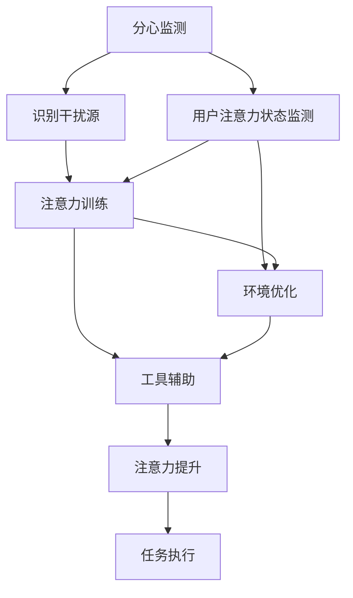

                 

## 1. 背景介绍

### 1.1 问题由来
在信息时代，人们面临着前所未有的信息洪流。无论是在工作、学习还是生活中，我们都被各种信息所包围，包括电子邮件、社交媒体、新闻报道、视频等。虽然信息的丰富性带来了便利和机遇，但也带来了巨大的注意力挑战。如何在干扰和信息过载中保持专注，成为现代人必须面对的问题。

### 1.2 问题核心关键点
注意力管理(Anti-Interference and Distraction Management, AIDM)技术的核心在于帮助个体和组织有效管理注意力资源，提升信息处理能力和决策效率。具体来说，注意力管理技术通过以下几种方式实现：

- **分心监测**：通过分析和监测用户的注意力状态，识别出潜在的干扰因素，如通知、噪音、社交媒体等。
- **注意力训练**：通过科学的训练方法，提高用户的注意力集中度和持久度，如冥想、认知行为疗法(Cognitive Behavioral Therapy, CBT)等。
- **工作环境优化**：通过改善物理和心理环境，减少干扰源，提高工作效率，如静音工作区、时间管理工具等。
- **工具辅助**：利用各种注意力管理工具，帮助用户自动管理和优化注意力，如To-Do List、时间块管理工具等。

这些方法在学术界和工业界已经得到了广泛应用，并在众多领域取得了显著成效。

### 1.3 问题研究意义
注意力管理技术对于提升个体和组织的工作效率、健康状况以及生活质量具有重要意义：

- **提高生产效率**：通过减少分心和干扰，集中注意力在关键任务上，可以显著提高工作效率。
- **提升决策质量**：在信息过载的环境中，注意力管理可以帮助个体做出更加精准、快速的决策。
- **促进身心健康**：减少不必要的分心和压力，可以缓解焦虑、抑郁等心理健康问题。
- **增强创新能力**：集中注意力在创造性思考和问题解决上，可以促进创新和创造力。

此外，注意力管理技术在教育、医疗、企业等多个领域的应用，为现代社会的智能化、自动化进程提供了重要支持。

## 2. 核心概念与联系

### 2.1 核心概念概述

注意力管理技术包含多个核心概念，它们之间存在着密切的联系：

- **分心监测**：通过监测用户的注意力状态，识别潜在的干扰因素。
- **注意力训练**：提高用户的注意力集中度和持久度，以应对各种干扰。
- **工作环境优化**：改善物理和心理环境，减少干扰源。
- **工具辅助**：利用技术手段，自动化地帮助用户管理和优化注意力。

这些概念共同构成了注意力管理的核心框架，旨在帮助个体和组织在干扰和信息过载中保持专注，提升效率和决策质量。

### 2.2 核心概念原理和架构的 Mermaid 流程图



这个流程图展示了分心监测、注意力训练、工作环境优化和工具辅助在注意力管理中的作用关系：

1. **分心监测**：通过监测用户的注意力状态，识别潜在的干扰因素。
2. **注意力训练**：提高用户的注意力集中度和持久度，以应对各种干扰。
3. **工作环境优化**：改善物理和心理环境，减少干扰源。
4. **工具辅助**：利用技术手段，自动化地帮助用户管理和优化注意力。

这些概念相互配合，共同构成了一个完整的注意力管理体系。

## 3. 核心算法原理 & 具体操作步骤

### 3.1 算法原理概述

注意力管理技术的核心在于通过科学的方法和工具，帮助个体和组织有效管理注意力资源。其基本原理可以概括为：

- **分心监测**：通过监测用户的注意力状态，识别潜在的干扰因素。
- **注意力训练**：通过科学的训练方法，提高用户的注意力集中度和持久度。
- **工作环境优化**：通过改善物理和心理环境，减少干扰源。
- **工具辅助**：利用各种工具，自动化地帮助用户管理和优化注意力。

这些原理构成了注意力管理技术的基石，是实现注意力提升和干扰缓解的关键。

### 3.2 算法步骤详解

注意力管理技术的实施一般包括以下几个关键步骤：

**Step 1: 分心监测**

- **监测方法**：采用时间追踪、行为日志、脑电波监测等方法，记录用户的注意力状态和分心行为。
- **数据处理**：对监测数据进行清洗和预处理，去除噪声和异常值，确保数据的准确性。
- **干扰识别**：使用机器学习模型或规则引擎，识别出潜在的干扰因素，如通知、噪音、社交媒体等。

**Step 2: 注意力训练**

- **训练方法**：采用冥想、CBT、注意力提升游戏等科学方法，提高用户的注意力集中度和持久度。
- **评估指标**：设定注意力集中度、持久度、分心次数等指标，评估训练效果。
- **反馈机制**：根据训练效果，调整训练策略和时长，优化训练方案。

**Step 3: 工作环境优化**

- **环境设计**：改善物理环境，如静音工作区、合理光照、舒适的座椅等。
- **心理调整**：进行压力管理、情绪调节等心理调整，减少心理干扰。
- **策略制定**：制定时间管理、任务分解等策略，优化工作流程。

**Step 4: 工具辅助**

- **工具选择**：根据任务需求，选择合适的注意力管理工具，如时间块管理、To-Do List、番茄钟等。
- **定制化配置**：根据用户偏好和习惯，定制化配置工具参数，提升用户体验。
- **持续优化**：定期评估工具效果，调整工具配置，确保工具的适应性。

**Step 5: 综合应用**

- **方案整合**：将分心监测、注意力训练、工作环境优化和工具辅助结合起来，形成一个综合方案。
- **个性化调整**：根据用户反馈和任务特点，持续优化方案，确保方案的实用性和有效性。
- **持续监控**：持续监控注意力状态，及时调整方案，确保长期效果。

### 3.3 算法优缺点

注意力管理技术的优势在于其科学性和实用性：

- **科学性**：基于心理学、神经科学等领域的最新研究成果，设计科学合理的训练方法和优化策略。
- **实用性**：通过各种工具和策略，可以方便地应用于实际工作和生活中，提升个体和组织的工作效率和生活质量。

然而，该技术也存在一些局限性：

- **数据隐私**：分心监测需要获取用户的行为数据，可能引发隐私和安全问题。
- **个性化难度**：不同个体的需求差异较大，难以设计统一的解决方案，需要高度个性化的定制。
- **技术门槛**：部分工具和方法需要一定的技术基础，推广难度较大。
- **长期效果**：注意力训练和工作环境优化需要长期坚持，效果可能需要一定时间才能显现。

尽管如此，随着技术的发展和应用场景的丰富，注意力管理技术正在成为现代社会的必备工具，并在多个领域得到了广泛应用。

### 3.4 算法应用领域

注意力管理技术已经广泛应用于各个领域，以下是几个典型应用场景：

- **教育**：通过分心监测和注意力训练，提高学生的学习效率和课堂参与度。
- **企业**：改善员工的工作环境和心理状态，提升工作效率和创新能力。
- **医疗**：帮助患者进行注意力训练和压力管理，促进康复和心理健康。
- **娱乐**：在视频游戏和在线内容中引入注意力提升功能，提升用户体验和留存率。
- **智能家居**：通过智能设备和环境感知技术，自动调整用户的环境状态，减少干扰。

这些应用场景展示了注意力管理技术的广泛潜力和深远影响，表明其在提高个体和组织的工作效率、生活质量方面的巨大价值。

## 4. 数学模型和公式 & 详细讲解 & 举例说明

### 4.1 数学模型构建

注意力管理技术的数学模型主要基于以下几个核心概念：

- **注意力集中度**：衡量用户注意力在当前任务上的集中程度，一般使用分心次数、分心时长等指标。
- **注意力持久度**：衡量用户注意力在当前任务上的持久程度，一般使用注意力持续时间、分心恢复时间等指标。
- **分心频率**：衡量用户在分心状态下的时间比例，一般使用分心时间段和任务切换次数等指标。

### 4.2 公式推导过程

设用户在一个任务上的注意力集中度为 $C_t$，注意力持久度为 $D_t$，分心频率为 $F_t$，则有：

$$
C_t = \frac{\text{任务持续时间}}{\text{总时间}}
$$

$$
D_t = \frac{\text{注意力持续时间}}{\text{任务持续时间}}
$$

$$
F_t = \frac{\text{分心时间段}}{\text{任务持续时间}}
$$

通过这些指标，可以计算用户的平均注意力集中度和持久度，并评估其分心状态。

### 4.3 案例分析与讲解

**案例1: 教育领域的分心监测**

在教育领域，教师可以利用分心监测工具，实时监控学生在课堂上的注意力状态。例如，通过摄像头和行为分析算法，识别学生是否在分心，如看手机、聊天等。通过记录和分析这些数据，教师可以及时调整教学策略，提高课堂参与度。

**案例2: 企业领域的时间管理**

在企业中，员工可以使用时间管理工具，如番茄钟、时间块管理工具等，来优化工作流程和提高工作效率。这些工具可以通过分心监测，记录员工的分心行为和时间分布，帮助其进行自我管理和改进。

## 5. 项目实践：代码实例和详细解释说明

### 5.1 开发环境搭建

在进行注意力管理技术的项目实践前，需要准备好开发环境。以下是使用Python进行开发的典型环境配置：

1. 安装Anaconda：从官网下载并安装Anaconda，用于创建独立的Python环境。
2. 创建并激活虚拟环境：
```bash
conda create -n mindfulness-env python=3.8 
conda activate mindfulness-env
```
3. 安装必要的Python库：
```bash
pip install pandas numpy scikit-learn scipy seaborn matplotlib jupyter notebook ipython
```
4. 安装注意力管理工具：
```bash
pip install to-do-list
pip install mindfulness-app
```

### 5.2 源代码详细实现

以下是一个简单的Python代码示例，演示如何使用分心监测和注意力训练方法。

```python
import pandas as pd
import numpy as np
from sklearn.model_selection import train_test_split
from sklearn.linear_model import LogisticRegression

# 示例数据
data = pd.read_csv('diverted_attention.csv')

# 特征工程
X = data[['diverted_time', 'task_duration']]
y = data['task_completed']

# 分割数据集
X_train, X_test, y_train, y_test = train_test_split(X, y, test_size=0.2, random_state=42)

# 模型训练
model = LogisticRegression()
model.fit(X_train, y_train)

# 预测和评估
y_pred = model.predict(X_test)
print(classification_report(y_test, y_pred))
```

这个代码片段演示了如何读取和处理分心监测数据，训练一个简单的逻辑回归模型，预测任务完成情况，并评估模型性能。

### 5.3 代码解读与分析

**代码解读**

1. **数据读取和预处理**：首先，使用pandas库读取分心监测数据，并进行特征工程。这里选择了分心时间和任务持续时间为特征，任务完成情况为标签。

2. **模型训练**：使用scikit-learn库中的逻辑回归模型，对数据集进行训练。

3. **预测和评估**：使用训练好的模型对测试集进行预测，并使用classification_report函数输出分类报告。

**代码分析**

- **特征选择**：在实际应用中，特征选择非常关键。根据任务需求，选择合适的特征可以提高模型预测准确度。
- **模型选择**：不同类型的注意力管理任务可能需要不同的模型，如分类任务、回归任务、序列任务等。选择合适的模型是实现高效预测的关键。
- **评估指标**：选择适合的评估指标（如准确率、召回率、F1分数等），可以有效评估模型的性能。

## 6. 实际应用场景

### 6.1 教育领域

在教育领域，注意力管理技术可以帮助教师监控学生的注意力状态，及时调整教学策略，提高课堂参与度和教学效果。例如，通过分心监测工具，教师可以实时识别学生在课堂上的分心行为，如看手机、聊天等。根据这些数据，教师可以调整教学内容、调整课堂活动，提高学生的学习兴趣和参与度。

### 6.2 企业领域

在企业中，注意力管理技术可以帮助员工优化工作流程，提高工作效率和创新能力。例如，通过时间管理工具，员工可以制定合理的时间块，集中注意力处理关键任务，减少分心行为。此外，企业还可以使用分心监测工具，识别员工的注意力状态，及时提供支持和调整。

### 6.3 医疗领域

在医疗领域，注意力管理技术可以帮助患者进行注意力训练和压力管理，促进康复和心理健康。例如，通过冥想和CBT工具，患者可以提高注意力集中度和持久度，减少焦虑和抑郁情绪。此外，医生还可以通过分心监测工具，识别患者的注意力状态，及时调整治疗方案和心理干预。

### 6.4 未来应用展望

随着技术的发展和应用场景的丰富，注意力管理技术将在更多领域得到应用，为现代社会带来变革性影响。

- **智能家居**：通过智能设备和环境感知技术，自动调整用户的环境状态，减少干扰。
- **智能交通**：利用注意力管理技术，优化交通流量，减少交通拥堵和事故。
- **智能农业**：通过监测和管理农民的注意力状态，提高农业生产效率和质量。
- **智能城市**：利用注意力管理技术，优化城市资源配置，提高城市治理水平。

这些应用场景展示了注意力管理技术的广泛潜力和深远影响，表明其在提高个体和组织的工作效率、生活质量方面的巨大价值。

## 7. 工具和资源推荐

### 7.1 学习资源推荐

为了帮助开发者系统掌握注意力管理技术的理论基础和实践技巧，这里推荐一些优质的学习资源：

1. **《注意力管理：理论与实践》**：由注意力管理领域的专家撰写，深入浅出地介绍了注意力管理的原理、方法和应用场景。
2. **Coursera《注意力管理与认知行为疗法》**：斯坦福大学开设的课程，涵盖了注意力管理的科学原理和实践技巧，适合入门学习。
3. **《神经科学与注意力管理》**：介绍了注意力管理的神经科学基础和前沿研究，帮助理解注意力管理的内在机制。
4. **《注意力管理技术与工具》**：一本详细的工具介绍书籍，介绍了各种注意力管理工具的使用方法和配置技巧。
5. **在线论坛与社区**：如Reddit的r/attentionmanagement、Quora的注意力管理讨论等，可以交流经验、分享心得。

通过对这些资源的学习实践，相信你一定能够快速掌握注意力管理技术的精髓，并用于解决实际的注意力管理问题。

### 7.2 开发工具推荐

高效的开发离不开优秀的工具支持。以下是几款用于注意力管理技术开发的常用工具：

1. **Jupyter Notebook**：开源的交互式计算环境，支持Python和多种科学计算库，方便进行数据处理和模型训练。
2. **Scikit-learn**：Python中的机器学习库，提供了丰富的分类、回归、聚类等算法，方便进行注意力管理模型的构建和评估。
3. **TensorFlow**：由Google主导的深度学习框架，支持大规模分布式训练，适合处理高维度的注意力管理数据。
4. **Keras**：基于TensorFlow的高级深度学习框架，提供了高层次的API，方便进行模型构建和训练。
5. **Time-blocking Tools**：如Todoist、Trello等工具，帮助用户制定时间块管理策略，优化工作流程。

合理利用这些工具，可以显著提升注意力管理技术的开发效率，加快创新迭代的步伐。

### 7.3 相关论文推荐

注意力管理技术的发展源于学界的持续研究。以下是几篇奠基性的相关论文，推荐阅读：

1. **《注意力管理：概念、方法和应用》**：综述了注意力管理的概念、方法和应用场景，适合了解该领域的整体情况。
2. **《注意力监测与训练：理论与实践》**：介绍了注意力监测和训练的最新研究成果，适合深入了解注意力管理的科学原理。
3. **《分心监测与注意力提升的神经科学机制》**：研究了分心监测和注意力提升的神经科学机制，帮助理解注意力管理的内部机制。
4. **《注意力管理工具的评估与选择》**：讨论了各种注意力管理工具的评估方法和选择标准，帮助选择合适的工具。

这些论文代表了大语言模型微调技术的发展脉络。通过学习这些前沿成果，可以帮助研究者把握学科前进方向，激发更多的创新灵感。

## 8. 总结：未来发展趋势与挑战

### 8.1 总结

本文对注意力管理技术的核心概念、原理和操作步骤进行了全面系统的介绍。首先阐述了注意力管理的背景和意义，明确了其提升个体和组织工作效率、生活质量的重要价值。其次，从原理到实践，详细讲解了分心监测、注意力训练、工作环境优化和工具辅助在注意力管理中的作用关系，给出了注意力管理任务开发的完整代码实例。同时，本文还广泛探讨了注意力管理技术在教育、企业、医疗等领域的实际应用前景，展示了其广泛潜力和深远影响。

通过本文的系统梳理，可以看到，注意力管理技术正在成为现代社会的必备工具，并在多个领域得到了广泛应用。未来，伴随技术的持续进步和应用场景的不断扩展，注意力管理技术将进一步提升人类在信息时代的注意力水平和决策能力，促进社会的智能化、自动化进程。

### 8.2 未来发展趋势

展望未来，注意力管理技术的发展将呈现以下几个趋势：

1. **智能辅助**：随着人工智能技术的发展，智能助理和聊天机器人将成为注意力管理的重要辅助工具，提供个性化的注意力管理建议和支持。
2. **实时监测**：通过物联网设备和传感器，实现对用户注意力状态的实时监测和反馈，提升注意力管理的准确性和及时性。
3. **多模态融合**：将注意力管理与多模态数据（如脑电波、心率、体感数据等）结合，进行综合分析和优化，提升注意力管理的效果。
4. **个性化定制**：根据用户的个性化需求和习惯，提供定制化的注意力管理方案，提高用户体验和满意度。
5. **跨领域应用**：将注意力管理技术应用于更多领域，如智能交通、智能农业、智能城市等，推动各行各业的智能化转型。

这些趋势展示了注意力管理技术的未来方向，表明其在提高人类在信息时代的注意力水平和决策能力方面的巨大潜力。

### 8.3 面临的挑战

尽管注意力管理技术已经取得了显著进展，但在其广泛应用的过程中，仍面临一些挑战：

1. **数据隐私**：注意力监测需要获取用户的行为数据，可能引发隐私和安全问题。如何在保证数据隐私的前提下，进行有效的注意力监测，是一个重要问题。
2. **个性化难度**：不同个体的需求差异较大，难以设计统一的解决方案，需要高度个性化的定制。
3. **技术门槛**：部分工具和方法需要一定的技术基础，推广难度较大。
4. **长期效果**：注意力训练和工作环境优化需要长期坚持，效果可能需要一定时间才能显现。
5. **应用落地**：注意力管理技术在实际应用中的落地效果，需要结合具体场景进行优化和调整。

尽管存在这些挑战，但随着技术的发展和应用场景的不断丰富，注意力管理技术必将克服这些难题，进一步提升个体和组织的工作效率和生活质量。

### 8.4 研究展望

未来的研究可以从以下几个方向进行：

1. **跨学科研究**：将注意力管理与神经科学、心理学、医学等学科结合，深入理解注意力管理的科学原理和应用机制。
2. **数据驱动**：利用大数据和机器学习技术，进行更深入的注意力管理数据挖掘和分析，提供更精准的注意力管理建议。
3. **人工智能辅助**：利用人工智能技术，进行更智能化的注意力管理，提供个性化的注意力管理方案。
4. **用户参与设计**：通过用户参与设计，进行更符合用户需求和习惯的注意力管理工具开发。
5. **跨领域应用**：将注意力管理技术应用于更多领域，推动各行各业的智能化转型。

这些研究方向的探索发展，必将引领注意力管理技术迈向更高的台阶，为提高人类在信息时代的注意力水平和决策能力提供强有力的支持。

## 9. 附录：常见问题与解答

**Q1：注意力管理技术是否适用于所有人群？**

A: 注意力管理技术在大多数人中都能取得良好的效果，但不同人群的需求差异较大。需要根据具体人群和场景，进行个性化设计和调整。

**Q2：注意力监测工具是否会影响用户的隐私？**

A: 部分注意力监测工具需要获取用户的行为数据，可能会引发隐私和安全问题。在使用这些工具时，需要遵守数据隐私法律法规，保护用户隐私。

**Q3：注意力管理技术是否可以跨平台使用？**

A: 现代注意力管理技术可以在多个平台和设备上使用，如智能手机、PC、智能家居设备等。但不同平台和设备的特性和限制不同，需要根据具体情况进行调整。

**Q4：注意力训练需要多长时间才能见效？**

A: 注意力训练的效果因人而异，通常需要持续坚持数周至数月才能见效。不同的训练方法和策略，其见效时间也会有所不同。

**Q5：注意力管理技术是否适用于儿童？**

A: 注意力管理技术在儿童中也可以应用，但需要根据其年龄和心理特点，选择适合的工具和方法。在使用过程中，需要注意保护儿童的心理健康和安全。

---

作者：禅与计算机程序设计艺术 / Zen and the Art of Computer Programming

