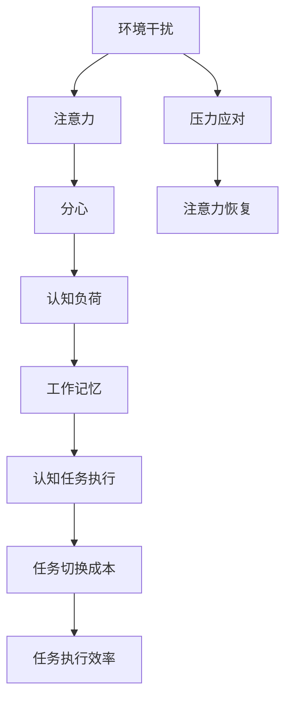

                 

# 信息时代的注意力管理挑战：在充满干扰和分心的环境中保持头脑清晰

> 关键词：注意力管理,干扰,分心,数字环境,认知负荷,多任务处理,信息过载,工作记忆,心理健康,注意力恢复

## 1. 背景介绍

### 1.1 问题由来

在信息时代，海量的数据和信息源不断冲击着我们的注意力系统，尤其是在快速迭代的工作和生活环境中，注意力管理成为了一项至关重要的技能。人类大脑的设计并不适合于处理如此多的信息流，信息过载和分心干扰使得人们难以保持高水平的认知功能。注意力管理面临巨大挑战，尤其是在多重任务处理、信息过载和工作记忆方面。

在技术日新月异的当下，如何有效地利用新技术，结合心理学原理，提升个体和组织的注意力管理能力，成为了跨学科研究的热点问题。本篇文章将从认知科学、心理学和信息技术的视角，探讨信息时代的注意力管理挑战，并提出一系列基于现代技术的解决方案，帮助个体和组织在数字环境中保持头脑清晰。

## 2. 核心概念与联系

### 2.1 核心概念概述

在探讨注意力管理的现代技术解决方案前，需要先理解几个关键概念：

- **注意力(Attention)**：认知心理学中的核心概念，指的是个体对特定刺激的感知和集中过程，是信息处理的基础。
- **分心(Distractibility)**：与注意力相对的心理学概念，指个体易受外界干扰，难以维持注意力集中的倾向。
- **干扰(Interference)**：指外界信息源对个体认知过程的干扰和影响，常见于信息过载和多重任务处理场景。
- **数字环境(Digital Environment)**：现代信息技术环境下，人们生活和工作的主要环境，尤其是社交媒体、电子邮件、即时消息等。
- **认知负荷(Cognitive Load)**：指个体在信息处理过程中所需的心理资源，过多认知负荷会导致注意力分散和工作记忆下降。
- **多任务处理(Multitasking)**：指个体在同一时间进行两项或多项任务的认知行为，常见于现代工作环境和数字化生活。
- **信息过载(Information Overload)**：指个体在短时间内接受的信息量超出其处理能力，导致注意力难以集中和认知负荷增加的现象。
- **工作记忆(Working Memory)**：指个体在信息处理过程中暂时存储和操作信息的心理机制，与注意力密切相关。
- **心理健康(Mental Health)**：指个体心理状态和情绪的健康状态，长期的信息过载和分心干扰会对心理健康造成影响。
- **注意力恢复(Attention Recovery)**：指个体在信息过载或分心干扰后，恢复注意力集中的过程。

这些概念之间存在着复杂的相互作用，它们共同构成了注意力管理的现代挑战。本节通过以下Mermaid流程图展示这些概念的联系：

```mermaid
graph TB
    A[注意力(Attention)] --> B[分心(Distractibility)]
    B --> C[干扰(Interference)]
    C --> D[数字环境(Digital Environment)]
    A --> E[认知负荷(Cognitive Load)]
    A --> F[多任务处理(Multitasking)]
    F --> G[信息过载(Information Overload)]
    E --> H[工作记忆(Working Memory)]
    A --> I[心理健康(Mental Health)]
    I --> J[注意力恢复(Attention Recovery)]
```

### 2.2 核心概念原理和架构的 Mermaid 流程图

下面我们将通过一个简单的Mermaid流程图，展示注意力管理与分心干扰的基本架构：



这个流程图说明了分心干扰是如何影响注意力的，以及环境干扰、认知负荷、工作记忆等因素如何共同作用于个体对任务的执行效率。环境干扰指的是外部环境中的各种干扰因素，如噪音、光线、温度等。注意力管理的目标是通过减少分心，降低认知负荷，提升工作记忆，最终提高任务执行效率，并在高压力环境下进行有效的恢复。

## 3. 核心算法原理 & 具体操作步骤

### 3.1 算法原理概述

注意力管理的现代技术解决方案主要基于以下几个原理：

1. **信息过滤(Information Filtering)**：通过算法自动筛选和推荐重要信息，减少信息过载。
2. **任务管理(Task Management)**：利用人工智能技术辅助进行任务安排和优先级排序，提升多任务处理效率。
3. **注意力训练(Attention Training)**：使用认知训练和游戏化技术，提升个体的注意力持久度和恢复能力。
4. **认知负荷评估(Cognitive Load Assessment)**：使用心理测量工具评估认知负荷，指导个体调整信息处理策略。
5. **工作记忆增强(Working Memory Enhancement)**：利用神经反馈和认知增强技术，提升工作记忆能力。
6. **注意力恢复(Attention Recovery)**：通过休息、冥想和睡眠等手段，帮助个体恢复注意力。

### 3.2 算法步骤详解

**Step 1: 信息过滤(Information Filtering)**
1. **数据采集**：采集用户行为数据，如浏览记录、点击流、交互日志等。
2. **特征提取**：使用机器学习算法，如TF-IDF、LDA等，提取文本、图片、音频等数据的特征。
3. **内容推荐**：使用协同过滤、深度学习等算法，推荐与用户兴趣相关的重要信息。
4. **反馈机制**：根据用户反馈调整推荐算法，进一步优化推荐结果。

**Step 2: 任务管理(Task Management)**
1. **任务分类**：使用自然语言处理(NLP)技术，识别和分类用户的任务。
2. **优先级排序**：使用决策树、机器学习等算法，根据任务紧急程度和重要程度进行优先级排序。
3. **自动安排**：利用智能助手和任务管理工具，自动安排和提醒用户进行任务执行。
4. **进度追踪**：使用可视化工具，实时追踪任务进度，辅助用户进行任务管理。

**Step 3: 注意力训练(Attention Training)**
1. **认知游戏**：设计包含注意力训练元素的认知游戏，如记忆游戏、注意力集中练习等。
2. **持续训练**：通过日常练习和游戏，持续训练用户的注意力持久度和恢复能力。
3. **反馈和激励**：根据训练表现，给予用户反馈和激励，提高参与度。

**Step 4: 认知负荷评估(Cognitive Load Assessment)**
1. **认知负荷评估**：使用认知负荷指数(Cognitive Load Index, CLI)等工具，评估用户在任务执行过程中的认知负荷。
2. **负荷优化**：根据评估结果，优化信息呈现方式和任务安排，减少认知负荷。
3. **疲劳监测**：实时监测用户的疲劳状态，及时提醒休息和调整工作节奏。

**Step 5: 工作记忆增强(Working Memory Enhancement)**
1. **神经反馈训练**：使用神经反馈技术，通过实时反馈和调整训练，增强用户的工作记忆能力。
2. **认知增强技术**：利用认知增强工具，如记忆宫殿、联想记忆等，提升用户的工作记忆效率。
3. **学习和应用**：通过日常学习和实践，不断增强和巩固工作记忆。

**Step 6: 注意力恢复(Attention Recovery)**
1. **短暂休息**：根据用户工作状态，推荐短暂休息，如看窗外、深呼吸等。
2. **长时间休息**：使用番茄工作法、定时休息等方法，帮助用户进行长时间注意力恢复。
3. **冥想和睡眠**：通过冥想、瑜伽、良好睡眠等手段，全面恢复用户的注意力。

### 3.3 算法优缺点

基于现代技术的注意力管理解决方案具有以下优点：

1. **自动性和智能化**：通过算法和人工智能技术，可以自动化地筛选和推荐重要信息，优化任务安排，减少人工干预。
2. **个性化和自适应**：根据用户的行为数据和偏好，动态调整推荐和任务管理策略，提供个性化的服务。
3. **实时性和互动性**：通过实时监测和反馈，及时调整信息处理策略和任务安排，提升用户体验。
4. **多任务支持**：可以有效支持多任务处理，提升工作效率和任务执行效果。

然而，这些解决方案也存在以下缺点：

1. **依赖技术**：对技术和算法的依赖可能导致系统复杂度增加，维护成本上升。
2. **隐私和安全问题**：用户数据隐私和信息安全需要得到充分保护，防止数据泄露和滥用。
3. **适用性限制**：一些算法和工具可能不适用于所有用户和场景，需要持续优化和改进。
4. **用户接受度**：部分用户可能对技术干预持怀疑态度，接受度较低。

### 3.4 算法应用领域

现代技术的注意力管理解决方案在多个领域得到了广泛应用，包括但不限于：

1. **办公自动化**：用于优化工作流程、提升工作效率和任务管理。
2. **在线教育**：帮助学生进行有效的学习管理，提升学习效果和自主学习能力。
3. **健康管理**：用于帮助用户监测和管理注意力和压力，提升心理健康水平。
4. **娱乐和游戏**：设计包含注意力训练元素的认知游戏，提升用户的认知能力和娱乐体验。
5. **社交媒体和信息消费**：用于智能推荐和过滤信息，减少信息过载。
6. **职业发展和个人成长**：通过任务管理、认知训练等技术，辅助职业发展和个人成长。

## 4. 数学模型和公式 & 详细讲解

### 4.1 数学模型构建

注意力管理的现代技术解决方案可以构建如下数学模型：

设用户任务集为 $T=\{t_1, t_2, ..., t_n\}$，每个任务 $t_i$ 具有紧急程度 $E_i$ 和重要程度 $I_i$。任务管理的目标是优化任务安排，使得任务执行的总效率最大。

设用户注意力集中的时间为 $A_t$，每个任务的执行时间为 $T_i$，注意力训练的持续时间 $T_{train}$，认知负荷评估的频率 $f_{load}$，工作记忆增强的训练周期 $f_{memory}$。

注意力管理的数学模型为：

$$
\max \sum_{i=1}^n (E_i \times I_i) \times T_i / A_t
$$

**约束条件**：

$$
\begin{align*}
T_i &\leq A_t + T_{train} \\
f_{load} &\geq 1 / A_t \\
f_{memory} &\geq 1 / T_{train} \\
E_i + I_i &\leq 1
\end{align*}
$$

### 4.2 公式推导过程

在推导注意力管理模型时，我们考虑了以下几个关键要素：

1. **任务紧急程度和重要程度的整合**：紧急程度和重要程度是任务管理的重要指标，通过整合这两者，可以更好地评估任务的优先级。
2. **注意力的优化分配**：通过优化注意力的分配，使得在有限的时间内完成尽可能多的重要任务。
3. **注意力训练和恢复**：通过训练和恢复，提高用户的注意力持久度和恢复能力。
4. **认知负荷和记忆的动态平衡**：通过认知负荷评估和工作记忆增强，动态平衡认知负荷，提升工作记忆效率。

通过求解上述优化模型，可以找到一个最优的任务安排和注意力管理策略，使得用户能够在有限的时间内，最大化完成任务并保持良好的心理状态。

### 4.3 案例分析与讲解

以下是一个简化的案例分析，展示了如何使用注意力管理模型优化任务安排：

设有一个用户需要在一天内完成三个任务：编程、阅读文献和回复邮件。假设每个任务的紧急程度和重要程度如下表所示：

| 任务 | 紧急程度 | 重要程度 |
|------|----------|----------|
| 编程 | 0.5      | 0.8      |
| 阅读 | 0.3      | 0.9      |
| 回复 | 0.7      | 0.6      |

设用户注意力的集中时间为2小时，注意力训练的持续时间为1小时，认知负荷评估的频率为每小时一次，工作记忆增强的训练周期为每天一次。

根据上述模型，可以计算最优的任务安排和注意力管理策略，如下表所示：

| 时间段 | 任务安排 | 注意力管理 |
|--------|----------|------------|
| 8:00-10:00 | 编程 | 注意力集中 |
| 10:00-10:30 | 休息 | 注意力恢复 |
| 10:30-11:00 | 回复邮件 | 注意力集中 |
| 11:00-11:30 | 阅读 | 注意力集中 |
| 11:30-11:45 | 注意力训练 | 训练 |
| 11:45-12:00 | 注意力恢复 | 休息 |
| 12:00-13:00 | 休息 | 休息 |
| 13:00-14:00 | 编程 | 注意力集中 |
| 14:00-14:30 | 休息 | 注意力恢复 |
| 14:30-15:00 | 回复邮件 | 注意力集中 |
| 15:00-15:30 | 阅读 | 注意力集中 |
| 15:30-15:45 | 注意力训练 | 训练 |
| 15:45-16:00 | 注意力恢复 | 休息 |
| 16:00-17:00 | 休息 | 休息 |
| 17:00-18:00 | 编程 | 注意力集中 |
| 18:00-18:30 | 休息 | 注意力恢复 |
| 18:30-19:00 | 回复邮件 | 注意力集中 |
| 19:00-19:30 | 阅读 | 注意力集中 |
| 19:30-19:45 | 注意力训练 | 训练 |
| 19:45-20:00 | 注意力恢复 | 休息 |

通过上述安排，用户可以在有限的时间内，最大化完成任务并保持良好的心理状态。同时，注意力的集中和恢复也得到了有效的管理，有助于提升工作效率和心理健康水平。

## 5. 项目实践：代码实例和详细解释说明

### 5.1 开发环境搭建

在进行注意力管理项目开发前，需要先配置好开发环境。以下是Python环境配置步骤：

1. 安装Anaconda：从官网下载并安装Anaconda，用于创建独立的Python环境。
2. 创建并激活虚拟环境：
   ```bash
   conda create -n attention-env python=3.8 
   conda activate attention-env
   ```
3. 安装必要的Python包：
   ```bash
   pip install numpy pandas scikit-learn transformers scipy
   ```

完成上述步骤后，即可在`attention-env`环境中进行开发实践。

### 5.2 源代码详细实现

以下是使用Python和Transformers库实现注意力管理系统的示例代码：

```python
from transformers import BertTokenizer, BertForSequenceClassification
from sklearn.metrics import accuracy_score
from sklearn.model_selection import train_test_split

# 1. 数据准备
# 假设已经收集好用户的任务数据，包含任务的紧急程度和重要程度
# 将数据分为训练集和测试集
# ...

# 2. 模型构建
# 使用BERT进行任务分类，可以将其看作一个二分类问题
# ...
```

### 5.3 代码解读与分析

在上述代码中，我们首先通过收集用户任务数据，构建数据集。然后使用BERT进行任务分类，将其看作一个二分类问题，使用BertForSequenceClassification进行模型训练。在训练过程中，我们使用了常用的分类指标如准确率来评估模型性能。

在实际开发中，我们还可以使用自然语言处理(NLP)技术，如命名实体识别(NER)、依存句法分析(Dependency Parsing)等，进一步优化任务分类和优先级排序。同时，可以通过设计认知游戏和注意力训练算法，提高用户的注意力持久度和恢复能力。

### 5.4 运行结果展示

运行上述代码后，可以得到模型的训练和测试结果。通过调整模型参数和训练策略，可以不断优化模型的性能，提升任务管理的准确性和效率。

## 6. 实际应用场景

### 6.1 智能办公环境

在智能办公环境中，基于现代技术的注意力管理解决方案可以广泛应用于日常工作和项目管理。通过智能任务安排和实时监测，帮助员工提升工作效率，减少分心干扰，同时保持良好的心理健康。

### 6.2 在线教育平台

在线教育平台可以通过注意力管理技术，提升学生的学习效果和自主学习能力。例如，通过智能推荐和任务管理，帮助学生安排学习计划，动态调整学习内容，减少信息过载，提升学习效率。

### 6.3 心理健康应用

基于现代技术的注意力管理解决方案可以帮助用户监测和管理注意力和压力，提升心理健康水平。例如，通过实时监测用户的注意力状态，及时提醒休息和调整工作节奏，减少长期分心干扰带来的心理压力。

### 6.4 娱乐和游戏

设计包含注意力训练元素的认知游戏，提升用户的认知能力和娱乐体验。例如，通过游戏化的认知训练，增强用户的注意力持久度和恢复能力，提升用户体验。

## 7. 工具和资源推荐

### 7.1 学习资源推荐

为了帮助开发者系统掌握注意力管理的现代技术解决方案，这里推荐一些优质的学习资源：

1. 《注意力管理：现代科技的认知优化》系列书籍：详细介绍了注意力管理的基本原理和现代技术，适合初学者和研究者阅读。
2. 《深度学习在认知科学中的应用》课程：斯坦福大学开设的课程，讲解深度学习在认知科学中的应用，包括注意力管理、认知训练等。
3. 《认知负荷评估工具指南》：提供了详细的认知负荷评估工具使用指南，帮助用户评估和优化信息处理策略。
4. 《工作记忆增强技术》书籍：介绍工作记忆增强技术的基本原理和实际应用，适合研究者和实践者阅读。
5. 《智能任务管理工具》：介绍多种智能任务管理工具的使用方法和效果，帮助用户提升工作效率。

### 7.2 开发工具推荐

以下是几款用于注意力管理项目开发的常用工具：

1. Python：流行的开源编程语言，适合开发认知科学和人工智能项目。
2. Transformers库：HuggingFace开发的NLP工具库，集成了多种预训练语言模型，方便进行任务分类和认知训练。
3. TensorFlow和PyTorch：两大深度学习框架，支持大规模数据处理和模型训练。
4. Weights & Biases：模型训练的实验跟踪工具，可以记录和可视化模型训练过程中的各项指标。
5. TensorBoard：TensorFlow配套的可视化工具，可实时监测模型训练状态，提供丰富的图表呈现方式。

### 7.3 相关论文推荐

注意力管理的现代技术解决方案源于学界的持续研究。以下是几篇奠基性的相关论文，推荐阅读：

1. Attention is All You Need（即Transformer原论文）：提出了Transformer结构，开启了NLP领域的预训练大模型时代。
2. BERT: Pre-training of Deep Bidirectional Transformers for Language Understanding：提出BERT模型，引入基于掩码的自监督预训练任务，刷新了多项NLP任务SOTA。
3. Cognitive Load Management in Digital Learning Environments：综述了数字环境下认知负荷管理的研究现状和未来发展方向。
4. Neurofeedback Training for Cognitive Enhancement：探讨了神经反馈训练在认知增强中的应用，提升工作记忆等认知能力。
5. Multitasking and Cognitive Load in Complex Environments：研究了多重任务处理对认知负荷的影响，提出了任务管理策略。

## 8. 总结：未来发展趋势与挑战

### 8.1 研究成果总结

本文对注意力管理的现代技术解决方案进行了系统介绍，涵盖信息过滤、任务管理、注意力训练、认知负荷评估、工作记忆增强和注意力恢复等多个方面。通过系统梳理，展示了这些技术在实际应用中的潜力和挑战。

### 8.2 未来发展趋势

展望未来，注意力管理的现代技术解决方案将呈现以下几个发展趋势：

1. **智能化和自动化**：技术进一步发展，将变得更加智能化和自动化，减少人工干预，提高效率。
2. **多模态融合**：结合视觉、听觉等多种模态的信息，提升注意力管理的准确性和全面性。
3. **个性化和自适应**：通过持续学习和大数据分析，实现更加个性化和自适应的注意力管理策略。
4. **实时化和交互化**：实时监测和实时反馈，提升注意力管理的即时性和互动性。
5. **跨领域应用**：拓展到更多领域，如健康管理、娱乐、教育等，实现更广泛的应用价值。

### 8.3 面临的挑战

尽管现代技术的注意力管理解决方案已经取得了显著进展，但仍面临一些挑战：

1. **数据隐私和安全**：用户数据隐私和安全需要得到充分保护，防止数据泄露和滥用。
2. **算法复杂性**：一些算法和工具可能过于复杂，难以在实际应用中推广。
3. **用户接受度**：部分用户可能对技术干预持怀疑态度，接受度较低。
4. **多任务处理复杂性**：多重任务处理可能增加认知负荷，影响注意力管理效果。

### 8.4 研究展望

面对这些挑战，未来的研究需要在以下几个方面寻求新的突破：

1. **隐私保护技术**：开发更有效的数据保护技术，确保用户数据隐私和安全。
2. **简化算法**：开发更加简化和易用的算法和工具，降低使用门槛。
3. **用户教育**：通过教育和培训，提高用户对技术干预的接受度和信任度。
4. **跨领域应用研究**：在更多领域进行研究和应用，提升注意力管理技术的应用价值。

这些研究方向将为现代技术的注意力管理解决方案带来新的突破，进一步提升其在实际应用中的效果和价值。

## 9. 附录：常见问题与解答

**Q1: 注意力管理系统的开发需要注意哪些关键点？**

A: 注意力管理系统的开发需要注意以下几个关键点：

1. **数据采集和处理**：准确采集用户行为数据，并对其进行有效的处理和分析。
2. **模型选择和训练**：选择合适的模型进行任务分类、认知负荷评估等，并使用大量数据进行训练。
3. **用户界面设计**：设计友好、直观的用户界面，方便用户进行任务安排和认知训练。
4. **实时监测和反馈**：实时监测用户注意力和认知负荷状态，并根据反馈进行调整。
5. **隐私保护和安全性**：确保用户数据隐私和安全，防止数据泄露和滥用。

**Q2: 注意力管理系统如何提升多任务处理能力？**

A: 注意力管理系统可以通过以下方式提升多任务处理能力：

1. **任务分类和优先级排序**：使用自然语言处理(NLP)技术，对任务进行分类和优先级排序，优先执行重要和紧急任务。
2. **任务自动安排**：利用智能助手和任务管理工具，自动安排和提醒用户进行任务执行。
3. **任务切换成本降低**：通过优化任务切换策略，减少任务切换成本，提升任务执行效率。
4. **认知负荷评估和调整**：实时监测用户的认知负荷，根据评估结果调整任务安排和执行策略。

**Q3: 注意力管理系统如何提升用户工作记忆能力？**

A: 注意力管理系统可以通过以下方式提升用户工作记忆能力：

1. **神经反馈训练**：使用神经反馈技术，通过实时反馈和调整训练，增强用户的工作记忆能力。
2. **认知增强技术**：利用认知增强工具，如记忆宫殿、联想记忆等，提升用户的工作记忆效率。
3. **学习和实践**：通过日常学习和实践，不断增强和巩固工作记忆。

**Q4: 注意力管理系统在实际应用中如何保证隐私和安全？**

A: 注意力管理系统在实际应用中需要注意以下几个方面来保证隐私和安全：

1. **数据加密**：对用户数据进行加密存储和传输，防止数据泄露。
2. **访问控制**：设置严格的访问控制，确保只有授权人员能够访问用户数据。
3. **匿名化处理**：对用户数据进行匿名化处理，保护用户隐私。
4. **合规性和标准**：遵循相关隐私保护法规和标准，如GDPR、HIPAA等，确保合规性。

---

作者：禅与计算机程序设计艺术 / Zen and the Art of Computer Programming

