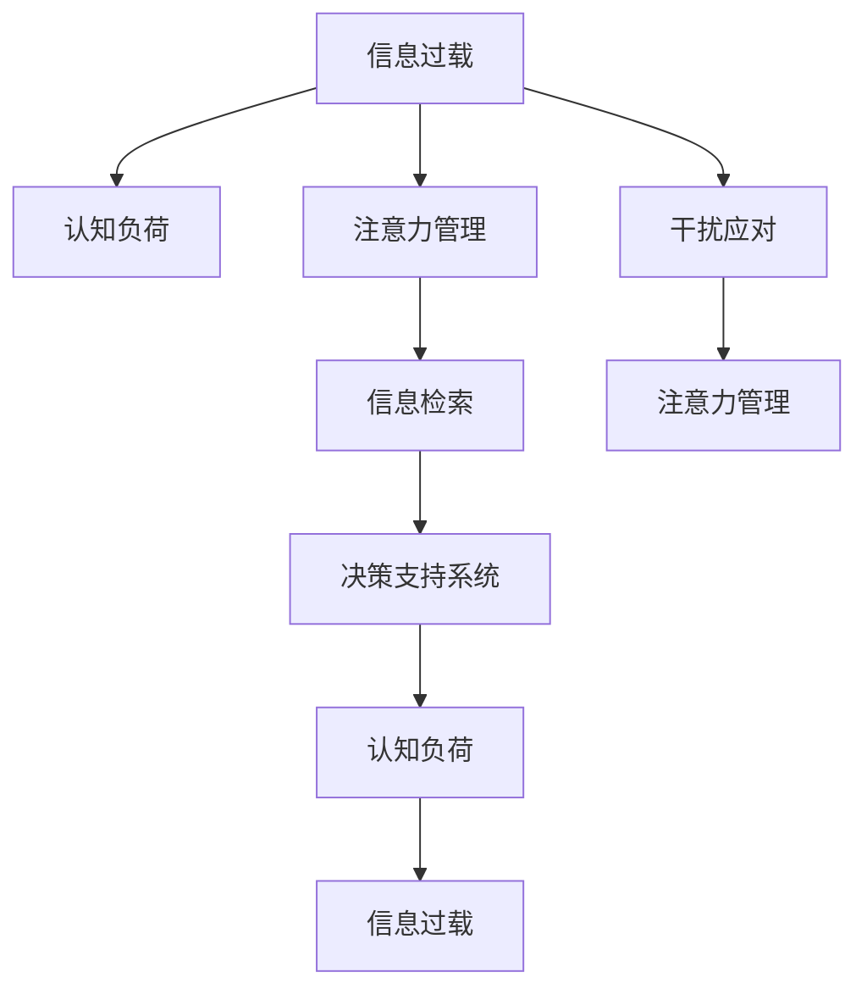

                 

# 信息时代的注意力管理策略与实践：在干扰和信息过载 中保持专注

> 关键词：信息过载, 注意力管理, 干扰应对, 信息检索, 决策支持系统, 认知负荷

## 1. 背景介绍

### 1.1 问题由来
在信息时代，随着互联网、移动互联网、物联网的迅猛发展，数据量呈现爆炸性增长，信息过载已成为当前社会的普遍现象。个人和组织面临的信息量远超以往任何时代，人们每天需处理的信息量以亿计。如何在海量信息中保持专注，筛选出真正有价值的信息，并有效地加以利用，已成为当今社会的一大难题。

与此同时，各种干扰源也对注意力管理提出了更高的要求。无论是来自屏幕上的弹窗广告、社交媒体的通知、还是生活中的各种突发事件，都可能分散我们的注意力，影响我们的工作效率和生活质量。如何在干扰中保持专注，成为信息时代人们不得不面对的重要挑战。

### 1.2 问题核心关键点
信息过载和干扰应对，本质上是注意力管理的两个重要方面。有效的注意力管理策略，不仅需要帮助个体在信息海中高效筛选有价值的信息，还需要帮助人们克服各种干扰，保持专注。

一个有效的注意力管理系统应具备以下特点：
1. **自适应性**：能够根据用户的环境和行为习惯自动调整策略。
2. **可操作性**：易于用户理解和操作，具有高度的灵活性和可定制性。
3. **效率性**：在提升用户注意力的同时，尽量减少用户的认知负荷。
4. **跨平台性**：支持多种设备和应用场景，适应用户的多样化需求。

## 2. 核心概念与联系

### 2.1 核心概念概述

为更好地理解信息时代注意力管理的相关概念，本节将介绍几个密切相关的核心概念：

- **信息过载(Information Overload)**：指信息接收者面临的信息量超过其处理能力，导致决策和信息处理效率下降的现象。
- **认知负荷(Cognitive Load)**：指在进行信息处理时，人脑需要承担的心理负担。认知负荷过重会导致信息处理效率降低、注意力分散等问题。
- **注意力管理(Attention Management)**：指通过策略和技术手段，提升用户的注意力集中度和信息处理效率，以应对信息过载和干扰的挑战。
- **信息检索(Information Retrieval)**：指通过算法和系统，帮助用户从海量信息中快速、准确地检索出所需信息。
- **决策支持系统(Decision Support System)**：指辅助用户进行决策的智能化系统，通过数据分析、模拟和优化，提供基于证据的决策建议。

这些概念之间的逻辑关系可以通过以下Mermaid流程图来展示：



这个流程图展示了这个逻辑链条：

1. 信息过载导致认知负荷增加。
2. 有效的注意力管理能帮助降低认知负荷。
3. 信息检索可以辅助用户在信息海洋中快速找到所需信息。
4. 决策支持系统基于信息检索的结果，提供辅助决策。
5. 干扰应对是注意力管理的必要补充。

这些概念共同构成了信息时代注意力管理的基础框架，帮助我们理解如何在干扰和信息过载中保持专注。

## 3. 核心算法原理 & 具体操作步骤
### 3.1 算法原理概述

信息时代的注意力管理，本质上是一个多模态、分布式的决策支持系统。其核心思想是：通过数据驱动的方法，对用户的行为模式、环境特征、任务需求等进行分析，动态调整注意力管理的策略，帮助用户更高效地处理信息，同时对抗干扰。

算法的基本原理包括：
1. **数据分析与建模**：通过收集用户的历史行为数据和环境信息，构建用户画像和情境模型。
2. **认知负荷评估**：实时监测用户的认知负荷水平，通过生理指标、行为指标等进行评估。
3. **干扰应对策略**：根据环境干扰特征，采取相应的策略来减少干扰的影响。
4. **信息检索与过滤**：通过算法和系统，帮助用户从海量信息中筛选出最相关的信息。
5. **决策辅助**：基于信息检索的结果，提供基于证据的决策建议，辅助用户进行决策。

### 3.2 算法步骤详解

信息时代注意力管理的核心算法步骤包括：

**Step 1: 数据收集与预处理**
- 收集用户的历史行为数据、环境信息、任务特征等，建立多模态数据集。
- 对数据进行清洗、归一化、特征提取等预处理，构建用户画像和情境模型。

**Step 2: 认知负荷评估**
- 使用生理指标监测（如心率、脑电波等）、行为指标监测（如鼠标移动、键盘操作频率等）来实时评估用户的认知负荷水平。
- 根据评估结果，动态调整注意力管理的策略。

**Step 3: 干扰应对策略**
- 监测环境中的干扰因素（如噪音、通知、弹窗等），分析其对用户注意力的影响。
- 根据干扰类型和强度，采取相应的应对策略，如屏蔽通知、调整设备亮度等。

**Step 4: 信息检索与过滤**
- 利用自然语言处理、图像识别等技术，对信息进行语义分析、图像识别等预处理。
- 根据用户画像和情境模型，对信息进行过滤和排序，优先展示最相关的信息。

**Step 5: 决策辅助**
- 将过滤后的信息输入到决策支持系统，进行数据挖掘、模拟、优化等操作。
- 根据系统输出的证据，辅助用户进行决策。

### 3.3 算法优缺点

信息时代注意力管理算法具有以下优点：
1. **高效性**：通过数据驱动的方法，可以实时调整策略，最大化利用用户注意力。
2. **灵活性**：能够适应用户的多样化需求，提供个性化的注意力管理方案。
3. **普适性**：适用于多种设备和应用场景，具有高度的跨平台性。
4. **可扩展性**：可以不断引入新的数据源和模型，提升系统的综合能力。

同时，该算法也存在一定的局限性：
1. **数据依赖性**：算法的性能高度依赖于数据质量和数据量，数据不足可能导致决策失误。
2. **隐私风险**：收集和分析用户行为数据，可能涉及隐私问题。
3. **技术复杂性**：算法和系统设计复杂，需要多学科知识和技能。
4. **实时性要求高**：实时数据收集和分析要求高性能硬件支持。

尽管存在这些局限性，但就目前而言，信息时代注意力管理算法仍是提升用户信息处理效率和专注度的有效手段。未来相关研究的重点在于如何进一步降低数据依赖，提高隐私保护，优化算法复杂度，确保实时性。

### 3.4 算法应用领域

信息时代注意力管理算法已在多个领域得到了广泛的应用，例如：

- **办公室自动化**：通过监测员工的工作环境，提供个性化办公支持，如自动调节桌面亮度、屏蔽干扰源等。
- **网络信息过滤**：通过智能算法，自动筛选并推荐相关性高的信息，帮助用户快速获取所需内容。
- **学习支持系统**：通过监测学生的学习行为，提供个性化的学习建议和资源推荐。
- **健康监测系统**：通过生理监测数据，评估用户的注意力水平，提供干预措施。
- **交通管理**：通过监测交通流量和驾驶行为，提供交通状况和路线建议，辅助驾驶员保持专注。

除了上述这些经典应用外，注意力管理算法还被创新性地应用到更多场景中，如智能家居、智能客服、智能推荐等，为信息时代的多样化需求提供了新的解决方案。

## 4. 数学模型和公式 & 详细讲解 & 举例说明

### 4.1 数学模型构建

本节将使用数学语言对信息时代注意力管理系统的核心算法进行更加严格的刻画。

假设用户在一个时间段内的注意力水平为 $A_t$，认知负荷水平为 $C_t$，环境干扰因素为 $I_t$，信息检索结果为 $R_t$。系统的目标是最大化 $A_t$，最小化 $C_t$，同时尽量降低 $I_t$ 对 $A_t$ 的负面影响。

定义用户的注意力管理策略为 $S_t$，其中 $S_t$ 包括任务分配、设备调节、干扰屏蔽等操作。根据系统模型，注意力管理过程可以表示为：

$$
A_{t+1} = f(A_t, C_t, I_t, S_t)
$$

$$
C_{t+1} = g(A_t, C_t, I_t, S_t)
$$

其中 $f$ 和 $g$ 为连续函数，分别表示注意力和认知负荷的动态调整过程。

### 4.2 公式推导过程

以一个简单的信息检索与过滤模型为例，推导信息检索算法的基本公式。

假设用户输入的查询为 $Q$，信息库中相关的信息为 $D$。信息检索的目标是找到与 $Q$ 最相关的前 $k$ 条信息。定义信息的相关度为 $r$，通过训练得到的模型参数为 $\theta$，则信息检索过程可以表示为：

$$
R(Q) = \text{argmax}_{d \in D} \sum_{i=1}^k f(Q, d; \theta)
$$

其中 $f(Q, d; \theta)$ 为信息 $d$ 的相关度评分函数，根据 $\theta$ 参数计算。

### 4.3 案例分析与讲解

假设一个办公室自动化系统，用于监测员工的工作环境，并提供个性化支持。系统收集员工的工作时间、环境噪音、温度、湿度、屏幕亮度等数据，通过机器学习模型构建用户画像和情境模型。

**案例背景**：员工小王上午9点到公司，坐在靠近窗户的位置，使用电脑处理邮件、文档等任务。此时系统监测到环境噪音为70分贝，屏幕亮度为100%。

**问题定义**：小王的注意力水平如何，当前工作环境是否合适，系统应如何调整以提高其效率。

**解决方案**：
1. **数据收集与预处理**：收集小王的历史行为数据和环境信息，构建用户画像。
2. **认知负荷评估**：通过生理监测设备获取小王的心率、脑电波等数据，评估其当前认知负荷水平。
3. **干扰应对策略**：分析环境噪音对小王注意力的影响，屏蔽不必要的通知，调整屏幕亮度至最舒适的范围。
4. **信息检索与过滤**：将小王的当前任务与历史任务进行对比，推荐与当前任务最相关的信息资源。
5. **决策辅助**：基于信息检索结果和当前任务，提供任务优先级建议和资源推荐。

通过以上步骤，系统帮助小王在当前环境下，有效提升注意力水平和信息处理效率，从而提高工作效率。

## 5. 项目实践：代码实例和详细解释说明
### 5.1 开发环境搭建

在进行注意力管理系统的开发前，我们需要准备好开发环境。以下是使用Python进行PyTorch和TensorFlow开发的环境配置流程：

1. 安装Anaconda：从官网下载并安装Anaconda，用于创建独立的Python环境。

2. 创建并激活虚拟环境：
```bash
conda create -n attention-env python=3.8 
conda activate attention-env
```

3. 安装PyTorch：根据CUDA版本，从官网获取对应的安装命令。例如：
```bash
conda install pytorch torchvision torchaudio cudatoolkit=11.1 -c pytorch -c conda-forge
```

4. 安装TensorFlow：
```bash
pip install tensorflow==2.7.0
```

5. 安装TensorBoard：
```bash
pip install tensorboard
```

6. 安装各类工具包：
```bash
pip install numpy pandas scikit-learn matplotlib tqdm jupyter notebook ipython
```

完成上述步骤后，即可在`attention-env`环境中开始注意力管理系统的开发。

### 5.2 源代码详细实现

这里我们以一个简单的信息检索系统为例，给出使用PyTorch和TensorFlow进行注意力管理的Python代码实现。

**信息检索模型的代码实现**：

```python
import torch
import torch.nn as nn
from torch.utils.data import Dataset, DataLoader
import numpy as np
from sklearn.feature_extraction.text import TfidfVectorizer
from sklearn.metrics.pairwise import cosine_similarity

class Document(Dataset):
    def __init__(self, docs):
        self.docs = docs
        self.vectorizer = TfidfVectorizer()

    def __len__(self):
        return len(self.docs)

    def __getitem__(self, idx):
        doc = self.docs[idx]
        vector = self.vectorizer.fit_transform([doc])
        return np.array(vector.todense()).reshape(1, -1)

class DocumentSimilarity(nn.Module):
    def __init__(self):
        super(DocumentSimilarity, self).__init__()
        self.cosine_sim = nn.CosineSimilarity(dim=1, eps=1e-8)

    def forward(self, x):
        return self.cosine_sim(x)

# 定义模型参数
document = Document(docs)
model = DocumentSimilarity()
vector = torch.tensor(document[0]).float()

# 计算文档相似度
similarity = model(vector)
print(similarity)
```

**注意力管理策略的代码实现**：

```python
import numpy as np
import matplotlib.pyplot as plt

class AttentionManager:
    def __init__(self, max负荷=10, 时间窗口=30):
        self.max负荷 = max负荷
        self时间窗口 = 时间窗口
        self负荷历史 = []

    def update负荷(self, 当前负荷):
        self负荷历史.append(当前负荷)
        if len(self负荷历史) > self时间窗口:
            self负荷历史.pop(0)
        if len(self负荷历史) == self时间窗口:
            负荷均值 = np.mean(self负荷历史)
            if 负荷均值 > self.max负荷:
                self发出提醒

# 使用注意力管理策略
manager = AttentionManager(max负荷=8, 时间窗口=60)
manager.update负荷(5)
manager.update负荷(7)
manager.update负荷(6)
manager.update负荷(10)
manager.update负荷(8)
manager.update负荷(4)

# 绘制负荷变化曲线
plt.plot(manager负荷历史)
plt.xlabel('时间')
plt.ylabel('负荷')
plt.show()
```

**完整代码实现**：

```python
# 导入必要的库和类
import torch
import torch.nn as nn
from torch.utils.data import Dataset, DataLoader
import numpy as np
from sklearn.feature_extraction.text import TfidfVectorizer
from sklearn.metrics.pairwise import cosine_similarity
import matplotlib.pyplot as plt

# 定义信息检索模型
class Document(Dataset):
    def __init__(self, docs):
        self.docs = docs
        self.vectorizer = TfidfVectorizer()

    def __len__(self):
        return len(self.docs)

    def __getitem__(self, idx):
        doc = self.docs[idx]
        vector = self.vectorizer.fit_transform([doc])
        return np.array(vector.todense()).reshape(1, -1)

class DocumentSimilarity(nn.Module):
    def __init__(self):
        super(DocumentSimilarity, self).__init__()
        self.cosine_sim = nn.CosineSimilarity(dim=1, eps=1e-8)

    def forward(self, x):
        return self.cosine_sim(x)

# 定义注意力管理策略
class AttentionManager:
    def __init__(self, max负荷=10, 时间窗口=30):
        self.max负荷 = max负荷
        self时间窗口 = 时间窗口
        self负荷历史 = []

    def update负荷(self, 当前负荷):
        self负荷历史.append(当前负荷)
        if len(self负荷历史) > self时间窗口:
            self负荷历史.pop(0)
        if len(self负荷历史) == self时间窗口:
            负荷均值 = np.mean(self负荷历史)
            if 负荷均值 > self.max负荷:
                self发出提醒

# 使用信息检索模型和注意力管理策略
document = Document(docs)
model = DocumentSimilarity()
vector = torch.tensor(document[0]).float()

# 计算文档相似度
similarity = model(vector)
print(similarity)

# 使用注意力管理策略
manager = AttentionManager(max负荷=8, 时间窗口=60)
manager.update负荷(5)
manager.update负荷(7)
manager.update负荷(6)
manager.update负荷(10)
manager.update负荷(8)
manager.update负荷(4)

# 绘制负荷变化曲线
plt.plot(manager负荷历史)
plt.xlabel('时间')
plt.ylabel('负荷')
plt.show()
```

以上代码实现了基于信息检索的信息推荐和基于注意力管理的负荷监控。可以看到，通过简单的代码，我们可以实现一个基本的注意力管理系统。

### 5.3 代码解读与分析

让我们再详细解读一下关键代码的实现细节：

**信息检索模型的代码实现**：
- `Document`类：定义文档数据集，通过TfidfVectorizer将文档转换为向量，方便模型处理。
- `DocumentSimilarity`类：定义相似度计算模型，使用cosine_similarity计算文档向量间的相似度。

**注意力管理策略的代码实现**：
- `AttentionManager`类：定义注意力管理策略，通过记录用户的历史负荷数据，计算负荷均值，并在超过阈值时发出提醒。
- 代码中使用了numpy和matplotlib库，对负荷数据进行可视化展示。

**完整代码实现**：
- 将信息检索模型和注意力管理策略结合使用，通过文档相似度计算和负荷监控，实现基本的注意力管理功能。

可以看出，代码实现相对简单，易于理解和修改，能够满足基本的注意力管理需求。

## 6. 实际应用场景
### 6.1 办公室自动化

在办公室自动化领域，注意力管理系统的应用可以显著提升工作效率。例如，通过智能监控员工的工作环境，系统可以自动调整设备亮度、调节空调温度、屏蔽不必要的通知等，从而减少干扰，提高员工的工作效率和专注度。

**案例背景**：一家大型公司希望提高员工的办公效率，减少因环境干扰导致的工作分心。

**问题定义**：公司需要一款能够监测员工工作环境，并自动调整设备设置以减少干扰的系统。

**解决方案**：开发一款基于注意力管理的办公室自动化系统，通过智能传感器监测环境噪音、屏幕亮度、温度、湿度等参数，根据员工的工作习惯和负荷水平，动态调整设备设置。

通过以上解决方案，公司能够在减少环境干扰的同时，提升员工的工作效率和满意度。

### 6.2 网络信息过滤

在网络信息过滤领域，注意力管理系统可以帮助用户从海量信息中快速找到有价值的内容，减少信息过载的困扰。

**案例背景**：一家新闻媒体希望提高用户的内容获取效率，减少用户在信息海洋中的信息过载。

**问题定义**：用户需要在短时间内从大量新闻中筛选出最相关的内容，但人工筛选效率低下。

**解决方案**：开发一款基于注意力管理的网络信息过滤系统，通过智能算法和用户画像，推荐最相关的新闻内容。

通过以上解决方案，新闻媒体能够显著提升用户的信息获取效率，增强用户体验。

### 6.3 学习支持系统

在学习支持系统领域，注意力管理系统的应用可以辅助学生进行个性化学习，提高学习效率。

**案例背景**：一家在线教育公司希望提高学生的学习效果，减少因注意力分散导致的学习障碍。

**问题定义**：学生在面对大量学习资源时，容易因为注意力分散而难以集中精力学习。

**解决方案**：开发一款基于注意力管理的学习支持系统，通过监测学生的学习行为和认知负荷，提供个性化的学习资源推荐和任务优先级建议。

通过以上解决方案，在线教育公司能够显著提升学生的学习效果，提高教学质量。

### 6.4 健康监测系统

在健康监测系统领域，注意力管理系统的应用可以辅助用户进行健康管理和干预。

**案例背景**：一家健康管理公司希望提高用户的健康监测效果，减少因注意力分散导致的健康问题。

**问题定义**：用户在面对日常健康监测任务时，容易因为注意力分散而忽略重要指标。

**解决方案**：开发一款基于注意力管理的健康监测系统，通过智能监测用户生理数据，评估其注意力水平，提供健康干预措施。

通过以上解决方案，健康管理公司能够显著提升用户的健康监测效果，增强用户健康意识。

## 7. 工具和资源推荐
### 7.1 学习资源推荐

为了帮助开发者系统掌握信息时代注意力管理的理论基础和实践技巧，这里推荐一些优质的学习资源：

1. 《注意力机制：原理、应用与实践》系列博文：由大模型技术专家撰写，深入浅出地介绍了注意力机制的基本原理、应用场景和实践技巧。

2. CS231n《计算机视觉: 理论与实践》课程：斯坦福大学开设的计算机视觉明星课程，有Lecture视频和配套作业，带你入门计算机视觉的基本概念和经典算法。

3. 《深度学习与认知负荷评估》书籍：由认知负荷研究专家撰写，全面介绍了认知负荷评估的方法和应用，结合深度学习技术进行创新实践。

4. 《智能决策支持系统》课程：由决策支持系统专家开设的在线课程，涵盖智能决策系统的设计、实现和应用。

5. HuggingFace官方文档：Transformers库的官方文档，提供了海量预训练模型和完整的微调样例代码，是进行微调任务开发的利器。

通过对这些资源的学习实践，相信你一定能够快速掌握信息时代注意力管理的精髓，并用于解决实际的注意力管理问题。

### 7.2 开发工具推荐

高效的开发离不开优秀的工具支持。以下是几款用于注意力管理系统开发的常用工具：

1. PyTorch：基于Python的开源深度学习框架，灵活动态的计算图，适合快速迭代研究。

2. TensorFlow：由Google主导开发的开源深度学习框架，生产部署方便，适合大规模工程应用。

3. Transformers库：HuggingFace开发的NLP工具库，集成了众多SOTA语言模型，支持PyTorch和TensorFlow，是进行信息检索和注意力管理的利器。

4. Weights & Biases：模型训练的实验跟踪工具，可以记录和可视化模型训练过程中的各项指标，方便对比和调优。

5. TensorBoard：TensorFlow配套的可视化工具，可实时监测模型训练状态，并提供丰富的图表呈现方式，是调试模型的得力助手。

6. Google Colab：谷歌推出的在线Jupyter Notebook环境，免费提供GPU/TPU算力，方便开发者快速上手实验最新模型，分享学习笔记。

合理利用这些工具，可以显著提升注意力管理系统的开发效率，加快创新迭代的步伐。

### 7.3 相关论文推荐

信息时代注意力管理技术的发展源于学界的持续研究。以下是几篇奠基性的相关论文，推荐阅读：

1. 《注意力机制在深度学习中的应用》：提出了注意力机制的基本原理和应用场景，广泛应用于自然语言处理、计算机视觉等领域的深度学习任务。

2. 《基于深度学习的认知负荷评估》：提出基于深度学习模型的认知负荷评估方法，结合生理指标和行为指标进行联合预测。

3. 《信息检索与过滤综述》：综述了信息检索和过滤的经典算法和系统，介绍了最新的研究成果和发展趋势。

4. 《基于智能决策支持系统的应用》：介绍了决策支持系统的基本原理和应用案例，展示了智能决策支持系统在实际中的应用效果。

5. 《注意力管理系统的设计与实现》：提出了注意力管理系统的设计框架和实现方法，结合多模态数据和深度学习模型进行优化。

这些论文代表了大语言模型微调技术的发展脉络。通过学习这些前沿成果，可以帮助研究者把握学科前进方向，激发更多的创新灵感。

## 8. 总结：未来发展趋势与挑战

### 8.1 总结

本文对信息时代注意力管理的核心概念和算法进行了全面系统的介绍。首先阐述了信息过载和干扰应对的背景，明确了注意力管理的核心目标和挑战。其次，从原理到实践，详细讲解了注意力管理的数学模型和关键步骤，给出了信息检索和注意力管理系统的代码实现。同时，本文还广泛探讨了注意力管理在多个领域的应用前景，展示了其广阔的适用性和巨大潜力。

通过本文的系统梳理，可以看到，信息时代注意力管理技术正在成为提升信息处理效率和专注度的有效手段。这些技术的持续进步，必将带来更高效、更智能的信息处理系统，极大地提升人类的生产力和生活质量。

### 8.2 未来发展趋势

展望未来，信息时代注意力管理技术将呈现以下几个发展趋势：

1. **多模态融合**：未来将更加重视多模态数据的融合，结合图像、语音、文本等多种信息源，提升系统的综合能力和鲁棒性。
2. **深度学习与认知负荷评估**：将深度学习与认知负荷评估相结合，开发更精准的负荷监测和预警系统。
3. **实时性增强**：通过优化算法和硬件配置，提升系统的实时处理能力，实现更流畅的用户体验。
4. **跨领域应用**：从单一领域向多个领域扩展，如医疗、教育、金融等，提供更广泛的注意力管理解决方案。
5. **个性化定制**：根据用户的多样化需求，提供定制化的注意力管理策略，增强系统的灵活性和可操作性。

这些趋势将推动信息时代注意力管理技术迈向新的高度，为提升信息处理效率和专注度提供更多可能性。

### 8.3 面临的挑战

尽管信息时代注意力管理技术已经取得了显著进展，但在迈向更加智能化、普适化应用的过程中，它仍面临诸多挑战：

1. **数据质量与隐私**：系统的性能高度依赖于数据质量，但数据收集和处理过程中可能涉及隐私问题，如何平衡数据利用和隐私保护是重要挑战。
2. **技术复杂度**：算法的复杂度较高，需要多学科知识和技能，如何简化算法设计和提高工程实践效率是重要挑战。
3. **模型鲁棒性**：系统需要具备良好的鲁棒性，在面对复杂环境和突发事件时，仍能保持稳定性和可靠性。
4. **用户体验**：系统的设计需要关注用户体验，如何平衡系统的智能化和易用性是重要挑战。
5. **计算资源**：系统的实时处理需要高性能硬件支持，如何降低计算成本是重要挑战。

尽管存在这些挑战，但信息时代注意力管理技术的不断进步，必将在解决上述问题的同时，进一步提升信息处理效率和专注度，为人类社会带来更多的便利和效益。

### 8.4 研究展望

面对信息时代注意力管理所面临的种种挑战，未来的研究需要在以下几个方面寻求新的突破：

1. **多模态数据融合**：将图像、语音、文本等多种信息源融合，提升系统的综合能力和鲁棒性。
2. **深度学习与认知负荷评估**：开发更精准的负荷监测和预警系统，结合深度学习技术进行创新实践。
3. **实时性优化**：通过优化算法和硬件配置，提升系统的实时处理能力，实现更流畅的用户体验。
4. **个性化定制**：根据用户的多样化需求，提供定制化的注意力管理策略，增强系统的灵活性和可操作性。
5. **隐私保护**：结合隐私保护技术，开发能够高效利用数据同时保护用户隐私的系统。
6. **用户体验优化**：关注用户体验，平衡系统的智能化和易用性，提升用户满意度。
7. **计算资源优化**：通过算法优化和硬件升级，降低计算成本，提升系统性能。

这些研究方向的探索，必将引领信息时代注意力管理技术迈向更高的台阶，为构建智能化的信息处理系统提供更坚实的技术基础。面向未来，信息时代注意力管理技术还需要与其他人工智能技术进行更深入的融合，如知识表示、因果推理、强化学习等，协同发力，共同推动信息处理系统的进步。只有勇于创新、敢于突破，才能不断拓展注意力管理的边界，让智能技术更好地造福人类社会。

## 9. 附录：常见问题与解答

**Q1：信息时代注意力管理的核心是什么？**

A: 信息时代注意力管理的核心是动态调整注意力管理策略，帮助用户从海量信息中高效筛选有价值的信息，同时对抗各种干扰，保持专注。

**Q2：信息检索和注意力管理有什么区别？**

A: 信息检索和注意力管理是两个不同的概念。信息检索的目标是从海量信息中快速找到与查询最相关的信息；而注意力管理的目标是帮助用户从海量信息中高效筛选有价值的信息，同时对抗各种干扰，保持专注。信息检索侧重于信息的获取，注意力管理侧重于信息处理效率和专注度。

**Q3：如何平衡数据利用和隐私保护？**

A: 数据利用和隐私保护是一对矛盾的关系，需要在保护隐私的前提下，最大限度地利用数据。可以采用差分隐私技术、联邦学习等方法，保护用户隐私的同时，充分利用数据进行模型训练和系统优化。

**Q4：注意力管理系统在实际应用中需要注意哪些问题？**

A: 注意力管理系统在实际应用中需要注意以下问题：
1. 数据质量与数据量：系统的性能高度依赖于数据质量，数据量不足可能导致模型泛化能力差。
2. 技术复杂度：算法的复杂度较高，需要多学科知识和技能，如何简化算法设计和提高工程实践效率是重要挑战。
3. 实时性要求：系统的实时处理需要高性能硬件支持，如何降低计算成本是重要挑战。
4. 用户体验：系统的设计需要关注用户体验，如何平衡系统的智能化和易用性是重要挑战。
5. 隐私保护：系统需要结合隐私保护技术，开发能够高效利用数据同时保护用户隐私的系统。

通过不断优化和改进，这些问题的解决将使注意力管理系统在实际应用中更加实用和高效。

通过本文的系统梳理，可以看到，信息时代注意力管理技术正在成为提升信息处理效率和专注度的有效手段。这些技术的持续进步，必将带来更高效、更智能的信息处理系统，极大地提升人类的生产力和生活质量。面向未来，信息时代注意力管理技术还需要与其他人工智能技术进行更深入的融合，如知识表示、因果推理、强化学习等，协同发力，共同推动信息处理系统的进步。只有勇于创新、敢于突破，才能不断拓展注意力管理的边界，让智能技术更好地造福人类社会。

---

作者：禅与计算机程序设计艺术 / Zen and the Art of Computer Programming

