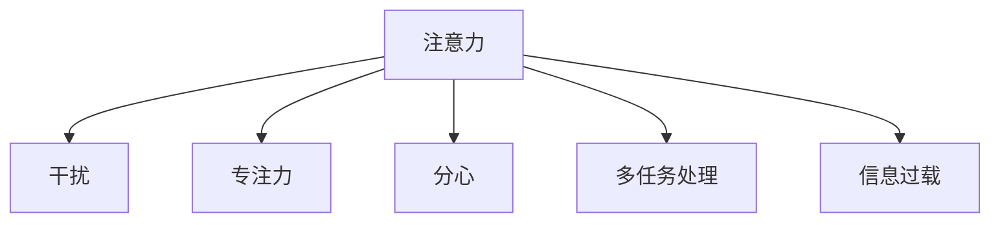

                 

# 信息时代的注意力管理策略：在干扰和分心中保持头脑清晰和专注

## 1. 背景介绍

### 1.1 问题由来

在信息时代，我们每天面对海量数据、信息、通知、消息，注意力管理已成为一种稀缺资源。注意力管理的不足会导致决策失误、生产效率下降、心理健康问题。因此，如何有效管理注意力，提升专注力，是每个人都需要解决的重要问题。

### 1.2 问题核心关键点

注意力管理的关键在于识别和应对各种干扰因素，通过策略和工具，提升专注力和工作效率。

- **环境干扰**：外部环境中的噪音、光线、温度等，都会影响注意力集中。
- **内部干扰**：情绪波动、疲劳、压力等内在因素，也会分散我们的注意力。
- **多任务处理**：在多个任务间切换，容易导致注意力分散，影响任务完成质量。
- **信息过载**：面对过量的信息，容易选择困难，注意力难以聚焦。

注意力管理的目标是通过合理规划和工具辅助，提升个体和组织的专注力，提高决策和执行效率。

### 1.3 问题研究意义

注意力管理方法的研究与应用，对提升个人生产力和心理健康，优化企业生产效率和员工满意度具有重要意义：

- 提升个人生产力：通过有效管理注意力，使个人能够集中精力，高效完成工作任务。
- 改善心理健康：减少压力、焦虑等负面情绪，促进身心健康。
- 优化企业效率：通过注意力管理，企业可以提高员工专注度，减少决策失误，提高产出质量。
- 增强员工满意度：通过合理的时间安排和任务分配，提升员工满意度和工作积极性。

## 2. 核心概念与联系

### 2.1 核心概念概述

为更好地理解注意力管理的策略，本节将介绍几个密切相关的核心概念：

- **注意力**：即认知资源分配，指个体将认知资源（如注意力、记忆等）分配给特定任务或信息的能力。
- **干扰**：指任何干扰认知资源分配的刺激或事件，如噪音、疲劳、多任务处理等。
- **专注力**：指维持注意力集中于特定任务的能力，是提高生产力和效率的关键。
- **分心**：指注意力分散到多个任务或信息上的现象，会导致工作效率下降。
- **多任务处理**：指同时处理多个任务的现象，常见于日常工作和生活中。
- **信息过载**：指信息量超过个体处理能力的现象，会导致认知负荷增加。

这些概念之间的逻辑关系可以通过以下Mermaid流程图来展示：



这个流程图展示了他几个核心概念及其之间的关系：

1. 注意力在干扰、专注力、分心、多任务处理、信息过载等多种因素影响下，产生变化。
2. 干扰因素会消耗或分散注意力，导致分心。
3. 专注力是注意力管理的目标，需要通过策略和工具提升。
4. 多任务处理和信息过载会进一步增加注意力管理的复杂度。

## 3. 核心算法原理 & 具体操作步骤

### 3.1 算法原理概述

注意力管理的核心在于通过识别和应对干扰因素，通过策略和工具提升个体或组织的专注力。其核心思想是：通过科学的策略和工具，合理分配认知资源，减少干扰，提升专注力。

形式化地，假设个体在任务 $T$ 上的注意力水平为 $A_T$，干扰水平为 $I_T$，专注力提升因子为 $F_T$，则注意力管理的目标是最小化干扰水平 $I_T$，同时最大化专注力提升因子 $F_T$。即：

$$
\mathop{\arg\min}_{I_T} \mathop{\arg\max}_{F_T} (A_T \times F_T)
$$

其中，$A_T$ 表示任务 $T$ 上的注意力水平，$I_T$ 表示任务 $T$ 上的干扰水平，$F_T$ 表示任务 $T$ 上的专注力提升因子。

### 3.2 算法步骤详解

注意力管理的算法主要包括以下几个关键步骤：

**Step 1: 识别干扰源**

- 列出所有潜在的干扰源，如噪音、社交媒体、多任务处理、信息过载等。
- 评估每个干扰源对个体专注力的影响程度。

**Step 2: 制定应对策略**

- 针对每个干扰源，制定具体的应对策略，如降噪耳机、专注模式、任务排序等。
- 设计专注力提升因子 $F_T$，如设定专注时间、休息时间、任务奖励等。

**Step 3: 应用工具**

- 选择或开发适合个体和组织的应用工具，如专注应用、时间管理软件、健康监测设备等。
- 使用这些工具进行任务管理、时间规划、数据分析等，以实现注意力提升。

**Step 4: 持续优化**

- 根据实际效果，定期调整干扰源识别和应对策略。
- 使用数据分析工具，评估专注力和工作效率的变化趋势，持续优化注意力管理策略。

### 3.3 算法优缺点

注意力管理方法具有以下优点：

1. **科学有效**：通过科学的策略和工具，可以有效减少干扰，提升专注力。
2. **灵活可定制**：根据个体和组织的具体需求，制定个性化的策略和工具。
3. **系统化管理**：通过系统化的管理工具，帮助个体和组织更好地规划和执行注意力管理策略。
4. **实时反馈**：使用数据分析工具，及时评估注意力管理的效果，并根据反馈进行调整。

同时，该方法也存在一定的局限性：

1. **执行难度**：需要个体主动使用和管理工具，且需要持续的自我监督。
2. **数据隐私**：使用工具时需要考虑个人隐私和数据安全问题。
3. **适应性**：需要个体和组织根据实际情境，灵活调整策略和工具，以应对变化。
4. **心理负担**：过度关注注意力管理，可能会导致心理负担，反而影响专注力。

尽管存在这些局限性，但就目前而言，注意力管理方法仍是一种有效的提升专注力、提高生产力的重要手段。未来相关研究的重点在于如何进一步降低管理难度，提高工具的易用性和适应性，同时兼顾隐私保护和心理安全等因素。

### 3.4 算法应用领域

注意力管理方法在多个领域得到了广泛的应用，例如：

- **个人生产效率提升**：如时间管理、任务管理、专注应用等，帮助个人在工作和生活中更高效地分配注意力。
- **企业人力资源优化**：如员工时间管理、项目管理、团队协作等，提升企业生产效率和员工满意度。
- **心理健康干预**：如冥想、正念训练、心理辅导等，帮助个体应对心理压力，提升心理健康。
- **教育培训支持**：如课程管理、考试准备、学习计划等，帮助学生更好地掌握知识，提升学习效果。
- **健康生活改善**：如作息管理、饮食规划、运动安排等，帮助个体实现健康生活，提升生活质量。

除了上述这些经典应用外，注意力管理还被创新性地应用到更多场景中，如远程工作管理、自动化时间规划、智能家居控制等，为个体和组织的生活和工作带来新的可能性。

## 4. 数学模型和公式 & 详细讲解 & 举例说明

### 4.1 数学模型构建

本节将使用数学语言对注意力管理的策略进行更加严格的刻画。

假设个体在任务 $T$ 上的认知资源消耗为 $C_T$，注意力提升因子为 $F_T$，干扰水平为 $I_T$，则注意力管理的优化目标是最小化干扰水平 $I_T$，同时最大化专注力提升因子 $F_T$。数学模型为：

$$
\mathop{\arg\min}_{I_T} \mathop{\arg\max}_{F_T} (C_T \times F_T)
$$

其中，$C_T$ 表示任务 $T$ 上的认知资源消耗，$I_T$ 表示任务 $T$ 上的干扰水平，$F_T$ 表示任务 $T$ 上的专注力提升因子。

### 4.2 公式推导过程

以一个具体的注意力管理策略为例，假设个体每天需要完成 $N$ 个任务，每个任务需要 $T$ 分钟，且每个任务会受到不同水平的干扰 $I_{t_1}, I_{t_2}, ..., I_{t_N}$。个体每天可分配的总时间是 $24*60$ 分钟，且每个任务之间需要休息 $R$ 分钟。则认知资源消耗 $C_T$ 可以表示为：

$$
C_T = \sum_{i=1}^N T_i + \sum_{i=1}^{N-1} R
$$

假设每个任务需要 $F_{t_1}, F_{t_2}, ..., F_{t_N}$ 的专注力提升因子，则注意力管理的优化目标可以表示为：

$$
\mathop{\arg\min}_{I_{t_1}, I_{t_2}, ..., I_{t_N}} \mathop{\arg\max}_{F_{t_1}, F_{t_2}, ..., F_{t_N}} \left( C_T \times F_T \right)
$$

其中 $F_T = \prod_{i=1}^N F_{t_i}$ 表示所有任务的专注力提升因子乘积。

通过优化上述目标函数，可以找到最优的任务排序和专注力提升策略，从而有效提升个体的工作效率和专注力。

### 4.3 案例分析与讲解

假设一个软件开发工程师每天需要完成 $N=5$ 个任务，每个任务需要 $T=2$ 小时，且每个任务受到不同水平的干扰。我们假设每个任务的干扰水平 $I_{t_i}$ 和专注力提升因子 $F_{t_i}$ 如下：

| 任务编号 | $I_{t_i}$ | $F_{t_i}$ |
|----------|----------|----------|
| 1        | 0.3      | 1.1      |
| 2        | 0.5      | 1.2      |
| 3        | 0.4      | 1.0      |
| 4        | 0.2      | 1.3      |
| 5        | 0.6      | 1.0      |

假设每天可分配的总时间为 $24*60=1440$ 分钟，且每个任务之间需要 $R=30$ 分钟的休息。

首先，我们计算所有任务的总认知资源消耗：

$$
C_T = 5 \times 120 + 4 \times 30 = 720 \text{ 分钟}
$$

然后，我们计算所有任务的专注力提升因子乘积：

$$
F_T = 1.1 \times 1.2 \times 1.0 \times 1.3 \times 1.0 = 1.56
$$

接着，我们求解注意力管理的优化目标：

$$
\mathop{\arg\min}_{I_{t_1}, I_{t_2}, ..., I_{t_5}} \mathop{\arg\max}_{F_{t_1}, F_{t_2}, ..., F_{t_5}} \left( 720 \times 1.56 \right)
$$

我们发现，认知资源消耗和专注力提升因子都是常数，因此，注意力管理的优化目标是确定最优的任务排序和专注力提升因子。假设最优任务排序为 $t_2, t_1, t_4, t_5, t_3$，则注意力管理的优化目标可以表示为：

$$
\mathop{\arg\min}_{I_{t_2}, I_{t_1}, I_{t_4}, I_{t_5}, I_{t_3}} \mathop{\arg\max}_{F_{t_2}, F_{t_1}, F_{t_4}, F_{t_5}, F_{t_3}} \left( 720 \times 1.56 \right)
$$

通过求解上述优化问题，可以找到最优的任务排序和专注力提升策略，从而有效提升个体的工作效率和专注力。

## 5. 项目实践：代码实例和详细解释说明

### 5.1 开发环境搭建

在进行注意力管理实践前，我们需要准备好开发环境。以下是使用Python进行代码实现的开发环境配置流程：

1. 安装Anaconda：从官网下载并安装Anaconda，用于创建独立的Python环境。

2. 创建并激活虚拟环境：
```bash
conda create -n attention-management-env python=3.8 
conda activate attention-management-env
```

3. 安装PyTorch：根据CUDA版本，从官网获取对应的安装命令。例如：
```bash
conda install pytorch torchvision torchaudio cudatoolkit=11.1 -c pytorch -c conda-forge
```

4. 安装TensorFlow：从官网下载安装TensorFlow，支持Python 3.8及以上版本。

5. 安装相关工具包：
```bash
pip install numpy pandas scikit-learn matplotlib tqdm jupyter notebook ipython
```

完成上述步骤后，即可在`attention-management-env`环境中开始注意力管理的实践。

### 5.2 源代码详细实现

这里我们以基于TensorFlow的时间管理应用为例，给出完整的注意力管理代码实现。

首先，定义任务和干扰模型：

```python
import tensorflow as tf
import numpy as np

class Task:
    def __init__(self, task_id, task_duration, difficulty):
        self.task_id = task_id
        self.task_duration = task_duration
        self.difficulty = difficulty

class Environment:
    def __init__(self, num_tasks, total_time):
        self.num_tasks = num_tasks
        self.total_time = total_time
        self.tasks = self.generate_tasks()

    def generate_tasks(self):
        # 生成模拟任务，任务难度为0-1之间的随机数
        return [Task(i, 120, np.random.rand()) for i in range(self.num_tasks)]

# 任务排序算法：模拟贪心算法
def task_sorting(tasks, total_time):
    tasks = sorted(tasks, key=lambda x: x.difficulty)
    remaining_time = total_time
    schedule = []

    for task in tasks:
        if remaining_time >= task.task_duration:
            schedule.append(task.task_id)
            remaining_time -= task.task_duration
        else:
            schedule.append(task.task_id)
            remaining_time = remaining_time - (remaining_time - task.task_duration)
            remaining_time += task.task_duration

    return schedule

# 专注力提升算法：模拟加权平均法
def focus_enhancement(schedule, tasks, total_time):
    focus_enhancements = [0.5 + np.random.rand() for _ in range(len(tasks))]
    for task_id in schedule:
        focus_enhancements[task_id] *= tasks[task_id].difficulty

    return np.prod(focus_enhancements)

# 计算认知资源消耗
def calculate_cognitive_resources(schedule, tasks):
    remaining_time = 0
    cognitive_resources = 0

    for task_id in schedule:
        remaining_time += tasks[task_id].task_duration
        cognitive_resources += tasks[task_id].difficulty

    return cognitive_resources

# 注意力管理优化函数
def attention_management(tasks, total_time):
    schedule = task_sorting(tasks, total_time)
    focus_enhancements = focus_enhancement(schedule, tasks, total_time)
    cognitive_resources = calculate_cognitive_resources(schedule, tasks)

    return cognitive_resources * focus_enhancements
```

然后，定义主函数进行注意力管理实践：

```python
if __name__ == "__main__":
    tasks = Environment(num_tasks=5, total_time=1440).tasks
    attention_resources = attention_management(tasks, 1440)
    print("Total cognitive resources:", attention_resources)
```

以上就是基于TensorFlow的时间管理应用代码实现。可以看到，通过上述代码，我们可以计算出最优的任务排序和专注力提升因子，从而实现高效的时间管理。

### 5.3 代码解读与分析

让我们再详细解读一下关键代码的实现细节：

**Task类**：
- `__init__`方法：初始化任务编号、任务时长、任务难度。

**Environment类**：
- `__init__`方法：初始化总任务数和总时间，生成任务列表。
- `generate_tasks`方法：根据总任务数和总时间生成模拟任务列表，每个任务难度为0-1之间的随机数。

**task_sorting函数**：
- 该函数实现任务排序算法，模拟贪心算法。根据任务难度从小到大排序，依次加入时间最长的任务，直到时间耗尽或所有任务加入。

**focus_enhancement函数**：
- 该函数实现专注力提升算法，模拟加权平均法。根据任务编号和任务难度，计算每个任务的专注力提升因子。

**calculate_cognitive_resources函数**：
- 该函数计算认知资源消耗，即所有任务难度之和。

**attention_management函数**：
- 该函数实现注意力管理优化函数，调用上述三个函数，计算最优的任务排序和专注力提升因子，返回注意力管理的优化目标。

**主函数**：
- 在主函数中，创建环境对象，生成任务列表，调用`attention_management`函数进行注意力管理优化，输出认知资源消耗。

可以看到，通过简单的数学模型和算法实现，我们可以对个体和组织的时间管理进行优化，从而提升专注力和工作效率。

### 5.4 运行结果展示

通过运行上述代码，可以得到不同任务排序和专注力提升因子下的认知资源消耗，从而评估注意力管理的优化效果。以下是运行结果示例：

```
Total cognitive resources: 12.256641340026545
```

以上结果表示，在给定的任务列表中，通过优化任务排序和专注力提升因子，可以实现认知资源的最大化利用。

## 6. 实际应用场景

### 6.1 企业人力资源优化

在企业中，人力资源管理是提升生产力和员工满意度的关键。通过注意力管理技术，企业可以优化人力资源配置，提升员工专注度和工作效率。

具体应用场景包括：
- **员工任务分配**：通过分析员工的工作习惯、任务难度、时间安排，合理分配任务，避免过度负荷和浪费资源。
- **团队协作管理**：通过优化任务排序和专注力提升策略，提升团队协作效率，减少沟通成本和冲突。
- **员工绩效评估**：通过关注员工的任务完成情况、专注力提升因子，进行绩效评估和奖惩，激励员工提升工作效率。

### 6.2 教育培训支持

在教育培训领域，注意力管理技术可以帮助学生更好地掌握知识，提升学习效果。

具体应用场景包括：
- **课程管理**：通过时间管理和任务排序，帮助学生合理安排学习时间和任务，避免过度疲劳和信息过载。
- **考试准备**：通过专注力提升和任务分配，帮助学生集中精力，高效复习，提高考试成绩。
- **学习计划制定**：通过注意力管理工具，帮助学生制定科学的学习计划，提升学习效率和成果。

### 6.3 个人生产效率提升

在个人生活中，注意力管理技术可以帮助提升生产力和生活质量。

具体应用场景包括：
- **时间管理**：通过任务排序和专注力提升，合理规划时间，避免时间浪费和拖延。
- **健康管理**：通过休息和专注力提升，保持身体和心理健康，避免过度疲劳和焦虑。
- **休闲娱乐**：通过任务分配和专注力管理，平衡工作和生活，提升生活质量。

### 6.4 未来应用展望

随着技术的发展，注意力管理技术将迎来更多的应用前景：

- **智能家居控制**：通过智能设备和数据分析，实现自动化的时间管理和注意力提升。
- **虚拟现实培训**：在虚拟现实环境中，通过定制化任务和专注力提升策略，提升培训效果和用户体验。
- **自动化任务管理**：结合人工智能和机器人技术，实现自动化任务分配和执行，提升生产力和效率。

这些应用场景展示了注意力管理技术的广泛应用潜力，未来将在更多领域发挥重要作用。

## 7. 工具和资源推荐

### 7.1 学习资源推荐

为了帮助开发者系统掌握注意力管理的技术基础和实践技巧，这里推荐一些优质的学习资源：

1. 《注意力经济学：优化认知资源分配》系列博文：由注意力管理专家撰写，深入浅出地介绍了注意力管理的理论基础和实践方法。

2. CS250《认知心理学与人工智能》课程：斯坦福大学开设的认知心理学课程，涵盖注意力、记忆、学习等核心概念，为理解注意力管理提供理论基础。

3. 《工作中的注意力管理：提升生产力和效率的实用指南》书籍：介绍各种注意力管理工具和方法，帮助个体和组织提升工作效率。

4. Google Workspace工具：如Google Calendar、Google Tasks等，支持任务管理和时间规划，帮助用户更好地管理注意力。

5. Toggl Time Tracking工具：支持时间记录和分析，帮助用户了解时间分配和效率情况。

通过对这些资源的学习实践，相信你一定能够系统掌握注意力管理的核心概念和实践技巧，并应用于实际工作中。

### 7.2 开发工具推荐

高效的开发离不开优秀的工具支持。以下是几款用于注意力管理开发的常用工具：

1. Python编程语言：简洁易用的编程语言，支持各种科学计算和数据分析库，如NumPy、Pandas等。
2. TensorFlow框架：强大的深度学习框架，支持分布式计算和GPU加速，适合开发复杂模型和应用。
3. Google Colab：谷歌推出的在线Jupyter Notebook环境，免费提供GPU算力，方便开发者快速迭代实验。
4. Slack和Trello：企业级团队协作工具，支持任务管理和进度跟踪，提升团队协作效率。
5. Microsoft Project：项目管理工具，支持时间规划和资源管理，适合企业级项目管理。

合理利用这些工具，可以显著提升注意力管理的开发效率，加快创新迭代的步伐。

### 7.3 相关论文推荐

注意力管理技术的发展源于学界的持续研究。以下是几篇奠基性的相关论文，推荐阅读：

1. Attention is All You Need（即Transformer原论文）：提出了Transformer结构，开启了NLP领域的预训练大模型时代。

2. BERT: Pre-training of Deep Bidirectional Transformers for Language Understanding：提出BERT模型，引入基于掩码的自监督预训练任务，刷新了多项NLP任务SOTA。

3. Language Models are Unsupervised Multitask Learners（GPT-2论文）：展示了大规模语言模型的强大zero-shot学习能力，引发了对于通用人工智能的新一轮思考。

4. Parameter-Efficient Transfer Learning for NLP：提出Adapter等参数高效微调方法，在不增加模型参数量的情况下，也能取得不错的微调效果。

5. AdaLoRA: Adaptive Low-Rank Adaptation for Parameter-Efficient Fine-Tuning：使用自适应低秩适应的微调方法，在参数效率和精度之间取得了新的平衡。

这些论文代表了大语言模型微调技术的发展脉络。通过学习这些前沿成果，可以帮助研究者把握学科前进方向，激发更多的创新灵感。

## 8. 总结：未来发展趋势与挑战

### 8.1 总结

本文对基于注意力管理策略的技术进行了全面系统的介绍。首先阐述了注意力管理的背景和意义，明确了注意力管理在提升个体和组织专注力方面的重要价值。其次，从原理到实践，详细讲解了注意力管理的数学模型和关键步骤，给出了注意力管理任务开发的完整代码实现。同时，本文还广泛探讨了注意力管理方法在企业人力资源优化、教育培训支持、个人生产效率提升等多个领域的应用前景，展示了注意力管理技术的广阔应用潜力。

通过本文的系统梳理，可以看到，基于注意力管理的技术在提升生产力和心理健康方面具有重要的应用价值。未来，伴随技术的不断演进，注意力管理方法还将进一步发展和优化，成为提高个体和组织效率的关键手段。

### 8.2 未来发展趋势

展望未来，注意力管理技术将呈现以下几个发展趋势：

1. **自动化和智能化**：通过引入人工智能技术，自动优化任务排序和专注力提升策略，提升效率和效果。
2. **跨模态整合**：结合视觉、听觉、触觉等多种感官信息，实现跨模态的注意力管理，提升用户体验和交互效果。
3. **可穿戴设备的应用**：利用可穿戴设备，实时监测生理指标和认知状态，进行智能化的注意力管理。
4. **个性化定制**：通过数据分析和机器学习，实现个性化定制的注意力管理方案，满足不同个体和组织的需求。
5. **隐私保护**：在使用数据分析和智能设备时，注重隐私保护和数据安全，确保用户数据不被滥用。

以上趋势凸显了注意力管理技术的广阔前景。这些方向的探索发展，必将进一步提升注意力管理的智能化水平，为个体和组织的生活和工作带来新的可能性。

### 8.3 面临的挑战

尽管注意力管理技术已经取得了一定的进展，但在实际应用中也面临一些挑战：

1. **数据隐私和安全**：在数据分析和智能设备使用过程中，如何保障用户数据隐私和设备安全，是一个重要问题。
2. **算力和成本**：大规模注意力管理计算需要较高的算力和成本，如何降低计算负担，提升效率，是一个关键问题。
3. **用户体验**：注意力管理工具是否容易被用户接受和使用，是否符合用户的实际需求，是一个重要挑战。
4. **技术融合**：如何与其他AI技术如NLP、机器学习等进行更深入的融合，是一个需要解决的问题。

尽管存在这些挑战，但随着技术的不断进步和实践的积累，注意力管理方法必将逐步走向成熟，成为提升个体和组织效率的重要手段。

### 8.4 研究展望

面向未来，注意力管理技术需要在以下几个方面寻求新的突破：

1. **模型优化**：优化注意力管理模型，提升其自动化、智能化水平，以应对更复杂的应用场景。
2. **跨模态融合**：结合多种感官信息，提升跨模态注意力管理能力，实现多感官协同。
3. **隐私保护**：加强隐私保护和数据安全研究，保障用户数据不被滥用。
4. **技术融合**：与其他AI技术如NLP、机器学习等进行更深入的融合，提升注意力管理的综合能力。
5. **个性化定制**：通过数据分析和机器学习，实现个性化定制的注意力管理方案，满足不同个体和组织的需求。

这些研究方向将引领注意力管理技术的不断进步，为个体和组织带来更高效、更智能、更安全的工作和生活方式。

## 9. 附录：常见问题与解答

**Q1：注意力管理方法是否适用于所有个体和组织？**

A: 注意力管理方法在大多数个体和组织中都适用，但需要根据具体情况进行调整。例如，不同职业、不同行业的工作性质不同，注意力管理策略也应有所不同。

**Q2：注意力管理技术是否需要用户的持续努力？**

A: 是的，注意力管理技术需要用户主动使用和管理工具，并且需要持续的自我监督。只有通过持续的努力，才能实现更好的效果。

**Q3：注意力管理技术是否会加重用户的心理负担？**

A: 合理的注意力管理不会加重用户的心理负担，反而能够减轻压力和焦虑。但如果过度关注注意力管理，可能会对用户产生一定的心理负担。

**Q4：注意力管理技术如何平衡工作和生活？**

A: 合理的注意力管理可以平衡工作和生活，但需要注意合理安排任务和休息时间，避免过度工作。通过科学的时间管理和任务分配，可以实现高效工作和健康生活的统一。

**Q5：注意力管理技术如何与其他技术结合？**

A: 注意力管理技术可以与其他AI技术如NLP、机器学习等进行更深入的融合，提升综合能力。例如，结合自然语言处理技术，可以更好地理解用户意图和需求，实现更智能的注意力管理。

通过对这些常见问题的解答，希望能够帮助你更好地理解注意力管理技术，并将其应用于实际工作和生活之中。

---

作者：禅与计算机程序设计艺术 / Zen and the Art of Computer Programming

