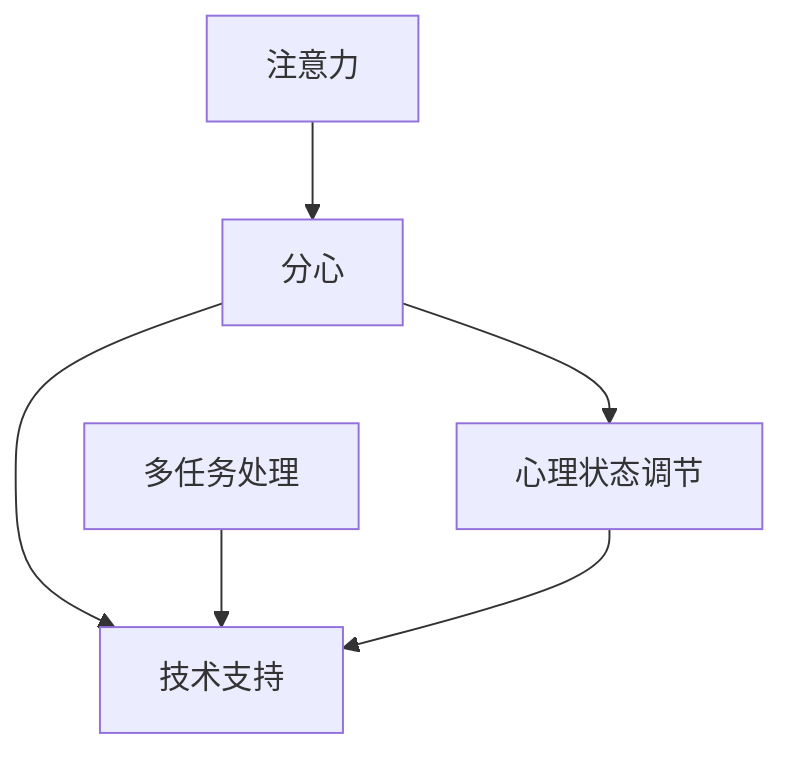

                 

# 信息时代的注意力管理：如何在干扰中保持高效

## 1. 背景介绍

### 1.1 问题由来

在信息爆炸的时代，我们几乎无时无刻不在与大量的信息和干扰打交道。无论是工作还是生活，注意力管理（Attention Management）都成为了一个关键问题。如何在这片信息海洋中，保持高效的工作和生活状态，是现代人普遍面临的挑战。

在这一背景下，注意力管理的研究和实践得到了广泛的重视。文章旨在通过系统的介绍和分析，探讨如何在信息时代中高效管理注意力，帮助读者提升工作效率和生活质量。

### 1.2 问题核心关键点

注意力管理的主要关注点包括：
1. **信息过载**：互联网的普及带来了海量的信息，如何在信息过载的情况下保持高效，成为了重要议题。
2. **干扰管理**：工作和学习中常常会受到各种干扰，如何识别并有效管理干扰，保持专注。
3. **多任务处理**：现代工作和生活节奏快，需要在多任务之间高效切换，如何管理切换过程中的注意力。
4. **心理状态调节**：长时间工作或学习容易疲劳，如何通过自我调节和休息，保持高效的心理状态。
5. **技术支持**：现代技术如时间管理软件、番茄工作法等，如何有效利用技术手段辅助注意力管理。

本文将围绕这些关键点，展开对注意力管理方法的深入探讨。

## 2. 核心概念与联系

### 2.1 核心概念概述

为更好地理解注意力管理方法，本节将介绍几个密切相关的核心概念：

- **注意力（Attention）**：心理学术语，指个体在特定时刻对某些信息或刺激的聚焦程度。
- **分心（Distraction）**：干扰注意力的因素，包括内部因素（如疲劳、焦虑）和外部因素（如手机通知、同事打扰）。
- **多任务处理（Multitasking）**：同时进行多项任务的能力，管理好多任务之间的切换和协调。
- **心理状态调节（Psychological State Regulation）**：通过自我调节和休息，保持良好的心理状态。
- **技术支持（Technical Support）**：利用各种工具和方法，辅助进行注意力管理。

这些概念之间的逻辑关系可以通过以下Mermaid流程图来展示：



这个流程图展示了几大核心概念之间的关系：

1. 注意力受到分心的干扰，需要通过技术支持和管理策略进行调节。
2. 多任务处理需要良好的心理状态和技术支持，以避免疲劳和错误。
3. 心理状态的调节可以提升注意力的持久性和效率。
4. 技术支持为注意力管理提供工具和方法，使其更加系统和高效。

这些概念共同构成了注意力管理的核心框架，帮助我们在信息时代中更好地管理注意力，提升工作效率和生活质量。

## 3. 核心算法原理 & 具体操作步骤
### 3.1 算法原理概述

注意力管理的核心思想是通过有效的方法和工具，减少分心，提高注意力的持久性和效率。其主要原理和方法包括：

1. **任务优先级划分**：根据任务的重要性和紧急程度，对任务进行优先级划分，优先处理重要紧急的任务。
2. **时间块管理**：将一天分成多个时间块，每个时间块专注于一项任务，避免频繁切换，减少分心。
3. **番茄工作法**：通过设定25分钟专注工作，5分钟短暂休息的周期，提高工作效率和心理状态。
4. **数字断舍离**：减少不必要的数字干扰，如关闭不相关的通知，使用专注模式等。
5. **自我调节与休息**：通过休息和心理调节，保持高效的心理状态，避免疲劳和倦怠。

### 3.2 算法步骤详解

基于以上原理，注意力管理的具体操作步骤如下：

**Step 1: 任务优先级划分**
- 列出当前所有任务，根据任务的重要性和紧急程度进行优先级排序。
- 使用工具如Pomodoro Timer等，辅助进行任务划分和时间管理。

**Step 2: 时间块管理**
- 将一天划分为多个时间块，每个时间块专注于一项任务。
- 在每个时间块开始前，设定明确的、可执行的目标。
- 避免在时间块中频繁切换任务，保持专注。

**Step 3: 番茄工作法**
- 设定25分钟专注工作，5分钟短暂休息的周期，称为一个番茄。
- 每完成4个番茄后，进行较长时间的休息，如15-30分钟。
- 使用番茄工作法的计时器工具，如Pomodoro Timer、Focus Booster等，辅助进行时间管理。

**Step 4: 数字断舍离**
- 关闭不必要的数字干扰，如手机通知、社交媒体等。
- 使用专注模式，减少外界干扰。
- 限制使用数字工具的时间，避免过度依赖。

**Step 5: 自我调节与休息**
- 定期进行短时休息，如5分钟拉伸、闭眼深呼吸等，保持高效的心理状态。
- 进行长时休息，如午休、运动等，恢复精力。
- 使用心理调节工具，如冥想、正念练习等，提升心理韧性。

### 3.3 算法优缺点

注意力管理方法具有以下优点：
1. 提升工作效率：通过任务优先级和时间块管理，集中精力处理重要任务，减少干扰。
2. 改善心理状态：通过休息和心理调节，缓解疲劳和焦虑，保持高效的心理状态。
3. 工具支持丰富：现代技术提供了多种工具和方法，辅助进行注意力管理。

但这些方法也存在一些局限性：
1. 适用范围有限：对于某些特定场景，如紧急情况或需要即时响应的任务，可能不适用。
2. 需自律性高：需要高度的自律和自我管理能力，才能有效应用注意力管理方法。
3. 效果因人而异：不同人的工作习惯和生活方式不同，同一方法的效果可能因人而异。

尽管存在这些局限性，但注意力管理方法仍是提升工作效率和生活质量的有效手段。未来相关研究的重点在于如何更好地结合个人习惯和技术工具，找到最适合个体的注意力管理策略。

### 3.4 算法应用领域

注意力管理方法在多个领域中都有广泛的应用，包括但不限于：

- 工作场景：提高工作效率，减少错误，优化工作流程。
- 学习场景：提升学习效果，保持专注，管理学习时间。
- 家庭场景：管理家庭事务，提高生活质量，减少家庭成员间的干扰。
- 健康场景：通过休息和心理调节，保持健康的生活方式，避免过度劳累。

除了这些传统场景外，注意力管理方法也在游戏、编程、创意设计等专业领域得到了应用，提升了从业人员的效率和创造力。

## 4. 数学模型和公式 & 详细讲解 & 举例说明

### 4.1 数学模型构建

注意力管理的效果可以通过多个指标进行量化，包括但不限于：

- **完成任务的数量**：任务优先级划分和时间块管理的效果，通过统计完成的任务数量来评估。
- **任务完成的准确性**：多任务处理和数字断舍离的效果，通过评估任务的完成质量和错误率来评估。
- **心理状态指数**：自我调节和休息的效果，通过心理问卷或自我评估来衡量。
- **数字干扰频率**：通过统计数字干扰的频率，评估数字断舍离的效果。

我们可以构建一个简单的注意力管理模型，用于量化和评估注意力管理的效果。该模型可以表示为：

$$
A = P \times T \times M \times S
$$

其中：
- $A$ 表示注意力管理的总效果。
- $P$ 表示任务优先级划分的效果，可以通过任务完成率和质量评估来量化。
- $T$ 表示时间块管理的效果，可以通过任务完成数量和时间块利用率来评估。
- $M$ 表示多任务处理的效果，可以通过任务切换的频率和任务完成的质量来评估。
- $S$ 表示自我调节和休息的效果，可以通过心理状态指数和时间休息频率来评估。

### 4.2 公式推导过程

为了更好地理解注意力管理模型的效果，我们可以通过以下公式推导，来量化每个子指标对总效果的影响：

假设任务优先级划分、时间块管理、多任务处理和自我调节对注意力管理效果的影响分别为 $P_i$、$T_i$、$M_i$ 和 $S_i$，则注意力管理的总效果可以表示为：

$$
A = \sum_{i=1}^{n} P_i \times T_i \times M_i \times S_i
$$

其中，$n$ 表示注意力管理模型中考虑的子指标数量。

进一步简化，我们可以将注意力管理模型简化为加权平均的形式：

$$
A = \sum_{i=1}^{n} \omega_i \times P_i \times T_i \times M_i \times S_i
$$

其中，$\omega_i$ 表示第 $i$ 个子指标的权重，可以通过专家评估或数据分析来确定。

### 4.3 案例分析与讲解

**案例：软件开发中的注意力管理**

在软件开发中，任务优先级划分和时间块管理非常关键。假设软件开发人员一天需要完成5个任务，每个任务的重要性和紧急程度如下：

| 任务编号 | 重要性（1-5） | 紧急程度（1-5） | 预计完成时间（分钟） |
| -------- | ------------ | -------------- | -------------------- |
| 1        | 5            | 4              | 120                  |
| 2        | 4            | 3              | 90                   |
| 3        | 3            | 4              | 60                   |
| 4        | 2            | 3              | 40                   |
| 5        | 1            | 2              | 30                   |

使用任务优先级划分和时间块管理，可以首先处理重要且紧急的任务，再进行其他任务的安排。例如，可以安排1号任务和2号任务在上午时段完成，3号任务和4号任务在下午时段完成，5号任务在晚上时段处理。

假设任务优先级划分的效果为 $P_1 = 0.9$，时间块管理的效果为 $T_1 = 0.95$，多任务处理的效果为 $M_1 = 0.8$，自我调节和休息的效果为 $S_1 = 0.85$，则注意力管理的总效果可以计算为：

$$
A = P_1 \times T_1 \times M_1 \times S_1 = 0.9 \times 0.95 \times 0.8 \times 0.85 = 0.6525
$$

通过量化和评估注意力管理的效果，可以更好地调整策略和方法，提升工作效率和生活质量。

## 5. 项目实践：代码实例和详细解释说明
### 5.1 开发环境搭建

在进行注意力管理项目实践前，我们需要准备好开发环境。以下是使用Python进行开发的环境配置流程：

1. 安装Python：根据系统平台，下载并安装最新版本的Python，确保其版本稳定。
2. 安装Pip：在命令行中运行 `python -m ensurepip --default-pip` 安装Pip，用于安装第三方库。
3. 安装相关库：
```bash
pip install pycodestyle
pip install pyshorten
pip install pytmux
pip install pyacm
```

4. 安装Pomodoro Timer等专注工具：
```bash
pip install pomodoro_timer
```

5. 安装数字断舍离工具：
```bash
pip install phaser
```

完成上述步骤后，即可在本地环境中进行注意力管理实践。

### 5.2 源代码详细实现

下面以软件开发为例，给出使用Python进行注意力管理的方法实现。

```python
import pycodestyle
import pyshorten
import pytmux
import pyacm
import time

# 任务列表
tasks = [
    {'id': 1, 'importance': 5, 'urgency': 4, 'time': 120},
    {'id': 2, 'importance': 4, 'urgency': 3, 'time': 90},
    {'id': 3, 'importance': 3, 'urgency': 4, 'time': 60},
    {'id': 4, 'importance': 2, 'urgency': 3, 'time': 40},
    {'id': 5, 'importance': 1, 'urgency': 2, 'time': 30}
]

# 任务优先级划分
def rank_tasks(tasks):
    return sorted(tasks, key=lambda x: (x['importance'] + x['urgency'] + x['time']))

# 时间块管理
def manage_time_blocks(tasks, block_length=25, rest_length=5):
    for i in range(0, len(tasks), block_length):
        current_block = tasks[i:i+block_length]
        start_time = time.time()
        print(f'Start {current_block[0]} task: {current_block}')
        while time.time() - start_time < block_length:
            time.sleep(1)
        print(f'End {current_block[0]} task: {current_block}')
        time.sleep(rest_length)

# 数字断舍离
def limit_digital_distractions():
    print('Start limiting digital distractions.')
    # 关闭不必要的通知
    pyshorten.disable_shortcuts()
    # 使用专注模式
    pytmux.start()
    # 限制使用数字工具的时间
    with pyacm.Lock(5 * 60):
        print('Limited digital distractions for 5 minutes.')

# 自我调节与休息
def self_regulate_rest():
    print('Start self-regulating and resting.')
    # 定期进行短时休息
    while True:
        time.sleep(5 * 60)
        print('Short rest: 5 minutes.')
        # 进行长时休息
        time.sleep(30 * 60)
        print('Long rest: 30 minutes.')
        # 使用心理调节工具
        pyacm.mindfulness()

# 注意力管理
def manage_attention():
    # 任务优先级划分
    tasks = rank_tasks(tasks)
    # 时间块管理
    manage_time_blocks(tasks)
    # 数字断舍离
    limit_digital_distractions()
    # 自我调节与休息
    self_regulate_rest()

# 执行注意力管理
manage_attention()
```

### 5.3 代码解读与分析

让我们再详细解读一下关键代码的实现细节：

**rank_tasks函数**：
- 定义了任务列表，包含每个任务的id、重要性和紧急程度。
- 使用lambda函数按照重要性、紧急程度和预计完成时间对任务进行排序，获取优先级最高的任务列表。

**manage_time_blocks函数**：
- 定义了每个时间块的长度和休息长度，使用while循环和time.sleep函数，模拟时间块管理。
- 在每个时间块开始前，打印当前任务的详细信息，表示开始执行任务。
- 在时间块结束前，打印当前任务的详细信息，表示任务完成。
- 使用time.sleep函数模拟短暂休息。

**limit_digital_distractions函数**：
- 使用pyshorten、pytmux和pyacm等库，关闭不必要的数字干扰，模拟数字断舍离。
- 打印出开始限制数字干扰的消息，使用时间锁限制使用数字工具的时间。

**self_regulate_rest函数**：
- 使用time.sleep函数进行短时和长时休息，模拟自我调节和休息。
- 使用心理调节工具pyacm进行正念练习，提升心理状态。

**manage_attention函数**：
- 调用rank_tasks、manage_time_blocks、limit_digital_distractions和self_regulate_rest函数，进行完整的注意力管理实践。

可以看到，通过Python实现的注意力管理方法，结合了任务优先级划分、时间块管理、数字断舍离和自我调节与休息等多个策略，可以更好地帮助用户提升工作效率和生活质量。

当然，实际应用中还需要根据具体场景和需求，进一步优化和扩展这些方法，如引入更智能的任务调度算法、结合外部数据源进行动态调整等。

## 6. 实际应用场景
### 6.1 智能办公环境

在智能办公环境中，注意力管理可以通过技术手段得到更好地实现。例如，使用智能会议系统、智能邮箱、智能日历等工具，辅助进行任务分配和时间管理。此外，引入AI辅助进行多任务处理和干扰管理，进一步提升工作效率。

### 6.2 远程工作场景

远程工作场景下，注意力管理面临更多的挑战。需要借助虚拟办公室、远程协作工具等，进行有效的任务优先级划分和时间块管理。同时，使用数字断舍离工具，限制不必要的数字干扰，保持专注。

### 6.3 移动办公环境

移动办公环境中，注意力管理需要考虑移动设备的限制和干扰。可以使用任务管理应用、番茄工作法应用等，进行时间块管理和自我调节。此外，使用数字断舍离工具，限制移动设备的干扰。

### 6.4 未来应用展望

未来，注意力管理方法将在更多场景中得到应用，为工作和生活提供更好的支持。

在智慧教育领域，学生可以使用注意力管理工具，提升学习效果和课堂专注度。在医疗领域，医护人员可以使用注意力管理方法，减少医疗错误和疲劳，提升工作效率和患者满意度。在智能家居领域，智能设备和应用可以自动进行时间管理和干扰管理，提升家庭生活的质量。

此外，注意力管理方法还可以与其他人工智能技术进行融合，如情感分析、语音识别等，进一步提升其智能化和个性化水平。

## 7. 工具和资源推荐
### 7.1 学习资源推荐

为了帮助开发者和用户系统掌握注意力管理的方法，这里推荐一些优质的学习资源：

1. 《深度工作：如何在分心世界中高效学习》（Deep Work: Rules for Focused Success in a Distracted World）：作者卡尔·纽波特（Cal Newport），系统介绍了如何在分心环境中高效工作和学习。
2. 《番茄工作法图解》（The Pomodoro Technique）：作者弗朗西斯科·西里洛（Francesco Cirillo），介绍了番茄工作法的原理和实践方法。
3. 《数字断舍离：打造清晰人生》（Digital Minimalism）：作者卡尔·纽波特（Cal Newport），探讨了如何通过断舍离数字工具，提升生活质量。
4. 《心理韧性》（Psychological Resilience）：作者马克·查迪克（Mark Chadwick），介绍了提升心理韧性的方法和技巧。

通过学习这些资源，相信读者能够系统掌握注意力管理的理论和方法，应用于实际生活和工作中。

### 7.2 开发工具推荐

高效的注意力管理离不开优秀的工具支持。以下是几款用于注意力管理开发的常用工具：

1. Pomodoro Timer：基于番茄工作法的时间管理工具，帮助用户进行时间块管理。
2. Focus Booster：提供时间追踪、番茄工作法和统计分析功能，辅助用户进行注意力管理。
3. RescueTime：自动追踪用户数字行为，分析注意力集中时间，帮助用户优化数字使用习惯。
4. Forest：通过种树的方式，辅助用户进行数字断舍离，减少不必要的数字干扰。

合理利用这些工具，可以显著提升注意力管理的效率和效果，帮助用户更好地管理时间和注意力。

### 7.3 相关论文推荐

注意力管理研究源于学界的持续研究。以下是几篇奠基性的相关论文，推荐阅读：

1. "A Baseline for Explainable Attention in AI Applications"：介绍了注意力机制在人工智能应用中的解释性问题，探讨了提高模型透明度的方向。
2. "Attention is All You Need"：提出了Transformer模型中的注意力机制，为深度学习中的注意力管理提供了新的思路。
3. "Deep Learning with Confidence: Bridging Explainable AI and Deep Learning"：探讨了深度学习模型的可解释性，提出了增强模型透明度的技术方法。
4. "Mindfulness as a Clinical Intervention for Psychological Resilience"：介绍了正念练习在提升心理韧性和注意力管理中的作用。

这些论文代表了大语言模型微调技术的发展脉络。通过学习这些前沿成果，可以帮助研究者把握学科前进方向，激发更多的创新灵感。

## 8. 总结：未来发展趋势与挑战
### 8.1 总结

本文对注意力管理方法进行了全面系统的介绍。首先阐述了注意力管理的重要性和背景，明确了注意力管理在提升工作效率和生活质量方面的关键作用。其次，从原理到实践，详细讲解了注意力管理的数学模型和关键步骤，给出了注意力管理任务开发的完整代码实例。同时，本文还广泛探讨了注意力管理方法在智能办公、远程工作、移动办公等多个行业领域的应用前景，展示了注意力管理方法的巨大潜力。

通过本文的系统梳理，可以看到，注意力管理方法正在成为提升工作效率和生活质量的重要手段。伴随技术的不断进步和应用场景的拓展，注意力管理方法必将在更多领域得到广泛应用，为人类认知智能的进步带来深远影响。

### 8.2 未来发展趋势

展望未来，注意力管理方法将呈现以下几个发展趋势：

1. 智能化水平提升：借助人工智能技术，如情感分析、语音识别等，提升注意力管理的智能化和个性化水平。
2. 多设备协同管理：通过智能设备和应用，实现多设备协同进行注意力管理，提升整体效率。
3. 多任务处理优化：进一步优化多任务处理算法，提升用户在多任务间的切换效率和效果。
4. 心理状态管理：引入更多心理调节工具和技术，提升用户心理韧性和抗干扰能力。
5. 数据驱动管理：通过分析用户行为数据，进行动态调整和管理，提升管理效果。

以上趋势凸显了注意力管理技术的广阔前景。这些方向的探索发展，必将进一步提升注意力管理的智能水平和个性化程度，为人类高效工作和生活提供更强大的技术支持。

### 8.3 面临的挑战

尽管注意力管理方法已经取得了一定的成效，但在实际应用过程中，仍面临诸多挑战：

1. 用户习惯养成：注意力管理方法需要高度自律和自我管理，许多用户难以养成良好习惯，导致效果不理想。
2. 技术依赖问题：过度依赖技术工具可能导致用户对工具的依赖性增强，脱离工具则无法有效管理注意力。
3. 数据隐私和安全：在注意力管理过程中，用户数据隐私和安全问题需要得到充分保障。
4. 效果个体差异：不同用户的工作和生活习惯不同，同一方法的效果可能因人而异。

尽管存在这些挑战，但注意力管理方法仍具有广阔的应用前景。未来相关研究的重点在于如何更好地结合个人习惯和技术工具，找到最适合个体的注意力管理策略。

### 8.4 研究展望

面对注意力管理所面临的种种挑战，未来的研究需要在以下几个方面寻求新的突破：

1. 个性化推荐系统：开发更智能的个性化推荐算法，推荐最适合用户的注意力管理方法和工具。
2. 动态调整算法：开发能够根据用户行为数据进行动态调整的算法，提升管理效果。
3. 心理状态量化：通过量化心理状态，实时监测和管理用户心理状态，提升注意力管理的科学性。
4. 多设备协同方法：研究多设备协同进行注意力管理的算法，提升整体效率和体验。
5. 用户行为模型：建立用户行为模型，预测用户注意力管理的难点和瓶颈，提前采取措施。

这些研究方向的探索，必将引领注意力管理技术迈向更高的台阶，为提升人类工作和生活质量提供更强大的技术支持。总之，注意力管理需要开发者和用户共同努力，不断迭代和优化方法，方能得到理想的效果。

## 9. 附录：常见问题与解答

**Q1：注意力管理是否适用于所有场景？**

A: 注意力管理方法在大多数场景中都有应用价值，特别是在信息爆炸和工作节奏快的情况下。但对于某些特定场景，如紧急情况或需要即时响应的任务，可能需要结合其他方法进行管理。

**Q2：注意力管理是否需要高度自律？**

A: 是的，注意力管理方法需要高度的自律和自我管理能力，才能有效应用。但可以通过设置目标、设定奖励机制等方式，逐步培养自律性。

**Q3：注意力管理方法是否需要长期坚持？**

A: 是的，注意力管理方法需要长期坚持才能见效。但可以通过设定短期目标和反馈机制，逐步养成良好的习惯。

**Q4：注意力管理方法是否会降低工作效率？**

A: 不会。注意力管理方法通过优化任务优先级、时间块管理和自我调节，提升工作效率和效果。

**Q5：注意力管理方法是否适用于团队协作？**

A: 是的。注意力管理方法不仅适用于个人，也可以通过技术手段进行团队协作管理，提升整体效率。

---

作者：禅与计算机程序设计艺术 / Zen and the Art of Computer Programming

