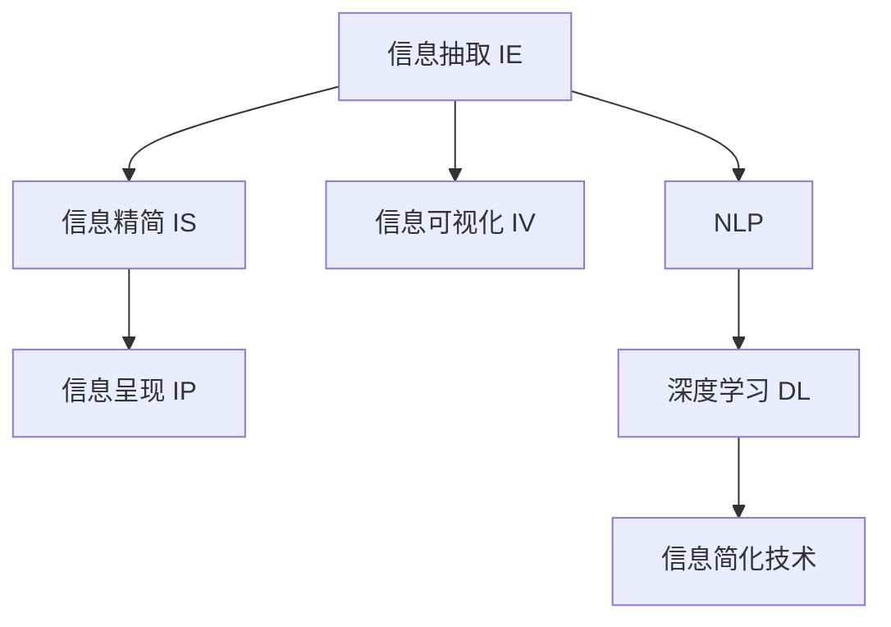

                 

# 信息简化的力量：在复杂世界中简化以提高效率

## 1. 背景介绍

### 1.1 问题由来
在现代信息时代，数据量和信息复杂性呈爆炸式增长。无论是商业决策、科研发现，还是日常生活中的决策，都面临着海量的数据和纷繁复杂的信息。如何从这些庞杂的信息中提取出最关键、最有价值的部分，并简化为可操作、易理解的结论，是当前信息处理领域面临的核心问题。

### 1.2 问题核心关键点
信息简化的核心在于从复杂的信息中提取出关键要素，通过加工处理，转化为简洁、高效的信息产品。这一过程需要解决以下几个关键问题：

- **信息提取**：从大规模数据中识别和提取关键信息，如文本中的关键词、图像中的物体、网络中的链接等。
- **信息精简**：对提取出的信息进行归纳、概括、分类等处理，去除冗余和噪声，保留最有价值的部分。
- **信息呈现**：将精简后的信息转化为易于理解、高效使用的形式，如可视化图表、简洁的报表、清晰的摘要等。

这些问题在信息处理和决策支持系统中普遍存在，如何在处理复杂信息时保持效率和准确性，是信息简化技术的研究热点。

### 1.3 问题研究意义
信息简化技术的应用，对于提升决策效率、降低信息获取成本、改善用户体验等具有重要意义：

1. **决策支持**：在商业、科研、医疗等决策场景中，精简的信息可以更快地生成可行的方案和策略。
2. **知识管理**：在知识密集型行业，如教育、科研、咨询等，信息简化有助于高效管理海量知识库。
3. **用户体验**：在移动互联网和智能设备普及的背景下，用户对信息呈现形式的要求越来越高，简化的信息能提高用户满意度和使用便捷性。
4. **风险防控**：信息简化有助于从海量数据中快速发现异常和风险，支持及时预警和应急响应。

总之，信息简化技术是构建高效、可靠、智能的信息处理系统的关键，对于提升社会治理效率、推动科技发展具有重要意义。

## 2. 核心概念与联系

### 2.1 核心概念概述

为更好地理解信息简化的技术原理和应用方法，本节将介绍几个核心概念：

- **信息抽取（Information Extraction, IE）**：从大规模数据中识别并提取结构化的信息，如实体识别、关系抽取等。
- **信息精简（Information Simplification, IS）**：对抽取出的信息进行过滤、聚合、归纳等处理，提炼出关键内容。
- **信息呈现（Information Presentation, IP）**：将精简后的信息转化为图表、摘要、报告等易于理解的形式，便于用户使用。
- **信息可视化（Information Visualization, IV）**：利用图形化手段将信息进行可视化展示，增强信息的可理解性和可操作性。
- **自然语言处理（Natural Language Processing, NLP）**：对文本信息进行语言理解和生成，是信息简化中的重要工具。
- **深度学习（Deep Learning）**：利用神经网络模型，从复杂数据中自动学习和提取特征，提升信息处理的效率和准确性。

这些核心概念之间的逻辑关系可以通过以下Mermaid流程图来展示：



这个流程图展示了一些信息处理中常见概念之间的关系：

1. 信息抽取是从原始数据中提取出结构化信息的第一步。
2. 信息精简对抽取出的信息进行进一步的提炼和归纳。
3. 信息呈现将精简后的信息转化为可操作的可视化形式。
4. 信息可视化是信息呈现的一种重要手段。
5. 自然语言处理是信息抽取和呈现中的核心技术。
6. 深度学习是信息处理中的高级技术，提升了信息抽取和精简的效率和效果。

这些概念共同构成了信息简化的技术框架，帮助我们在处理复杂信息时，提升效率和准确性。

## 3. 核心算法原理 & 具体操作步骤
### 3.1 算法原理概述

信息简化的核心算法原理主要包括以下几个方面：

1. **信息抽取**：利用NLP技术，从文本、图像、网络数据等来源中提取关键词、实体、关系等结构化信息。
2. **信息精简**：通过聚合、分类、降维等技术，对抽取出的信息进行精简，提炼出关键内容。
3. **信息呈现**：将精简后的信息转化为可视化的图表、简洁的报告等易于理解的形式。

### 3.2 算法步骤详解

信息简化的具体操作步骤可以分为以下几步：

**Step 1: 数据预处理**
- 收集原始数据，包括文本、图像、网络链接等。
- 对数据进行清洗、标注、归一化等预处理，去除噪声和冗余。
- 对文本数据进行分词、标注等处理，准备信息抽取模型输入。

**Step 2: 信息抽取**
- 使用信息抽取模型对预处理后的数据进行抽取，识别出实体、关系等结构化信息。
- 常见的信息抽取技术包括命名实体识别、关系抽取、事件抽取等。

**Step 3: 信息精简**
- 对抽取出的信息进行过滤、聚合、分类等处理，去除无关内容。
- 采用聚类、降维等技术，将冗余信息合并成关键内容。
- 使用NLP技术对信息进行摘要、总结等处理，提炼出关键信息。

**Step 4: 信息呈现**
- 将精简后的信息转化为图表、报表、摘要等易于理解的形式。
- 使用可视化技术将信息进行图形化展示，增强信息可理解性和可操作性。

**Step 5: 系统部署与应用**
- 将简化后的信息产品集成到应用系统中，供用户使用。
- 定期更新模型和数据，确保信息简化系统的准确性和时效性。

### 3.3 算法优缺点

信息简化的主要优点包括：

- **效率提升**：通过自动化处理，大幅减少了人工工作量，提高了信息处理的效率。
- **精度提升**：利用深度学习等高级技术，提高了信息抽取和精简的准确性。
- **用户友好**：简化的信息易于理解和使用，提升了用户体验。

然而，信息简化也存在一些局限性：

- **数据依赖**：信息简化的效果依赖于原始数据的质量和完整性，数据偏差可能导致信息抽取和精简的偏差。
- **技术复杂**：信息简化涉及多种技术和方法，技术复杂度较高，需要跨学科专业知识。
- **解释性不足**：简化的信息可能缺乏详细的解释，难以理解其生成的过程和依据。
- **适应性差**：对于新出现的信息类型和格式，信息简化技术可能需要重新设计和训练。

尽管存在这些局限性，但信息简化技术仍然是现代信息处理中的重要手段，尤其在数据量大、信息复杂的应用场景中，具有不可替代的作用。

### 3.4 算法应用领域

信息简化技术在众多领域中都有广泛的应用，例如：

- **商业智能（BI）**：对企业数据进行抽取、精简和可视化，支持决策支持。
- **科学研究**：对科学文献、实验数据等进行信息抽取和呈现，辅助科研发现。
- **医疗健康**：对医疗数据进行抽取、精简和可视化，支持医疗决策和健康管理。
- **金融投资**：对金融数据进行抽取、精简和呈现，支持投资分析和风险管理。
- **智慧城市**：对城市运行数据进行抽取、精简和可视化，支持城市管理和公共服务。

除了这些典型领域，信息简化技术还在更多场景中得到应用，如新闻聚合、智能客服、电子商务等，为各行各业提供了新的信息处理工具。

## 4. 数学模型和公式 & 详细讲解 & 举例说明

### 4.1 数学模型构建

信息简化的数学模型构建主要涉及以下几个方面：

- **文本信息抽取**：利用NLP技术，对文本进行实体识别、关系抽取等操作。
- **信息精简**：使用聚类、降维等数学方法，对信息进行过滤和聚合。
- **信息呈现**：将精简后的信息转化为图形化形式，增强可理解性。

### 4.2 公式推导过程

以文本信息抽取为例，假设我们有一个长文本 $T$，需要从中抽取实体 $E$。假定文本 $T$ 中的每个单词 $w_i$ 的向量表示为 $v_i \in \mathbb{R}^d$，其中 $d$ 为向量维度。实体 $E$ 由单词序列 $(w_{i_1}, w_{i_2}, ..., w_{i_n})$ 表示。

设实体 $E$ 的权重向量为 $u \in \mathbb{R}^d$，实体的边界位置向量为 $b \in \mathbb{R}^n$，实体的类型向量为 $t \in \mathbb{R}^k$。则实体 $E$ 的表示可以表示为：

$$
E = (w_{i_1}, w_{i_2}, ..., w_{i_n}; u, b, t)
$$

假设实体 $E$ 的抽取概率为 $P(E)$，则实体 $E$ 的抽取概率可以表示为：

$$
P(E) = \prod_{i=1}^n P(w_{i_1}, w_{i_2}, ..., w_{i_n}; u, b, t)
$$

其中 $P(w_{i_1}, w_{i_2}, ..., w_{i_n}; u, b, t)$ 表示给定实体 $E$ 的情况下，单词序列 $(w_{i_1}, w_{i_2}, ..., w_{i_n})$ 的抽取概率。

对于关系抽取，设两个实体 $E_1$ 和 $E_2$ 之间的关系为 $R$，则关系 $R$ 的抽取概率可以表示为：

$$
P(R) = \prod_{i=1}^n P(w_{i_1}, w_{i_2}, ..., w_{i_n}; u, b, t) \times P(R|u, b, t)
$$

其中 $P(R|u, b, t)$ 表示给定实体 $E_1$ 和 $E_2$ 的情况下，关系 $R$ 的抽取概率。

### 4.3 案例分析与讲解

以金融领域的信用风险评估为例，假设我们有一个包含历史交易数据的金融数据集 $D$，需要对其中的公司进行信用风险评估。

**数据预处理**：对原始数据进行清洗、归一化、特征提取等处理，准备信息抽取模型输入。

**信息抽取**：利用信息抽取模型，从历史交易数据中抽取公司名称、交易金额、交易日期等实体信息，以及公司与银行之间的关系。

**信息精简**：对抽取出的实体信息进行分类、过滤等处理，保留最有价值的信息。例如，只保留信用记录良好的公司。

**信息呈现**：将精简后的信息转化为图形化形式，如信用风险散点图、信用记录时间线等，帮助决策者直观理解信用风险。

### 5. 项目实践：代码实例和详细解释说明

### 5.1 开发环境搭建

在进行信息简化项目开发前，我们需要准备好开发环境。以下是使用Python进行PyTorch开发的环境配置流程：

1. 安装Anaconda：从官网下载并安装Anaconda，用于创建独立的Python环境。

2. 创建并激活虚拟环境：
```bash
conda create -n pytorch-env python=3.8 
conda activate pytorch-env
```

3. 安装PyTorch：根据CUDA版本，从官网获取对应的安装命令。例如：
```bash
conda install pytorch torchvision torchaudio cudatoolkit=11.1 -c pytorch -c conda-forge
```

4. 安装Transformers库：
```bash
pip install transformers
```

5. 安装各类工具包：
```bash
pip install numpy pandas scikit-learn matplotlib tqdm jupyter notebook ipython
```

完成上述步骤后，即可在`pytorch-env`环境中开始信息简化项目开发。

### 5.2 源代码详细实现

这里我们以文本信息抽取为例，给出使用Transformers库对BERT模型进行信息抽取的PyTorch代码实现。

首先，定义信息抽取的数据处理函数：

```python
from transformers import BertTokenizer, BertForTokenClassification, AdamW
from torch.utils.data import Dataset, DataLoader
from tqdm import tqdm

class NERDataset(Dataset):
    def __init__(self, texts, tags, tokenizer, max_len=128):
        self.texts = texts
        self.tags = tags
        self.tokenizer = tokenizer
        self.max_len = max_len
        
    def __len__(self):
        return len(self.texts)
    
    def __getitem__(self, item):
        text = self.texts[item]
        tags = self.tags[item]
        
        encoding = self.tokenizer(text, return_tensors='pt', max_length=self.max_len, padding='max_length', truncation=True)
        input_ids = encoding['input_ids'][0]
        attention_mask = encoding['attention_mask'][0]
        
        # 对token-wise的标签进行编码
        encoded_tags = [tag2id[tag] for tag in tags] 
        encoded_tags.extend([tag2id['O']] * (self.max_len - len(encoded_tags)))
        labels = torch.tensor(encoded_tags, dtype=torch.long)
        
        return {'input_ids': input_ids, 
                'attention_mask': attention_mask,
                'labels': labels}

# 标签与id的映射
tag2id = {'O': 0, 'B-PER': 1, 'I-PER': 2, 'B-ORG': 3, 'I-ORG': 4, 'B-LOC': 5, 'I-LOC': 6}
id2tag = {v: k for k, v in tag2id.items()}

# 创建dataset
tokenizer = BertTokenizer.from_pretrained('bert-base-cased')

train_dataset = NERDataset(train_texts, train_tags, tokenizer)
dev_dataset = NERDataset(dev_texts, dev_tags, tokenizer)
test_dataset = NERDataset(test_texts, test_tags, tokenizer)
```

然后，定义模型和优化器：

```python
from transformers import BertForTokenClassification, AdamW

model = BertForTokenClassification.from_pretrained('bert-base-cased', num_labels=len(tag2id))

optimizer = AdamW(model.parameters(), lr=2e-5)
```

接着，定义训练和评估函数：

```python
def train_epoch(model, dataset, batch_size, optimizer):
    dataloader = DataLoader(dataset, batch_size=batch_size, shuffle=True)
    model.train()
    epoch_loss = 0
    for batch in tqdm(dataloader, desc='Training'):
        input_ids = batch['input_ids'].to(device)
        attention_mask = batch['attention_mask'].to(device)
        labels = batch['labels'].to(device)
        model.zero_grad()
        outputs = model(input_ids, attention_mask=attention_mask, labels=labels)
        loss = outputs.loss
        epoch_loss += loss.item()
        loss.backward()
        optimizer.step()
    return epoch_loss / len(dataloader)

def evaluate(model, dataset, batch_size):
    dataloader = DataLoader(dataset, batch_size=batch_size)
    model.eval()
    preds, labels = [], []
    with torch.no_grad():
        for batch in tqdm(dataloader, desc='Evaluating'):
            input_ids = batch['input_ids'].to(device)
            attention_mask = batch['attention_mask'].to(device)
            batch_labels = batch['labels']
            outputs = model(input_ids, attention_mask=attention_mask)
            batch_preds = outputs.logits.argmax(dim=2).to('cpu').tolist()
            batch_labels = batch_labels.to('cpu').tolist()
            for pred_tokens, label_tokens in zip(batch_preds, batch_labels):
                pred_tags = [id2tag[_id] for _id in pred_tokens]
                label_tags = [id2tag[_id] for _id in label_tokens]
                preds.append(pred_tags[:len(label_tags)])
                labels.append(label_tags)
                
    print(classification_report(labels, preds))
```

最后，启动训练流程并在测试集上评估：

```python
epochs = 5
batch_size = 16

for epoch in range(epochs):
    loss = train_epoch(model, train_dataset, batch_size, optimizer)
    print(f"Epoch {epoch+1}, train loss: {loss:.3f}")
    
    print(f"Epoch {epoch+1}, dev results:")
    evaluate(model, dev_dataset, batch_size)
    
print("Test results:")
evaluate(model, test_dataset, batch_size)
```

以上就是使用PyTorch对BERT进行文本信息抽取的完整代码实现。可以看到，得益于Transformers库的强大封装，我们可以用相对简洁的代码完成BERT模型的加载和信息抽取。

### 5.3 代码解读与分析

让我们再详细解读一下关键代码的实现细节：

**NERDataset类**：
- `__init__`方法：初始化文本、标签、分词器等关键组件。
- `__len__`方法：返回数据集的样本数量。
- `__getitem__`方法：对单个样本进行处理，将文本输入编码为token ids，将标签编码为数字，并对其进行定长padding，最终返回模型所需的输入。

**tag2id和id2tag字典**：
- 定义了标签与数字id之间的映射关系，用于将token-wise的预测结果解码回真实的标签。

**训练和评估函数**：
- 使用PyTorch的DataLoader对数据集进行批次化加载，供模型训练和推理使用。
- 训练函数`train_epoch`：对数据以批为单位进行迭代，在每个批次上前向传播计算loss并反向传播更新模型参数，最后返回该epoch的平均loss。
- 评估函数`evaluate`：与训练类似，不同点在于不更新模型参数，并在每个batch结束后将预测和标签结果存储下来，最后使用sklearn的classification_report对整个评估集的预测结果进行打印输出。

**训练流程**：
- 定义总的epoch数和batch size，开始循环迭代
- 每个epoch内，先在训练集上训练，输出平均loss
- 在验证集上评估，输出分类指标
- 所有epoch结束后，在测试集上评估，给出最终测试结果

可以看到，PyTorch配合Transformers库使得BERT的信息抽取代码实现变得简洁高效。开发者可以将更多精力放在数据处理、模型改进等高层逻辑上，而不必过多关注底层的实现细节。

当然，工业级的系统实现还需考虑更多因素，如模型的保存和部署、超参数的自动搜索、更灵活的任务适配层等。但核心的信息抽取范式基本与此类似。

## 6. 实际应用场景
### 6.1 智能客服系统

基于信息简化的智能客服系统，能够通过自动化处理海量客户咨询，快速响应和解答用户问题。系统首先对客户咨询进行信息抽取，识别出关键问题和信息，然后利用信息简化技术对结果进行精简，最后通过信息呈现技术生成简洁、易于理解的回复。

在技术实现上，可以收集企业内部的历史客服对话记录，将问题和最佳答复构建成监督数据，在此基础上对预训练信息抽取模型进行微调。微调后的模型能够自动理解用户意图，匹配最合适的答复模板进行回复。对于客户提出的新问题，还可以接入检索系统实时搜索相关内容，动态组织生成回答。如此构建的智能客服系统，能大幅提升客户咨询体验和问题解决效率。

### 6.2 金融舆情监测

金融领域的信息处理需要实时监测市场舆论动向，以便及时应对负面信息传播，规避金融风险。基于信息简化的文本分类和情感分析技术，为金融舆情监测提供了新的解决方案。

具体而言，可以收集金融领域相关的新闻、报道、评论等文本数据，并对其进行主题标注和情感标注。在此基础上对预训练语言模型进行微调，使其能够自动判断文本属于何种主题，情感倾向是正面、中性还是负面。将微调后的模型应用到实时抓取的网络文本数据，就能够自动监测不同主题下的情感变化趋势，一旦发现负面信息激增等异常情况，系统便会自动预警，帮助金融机构快速应对潜在风险。

### 6.3 个性化推荐系统

当前的推荐系统往往只依赖用户的历史行为数据进行物品推荐，无法深入理解用户的真实兴趣偏好。基于信息简化的个性化推荐系统可以更好地挖掘用户行为背后的语义信息，从而提供更精准、多样的推荐内容。

在实践中，可以收集用户浏览、点击、评论、分享等行为数据，提取和用户交互的物品标题、描述、标签等文本内容。将文本内容作为模型输入，用户的后续行为（如是否点击、购买等）作为监督信号，在此基础上微调预训练语言模型。微调后的模型能够从文本内容中准确把握用户的兴趣点。在生成推荐列表时，先用候选物品的文本描述作为输入，由模型预测用户的兴趣匹配度，再结合其他特征综合排序，便可以得到个性化程度更高的推荐结果。

### 6.4 未来应用展望

随着信息简化技术的不断发展，未来在更多领域将得到应用，为各行各业带来变革性影响。

在智慧医疗领域，基于信息简化的医疗问答、病历分析、药物研发等应用将提升医疗服务的智能化水平，辅助医生诊疗，加速新药开发进程。

在智能教育领域，信息简化的技术可应用于作业批改、学情分析、知识推荐等方面，因材施教，促进教育公平，提高教学质量。

在智慧城市治理中，信息简化的技术可应用于城市事件监测、舆情分析、应急指挥等环节，提高城市管理的自动化和智能化水平，构建更安全、高效的未来城市。

此外，在企业生产、社会治理、文娱传媒等众多领域，信息简化的技术也将不断涌现，为传统行业数字化转型升级提供新的技术路径。相信随着技术的日益成熟，信息简化技术必将在构建人机协同的智能时代中扮演越来越重要的角色。

## 7. 工具和资源推荐
### 7.1 学习资源推荐

为了帮助开发者系统掌握信息简化的理论基础和实践技巧，这里推荐一些优质的学习资源：

1. 《自然语言处理综论》：该书系统介绍了NLP领域的基础理论和前沿技术，是信息简化的重要参考书籍。
2. 《深度学习与自然语言处理》：该书详细讲解了深度学习在信息处理中的应用，包括文本分类、实体抽取等技术。
3. 《Python自然语言处理》：该书介绍了Python在NLP中的应用，包含信息抽取、情感分析等模块。
4. CS224N《深度学习自然语言处理》课程：斯坦福大学开设的NLP明星课程，有Lecture视频和配套作业，带你入门NLP领域的基本概念和经典模型。
5. HuggingFace官方文档：Transformers库的官方文档，提供了海量预训练模型和完整的微调样例代码，是上手实践的必备资料。

通过对这些资源的学习实践，相信你一定能够快速掌握信息简化的精髓，并用于解决实际的NLP问题。
###  7.2 开发工具推荐

高效的开发离不开优秀的工具支持。以下是几款用于信息简化开发的常用工具：

1. PyTorch：基于Python的开源深度学习框架，灵活动态的计算图，适合快速迭代研究。大部分预训练语言模型都有PyTorch版本的实现。
2. TensorFlow：由Google主导开发的开源深度学习框架，生产部署方便，适合大规模工程应用。同样有丰富的预训练语言模型资源。
3. Transformers库：HuggingFace开发的NLP工具库，集成了众多SOTA语言模型，支持PyTorch和TensorFlow，是进行信息简化开发的利器。
4. Weights & Biases：模型训练的实验跟踪工具，可以记录和可视化模型训练过程中的各项指标，方便对比和调优。与主流深度学习框架无缝集成。
5. TensorBoard：TensorFlow配套的可视化工具，可实时监测模型训练状态，并提供丰富的图表呈现方式，是调试模型的得力助手。
6. Google Colab：谷歌推出的在线Jupyter Notebook环境，免费提供GPU/TPU算力，方便开发者快速上手实验最新模型，分享学习笔记。

合理利用这些工具，可以显著提升信息简化项目的开发效率，加快创新迭代的步伐。

### 7.3 相关论文推荐

信息简化技术的发展源于学界的持续研究。以下是几篇奠基性的相关论文，推荐阅读：

1. Extractive Text Summarization with Deep Attention-based Networks：提出了基于注意力机制的文本摘要方法，为信息精简提供了新思路。
2. Semantic Accuracy and Simplicity of Machine Summarization：研究了摘要生成中的语义准确性和简洁性，提供了评价摘要质量的新标准。
3. Multi-Task Multi-Perspective Contextualized Text Representation Learning：提出多任务多视角的文本表示学习，提升了信息抽取和精简的效果。
4. Towards Effective and Explainable Smart Summarization of Legal Texts：探讨了法律文本的智能摘要方法，研究了语义一致性和可解释性。
5. Semantic Segmentation: Scene Parsing with a Convolutional Neural Network：利用卷积神经网络对图像信息进行精简，提供了视觉信息简化的新方法。

这些论文代表了大信息简化技术的发展脉络。通过学习这些前沿成果，可以帮助研究者把握学科前进方向，激发更多的创新灵感。

## 8. 总结：未来发展趋势与挑战

### 8.1 总结

本文对信息简化的技术原理和应用方法进行了全面系统的介绍。首先阐述了信息简化的研究背景和意义，明确了信息简化在处理复杂信息、提升决策效率中的独特价值。其次，从原理到实践，详细讲解了信息简化的数学模型和关键步骤，给出了信息简化任务开发的完整代码实例。同时，本文还广泛探讨了信息简化技术在智能客服、金融舆情、个性化推荐等多个行业领域的应用前景，展示了信息简化技术的巨大潜力。此外，本文精选了信息简化技术的各类学习资源，力求为读者提供全方位的技术指引。

通过本文的系统梳理，可以看到，信息简化技术在处理复杂信息时，具有不可替代的作用。它不仅能够大幅度提升信息处理的效率，还能通过精简和可视化，使信息更加易于理解和操作，提升用户体验。随着深度学习和自然语言处理技术的发展，信息简化的效果将进一步提升，其在智能决策、知识管理等领域的应用前景广阔。

### 8.2 未来发展趋势

展望未来，信息简化的技术将呈现以下几个发展趋势：

1. **深度学习技术的融合**：信息简化的核心技术深度学习将进一步与其他前沿技术如自然语言处理、计算机视觉等进行深度融合，提升信息处理的综合能力。
2. **多模态信息处理**：信息简化的应用将从单一模态向多模态方向发展，如图像、文本、语音等不同模态的信息将进行联合处理。
3. **知识图谱的应用**：信息简化技术将与知识图谱进行结合，增强对领域知识的理解和利用。
4. **人机协同优化**：信息简化技术将与人类专家进行协同，提升信息处理的质量和效率。
5. **持续学习和自适应**：信息简化系统将具备持续学习的能力，适应数据分布的变化，提升系统的鲁棒性和适应性。

这些趋势展示了信息简化技术的广阔前景，随着技术的不断发展，信息简化将在更多领域发挥其重要作用，推动社会进步和科技发展。

### 8.3 面临的挑战

尽管信息简化技术已经取得了显著进展，但在实际应用中仍面临一些挑战：

1. **数据质量和多样性**：信息简化的效果依赖于数据的质量和多样性，数据偏差可能导致信息抽取和精简的偏差。
2. **计算资源消耗**：信息简化的计算过程较为复杂，需要高性能计算资源支持。
3. **模型可解释性**：信息简化的模型往往较为复杂，难以解释其内部工作机制和决策逻辑。
4. **跨领域应用**：信息简化技术在不同领域的应用需要针对性的改进和优化，跨领域应用较为困难。

尽管存在这些挑战，但信息简化技术依然是信息处理领域的重要手段，尤其在处理大规模、复杂数据时，具有不可替代的作用。

### 8.4 研究展望

面对信息简化技术所面临的挑战，未来的研究需要在以下几个方面寻求新的突破：

1. **跨领域迁移学习**：开发跨领域的迁移学习算法，提升信息简化技术在不同领域中的应用能力。
2. **高效压缩和编码**：研究高效的信息压缩和编码方法，降低信息简化的计算复杂度。
3. **基于知识图谱的信息抽取**：结合知识图谱，提升信息抽取的准确性和泛化能力。
4. **多模态融合技术**：研究多模态数据的融合技术，提升信息处理的效果。
5. **模型可解释性增强**：研究可解释性增强技术，提升信息简化的模型透明度和可靠性。

这些研究方向将推动信息简化技术的发展，使其在更多场景中发挥其作用，提升信息处理的质量和效率。

## 9. 附录：常见问题与解答

**Q1：信息简化的核心技术是什么？**

A: 信息简化的核心技术包括信息抽取、信息精简、信息呈现等。其中信息抽取通过NLP技术从原始数据中提取关键信息，信息精简对抽取出的信息进行过滤、聚合、分类等处理，信息呈现将精简后的信息转化为图表、报表等易于理解的形式。

**Q2：信息简化如何提升决策效率？**

A: 信息简化的主要作用是通过自动化处理，大幅减少了人工工作量，提高了信息处理的效率。它能够从海量数据中快速抽取关键信息，并精简为简洁的形式，供决策者快速理解和使用。

**Q3：信息简化的应用场景有哪些？**

A: 信息简化的应用场景非常广泛，如商业智能、科学研究、医疗健康、金融投资、智慧城市、智能客服、个性化推荐等。它能够提升各个领域的信息处理效率和决策质量。

**Q4：信息简化中常见的数据预处理技术有哪些？**

A: 信息简化的数据预处理技术包括清洗、归一化、特征提取等。清洗包括去除噪声和冗余数据，归一化包括统一数据格式，特征提取包括提取文本中的关键词、实体、关系等。

**Q5：信息简化的优势和劣势是什么？**

A: 信息简化的优势包括自动化处理、提升效率、提升决策质量等。劣势包括数据依赖、计算资源消耗、模型可解释性不足等。但总体而言，信息简化在处理复杂信息时具有不可替代的作用。

通过本文的系统梳理，我们可以看到，信息简化技术在信息处理领域具有重要的地位，未来将在更多领域发挥其重要作用。面对信息简化的挑战和机遇，持续的研究和创新将推动其在实际应用中的不断进步和完善。

---

作者：禅与计算机程序设计艺术 / Zen and the Art of Computer Programming

