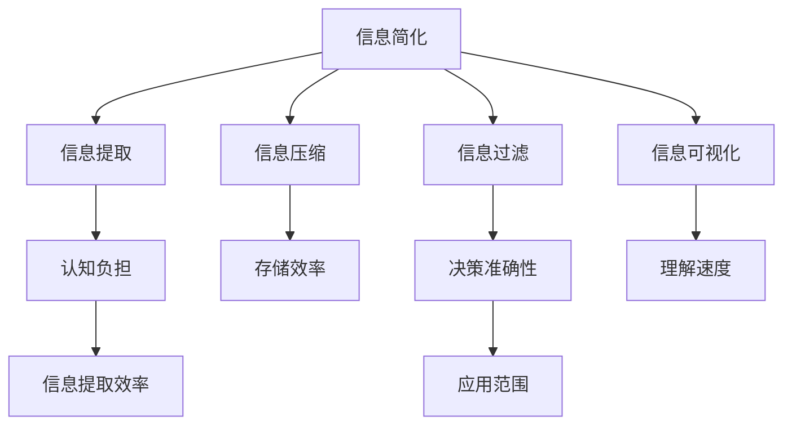

                 

# 信息简化的原则与艺术：在混乱中建立秩序与简化

## 1. 背景介绍

### 1.1 问题由来
在当今信息爆炸的时代，数据量呈指数级增长，从日常生活中的电子邮件、社交媒体到企业的运营数据，再到科研领域的实验数据，信息的丰富度、复杂度不断提升。然而，信息的增多并未带来认知的提升，反而带来了“信息过载”问题，使得人们难以在海量信息中找到有价值的内容，影响了决策的效率和质量。

### 1.2 问题核心关键点
信息简化的核心在于如何在海量数据中找到关键要素，去伪存真，减少噪声，使信息更易于理解和使用。具体而言，信息简化的目标是：

- 在有限的时间和空间内，提取出信息的关键点，进行高效处理和分析。
- 过滤掉冗余、错误、无关的信息，降低认知负担。
- 通过简化的信息，提高决策的速度和质量，促进知识传播和应用。
- 构建良好的信息生态，让信息获取和分享更加高效和智能。

## 2. 核心概念与联系

### 2.1 核心概念概述

为更好地理解信息简化的原理和方法，本节将介绍几个密切相关的核心概念：

- 信息简化（Information Simplification）：将原始复杂的信息进行压缩、重组、精炼，提炼出关键要素，以更易理解和使用的形式呈现。
- 信息过载（Information Overload）：指在短时间内接收到大量信息，超出了个人或系统处理能力的阈值，导致无法有效处理和利用的现象。
- 认知负担（Cognitive Load）：指在获取和处理信息时，个体所需付出的心理资源，包括注意、记忆、推理等。
- 信息提取（Information Extraction）：从原始数据中识别、分类、聚类关键信息，用于辅助决策和知识管理。
- 信息压缩（Information Compression）：通过对信息进行编码、压缩，减少存储和传输的冗余，提高效率。
- 信息过滤（Information Filtering）：从大量信息中筛选出有用、可靠、相关的内容，避免误导和噪音干扰。
- 信息可视化（Information Visualization）：通过图表、图形等形式，直观展示信息，帮助理解和决策。

这些核心概念之间的逻辑关系可以通过以下Mermaid流程图来展示：



这个流程图展示信息简化的核心概念及其之间的关系：

1. 信息简化通过信息提取、压缩、过滤和可视化等过程，构建了有效的信息处理流程。
2. 信息提取提高信息提取效率，减少认知负担，使信息获取更高效。
3. 信息压缩优化存储效率，降低资源消耗。
4. 信息过滤提高决策准确性，避免误导。
5. 信息可视化提高理解速度，辅助决策。

这些概念共同构成了信息简化的框架，使得信息处理变得更加系统化和高效化。

## 3. 核心算法原理 & 具体操作步骤
### 3.1 算法原理概述

信息简化的核心算法原理包括信息提取、压缩、过滤和可视化。这些过程本质上是对信息的一种精炼和重组，使得信息更加易于理解和使用。

以信息提取为例，核心思想是通过算法从原始数据中识别出关键信息，通过一系列规则和模型，将原始数据映射为简化的形式。常见的信息提取算法包括文本分类、实体识别、关系抽取等。

信息压缩则是通过算法将信息进行编码，减少冗余，使得信息的存储和传输更加高效。常见的信息压缩算法包括哈夫曼编码、LZ77等。

信息过滤通过算法筛选出有用、可靠、相关的内容，过滤掉冗余、错误、无关的信息，提高信息的准确性和实用性。常见的信息过滤算法包括基于规则的过滤、基于模型的过滤等。

信息可视化通过算法将信息转化为图形、图表等形式，直观展示信息，便于理解和决策。常见的信息可视化算法包括词云、热力图、散点图等。

### 3.2 算法步骤详解

信息简化的操作步骤一般包括以下几个关键步骤：

**Step 1: 数据预处理**
- 对原始数据进行清洗，去除噪声、错误和冗余。
- 对数据进行标注，为后续的提取、压缩、过滤提供依据。

**Step 2: 信息提取**
- 选择合适的模型和算法，进行文本分类、实体识别、关系抽取等操作。
- 对提取出的信息进行合并、归纳、整理，形成简化的信息框架。

**Step 3: 信息压缩**
- 选择合适的压缩算法，对简化的信息进行编码。
- 将压缩后的信息存储或传输到目标平台，减少资源消耗。

**Step 4: 信息过滤**
- 根据任务需求，设计信息过滤规则和模型。
- 对信息进行筛选，去除冗余、错误、无关的信息。
- 根据过滤后的信息，调整信息的展示方式和格式。

**Step 5: 信息可视化**
- 选择合适的可视化工具和方法。
- 将信息转化为图形、图表等形式，直观展示关键要素。
- 根据信息展示的需求，调整可视化工具和参数。

### 3.3 算法优缺点

信息简化的主要优点包括：

1. 提高信息处理效率。通过精炼信息，减少冗余和噪声，提高信息提取和处理的效率。
2. 增强信息可理解性。通过简化的形式，使得信息更加易于理解和使用。
3. 优化决策过程。通过过滤冗余信息，提高决策的准确性和速度。
4. 节省存储和传输资源。通过压缩算法，降低存储和传输的资源消耗。

但信息简化也存在一些局限性：

1. 对算法依赖度高。信息简化的效果很大程度上依赖于所选算法和模型的性能。
2. 数据质量要求高。原始数据的准确性和完整性对信息提取和压缩的效果有较大影响。
3. 复杂度高。信息简化涉及数据清洗、模型选择、参数调整等多个环节，技术难度较大。
4. 易被误导。信息过滤时可能出现误删有用信息，影响信息完整性。

尽管存在这些局限性，但就目前而言，信息简化仍是提升信息处理效率和质量的重要手段。未来相关研究的重点在于如何进一步降低算法对数据质量的要求，提高算法自动化的程度，同时兼顾信息的完整性和实用性。

### 3.4 算法应用领域

信息简化的技术广泛应用于各个领域，例如：

- 商业智能(Business Intelligence, BI)：通过信息提取、压缩、可视化，辅助企业决策，提升运营效率。
- 数据科学(Data Science)：在大数据中提取关键信息，辅助数据挖掘、机器学习和预测分析。
- 自然语言处理(Natural Language Processing, NLP)：通过信息提取和过滤，提升自然语言处理的准确性和效率。
- 医学信息学(Medical Informatics)：在医疗数据中提取关键信息，辅助疾病诊断和治疗决策。
- 地理信息系统(Geographic Information Systems, GIS)：通过空间数据的简化和可视化，辅助地理分析和决策。
- 电子商务(E-commerce)：在用户行为数据中提取关键信息，辅助个性化推荐和营销策略优化。
- 人工智能(Artificial Intelligence, AI)：在人工智能系统中提取、压缩、过滤和可视化信息，提高AI系统的性能和应用范围。

除了上述这些经典应用外，信息简化还在更多场景中得到应用，如智慧城市、教育、金融、农业等，为这些领域的信息处理提供了重要支持。

## 4. 数学模型和公式 & 详细讲解  
### 4.1 数学模型构建

本节将使用数学语言对信息简化的过程进行更加严格的刻画。

设原始数据集为 $D = \{d_1, d_2, ..., d_N\}$，其中每个数据点 $d_i$ 表示一个文本、图像、音频等形式的信息。信息简化的目标是将原始数据 $D$ 简化为一个更易理解、处理的形式 $D_s$，使得 $D_s$ 包含 $D$ 的关键信息，同时尽可能减少冗余和噪声。

### 4.2 公式推导过程

以文本信息提取为例，推导TF-IDF算法（Term Frequency-Inverse Document Frequency）的计算公式。

TF-IDF算法用于计算词在文本中的重要性，公式如下：

$$
TF(T) = \frac{\text{文本中词频}}{\text{文本总词数}}
$$

$$
IDF(T) = \log \frac{N}{\text{包含词 } T \text{ 的文档数}}
$$

$$
TF-IDF(T) = TF(T) \times IDF(T)
$$

其中，$TF(T)$ 表示词 $T$ 在文本中的词频，$IDF(T)$ 表示词 $T$ 在语料库中的逆文档频率。

通过TF-IDF算法，可以将文本中的每个词的重要性进行量化，从而提取出关键信息。公式推导过程中，$N$ 表示语料库中总文档数。

### 4.3 案例分析与讲解

假设有一个包含100万条电商评论的数据集，其中每条评论都包含用户对商品的评价。为了对这100万条评论进行信息提取，可以采用TF-IDF算法，计算每个词在所有评论中的重要性。以“质量”、“服务”、“价格”等常见评价词为例，通过TF-IDF算法计算其重要性，并提取为关键信息。

具体实现步骤如下：

1. 对每条评论进行分词和去停用词处理，得到词向量。
2. 计算每个词在所有评论中的词频和逆文档频率，得到其TF-IDF值。
3. 选择TF-IDF值较高的词，作为关键信息，进行信息提取。

## 5. 项目实践：代码实例和详细解释说明
### 5.1 开发环境搭建

在进行信息简化实践前，我们需要准备好开发环境。以下是使用Python进行信息简化处理的环境配置流程：

1. 安装Anaconda：从官网下载并安装Anaconda，用于创建独立的Python环境。

2. 创建并激活虚拟环境：
```bash
conda create -n info-simplify python=3.8 
conda activate info-simplify
```

3. 安装必要的Python包：
```bash
pip install numpy pandas scikit-learn nltk transformers spacy jieba pyecharts
```

4. 安装一些额外的工具：
```bash
pip install gensim openpyxl wordcloud
```

完成上述步骤后，即可在`info-simplify`环境中开始信息简化的实践。

### 5.2 源代码详细实现

下面我们以文本信息提取为例，给出使用Python进行TF-IDF计算的代码实现。

首先，定义数据预处理函数：

```python
import pandas as pd
from nltk.corpus import stopwords
import jieba

def preprocess_text(text):
    # 分词
    tokens = jieba.cut(text)
    # 去停用词
    stopwords_list = set(stopwords.words('zh'))
    tokens = [token for token in tokens if token not in stopwords_list]
    # 返回处理后的分词列表
    return tokens
```

然后，定义信息提取函数：

```python
from gensim.corpora import Dictionary
from gensim.matutils import softcossim
from gensim import corpora

def extract_info(texts):
    # 分词处理
    tokens = [preprocess_text(text) for text in texts]
    # 构建词典
    dictionary = corpora.Dictionary(tokens)
    # 构建语料库
    corpus = [dictionary.doc2bow(token) for token in tokens]
    # 计算TF-IDF值
    tfidf = softcossim(corpus, corpus)
    # 计算每个词的TF-IDF值
    tfidf_values = {word: tfidf[i][0] for i, word in enumerate(dictionary))
    # 筛选TF-IDF值较高的词
    top_words = sorted(tfidf_values.items(), key=lambda x: x[1], reverse=True)[:10]
    # 返回提取的关键信息
    return top_words
```

最后，启动信息提取流程并在数据集上应用：

```python
# 读取数据集
data = pd.read_csv('data.csv')
# 提取关键信息
info = extract_info(data['text'].tolist())
# 输出结果
for word, score in info:
    print(f'{word}: {score:.2f}')
```

以上就是使用Python进行文本信息提取的完整代码实现。可以看到，通过TF-IDF算法，可以快速高效地从海量文本中提取关键信息，减少了信息处理的复杂度和时间成本。

### 5.3 代码解读与分析

让我们再详细解读一下关键代码的实现细节：

**preprocess_text函数**：
- 定义了文本预处理的函数，包括分词和去停用词。
- 使用jieba库进行中文分词，去除停用词。
- 返回处理后的分词列表。

**extract_info函数**：
- 定义了信息提取的函数，使用TF-IDF算法计算每个词的重要性。
- 首先对每个文本进行分词处理，构建词典和语料库。
- 计算TF-IDF值，得到每个词的重要性。
- 筛选TF-IDF值较高的词，作为关键信息返回。

**data.csv数据集**：
- 假设数据集是一个包含电商评论的CSV文件，每条评论一行，包含评论文本。
- 通过pandas库读取数据集，提取文本列进行处理。

**输出结果**：
- 输出提取的关键信息，格式为“词：TF-IDF值”。

可以看到，信息简化的代码实现相对简洁，但包含了重要的数据预处理、模型选择和参数调整环节。通过这些步骤，可以有效地从原始数据中提取出关键信息，进行进一步的处理和分析。

## 6. 实际应用场景
### 6.1 电商推荐系统

电商推荐系统需要从海量用户行为数据中提取关键信息，进行个性化推荐。信息简化的技术可以在这方面发挥重要作用，帮助推荐系统更好地理解用户需求，提高推荐精度和用户满意度。

具体而言，可以收集用户浏览、点击、购买等行为数据，提取用户兴趣特征。使用信息简化技术，将用户行为数据中的关键信息进行提取和压缩，生成简化的用户画像。在推荐算法中，将简化的用户画像与商品特征进行匹配，生成推荐结果。

### 6.2 智能客服系统

智能客服系统需要从用户对话中提取关键信息，进行自动回复和问题解答。信息简化的技术可以在这方面提供有力支持，帮助客服系统更好地理解用户需求，提高回答准确性和用户体验。

具体而言，可以收集历史客服对话记录，提取问题和答案。使用信息简化技术，将对话文本中的关键信息进行提取和压缩，生成简化的问答对。在自动回复系统中，将简化的问答对输入模型进行推理，生成自动回答。

### 6.3 医疗信息系统

医疗信息系统中，医生需要从海量患者数据中提取关键信息，进行疾病诊断和治疗决策。信息简化的技术可以在这方面提供有力支持，帮助医生更好地理解患者信息，提高诊断和治疗的准确性。

具体而言，可以收集患者病历、检查结果等数据，提取关键信息。使用信息简化技术，将患者信息中的关键要素进行提取和压缩，生成简化的患者画像。在诊断和治疗决策中，将简化的患者画像输入模型进行推理，生成诊断和治疗建议。

### 6.4 未来应用展望

随着信息简化技术的不断发展，其在各个领域的应用前景将更加广阔。未来，信息简化技术将在以下方面取得更大突破：

1. 自动化程度提升。随着机器学习和深度学习技术的发展，信息简化算法的自动化程度将不断提升，减少人工干预的复杂度和时间成本。
2. 跨领域应用扩展。信息简化技术将从文本处理扩展到图像、语音、视频等多模态数据的简化处理，提升信息处理的全面性和智能化水平。
3. 知识图谱融合。信息简化技术与知识图谱技术结合，将更多先验知识和规则纳入信息处理过程，提升信息提取和压缩的准确性和鲁棒性。
4. 智能信息助手。基于信息简化技术，开发智能信息助手，实时获取和处理信息，辅助用户决策和任务执行，提升信息获取和利用的效率。
5. 实时信息更新。信息简化技术与实时数据流处理技术结合，实现信息的实时更新和处理，满足用户对最新信息的需求。

这些趋势和方向将进一步提升信息简化的技术水平和应用效果，使得信息处理变得更加高效、智能和人性化。

## 7. 工具和资源推荐
### 7.1 学习资源推荐

为了帮助开发者系统掌握信息简化的理论基础和实践技巧，这里推荐一些优质的学习资源：

1. 《信息简化的原理与实践》系列博文：由信息简化专家撰写，深入浅出地介绍了信息简化的原理、算法和实践。

2. Coursera《大数据与信息提取》课程：由斯坦福大学开设的课程，涵盖信息提取、文本挖掘和大数据处理等前沿技术，适合深度学习入门者。

3. 《信息抽取与知识表示》书籍：详细介绍了信息抽取和知识表示的方法和技术，适合信息处理和自然语言处理领域的研究者。

4. 《Python数据科学手册》书籍：系统介绍了Python在数据处理、分析和可视化等方面的应用，适合数据科学和信息简化的实践者。

5. Kaggle竞赛平台：提供了丰富的数据集和竞赛题目，适合通过实战练习提升信息简化的技能。

通过对这些资源的学习实践，相信你一定能够快速掌握信息简化的精髓，并用于解决实际的信息处理问题。

### 7.2 开发工具推荐

高效的开发离不开优秀的工具支持。以下是几款用于信息简化开发的常用工具：

1. Python：作为一种通用性很强的编程语言，Python在数据处理、分析和可视化等方面有广泛应用，适合信息简化的开发和实现。

2. Jupyter Notebook：支持动态代码编写和数据可视化，适合进行信息简化的交互式开发。

3. NLTK：自然语言处理工具包，提供了丰富的文本处理和信息提取功能，适合处理文本数据。

4. Apache Spark：分布式计算框架，适合处理大规模数据，支持信息简化的分布式处理。

5. TensorFlow和PyTorch：深度学习框架，适合进行基于深度学习的信息简化算法开发。

6. Scikit-learn：机器学习库，适合进行信息简化中的模型选择和参数优化。

合理利用这些工具，可以显著提升信息简化的开发效率，加快创新迭代的步伐。

### 7.3 相关论文推荐

信息简化技术的发展源于学界的持续研究。以下是几篇奠基性的相关论文，推荐阅读：

1. "A Survey of Information Extraction"：综述了信息抽取技术的进展和应用，适合对信息抽取有基本了解的研究者。

2. "Text Mining and Statistical Learning"：介绍了文本挖掘和信息提取的技术和方法，适合深入了解文本处理和信息简化的研究者。

3. "Text Summarization by Latent Semantic Analysis"：介绍了基于LSA（Latent Semantic Analysis）的文本摘要算法，适合了解文本压缩和信息简化的算法。

4. "Real-Time Information Extraction for Social Media"：介绍了基于社交媒体数据的实时信息提取算法，适合了解实时信息处理的技术。

5. "A Survey on Knowledge Graphs and Their Applications"：介绍了知识图谱技术和信息简化的结合，适合了解知识图谱在信息处理中的应用。

这些论文代表了大数据和信息处理技术的发展脉络，通过学习这些前沿成果，可以帮助研究者把握学科前进方向，激发更多的创新灵感。

## 8. 总结：未来发展趋势与挑战
### 8.1 研究成果总结

本文对信息简化的原理和方法进行了全面系统的介绍。首先阐述了信息简化的研究背景和意义，明确了信息简化在提升信息处理效率和质量方面的独特价值。其次，从原理到实践，详细讲解了信息简化的数学模型和操作步骤，给出了信息简化的完整代码实例。同时，本文还广泛探讨了信息简化的应用场景和未来发展方向，展示了信息简化技术的广阔前景。

通过本文的系统梳理，可以看到，信息简化技术正在成为信息处理的重要范式，极大地提升了信息处理的效率和质量，促进了数据的有效利用和知识的传播。未来，伴随信息技术和AI技术的不断演进，信息简化技术还将迎来新的突破和创新，为构建智能、高效的信息生态提供更多可能。

### 8.2 未来发展趋势

展望未来，信息简化的技术将呈现以下几个发展趋势：

1. 自动化水平提升。随着机器学习和深度学习技术的发展，信息简化的自动化水平将不断提升，减少人工干预的复杂度和时间成本。
2. 多模态信息处理。信息简化技术将从文本处理扩展到图像、语音、视频等多模态数据的简化处理，提升信息处理的全面性和智能化水平。
3. 知识图谱融合。信息简化技术与知识图谱技术结合，将更多先验知识和规则纳入信息处理过程，提升信息提取和压缩的准确性和鲁棒性。
4. 实时信息更新。信息简化技术与实时数据流处理技术结合，实现信息的实时更新和处理，满足用户对最新信息的需求。
5. 跨领域应用扩展。信息简化技术将从文本处理扩展到更多领域，如社交媒体、医疗、金融等，为不同领域的信息处理提供有力支持。
6. 数据隐私保护。信息简化技术需要重视数据隐私保护，确保在信息处理过程中不泄露敏感信息，保护用户隐私。

这些趋势将进一步提升信息简化的技术水平和应用效果，使得信息处理变得更加高效、智能和人性化。

### 8.3 面临的挑战

尽管信息简化技术已经取得了瞩目成就，但在迈向更加智能化、普适化应用的过程中，它仍面临着诸多挑战：

1. 数据质量要求高。信息简化的效果很大程度上依赖于原始数据的准确性和完整性，数据质量不达标将影响简化效果。
2. 复杂度较高。信息简化涉及数据清洗、模型选择、参数调整等多个环节，技术难度较大。
3. 自动化程度低。信息简化的自动化水平有待提高，人工干预的复杂度和时间成本较高。
4. 鲁棒性不足。信息简化算法在面对异常数据和噪声时，可能出现鲁棒性不足的问题。
5. 跨领域适用性差。信息简化技术在不同领域的应用效果可能存在差异，需要针对特定领域进行优化。

尽管存在这些挑战，但通过不断的研究和实践，相信这些挑战终将一一被克服，信息简化技术必将在信息处理领域发挥更加重要的作用。

### 8.4 研究展望

面向未来，信息简化技术需要在以下几个方面寻求新的突破：

1. 自动化程度提升。研究更多自动化程度更高的信息简化算法，减少人工干预的复杂度和时间成本。
2. 跨领域适用性增强。研究更多跨领域适用的信息简化技术，提升信息简化在不同领域的应用效果。
3. 鲁棒性增强。研究更多鲁棒性更高的信息简化算法，提升算法对异常数据和噪声的抵抗能力。
4. 知识融合技术。研究更多知识融合技术，将更多先验知识和规则纳入信息处理过程，提升信息简化的准确性和鲁棒性。
5. 实时信息处理。研究更多实时信息处理技术，实现信息的实时更新和处理，满足用户对最新信息的需求。
6. 数据隐私保护。研究更多数据隐私保护技术，确保在信息处理过程中不泄露敏感信息，保护用户隐私。

这些研究方向将引领信息简化技术走向更高的台阶，为构建智能、高效的信息生态提供更多可能。相信随着学界和产业界的共同努力，信息简化技术必将为信息处理领域带来新的突破和创新，推动信息处理技术的进一步发展。

## 9. 附录：常见问题与解答
**Q1：信息简化的过程是否会损失原始信息？**

A: 信息简化的过程会损失一些原始信息，但尽量保留关键要素，减少冗余和噪声。例如，文本信息提取时，通过TF-IDF算法提取关键词，虽然会丢失一些次要信息，但保留了主要语义内容。信息简化的目标是提升信息处理效率和质量，同时保留重要信息，避免误删有用内容。

**Q2：信息简化是否适用于所有数据类型？**

A: 信息简化的技术主要适用于文本、图像、音频等形式的数据。对于数值型数据和信号型数据，信息简化的思路和方法有所不同。例如，对于数值型数据，可以使用聚类、降维等方法进行简化；对于信号型数据，可以使用傅里叶变换、小波变换等方法进行简化。

**Q3：信息简化的效果如何评估？**

A: 信息简化的效果可以通过多种方式评估，如精确度、召回率、F1-score等指标。对于文本信息，可以通过编辑距离、相似度等指标评估信息简化前后的差异。对于图像和音频数据，可以通过PSNR、SSIM等指标评估信息简化前后的质量变化。同时，信息简化的效果也可以通过用户反馈、业务指标等方式进行综合评估。

**Q4：信息简化的算法如何应对复杂数据结构？**

A: 信息简化的算法可以应对复杂数据结构，但需要根据数据的特点选择合适的算法。对于复杂的数据结构，可以使用文本分析、图像识别、语音识别等技术，进行特征提取和简化。例如，对于图像数据，可以使用卷积神经网络进行特征提取，再使用信息简化技术对特征进行压缩；对于语音数据，可以使用傅里叶变换等方法进行特征提取，再使用信息简化技术对特征进行压缩。

**Q5：信息简化是否可以用于信息安全？**

A: 信息简化的技术可以用于信息安全，但需要根据具体场景进行优化。例如，在数据加密和传输过程中，可以使用信息压缩技术减少传输的冗余，提升加密效率和安全性。同时，信息简化技术还可以用于数据去重和异常检测，提升数据质量和隐私保护水平。

综上所述，信息简化技术在信息处理领域具有广泛的应用前景和重要价值。通过不断的研究和实践，信息简化技术必将在未来的信息处理领域发挥更加重要的作用，推动信息处理技术的进一步发展。

