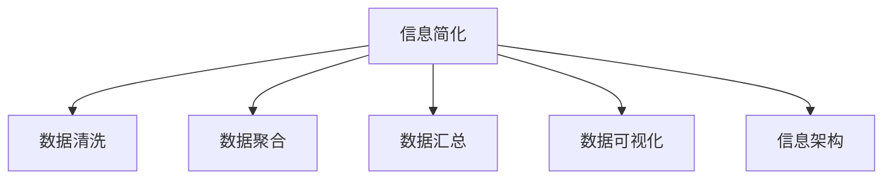

                 

# 信息简化的原则：在混乱和复杂中建立秩序和简化

> 关键词：信息简化, 数据管理, 复杂系统, 信息架构, 数据可视化

## 1. 背景介绍

在当今信息爆炸的时代，如何从庞大的数据海洋中提取有用信息，并简化成易于理解和操作的格式，成为了企业和组织的首要任务。复杂系统（如企业管理系统、科学研究数据、医疗健康记录等）产生了大量数据，这些数据往往以复杂的方式存储和表示。尽管现代计算机可以高效处理大量数据，但信息量的增加却带来了新的挑战。

### 1.1 问题由来

随着数据量的不断增长，信息处理变得更加困难。现代企业希望通过数据分析驱动决策，但数据庞杂、冗余且不一致，影响了信息的准确性和可靠性。数据过载使得信息收集和处理成本急剧上升，并降低了工作效率。在医疗健康领域，医生的工作量因信息量大增而倍感压力，导致诊断效率下降。

为了解决这些问题，信息简化的需求日益迫切。信息的简化不仅需要减少数据量，还需要提高信息的相关性和可操作性。信息简化可以降低复杂性，提高决策效率，进而推动企业创新和竞争力提升。

### 1.2 问题核心关键点

信息简化的核心在于提取有价值的信息，并基于组织需求，将其组织成易于理解和使用的形式。这包括数据清洗、数据聚合、数据汇总和数据可视化等关键步骤。理想的信息简化不仅需要技术的支持，还需要组织管理和用户理解相结合，形成一套科学、高效的信息管理方法。

## 2. 核心概念与联系

### 2.1 核心概念概述

为更好地理解信息简化的过程，本节将介绍几个密切相关的核心概念：

- **信息简化（Information Simplification）**：通过技术手段，将复杂数据集转化为易于理解、操作的格式。
- **数据清洗（Data Cleaning）**：去除数据集中的噪音和错误，确保数据质量。
- **数据聚合（Data Aggregation）**：将多源数据合并成统一的格式，便于分析。
- **数据汇总（Data Summarization）**：对数据进行提炼和归纳，提取出关键信息。
- **数据可视化（Data Visualization）**：以图形形式表示数据，直观展示数据特征和关系。
- **信息架构（Information Architecture）**：定义信息的组织方式，确保信息在用户界面上的逻辑性和一致性。

这些核心概念之间的关系可以通过以下Mermaid流程图来展示：



这个流程图展示了几项关键的信息简化步骤，以及它们之间的关系。

## 3. 核心算法原理 & 具体操作步骤

### 3.1 算法原理概述

信息简化的核心原理是通过预处理和分析，提取出关键信息并组织成易于理解的形式。信息简化的目标是将复杂数据集转化为用户能够快速理解和操作的形式，从而提高决策效率和用户满意度。

信息简化的过程通常包括以下几个关键步骤：

1. 数据清洗：去除数据集中的噪音和错误，确保数据质量。
2. 数据聚合：将多源数据合并成统一的格式，便于分析。
3. 数据汇总：对数据进行提炼和归纳，提取出关键信息。
4. 数据可视化：以图形形式表示数据，直观展示数据特征和关系。
5. 信息架构：定义信息的组织方式，确保信息在用户界面上的逻辑性和一致性。

这些步骤可以通过一系列算法和技术实现，以高效、准确的方式进行信息处理。

### 3.2 算法步骤详解

#### 3.2.1 数据清洗

数据清洗是信息简化的第一步，其目的是去除数据集中的噪音和错误，确保数据质量。数据清洗通常包括以下步骤：

1. **缺失值处理**：填补缺失值或删除缺失值较多的记录。
2. **异常值检测**：识别并处理异常值，避免其对分析结果产生负面影响。
3. **重复记录去除**：删除重复记录，确保数据的唯一性。

#### 3.2.2 数据聚合

数据聚合是将多源数据合并成统一的格式，便于分析。数据聚合通常包括以下步骤：

1. **数据标准化**：将不同格式的数据转换为统一的格式。
2. **数据合并**：将来自不同来源的数据合并，形成一个统一的数据集。
3. **数据融合**：对合并后的数据进行整合，确保数据的一致性和完整性。

#### 3.2.3 数据汇总

数据汇总是对数据进行提炼和归纳，提取出关键信息。数据汇总通常包括以下步骤：

1. **聚合计算**：对数据进行聚合计算，如求和、平均值、最大值等。
2. **分组汇总**：根据不同维度对数据进行分组，提取每组的汇总信息。
3. **统计分析**：进行统计分析，提取关键指标和趋势。

#### 3.2.4 数据可视化

数据可视化以图形形式表示数据，直观展示数据特征和关系。数据可视化通常包括以下步骤：

1. **选择合适的可视化形式**：根据数据类型和分析目的，选择适当的可视化形式，如柱状图、折线图、散点图等。
2. **数据映射**：将数据映射到图形中，确保图形的准确性和美观性。
3. **交互式展示**：通过交互式界面，允许用户探索和操作数据。

#### 3.2.5 信息架构

信息架构定义信息的组织方式，确保信息在用户界面上的逻辑性和一致性。信息架构通常包括以下步骤：

1. **信息分类**：根据不同维度和用户需求，对信息进行分类和组织。
2. **信息导航**：设计导航结构，帮助用户快速定位信息。
3. **界面设计**：设计简洁、直观的用户界面，确保信息展示的清晰性和一致性。

### 3.3 算法优缺点

信息简化的算法具有以下优点：

1. **效率高**：通过自动化处理和分析，可以大大提高信息简化的效率。
2. **准确性高**：数据清洗、聚合和汇总等步骤可以确保信息准确性。
3. **可扩展性强**：信息简化技术可以应用于不同领域和规模的数据集。

同时，信息简化的算法也存在一定的局限性：

1. **依赖数据质量**：信息简化的效果很大程度上取决于数据质量，如果数据存在大量噪音和错误，简化效果可能不理想。
2. **难以处理复杂关系**：一些复杂的关系可能难以通过简化算法完全捕捉。
3. **需要专业知识**：信息简化涉及大量数据处理和分析，需要专业的知识和技能。

### 3.4 算法应用领域

信息简化的算法在多个领域得到广泛应用，例如：

- **金融分析**：通过清洗、聚合和汇总金融数据，提取关键指标和趋势，帮助决策。
- **医疗健康**：清洗和汇总医疗记录，提取患者健康信息，支持医生诊断和治疗。
- **企业管理**：清洗、聚合和汇总企业数据，提取关键业务指标，支持企业决策。
- **科学研究**：清洗和汇总科研数据，提取关键研究成果，支持科学发现和创新。
- **公共政策**：清洗和汇总公共数据，提取关键政策效果指标，支持政策评估和优化。

## 4. 数学模型和公式 & 详细讲解 & 举例说明

### 4.1 数学模型构建

信息简化的数学模型通常包括以下几个关键组成部分：

1. **数据表示**：将数据集表示为向量或矩阵形式。
2. **数据清洗模型**：定义清洗算法，去除噪音和错误。
3. **数据聚合模型**：定义聚合算法，合并多源数据。
4. **数据汇总模型**：定义汇总算法，提取关键信息。
5. **数据可视化模型**：定义可视化算法，展示数据特征和关系。
6. **信息架构模型**：定义信息组织方式，确保界面逻辑性和一致性。

### 4.2 公式推导过程

#### 4.2.1 数据清洗模型

数据清洗模型的核心是去除噪音和错误。常用的方法包括：

1. **缺失值处理**：
   $$
   处理缺失值 = \begin{cases}
   缺失值 & \text{缺失值比例小于10\%} \\
   平均值 & \text{缺失值比例大于10\%}
   \end{cases}
   $$

2. **异常值检测**：
   $$
   检测异常值 = \text{Z-score} > 3
   $$

#### 4.2.2 数据聚合模型

数据聚合模型的核心是将多源数据合并成统一的格式。常用的方法包括：

1. **数据标准化**：
   $$
   标准化 = \frac{x - \mu}{\sigma}
   $$

2. **数据合并**：
   $$
   合并 = \text{Merge}(表1, 表2)
   $$

#### 4.2.3 数据汇总模型

数据汇总模型的核心是对数据进行提炼和归纳，提取出关键信息。常用的方法包括：

1. **聚合计算**：
   $$
   求和 = \sum_{i=1}^n x_i
   $$

2. **分组汇总**：
   $$
   分组汇总 = \text{GROUP BY} \text{特征}
   $$

#### 4.2.4 数据可视化模型

数据可视化模型的核心是将数据以图形形式表示。常用的方法包括：

1. **柱状图**：
   $$
   柱状图 = \{(x_i, y_i)\}_{i=1}^n
   $$

2. **折线图**：
   $$
   折线图 = \{(x_i, y_i)\}_{i=1}^n
   $$

#### 4.2.5 信息架构模型

信息架构模型的核心是定义信息的组织方式。常用的方法包括：

1. **信息分类**：
   $$
   分类 = \text{分类器}(\text{数据})
   $$

2. **信息导航**：
   $$
   导航 = \text{导航图}
   $$

## 5. 项目实践：代码实例和详细解释说明

### 5.1 开发环境搭建

在进行信息简化的项目实践前，我们需要准备好开发环境。以下是使用Python进行Pandas开发的环境配置流程：

1. 安装Anaconda：从官网下载并安装Anaconda，用于创建独立的Python环境。

2. 创建并激活虚拟环境：
```bash
conda create -n pandas-env python=3.8 
conda activate pandas-env
```

3. 安装Pandas：
```bash
conda install pandas
```

4. 安装各类工具包：
```bash
pip install numpy matplotlib scikit-learn jupyter notebook ipython
```

完成上述步骤后，即可在`pandas-env`环境中开始信息简化的项目实践。

### 5.2 源代码详细实现

我们以下金融数据分析为例，给出使用Pandas进行数据清洗、聚合和汇总的PyTorch代码实现。

首先，定义金融数据处理函数：

```python
import pandas as pd
import numpy as np

def clean_data(df):
    # 处理缺失值
    df = df.dropna(thresh=len(df) * 0.1)
    # 检测异常值
    df = df[(np.abs(df - df.mean()) < 3 * df.std()).all(axis=1)]
    return df

def aggregate_data(df):
    # 标准化数据
    df = (df - df.mean()) / df.std()
    # 数据合并
    return pd.merge(df, other_data, on='key')

def summarize_data(df):
    # 聚合计算
    return df.groupby('feature').mean()

# 加载数据
data = pd.read_csv('financial_data.csv')
```

然后，定义清洗、聚合和汇总函数：

```python
cleaned_data = clean_data(data)
aggregated_data = aggregate_data(cleaned_data)
summarized_data = summarize_data(aggregated_data)
```

最后，展示数据可视化与信息架构：

```python
import matplotlib.pyplot as plt

# 柱状图
plt.bar(summarized_data.index, summarized_data['value'], color='blue')
plt.xlabel('Feature')
plt.ylabel('Value')
plt.title('Data Summary')
plt.show()

# 信息架构
def create_info_arch(df):
    # 信息分类
    df['category'] = df['feature'].map({'value1': 'A', 'value2': 'B'})
    # 信息导航
    return df

info_arch_data = create_info_arch(summarized_data)
info_arch_data
```

以上就是使用Pandas进行数据清洗、聚合和汇总的完整代码实现。可以看到，Pandas提供了强大的数据处理功能，使得信息简化的过程变得简洁高效。

### 5.3 代码解读与分析

让我们再详细解读一下关键代码的实现细节：

**clean_data函数**：
- `dropna`方法：删除缺失值比例大于10%的行。
- `abs(df - df.mean())`：计算数据与均值之间的绝对差。
- `3 * df.std()`：设置异常值的阈值为均值加减三倍标准差。

**aggregate_data函数**：
- `merge`方法：按照指定键将两个数据集合并。
- `key`参数：指定合并键。

**summarize_data函数**：
- `groupby`方法：按照指定特征分组。
- `mean`方法：计算每组的均值。

**create_info_arch函数**：
- `map`方法：将特征映射到分类。
- `category`列：定义分类信息。

**柱状图**：
- `bar`方法：绘制柱状图。
- `index`参数：指定x轴。
- `value`参数：指定y轴。

**信息架构**：
- `info_arch_data`：定义信息架构数据。

可以看到，Pandas提供了丰富的数据处理函数，使得数据清洗、聚合和汇总等过程变得简单直观。通过合理利用这些函数，可以高效地实现信息简化的各个步骤。

## 6. 实际应用场景

### 6.1 金融分析

在金融分析中，信息简化可以用于清洗和汇总各种金融数据，提取关键指标和趋势，支持决策分析。通过清洗异常值和缺失值，去除噪音，金融分析师可以更准确地分析市场数据，优化投资策略。

在实际操作中，可以收集来自不同来源的金融数据，如股票价格、交易量、公司财报等，进行清洗、聚合和汇总，提取市场波动、投资回报等关键指标，支持投资决策和风险管理。

### 6.2 医疗健康

在医疗健康领域，信息简化可以帮助医生更快速地访问和分析患者数据，支持诊断和治疗。通过清洗和汇总电子健康记录(EHR)数据，提取关键健康信息，医生可以更准确地了解患者的病情，制定个性化治疗方案。

具体而言，可以清洗和汇总患者的医疗记录，提取关键健康指标，如血压、血糖、心率等，支持医生的诊断和治疗决策。同时，通过数据可视化，医生可以直观地了解患者的健康趋势和变化，及时调整治疗方案。

### 6.3 企业管理

在企业管理中，信息简化可以用于清洗和汇总各种企业数据，提取关键业务指标，支持决策分析。通过清洗异常值和缺失值，去除噪音，企业管理者可以更准确地分析企业运营数据，优化管理策略。

具体而言，可以收集来自不同部门的数据，如销售记录、财务报表、员工绩效等，进行清洗、聚合和汇总，提取关键业务指标，如销售增长率、利润率、员工满意度等，支持企业管理者的决策和战略规划。

### 6.4 科学研究

在科学研究中，信息简化可以帮助科研人员清洗和汇总各种科研数据，提取关键研究成果，支持科学发现和创新。通过清洗异常值和缺失值，去除噪音，科研人员可以更准确地分析实验数据，发现科学规律。

具体而言，可以清洗和汇总各种实验数据，提取关键研究成果，如实验结果、误差分析等，支持科研人员的科学发现和创新。同时，通过数据可视化，科研人员可以直观地了解实验结果和趋势，及时调整研究方向和实验方案。

## 7. 工具和资源推荐

### 7.1 学习资源推荐

为了帮助开发者系统掌握信息简化的理论和实践，这里推荐一些优质的学习资源：

1. 《Python数据分析实战》系列博文：由Pandas库的开发者撰写，深入浅出地介绍了Pandas库的各种函数和用法。

2. Coursera《数据科学导论》课程：由斯坦福大学开设的入门级课程，涵盖数据分析的基本概念和Pandas库的使用。

3. 《Pandas数据处理实战》书籍：详细介绍了Pandas库的数据处理功能和应用场景。

4. Kaggle官方数据集：Kaggle平台提供了丰富的数据集，涵盖金融、医疗、企业等多个领域，可辅助学习信息简化的实践。

5. Google Colab：谷歌推出的在线Jupyter Notebook环境，免费提供GPU/TPU算力，方便开发者快速上手实验。

通过对这些资源的学习实践，相信你一定能够快速掌握信息简化的精髓，并用于解决实际的业务问题。

### 7.2 开发工具推荐

高效的开发离不开优秀的工具支持。以下是几款用于信息简化开发的常用工具：

1. Pandas：基于Python的数据分析库，提供强大的数据清洗、聚合和汇总功能。

2. NumPy：基于Python的科学计算库，提供高效的数值计算和矩阵操作。

3. Matplotlib：基于Python的数据可视化库，提供丰富的图形展示功能。

4. Jupyter Notebook：基于Python的交互式编程环境，支持代码块、数据展示和动态交互。

5. Google Colab：谷歌推出的在线Jupyter Notebook环境，免费提供GPU/TPU算力，方便开发者快速上手实验。

6. VS Code：基于Visual Studio的代码编辑器，支持多种编程语言和IDE插件。

合理利用这些工具，可以显著提升信息简化的开发效率，加快创新迭代的步伐。

### 7.3 相关论文推荐

信息简化的发展源于学界的持续研究。以下是几篇奠基性的相关论文，推荐阅读：

1. "Data Cleaning Techniques for Data Mining"（数据清洗技术）：介绍了数据清洗的基本方法，如缺失值处理、异常值检测等。

2. "Data Aggregation and Integration"（数据聚合与集成）：探讨了数据聚合和集成的方法，如数据标准化、数据合并等。

3. "Data Summarization Techniques"（数据汇总技术）：介绍了数据汇总的基本方法，如聚合计算、分组汇总等。

4. "Data Visualization in Scientific Computing"（数据可视化在科学计算中的应用）：介绍了数据可视化的基本方法，如柱状图、折线图等。

5. "Information Architecture for Organizations"（组织的信息架构设计）：探讨了信息架构的设计方法，如信息分类、信息导航等。

这些论文代表了大数据处理和信息简化的发展脉络。通过学习这些前沿成果，可以帮助研究者把握学科前进方向，激发更多的创新灵感。

## 8. 总结：未来发展趋势与挑战

### 8.1 总结

本文对信息简化的理论和实践进行了全面系统的介绍。首先阐述了信息简化的背景和意义，明确了信息简化的重要性。其次，从原理到实践，详细讲解了信息简化的数学模型和操作步骤，给出了信息简化的完整代码实例。同时，本文还广泛探讨了信息简化的应用场景，展示了信息简化的巨大潜力。此外，本文精选了信息简化的各类学习资源，力求为读者提供全方位的技术指引。

通过本文的系统梳理，可以看到，信息简化技术在数据处理、信息管理、决策支持等方面具有重要应用。信息简化的目标是高效、准确地提取关键信息，并组织成易于理解和操作的格式，从而提高决策效率和用户满意度。信息简化不仅需要技术的支持，还需要组织管理和用户理解相结合，形成一套科学、高效的信息管理方法。

### 8.2 未来发展趋势

展望未来，信息简化的技术将呈现以下几个发展趋势：

1. **自动化和智能化**：随着AI技术的进步，信息简化的过程将变得更加自动化和智能化，减少人工干预，提高处理效率。

2. **跨领域应用**：信息简化技术将广泛应用于更多领域，如医疗、金融、政府等，帮助不同领域的企业和组织提高信息处理能力。

3. **大数据处理**：随着数据量的不断增长，信息简化的技术将进一步发展，以高效处理海量数据。

4. **多模态信息处理**：未来的信息简化技术将融合多种数据类型，如文本、图像、语音等，形成多模态信息处理能力。

5. **实时处理**：未来的信息简化技术将实现实时处理，快速响应各种事件和变化。

6. **智能化决策支持**：信息简化的目标不仅是提取关键信息，还要支持智能化决策，提高决策效率和准确性。

以上趋势凸显了信息简化的广阔前景。这些方向的探索发展，将进一步推动信息处理技术的进步，为各行各业带来更高效、更智能的信息管理能力。

### 8.3 面临的挑战

尽管信息简化技术已经取得了不少成就，但在迈向更加智能化、普适化应用的过程中，仍面临以下挑战：

1. **数据质量和一致性**：数据质量问题和数据一致性问题是信息简化的重要挑战。不完整、不一致的数据将影响信息简化的效果。

2. **处理复杂关系**：一些复杂的关系可能难以通过简化算法完全捕捉，需要结合专业知识进行人工处理。

3. **跨领域适配性**：信息简化技术在不同领域的应用需要灵活调整和适配，以适应不同领域的特点。

4. **自动化程度**：信息简化的自动化程度需要进一步提高，减少人工干预，提高处理效率。

5. **多模态数据融合**：多模态数据的融合是信息简化的一个重要方向，但现有技术在处理多模态数据方面还存在瓶颈。

6. **实时性问题**：信息简化技术需要支持实时处理，快速响应各种事件和变化。

7. **安全性和隐私保护**：信息简化过程中需要保护数据安全和用户隐私，避免数据泄露和滥用。

### 8.4 研究展望

面对信息简化面临的这些挑战，未来的研究需要在以下几个方面寻求新的突破：

1. **自动化和智能化算法**：开发更加自动化和智能化的信息简化算法，减少人工干预，提高处理效率。

2. **跨领域适配性研究**：研究和开发跨领域适配的信息简化技术，满足不同领域的需求。

3. **多模态数据融合技术**：开发多模态数据融合技术，实现不同类型数据的整合和处理。

4. **实时处理技术**：研究和开发实时处理技术，支持信息简化的实时应用。

5. **安全性研究**：研究和开发数据安全和隐私保护技术，确保信息简化过程的安全性。

这些研究方向将推动信息简化技术向更深层次、更广领域发展，为各行各业带来更加高效、智能的信息管理能力。总之，信息简化技术的进步将为数据驱动决策提供有力支持，推动各行各业的数字化转型和智能化升级。

## 9. 附录：常见问题与解答

**Q1：信息简化是否适用于所有数据集？**

A: 信息简化的效果很大程度上取决于数据集的质量和结构。对于结构化数据集，如表格数据，信息简化可以高效地提取关键信息。但对于非结构化数据集，如文本和图像，信息简化的效果可能受到一定的限制。因此，在实际应用中，需要根据数据集的特点和需求，选择合适的简化方法。

**Q2：信息简化过程中如何处理异常值？**

A: 异常值处理是信息简化的重要步骤。常用的方法包括：

1. **删除异常值**：删除异常值记录，以确保数据一致性。
2. **替换异常值**：用均值、中位数等替代异常值。
3. **标识异常值**：标记异常值，但不删除，以保留数据信息。

需要根据具体情况选择合适的方法。

**Q3：信息简化过程中如何保证数据质量？**

A: 数据质量是信息简化的核心问题之一。保证数据质量的方法包括：

1. **数据清洗**：去除噪音和错误，确保数据一致性。
2. **数据标准化**：统一数据格式，避免数据不一致。
3. **数据验证**：使用多种验证方法，确保数据准确性。

合理的数据清洗和标准化可以有效地提高数据质量，从而提升信息简化的效果。

**Q4：信息简化过程中如何处理缺失值？**

A: 缺失值处理是信息简化的重要步骤。常用的方法包括：

1. **删除缺失值**：删除缺失值记录，以确保数据完整性。
2. **填补缺失值**：用均值、中位数等填补缺失值。
3. **插值法**：使用插值法填补缺失值。

需要根据具体情况选择合适的方法。

**Q5：信息简化过程中如何保证数据一致性？**

A: 数据一致性是信息简化的重要目标之一。保证数据一致性的方法包括：

1. **数据标准化**：统一数据格式，避免数据不一致。
2. **数据校验**：使用多种校验方法，确保数据一致性。
3. **数据比对**：通过数据比对，确保数据一致性。

合理的数据标准化和校验可以有效地提高数据一致性，从而提升信息简化的效果。

---

作者：禅与计算机程序设计艺术 / Zen and the Art of Computer Programming

