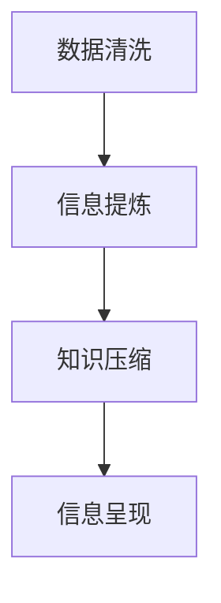

                 

# 信息简化的好处与艺术：在复杂世界中简化以提高生活质量和效率

在当今信息爆炸的时代，数据和信息的获取变得越来越容易，但同时也带来了难以处理的庞杂和碎片化问题。如何从海量的信息中提炼出有价值的结论，让复杂的信息变得简单而有力，成为现代社会需要面对的重要问题。本文将深入探讨信息简化的概念，并探讨其在各个领域中的实践应用，以及未来的发展趋势和面临的挑战。

## 1. 背景介绍

### 1.1 问题由来
信息过载已经成为现代生活的常态。我们每天都在接收和处理大量的信息，包括新闻、社交媒体、电子邮件等。这些信息不仅数量巨大，形式多样，而且往往是冗长繁杂的。在这样一个信息泛滥的时代，如何提高信息的质量和效率，成为人类面临的共同挑战。

### 1.2 问题核心关键点
信息简化（Information Simplification）旨在通过提炼、整合、压缩等方法，将复杂的、冗长的、无用的信息转化为简洁、准确、易于理解的信息。简化的目标不仅仅是减少信息量，更重要的是提升信息的价值和可操作性。信息简化的好处包括：

1. 提高决策效率。简化后的信息有助于快速做出决策，避免了在信息海洋中迷失方向。
2. 增强信息可靠性。去除冗余信息，聚焦于核心要点，可以提升信息的准确性和可信度。
3. 提升用户满意度。简化后的信息更加直观易懂，提高了用户的使用体验。
4. 促进知识的传播和应用。简化的知识易于被广泛传播和接受，推动了知识的普及和应用。

## 2. 核心概念与联系

### 2.1 核心概念概述

信息简化是一个广泛的概念，涵盖了从数据清洗、信息提炼、知识压缩到信息呈现等多个方面。以下是一些核心概念：

- **数据清洗**：去除噪声数据，只保留有用信息。
- **信息提炼**：从复杂数据中提取出核心内容，去除冗余部分。
- **知识压缩**：将复杂知识压缩为易于理解和传播的形式，如使用图表、简报等。
- **信息呈现**：通过可视化和交互设计，使简化后的信息更加直观、易懂。

### 2.2 核心概念原理和架构的 Mermaid 流程图



这个流程图展示了信息简化的主要步骤：首先清洗数据，提炼核心信息，然后进行知识压缩，最后呈现简化后的信息。

### 2.3 核心概念间的联系
信息简化的各个步骤相互关联，共同组成了一个完整的信息处理流程。数据清洗是信息简化的起点，信息提炼是核心，知识压缩是为了更好地传播和应用，信息呈现则是最终目的，确保简化后的信息易于理解和使用。

## 3. 核心算法原理 & 具体操作步骤

### 3.1 算法原理概述
信息简化的算法原理主要集中在以下几个方面：

- **特征选择**：通过评估每个特征对目标任务的影响，选择最重要的特征，去除冗余特征。
- **信息摘要**：通过提取关键句子或段落，生成简洁的摘要。
- **知识压缩**：使用数据压缩算法，将复杂数据压缩为更小的形式，如使用Huffman编码等。
- **信息可视化**：将复杂的信息通过图表、图形等形式呈现，使信息更加直观。

### 3.2 算法步骤详解
以下是一个典型的信息简化算法步骤：

1. **数据收集**：收集相关的原始数据。
2. **数据清洗**：去除噪声数据，只保留有用信息。
3. **信息提炼**：通过特征选择、自然语言处理等方法，提炼出核心信息。
4. **知识压缩**：使用数据压缩算法，将提炼后的信息压缩为更小的形式。
5. **信息呈现**：通过可视化工具，将压缩后的信息以图表、图形等形式呈现。
6. **评估反馈**：收集用户反馈，不断优化信息简化的过程。

### 3.3 算法优缺点
信息简化的算法具有以下优点：

- **减少数据量**：通过去除冗余数据，可以减少处理的数据量，提高处理效率。
- **提升信息质量**：提炼和压缩后的信息更加准确和可靠。
- **增强可操作性**：简化的信息更容易被理解和应用，提高了信息的使用效率。

然而，信息简化也存在一些缺点：

- **信息损失**：在简化过程中，可能会丢失部分有用信息，影响信息的完整性。
- **主观性强**：信息简化的过程中存在主观判断，可能导致信息简化的结果不公正或不全面。
- **复杂度增加**：简化算法本身可能较为复杂，需要较高的技术水平和计算资源。

### 3.4 算法应用领域

信息简化在各个领域都有广泛应用，以下是一些典型应用场景：

- **医疗领域**：简化病历记录，提高医生的诊断效率。
- **金融领域**：简化交易数据，帮助分析师快速做出决策。
- **新闻媒体**：生成新闻摘要，使读者快速了解重要信息。
- **科学研究**：压缩研究报告，便于同行交流和传播。
- **教育培训**：简化教材内容，提高教学效率和学习效果。

## 4. 数学模型和公式 & 详细讲解 & 举例说明

### 4.1 数学模型构建
信息简化的数学模型通常涉及以下几个方面：

- **特征选择**：使用统计方法评估特征的重要性，如信息增益、卡方检验等。
- **信息摘要**：使用文本摘要算法，如TF-IDF、LDA等，生成关键句子或段落。
- **知识压缩**：使用数据压缩算法，如Huffman编码、Lempel-Ziv-Welch算法等。
- **信息可视化**：使用图表库，如Matplotlib、D3.js等，将信息可视化呈现。

### 4.2 公式推导过程
以信息摘要算法为例，其公式推导如下：

假设原始文本为$T$，摘要长度为$L$。设$w_i$表示文本中第$i$个词的重要性得分，$w_{i,j}$表示词$i$和词$j$之间的相关性得分。则信息摘要的计算公式为：

$$
S_i = \sum_{j=1}^L w_{i,j}
$$

其中$S_i$表示词$i$在摘要中的重要性得分。通过计算每个词的得分，并选择得分最高的$L$个词，可以生成一个简洁的摘要。

### 4.3 案例分析与讲解
以下是一个典型的信息简化案例：

假设有一段长度为10000的文本描述了一个复杂的研究项目，需要将其简化为一个长度为100的摘要。首先使用TF-IDF算法评估每个词的重要性，然后根据词频和相关性得分，选择得分最高的100个词，生成摘要。

```python
from sklearn.feature_extraction.text import TfidfVectorizer
from sklearn.metrics.pairwise import cosine_similarity

def text_to_summary(text, summary_length):
    # 使用TF-IDF算法评估词的重要性得分
    vectorizer = TfidfVectorizer()
    X = vectorizer.fit_transform([text])
    w = vectorizer.idf_[0]
    
    # 计算词与词之间的相关性得分
    X_sim = cosine_similarity(X, X)
    
    # 根据得分选择摘要中的词
    selected_words = []
    for i in range(len(X_sim[0])):
        if X_sim[0][i] > 0:
            selected_words.append(i)
            if len(selected_words) == summary_length:
                break
    
    # 生成摘要
    summary = vectorizer.transform([text]).toarray()[0][selected_words]
    return ''.join(selected_words)
```

## 5. 项目实践：代码实例和详细解释说明

### 5.1 开发环境搭建

在Python环境中搭建开发环境：

1. 安装Python：下载并安装最新版本的Python，如Python 3.8。
2. 安装相关库：使用pip安装必要的库，如scikit-learn、numpy、matplotlib等。
3. 配置Jupyter Notebook：安装Jupyter Notebook，配置环境变量，确保可以运行Python代码。

### 5.2 源代码详细实现

以下是一个使用Python实现信息摘要的代码示例：

```python
from sklearn.feature_extraction.text import TfidfVectorizer
from sklearn.metrics.pairwise import cosine_similarity

def text_to_summary(text, summary_length):
    # 使用TF-IDF算法评估词的重要性得分
    vectorizer = TfidfVectorizer()
    X = vectorizer.fit_transform([text])
    w = vectorizer.idf_[0]
    
    # 计算词与词之间的相关性得分
    X_sim = cosine_similarity(X, X)
    
    # 根据得分选择摘要中的词
    selected_words = []
    for i in range(len(X_sim[0])):
        if X_sim[0][i] > 0:
            selected_words.append(i)
            if len(selected_words) == summary_length:
                break
    
    # 生成摘要
    summary = vectorizer.transform([text]).toarray()[0][selected_words]
    return ''.join(selected_words)
```

### 5.3 代码解读与分析

这段代码使用scikit-learn库中的TfidfVectorizer和cosine_similarity函数实现信息摘要。

1. `TfidfVectorizer`：用于计算每个词的TF-IDF得分，评估词的重要性。
2. `cosine_similarity`：用于计算词与词之间的相关性得分。
3. `text_to_summary`函数：根据得分选择摘要中的词，并生成摘要。

## 6. 实际应用场景

### 6.1 金融领域

金融分析师需要处理大量的交易数据，从中提取有价值的信息，帮助做出投资决策。信息简化可以帮助分析师快速找到关键信息，减少决策时间。

### 6.2 医疗领域

医生需要处理大量的病历记录，从中提取患者的重要信息，如症状、治疗方案等。信息简化可以帮助医生快速了解患者情况，提高诊断效率。

### 6.3 新闻媒体

新闻媒体需要处理大量的新闻报道，从中提取关键信息，生成新闻摘要。信息简化可以帮助读者快速了解新闻内容，提高阅读效率。

### 6.4 科学研究

研究人员需要处理大量的研究报告，从中提取核心信息，便于同行交流和传播。信息简化可以帮助研究人员快速展示研究成果，提高传播效率。

### 6.5 教育培训

教师需要处理大量的教材内容，从中提取关键信息，帮助学生理解课程内容。信息简化可以帮助学生快速掌握知识点，提高学习效率。

## 7. 工具和资源推荐

### 7.1 学习资源推荐

1. 《信息简化的艺术》：一本关于信息简化的经典书籍，详细介绍了信息简化的概念、技术和应用。
2. 《Python数据科学手册》：一本涵盖数据清洗、信息提取、可视化等技术的Python编程指南。
3. Coursera和edX：在线学习平台，提供丰富的信息简化和数据科学课程，涵盖从入门到高级的各个层次。

### 7.2 开发工具推荐

1. Python：广泛使用的编程语言，适合数据处理和算法实现。
2. scikit-learn：Python数据科学库，提供了丰富的机器学习算法和工具。
3. Jupyter Notebook：交互式编程环境，适合代码编写和数据分析。
4. Matplotlib和Seaborn：Python数据可视化库，用于生成图表和图形。

### 7.3 相关论文推荐

1. 《信息简化的数学基础》：一篇关于信息简化数学模型的经典论文。
2. 《基于深度学习的文本摘要技术》：一篇关于深度学习在文本摘要应用中的研究综述。
3. 《数据压缩算法综述》：一篇关于数据压缩算法的研究综述，介绍了各种压缩算法及其应用。

## 8. 总结：未来发展趋势与挑战

### 8.1 研究成果总结

信息简化作为一项重要的技术，在提高信息质量和效率方面发挥了重要作用。近年来，随着深度学习和自然语言处理技术的发展，信息简化的技术也得到了显著提升。

### 8.2 未来发展趋势

1. **自动化和智能化**：未来信息简化将更多地依赖于自动化和智能化算法，如深度学习模型，提高信息简化的效率和效果。
2. **跨领域应用**：信息简化将更多地应用于医疗、金融、教育等多个领域，推动各领域的数字化转型。
3. **多模态融合**：信息简化将与视觉、语音、图像等多种模态信息结合，形成更加全面、准确的信息处理系统。
4. **大规模数据处理**：随着数据量的不断增加，信息简化将更多地应用于大规模数据的处理和分析。
5. **隐私保护**：在信息简化的过程中，需要注重隐私保护，确保用户数据的安全。

### 8.3 面临的挑战

1. **数据隐私和安全**：信息简化过程中需要保护用户数据隐私，确保信息的安全。
2. **模型鲁棒性**：信息简化的模型需要具备良好的鲁棒性，避免在数据噪声或异常情况下失效。
3. **算法公平性**：信息简化的算法需要确保公平性，避免在信息选择过程中存在偏见。
4. **跨领域通用性**：信息简化技术需要在不同领域中具有通用性，避免在特定领域中失效。
5. **用户接受度**：信息简化的结果需要得到用户的认可和接受，避免用户在使用过程中产生抵触情绪。

### 8.4 研究展望

1. **多模态信息融合**：将信息简化技术与视觉、语音等模态信息结合，形成跨模态的信息处理系统。
2. **自动化和智能化**：开发更多自动化的信息简化算法，提高信息简化的效率和效果。
3. **隐私保护**：研究如何保护用户数据隐私，确保信息简化的过程符合隐私保护的要求。
4. **模型鲁棒性**：研究如何提高信息简化的模型鲁棒性，避免在数据噪声或异常情况下失效。
5. **跨领域应用**：研究如何将信息简化技术应用于不同的领域，推动各领域的数字化转型。

## 9. 附录：常见问题与解答

**Q1：信息简化的过程是否会丢失有用信息？**

A: 信息简化的过程中，可能会丢失部分有用信息，但通过合理的算法选择和优化，可以最大限度地保留关键信息，避免对整体信息的影响。

**Q2：信息简化是否会降低信息的质量？**

A: 信息简化通常会去除冗余信息，提升信息的质量。但需要注意，简化的过程中需要避免过度压缩，导致信息的完整性和准确性下降。

**Q3：信息简化的结果是否具有主观性？**

A: 信息简化的结果可能存在主观性，因为简化的过程需要人类进行评估和选择。因此，需要建立科学的评估标准和方法，确保信息简化的公正性和客观性。

**Q4：信息简化的过程是否需要高技术水平？**

A: 信息简化的过程需要一定的技术水平，但随着算法和工具的不断进步，信息简化的过程变得越来越简单和高效。

**Q5：信息简化的过程是否可以应用于所有领域？**

A: 信息简化的过程可以应用于大多数领域，但不同的领域可能需要不同的简化方法和评估标准。

---

作者：禅与计算机程序设计艺术 / Zen and the Art of Computer Programming

