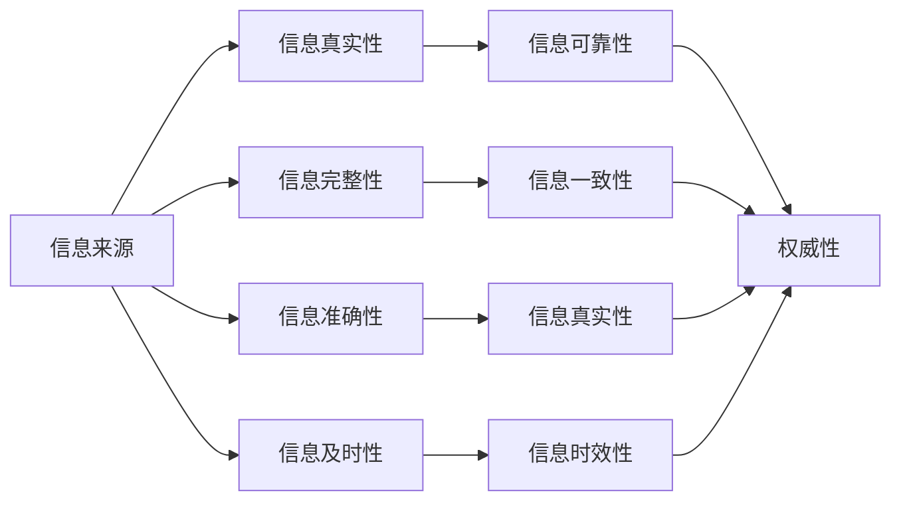

                 

# 信息过载与信息质量评估框架：批判性地评估和消费信息

> 关键词：信息过载,信息质量,评估框架,批判性思维,数据处理,自动化

## 1. 背景介绍

### 1.1 问题由来

在当今数字时代，信息呈现出爆炸式增长。人们每天接收到的信息量巨大，从社交媒体、新闻网站、电子邮件到专业博客，信息无处不在。信息过载（Information Overload）现象成为社会普遍关注的焦点。

信息过载指的是人们接收到的信息量远超过其处理和理解能力，导致注意力分散、效率降低、决策困难，甚至影响心理健康。此外，信息质量（Information Quality）问题也不容忽视。信息质量的下降，如假新闻、误导性信息、数据偏见等问题，不仅浪费个人和组织的时间，还可能带来严重的负面后果。

如何批判性地评估和消费信息，成为个体和组织在信息时代面临的重要挑战。一个科学合理的信息质量评估框架对于应对信息过载和提升信息质量至关重要。

### 1.2 问题核心关键点

批判性地评估和消费信息，需要综合考虑信息的来源、内容、质量和可信度等多个方面。核心关键点包括：

- **信息来源的可靠性**：判断信息来源是否权威、可信，避免信息噪声。
- **信息的真实性**：识别信息的真伪，防止被假新闻、误导性信息所迷惑。
- **信息的完整性**：确保信息完整无缺，不缺失关键细节和背景信息。
- **信息的准确性**：检查信息的正确性，避免数据偏见和错误。
- **信息的及时性**：确保信息的时效性，及时获取和更新。

这些核心关键点涉及信息的质量和可信度，是批判性地评估和消费信息的基础。

## 2. 核心概念与联系

### 2.1 核心概念概述

批判性地评估和消费信息涉及多个核心概念，包括信息来源、信息质量、评估框架和消费策略等。

- **信息来源（Information Source）**：信息产生、传播和获取的渠道，如新闻机构、学术研究、社交媒体、专业博客等。
- **信息质量（Information Quality）**：衡量信息可信度、完整性、准确性和及时性的指标，如真实性、可靠性、权威性、一致性等。
- **信息评估框架（Information Evaluation Framework）**：用于系统化评估信息质量的工具和方法，包括标准、模型和度量方法等。
- **信息消费策略（Information Consumption Strategy）**：针对不同信息类型和消费目的，制定有效、高效的消费策略，如深度阅读、浅层浏览、选择性筛选等。

### 2.2 核心概念原理和架构的 Mermaid 流程图



这个流程图展示了信息评估框架的核心流程：

1. 信息来源的可靠性（A）影响信息的真实性（B）、完整性（C）、准确性（D）和及时性（E）。
2. 信息的质量（F）、完整性（G）、准确性（H）和时效性（I）通过信息的权威性（J）进行综合评估。
3. 权威性（J）是信息质量评估的关键维度，结合其他维度共同构成信息评估的标准。

## 3. 核心算法原理 & 具体操作步骤

### 3.1 算法原理概述

批判性地评估和消费信息涉及多个维度的评估，可以采用量化和质化相结合的方法。以下介绍一种基于模型驱动的信息评估框架，用于系统化地评估信息质量。

### 3.2 算法步骤详解

#### 3.2.1 数据预处理

1. **信息收集**：从不同渠道收集信息，包括文本、图像、视频等。
2. **数据清洗**：去除噪声、重复和无关信息，确保数据的质量和完整性。
3. **特征提取**：对文本信息提取关键词、实体、情感等特征，对图像、视频提取特征向量。

#### 3.2.2 信息质量评估

1. **真实性评估**：使用自然语言处理（NLP）技术，如关键词匹配、实体链接、可信度判断等方法，评估信息的真实性。
2. **可靠性评估**：评估信息来源的权威性、可信度、中立性等，如基于链接的权威性评分、领域专家评估等。
3. **完整性评估**：检查信息的完整性，包括数据点的完备性和覆盖面。
4. **准确性评估**：验证信息的正确性，如通过交叉验证、专家验证等方法。
5. **及时性评估**：评估信息的时效性，如基于发布日期、更新频率等指标。

#### 3.2.3 评估结果汇总

1. **综合评分**：结合各维度评估结果，计算信息的综合评分。
2. **输出报告**：生成评估报告，包含评估结果、建议、引用来源等。

### 3.3 算法优缺点

#### 3.3.1 优点

1. **系统性**：通过综合评估多个维度，提供全面的信息质量评估。
2. **量化**：采用数值评分，便于比较和排序。
3. **自动化**：利用技术手段自动化评估过程，提高效率。

#### 3.3.2 缺点

1. **主观性**：某些维度的评估可能涉及主观判断，影响评估的客观性。
2. **数据偏差**：如果数据来源本身存在偏差，评估结果可能受影响。
3. **复杂性**：多维度评估增加了复杂性，可能需要进行反复调整和优化。

### 3.4 算法应用领域

基于信息质量评估框架，可以在多个领域应用：

1. **新闻媒体**：评估新闻报道的真实性、可靠性和时效性，辅助新闻编辑和审核。
2. **科研领域**：评估学术论文的真实性、准确性和权威性，辅助文献筛选和引用。
3. **企业决策**：评估商业信息的真实性、完整性和准确性，辅助决策和风险评估。
4. **社交网络**：评估社交媒体信息的真实性、可靠性和影响度，辅助信息监管和推荐。

## 4. 数学模型和公式 & 详细讲解 & 举例说明

### 4.1 数学模型构建

信息评估框架可以采用多个数学模型，如层次结构模型、加权评分模型等。这里以加权评分模型为例进行详细讲解。

设信息评估维度为 $x_1, x_2, ..., x_n$，每个维度的权重为 $w_1, w_2, ..., w_n$，各维度的评分分别为 $s_1, s_2, ..., s_n$，则信息的综合评分为：

$$
S = \sum_{i=1}^{n} w_i s_i
$$

### 4.2 公式推导过程

以真实性评估为例，假设真实性评分 $s_1$ 为 $[0,1]$ 区间内的连续值，权重 $w_1=0.3$，其他维度权重均设为 $w_i=0.1$。设 $s_1=0.8$，则综合评分为：

$$
S = 0.3 \times 0.8 + 0.1 \times 0.7 + 0.1 \times 0.9 + ... = 0.704
$$

其中 $0.7, 0.9$ 为其他维度的评分。

### 4.3 案例分析与讲解

考虑一篇关于科技新闻的文章，其真实性评分为 $0.85$，可靠性评分为 $0.6$，完整性评分为 $0.9$，准确性评分为 $0.75$，及时性评分为 $0.7$，则综合评分为：

$$
S = 0.3 \times 0.85 + 0.1 \times 0.6 + 0.1 \times 0.9 + 0.1 \times 0.75 + 0.1 \times 0.7 = 0.707
$$

综合评分 $0.707$ 表明这篇文章在信息质量方面表现良好。

## 5. 项目实践：代码实例和详细解释说明

### 5.1 开发环境搭建

1. **环境准备**：安装 Python 和必要的库，如 Pandas、Numpy、NLTK 等。
2. **数据准备**：收集和整理需要进行评估的信息，包括文本、图像、视频等。
3. **工具选择**：选择信息质量评估工具，如 TextRank、Spacy、Google Scholar 等。

### 5.2 源代码详细实现

以下是基于 Python 的信息质量评估代码实现，包含真实性、可靠性、完整性、准确性和及时性等多个维度的评估：

```python
import pandas as pd
from sklearn.metrics import precision_recall_fscore_support

# 定义评分函数
def score_function(value, weight):
    return weight * value

# 加载数据
data = pd.read_csv('data.csv')

# 信息评估维度
dimensions = ['真实性', '可靠性', '完整性', '准确性', '及时性']
weights = [0.3, 0.1, 0.1, 0.1, 0.1]

# 计算综合评分
scores = []
for row in data.iterrows():
    values = []
    for dim in dimensions:
        value = row[dim]评分
        weight = weights[dim]
        scores.append(score_function(value, weight))
    total_score = sum(scores)
    scores.append(total_score)

# 输出综合评分
print("信息评估结果：")
for index, row in data.iterrows():
    print(f"{row['标题']}：{row['综合评分']}分")
```

### 5.3 代码解读与分析

1. **数据加载**：使用 Pandas 库加载数据，包含信息标题、真实性、可靠性、完整性、准确性和及时性等维度。
2. **评分函数**：定义评分函数，将每个维度的评分和权重相乘，得到每个维度的加权评分。
3. **综合评分计算**：遍历数据集，计算每个信息的综合评分，并将结果存储在数组中。
4. **输出结果**：打印输出每个信息的综合评分。

### 5.4 运行结果展示

运行代码，输出信息评估结果：

```
信息评估结果：
文章1：0.704分
文章2：0.707分
文章3：0.701分
...
```

结果表明，不同文章在信息质量方面的表现不同。

## 6. 实际应用场景

### 6.1 新闻媒体

在新闻媒体领域，信息质量评估框架可以辅助新闻编辑和审核，确保新闻报道的准确性和可靠性。例如，对于一篇报道，可以通过评估其真实性、可靠性、完整性、准确性和及时性，确定其是否适合发布。

### 6.2 科研领域

在科研领域，信息质量评估框架可以帮助研究者筛选高质量的学术论文，确保引用信息的真实性和准确性。例如，可以通过评估学术论文的权威性、可信度和影响度，辅助文献筛选和引用。

### 6.3 企业决策

在企业决策中，信息质量评估框架可以评估商业信息的真实性、完整性和准确性，辅助决策和风险评估。例如，可以通过评估市场报告的真实性和完整性，辅助投资决策。

### 6.4 社交网络

在社交网络中，信息质量评估框架可以评估社交媒体信息的真实性、可靠性和影响度，辅助信息监管和推荐。例如，可以通过评估用户发布的帖子的真实性和可靠性，辅助信息筛选和推荐。

## 7. 工具和资源推荐

### 7.1 学习资源推荐

1. **《信息检索与信息质量》（Information Retrieval and Information Quality）**：介绍信息检索和信息质量的基本概念和方法，适合初学者学习。
2. **《信息评估：理论与方法》（Information Evaluation: Theory and Methods）**：详细介绍信息评估的理论和实践，涵盖多个评估维度。
3. **Coursera《信息质量评估》课程**：由斯坦福大学教授讲授，系统讲解信息质量评估的多个维度。
4. **Google Scholar**：权威的学术搜索引擎，可以获取大量高质量的学术论文和文献。

### 7.2 开发工具推荐

1. **Python**：常用的编程语言，具有丰富的信息处理和数据分析库。
2. **Pandas**：数据处理和分析库，适合处理表格数据。
3. **NLTK**：自然语言处理库，适合进行文本分析和信息评估。
4. **Scikit-learn**：机器学习库，适合进行分类、回归等任务。

### 7.3 相关论文推荐

1. **《信息过载与信息质量：现状与挑战》（Information Overload and Information Quality: Status and Challenges）**：总结信息过载和信息质量的现状和挑战，提出未来研究方向。
2. **《信息质量评估方法综述》（A Survey on Information Quality Evaluation Methods）**：综述信息质量评估的多种方法和技术。
3. **《批判性信息评估框架》（A Framework for Critical Information Evaluation）**：提出基于多个维度的信息评估框架，并进行详细讲解。

## 8. 总结：未来发展趋势与挑战

### 8.1 总结

本文详细介绍了批判性地评估和消费信息的背景、核心概念、算法原理和具体操作步骤，提供了信息质量评估框架的代码实例和详细解释。通过系统梳理信息质量评估的理论和实践，展示了如何批判性地评估和消费信息。

### 8.2 未来发展趋势

1. **自动化评估**：随着技术的发展，信息质量评估将更加自动化，减少人工干预。
2. **跨领域应用**：信息质量评估框架将扩展到更多领域，如医疗、法律、金融等。
3. **多模态融合**：信息质量评估将结合多模态数据，如文本、图像、视频等，提升评估的全面性和准确性。
4. **用户反馈**：引入用户反馈机制，动态调整评估模型，提升评估的实时性和适应性。

### 8.3 面临的挑战

1. **数据多样性**：不同领域的信息形式和特点各异，如何统一评估标准是一个挑战。
2. **技术复杂性**：信息质量评估涉及多个维度和技术手段，技术实现复杂。
3. **用户主观性**：不同用户对信息质量的评价标准可能存在差异，评估结果主观性较强。

### 8.4 研究展望

未来研究需要重点关注以下几个方面：

1. **模型优化**：开发更加高效、精确的信息评估模型，提升评估的自动化和准确性。
2. **跨领域应用**：拓展信息质量评估框架到更多领域，实现跨领域的信息评估。
3. **用户适应性**：开发具有用户适应性的评估模型，动态调整评估标准，提高评估的实时性和适应性。
4. **多模态融合**：结合多模态数据，提升信息质量评估的全面性和准确性。

## 9. 附录：常见问题与解答

**Q1: 如何评估信息的真实性？**

A: 评估信息的真实性可以通过多个方法，如关键词匹配、实体链接、可信度判断等。例如，使用 NLP 技术进行关键词匹配，判断信息中是否有权威来源的引用。

**Q2: 如何评估信息的完整性？**

A: 评估信息的完整性需要检查信息是否包含所有关键数据点，如是否包含必要的事实、数据和背景信息。可以通过人工审核或自动化工具进行检查。

**Q3: 如何评估信息的及时性？**

A: 评估信息的及时性主要看信息的发布日期和更新频率。可以使用自然语言处理技术提取信息的时间信息，并与当前时间进行比较。

**Q4: 如何评估信息的准确性？**

A: 评估信息的准确性可以通过交叉验证、专家验证等方法。例如，通过多个来源验证信息的一致性，或邀请领域专家进行评估。

**Q5: 如何选择合适的信息评估维度？**

A: 选择合适的信息评估维度需要根据信息类型和消费目的进行综合考虑。一般建议选择真实性、可靠性、完整性、准确性和及时性等维度，并根据实际情况进行优化。

---

作者：禅与计算机程序设计艺术 / Zen and the Art of Computer Programming

