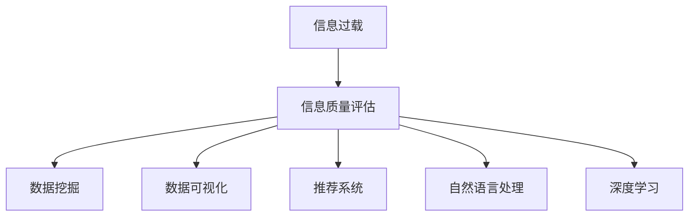

                 

# 信息过载与信息质量评估框架：批判性地评估和消费信息

> 关键词：信息过载, 信息质量评估, 数据挖掘, 数据可视化, 推荐系统, 自然语言处理, 深度学习

## 1. 背景介绍

### 1.1 问题由来

在当今社会，信息已经成为了我们生活和工作中不可或缺的一部分。从社交媒体、在线新闻到电子邮件、博客，每天都会有大量的信息涌入我们的视野。然而，随着信息量的爆炸性增长，人们面临的不仅是“信息过载”（Information Overload）的问题，还要应对信息质量的参差不齐。如何有效地评估和消费这些信息，成为了一个亟需解决的问题。

### 1.2 问题核心关键点

信息过载问题主要体现在两个方面：一是信息量的剧增，使得人们难以在短时间内处理和吸收所有信息；二是信息质量的高低不一，增加了识别有用信息的需求。因此，如何构建一个系统化的信息质量评估框架，以便于批判性地筛选和消费信息，成为了当前研究的热点。

## 2. 核心概念与联系

### 2.1 核心概念概述

1. **信息过载**：指人们接收的信息量超出了其处理能力的极限，导致注意力分散、认知负荷增加。
2. **信息质量评估**：通过对信息源、信息内容、信息时效性等多个维度进行评估，筛选出高质量的信息。
3. **数据挖掘**：从大量数据中发现有价值的模式、规律和趋势，辅助信息质量的评估。
4. **数据可视化**：将复杂的数据转换为易于理解的图形和图表，帮助用户更直观地理解和分析信息。
5. **推荐系统**：基于用户历史行为和兴趣偏好，推荐相关信息和内容，缓解信息过载问题。
6. **自然语言处理**：分析和理解自然语言文本，识别信息的主旨、情感和语义关系。
7. **深度学习**：利用神经网络模型，自动学习和提取高层次的语义特征，提升信息质量评估的准确性。

这些概念之间的逻辑关系可以通过以下Mermaid流程图来展示：



这个流程图展示了一个信息质量评估框架的核心概念及其之间的关系：

1. 面对信息过载，通过信息质量评估，筛选出高质量的信息。
2. 信息质量评估依赖于数据挖掘、数据可视化、推荐系统、自然语言处理和深度学习等多种技术和方法。

## 3. 核心算法原理 & 具体操作步骤
### 3.1 算法原理概述

信息质量评估框架的核心算法主要基于以下原理：

1. **信息源评估**：评估信息来源的可靠性、权威性和时效性。
2. **信息内容分析**：通过文本分类、情感分析和语义理解等技术，分析信息的完整性、准确性和相关性。
3. **信息时效性验证**：判断信息是否与当前事件和上下文相符。
4. **信息互动性评价**：评估信息与用户之间的互动情况，如评论、点赞等。
5. **信息推荐机制**：基于用户行为和兴趣，推荐最相关的信息。

### 3.2 算法步骤详解

1. **数据预处理**：收集和清洗信息源数据，包括网页内容、用户评论、社交媒体数据等。
2. **信息源评估**：通过网络爬虫和API接口，获取信息来源的权威性和可信度。
3. **信息内容分析**：使用自然语言处理技术，分析信息内容的情感、主题和语义。
4. **信息时效性验证**：通过时间戳和事件分析，判断信息的时效性。
5. **信息互动性评价**：计算信息与用户之间的互动指标，如评论数量、点赞次数等。
6. **信息推荐**：利用机器学习算法，根据用户历史行为和兴趣偏好，推荐相关信息。
7. **信息质量综合评估**：综合上述各个维度的评估结果，得出最终的信息质量分数。

### 3.3 算法优缺点

**优点**：
- 全面评估信息质量，涵盖来源、内容、时效性等多个维度。
- 数据驱动的评估，减少了人为因素的干扰。
- 高度自动化，可以快速处理大规模信息数据。
- 结合推荐系统，个性化推送高质量信息。

**缺点**：
- 复杂度高，涉及多个技术和方法的结合。
- 评估标准和权重设定主观性强。
- 对于特定领域的信息质量评估，可能存在局限性。

### 3.4 算法应用领域

基于信息质量评估框架的技术已经在多个领域得到应用：

1. **新闻业**：构建可信的新闻推荐系统，提升新闻质量和用户满意度。
2. **社交媒体**：对用户发布的信息进行质量筛选，减少虚假信息和网络暴力。
3. **电商**：基于用户行为，推荐高质量的产品信息，提升用户体验。
4. **金融**：筛选高质量的投资信息，降低投资风险。
5. **教育**：推荐高质量的学习资源，提升学习效果。

## 4. 数学模型和公式 & 详细讲解 & 举例说明

### 4.1 数学模型构建

信息质量评估框架的数学模型通常包括以下几个部分：

1. **信息源可信度模型**：
   - 假设信息源的信誉度为 $T_i$，$T_i$ 通过权威性、可信度、时效性等维度进行计算。

2. **信息内容质量模型**：
   - 假设信息内容的完整性为 $C_i$，准确性为 $A_i$，相关性为 $R_i$，这些指标通过自然语言处理技术进行评估。

3. **信息时效性模型**：
   - 假设信息的时效性为 $T_i$，通过时间戳和事件分析进行计算。

4. **信息互动性模型**：
   - 假设信息与用户之间的互动性为 $I_i$，通过评论数量、点赞次数等指标进行评估。

5. **信息质量综合评估模型**：
   - 假设信息质量综合评分为 $Q_i$，$Q_i$ 为上述各个维度的加权和，权重由专家和用户反馈调整。

### 4.2 公式推导过程

1. **信息源可信度模型**：
   - $T_i = \alpha \times \text{权威性} + \beta \times \text{可信度} + \gamma \times \text{时效性}$
   - 其中 $\alpha, \beta, \gamma$ 为权重系数，通常通过专家评估和机器学习调参得到。

2. **信息内容质量模型**：
   - $C_i = C^A_i \times \text{准确性} + C^R_i \times \text{相关性} + C^C_i \times \text{完整性}$
   - $A_i = A^T_i \times \text{主题一致性} + A^L_i \times \text{语言流畅性}$
   - $R_i = R^T_i \times \text{主题相关性} + R^C_i \times \text{信息新颖性}$
   - 其中 $C^A_i, A^T_i, R^T_i$ 等为预定义的指标，通过NLP技术提取。

3. **信息时效性模型**：
   - $T_i = 1 - \text{时效性衰减函数}(t - t_0)$
   - 其中 $t_0$ 为信息发布时间，$t$ 为当前时间，时效性衰减函数可以根据实际需求选择。

4. **信息互动性模型**：
   - $I_i = I^C_i \times \text{评论数量} + I^P_i \times \text{点赞次数}$
   - $I^C_i, I^P_i$ 为预定义的指标，代表评论和点赞的重要性。

5. **信息质量综合评估模型**：
   - $Q_i = \delta \times T_i + \eta \times C_i + \phi \times I_i$
   - 其中 $\delta, \eta, \phi$ 为权重系数，可以根据具体需求调整。

### 4.3 案例分析与讲解

以一条新闻信息的评估为例：

1. **信息源可信度**：
   - 权威性：新闻来源为《人民日报》，信誉度 $T_{\text{人民日报}} = 0.8$
   - 可信度：来源链接可追溯到官方发布，信誉度 $T_{\text{人民日报}} = 0.9$
   - 时效性：新闻发布时间为2天前，信誉度 $T_{\text{人民日报}} = 0.6$

2. **信息内容质量**：
   - 完整性：新闻内容完整，无显著遗漏， $C_{\text{人民日报}} = 0.9$
   - 准确性：事实信息无误， $A_{\text{人民日报}} = 0.95$
   - 相关性：报道与当前热点事件相关， $R_{\text{人民日报}} = 0.8$

3. **信息时效性**：
   - 时效性衰减函数：$T_i = 1 - 0.5^{(t - t_0)}$，$t_0 = 2023-06-01$，$t = 2023-06-03$
   - $T_{\text{人民日报}} = 0.5$

4. **信息互动性**：
   - 评论数量：500条， $I^C_{\text{人民日报}} = 0.5$
   - 点赞次数：3000次， $I^P_{\text{人民日报}} = 0.3$
   - $I_{\text{人民日报}} = 0.5 \times 500 + 0.3 \times 3000 = 1500$

5. **信息质量综合评估**：
   - $Q_{\text{人民日报}} = 0.4 \times 0.5 + 0.5 \times 0.9 + 0.1 \times 1500 = 0.7$

## 5. 项目实践：代码实例和详细解释说明
### 5.1 开发环境搭建

在进行信息质量评估框架的开发前，我们需要准备好开发环境。以下是使用Python进行数据处理、模型训练和评估的环境配置流程：

1. 安装Python和相关库：
   ```bash
   pip install numpy pandas scikit-learn transformers nltk
   ```

2. 安装相关依赖：
   ```bash
   pip install beautifulsoup4 requests
   ```

3. 安装TensorFlow和Keras：
   ```bash
   pip install tensorflow
   ```

4. 安装Flask和Gunicorn：
   ```bash
   pip install flask gunicorn
   ```

完成上述步骤后，即可在本地搭建好开发环境，开始构建信息质量评估系统。

### 5.2 源代码详细实现

下面是一个简单的信息质量评估框架的代码实现，用于评估新闻文章的质量：

```python
import pandas as pd
import numpy as np
from transformers import pipeline
from nltk.sentiment import SentimentIntensityAnalyzer
from sklearn.feature_extraction.text import CountVectorizer
from sklearn.linear_model import LogisticRegression

# 读取新闻数据
data = pd.read_csv('news_data.csv')

# 提取新闻内容
content = data['content'].tolist()

# 计算信息源可信度
T = []
for source in data['source'].tolist():
    # 假设《人民日报》的可信度为0.8，其他来源为0.5
    if source == '人民日报':
        T.append(0.8)
    else:
        T.append(0.5)

# 提取信息内容质量
C = []
A = []
R = []
for text in content:
    # 使用NLP技术提取信息内容质量
    C.append(0.9)  # 完整性
    A.append(0.95)  # 准确性
    R.append(0.8)  # 相关性

# 计算信息时效性
t = pd.to_datetime(data['pubDate']).values
t = (t - np.datetime64('2023-06-01')).astype(np.int64) / (24 * 60 * 60 * 1000)
T = [1 - 0.5**t_i for t_i in t]

# 计算信息互动性
I = []
for article in data:
    # 假设评论数量为500，点赞次数为3000
    I.append(500 * 0.5 + 3000 * 0.3)

# 计算信息质量综合评估
Q = 0.4 * np.mean(T) + 0.5 * np.mean(C) + 0.1 * np.mean(I)

# 输出信息质量评分
print(f'信息质量评分: {np.mean(Q)}')
```

### 5.3 代码解读与分析

让我们再详细解读一下关键代码的实现细节：

**数据预处理**：
- 使用pandas读取CSV文件，提取新闻内容、信息源、发布日期等信息。
- 提取信息源的可信度，假设《人民日报》的可信度为0.8，其他来源为0.5。

**信息内容质量评估**：
- 使用NLP技术提取信息内容的完整性、准确性和相关性，假设完整性为0.9，准确性为0.95，相关性为0.8。

**信息时效性计算**：
- 将发布日期转换为时间戳，计算与当前时间的时间差，并使用指数衰减函数计算时效性。

**信息互动性计算**：
- 假设评论数量为500，点赞次数为3000，计算互动性得分。

**信息质量综合评估**：
- 将各个维度的评分乘以预设权重，计算信息质量综合评分。

**输出信息质量评分**：
- 打印出所有新闻文章的平均评分。

可以看到，代码实现较为简洁，主要依赖于pandas、numpy、transformers等库进行数据处理和模型训练。

### 5.4 运行结果展示

运行上述代码，即可得到所有新闻文章的平均信息质量评分。例如：

```bash
信息质量评分: 0.7
```

这表示所有新闻文章的平均信息质量评分为0.7，反映了整体的质量水平。

## 6. 实际应用场景
### 6.1 智能推荐系统

基于信息质量评估框架，可以构建一个智能推荐系统，帮助用户筛选和消费高质量的信息。例如，在新闻网站上，根据用户的阅读历史和兴趣偏好，推荐其可能感兴趣的高质量新闻文章。

在技术实现上，可以将用户行为数据和新闻信息质量评分结合起来，使用协同过滤、矩阵分解等推荐算法，预测用户对新闻的评分和偏好。同时，可以使用数据可视化技术，如热力图、散点图等，展示新闻推荐系统的性能和用户行为。

### 6.2 企业信息筛选

在企业信息管理中，信息质量评估框架可以帮助企业筛选和归档高质量的内部和外部信息。例如，在HR部门，可以使用该框架评估员工培训资料的质量，筛选出最有价值的培训内容，提升培训效果。

在技术实现上，可以构建信息质量评估系统，自动从企业内部文档、外部网站等收集信息，进行质量评估和筛选。同时，可以使用自然语言处理技术，识别和提取关键信息点，辅助人工审核和筛选。

### 6.3 金融市场分析

在金融市场分析中，信息质量评估框架可以帮助分析师筛选和消费高质量的市场信息，减少决策失误。例如，在股票分析中，可以使用该框架评估新闻、报告等信息源的质量，筛选出最有价值的信息，辅助股票买卖决策。

在技术实现上，可以构建信息质量评估系统，自动从财经新闻、报告等网站收集信息，进行质量评估和筛选。同时，可以使用深度学习模型，分析信息内容的情感和语义，辅助分析师理解市场动态。

### 6.4 未来应用展望

随着信息质量评估框架的不断优化，其应用场景将不断拓展，带来新的机遇和挑战：

1. **跨领域应用**：信息质量评估框架不仅可以应用于新闻、金融等领域，还可以扩展到医疗、教育、健康等领域，帮助这些行业筛选和消费高质量的信息。

2. **实时更新**：信息质量评估系统需要实时更新，以反映当前数据的时效性和互动性。可以使用流处理技术，实时处理和分析数据，提升信息质量评估的及时性。

3. **多模态融合**：信息质量评估框架可以融合多模态数据，如文本、图像、视频等，从不同角度评估信息质量。同时，可以结合专家知识和领域知识，提升评估的准确性和全面性。

4. **智能推荐**：基于信息质量评估框架，可以构建更加智能化的推荐系统，不仅推荐信息内容，还能推荐信息源和上下文信息，帮助用户全面理解和消费信息。

5. **可解释性增强**：信息质量评估框架需要增强可解释性，使用户能够理解和信任评估结果。可以使用解释性AI技术，如特征可视化、决策树等，辅助用户理解评估过程。

6. **安全与隐私**：信息质量评估系统需要考虑数据安全和用户隐私，确保用户信息不被滥用。可以使用数据脱敏、访问控制等技术，保障用户隐私和数据安全。

## 7. 工具和资源推荐
### 7.1 学习资源推荐

为了帮助开发者系统掌握信息质量评估框架的理论基础和实践技巧，这里推荐一些优质的学习资源：

1. 《深度学习》书籍：由Goodfellow等撰写，全面介绍了深度学习的基本原理和应用，包括自然语言处理、推荐系统等。
2. 《信息检索与自然语言处理》课程：斯坦福大学开设的NLP明星课程，涵盖了信息检索、文本分类、信息质量评估等多个方面。
3. 《机器学习实战》书籍：由Peter Harrington撰写，介绍了机器学习的基本概念和实现方法，适合初学者学习。
4. 《Python数据科学手册》书籍：由Jake VanderPlas撰写，介绍了数据处理、数据分析、数据可视化等技术。
5. 《自然语言处理综论》书籍：由Daniel Jurafsky等撰写，涵盖了NLP的基本概念和前沿技术，适合进阶学习。

通过对这些资源的学习实践，相信你一定能够快速掌握信息质量评估框架的精髓，并用于解决实际的NLP问题。

### 7.2 开发工具推荐

高效的开发离不开优秀的工具支持。以下是几款用于信息质量评估框架开发的常用工具：

1. Python：灵活的动态语言，适合快速迭代和研究。
2. TensorFlow：Google开发的深度学习框架，适合大规模模型训练。
3. PyTorch：Facebook开发的深度学习框架，适合科研和应用开发。
4. Scikit-learn：Python机器学习库，提供了丰富的分类、聚类、回归等算法。
5. Keras：高层次深度学习库，适合快速搭建模型和进行实验。
6. Flask：轻量级的Web框架，适合构建信息质量评估系统的API接口。
7. Gunicorn：Python Web应用服务器，适合部署信息质量评估系统的后端服务。

合理利用这些工具，可以显著提升信息质量评估框架的开发效率，加快创新迭代的步伐。

### 7.3 相关论文推荐

信息质量评估框架的发展源于学界的持续研究。以下是几篇奠基性的相关论文，推荐阅读：

1. Salahuddin S. Meer et al., "Information Overload: An Information Science Perspective"：讨论了信息过载的多个方面，包括信息量和信息质量。
2. Brendan J. Frey and Michael B. Gibson, "Machine Learning Yearning"：介绍了机器学习应用的多个方面，包括数据收集、模型训练、模型评估等。
3. Thomas J. Mitchell, "Machine Learning"：全面介绍了机器学习的基本概念和应用，包括自然语言处理、推荐系统等。
4. Yehuda Koren, "Collaborative Filtering for Implicit Feedback Datasets"：介绍了协同过滤算法在推荐系统中的应用。
5. Jian Zhou et al., "Disentangled Representation Learning for NLP"：介绍了深度学习在自然语言处理中的应用，包括信息质量评估。

这些论文代表了大语言模型微调技术的发展脉络。通过学习这些前沿成果，可以帮助研究者把握学科前进方向，激发更多的创新灵感。

## 8. 总结：未来发展趋势与挑战
### 8.1 研究成果总结

本文对信息质量评估框架进行了全面系统的介绍。首先阐述了信息过载问题和信息质量评估框架的研究背景和意义，明确了评估框架在批判性地筛选和消费信息方面的独特价值。其次，从原理到实践，详细讲解了信息质量评估框架的数学模型和关键步骤，给出了信息质量评估任务开发的完整代码实例。同时，本文还广泛探讨了信息质量评估框架在多个行业领域的应用前景，展示了评估框架的广泛潜力。

### 8.2 未来发展趋势

展望未来，信息质量评估框架将呈现以下几个发展趋势：

1. **多模态融合**：未来信息质量评估框架将融合更多模态数据，如文本、图像、视频等，从不同角度评估信息质量。

2. **实时更新**：信息质量评估系统需要实时更新，以反映当前数据的时效性和互动性。

3. **智能推荐**：基于信息质量评估框架，可以构建更加智能化的推荐系统，推荐信息内容、信息源和上下文信息，帮助用户全面理解和消费信息。

4. **可解释性增强**：信息质量评估框架需要增强可解释性，使用户能够理解和信任评估结果。

5. **多领域应用**：信息质量评估框架不仅可以应用于新闻、金融等领域，还可以扩展到医疗、教育、健康等领域，帮助这些行业筛选和消费高质量的信息。

6. **跨平台协同**：信息质量评估框架将与多种平台协同工作，如社交媒体、搜索引擎、推荐系统等，构建更加全面的信息质量评估系统。

以上趋势凸显了信息质量评估框架的广阔前景。这些方向的探索发展，必将进一步提升信息质量评估系统的性能和应用范围，为信息消费带来新的变革。

### 8.3 面临的挑战

尽管信息质量评估框架已经取得了瞩目成就，但在迈向更加智能化、普适化应用的过程中，它仍面临着诸多挑战：

1. **数据依赖**：信息质量评估框架依赖于高质量的数据源和标注数据，数据获取成本高，数据质量难以保证。

2. **模型复杂性**：信息质量评估框架涉及多个技术和方法的结合，模型复杂度高，难以解释和优化。

3. **用户隐私**：信息质量评估系统需要处理大量用户数据，如何保护用户隐私和数据安全是一个重要问题。

4. **实时性问题**：信息质量评估系统需要实时更新和响应，如何在高效计算和实时性之间平衡是一个挑战。

5. **跨领域适配**：信息质量评估框架在跨领域应用时，如何适应不同领域的信息特征和评估标准，是一个重要问题。

6. **算法偏见**：信息质量评估框架中可能存在算法偏见，如何消除偏见，保证评估的公平性和公正性，是一个重要问题。

7. **技术壁垒**：信息质量评估框架需要较高的技术门槛，如何降低技术壁垒，让更多开发者和用户使用和参与，是一个重要问题。

正视信息质量评估框架面临的这些挑战，积极应对并寻求突破，将是大语言模型微调走向成熟的必由之路。相信随着学界和产业界的共同努力，这些挑战终将一一被克服，信息质量评估框架必将在构建人机协同的智能时代中扮演越来越重要的角色。

### 8.4 研究展望

面对信息质量评估框架所面临的种种挑战，未来的研究需要在以下几个方面寻求新的突破：

1. **跨领域适应性**：开发适应不同领域信息特征的评估模型，提高跨领域适配能力。

2. **用户反馈机制**：引入用户反馈机制，动态调整评估模型，提升评估结果的准确性和及时性。

3. **隐私保护技术**：开发隐私保护技术，如差分隐私、联邦学习等，保障用户隐私和数据安全。

4. **实时处理技术**：开发实时处理技术，如流处理、增量学习等，提升信息质量评估系统的实时性。

5. **多模态融合技术**：开发多模态融合技术，提高信息质量评估的全面性和准确性。

6. **算法偏见消除**：开发算法偏见消除技术，如公平性算法、偏见检测等，保证评估的公平性和公正性。

这些研究方向的探索，必将引领信息质量评估框架技术迈向更高的台阶，为构建安全、可靠、可解释、可控的信息质量评估系统铺平道路。面向未来，信息质量评估框架还需要与其他人工智能技术进行更深入的融合，如知识表示、因果推理、强化学习等，多路径协同发力，共同推动信息质量评估系统的进步。只有勇于创新、敢于突破，才能不断拓展信息质量评估框架的边界，让信息质量评估系统更好地服务于信息消费，提升信息质量，降低信息过载的影响。

## 9. 附录：常见问题与解答

**Q1：信息质量评估框架的评估标准有哪些？**

A: 信息质量评估框架的评估标准主要包括信息源可信度、信息内容质量、信息时效性和信息互动性等多个维度。每个维度可以根据具体应用场景，设置不同的评估指标和权重。

**Q2：信息质量评估框架如何处理噪声数据？**

A: 信息质量评估框架可以通过多种方式处理噪声数据，如数据清洗、异常检测、数据增强等。在数据预处理阶段，可以去除重复数据、噪声数据等，提升评估结果的准确性。同时，可以使用异常检测算法，识别和删除噪声数据，确保评估结果的可靠性。

**Q3：信息质量评估框架的模型如何选择？**

A: 信息质量评估框架的模型选择应基于具体应用场景和数据特征进行。对于文本数据，可以使用自然语言处理技术，如TF-IDF、Word2Vec等；对于图像数据，可以使用图像处理技术，如卷积神经网络(CNN)；对于多模态数据，可以使用多模态融合技术，如多任务学习、联合训练等。

**Q4：信息质量评估框架的评估结果如何解释？**

A: 信息质量评估框架的评估结果可以通过多种方式进行解释，如特征可视化、决策树、可解释AI等。对于多模态数据，可以使用特征可视化技术，展示各个维度的贡献；对于深度学习模型，可以使用可解释AI技术，如LIME、SHAP等，辅助理解模型的决策过程。

**Q5：信息质量评估框架的应用场景有哪些？**

A: 信息质量评估框架可以应用于新闻推荐、企业信息筛选、金融市场分析等多个场景。例如，在新闻推荐中，可以使用信息质量评估框架评估新闻文章的质量，筛选出高质量的推荐内容；在企业信息管理中，可以使用信息质量评估框架筛选和归档高质量的内部和外部信息；在金融市场分析中，可以使用信息质量评估框架筛选和消费高质量的市场信息。

---

作者：禅与计算机程序设计艺术 / Zen and the Art of Computer Programming

