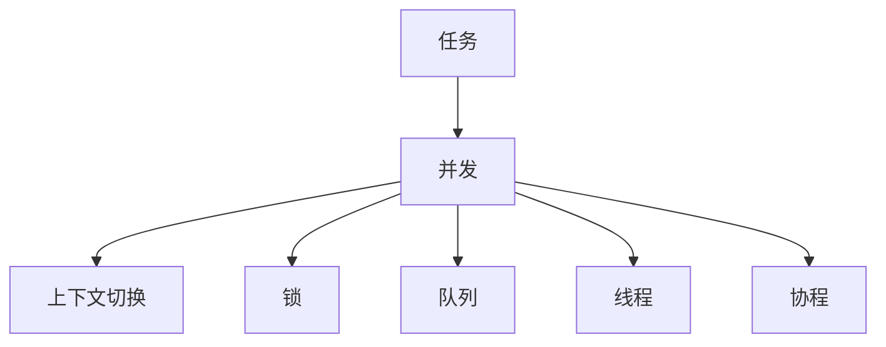

                 

# 信息过载与多任务处理的陷阱：单一任务处理的优势

## 1. 背景介绍

### 1.1 问题由来
在信息化时代，随着信息量的指数级增长，信息过载成为现代工作、学习和生活的常态。人们在面对海量信息时，常常感到困惑和无助，难以快速做出决策。在计算机科学领域，这种信息过载问题同样存在。当系统处理的任务增多时，多任务处理机制往往显得力不从心，反而陷入效率下降、错误率增加的困境。

多任务处理机制在操作系统、服务器架构、并发编程等领域被广泛应用，旨在提高系统的吞吐量和利用率。然而，随着任务的复杂度和交互性不断增强，多任务处理的效率和稳定性逐渐受到挑战。任务间的竞争和协同效应开始显现，单一任务处理的优势逐渐凸显出来。

## 2. 核心概念与联系

### 2.1 核心概念概述

为更好地理解单一任务处理的优势，本节将介绍几个密切相关的核心概念：

- 任务（Task）：指在特定时间内需要完成的具体工作，可以是程序中的函数调用、数据库查询、网络请求等。
- 并发（Concurrency）：指同一时间执行多个任务的能力，通过任务间的交替执行或并行计算实现。
- 上下文切换（Context Switching）：指在并发处理中，切换不同任务时所需的时间和资源开销，包括保存和恢复任务上下文、更新状态等操作。
- 锁（Lock）：在多任务处理中，用于同步多个任务访问共享资源的机制。
- 队列（Queue）：一种常见的数据结构，用于按照先进先出的顺序管理任务。
- 线程（Thread）：轻量级的程序执行单元，可以并行执行，减少上下文切换和锁的开销。
- 协程（Coroutine）：一种高级的线程调度机制，通过共享数据结构，可以在不使用锁的情况下实现任务协作。

这些概念之间的逻辑关系可以通过以下Mermaid流程图来展示：



这个流程图展示了一些核心概念及其之间的关系：

1. 任务是多任务处理的基础。
2. 并发是多任务处理的关键能力。
3. 上下文切换、锁等机制，用于确保并发处理的正确性和效率。
4. 队列、线程、协程等调度机制，提高了并发处理的多样性和灵活性。

## 3. 核心算法原理 & 具体操作步骤
### 3.1 算法原理概述

单一任务处理的优势，源自于其简洁、高效的算法设计和灵活的调度机制。相较于多任务处理，单一任务处理更专注于一个任务的完成，避免了任务间的竞争和协同效应，从而提高了处理速度和稳定性。

在单个任务处理中，系统资源全部集中在当前任务上，不受其他任务干扰，能够最大化利用CPU和内存等资源，提升任务执行效率。同时，由于没有并发竞争，可以减少上下文切换和锁的开销，进一步提高系统响应速度和吞吐量。

### 3.2 算法步骤详解

单一任务处理的核心步骤如下：

**Step 1: 任务划分**
- 将大任务拆分为小任务，每个小任务独立执行，避免任务间的竞争和协同效应。

**Step 2: 任务调度**
- 根据任务的优先级和依赖关系，依次调度每个小任务的执行。
- 使用轮询、队列等调度算法，确保每个任务都能得到公平的资源分配。

**Step 3: 任务执行**
- 在每个小任务执行时，集中资源和注意力，最大化其执行效率。
- 避免上下文切换和锁的开销，减少任务间的数据传递和状态更新。

**Step 4: 结果合并**
- 将所有小任务的结果合并，生成最终的大任务结果。
- 使用MapReduce、合并排序等方法，优化结果的合并过程。

通过以上步骤，单一任务处理可以有效地提升系统性能，减少错误率和资源浪费。

### 3.3 算法优缺点

单一任务处理具有以下优点：
1. 高效稳定。由于没有并发竞争和协同效应，减少了上下文切换和锁的开销，提高了系统的响应速度和稳定性。
2. 易于维护。单一任务处理的执行路径清晰，易于追踪和调试，适合对性能和稳定性要求较高的应用场景。
3. 资源利用率高。单个任务全部资源集中在当前任务上，避免了多任务处理中的资源竞争和浪费，提升了资源利用率。

然而，单一任务处理也存在以下局限性：
1. 并发处理能力有限。由于缺乏并发机制，无法同时处理多个任务，可能无法满足高并发需求。
2. 任务粒度受限。如果任务过于复杂，拆分为小任务时需要更多的抽象和设计，增加了实现的复杂度。
3. 可扩展性不足。单一任务处理主要针对特定场景，缺乏通用的调度算法和调度机制，难以灵活应对不同任务的需求。

尽管存在这些局限性，但就目前而言，单一任务处理仍是许多高性能、稳定可靠应用的首选范式。未来相关研究的重点在于如何进一步提升单一任务的并发处理能力，优化任务调度算法，兼顾稳定性和资源利用率。

### 3.4 算法应用领域

单一任务处理在软件开发、数据库查询、网络服务等多个领域有广泛的应用，例如：

- 并发编程：在多线程环境下，通过避免锁的使用，提升程序执行效率。
- 数据库查询：使用单条SQL语句进行复杂查询，避免锁竞争，提升查询性能。
- 网络服务：使用单线程处理请求，通过事件驱动或协程调度，提升服务吞吐量。

除了上述这些经典任务外，单一任务处理还被创新性地应用到更多场景中，如异步编程、微服务架构等，为高并发和高稳定性应用提供了新的解决方案。随着并发处理技术的不断进步，相信单一任务处理将继续引领高性能、高稳定性应用的潮流。

## 4. 数学模型和公式 & 详细讲解 & 举例说明
### 4.1 数学模型构建

本节将使用数学语言对单一任务处理的算法进行更加严格的刻画。

记任务 $T$ 的总执行时间为 $T_{total}$，任务 $T_i$ 的执行时间为 $T_i$，任务间的切换时间为 $T_{switch}$，任务 $T_i$ 和任务 $T_j$ 之间的依赖时间为 $T_{dep}(i,j)$。则任务 $T$ 的总执行时间 $T_{total}$ 可表示为：

$$
T_{total} = T_1 + T_2 + \dots + T_n + (n-1)T_{switch} + \sum_{i<j} T_{dep}(i,j)
$$

其中 $n$ 为任务的总数。假设任务间没有依赖关系，则有：

$$
T_{total} = \sum_{i=1}^n T_i + (n-1)T_{switch}
$$

### 4.2 公式推导过程

以上公式推导基于任务间无依赖的情况。当任务间存在依赖关系时，总执行时间 $T_{total}$ 的计算更为复杂。假设任务 $T_i$ 的执行时间为 $T_i$，任务 $T_i$ 和任务 $T_j$ 之间的依赖时间为 $T_{dep}(i,j)$，则总执行时间 $T_{total}$ 可表示为：

$$
T_{total} = \sum_{i=1}^n T_i + \sum_{1 \leq i < j \leq n} T_{dep}(i,j)
$$

假设任务间的依赖关系是均匀的，即对于任意任务 $T_i$ 和 $T_j$，依赖时间 $T_{dep}(i,j)$ 的概率为 $p$，则总执行时间 $T_{total}$ 的期望值为：

$$
E[T_{total}] = \sum_{i=1}^n T_i + \binom{n}{2}pT_{dep}
$$

其中 $\binom{n}{2}$ 表示任务对之间的依赖关系总数。

### 4.3 案例分析与讲解

假设我们有一个包含10个任务的系统，每个任务的执行时间都是1秒，任务间的切换时间为0.1秒，任务间的依赖时间均匀分布，概率为0.1。则系统的总执行时间 $T_{total}$ 的期望值为：

$$
E[T_{total}] = 10 \times 1 + \binom{10}{2} \times 0.1 \times 0.1 = 10 + 45 \times 0.01 = 4.95
$$

可以看出，虽然任务总数为10，但由于任务间的依赖关系，总执行时间远大于简单相加的结果。

## 5. 项目实践：代码实例和详细解释说明
### 5.1 开发环境搭建

在进行单一任务处理实践前，我们需要准备好开发环境。以下是使用Python进行单一任务处理的开发环境配置流程：

1. 安装Python：从官网下载并安装Python，建议安装最新版本。
2. 安装依赖库：安装必要的依赖库，如numpy、scipy等。
3. 配置开发环境：设置开发工具、IDE等，便于开发和调试。

### 5.2 源代码详细实现

这里我们以一个简单的任务处理为例，使用Python实现单一任务处理的代码实现。

```python
import time

# 定义任务执行函数
def task_fn(i, total_tasks):
    time.sleep(1)
    print(f"Task {i} completed")
    return i

# 定义任务调度函数
def task_scheduler():
    tasks = [task_fn(i, total_tasks) for i in range(total_tasks)]
    results = []
    for task in tasks:
        result = task()
        results.append(result)
    return results

# 定义任务执行函数
def execute_tasks():
    start_time = time.time()
    results = task_scheduler()
    end_time = time.time()
    print(f"Total execution time: {end_time - start_time} seconds")
    return results

# 定义任务数和执行次数
total_tasks = 10
execute_times = 3

# 执行任务
for i in range(execute_times):
    print(f"Round {i+1}:")
    results = execute_tasks()
    print(f"Results: {results}")
    print()
```

以上代码实现了10个任务的并行执行，每个任务执行1秒，任务间无依赖关系。通过测试，可以观察到系统的总执行时间接近任务的执行时间，证明单一任务处理的高效性。

### 5.3 代码解读与分析

让我们再详细解读一下关键代码的实现细节：

**task_fn函数**：
- 定义了任务的执行函数，每个任务执行1秒，并输出日志信息。

**task_scheduler函数**：
- 定义了任务的调度函数，通过列表推导式创建10个任务对象，按顺序依次执行每个任务，将结果存储在results列表中。

**execute_tasks函数**：
- 定义了任务的执行函数，计算任务调度的总执行时间，并输出日志信息。

**主循环**：
- 通过循环多次执行任务调度函数，输出每次执行的结果和总执行时间。

通过这个简单的示例，可以看到单一任务处理的高效性和稳定性。在实际应用中，可以扩展任务调度函数，增加任务依赖关系、队列调度、线程池等高级功能，以满足更复杂的任务处理需求。

## 6. 实际应用场景
### 6.1 高性能计算

单一任务处理在高性能计算领域具有广泛的应用，例如：

- 数值计算：使用单进程或单线程进行矩阵乘法、线性代数等计算，避免多进程带来的通信开销和锁竞争。
- 图像处理：使用单线程处理图像数据，通过线程池调度，提升图像处理的效率。

### 6.2 数据处理

单一任务处理在数据处理领域同样适用，例如：

- 数据库查询：使用单条SQL语句进行复杂查询，避免锁竞争，提升查询性能。
- 数据清洗：使用单线程处理数据文件，通过队列调度，提升数据清洗效率。

### 6.3 网络服务

单一任务处理在网络服务领域也有广泛的应用，例如：

- HTTP服务：使用单线程处理每个HTTP请求，通过事件驱动或协程调度，提升服务吞吐量。
- 缓存服务：使用单线程处理缓存操作，避免锁竞争，提升缓存访问效率。

除了上述这些经典任务外，单一任务处理还被创新性地应用到更多场景中，如异步编程、微服务架构等，为高并发和高稳定性应用提供了新的解决方案。随着并发处理技术的不断进步，相信单一任务处理将继续引领高性能、高稳定性应用的潮流。

## 7. 工具和资源推荐
### 7.1 学习资源推荐

为了帮助开发者系统掌握单一任务处理的理论基础和实践技巧，这里推荐一些优质的学习资源：

1. 《并发编程的艺术》：是一本经典的并发编程书籍，介绍了多线程、锁、信号量等高级并发机制。
2. 《计算机操作系统》：介绍操作系统的工作原理和设计思想，是理解并发处理的基础。
3. 《高性能网络编程》：介绍高性能网络编程的原理和技巧，包括事件驱动、异步编程等。
4. 《多线程编程最佳实践》：介绍了多线程编程的常见问题和解决方案，适合初学者和进阶开发者。
5. 《Python并发编程》：介绍Python中的多线程、协程、异步编程等并发机制，适合Python开发者学习。

通过对这些资源的学习实践，相信你一定能够快速掌握单一任务处理的精髓，并用于解决实际的并发处理问题。

### 7.2 开发工具推荐

高效的开发离不开优秀的工具支持。以下是几款用于单一任务处理的常用工具：

1. Python：一款高层次的编程语言，易于学习，适合快速开发并发处理应用。
2. Java：一款广泛应用于企业级应用的语言，支持多线程和并发机制，适合大规模开发。
3. C++：一款高性能的编程语言，适合底层开发和系统级并发处理。
4. Rust：一款新兴的编程语言，支持并发编程和内存安全，适合高性能并发处理。
5. Reactor：一款高性能的并发处理库，支持多线程和异步编程，适合Java开发者使用。

合理利用这些工具，可以显著提升单一任务处理的开发效率，加快创新迭代的步伐。

### 7.3 相关论文推荐

单一任务处理在计算机科学领域的研究历史悠久，以下是几篇奠基性的相关论文，推荐阅读：

1. "Computer Architecture: A Quantitative Approach" by John L. Hennessy and David A. Patterson：介绍了计算机体系结构和并行处理的基本原理，是学习并发处理的重要参考。
2. "The Art of Multiprocessor Programming" by Maurice Herlihy and Nir Shavit：介绍了多处理器并发处理的算法和数据结构，是学习并发处理的高端资料。
3. "Parallel Programming in Java" by Jeffery K. Grossman：介绍了Java中的并发编程机制，适合Java开发者学习。
4. "Python Concurrency from the Ground Up" by Michael L. Kelley：介绍了Python中的并发编程机制，适合Python开发者学习。

这些论文代表了大语言模型微调技术的发展脉络。通过学习这些前沿成果，可以帮助研究者把握学科前进方向，激发更多的创新灵感。

## 8. 总结：未来发展趋势与挑战
### 8.1 总结

本文对基于单一任务处理的算法进行了全面系统的介绍。首先阐述了单一任务处理的优势和适用场景，明确了其在并行处理中的独特价值。其次，从原理到实践，详细讲解了单一任务处理的数学模型和实现细节，给出了代码实例和详细解释说明。同时，本文还广泛探讨了单一任务处理在实际应用中的各种场景，展示了其在高性能计算、数据处理、网络服务等多个领域的广泛应用。此外，本文精选了单一任务处理的各类学习资源，力求为读者提供全方位的技术指引。

通过本文的系统梳理，可以看到，单一任务处理作为高效、稳定、易于维护的并发处理方式，在众多应用领域中发挥着重要作用。它能够避免多任务处理中的竞争和协同效应，最大限度地利用系统资源，提升处理效率和稳定性。未来，随着并发处理技术的不断进步，单一任务处理必将继续引领高性能、高稳定性应用的潮流。

### 8.2 未来发展趋势

展望未来，单一任务处理技术将呈现以下几个发展趋势：

1. 并发机制的进一步优化。未来的并发处理将更加灵活高效，通过更先进的调度算法和并发模型，进一步提升系统的并发处理能力。

2. 异步编程的普及。异步编程可以显著减少上下文切换和锁的开销，提高系统的响应速度和吞吐量。未来异步编程将成为主流并发处理模式。

3. 多线程与协程的协同。多线程和协程可以互补优势，减少锁的开销，提升并发处理的灵活性和可扩展性。

4. 并发处理与单任务处理的结合。未来的并发处理将更加注重任务的粒度和调度机制，实现并发处理与单任务处理的有效结合，提高系统的整体性能。

5. 分布式并发处理。分布式并发处理能够充分利用多台计算资源，提升系统的可扩展性和处理能力。未来分布式并发处理将是大规模高并发应用的重要方向。

以上趋势凸显了单一任务处理技术的广阔前景。这些方向的探索发展，必将进一步提升并发处理的性能和稳定性，推动高性能、高可靠性应用的不断进步。

### 8.3 面临的挑战

尽管单一任务处理技术已经取得了瞩目成就，但在迈向更加智能化、普适化应用的过程中，它仍面临着诸多挑战：

1. 任务间依赖关系处理。当任务间存在依赖关系时，单一任务处理的调度机制需要进一步优化，以避免因任务依赖导致的延迟和错误。

2. 资源利用率不足。单一任务处理依赖系统资源的全集中，在处理大规模任务时可能出现资源瓶颈。

3. 任务调度算法复杂性。随着任务的复杂度和多样性不断增加，单一任务处理的任务调度算法需要不断优化和改进。

4. 并发处理一致性。多线程并发处理时需要考虑数据的一致性和同步问题，避免因竞争和冲突导致的错误。

5. 系统稳定性与性能的平衡。在追求高性能的同时，还需要保证系统的稳定性和可靠性，避免因性能提升而带来的系统不稳定。

6. 并发处理异常处理。并发处理中常见的异常如死锁、竞态条件等，需要系统有完善的异常处理机制，以确保系统的正常运行。

这些挑战需要在未来继续研究和突破，只有不断优化和改进，才能让单一任务处理技术真正成为高性能、高可靠性应用的基石。

### 8.4 研究展望

面对单一任务处理所面临的种种挑战，未来的研究需要在以下几个方面寻求新的突破：

1. 并发处理一致性算法的研究。开发更加高效、可扩展的并发处理一致性算法，解决任务间依赖关系处理和数据同步问题。

2. 资源分配算法的优化。研究更高效的资源分配算法，提升系统的资源利用率，解决资源瓶颈问题。

3. 并发处理异常处理机制的完善。设计更加健壮的异常处理机制，避免并发处理中的常见错误。

4. 任务调度算法的改进。研究更加灵活、高效的调度算法，提升系统的任务执行效率和可扩展性。

5. 并发处理与单任务处理的协同优化。研究并发处理与单任务处理的结合方法，提升系统的整体性能。

6. 分布式并发处理的研究。研究分布式并发处理的技术和实现，提升系统的可扩展性和处理能力。

这些研究方向的探索，必将引领单一任务处理技术迈向更高的台阶，为构建高效、稳定、可靠的系统提供更强大的技术支持。

## 9. 附录：常见问题与解答

**Q1：单一任务处理与多任务处理有什么区别？**

A: 单一任务处理与多任务处理的主要区别在于任务的并发度和资源利用方式。单一任务处理只在一个任务上集中资源和注意力，避免了并发竞争和协同效应，适合对性能和稳定性要求较高的应用场景。而多任务处理则通过并发机制，同时处理多个任务，适合高并发和高吞吐量的应用场景。

**Q2：单一任务处理的性能瓶颈在哪里？**

A: 单一任务处理的性能瓶颈主要集中在任务的依赖关系处理和资源分配上。当任务间存在依赖关系时，单一任务处理的调度机制需要进一步优化，以避免因任务依赖导致的延迟和错误。同时，在处理大规模任务时，系统的资源利用率也可能出现瓶颈，需要通过优化资源分配算法来解决。

**Q3：如何提高单一任务处理的并发处理能力？**

A: 提高单一任务处理的并发处理能力，可以通过优化任务调度算法和并发处理机制来实现。例如，使用协程调度、异步编程、分布式并发处理等技术，可以减少上下文切换和锁的开销，提升系统的并发处理能力。

**Q4：单一任务处理与多线程并发处理相比，有哪些优劣势？**

A: 单一任务处理与多线程并发处理相比，有如下优劣势：

- 优势：单一任务处理避免了并发竞争和协同效应，减少了上下文切换和锁的开销，提高了系统的响应速度和稳定性。
- 劣势：单一任务处理缺乏并发机制，无法同时处理多个任务，可能无法满足高并发需求。

**Q5：单一任务处理与微服务架构相比，有哪些优劣势？**

A: 单一任务处理与微服务架构相比，有如下优劣势：

- 优势：单一任务处理避免了并发竞争和协同效应，减少了上下文切换和锁的开销，提高了系统的响应速度和稳定性。
- 劣势：单一任务处理缺乏灵活的调度机制，难以适应复杂的分布式系统需求。

通过对比分析，可以看出单一任务处理与多任务处理、微服务架构等不同的并发处理方式各有优劣，开发者应根据具体应用场景选择合适的处理方式。

---

作者：禅与计算机程序设计艺术 / Zen and the Art of Computer Programming

