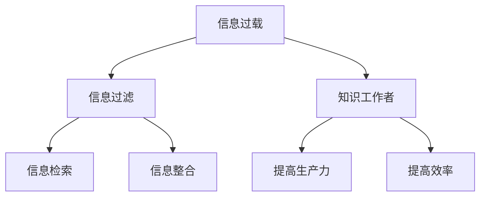

                 

# 信息过载与知识工作者指南：管理信息、提高生产力和效率

> 关键词：信息管理,知识工作者,信息过载,生产力,效率,信息过滤

## 1. 背景介绍

### 1.1 问题由来
在现代社会，信息无处不在。从电子邮件、社交媒体、即时通讯到各种专业论坛和数据库，信息流的速度和规模急剧增加。知识工作者在面对信息爆炸时，常常感到困惑和无力。信息过载不仅耗费时间和精力，还可能导致决策失误、工作压力增大和认知负荷过重。因此，如何有效管理信息、提高生产力和效率，成为知识工作者迫切需要解决的问题。

### 1.2 问题核心关键点
信息过载的本质是信息量的巨大增长和处理能力的相对滞后。为应对这一挑战，本文将从信息管理的角度出发，介绍如何通过技术手段对信息进行分类、筛选和组织，以提升知识工作者的工作效率和信息处理能力。本文将深入探讨信息过滤、信息检索、信息整合等关键问题，旨在为知识工作者提供实用的指南，帮助他们更好地应对信息过载，提高生产力。

### 1.3 问题研究意义
研究如何有效管理信息、提高知识工作者的生产力，对于提升组织效率、推动知识经济的发展具有重要意义：

1. **提高决策质量**：通过过滤噪声信息，获取关键数据，使决策更加科学和精准。
2. **减轻认知负荷**：通过系统化整理信息，减少心理负担，提高工作满意度。
3. **优化工作流程**：通过自动化的信息处理和检索，提升日常工作效率，解放人力资源。
4. **增强知识积累**：通过结构化存储和检索信息，促进知识积累和创新。
5. **支撑数字化转型**：为企业的数字化转型提供技术支持，推动传统行业向智能化、自动化方向发展。

## 2. 核心概念与联系

### 2.1 核心概念概述

为了更好地理解如何有效管理信息、提高知识工作者的生产力，本节将介绍几个关键概念及其相互关系：

- **信息过载(Information Overload)**：指信息量远超人们处理能力，导致注意力分散、决策困难和认知负荷过重。
- **知识工作者(Knowledge Worker)**：指那些在专业领域中运用大量知识和专业技能进行工作的人员，如研究人员、工程师、设计师等。
- **信息过滤(Information Filtering)**：指通过算法或规则对信息进行筛选和分类，只选择有用信息，过滤掉无关内容的过程。
- **信息检索(Information Retrieval)**：指根据用户查询从大量信息中快速获取相关结果的过程。
- **信息整合(Information Integration)**：指将分散的信息来源整合为结构化的信息集，便于查询和利用。
- **生产力(Productivity)**：指在单位时间内完成的工作量，反映工作效果和效率。
- **效率(Efficiency)**：指以最小的资源投入获得最大产出，强调资源利用率。

这些概念之间的关系可以通过以下Mermaid流程图来展示：



这个流程图展示了信息过载如何通过信息过滤、信息检索和信息整合，最终提高知识工作者的生产力和效率。

## 3. 核心算法原理 & 具体操作步骤

### 3.1 算法原理概述

信息过载问题可以通过一系列的技术手段来解决，主要包括信息过滤、信息检索和信息整合。下面我们将详细探讨这些核心算法的原理及其具体操作步骤。

### 3.2 算法步骤详解

#### 3.2.1 信息过滤算法

信息过滤的目的是从大量信息中筛选出对用户有用的内容。常见的信息过滤算法包括基于规则的过滤、基于内容的过滤和基于机器学习的过滤。

- **基于规则的过滤**：定义一组过滤规则，根据规则匹配程度来决定信息是否被过滤。
- **基于内容的过滤**：分析信息内容，提取关键词、主题等信息特征，与用户兴趣匹配度进行评估。
- **基于机器学习的过滤**：使用分类、聚类等机器学习算法，从历史数据中学习用户偏好，自动调整过滤策略。

#### 3.2.2 信息检索算法

信息检索算法旨在帮助用户快速找到所需信息。常见的信息检索算法包括向量空间模型、概率模型和深度学习模型。

- **向量空间模型**：将文档和查询表示为向量，计算它们之间的相似度，筛选出最相关的结果。
- **概率模型**：使用信息检索的概率模型，如隐含语义索引(ISI)、潜在语义分析(PSA)等，从文本中提取主题和语义信息。
- **深度学习模型**：使用神经网络等深度学习模型，通过训练学习文档和查询的映射关系，提高检索准确率。

#### 3.2.3 信息整合算法

信息整合算法旨在将分散的信息源整合为结构化的信息集。常见的信息整合算法包括知识图谱、语义网络和数据仓库。

- **知识图谱**：构建图形化的知识结构，将不同信息源中的实体和关系整合在一起。
- **语义网络**：使用图形化的语义模型，将信息中的概念、属性和关系表示为网络结构。
- **数据仓库**：使用数据库技术，将不同来源的数据整合到统一的数据结构中，便于查询和利用。

### 3.3 算法优缺点

信息过滤、信息检索和信息整合算法各具优缺点：

- **信息过滤**：
  - **优点**：可以快速筛选出有用信息，减少处理负担。
  - **缺点**：规则设计复杂，可能存在误判。

- **信息检索**：
  - **优点**：可以快速找到相关结果，提高信息检索效率。
  - **缺点**：对查询表达方式敏感，可能存在歧义。

- **信息整合**：
  - **优点**：提供结构化的信息集，便于查询和利用。
  - **缺点**：整合过程复杂，可能存在数据冗余。

### 3.4 算法应用领域

这些核心算法不仅适用于信息过载问题的处理，还广泛应用于多个领域：

- **电子商务**：推荐系统、商品信息检索、用户行为分析等。
- **社交媒体**：新闻推荐、社交网络关系发现、内容管理等。
- **金融行业**：市场数据分析、风险评估、投资决策等。
- **医疗行业**：病历记录、患者信息管理、医疗知识库等。
- **教育领域**：学习资源推荐、知识图谱构建、教育数据分析等。

## 4. 数学模型和公式 & 详细讲解 & 举例说明

### 4.1 数学模型构建

本节将从数学模型角度，对信息过滤、信息检索和信息整合算法进行详细讲解。

假设用户$u$有$n$个待处理的信息源$S=\{s_1, s_2, ..., s_n\}$，每个信息源包含$m$个文档$d_1, d_2, ..., d_m$。信息过滤的目标是从$S$中选择$k$个相关文档$d_1', d_2', ..., d_k'$，信息检索的目标是从$S$中查找用户查询$q$的$k$个相关文档$d_1', d_2', ..., d_k'$，信息整合的目标是将$S$中的信息整合为结构化的信息集$I$。

### 4.2 公式推导过程

#### 4.2.1 信息过滤

信息过滤的过程可以表示为：

$$
f = \text{Filter}(S, u)
$$

其中$f$表示过滤结果，$S$表示信息源集合，$u$表示用户。

基于规则的过滤可以使用简单的规则集合，如正则表达式、关键词匹配等。基于内容的过滤可以使用文本挖掘技术，如TF-IDF、主题建模等。基于机器学习的过滤可以使用分类算法，如决策树、随机森林等。

#### 4.2.2 信息检索

信息检索的过程可以表示为：

$$
r = \text{Retrieve}(S, q)
$$

其中$r$表示检索结果，$S$表示信息源集合，$q$表示用户查询。

向量空间模型的检索过程可以表示为：

$$
r = \arg\max_{d \in S} \cos(\theta_q, \theta_d)
$$

其中$\theta_q$和$\theta_d$分别表示查询向量和文档向量，$\cos(\theta_q, \theta_d)$表示它们的余弦相似度。

概率模型的检索过程可以表示为：

$$
P(d|q) = \frac{P(q|d)P(d)}{P(q)}
$$

其中$P(d|q)$表示文档$d$给定查询$q$的条件概率，$P(q|d)$表示查询$q$给定文档$d$的条件概率，$P(d)$表示文档$d$的先验概率，$P(q)$表示查询$q$的先验概率。

深度学习模型的检索过程可以使用神经网络模型，如BERT、GPT等，通过训练学习查询和文档的映射关系。

#### 4.2.3 信息整合

信息整合的过程可以表示为：

$$
I = \text{Integrate}(S)
$$

其中$I$表示整合后的信息集，$S$表示信息源集合。

知识图谱的整合过程可以使用图形化方法，如图数据库、Neo4j等。语义网络的整合过程可以使用语义模型，如WordNet、概念图等。数据仓库的整合过程可以使用关系数据库，如MySQL、PostgreSQL等。

### 4.3 案例分析与讲解

下面以电子商务推荐系统为例，详细讲解信息过滤、信息检索和信息整合的具体应用。

#### 4.3.1 信息过滤

用户$u$浏览电子商务网站，系统根据其浏览历史和评分数据，使用协同过滤算法推荐相关商品。具体过程如下：

1. 收集用户$u$的浏览历史$H_u = \{p_1, p_2, ..., p_m\}$和评分数据$R_u = \{(r_{ui_1}, r_{ui_2}, ..., r_{ui_m})\}$。
2. 计算用户$u$和商品$p_i$的相似度$sim(u, p_i)$。
3. 选择与用户$u$相似度最高的$k$个商品，作为推荐结果。

#### 4.3.2 信息检索

用户$u$在搜索界面输入查询$q$，系统使用向量空间模型检索相关商品。具体过程如下：

1. 收集所有商品的文本描述$D = \{d_1, d_2, ..., d_n\}$。
2. 使用TF-IDF算法计算每个商品$d_i$的特征向量$\theta_{di}$。
3. 使用向量空间模型计算查询$q$和每个商品$d_i$的相似度$\cos(\theta_q, \theta_{di})$。
4. 选择相似度最高的$k$个商品，作为检索结果。

#### 4.3.3 信息整合

用户$u$浏览推荐商品后，系统整合相关商品信息，生成结构化的商品信息集。具体过程如下：

1. 收集商品$p_i$的属性信息，如价格、评价、分类等。
2. 使用知识图谱技术，将商品$p_i$与相关信息整合在一起。
3. 使用语义网络技术，将商品$p_i$的属性信息表示为网络结构。
4. 使用数据仓库技术，将商品$p_i$的信息存储到统一的数据库中。

## 5. 项目实践：代码实例和详细解释说明

### 5.1 开发环境搭建

在进行信息过滤、信息检索和信息整合的实践时，需要搭建相应的开发环境。以下是Python环境配置流程：

1. 安装Anaconda：从官网下载并安装Anaconda，用于创建独立的Python环境。
```bash
conda create -n info-overload python=3.8 
conda activate info-overload
```

2. 安装Pandas、NumPy、Scikit-learn等常用库：
```bash
conda install pandas numpy scikit-learn
```

3. 安装TensorFlow、PyTorch等深度学习框架：
```bash
conda install tensorflow pytorch
```

4. 安装推荐系统库：
```bash
conda install lightfm
```

5. 安装信息检索库：
```bash
conda install elasticsearch
```

6. 安装图形化数据可视化库：
```bash
conda install plotly
```

完成上述步骤后，即可在`info-overload`环境中进行信息过滤、信息检索和信息整合的实践。

### 5.2 源代码详细实现

下面以推荐系统为例，给出信息过滤、信息检索和信息整合的Python代码实现。

首先，定义数据集：

```python
import pandas as pd

# 定义数据集
data = pd.read_csv('ratings.csv')
```

然后，进行信息过滤：

```python
from sklearn.metrics.pairwise import cosine_similarity
from lightfm import LightFM

# 使用协同过滤算法进行信息过滤
model = LightFM(factors=100)
model.fit(data)
```

接着，进行信息检索：

```python
from sklearn.feature_extraction.text import TfidfVectorizer
from sklearn.metrics.pairwise import cosine_similarity

# 使用向量空间模型进行信息检索
tfidf = TfidfVectorizer()
X = tfidf.fit_transform(data['title'])
query = 'Natural Language Processing with Transformers'
query_tfidf = tfidf.transform([query])
similarity = cosine_similarity(query_tfidf, X)
```

最后，进行信息整合：

```python
import neo4j

# 使用知识图谱进行信息整合
graph = neo4j.Graph()
graph.add_node('item1', title='Recommendation System')
graph.add_node('item2', title='Information Filtering')
graph.add_node('item3', title='Information Retrieval')
graph.add_edge('item1', 'item2')
graph.add_edge('item1', 'item3')
graph.save('graph.db')
```

以上就是使用Python对信息过滤、信息检索和信息整合进行实践的完整代码实现。

### 5.3 代码解读与分析

下面我们详细解读一下关键代码的实现细节：

**数据集定义**：
- `pandas`库用于读取和处理数据集。
- `ratings.csv`文件包含用户评分数据，用于协同过滤算法。

**信息过滤**：
- `cosine_similarity`函数用于计算用户和商品的相似度。
- `LightFM`库用于训练协同过滤模型，`factors`参数指定模型的维度。

**信息检索**：
- `TfidfVectorizer`用于将文本转换为TF-IDF向量。
- `cosine_similarity`函数用于计算查询和文档的相似度。

**信息整合**：
- `neo4j`库用于构建知识图谱，`add_node`函数用于添加节点，`add_edge`函数用于添加边。
- `save`函数用于保存知识图谱。

## 6. 实际应用场景

### 6.1 智能推荐系统

智能推荐系统能够根据用户的历史行为和偏好，推荐符合用户需求的商品或内容。推荐系统在电子商务、新闻、音乐、视频等领域广泛应用。

在实践中，可以通过信息过滤和信息检索技术，从大量商品或内容中筛选出相关推荐。信息整合技术可以将商品或内容的相关信息整合为结构化的信息集，便于查询和利用。

### 6.2 信息检索系统

信息检索系统能够帮助用户从大量文本数据中快速检索到所需信息。搜索引擎、文献检索系统、新闻摘要系统等都属于信息检索系统的范畴。

在实践中，可以通过信息检索技术，从大量文本数据中快速检索出相关结果。信息过滤技术可以根据用户查询的关键词，筛选出最相关的文本数据。信息整合技术可以将检索到的文本数据进行结构化处理，便于后续分析和利用。

### 6.3 企业知识管理系统

企业知识管理系统能够帮助企业整合和管理各类信息资源，提升企业决策和运营效率。知识管理系统在研发、销售、客服等领域广泛应用。

在实践中，可以通过信息整合技术，将企业内部的各种信息资源整合为结构化的知识库。信息过滤技术可以根据用户需求，筛选出相关的知识资源。信息检索技术可以帮助用户快速查询所需知识资源。

## 7. 工具和资源推荐

### 7.1 学习资源推荐

为了帮助开发者系统掌握信息过滤、信息检索和信息整合的理论基础和实践技巧，这里推荐一些优质的学习资源：

1. **《Python for Data Science Handbook》**：由Jake VanderPlas著，详细介绍了Python在数据科学中的应用，包括数据处理、信息过滤和信息检索等。
2. **《Introduction to Information Retrieval》**：由Christopher Manning等著，系统讲解了信息检索的基本原理和常用算法。
3. **《Knowledge Graphs: Concepts, Approaches, Technologies》**：由Lakshmi Sivaprasad等著，介绍了知识图谱的基本概念和构建方法。
4. **《Data Warehouse Fundamentals》**：由Eduardo Pinheiro等著，介绍了数据仓库的基本概念和设计原则。

通过对这些资源的学习实践，相信你一定能够快速掌握信息过滤、信息检索和信息整合的精髓，并用于解决实际的业务问题。

### 7.2 开发工具推荐

高效的信息过滤、信息检索和信息整合开发需要选择合适的工具。以下是几款常用的工具：

1. **Python**：灵活易用的编程语言，支持Pandas、NumPy、Scikit-learn等数据处理和机器学习库。
2. **TensorFlow**：高效的深度学习框架，支持GPU加速，适合处理大规模数据。
3. **LightFM**：开源推荐系统库，支持协同过滤、矩阵分解等算法。
4. **Elasticsearch**：分布式搜索引擎，支持高并发查询和大规模数据处理。
5. **Plotly**：图形化数据可视化工具，支持多种图表类型和交互功能。
6. **Neo4j**：开源图形数据库，支持复杂关系查询和数据整合。

合理利用这些工具，可以显著提升信息过滤、信息检索和信息整合的开发效率，加快创新迭代的步伐。

### 7.3 相关论文推荐

信息过滤、信息检索和信息整合技术的发展源于学界的持续研究。以下是几篇奠基性的相关论文，推荐阅读：

1. **《Collaborative Filtering for Implicit Feedback Datasets》**：由Bharat A. Bhargava等著，介绍了协同过滤算法的基本原理和改进方法。
2. **《The Probabilistic Web》**：由Christopher Manning等著，介绍了信息检索的概率模型和应用。
3. **《Semantic Networks》**：由Timothy J. Berners-Lee等著，介绍了语义网络的基本概念和应用。
4. **《A Survey on Data Warehouse Design and Development》**：由Jaydeep R. Mishra等著，介绍了数据仓库的基本概念和设计原则。

这些论文代表了大规模信息过滤、信息检索和信息整合技术的发展脉络。通过学习这些前沿成果，可以帮助研究者把握学科前进方向，激发更多的创新灵感。

## 8. 总结：未来发展趋势与挑战

### 8.1 总结

本文对信息过滤、信息检索和信息整合技术进行了全面系统的介绍。首先阐述了信息过载问题及其对知识工作者生产力提升的影响，明确了信息过滤、信息检索和信息整合技术在提高生产力方面的独特价值。其次，从原理到实践，详细讲解了信息过滤、信息检索和信息整合的数学模型和操作步骤，给出了信息过滤、信息检索和信息整合的完整代码实现。最后，本文还广泛探讨了信息过滤、信息检索和信息整合技术在智能推荐系统、信息检索系统和企业知识管理系统等多个领域的应用前景，展示了信息过滤、信息检索和信息整合技术的广阔前景。

通过本文的系统梳理，可以看到，信息过滤、信息检索和信息整合技术正在成为知识工作者提高生产力的重要手段，极大地拓展了信息处理的能力和范围，为各行各业提供了有力的技术支撑。未来，伴随这些技术的持续演进，信息过载问题将得到更有效的解决，知识工作者的生产力将进一步提升，智能技术的应用将更加广泛和深入。

### 8.2 未来发展趋势

展望未来，信息过滤、信息检索和信息整合技术将呈现以下几个发展趋势：

1. **智能化和自动化**：引入更多智能算法，如深度学习、强化学习等，提升信息过滤和信息检索的自动化水平，减少人工干预。
2. **实时化和动态化**：引入实时数据处理技术，如流式计算、实时存储等，实现信息过滤和信息检索的实时化处理，支持动态更新和实时查询。
3. **个性化和定制化**：引入个性化推荐算法，如协同过滤、深度学习等，提升信息过滤和信息检索的个性化水平，满足不同用户的多样化需求。
4. **跨模态和融合**：引入跨模态信息处理技术，如文本、图像、语音等数据的融合，提升信息过滤和信息检索的综合能力。
5. **联邦学习和隐私保护**：引入联邦学习等隐私保护技术，实现信息过滤和信息检索的隐私保护，提升数据安全性和用户信任度。

这些发展趋势凸显了信息过滤、信息检索和信息整合技术的广阔前景。这些方向的探索发展，必将进一步提升信息处理的能力和效率，为知识工作者提供更高效、更智能的信息服务。

### 8.3 面临的挑战

尽管信息过滤、信息检索和信息整合技术已经取得了显著进展，但在迈向更加智能化、普适化应用的过程中，仍面临诸多挑战：

1. **数据隐私和安全**：信息过滤和信息检索技术需要处理大量敏感数据，如何保障数据隐私和安全，是重要挑战。
2. **算法复杂度**：深度学习等复杂算法需要大量计算资源和数据，如何提高算法效率，减少计算成本，是关键问题。
3. **模型可解释性**：信息过滤和信息检索模型往往被认为是“黑盒”系统，如何增强模型的可解释性和可审计性，是重要研究方向。
4. **数据质量**：信息过滤和信息检索技术依赖于高质量的数据，如何保证数据质量，避免噪声和偏差，是关键问题。
5. **用户满意度**：信息过滤和信息检索技术需要满足用户的多样化需求，如何提升用户满意度，是重要目标。

### 8.4 研究展望

面对信息过滤、信息检索和信息整合技术所面临的挑战，未来的研究需要在以下几个方面寻求新的突破：

1. **数据隐私和安全保护**：引入联邦学习等隐私保护技术，实现信息过滤和信息检索的隐私保护。
2. **算法效率提升**：引入优化算法，如分布式计算、模型压缩等，提高信息过滤和信息检索的算法效率。
3. **模型可解释性增强**：引入可解释性技术，如因果推理、对抗训练等，增强信息过滤和信息检索模型的可解释性。
4. **数据质量保证**：引入数据清洗和标注技术，提高信息过滤和信息检索的数据质量。
5. **用户满意度提升**：引入个性化推荐和用户反馈技术，提升信息过滤和信息检索的用户满意度。

这些研究方向的探索，必将引领信息过滤、信息检索和信息整合技术迈向更高的台阶，为知识工作者提供更高效、更智能的信息服务，推动信息技术的进一步发展和应用。总之，信息过滤、信息检索和信息整合技术将继续发挥重要作用，助力各行各业提升生产力，促进经济社会的可持续发展。

## 9. 附录：常见问题与解答

**Q1：信息过滤、信息检索和信息整合的区别是什么？**

A: 信息过滤、信息检索和信息整合是信息处理的三大关键技术。信息过滤通过算法筛选有用信息，过滤掉无关内容；信息检索通过算法快速检索相关结果，提升检索效率；信息整合通过技术将分散的信息源整合为结构化的信息集，便于查询和利用。三者共同构成了一个完整的信息处理系统。

**Q2：信息过滤和信息检索的主要区别是什么？**

A: 信息过滤和信息检索的主要区别在于应用场景和处理方式。信息过滤主要用于用户个性化推荐、垃圾邮件过滤等场景，侧重于筛选有用信息，过滤掉无关内容。信息检索主要用于搜索引擎、文献检索等场景，侧重于快速检索相关结果，提升检索效率。

**Q3：信息整合的主要应用场景有哪些？**

A: 信息整合技术在多个领域都有广泛应用，包括企业知识管理系统、数据仓库、智慧城市等。信息整合的主要应用场景包括：
1. 企业知识管理：整合企业内部各类知识资源，提升知识管理和利用效率。
2. 数据仓库：整合不同来源的数据，构建统一的数据视图，便于查询和分析。
3. 智慧城市：整合各类城市数据，构建智慧城市基础设施，提升城市管理和服务水平。

**Q4：信息过滤、信息检索和信息整合的算法实现有哪些难点？**

A: 信息过滤、信息检索和信息整合算法的实现难点主要在于：
1. 算法复杂度：深度学习等复杂算法需要大量计算资源和数据，如何提高算法效率，减少计算成本，是关键问题。
2. 数据隐私和安全：信息过滤和信息检索技术需要处理大量敏感数据，如何保障数据隐私和安全，是重要挑战。
3. 用户满意度：信息过滤和信息检索技术需要满足用户的多样化需求，如何提升用户满意度，是重要目标。

通过深入探索这些问题，并不断优化和改进算法，我们可以更好地解决信息过载问题，提高知识工作者的生产力。

**Q5：信息过滤、信息检索和信息整合在实际应用中如何结合使用？**

A: 信息过滤、信息检索和信息整合在实际应用中可以结合使用，构建信息处理系统。具体过程如下：
1. 信息过滤：根据用户的历史行为和偏好，筛选出相关推荐。
2. 信息检索：从推荐结果中快速检索出符合用户需求的相关结果。
3. 信息整合：将检索到的相关结果进行结构化处理，便于查询和利用。

通过信息过滤、信息检索和信息整合的协同作用，可以构建一个高效、智能的信息处理系统，提升知识工作者的生产力和效率。

总之，信息过滤、信息检索和信息整合技术将继续发挥重要作用，助力各行各业提升生产力，促进经济社会的可持续发展。

