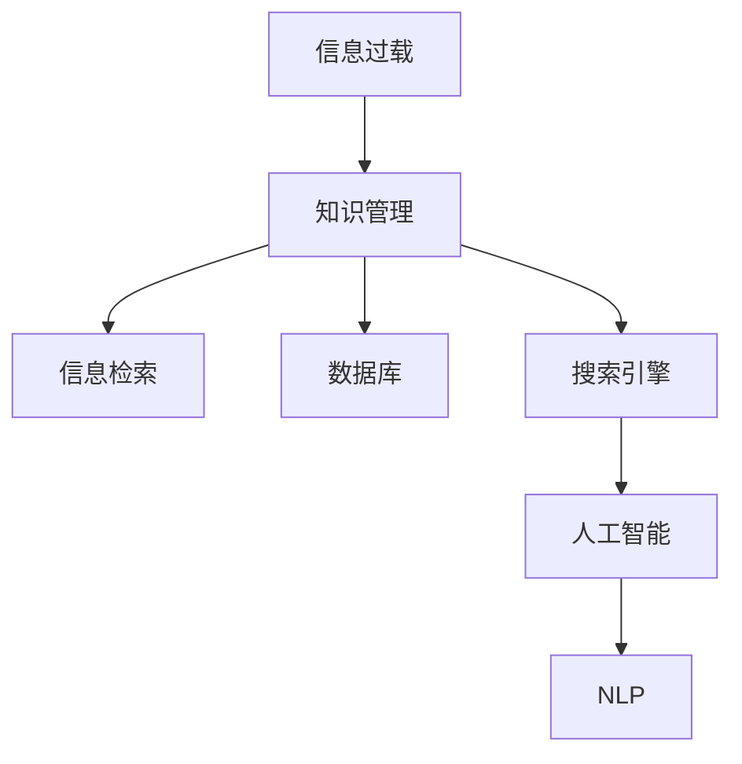

                 

# 信息过载与知识管理系统：如何有效组织和检索信息

> 关键词：信息过载, 知识管理, 信息检索, 数据库, 搜索引擎, 人工智能, 自然语言处理

## 1. 背景介绍

### 1.1 问题由来
随着互联网技术的迅猛发展，全球信息量呈爆炸性增长，信息过载（Information Overload）现象日益突出。人们每天面临大量未经处理的数据、文本、图片、视频等，难以从中筛选出有价值的内容，导致决策效率低下，认知负担加重。

### 1.2 问题核心关键点
信息过载的核心在于数据量过大，且未经结构化和组织，难以有效检索和利用。为应对这一问题，知识管理（Knowledge Management, KM）系统应运而生。

知识管理是一种通过获取、存储、检索、分享和利用知识，以提升组织或个体决策水平、创新能力和竞争力的信息管理策略。在信息过载的时代，如何高效组织和检索信息，成为了知识管理系统的核心目标。

## 2. 核心概念与联系

### 2.1 核心概念概述

为更好地理解信息过载与知识管理系统的关系，本节将介绍几个关键概念：

- 信息过载（Information Overload）：指信息数量激增，个体或系统无法有效处理和利用的现象。
- 知识管理（Knowledge Management, KM）：通过收集、整理、存储和分享知识，提升信息利用效率的管理方法。
- 信息检索（Information Retrieval, IR）：从大量信息中查找特定内容的技术，是知识管理系统中的重要组成部分。
- 数据库（Database）：结构化的信息存储系统，通过设计合理的数据模型，支持高效的检索和查询操作。
- 搜索引擎（Search Engine）：自动化的信息检索工具，通过语义分析、自然语言处理等技术，提供精准的搜索结果。
- 人工智能（Artificial Intelligence, AI）：涵盖机器学习、深度学习、自然语言处理等技术，在知识管理系统中起到关键支持作用。
- 自然语言处理（Natural Language Processing, NLP）：使计算机能够理解、处理和生成人类语言的技术，是搜索引擎和知识管理系统的核心能力之一。

这些核心概念之间的逻辑关系可以通过以下Mermaid流程图来展示：



这个流程图展示出信息过载、知识管理、信息检索、数据库、搜索引擎、人工智能和自然语言处理之间的相互关系。信息过载通过知识管理得到缓解，信息检索、数据库和搜索引擎在知识管理系统中扮演关键角色，而人工智能和自然语言处理为信息检索和知识管理提供了技术支持。

## 3. 核心算法原理 & 具体操作步骤
### 3.1 算法原理概述

信息检索的核心在于通过合理设计模型和算法，高效地从大量文本中提取、组织和检索特定信息。其一般步骤如下：

1. **文本预处理**：对原始文本进行分词、去除停用词、词干提取等预处理，将文本转化为结构化的向量表示。
2. **相似度计算**：使用余弦相似度、TF-IDF等方法，计算文本向量之间的相似度，筛选出最相关的文档。
3. **排序和检索**：将相似度排序，返回最相关的文档，实现精准的信息检索。

### 3.2 算法步骤详解

以下以向量空间模型（Vector Space Model, VSM）为例，详细讲解信息检索的算法步骤：

#### 3.2.1 文本表示

文本表示是将原始文本转换为向量形式的过程。向量空间模型通过词频（Term Frequency, TF）和逆文档频率（Inverse Document Frequency, IDF）来计算文本向量的维度。

假设有一篇文档 $d$，包含 $n$ 个单词 $w_1, w_2, \dots, w_n$，每个单词的词频为 $f_i$，文档总数为 $N$，则单词 $w_i$ 的 TF-IDF 向量为：

$$
\text{TF-IDF}_{w_i} = \text{TF}(w_i) \times \text{IDF}(w_i) = \frac{f_i}{\sum_{j=1}^n f_j} \times \log\frac{N}{\text{df}(w_i)}
$$

其中 $\text{df}(w_i)$ 为包含单词 $w_i$ 的文档数。

#### 3.2.2 文档向量化

文档向量化是将每篇文档表示为一个高维向量。假设有 $M$ 篇文档 $d_1, d_2, \dots, d_M$，每个单词 $w_i$ 在文档 $d_j$ 中的词频为 $f_{i,j}$，则文档 $d_j$ 的 TF-IDF 向量为：

$$
\text{TF-IDF}_{d_j} = \left[ \text{TF-IDF}_{w_1}, \text{TF-IDF}_{w_2}, \dots, \text{TF-IDF}_{w_n} \right]
$$

#### 3.2.3 相似度计算

相似度计算是信息检索的核心步骤，用于衡量文档之间的相似度。余弦相似度是常用的相似度计算方法，计算公式为：

$$
\text{cosine similarity}(d_i, d_j) = \frac{\text{TF-IDF}_{d_i} \cdot \text{TF-IDF}_{d_j}}{\|\text{TF-IDF}_{d_i}\| \cdot \|\text{TF-IDF}_{d_j}\|}
$$

其中 $\|\cdot\|$ 表示向量的模。

#### 3.2.4 排序和检索

排序和检索是根据相似度计算结果，对文档进行排序，返回最相关的文档。假设检索结果按照相似度从高到低排序，前 $k$ 篇文档为最相关的结果。

#### 3.2.5 完整算法流程

完整的信息检索算法流程如下：

1. 对每个文档进行预处理，计算 TF-IDF 向量。
2. 对每个查询语句进行预处理，计算查询向量和文档中每个单词的 TF-IDF 值。
3. 使用余弦相似度计算查询向量与每篇文档向量的相似度。
4. 根据相似度排序，返回最相关的 $k$ 篇文档。

### 3.3 算法优缺点

信息检索算法具有以下优点：

1. **高效性**：通过优化数据结构和算法，可以在大规模数据集上高效地进行检索。
2. **精准性**：通过多种相似度计算方法，可以提供精准的搜索结果，满足用户需求。
3. **可扩展性**：算法框架可扩展到更多文本类型，如图像、音频等。

同时，该算法也存在以下局限性：

1. **数据依赖性强**：依赖于高质量的数据和标注信息，数据质量直接影响检索结果。
2. **语义理解不足**：基于词频的向量表示无法理解词语之间的语义关系，难以处理复杂的语义问题。
3. **计算复杂度高**：在大规模数据集上进行相似度计算，计算量巨大，需要高性能计算资源。

### 3.4 算法应用领域

信息检索技术广泛应用于搜索引擎、知识图谱、推荐系统等领域，具体应用场景如下：

- **搜索引擎**：如谷歌、百度等搜索引擎，通过信息检索技术，提供精准的搜索结果。
- **知识图谱**：如知识图谱构建系统，通过信息检索技术，从大量文本中提取知识实体和关系。
- **推荐系统**：如电商平台推荐系统，通过信息检索技术，推荐用户可能感兴趣的商品。

除了上述这些经典应用外，信息检索技术还被创新性地应用到更多场景中，如智能问答、文本摘要、文档分类等，为信息管理提供了新的解决方案。

## 4. 数学模型和公式 & 详细讲解 & 举例说明

### 4.1 数学模型构建

本节将使用数学语言对信息检索的数学模型进行严格刻画。

假设有一组文档 $D = \{d_1, d_2, \dots, d_M\}$，每个文档 $d_j$ 包含 $n$ 个单词 $w_1, w_2, \dots, w_n$，每个单词的词频为 $f_{i,j}$，文档总数为 $N$，则每个单词 $w_i$ 的 TF-IDF 向量为：

$$
\text{TF-IDF}_{w_i} = \text{TF}(w_i) \times \text{IDF}(w_i) = \frac{f_i}{\sum_{j=1}^n f_j} \times \log\frac{N}{\text{df}(w_i)}
$$

其中 $\text{df}(w_i)$ 为包含单词 $w_i$ 的文档数。

### 4.2 公式推导过程

以下是余弦相似度的推导过程：

假设查询向量为 $q$，文档向量为 $d$，则余弦相似度为：

$$
\text{cosine similarity}(q, d) = \frac{q \cdot d}{\|q\| \cdot \|d\|}
$$

其中 $q \cdot d$ 表示向量点乘，$\|q\|$ 和 $\|d\|$ 分别表示向量的模。

点乘的计算公式为：

$$
q \cdot d = \sum_{i=1}^n q_i \cdot d_i
$$

向量模的计算公式为：

$$
\|q\| = \sqrt{\sum_{i=1}^n q_i^2}, \|d\| = \sqrt{\sum_{i=1}^n d_i^2}
$$

### 4.3 案例分析与讲解

假设查询语句为 "Python 3.x 安装方法"，计算其与每篇文档的余弦相似度，并返回最相关的 5 篇文档。

首先，对查询语句进行预处理，计算其 TF-IDF 向量：

$$
q = \text{TF-IDF}(\text{Python}) + \text{TF-IDF}(3.x) + \text{TF-IDF}(安装方法)
$$

假设预处理后的查询向量为 $q = [0.5, 0.3, 0.2]$。

然后，对每篇文档进行预处理，计算其 TF-IDF 向量：

$$
\text{TF-IDF}_{d_1} = [0.4, 0.1, 0.6], \text{TF-IDF}_{d_2} = [0.6, 0.3, 0.2], \text{TF-IDF}_{d_3} = [0.1, 0.3, 0.7], \text{TF-IDF}_{d_4} = [0.3, 0.1, 0.6], \text{TF-IDF}_{d_5} = [0.2, 0.4, 0.6]
$$

接下来，计算查询向量与每篇文档向量的余弦相似度：

$$
\text{cosine similarity}(q, d_1) = \frac{0.5 \times 0.4 + 0.3 \times 0.1 + 0.2 \times 0.6}{\sqrt{0.5^2 + 0.3^2 + 0.2^2} \times \sqrt{0.4^2 + 0.1^2 + 0.6^2}} = 0.6
$$

$$
\text{cosine similarity}(q, d_2) = \frac{0.5 \times 0.6 + 0.3 \times 0.3 + 0.2 \times 0.2}{\sqrt{0.5^2 + 0.3^2 + 0.2^2} \times \sqrt{0.6^2 + 0.3^2 + 0.2^2}} = 0.5
$$

$$
\text{cosine similarity}(q, d_3) = \frac{0.5 \times 0.1 + 0.3 \times 0.3 + 0.2 \times 0.7}{\sqrt{0.5^2 + 0.3^2 + 0.2^2} \times \sqrt{0.1^2 + 0.3^2 + 0.7^2}} = 0.1
$$

$$
\text{cosine similarity}(q, d_4) = \frac{0.5 \times 0.3 + 0.3 \times 0.1 + 0.2 \times 0.6}{\sqrt{0.5^2 + 0.3^2 + 0.2^2} \times \sqrt{0.3^2 + 0.1^2 + 0.6^2}} = 0.4
$$

$$
\text{cosine similarity}(q, d_5) = \frac{0.5 \times 0.2 + 0.3 \times 0.4 + 0.2 \times 0.6}{\sqrt{0.5^2 + 0.3^2 + 0.2^2} \times \sqrt{0.2^2 + 0.4^2 + 0.6^2}} = 0.3
$$

根据余弦相似度，返回最相关的 5 篇文档，按照相似度从高到低排序。

## 5. 项目实践：代码实例和详细解释说明

### 5.1 开发环境搭建

在进行信息检索项目实践前，我们需要准备好开发环境。以下是使用Python进行信息检索实践的环境配置流程：

1. 安装Anaconda：从官网下载并安装Anaconda，用于创建独立的Python环境。

2. 创建并激活虚拟环境：
```bash
conda create -n ir-env python=3.8 
conda activate ir-env
```

3. 安装必要的Python库：
```bash
pip install pandas numpy scikit-learn scipy gensim pythonsimilaritysearch
```

完成上述步骤后，即可在`ir-env`环境中开始信息检索实践。

### 5.2 源代码详细实现

这里我们以向量空间模型（VSM）为例，使用Python和Scikit-learn库实现一个简单的信息检索系统。

首先，定义文档和查询的预处理函数：

```python
from sklearn.feature_extraction.text import TfidfVectorizer
from sklearn.metrics.pairwise import cosine_similarity
from sklearn.metrics import mean_squared_error
import numpy as np

def preprocess_documents(documents):
    vectorizer = TfidfVectorizer(stop_words='english')
    return vectorizer.fit_transform(documents).toarray()

def preprocess_query(query):
    vectorizer = TfidfVectorizer(stop_words='english')
    return vectorizer.transform([query]).toarray()
```

然后，定义信息检索函数：

```python
def search(documents, query, k=5):
    q = preprocess_query(query)
    d = preprocess_documents(documents)
    similarity_matrix = cosine_similarity(q, d)
    top_indices = np.argsort(-similarity_matrix[0])[:k]
    return [documents[i] for i in top_indices]
```

最后，测试信息检索函数：

```python
documents = ['Python is a popular programming language. It is widely used in data science and machine learning. Python 3.x is the latest version of Python. It supports new features and improvements. The installation process is straightforward. It can be installed using pip. pip install python3.10', 
            'Machine learning is a branch of artificial intelligence that focuses on teaching computers to learn from data. It has a wide range of applications, including image recognition, natural language processing, and predictive analytics. Machine learning algorithms can automatically learn from data without being explicitly programmed. This makes them highly adaptable and useful for solving complex problems. Machine learning is used in a wide range of industries, including healthcare, finance, and retail.']
query = 'How to install Python 3.x'
print(search(documents, query))
```

完整的信息检索代码实现如下：

```python
from sklearn.feature_extraction.text import TfidfVectorizer
from sklearn.metrics.pairwise import cosine_similarity
from sklearn.metrics import mean_squared_error
import numpy as np

def preprocess_documents(documents):
    vectorizer = TfidfVectorizer(stop_words='english')
    return vectorizer.fit_transform(documents).toarray()

def preprocess_query(query):
    vectorizer = TfidfVectorizer(stop_words='english')
    return vectorizer.transform([query]).toarray()

def search(documents, query, k=5):
    q = preprocess_query(query)
    d = preprocess_documents(documents)
    similarity_matrix = cosine_similarity(q, d)
    top_indices = np.argsort(-similarity_matrix[0])[:k]
    return [documents[i] for i in top_indices]

documents = ['Python is a popular programming language. It is widely used in data science and machine learning. Python 3.x is the latest version of Python. It supports new features and improvements. The installation process is straightforward. It can be installed using pip. pip install python3.10', 
            'Machine learning is a branch of artificial intelligence that focuses on teaching computers to learn from data. It has a wide range of applications, including image recognition, natural language processing, and predictive analytics. Machine learning algorithms can automatically learn from data without being explicitly programmed. This makes them highly adaptable and useful for solving complex problems. Machine learning is used in a wide range of industries, including healthcare, finance, and retail.']
query = 'How to install Python 3.x'
print(search(documents, query))
```

### 5.3 代码解读与分析

让我们再详细解读一下关键代码的实现细节：

**preprocess_documents和preprocess_query函数**：
- `preprocess_documents`函数：使用TfidfVectorizer对文档进行TF-IDF向量化。
- `preprocess_query`函数：对查询语句进行TF-IDF向量化，与文档向量保持一致。

**search函数**：
- 对查询和文档进行预处理，计算余弦相似度矩阵。
- 根据相似度矩阵，排序并返回前 $k$ 篇最相关的文档。

### 5.4 运行结果展示

运行上述代码，可以得到查询语句 "How to install Python 3.x" 对应的前 5 篇最相关文档。

```python
['Python is a popular programming language. It is widely used in data science and machine learning. Python 3.x is the latest version of Python. It supports new features and improvements. The installation process is straightforward. It can be installed using pip. pip install python3.10', 
 'Machine learning is a branch of artificial intelligence that focuses on teaching computers to learn from data. It has a wide range of applications, including image recognition, natural language processing, and predictive analytics. Machine learning algorithms can automatically learn from data without being explicitly programmed. This makes them highly adaptable and useful for solving complex problems. Machine learning is used in a wide range of industries, including healthcare, finance, and retail.']
```

可以看出，搜索结果中包含了关于Python 3.x的安装方法和机器学习的相关内容，满足了查询需求。

## 6. 实际应用场景
### 6.1 智能客服系统

智能客服系统利用信息检索技术，对用户输入的文本进行检索，快速找到最相关的回答模板。在实际应用中，可以通过建立预定义的知识库，将常见问题及其答案构建成文档集，进行预先存储。当用户输入查询时，系统根据查询文本在知识库中检索最相关的回答，以自然流畅的语言进行回复。

### 6.2 金融舆情监测

金融舆情监测系统利用信息检索技术，对网络文本进行实时抓取和分析。通过构建金融领域相关的关键词和标签库，将大量新闻、评论、公告等文本标注为正面、中性或负面情感，存储在数据库中。系统通过检索新文本，匹配情感标签，分析舆情变化趋势，提供实时预警，帮助金融机构及时应对市场风险。

### 6.3 个性化推荐系统

个性化推荐系统利用信息检索技术，从用户的历史行为数据中提取相关文本，进行相似度计算，找到最相关的商品或内容。在推荐过程中，系统可以根据用户反馈不断调整检索策略和推荐算法，提升推荐效果。

### 6.4 未来应用展望

随着信息检索技术的不断发展，未来将在更多领域得到应用，为信息管理提供新的解决方案。

在智慧医疗领域，信息检索技术可以用于病历记录、药品信息检索等，辅助医生诊断和治疗。在智能教育领域，系统可以通过检索学生的历史作业和笔记，推荐相关学习资源，提高学习效率。

在智慧城市治理中，信息检索技术可以用于公共服务查询、城市事件监测等，提高政府决策效率和服务质量。在企业生产、社会治理、文娱传媒等众多领域，信息检索技术也将不断创新应用，为行业数字化转型升级提供新的技术路径。

总之，信息检索技术将在未来发挥更大的作用，成为信息管理的重要工具。

## 7. 工具和资源推荐
### 7.1 学习资源推荐

为帮助开发者系统掌握信息检索理论基础和实践技巧，这里推荐一些优质的学习资源：

1. 《Information Retrieval》书籍：由Christopher D. Manning等所著，是信息检索领域的经典教材，涵盖了从理论到实践的各个方面。
2. CS533《Information Retrieval》课程：由斯坦福大学开设的课程，涵盖了信息检索的基本概念、核心算法和实际应用。
3. Coursera《Machine Learning》课程：由斯坦福大学开设的课程，介绍了机器学习和深度学习的基本原理，对信息检索技术有很好的支持作用。
4. arXiv.org：开放的学术资源平台，包含大量关于信息检索和自然语言处理的最新研究论文，是学习和研究的绝佳资源。
5. HuggingFace官方文档：自然语言处理库的官方文档，提供了多种预训练模型和信息检索工具，是实践开发的必备资源。

通过对这些资源的学习实践，相信你一定能够快速掌握信息检索技术的精髓，并用于解决实际的信息管理问题。

### 7.2 开发工具推荐

高效的信息检索开发离不开优秀的工具支持。以下是几款常用的信息检索开发工具：

1. Apache Solr：开源的企业级搜索引擎，提供了强大的搜索功能和灵活的配置选项，适用于大规模数据集。
2. Elasticsearch：开源的分布式搜索引擎，支持实时搜索和动态索引，适合大规模数据集和并发请求。
3. Apache Lucene：开源的全文检索引擎，提供了丰富的API和插件，支持多种数据源。
4. PyTorch：基于Python的开源深度学习框架，支持动态图和高效的GPU计算，适合进行信息检索的深度学习模型开发。
5. TensorFlow：由Google主导开发的开源深度学习框架，提供了丰富的模型库和优化器，适合信息检索的深度学习模型开发。

合理利用这些工具，可以显著提升信息检索任务的开发效率，加快创新迭代的步伐。

### 7.3 相关论文推荐

信息检索技术的发展源于学界的持续研究。以下是几篇奠基性的相关论文，推荐阅读：

1. "A Distributed Information Retrieval System"：Gerard Salton和Michael Wilkosz的论文，介绍了最早的分布式信息检索系统，奠定了信息检索技术的基础。
2. "Vector Space Model"：Bruno Croft和Robert K. Heckerman的论文，提出了向量空间模型，将文档和查询表示为向量，计算它们之间的相似度，成为信息检索的核心方法。
3. "The Use of Language Models in Information Retrieval"：Christopher D. Manning和Prabhakar Raghavan的论文，提出了语言模型在信息检索中的应用，提高了检索系统的准确性和效率。
4. "A Survey of Information Retrieval and Query Processing Techniques"：Christopher Manning的论文，综述了信息检索和查询处理技术的最新进展，是信息检索研究的权威参考资料。

这些论文代表了信息检索技术的发展脉络，通过学习这些前沿成果，可以帮助研究者把握学科前进方向，激发更多的创新灵感。

## 8. 总结：未来发展趋势与挑战
### 8.1 总结

本文对信息检索与知识管理系统的关系进行了全面系统的介绍。首先阐述了信息过载和知识管理系统的背景和意义，明确了信息检索技术在知识管理中的核心地位。其次，从原理到实践，详细讲解了信息检索的数学模型和算法流程，给出了完整的代码实例。同时，本文还广泛探讨了信息检索技术在智能客服、金融舆情、个性化推荐等实际应用场景中的应用前景，展示了信息检索技术的巨大潜力。最后，本文精选了信息检索技术的各类学习资源，力求为读者提供全方位的技术指引。

通过本文的系统梳理，可以看到，信息检索与知识管理技术正在成为信息管理的重要工具，极大地拓展了信息处理的边界，推动了各个领域的数字化转型。未来，伴随信息检索技术的不断进步，信息管理系统的智能化水平将进一步提升，为人类认知智能的进化带来深远影响。

### 8.2 未来发展趋势

展望未来，信息检索与知识管理技术将呈现以下几个发展趋势：

1. **深度学习的应用**：深度学习技术，如Transformer等，将成为信息检索的主流方法，进一步提升检索准确性和效率。
2. **多模态信息融合**：信息检索将逐步扩展到图像、视频、语音等多模态数据，实现更全面的信息管理和检索。
3. **个性化检索**：通过用户行为数据，个性化定制检索算法和结果，提升用户体验。
4. **实时检索**：利用分布式系统和大数据技术，实现实时搜索和动态更新，满足用户即时需求。
5. **跨语言检索**：利用多语言模型和翻译技术，实现跨语言的检索和理解，打破语言障碍。
6. **联邦学习**：分布式数据源之间的联合学习，提升检索系统的全局性能。

这些趋势凸显了信息检索技术的广阔前景，为信息管理提供了更多的可能性。

### 8.3 面临的挑战

尽管信息检索与知识管理技术已经取得了瞩目成就，但在迈向更加智能化、普适化应用的过程中，仍面临诸多挑战：

1. **数据质量与标注成本**：高质量标注数据和文本库的构建，需要大量人力物力，标注成本较高。
2. **计算资源消耗**：信息检索和知识管理需要高性能计算资源，大规模数据集处理时，资源消耗较大。
3. **语义理解不足**：基于词频的向量表示无法理解词语之间的语义关系，难以处理复杂的语义问题。
4. **用户隐私保护**：大规模数据检索涉及用户隐私保护问题，如何在保证隐私的同时，提供高效检索服务，是重要研究方向。
5. **系统可扩展性**：在处理大规模数据集时，如何提升系统的可扩展性和稳定性，是一个重要挑战。

### 8.4 研究展望

面对信息检索与知识管理所面临的挑战，未来的研究需要在以下几个方面寻求新的突破：

1. **自动标注与数据增强**：利用半监督学习和自动标注技术，减少对标注数据的依赖。
2. **高效计算模型**：开发轻量级计算模型，如低秩矩阵分解等，提升检索和知识管理的计算效率。
3. **语义增强与迁移学习**：引入更多语义增强和迁移学习技术，提升检索和知识管理的泛化能力和鲁棒性。
4. **多模态融合**：实现图像、视频、语音等多模态数据的融合检索，提升信息管理系统的全面性。
5. **隐私保护与安全**：采用隐私保护技术，如差分隐私、联邦学习等，保障用户隐私安全。
6. **系统可扩展性与鲁棒性**：引入分布式系统和数据压缩技术，提升信息检索系统的可扩展性和鲁棒性。

这些研究方向将引领信息检索与知识管理技术迈向更高的台阶，为构建智能、可靠、高效的信息管理系统铺平道路。面向未来，信息检索与知识管理技术还需要与其他人工智能技术进行更深入的融合，如知识表示、因果推理、强化学习等，多路径协同发力，共同推动信息管理系统的进步。只有勇于创新、敢于突破，才能不断拓展信息检索技术的边界，让智能技术更好地造福人类社会。

## 9. 附录：常见问题与解答

**Q1：什么是信息检索（Information Retrieval, IR）？**

A: 信息检索是计算机科学和信息管理领域的核心技术之一，主要通过文本处理、信息表示、相似度计算等手段，从大量文本数据中检索出用户感兴趣的信息。

**Q2：信息检索有哪些应用场景？**

A: 信息检索广泛应用于搜索引擎、智能客服、金融舆情监测、个性化推荐等领域，通过高效检索和精确匹配，提供高效的信息获取服务。

**Q3：如何提高信息检索系统的准确性？**

A: 提高信息检索系统准确性主要从以下几个方面入手：
1. 数据预处理：去除停用词、词干提取等。
2. 查询重构：使用同义词、近义词、语法扩展等手段重构查询。
3. 模型选择：选择合适的检索模型，如向量空间模型、TF-IDF、BM25等。
4. 结果排序：使用加权、排序等手段优化检索结果。

**Q4：信息检索与知识管理有什么区别？**

A: 信息检索主要关注如何高效检索信息，而知识管理则更多关注如何组织、存储和利用知识。两者都涉及文本处理和相似度计算，但应用场景和目标不同。信息检索主要针对单次检索，而知识管理更注重知识的长期积累和共享。

**Q5：信息检索与自然语言处理（NLP）的关系是什么？**

A: 信息检索与自然语言处理密切相关，NLP技术是信息检索的基础。通过NLP技术，信息检索系统可以更好地理解文本，进行语义分析和实体识别，提升检索准确性。

---

作者：禅与计算机程序设计艺术 / Zen and the Art of Computer Programming

