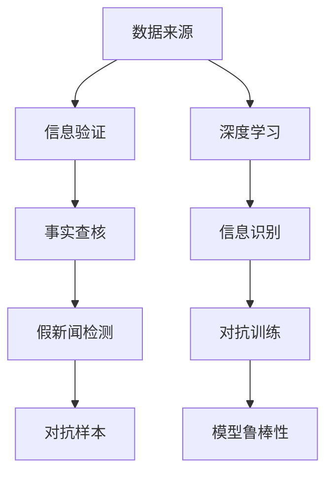

                 

# 信息验证和事实查核：在错误信息时代导航

在数字时代，信息洪流汹涌澎湃，真伪难辨。尤其在社交媒体、新闻报道、网络评论等平台上，错误信息、虚假新闻、偏见和谣言层出不穷，严重影响了公众的判断和决策。如何在泛滥的信息海洋中寻找真相、验证信息，成为了现代信息科技的重要课题。

本文将从背景介绍、核心概念、算法原理、具体操作、实际应用等多个方面，深入探讨信息验证和事实查核技术。通过对算法原理的阐述、实践操作的演示以及未来展望的思考，旨在为信息时代的信息筛选和验证提供专业、系统的解决方案。

## 1. 背景介绍

### 1.1 问题由来
随着互联网的迅速发展，信息传播的门槛大幅降低，每个人都可能成为信息的生产者和传播者。这种信息多样性在丰富人们视野的同时，也带来了巨大的信息可信度挑战。尤其在信息量爆炸的当下，错误信息、假新闻、信息偏见等现象比比皆是，严重威胁了社会的稳定与和谐。

以虚假新闻为例，根据一些研究，超过一半的新闻转发可能是假新闻。在一些重大公共事件中，虚假信息的传播速度远超真实新闻，甚至在一些关键决策中，假新闻起到了决定性作用。这使得公众的认知受到严重干扰，产生了对现实世界的错误认知。

### 1.2 问题核心关键点
信息验证和事实查核的核心在于如何高效、准确地从海量的数据中甄别真伪，提升信息可信度。主要问题点包括：

- 数据来源的可靠性。错误信息往往源自不可靠或虚假的数据源。
- 信息内容的真实性。需要构建算法模型，准确判断信息是否与客观事实相符。
- 对抗攻击。假新闻常常通过对抗样本（Adversarial Samples）来逃避检测，例如，通过微小修改原始信息来误导检测模型。
- 可解释性。需要构建可解释的模型，便于人工审核和审查。

## 2. 核心概念与联系

### 2.1 核心概念概述

为深入理解信息验证和事实查核技术，我们先梳理几个关键概念：

- **信息验证（Information Verification）**：通过对信息的来源、内容和格式进行审核，判断其是否真实、可靠。
- **事实查核（Fact-Checking）**：主要针对文本、图像、音频等形式的信息，通过多源比对、专业知识审查等方式，判断信息与客观事实的一致性。
- **假新闻检测（Fake News Detection）**：在社交媒体、新闻报道中，识别并标记出可能的假新闻。
- **对抗样本（Adversarial Examples）**：为误导或逃避检测，故意对信息进行修改。
- **深度学习（Deep Learning）**：一种基于人工神经网络的学习方法，广泛应用于图像、文本等数据的信息识别。

这些概念之间存在密切的联系，信息验证和事实查核是假新闻检测的前提，对抗样本是检测的难点，深度学习提供了信息识别的工具和方法。

### 2.2 核心概念原理和架构的 Mermaid 流程图



通过以上流程可以清晰地看到，信息验证是基础，事实查核是核心，假新闻检测是应用，深度学习是工具，对抗样本和模型鲁棒性是挑战。

## 3. 核心算法原理 & 具体操作步骤

### 3.1 算法原理概述

信息验证和事实查核的算法原理主要集中在以下几个方面：

- **数据预处理**：通过清洗、归一化等方法，对数据进行预处理。
- **特征提取**：将原始数据转换为算法可以处理的特征向量。
- **模型训练**：使用监督学习或无监督学习的方法，训练出识别信息的模型。
- **结果验证**：结合人工审查和自动化工具，验证模型的识别结果。

### 3.2 算法步骤详解

信息验证和事实查核的具体操作流程如下：

1. **数据收集与预处理**：
   - 收集具有代表性的信息数据，包括新闻、社交媒体、图像、视频等。
   - 清洗数据，去除噪声、无关信息，确保数据的质量和一致性。

2. **特征提取**：
   - 对文本数据，使用词袋模型、TF-IDF、Word2Vec等方法提取特征。
   - 对图像数据，使用卷积神经网络（CNN）提取特征。
   - 对视频数据，使用3D卷积网络（3D-CNN）提取特征。

3. **模型训练与验证**：
   - 使用有标签的数据集训练识别模型，如支持向量机（SVM）、随机森林（Random Forest）、深度神经网络（DNN）等。
   - 使用交叉验证等方法验证模型的泛化能力，确保模型在不同数据集上表现一致。

4. **对抗样本识别**：
   - 使用对抗样本生成技术，如FGSM、PGD等，生成伪造信息。
   - 训练对抗鲁棒模型，识别对抗样本。

5. **结果验证**：
   - 结合专家审查和自动化工具，如Snopes、FactCheck.org等，对识别结果进行人工验证。
   - 对错误识别的信息进行修正，并更新模型。

### 3.3 算法优缺点

信息验证和事实查核的算法优缺点如下：

**优点**：
- 自动化程度高，可以处理大规模数据。
- 结合人工审核，提高了识别的准确性。
- 鲁棒性好，可以识别多种类型的信息。

**缺点**：
- 对抗样本检测难度大。
- 数据集不平衡，部分数据类型可能被忽略。
- 结果解释性不足，难以理解模型决策过程。

### 3.4 算法应用领域

信息验证和事实查核技术在多个领域中得到广泛应用：

- **新闻媒体**：用于检测假新闻、政治广告等。
- **社交平台**：用于识别和屏蔽虚假信息、不当言论。
- **广告检测**：用于识别和屏蔽虚假广告、欺诈信息。
- **公共安全**：用于检测网络谣言、恐怖信息等。
- **金融市场**：用于识别虚假交易、市场操纵等。

## 4. 数学模型和公式 & 详细讲解 & 举例说明

### 4.1 数学模型构建

信息验证和事实查核的数学模型主要包括以下部分：

- **文本特征表示**：$X=\{x_1, x_2, ..., x_n\}$，其中$x_i$表示文本中的第$i$个词或短语。
- **图像特征表示**：$X=\{x_1, x_2, ..., x_n\}$，其中$x_i$表示图像中的第$i$个像素点。
- **模型训练**：$M=\theta(X)$，其中$\theta$表示模型参数。

### 4.2 公式推导过程

以文本分类为例，信息验证的公式推导如下：

假设模型使用朴素贝叶斯分类器进行文本分类，模型参数为$\theta$，输入文本$x$的特征向量为$X$，文本所属类别的条件概率为$P(C|X)$。模型的预测结果$y$为：

$$
y = \mathop{\arg\max}_{c \in C} P(C|X)
$$

其中$C$表示所有可能的类别。预测结果$y$为模型认为最可能的类别。

### 4.3 案例分析与讲解

以图片事实查核为例，信息验证的案例分析如下：

假设模型使用卷积神经网络（CNN）进行图像分类。首先，对输入图像$I$进行预处理，得到特征向量$X$：

$$
X = \mathop{\arg\min}_{I} I \in \mathcal{X}
$$

其中$\mathcal{X}$表示所有可能的图像。然后，将特征向量$X$输入模型$M$：

$$
M(X) = \theta(X)
$$

其中$\theta$表示模型参数。最后，对模型输出进行解码，得到图像所属类别的预测结果$y$：

$$
y = \mathop{\arg\max}_{c \in C} P(C|X)
$$

其中$C$表示所有可能的类别。

## 5. 项目实践：代码实例和详细解释说明

### 5.1 开发环境搭建

信息验证和事实查核的开发环境主要包括以下步骤：

1. **安装Python**：安装Python 3.8及以上版本。
2. **安装深度学习库**：使用pip安装TensorFlow、PyTorch等深度学习库。
3. **安装文本和图像处理库**：使用pip安装NLTK、Pillow等库。
4. **搭建环境**：使用Jupyter Notebook搭建开发环境。

### 5.2 源代码详细实现

以下是一个使用Python和TensorFlow进行文本分类的示例代码：

```python
import tensorflow as tf
from tensorflow.keras import layers, models

# 定义模型
model = models.Sequential([
    layers.Embedding(input_dim=vocab_size, output_dim=embedding_dim, input_length=max_length),
    layers.Conv1D(filters=128, kernel_size=5, activation='relu'),
    layers.GlobalMaxPooling1D(),
    layers.Dense(units=num_classes, activation='softmax')
])

# 编译模型
model.compile(optimizer=tf.keras.optimizers.Adam(learning_rate=0.001), loss='categorical_crossentropy', metrics=['accuracy'])

# 训练模型
model.fit(x_train, y_train, epochs=10, validation_data=(x_val, y_val))

# 评估模型
model.evaluate(x_test, y_test)
```

### 5.3 代码解读与分析

**模型定义**：
- 使用Sequential模型定义文本分类模型。
- 使用Embedding层将文本特征转换为向量。
- 使用Conv1D层进行特征提取。
- 使用GlobalMaxPooling1D层进行池化。
- 使用Dense层进行分类。

**模型编译**：
- 使用Adam优化器，学习率为0.001。
- 使用交叉熵损失函数。
- 使用准确率作为评估指标。

**模型训练**：
- 使用x_train和y_train进行模型训练，验证集为(x_val, y_val)。
- 迭代10次进行训练。

**模型评估**：
- 使用x_test和y_test评估模型性能。

## 6. 实际应用场景

### 6.1 新闻媒体

信息验证和事实查核在新闻媒体中具有重要应用，主要用于：

- 检测假新闻和虚假广告。
- 识别政治广告和争议话题。
- 确保新闻内容的真实性和可靠性。

### 6.2 社交平台

社交平台上的信息验证和事实查核主要应用于：

- 识别和屏蔽虚假信息和不当言论。
- 检测网络谣言和恶意攻击。
- 维护平台的用户信任和安全。

### 6.3 广告检测

广告检测主要应用于：

- 识别和屏蔽虚假广告和欺诈信息。
- 确保广告内容的真实性和合法性。
- 提高广告投放的精准度和效果。

### 6.4 公共安全

公共安全领域的信息验证和事实查核主要应用于：

- 检测网络谣言和恐怖信息。
- 识别和防范网络攻击和恶意软件。
- 确保公共信息的安全性和真实性。

## 7. 工具和资源推荐

### 7.1 学习资源推荐

- **Coursera《深度学习》课程**：由斯坦福大学吴恩达教授主讲的深度学习课程，涵盖深度学习的基础和应用。
- **Kaggle竞赛**：参加Kaggle数据科学竞赛，积累实际项目经验。
- **Google AI博客**：Google AI官方博客，涵盖最新的人工智能技术和研究进展。
- **arXiv**：开源的学术论文库，包含大量最新的AI研究论文。

### 7.2 开发工具推荐

- **TensorFlow**：Google开发的深度学习框架，支持多种模型和应用。
- **PyTorch**：Facebook开发的深度学习框架，具有动态图和灵活性。
- **Jupyter Notebook**：交互式的Python开发环境，适合数据分析和机器学习项目。
- **Pandas**：Python数据处理库，方便数据清洗和预处理。
- **Matplotlib**：Python绘图库，用于绘制图表和可视化结果。

### 7.3 相关论文推荐

- **"Deep Text: A Survey on Approximating Natural Language Processing Tasks with Deep Learning"**：深度学习在自然语言处理中的综述，涵盖文本分类、情感分析、机器翻译等任务。
- **"Fake News Detection and Mitigation"**：有关假新闻检测的综述，涵盖算法和应用。
- **"Fooling the Human and the Model: Simple Adversarial Examples for Text Classification"**：对抗样本在文本分类中的研究。

## 8. 总结：未来发展趋势与挑战

### 8.1 总结

本文对信息验证和事实查核技术进行了详细探讨，介绍了其背景、核心概念、算法原理、操作步骤和应用场景。通过对深度学习模型的构建和训练，展示了信息验证和事实查核的具体实现方法。希望本文能够为信息时代的信息筛选和验证提供专业、系统的解决方案。

### 8.2 未来发展趋势

未来信息验证和事实查核技术的发展趋势主要包括以下几个方面：

- **深度学习模型的优化**：提高模型的准确率和鲁棒性，减少对抗样本的影响。
- **多模态信息融合**：结合文本、图像、音频等多种信息源，提高信息验证的全面性和准确性。
- **自动化与人工结合**：结合自动化算法和人工审核，提高信息验证的准确性和可靠性。
- **全球协作**：建立全球信息验证网络，共享信息和资源，提升全球信息安全水平。
- **伦理和法律框架**：制定和实施信息验证的伦理和法律框架，确保技术应用的合规性和公正性。

### 8.3 面临的挑战

信息验证和事实查核技术面临的挑战主要包括以下几个方面：

- **对抗样本的检测**：对抗样本的生成和检测技术不断发展，模型需要不断更新以应对新的对抗策略。
- **数据集的平衡**：数据集不平衡可能导致模型在特定类别上表现较差，需要通过数据增强和重采样等方法改进。
- **模型的解释性**：信息验证模型需要具备可解释性，以便人工审核和审查。
- **跨语言和跨文化的适应性**：信息验证模型需要能够适应不同语言和文化背景，确保在不同地区和国家的有效性。
- **隐私保护**：信息验证过程中涉及大量个人数据，需要保护用户隐私。

### 8.4 研究展望

未来信息验证和事实查核技术的研究方向主要包括以下几个方面：

- **新算法和模型**：开发新的深度学习算法和模型，提高信息验证的准确性和鲁棒性。
- **跨领域应用**：将信息验证技术应用于医疗、法律、金融等垂直领域，解决特定领域的虚假信息和谣言问题。
- **技术与社会结合**：结合技术创新和社会需求，推动信息验证技术的普及和应用。
- **伦理与法律**：研究信息验证技术的伦理和法律框架，确保技术应用的合规性和公正性。

## 9. 附录：常见问题与解答

**Q1: 如何构建高质量的训练数据集？**

A: 高质量的训练数据集是信息验证和事实查核的关键，可以通过以下方式构建：

1. **数据收集**：收集具有代表性的信息数据，包括新闻、社交媒体、图像、视频等。
2. **数据清洗**：去除噪声、无关信息，确保数据的质量和一致性。
3. **数据标注**：对数据进行标注，确保标注的准确性和一致性。
4. **数据增强**：使用数据增强技术，扩充训练集。

**Q2: 如何检测对抗样本？**

A: 检测对抗样本可以使用以下方法：

1. **生成对抗样本**：使用对抗样本生成技术，如FGSM、PGD等，生成伪造信息。
2. **对抗训练**：使用对抗训练技术，训练对抗鲁棒模型，识别对抗样本。
3. **模型解释**：使用模型解释方法，理解模型的决策过程，发现对抗样本的特征。

**Q3: 如何提高模型的准确率和鲁棒性？**

A: 提高模型的准确率和鲁棒性可以通过以下方式：

1. **数据增强**：使用数据增强技术，扩充训练集。
2. **对抗训练**：使用对抗训练技术，训练对抗鲁棒模型。
3. **模型融合**：使用模型融合技术，结合多个模型，提高模型的准确性和鲁棒性。
4. **超参数调优**：使用超参数调优技术，优化模型的参数和结构。

**Q4: 如何构建可解释的模型？**

A: 构建可解释的模型可以通过以下方式：

1. **模型解释**：使用模型解释方法，理解模型的决策过程。
2. **特征可视化**：使用特征可视化技术，展示模型的特征表示。
3. **解释性模块**：在模型中加入解释性模块，如Attention机制。

**Q5: 如何在全球范围内协作验证信息？**

A: 在全球范围内协作验证信息可以通过以下方式：

1. **建立信息验证网络**：建立全球信息验证网络，共享信息和资源。
2. **跨国合作**：与各国信息验证机构合作，共同验证信息。
3. **开放数据**：开放数据和算法，促进全球协作验证。

总之，信息验证和事实查核技术在信息时代具有重要应用价值，需要不断创新和完善，以应对日益复杂的信息环境。通过技术、伦理和社会多方面的协同努力，才能构建一个真实、安全、可信的信息社会。

---

作者：禅与计算机程序设计艺术 / Zen and the Art of Computer Programming

