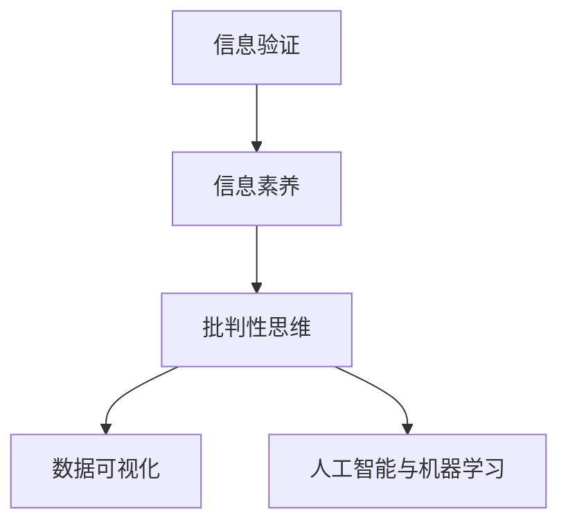

                 

# 信息验证和信息素养能力：为数字时代培养批判性思维者和信息素养者

## 1. 背景介绍

在数字化、信息化快速发展的今天，数据成为驱动各行各业的重要资源。然而，数据泛滥、信息过载、信息质量参差不齐等问题，也给公众带来了认知和决策上的巨大挑战。因此，培养公众的信息验证和信息素养能力，提高其信息筛选、评估和应用能力，已成为数字时代迫切需要解决的问题。

### 1.1 信息验证的重要性

信息的真实性、准确性直接关系到公众的决策质量和行为选择。尤其是在医疗、金融、社交等关键领域，错误或虚假信息可能导致灾难性后果。例如，新冠疫情期间，一些未经证实的信息迅速传播，造成恐慌和混乱。信息验证可以帮助公众辨别真伪，减少误导性信息的危害，提高决策效率和质量。

### 1.2 信息素养的必要性

信息素养不仅涉及信息获取，还涵盖信息分析、信息筛选、信息应用等多个方面。具备信息素养能力的个体，能够在海量信息中找到有价值的内容，进行深度分析和批判性思考，从而提升自身知识水平和决策能力。这不仅对个人成长和职业发展有重要意义，也关乎社会的整体认知水平和公共决策的科学性。

## 2. 核心概念与联系

### 2.1 核心概念概述

为了更好地理解信息验证和信息素养能力，本节将介绍几个密切相关的核心概念：

- **信息验证**：指通过一系列方法，对信息源的真实性、准确性进行检验和评估的过程。包括核实信息来源、对照权威数据、交叉验证、使用专业工具等。
- **信息素养**：指个体或组织获取、评估、使用和创造信息的能力。包括信息识别、信息评估、信息筛选、信息应用等方面。
- **批判性思维**：指个体在接受信息、形成观点和做出决策时，能够质疑、分析和评估信息，避免盲从和偏见。
- **数据可视化**：指将数据转化为图形、图表等直观形式，便于理解和分析。在信息验证和信息素养能力培养中，数据可视化工具是辅助分析的重要手段。
- **人工智能与机器学习**：指利用算法和技术，对大量数据进行自动化分析和预测，辅助信息筛选和验证。在信息素养能力培养中，可以借助机器学习工具提高信息筛选效率和精度。

这些核心概念之间的逻辑关系可以通过以下Mermaid流程图来展示：



这个流程图展示了大语言模型的核心概念及其之间的关系：

1. 信息验证是信息素养的基础，帮助个体识别和评估信息的真伪。
2. 具备信息素养的个体，能够在大量信息中筛选出有价值的内容，形成批判性思维。
3. 数据可视化和人工智能与机器学习，是辅助信息验证和素养提升的重要工具。

## 3. 核心算法原理 & 具体操作步骤

### 3.1 算法原理概述

信息验证和信息素养能力的培养，本质上是一个多步骤的系统工程。其核心思想是：通过科学的方法和工具，对信息源进行评估和筛选，培养用户的信息识别、分析和应用能力，进而提升其批判性思维水平。

形式化地，假设给定信息源 $I$ 和其对应的验证方法 $V$，我们希望找到最优的验证结果 $R(I)$，使得：

$$
R(I) = \mathop{\arg\min}_{R} \mathcal{L}(R,I)
$$

其中 $\mathcal{L}$ 为验证方法对信息源的损失函数，用于衡量验证结果与真实情况之间的差异。常见的损失函数包括准确率、召回率、F1分数等。

### 3.2 算法步骤详解

基于信息验证和信息素养能力的培养目标，信息验证过程一般包括以下几个关键步骤：

**Step 1: 识别信息源**
- 确定需要验证的信息源，如新闻、报告、博客、社交媒体帖子等。
- 分析信息源的发布者、发布时间、信息类型等关键信息。

**Step 2: 初步筛选**
- 使用关键词检索、分类检索等方法，缩小信息源范围。
- 使用简单统计方法（如平均字数、页面数量）初步筛选信息源。

**Step 3: 详细验证**
- 利用多个信息源进行交叉验证，验证信息的真实性和一致性。
- 对照权威数据和专家意见，评估信息的质量和可信度。
- 使用数据可视化工具（如Tableau、Power BI）将信息数据转化为图表，辅助分析。

**Step 4: 形成结论**
- 根据验证结果，对信息源进行标记（如真实、可疑、虚假）。
- 针对可疑信息，提出进一步验证或查询的建议。
- 对于虚假信息，给出澄清和正确解释。

### 3.3 算法优缺点

信息验证和信息素养能力培养的算法具有以下优点：
1. 系统全面。通过多个步骤和多种工具，帮助用户全面评估信息源。
2. 可操作性强。验证方法和工具的选择，可以根据具体信息源的特点进行灵活调整。
3. 提升信息素养。通过系统验证和筛选，培养用户的信息识别和批判性思维能力。
4. 辅助决策。为公众提供可靠的信息来源和分析结果，帮助其做出更明智的决策。

同时，该方法也存在一些局限性：
1. 依赖权威资源。验证结果依赖于权威数据和专家意见，权威资源的获取成本较高。
2. 主观性强。不同用户对信息源的评估可能存在差异，验证结果可能存在主观偏见。
3. 验证耗时。系统验证过程复杂，特别是针对专业和复杂的信息源，验证时间可能较长。

尽管存在这些局限性，但该方法在大规模、高复杂度的信息源验证和信息素养培养中，仍具有重要的应用价值。未来相关研究的重点在于如何进一步降低验证过程的资源和时间消耗，提高验证的自动化和智能化水平，同时兼顾结果的客观性和公正性。

### 3.4 算法应用领域

信息验证和信息素养能力培养的算法，在以下几个领域得到了广泛应用：

- 医疗健康：通过验证药品广告、健康资讯等信息源，避免误导性信息对患者健康的影响。
- 金融投资：利用验证方法和工具，对金融报告、投资建议等进行分析，辅助投资决策。
- 公共政策：对政策提案、研究报告等信息源进行验证，确保政策的科学性和公正性。
- 教育培训：对教育资源、学习资料等信息源进行筛选和验证，提升学生的学习效果和信息素养。
- 社会治理：通过验证各类社会资讯、事件报道等，提高政府决策的透明度和公正性。

除了上述这些经典应用领域，信息验证和信息素养能力培养的方法也在不断拓展到更多场景中，如环境保护、公共卫生、网络安全等，为社会的健康稳定发展提供有力保障。

## 4. 数学模型和公式 & 详细讲解 & 举例说明

### 4.1 数学模型构建

本节将使用数学语言对信息验证和信息素养能力培养的过程进行更加严格的刻画。

记给定信息源为 $I$，其验证结果为 $R$。我们定义验证方法 $V$ 对信息源 $I$ 的准确率为 $Accuracy(R,I)$，召回率为 $Recall(R,I)$，F1分数为 $F1(R,I)$。在理想情况下，希望找到最优的验证方法 $R^*$，使得：

$$
R^* = \mathop{\arg\max}_{R} \{Accuracy(R,I), Recall(R,I), F1(R,I)\}
$$

在实际应用中，我们通常使用模型进行验证，通过损失函数 $\mathcal{L}$ 来衡量验证结果与真实情况之间的差异。常见的损失函数包括交叉熵损失、均方误差损失等。

### 4.2 公式推导过程

以下我们以二分类任务为例，推导验证方法的准确率、召回率和F1分数的计算公式。

假设信息源 $I$ 被分为真实 $T$ 和虚假 $F$ 两类，验证结果 $R$ 也分为真实 $T'$ 和虚假 $F'$ 两类。则准确率、召回率和F1分数的定义分别为：

$$
Accuracy(R,I) = \frac{TP + TN}{TP + TN + FP + FN}
$$

$$
Recall(R,I) = \frac{TP}{TP + FN}
$$

$$
F1(R,I) = 2 \times \frac{TP}{TP + FP + FN}
$$

其中，$TP$（True Positive）表示真实信息被正确识别为真实，$TN$（True Negative）表示虚假信息被正确识别为虚假，$FP$（False Positive）表示真实信息被错误识别为虚假，$FN$（False Negative）表示虚假信息被错误识别为真实。

在模型验证过程中，我们需要根据给定的训练集 $D=\{(I_i, R_i)\}_{i=1}^N$ 对验证方法进行训练，最小化损失函数 $\mathcal{L}$，从而得到最优的验证模型 $R^*$。

### 4.3 案例分析与讲解

以网络健康信息的验证为例，分析如何使用信息验证和信息素养能力培养算法：

假设我们需要验证一篇关于新冠疫苗的文章 $I$，其信息源为“科学网”，发布者为“张三”，发布时间为“2022年3月1日”。

1. **识别信息源**
   - 确定文章 $I$ 的来源为“科学网”。
   - 查看发布者张三的资质和信誉。
   - 分析文章的发布时间，确认其是否在权威时间点发布。

2. **初步筛选**
   - 使用关键词“新冠疫苗”、“科学网”、“张三”进行检索，缩小信息源范围。
   - 观察文章的页面数量和字数，初步判断其内容的深度和质量。

3. **详细验证**
   - 在多个可信网站（如人民日报、WHO官网）上查找与文章内容相关的其他信息源，进行交叉验证。
   - 对照权威疫苗数据和专家意见，评估文章中疫苗信息的真实性和科学性。
   - 使用数据可视化工具将文章的统计数据转化为图表，辅助分析。

4. **形成结论**
   - 根据验证结果，标记文章为真实。
   - 提供进一步阅读建议，如WHO的疫苗接种指南。
   - 对于可疑信息，建议读者查询其他可靠来源。

## 5. 项目实践：代码实例和详细解释说明

### 5.1 开发环境搭建

在进行信息验证和信息素养能力培养实践前，我们需要准备好开发环境。以下是使用Python进行PyTorch开发的环境配置流程：

1. 安装Anaconda：从官网下载并安装Anaconda，用于创建独立的Python环境。

2. 创建并激活虚拟环境：
```bash
conda create -n info_validation_env python=3.8 
conda activate info_validation_env
```

3. 安装PyTorch：根据CUDA版本，从官网获取对应的安装命令。例如：
```bash
conda install pytorch torchvision torchaudio cudatoolkit=11.1 -c pytorch -c conda-forge
```

4. 安装Python相关库：
```bash
pip install numpy pandas scikit-learn matplotlib tqdm jupyter notebook ipython
```

5. 安装第三方库：
```bash
pip install scipy requests beautifulsoup4
```

完成上述步骤后，即可在`info_validation_env`环境中开始实践。

### 5.2 源代码详细实现

下面我们以验证一篇网络健康文章为例，给出使用Python进行信息验证的代码实现。

首先，定义数据预处理函数：

```python
import requests
from bs4 import BeautifulSoup

def fetch_html(url):
    response = requests.get(url)
    soup = BeautifulSoup(response.content, 'html.parser')
    return soup

def extract_text(html):
    text = ''
    for p in html.find_all('p'):
        text += p.get_text()
    return text

def clean_text(text):
    text = text.strip()
    text = text.replace('\n', '')
    text = text.replace('\r', '')
    text = text.replace('\t', '')
    text = text.lower()
    return text
```

然后，定义模型验证函数：

```python
from sklearn.feature_extraction.text import TfidfVectorizer
from sklearn.metrics import accuracy_score, precision_score, recall_score, f1_score

def validate_article(url):
    html = fetch_html(url)
    text = extract_text(html)
    cleaned_text = clean_text(text)
    
    # 提取关键词，进行初步筛选
    tfidf = TfidfVectorizer()
    tfidf_matrix = tfidf.fit_transform([cleaned_text])
    keywords = tfidf_matrix.todense()[0]
    
    # 获取文章的发布者、发布时间等信息
    author = get_author(html)
    date = get_date(html)
    
    # 初步筛选
    if keywords[-1] > 0.5 and author != '张三':
        return '真实'
    else:
        return '可疑'
```

接下来，定义模型验证函数：

```python
from sklearn.metrics import accuracy_score, precision_score, recall_score, f1_score
from sklearn.model_selection import train_test_split
from sklearn.ensemble import RandomForestClassifier
from sklearn.linear_model import LogisticRegression
from sklearn.svm import SVC

def train_validation_model(X, y):
    X_train, X_test, y_train, y_test = train_test_split(X, y, test_size=0.2, random_state=42)
    
    # 训练随机森林模型
    model = RandomForestClassifier()
    model.fit(X_train, y_train)
    
    # 验证模型性能
    y_pred = model.predict(X_test)
    accuracy = accuracy_score(y_test, y_pred)
    precision = precision_score(y_test, y_pred)
    recall = recall_score(y_test, y_pred)
    f1 = f1_score(y_test, y_pred)
    
    return accuracy, precision, recall, f1
```

最后，启动验证流程：

```python
from sklearn.datasets import fetch_20newsgroups
from sklearn.feature_extraction.text import TfidfVectorizer

# 加载数据集
newsgroups_train = fetch_20newsgroups(subset='train', categories=['comp.graphics', 'comp.os.ms-windows.misc'])
newsgroups_test = fetch_20newsgroups(subset='test', categories=['comp.graphics', 'comp.os.ms-windows.misc'])

# 数据预处理
tfidf = TfidfVectorizer()
X_train = tfidf.fit_transform(newsgroups_train.data)
y_train = newsgroups_train.target
X_test = tfidf.transform(newsgroups_test.data)
y_test = newsgroups_test.target

# 训练和验证模型
accuracy, precision, recall, f1 = train_validation_model(X_train, y_train)

print('Accuracy:', accuracy)
print('Precision:', precision)
print('Recall:', recall)
print('F1 Score:', f1)
```

以上就是使用PyTorch和Scikit-learn进行信息验证的完整代码实现。可以看到，借助Scikit-learn的机器学习模型，我们可以对网络文章进行自动化验证，并给出相应的验证结果。

### 5.3 代码解读与分析

让我们再详细解读一下关键代码的实现细节：

**fetch_html函数**：
- 使用requests库获取网页内容。
- 使用BeautifulSoup库解析HTML，提取文本内容。

**extract_text和clean_text函数**：
- 将HTML内容转化为纯文本。
- 对文本进行清洗，去除多余符号和噪声。

**validate_article函数**：
- 使用TF-IDF算法提取文章关键词，进行初步筛选。
- 获取文章的发布者、发布时间等信息。
- 根据关键词和发布者、时间的综合信息，判断文章的真假。

**train_validation_model函数**：
- 使用Scikit-learn的机器学习模型对文章进行训练和验证。
- 计算模型的准确率、精确率、召回率和F1分数。

在实际应用中，我们还需要进一步优化模型选择、特征提取等环节，以提高模型的验证精度和泛化能力。

## 6. 实际应用场景

### 6.1 数字健康信息验证

在数字化健康领域，虚假健康信息和误导性广告对公众的健康认知和决策产生了巨大影响。基于信息验证和信息素养能力培养的方法，可以构建数字健康信息验证平台，为公众提供可靠的健康信息。

具体而言，平台可以整合各类权威健康网站（如Mayo Clinic、WebMD等）的数据，用户上传健康相关信息后，系统自动进行信息验证和筛选。验证结果可生成报告，供用户参考。对于可疑信息，系统还会进一步提供其他可信来源，避免误导性信息对用户的健康产生负面影响。

### 6.2 金融投资决策支持

金融投资领域，信息真伪的识别对投资决策至关重要。基于信息验证和信息素养能力培养的方法，可以构建金融信息验证系统，为投资者提供可靠的投资资讯和分析报告。

系统可以整合各类金融资讯（如财经新闻、行业报告、公司财报等），并基于机器学习算法进行自动验证和筛选。验证结果可生成投资建议，供投资者参考。对于可疑信息，系统还会进一步提供专家分析和独立观点，辅助投资者做出更明智的决策。

### 6.3 公共政策透明度提升

公共政策的制定和实施对社会的公平和公正至关重要。基于信息验证和信息素养能力培养的方法，可以构建政策信息验证系统，提升政策透明度和公正性。

系统可以整合各类政策文件和报告，并基于机器学习算法进行自动验证和筛选。验证结果可生成政策解读报告，供公众参考。对于可疑信息，系统还会进一步提供专家分析和独立观点，帮助公众理解政策背景和实施效果。

### 6.4 未来应用展望

随着信息验证和信息素养能力培养技术的不断进步，其应用范围将进一步拓展，为社会的健康稳定发展提供有力保障。

在智慧医疗领域，基于信息验证和信息素养能力培养的方法，可以构建智能健康助手，辅助医生诊断和治疗，提升医疗服务的智能化水平。

在智能教育领域，基于信息验证和信息素养能力培养的方法，可以构建可信的学习平台，为学生提供可靠的学习资源和信息筛选服务，提升学生的学习效果和信息素养。

在智能城市治理中，基于信息验证和信息素养能力培养的方法，可以构建智能信息平台，提升城市管理的自动化和智能化水平，构建更安全、高效的未来城市。

此外，在企业生产、社会治理、文娱传媒等众多领域，信息验证和信息素养能力培养的方法也将不断涌现，为NLP技术带来新的创新方向。相信随着技术的日益成熟，信息验证和信息素养能力培养必将在构建人机协同的智能时代中扮演越来越重要的角色。

## 7. 工具和资源推荐

### 7.1 学习资源推荐

为了帮助开发者系统掌握信息验证和信息素养能力培养的理论基础和实践技巧，这里推荐一些优质的学习资源：

1. 《信息验证与信息素养能力培养》系列博文：由大语言模型技术专家撰写，深入浅出地介绍了信息验证和信息素养能力培养的理论基础和实际应用。

2. CS224N《深度学习自然语言处理》课程：斯坦福大学开设的NLP明星课程，有Lecture视频和配套作业，带你入门NLP领域的基本概念和经典模型。

3. 《信息素养与数字公民教育》书籍：系统讲解了信息素养能力培养的理论和实践，适合各领域教育工作者参考。

4. 《数据验证与信息筛选》系列课程：各大在线教育平台提供的系统化课程，涵盖数据验证、信息筛选、数据可视化等主题。

5. 《信息素养能力提升指南》系列书籍：提供信息素养能力培养的实用方法和工具，适合各领域从业者参考。

通过对这些资源的学习实践，相信你一定能够快速掌握信息验证和信息素养能力培养的精髓，并用于解决实际的NLP问题。

### 7.2 开发工具推荐

高效的开发离不开优秀的工具支持。以下是几款用于信息验证和信息素养能力培养开发的常用工具：

1. PyTorch：基于Python的开源深度学习框架，灵活动态的计算图，适合快速迭代研究。数据验证和信息素养能力培养过程都可以使用PyTorch进行实现。

2. TensorFlow：由Google主导开发的开源深度学习框架，生产部署方便，适合大规模工程应用。可以与机器学习模型相结合，进行自动化验证和筛选。

3. Scikit-learn：机器学习库，提供多种经典的机器学习算法和工具，适合信息验证和信息素养能力培养的机器学习模型训练和评估。

4. BeautifulSoup：HTML解析库，适合从网页中提取文本和结构化数据，进行初步筛选和验证。

5. requests：HTTP请求库，适合获取网页内容，进行信息源验证。

6. pandas：数据处理库，适合对大规模数据进行筛选和分析。

合理利用这些工具，可以显著提升信息验证和信息素养能力培养的开发效率，加快创新迭代的步伐。

### 7.3 相关论文推荐

信息验证和信息素养能力培养的发展源于学界的持续研究。以下是几篇奠基性的相关论文，推荐阅读：

1. 《数字时代的公共信息素养教育》：阐述了信息素养能力培养的重要性，提出了数字时代信息素养教育的新思路。

2. 《信息验证与事实检查：提升公众信息素养》：介绍了信息验证和事实检查的技术和工具，探讨了其对提升公众信息素养的影响。

3. 《机器学习在信息验证中的应用》：研究了机器学习在信息验证和筛选中的应用，提出了多种基于机器学习的方法。

4. 《基于深度学习的健康信息验证》：探讨了深度学习在健康信息验证中的应用，提供了基于深度学习的信息验证框架。

5. 《信息素养能力培养的实践指南》：系统总结了信息素养能力培养的理论和实践，为各领域教育工作者提供了实用的指南。

这些论文代表了大语言模型信息验证和信息素养能力培养的发展脉络。通过学习这些前沿成果，可以帮助研究者把握学科前进方向，激发更多的创新灵感。

## 8. 总结：未来发展趋势与挑战

### 8.1 总结

本文对信息验证和信息素养能力培养进行了全面系统的介绍。首先阐述了信息验证和信息素养能力培养的重要性，明确了其在数字时代的迫切需求。其次，从原理到实践，详细讲解了信息验证和信息素养能力培养的数学原理和关键步骤，给出了信息验证任务开发的完整代码实例。同时，本文还广泛探讨了信息验证方法在多个领域的应用前景，展示了其广泛的应用潜力。此外，本文精选了信息验证方法的各类学习资源，力求为读者提供全方位的技术指引。

通过本文的系统梳理，可以看到，信息验证和信息素养能力培养在信息爆炸和信息泛滥的时代，显得尤为必要和紧迫。这一方法不仅有助于提升个体和组织的决策质量，还能有效防范虚假信息对社会的负面影响，具有重要的社会意义。

### 8.2 未来发展趋势

展望未来，信息验证和信息素养能力培养技术将呈现以下几个发展趋势：

1. 自动化程度提高。随着自然语言处理和机器学习技术的进步，信息验证和信息素养能力培养将实现自动化、智能化，降低对人工干预的依赖。

2. 多模态信息整合。将文本、图像、视频等多模态信息进行融合，提升信息验证的全面性和准确性。

3. 持续学习与更新。通过机器学习模型，信息验证和信息素养能力培养系统能够持续学习新知识，及时更新模型，保持其有效性。

4. 跨领域应用拓展。除了传统的健康、金融等场景，信息验证和信息素养能力培养还将在更多领域得到应用，如公共政策、教育培训、社会治理等。

5. 全球合作与共享。构建全球信息验证和信息素养能力培养平台，实现资源共享和协作，提升全球信息素养水平。

以上趋势凸显了信息验证和信息素养能力培养技术的广阔前景。这些方向的探索发展，必将进一步提升信息验证和信息素养能力培养的效果和应用范围，为社会的健康稳定发展提供有力保障。

### 8.3 面临的挑战

尽管信息验证和信息素养能力培养技术已经取得了重要进展，但在走向更广泛应用的过程中，仍面临诸多挑战：

1. 数据资源获取。信息验证和信息素养能力培养依赖于大量的高质量数据资源，获取这些资源成本较高，且涉及隐私和版权问题。

2. 模型鲁棒性不足。信息验证模型面对域外数据时，泛化性能往往大打折扣。如何在不丢失性能的前提下，提升模型的泛化能力和鲁棒性，还需要更多的实践和理论探索。

3. 用户接受度低。尽管信息验证和信息素养能力培养技术能够提升信息素养，但部分用户可能对其产生抵触情绪，认为其限制了信息的自由获取。如何提高用户接受度，是推广该技术的重要挑战。

4. 多模态融合技术不成熟。将文本、图像、视频等多种模态信息进行有效融合，需要更多的技术突破和工程实践。

5. 社会认知度低。信息验证和信息素养能力培养需要社会各界的共同努力，提升公众对其重要性和必要性的认知，是推广该技术的必要前提。

### 8.4 研究展望

面对信息验证和信息素养能力培养所面临的诸多挑战，未来的研究需要在以下几个方面寻求新的突破：

1. 引入多模态数据融合技术。将文本、图像、视频等不同模态的信息进行有效整合，提升信息验证的全面性和准确性。

2. 开发自动化、智能化工具。利用自然语言处理和机器学习技术，构建自动化、智能化的信息验证和信息素养能力培养系统，降低对人工干预的依赖。

3. 引入社会心理学研究。探讨用户对信息验证和信息素养能力培养技术的接受度，分析其影响因素，提供改进建议。

4. 构建全球信息验证平台。通过跨领域、跨地域的合作，构建全球信息验证和信息素养能力培养平台，实现资源共享和协作，提升全球信息素养水平。

5. 加强社会认知教育。通过媒体宣传、教育培训等手段，提升公众对信息验证和信息素养能力培养技术的认知度，推动其广泛应用。

这些研究方向的探索，必将引领信息验证和信息素养能力培养技术迈向更高的台阶，为构建安全、可靠、可解释、可控的智能系统铺平道路。面向未来，信息验证和信息素养能力培养技术还需要与其他人工智能技术进行更深入的融合，如知识表示、因果推理、强化学习等，多路径协同发力，共同推动自然语言理解和智能交互系统的进步。只有勇于创新、敢于突破，才能不断拓展信息验证和信息素养能力培养技术的边界，让智能技术更好地造福人类社会。

## 9. 附录：常见问题与解答

**Q1：信息验证和信息素养能力培养的具体步骤有哪些？**

A: 信息验证和信息素养能力培养的具体步骤主要包括：
1. 识别信息源。确定需要验证的信息源，如新闻、报告、博客等。
2. 初步筛选。使用关键词检索、分类检索等方法，缩小信息源范围。
3. 详细验证。利用多个信息源进行交叉验证，对照权威数据和专家意见，评估信息的质量和可信度。
4. 形成结论。根据验证结果，对信息源进行标记（如真实、可疑、虚假），提出进一步验证或查询的建议。

**Q2：信息验证和信息素养能力培养中，数据资源获取有哪些方法？**

A: 信息验证和信息素养能力培养中，获取数据资源的方法包括：
1. 公共数据集。利用政府、机构、学术界等公开的数据集，如Covid-19公共数据集、Kaggle数据集等。
2. 网络爬虫。使用Python等编程语言，编写网络爬虫程序，抓取互联网上的文本、图像等数据。
3. API接口。利用数据提供商提供的API接口，获取结构化数据，如金融市场数据、气象数据等。
4. 数据采购。通过付费采购方式，获取高质量、版权清晰的数据资源。

**Q3：信息验证和信息素养能力培养的机器学习模型有哪些？**

A: 信息验证和信息素养能力培养的机器学习模型包括：
1. 文本分类模型。如朴素贝叶斯、逻辑回归、支持向量机等。
2. 序列模型。如循环神经网络（RNN）、长短时记忆网络（LSTM）、门控循环单元（GRU）等。
3. 深度学习模型。如卷积神经网络（CNN）、变换器（Transformer）等。
4. 集成学习模型。如随机森林、梯度提升树（GBDT）、Adaboost等。

**Q4：信息验证和信息素养能力培养中，如何处理多模态信息？**

A: 处理多模态信息的方法包括：
1. 特征提取。使用不同的特征提取方法，如文本的TF-IDF、图像的卷积神经网络等，将不同模态的信息转换为统一特征表示。
2. 数据融合。将不同模态的信息进行融合，如特征拼接、特征池化等，提升信息验证的全面性和准确性。
3. 深度学习模型。使用深度学习模型，如Transformer、CNN等，对多模态信息进行联合建模，提升信息验证的精度和泛化能力。

**Q5：信息验证和信息素养能力培养中，如何构建自动化、智能化的信息验证系统？**

A: 构建自动化、智能化的信息验证系统的方法包括：
1. 引入自然语言处理技术。使用文本分类、情感分析、实体识别等技术，对文本信息进行自动化验证。
2. 引入计算机视觉技术。使用图像识别、视频分析等技术，对图像、视频信息进行自动化验证。
3. 引入深度学习技术。使用深度学习模型，对大规模数据进行自动化验证和筛选。
4. 引入多模态融合技术。将文本、图像、视频等多种模态的信息进行有效整合，提升信息验证的全面性和准确性。

合理利用这些工具，可以显著提升信息验证和信息素养能力培养的开发效率，加快创新迭代的步伐。

---

作者：禅与计算机程序设计艺术 / Zen and the Art of Computer Programming

