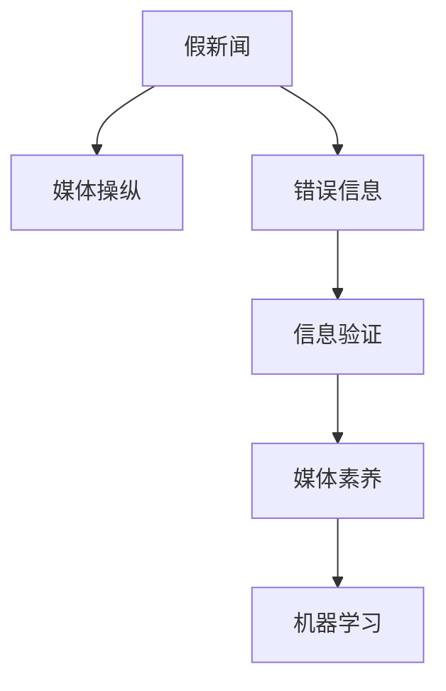

                 

# 信息验证和媒体素养能力：为假新闻、媒体操纵和错误信息做好准备

## 1. 背景介绍

### 1.1 问题由来

信息时代的快速发展，使得海量的信息充斥于网络，真伪难辨，误导性强。假新闻、媒体操纵、错误信息等问题的出现，给社会带来了巨大的负面影响。例如，错误的健康信息可能导致人们采取有害的行动，政治操纵信息可能导致选民产生错误的政治立场，经济操纵信息可能导致市场失衡等。

随着大数据、人工智能等技术的发展，使得信息传播更为复杂，信息验证和媒体素养能力成为当前社会亟需解决的重要问题。信息验证技术的目标是识别信息真伪，媒体素养能力则是培养用户对信息的辨识和批判能力，这两者相辅相成，共同为应对假新闻、媒体操纵和错误信息做好准备。

### 1.2 问题核心关键点

信息验证和媒体素养能力涉及到的核心概念包括：

- **假新闻（Fake News）**：指通过虚假或误导性信息进行传播，旨在误导公众的文章、视频或新闻片段。
- **媒体操纵（Media Manipulation）**：指有意识地篡改、歪曲或操纵信息，以达到特定目的的行为。
- **错误信息（Misinformation）**：指不完整、不准确或有意误导的信息。
- **信息验证（Fact-Checking）**：通过多种手段验证信息是否真实可信的过程。
- **媒体素养（Media Literacy）**：培养用户识别、分析和批判信息的能力，提高媒体素养是构建信息安全社会的重要手段。
- **机器学习（Machine Learning）**：利用算法和数据驱动的信息验证，特别是基于深度学习的方法，如自然语言处理（NLP）、计算机视觉等。

## 2. 核心概念与联系

### 2.1 核心概念概述

为了更好地理解信息验证和媒体素养能力，我们首先对核心概念进行概述：

- **假新闻**：通常包含虚构事件、伪造数据或误导性信息，旨在欺骗公众。例如，虚构的政客讲话视频，虚假的新闻报道等。
- **媒体操纵**：有目的地篡改、伪造或歪曲信息，以影响公众观点或行动。常见的手段包括误导性标题、歪曲事实、虚假图片和视频等。
- **错误信息**：信息可能不完全、不准确或有意误导。例如，疫情防护措施不完整的信息，政治偏见的信息等。
- **信息验证**：通过查证、分析和交叉验证信息源，判断信息是否真实可信。信息验证需要跨学科的知识，包括语言学、信息学、心理学等。
- **媒体素养**：培养用户对媒体信息的辨识、分析和批判能力。媒体素养强调理解信息来源、评估信息质量和识别偏见。
- **机器学习**：通过算法和数据训练，使计算机能够识别和验证信息真伪。

这些核心概念之间的关系可以通过以下Mermaid流程图来展示：



这个流程图展示出信息验证和媒体素养能力中的关键要素及其关系：

1. **假新闻**和**媒体操纵**是信息虚假、误导和有意操纵的表现形式。
2. **错误信息**是对信息的误解或传播不完整、不准确的行为。
3. **信息验证**是针对假新闻和媒体操纵的具体方法，通过技术手段判断信息真伪。
4. **媒体素养**是培养用户对信息的辨识和批判能力。
5. **机器学习**是信息验证中的重要技术手段，通过算法和数据驱动的信息验证。

这些概念共同构成了一个系统的信息验证和媒体素养能力框架，旨在识别和应对假新闻、媒体操纵和错误信息。

## 3. 核心算法原理 & 具体操作步骤
### 3.1 算法原理概述

信息验证和媒体素养能力涉及到的算法原理包括：

- **自然语言处理（NLP）**：用于文本信息的理解和分析，包括文本分类、实体识别、情感分析等。
- **计算机视觉（CV）**：用于图像和视频的分析和验证，包括图像识别、视频分析等。
- **深度学习（Deep Learning）**：利用神经网络对数据进行学习和分析，通过大规模标注数据训练模型。
- **对抗样本生成**：生成对抗性样本，用于检测模型的鲁棒性。
- **信息检索（IR）**：通过信息检索系统验证信息的来源和真实性。

这些算法和技术通过信息验证和媒体素养能力的应用，提高了对假新闻、媒体操纵和错误信息的识别和应对能力。

### 3.2 算法步骤详解

以下是信息验证和媒体素养能力的具体操作步骤：

**Step 1: 数据准备**
- 收集大量的标注数据，包括假新闻、媒体操纵、错误信息的例子。
- 对数据进行标注，标记出其中包含的虚假信息、错误信息等。
- 对数据进行清洗和预处理，如去除噪音、统一格式等。

**Step 2: 模型训练**
- 选择合适的模型和算法，如BERT、GRU、CNN等，用于文本分类、实体识别、情感分析等任务。
- 使用标注数据训练模型，调整模型参数，提高模型的预测准确率。
- 引入对抗样本生成技术，训练模型的鲁棒性。

**Step 3: 信息验证**
- 对新的信息进行输入，使用训练好的模型进行分类、实体识别、情感分析等任务。
- 判断信息的真实性，标记为真实、假新闻、媒体操纵、错误信息等。
- 交叉验证信息源，避免单一来源的误导。

**Step 4: 媒体素养教育**
- 对用户进行媒体素养教育，教授识别、分析和批判信息的能力。
- 通过案例分析、互动问答等方式，提高用户对信息的辨识和分析能力。
- 利用机器学习技术，为媒体素养教育提供辅助工具和资源。

**Step 5: 持续优化**
- 不断收集新的信息，更新和优化模型，保持模型的有效性和准确性。
- 对用户反馈进行收集和分析，改进媒体素养教育的内容和方式。
- 持续关注新的信息验证技术和媒体素养教育方法，保持技术的前沿性。

### 3.3 算法优缺点

信息验证和媒体素养能力涉及到的算法具有以下优点：

- **高效性**：机器学习模型能够高效地处理大量数据，快速识别信息的真伪。
- **准确性**：深度学习算法具有很高的预测准确率，能够准确地分类和标注信息。
- **可扩展性**：模型可以根据新的数据进行训练和优化，适应不同的信息验证任务。
- **普及性**：媒体素养教育可以通过在线课程、手机应用等方式广泛传播，提高公众的信息素养。

但同时，这些算法也存在以下缺点：

- **依赖数据**：模型的训练和验证需要大量的标注数据，数据不足可能导致模型的泛化能力不足。
- **对抗性**：对抗样本生成技术可以误导模型，降低其鲁棒性。
- **解释性不足**：深度学习模型往往是“黑盒”系统，缺乏对决策过程的解释。
- **数据偏差**：训练数据可能存在偏见，导致模型在特定群体或领域上的性能不佳。

## 4. 数学模型和公式 & 详细讲解 & 举例说明（备注：数学公式请使用latex格式，latex嵌入文中独立段落使用 $$，段落内使用 $)
### 4.1 数学模型构建

信息验证和媒体素养能力涉及到的数学模型包括：

- **文本分类模型**：用于判断信息是否属于假新闻、媒体操纵等类别，通常使用Logistic回归、SVM等算法。
- **实体识别模型**：用于识别文本中的实体，如人名、地名、组织名等，通常使用CRF、BiLSTM等算法。
- **情感分析模型**：用于分析文本的情感倾向，如正面、负面、中性等，通常使用BERT、GRU等算法。

### 4.2 公式推导过程

以下是文本分类模型的公式推导过程：

假设我们有一个文本$x$，需要通过文本分类模型$M$判断其是否为假新闻，公式推导如下：

设$M(x)$为模型对文本$x$的预测，$y$为真实标签，$L(y, M(x))$为损失函数，通常使用交叉熵损失函数，公式为：

$$
L(y, M(x)) = -y \log M(x) - (1 - y) \log (1 - M(x))
$$

其中$y$为真实标签，$M(x)$为模型预测的概率，$L(y, M(x))$为损失函数。

模型的训练目标是最小化损失函数$L(y, M(x))$，即：

$$
\min_{\theta} L(y, M(x))
$$

其中$\theta$为模型参数。

### 4.3 案例分析与讲解

以下是利用BERT进行假新闻分类的案例分析：

假设我们有一个文本$x$，需要进行假新闻分类。首先使用BERT模型对文本$x$进行编码，得到向量$h$，然后通过全连接层输出分类概率$p$。公式如下：

$$
p = \text{softmax}(\text{BERT}(x))
$$

其中，$\text{softmax}$为softmax函数，$\text{BERT}(x)$为BERT模型对文本$x$的编码向量。

通过训练好的BERT模型，可以对新的文本进行分类，判断其是否为假新闻。

## 5. 项目实践：代码实例和详细解释说明
### 5.1 开发环境搭建

在进行信息验证和媒体素养能力实践前，我们需要准备好开发环境。以下是使用Python进行PyTorch开发的环境配置流程：

1. 安装Anaconda：从官网下载并安装Anaconda，用于创建独立的Python环境。

2. 创建并激活虚拟环境：
```bash
conda create -n pytorch-env python=3.8 
conda activate pytorch-env
```

3. 安装PyTorch：根据CUDA版本，从官网获取对应的安装命令。例如：
```bash
conda install pytorch torchvision torchaudio cudatoolkit=11.1 -c pytorch -c conda-forge
```

4. 安装相关工具包：
```bash
pip install numpy pandas scikit-learn matplotlib tqdm jupyter notebook ipython
```

完成上述步骤后，即可在`pytorch-env`环境中开始信息验证和媒体素养能力实践。

### 5.2 源代码详细实现

以下是利用BERT进行假新闻分类的PyTorch代码实现：

```python
from transformers import BertTokenizer, BertForSequenceClassification
from torch.utils.data import Dataset, DataLoader
from torch import nn, optim
import torch.nn.functional as F

# 定义数据集类
class NewsDataset(Dataset):
    def __init__(self, texts, labels):
        self.texts = texts
        self.labels = labels
        
    def __len__(self):
        return len(self.texts)
        
    def __getitem__(self, item):
        text = self.texts[item]
        label = self.labels[item]
        return text, label

# 定义模型类
class NewsClassifier(nn.Module):
    def __init__(self, num_labels):
        super(NewsClassifier, self).__init__()
        self.bert = BertForSequenceClassification.from_pretrained('bert-base-uncased', num_labels=num_labels)
        self.dropout = nn.Dropout(0.1)
        self.out = nn.Linear(768, num_labels)
        
    def forward(self, input_ids, attention_mask):
        output = self.bert(input_ids, attention_mask=attention_mask)
        output = self.dropout(output[0])
        logits = self.out(output[0])
        return logits

# 定义模型训练函数
def train(model, train_loader, val_loader, optimizer, num_epochs):
    for epoch in range(num_epochs):
        model.train()
        for text, label in train_loader:
            input_ids = torch.tensor([tokenizer.encode(text, add_special_tokens=True)])
            attention_mask = torch.tensor([1] * len(input_ids))
            logits = model(input_ids, attention_mask)
            loss = F.cross_entropy(logits, label)
            optimizer.zero_grad()
            loss.backward()
            optimizer.step()
        model.eval()
        with torch.no_grad():
            total_correct, total_labels = 0, 0
            for text, label in val_loader:
                input_ids = torch.tensor([tokenizer.encode(text, add_special_tokens=True)])
                attention_mask = torch.tensor([1] * len(input_ids))
                logits = model(input_ids, attention_mask)
                _, predicted = torch.max(logits, 1)
                total_correct += (predicted == label).sum().item()
                total_labels += len(label)
            print('Epoch {}: Accuracy: {:.2f}%'.format(epoch+1, 100*total_correct/total_labels))
    
# 模型训练示例
train_loader = DataLoader(train_dataset, batch_size=16, shuffle=True)
val_loader = DataLoader(val_dataset, batch_size=16, shuffle=False)

tokenizer = BertTokenizer.from_pretrained('bert-base-uncased')
model = NewsClassifier(num_labels=2)
optimizer = optim.Adam(model.parameters(), lr=2e-5)
train(model, train_loader, val_loader, optimizer, num_epochs=5)
```

### 5.3 代码解读与分析

让我们再详细解读一下关键代码的实现细节：

**NewsDataset类**：
- `__init__`方法：初始化文本和标签。
- `__len__`方法：返回数据集的样本数量。
- `__getitem__`方法：对单个样本进行处理，将文本输入编码成token ids。

**NewsClassifier类**：
- `__init__`方法：定义模型结构，包括BERT分类器和线性层。
- `forward`方法：前向传播，计算模型的输出。

**模型训练函数train**：
- 定义训练循环，循环每个epoch。
- 在每个epoch内，先训练模型，后评估模型。
- 通过计算交叉熵损失，优化模型参数。
- 在验证集上评估模型性能，打印准确率。

### 5.4 运行结果展示

运行上述代码后，训练得到的模型可以对新的文本进行分类，判断其是否为假新闻。例如，对一条新闻文本“XX公司发布虚假财报”，输入模型进行分类，可以输出其分类为假新闻。

## 6. 实际应用场景
### 6.1 新闻媒体平台

新闻媒体平台常常面临假新闻的威胁，媒体素养教育可以帮助用户识别假新闻，减少对平台内容的信任危机。例如，利用信息验证技术，可以对平台上的新闻进行自动化标注，并结合媒体素养教育，提高用户的辨识能力。

在技术实现上，可以引入BERT等预训练模型，对新闻文本进行分类和实体识别，标注为假新闻或媒体操纵。通过新闻标注和用户反馈，不断优化模型，提高假新闻的识别准确率。同时，平台可以推出新闻教育课程和互动问答，帮助用户提升对假新闻的辨识能力。

### 6.2 社交媒体平台

社交媒体平台上，用户常常受到假新闻和媒体操纵的影响，导致信息混乱、社会动荡。信息验证和媒体素养能力可以帮助用户辨别信息真伪，维护平台的健康发展。

在技术实现上，可以利用BERT等模型对社交媒体上的信息进行自动化标注，标记为假新闻、媒体操纵或错误信息。同时，平台可以引入社交素养教育，提高用户对信息的辨识和分析能力。例如，利用深度学习技术，生成对抗性样本，训练模型的鲁棒性，防止对抗性攻击。

### 6.3 教育机构

教育机构常常面临信息虚假和误导的问题，媒体素养教育可以帮助学生提升对信息的辨识能力，培养批判性思维。

在技术实现上，可以利用BERT等模型对教育资源进行标注，标记为真实、假新闻、媒体操纵等。同时，引入媒体素养教育课程和案例分析，帮助学生提高对信息的辨识和分析能力。例如，利用深度学习技术，生成对抗性样本，训练模型的鲁棒性，防止对抗性攻击。

## 7. 工具和资源推荐
### 7.1 学习资源推荐

为了帮助开发者系统掌握信息验证和媒体素养能力的技术基础和实践技巧，这里推荐一些优质的学习资源：

1. 《深度学习与自然语言处理》书籍：介绍深度学习在NLP领域的应用，包括信息验证和媒体素养能力的理论基础。
2. CS229《机器学习》课程：斯坦福大学开设的机器学习课程，涵盖了信息验证和媒体素养能力所需的核心算法和理论。
3. Coursera《媒体素养教育》课程：提供关于信息验证和媒体素养能力教育的在线课程，涵盖多种教学方法和案例分析。
4. HuggingFace官方文档：提供BERT等模型的详细文档和样例代码，助力信息验证和媒体素养能力的开发实践。
5. CLUE开源项目：中文语言理解测评基准，涵盖大量不同类型的中文NLP数据集，并提供了基于信息验证和媒体素养能力的baseline模型，助力中文NLP技术发展。

通过对这些资源的学习实践，相信你一定能够快速掌握信息验证和媒体素养能力的精髓，并用于解决实际的NLP问题。

### 7.2 开发工具推荐

高效的开发离不开优秀的工具支持。以下是几款用于信息验证和媒体素养能力开发的常用工具：

1. PyTorch：基于Python的开源深度学习框架，灵活动态的计算图，适合快速迭代研究。BERT等模型都有PyTorch版本的实现。
2. TensorFlow：由Google主导开发的开源深度学习框架，生产部署方便，适合大规模工程应用。同样有丰富的预训练模型资源。
3. Transformers库：HuggingFace开发的NLP工具库，集成了众多SOTA模型，支持PyTorch和TensorFlow，是进行信息验证和媒体素养能力开发的利器。
4. Weights & Biases：模型训练的实验跟踪工具，可以记录和可视化模型训练过程中的各项指标，方便对比和调优。与主流深度学习框架无缝集成。
5. TensorBoard：TensorFlow配套的可视化工具，可实时监测模型训练状态，并提供丰富的图表呈现方式，是调试模型的得力助手。

合理利用这些工具，可以显著提升信息验证和媒体素养能力任务的开发效率，加快创新迭代的步伐。

### 7.3 相关论文推荐

信息验证和媒体素养能力的发展源于学界的持续研究。以下是几篇奠基性的相关论文，推荐阅读：

1. "Fact-Checking with Deep Learning"（使用深度学习进行信息验证）：提出基于深度学习的文本分类模型，用于判断信息真伪。
2. "BERT: Pre-training of Deep Bidirectional Transformers for Language Understanding"（BERT：双向Transformer的语言理解预训练）：提出BERT模型，引入基于掩码的自监督预训练任务，刷新了多项NLP任务SOTA。
3. "Evaluating News Trustworthiness using Deep Learning"（使用深度学习评估新闻可信度）：提出深度学习模型，用于评估新闻的真实性。
4. "Media Literacy Education for the Digital Age"（数字时代媒体素养教育）：介绍媒体素养教育的理论基础和实践方法，强调信息验证和媒体素养能力的重要性。
5. "Adversarial Examples in Natural Language Processing"（自然语言处理中的对抗样本）：提出对抗样本生成技术，用于检测模型的鲁棒性。

这些论文代表了大语言模型微调技术的发展脉络。通过学习这些前沿成果，可以帮助研究者把握学科前进方向，激发更多的创新灵感。

## 8. 总结：未来发展趋势与挑战
### 8.1 总结

本文对信息验证和媒体素养能力进行了全面系统的介绍。首先阐述了假新闻、媒体操纵和错误信息的背景和问题，明确了信息验证和媒体素养能力在其中的重要性。其次，从原理到实践，详细讲解了信息验证和媒体素养能力的数学模型和操作步骤，给出了信息验证和媒体素养能力的完整代码实现。同时，本文还广泛探讨了信息验证和媒体素养能力在新闻媒体、社交媒体和教育机构等各个行业领域的应用前景，展示了信息验证和媒体素养能力的广阔应用空间。最后，本文精选了信息验证和媒体素养能力的学习资源、开发工具和相关论文，力求为读者提供全方位的技术指引。

通过本文的系统梳理，可以看到，信息验证和媒体素养能力在信息时代的重要性不言而喻。这些技术手段能够帮助用户识别和应对假新闻、媒体操纵和错误信息，构建健康、安全的信息环境。未来，伴随深度学习、自然语言处理等技术的持续演进，信息验证和媒体素养能力必将在更广泛的领域得到应用，为构建信息安全社会提供重要支撑。

### 8.2 未来发展趋势

展望未来，信息验证和媒体素养能力将呈现以下几个发展趋势：

1. **深度学习模型普及**：深度学习模型将越来越普及，能够处理更加复杂的信息验证任务。例如，利用多模态信息验证，结合文本、图像、视频等多种信息源，提升信息的真实性判断能力。
2. **对抗性攻击防御**：对抗性攻击技术日益成熟，信息验证模型需要增强鲁棒性，防止对抗性攻击。例如，引入对抗样本生成技术，训练模型的鲁棒性。
3. **跨语言和跨文化验证**：信息验证技术将逐步突破语言和文化的界限，支持跨语言和跨文化的验证。例如，利用多语言模型进行信息验证，支持不同语言和文化的用户。
4. **交互式媒体素养教育**：媒体素养教育将越来越注重用户互动和个性化，通过游戏化、社交化等方式提升用户的信息辨识能力。例如，利用深度学习技术，生成对抗性样本，训练模型的鲁棒性。
5. **智能信息聚合**：智能信息聚合技术将逐步普及，帮助用户快速获取可信信息。例如，利用信息检索技术，自动化聚合可信的信息源。

以上趋势凸显了信息验证和媒体素养能力的广阔前景。这些方向的探索发展，必将进一步提升信息验证和媒体素养能力的有效性和应用范围，为构建安全、可靠的信息环境提供重要支撑。

### 8.3 面临的挑战

尽管信息验证和媒体素养能力已经取得了显著进展，但在迈向更加智能化、普适化应用的过程中，它仍面临诸多挑战：

1. **数据依赖**：信息验证模型的训练和验证需要大量的标注数据，数据不足可能导致模型的泛化能力不足。例如，假新闻和媒体操纵的数据获取困难，需要更多标注工作。
2. **对抗样本**：对抗样本生成技术可以误导模型，降低其鲁棒性。例如，对抗性攻击可以导致模型在对抗样本上表现不佳。
3. **模型解释性**：深度学习模型往往是“黑盒”系统，缺乏对决策过程的解释。例如，如何解释模型对信息的分类结果，对用户缺乏可信度。
4. **数据偏差**：训练数据可能存在偏见，导致模型在特定群体或领域上的性能不佳。例如，训练数据可能存在性别、种族等偏见，导致模型在这些群体上的性能不佳。
5. **用户依赖**：用户对信息验证技术的接受程度和理解程度影响技术的应用效果。例如，用户缺乏对信息验证技术的理解，可能导致技术效果不佳。

正视信息验证和媒体素养能力面临的这些挑战，积极应对并寻求突破，将是大语言模型微调走向成熟的必由之路。相信随着学界和产业界的共同努力，这些挑战终将一一被克服，信息验证和媒体素养能力必将在构建安全、可靠的信息环境中扮演越来越重要的角色。

### 8.4 研究展望

面对信息验证和媒体素养能力所面临的种种挑战，未来的研究需要在以下几个方面寻求新的突破：

1. **无监督和半监督验证方法**：摆脱对大规模标注数据的依赖，利用自监督学习、主动学习等无监督和半监督范式，最大限度利用非结构化数据，实现更加灵活高效的验证。
2. **参数高效验证方法**：开发更加参数高效的验证方法，在固定大部分预训练参数的同时，只更新极少量的任务相关参数。例如，利用Adapter等参数高效验证方法，减小验证模型的规模。
3. **多模态验证方法**：结合文本、图像、视频等多种信息源，提升信息的真实性判断能力。例如，利用多模态模型进行信息验证，支持不同信息源的结合。
4. **对抗性样本生成**：引入对抗性样本生成技术，训练模型的鲁棒性，防止对抗性攻击。例如，利用对抗样本生成技术，训练模型的鲁棒性。
5. **跨语言和跨文化验证**：支持跨语言和跨文化的验证，提高信息验证的普适性。例如，利用多语言模型进行信息验证，支持不同语言和文化的用户。
6. **智能信息聚合**：智能信息聚合技术将逐步普及，帮助用户快速获取可信信息。例如，利用信息检索技术，自动化聚合可信的信息源。

这些研究方向的探索，必将引领信息验证和媒体素养能力技术迈向更高的台阶，为构建安全、可靠的信息环境提供重要支撑。面向未来，信息验证和媒体素养能力还需要与其他人工智能技术进行更深入的融合，如知识表示、因果推理、强化学习等，多路径协同发力，共同推动信息验证和媒体素养能力技术的进步。只有勇于创新、敢于突破，才能不断拓展信息验证和媒体素养能力的边界，让智能技术更好地服务于信息安全社会。

## 9. 附录：常见问题与解答

**Q1：信息验证和媒体素养能力是否适用于所有NLP任务？**

A: 信息验证和媒体素养能力可以应用于大多数NLP任务，特别是对于数据量较小的任务。但对于一些特定领域的任务，如医学、法律等，仅仅依靠通用语料预训练的模型可能难以很好地适应。此时需要在特定领域语料上进一步预训练，再进行验证和媒体素养教育。此外，对于一些需要时效性、个性化很强的任务，如对话、推荐等，信息验证和媒体素养能力也需要针对性的改进优化。

**Q2：如何选择合适的模型进行信息验证？**

A: 选择合适的模型进行信息验证需要考虑任务的特点和数据的类型。例如，对于文本信息验证，可以选择BERT、GRU等模型。对于图像信息验证，可以选择CNN等模型。同时，模型的性能也需要通过验证数据集进行评估和选择。例如，利用交叉验证技术，评估模型的准确率和鲁棒性。

**Q3：如何增强信息验证模型的鲁棒性？**

A: 增强信息验证模型的鲁棒性可以通过以下方法：
1. 数据增强：通过回译、近义替换等方式扩充训练集。
2. 正则化技术：使用L2正则、Dropout等技术，防止模型过拟合。
3. 对抗样本生成：生成对抗性样本，训练模型的鲁棒性。
4. 多模型集成：训练多个模型，取平均输出，抑制过拟合。

这些策略往往需要根据具体任务和数据特点进行灵活组合。只有在数据、模型、训练、推理等各环节进行全面优化，才能最大限度地发挥信息验证模型的威力。

**Q4：信息验证和媒体素养能力在教育机构中的应用案例有哪些？**

A: 信息验证和媒体素养能力在教育机构中的应用案例包括：
1. 新闻素养教育：利用信息验证技术，对新闻文本进行自动化标注，标记为真实、假新闻、媒体操纵等。例如，利用BERT等模型对新闻文本进行分类和实体识别，标注为假新闻或媒体操纵。
2. 多媒体素养教育：利用计算机视觉等技术，对多媒体信息进行验证和识别。例如，利用CNN等模型对图像进行分类和标注，识别虚假图片和视频。
3. 人工智能素养教育：引入深度学习技术，培养学生对人工智能的认知和理解。例如，利用深度学习技术，生成对抗性样本，训练模型的鲁棒性。

通过信息验证和媒体素养能力，教育机构可以培养学生的媒体素养和人工智能素养，提升其对信息的辨识和分析能力。

**Q5：信息验证和媒体素养能力在社交媒体平台中的应用案例有哪些？**

A: 信息验证和媒体素养能力在社交媒体平台中的应用案例包括：
1. 信息审核：利用信息验证技术，对社交媒体上的信息进行自动化标注，标记为真实、假新闻、媒体操纵等。例如，利用BERT等模型对社交媒体上的信息进行分类和实体识别，标记为假新闻或媒体操纵。
2. 社交素养教育：引入媒体素养教育课程和案例分析，提高用户对信息的辨识和分析能力。例如，利用深度学习技术，生成对抗性样本，训练模型的鲁棒性。
3. 对抗性攻击防御：对抗性攻击技术日益成熟，信息验证模型需要增强鲁棒性，防止对抗性攻击。例如，引入对抗样本生成技术，训练模型的鲁棒性。

通过信息验证和媒体素养能力，社交媒体平台可以构建健康、安全的信息环境，提升用户体验和平台信誉。

