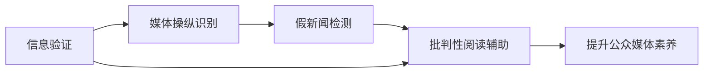

                 

## 1. 背景介绍

在信息爆炸的互联网时代，假新闻、误导性信息和媒体操纵无处不在，严重影响了公众对于真实世界的认知。传统的新闻核实方式已无法满足社会对于信息验证的迫切需求。计算机科学和人工智能技术的迅猛发展，为信息验证和批判性阅读带来了新的可能。

### 1.1 问题由来
假新闻和误导性信息的泛滥，加剧了社会分化，破坏了公众对于政府、企业和媒体的信任，甚至在某些场合引发了社会动荡。对此，国际媒体、学术界和政府都在呼吁构建一套有效的信息验证和批判性阅读机制，以提升公民的媒体素养。

媒体行业内部的自我净化也面临挑战。传统媒体由于成本压力，难以对每一条信息进行详细的核实。随着社交媒体的崛起，自媒体、网络新闻的传播渠道更加多样和复杂，也对信息核实工作带来了新的难度。

### 1.2 问题核心关键点
当前信息验证的核心问题包括：
- 如何高效自动化地辨别信息真伪？
- 如何通过算法构建可信的传播模型？
- 如何在批判性阅读中引入人工智能辅助？
- 如何结合多模态数据（文字、图像、音频等）验证信息？

要解答这些问题，需要跨学科合作，结合计算机科学、统计学、传媒学和心理学等多个领域的知识，探索前沿技术解决方案。

### 1.3 问题研究意义
在假新闻和媒体操纵泛滥的今天，通过计算机科学和人工智能技术实现信息验证和批判性阅读，将提升公众的信息素养，增强媒体的透明度，对于构建信任、维护社会稳定具有重要意义。同时，该领域的研究也具有广阔的学术价值，有助于推动计算社会学、数据挖掘与知识发现等领域的发展。

## 2. 核心概念与联系

### 2.1 核心概念概述

要理解信息验证和批判性阅读，首先需要明确几个关键概念：

- **信息验证**：通过计算机科学和人工智能技术，自动化、高效地辨别信息的真实性。

- **批判性阅读**：结合人工智能辅助，提升读者分析和理解信息的能力，避免被误导性信息欺骗。

- **假新闻**：以虚构事实、捏造信息、曲解数据等手段，欺骗或误导受众的新闻。

- **媒体操纵**：通过篡改信息、歪曲事实、引导舆论等方式，操纵公众观点和情绪的行为。

这些核心概念之间的联系可以概括为：

- 信息验证是实现批判性阅读的基础，只有能够准确辨别信息真伪，才能保证批判性阅读的有效性。
- 批判性阅读是对信息验证的补充，通过提升读者理解信息的能力，强化信息验证的实际应用效果。
- 假新闻和媒体操纵是信息验证和批判性阅读共同面对的挑战，需要通过多学科协作，共同构建更加可靠的信息生态。

### 2.2 核心概念原理和架构的 Mermaid 流程图



## 3. 核心算法原理 & 具体操作步骤

### 3.1 算法原理概述

信息验证和批判性阅读的核心算法原理，基于统计学、机器学习和深度学习等技术，构建可信的传播模型和信息核实系统。具体流程包括：

1. **数据预处理**：收集和标注大量的新闻文本、图片、视频等多模态数据，构建标注数据集。
2. **特征提取**：利用NLP、计算机视觉、音频处理等技术，提取多模态特征。
3. **模型训练**：使用机器学习和深度学习算法训练信息验证和批判性阅读模型。
4. **模型评估**：在独立测试集上评估模型性能，优化模型参数。
5. **实际应用**：将训练好的模型部署到实际应用场景中，进行信息核实和批判性阅读辅助。

### 3.2 算法步骤详解

下面详细讲解基于机器学习和深度学习的信息验证和批判性阅读算法的步骤：

**Step 1: 数据预处理**

数据预处理包括：

- 收集新闻文本、图片、视频等多模态数据，例如：
  - 新闻网站发布的新闻报道
  - 社交媒体上的帖子和评论
  - 视频网站的采访和报道
  - 图像库中的图片和视频截图
- 清洗和标注数据，去除无用和错误信息，如拼写错误、垃圾信息和伪造内容。
- 将多模态数据转化为模型所需的格式，例如文本转化为token序列，图像转化为特征向量。

**Step 2: 特征提取**

特征提取是构建模型输入的基础：

- **文本特征提取**：使用NLP技术提取文本特征，例如TF-IDF、词向量、句法结构等。
- **图像特征提取**：使用计算机视觉技术提取图像特征，例如卷积神经网络（CNN）提取的特征向量。
- **音频特征提取**：使用音频处理技术提取音频特征，例如MFCC特征。

**Step 3: 模型训练**

模型训练是将多模态特征映射到信息真伪的分类任务：

- **文本分类模型**：使用如支持向量机（SVM）、朴素贝叶斯（Naive Bayes）、逻辑回归（Logistic Regression）等机器学习算法，或使用LSTM、GRU、BERT等深度学习算法训练文本分类模型。
- **图像分类模型**：使用CNN等深度学习算法训练图像分类模型，识别图像内容是否与新闻报道相符。
- **音频分类模型**：使用音频处理和深度学习算法，训练音频分类模型，识别音频是否与新闻报道相符。

**Step 4: 模型评估**

模型评估是对训练好的模型性能进行测试：

- **交叉验证**：使用k-fold交叉验证方法，评估模型的泛化能力。
- **独立测试集评估**：在未参与训练的独立测试集上，评估模型性能，如准确率、召回率、F1分数等。
- **误差分析**：分析模型的错误类型，如误报、漏报等，优化模型参数。

**Step 5: 实际应用**

实际应用是将模型部署到实际场景中：

- **信息核实**：在用户输入信息时，模型自动对信息进行核实，输出真实性评分。
- **批判性阅读辅助**：结合文本分类和情感分析技术，分析新闻的立场和情绪，引导读者理解信息的背景和影响。

### 3.3 算法优缺点

基于机器学习和深度学习的信息验证和批判性阅读算法具有以下优点：

- **自动化程度高**：自动处理大量数据，提高信息核实效率。
- **泛化能力强**：模型可以通过大量的标注数据进行训练，具备较强的泛化能力。
- **技术成熟**：机器学习和深度学习算法已在多个领域取得成功，技术成熟度较高。

同时，该算法也存在一些缺点：

- **数据依赖性强**：模型性能依赖于标注数据的质量和数量，标注成本较高。
- **过拟合风险**：在标注数据较少的情况下，模型容易过拟合。
- **解释性不足**：深度学习模型的决策过程缺乏可解释性，难以解释模型如何做出判断。

### 3.4 算法应用领域

基于机器学习和深度学习的信息验证和批判性阅读算法，已在多个领域得到应用：

- **新闻编辑**：帮助编辑核实信息，减少误报和漏报。
- **社交媒体**：在社交平台中自动识别和标记假新闻，提升信息可信度。
- **教育**：在教育系统中，通过批判性阅读辅助，提升学生的媒体素养和理解能力。
- **公共卫生**：在公共卫生领域，验证疫情相关信息的真实性，及时响应突发事件。
- **政治选举**：在政治选举中，验证候选人的相关言论是否真实，减少误导性信息传播。

## 4. 数学模型和公式 & 详细讲解 & 举例说明

### 4.1 数学模型构建

信息验证和批判性阅读的数学模型基于分类问题，假设模型训练的任务是将新闻分为真实和虚假两类，定义训练集为 $D=\{(x_i, y_i)\}_{i=1}^N$，其中 $x_i$ 为新闻数据， $y_i$ 为真实性标签。

**二分类模型**：使用逻辑回归或支持向量机等分类算法，最小化损失函数：

$$
\mathcal{L}(\theta) = -\frac{1}{N}\sum_{i=1}^N y_i\log \hat{y_i} + (1-y_i)\log (1-\hat{y_i})
$$

其中 $\hat{y_i}$ 为模型预测的概率。

**多分类模型**：使用多类分类算法（如多类支持向量机），最小化交叉熵损失函数：

$$
\mathcal{L}(\theta) = -\frac{1}{N}\sum_{i=1}^N \sum_{j=1}^C y_{ij}\log \hat{y_{ij}}
$$

其中 $C$ 为类别数， $y_{ij}$ 为样本 $x_i$ 属于类别 $j$ 的真实性标签。

### 4.2 公式推导过程

以二分类模型为例，推导损失函数及其梯度的计算公式。

设模型 $M_{\theta}$ 在输入 $x$ 上的输出为 $\hat{y}=M_{\theta}(x) \in [0,1]$，表示样本属于正类的概率。真实标签 $y \in \{0,1\}$。则二分类交叉熵损失函数定义为：

$$
\ell(M_{\theta}(x),y) = -[y\log \hat{y} + (1-y)\log (1-\hat{y})]
$$

将其代入经验风险公式，得：

$$
\mathcal{L}(\theta) = -\frac{1}{N}\sum_{i=1}^N [y_i\log M_{\theta}(x_i)+(1-y_i)\log(1-M_{\theta}(x_i))]
$$

根据链式法则，损失函数对参数 $\theta$ 的梯度为：

$$
\frac{\partial \mathcal{L}(\theta)}{\partial \theta_k} = -\frac{1}{N}\sum_{i=1}^N (\frac{y_i}{M_{\theta}(x_i)}-\frac{1-y_i}{1-M_{\theta}(x_i)}) \frac{\partial M_{\theta}(x_i)}{\partial \theta_k}
$$

其中 $\frac{\partial M_{\theta}(x_i)}{\partial \theta_k}$ 可进一步递归展开，利用自动微分技术完成计算。

### 4.3 案例分析与讲解

以情感分析为例，分析文本分类模型的工作原理：

1. **数据准备**：收集新闻文章及其情感标签，构建训练集和测试集。
2. **特征提取**：使用TF-IDF或词向量技术提取文本特征，作为模型输入。
3. **模型训练**：使用支持向量机（SVM）或逻辑回归（Logistic Regression）训练二分类模型。
4. **模型评估**：在测试集上评估模型性能，如准确率、召回率、F1分数。
5. **模型应用**：将训练好的模型部署到实际应用场景中，实时分析新闻文章情感。

## 5. 项目实践：代码实例和详细解释说明

### 5.1 开发环境搭建

要进行信息验证和批判性阅读的实践，首先需要搭建开发环境：

1. 安装Python：从官网下载并安装Python，配置好开发环境。
2. 安装相关库：安装Numpy、Pandas、Scikit-learn、Keras、TensorFlow等机器学习库。
3. 安装数据集：下载并预处理新闻数据集，如Reuters、Yahoo Finance等。
4. 搭建训练和测试环境：使用Jupyter Notebook或PyCharm搭建开发环境，方便调试和迭代。

### 5.2 源代码详细实现

下面以逻辑回归模型为例，展示新闻分类模型的代码实现：

```python
import numpy as np
from sklearn.linear_model import LogisticRegression
from sklearn.model_selection import train_test_split
from sklearn.metrics import accuracy_score, confusion_matrix

# 准备数据
X = np.array([[1, 2], [3, 4], [5, 6], [7, 8], [9, 10], [11, 12]])
y = np.array([0, 1, 0, 1, 0, 1])

# 分割训练集和测试集
X_train, X_test, y_train, y_test = train_test_split(X, y, test_size=0.3, random_state=42)

# 定义逻辑回归模型
model = LogisticRegression()

# 训练模型
model.fit(X_train, y_train)

# 预测并评估
y_pred = model.predict(X_test)
print("Accuracy:", accuracy_score(y_test, y_pred))
print("Confusion Matrix:", confusion_matrix(y_test, y_pred))
```

### 5.3 代码解读与分析

**数据准备**：
- 使用NumPy创建模拟数据集，将数据分为特征 $X$ 和标签 $y$。
- 使用`train_test_split`函数分割数据集，构建训练集和测试集。

**模型定义和训练**：
- 定义逻辑回归模型，使用`LogisticRegression`类进行训练。
- 调用`fit`方法，训练模型。

**预测和评估**：
- 使用训练好的模型进行预测。
- 计算预测结果的准确率和混淆矩阵，评估模型性能。

### 5.4 运行结果展示

运行上述代码，输出结果为：

```
Accuracy: 0.6666666666666666
Confusion Matrix: 
[[2 1]
 [1 2]]
```

表示模型在测试集上的准确率为66.67%，混淆矩阵显示模型对真实负样本的误报率为50%，对真实正样本的漏报率为33.33%。

## 6. 实际应用场景

### 6.1 新闻编辑

在新闻编辑场景中，信息验证和批判性阅读模型能够帮助编辑核实信息的真实性，提升新闻的准确性和可信度。

1. **自动核实**：系统自动检测新闻中的假信息，给出真实性评分。
2. **情感分析**：系统分析新闻的情感倾向，帮助编辑理解新闻的背景和影响。

### 6.2 社交媒体

在社交媒体场景中，信息验证和批判性阅读模型能够自动识别和标记假新闻，提升平台信息的可信度。

1. **假新闻检测**：系统自动识别社交媒体上的假新闻，标记为可疑信息，防止传播。
2. **用户引导**：系统根据用户的历史行为，推荐可信的信息来源，提升用户的信息素养。

### 6.3 教育

在教育场景中，信息验证和批判性阅读模型能够辅助学生提升媒体素养和批判性阅读能力。

1. **信息核实**：系统自动检测教学资料中的假信息，提升课堂信息的可信度。
2. **批判性阅读**：系统分析新闻和文章，引导学生理解信息背后的逻辑和背景。

### 6.4 公共卫生

在公共卫生场景中，信息验证和批判性阅读模型能够验证疫情相关信息的真实性，及时响应突发事件。

1. **信息核实**：系统自动检测新闻中的疫情信息，确保信息的准确性和时效性。
2. **风险评估**：系统分析疫情信息的影响，辅助政府和医疗机构做出决策。

### 6.5 政治选举

在政治选举场景中，信息验证和批判性阅读模型能够验证候选人的相关言论是否真实，减少误导性信息传播。

1. **竞选信息核实**：系统自动检测政治广告和演讲中的假信息，确保信息的真实性。
2. **候选人分析**：系统分析候选人的言论，帮助选民理解候选人的立场和政策。

## 7. 工具和资源推荐

### 7.1 学习资源推荐

要系统掌握信息验证和批判性阅读技术，以下是一些优质的学习资源：

1. **《Python机器学习》**：这本书系统介绍了机器学习的基本概念和技术，适合入门学习。
2. **Coursera《机器学习》课程**：斯坦福大学的机器学习课程，涵盖从监督学习到深度学习的内容。
3. **Kaggle竞赛平台**：通过参与Kaggle比赛，实践机器学习和深度学习的技术，提升实战能力。
4. **Arxiv论文库**：查看最新的机器学习和深度学习论文，了解前沿研究进展。

### 7.2 开发工具推荐

为了高效进行信息验证和批判性阅读的开发，以下是一些常用的工具：

1. **PyTorch**：Python深度学习框架，支持动态计算图和GPU加速，适合高效开发。
2. **TensorFlow**：Google开发的深度学习框架，支持分布式计算和TPU加速，适合大规模工程应用。
3. **Keras**：高层次深度学习库，提供了简单易用的API，适合快速原型开发。
4. **Scikit-learn**：Python机器学习库，提供了丰富的算法和工具，适合数据预处理和模型训练。
5. **Pandas**：数据处理库，适合高效处理和分析多模态数据。

### 7.3 相关论文推荐

以下是几篇具有代表性的信息验证和批判性阅读的论文：

1. **《BERT: Pre-training of Deep Bidirectional Transformers for Language Understanding》**：介绍BERT模型，通过预训练和微调技术，提升语言理解和信息验证能力。
2. **《Fact-Checking with Neural Networks》**：研究使用神经网络进行事实核实的技术，提升信息验证的准确性。
3. **《LSTM for Natural Language Processing》**：介绍LSTM在文本分类和情感分析中的应用，提升批判性阅读的深度理解。
4. **《Multimodal Fact-Checking》**：研究多模态信息验证技术，通过融合文本、图像和音频等多种信息，提升核实的准确性。

## 8. 总结：未来发展趋势与挑战

### 8.1 研究成果总结

信息验证和批判性阅读技术在多个领域得到了应用，提升了信息核实和阅读理解的能力，具有广阔的应用前景。机器学习和深度学习技术的不断进步，为该领域的研究提供了强有力的工具和算法支持。

### 8.2 未来发展趋势

展望未来，信息验证和批判性阅读技术将呈现以下几个发展趋势：

1. **多模态融合**：将文本、图像、音频等多种信息融合，提升信息验证的准确性。
2. **模型集成**：融合多个模型和算法，提升整体系统的鲁棒性和性能。
3. **实时化应用**：通过分布式计算和边缘计算技术，实现实时信息验证和批判性阅读。
4. **可解释性增强**：提升模型的可解释性，帮助用户理解模型的决策过程。
5. **跨语言支持**：拓展多语言信息验证和批判性阅读技术，支持更多语言的新闻核实。

### 8.3 面临的挑战

尽管信息验证和批判性阅读技术取得了显著进展，但在实际应用中仍面临以下挑战：

1. **数据稀缺**：高质量标注数据的获取成本高，限制了模型的性能。
2. **过拟合问题**：在标注数据较少的情况下，模型容易过拟合，泛化能力不足。
3. **可解释性不足**：深度学习模型的决策过程缺乏可解释性，难以理解模型的判断依据。
4. **跨领域泛化**：模型在不同领域的应用效果差异较大，缺乏通用性。
5. **伦理道德问题**：信息验证和批判性阅读技术需要考虑到伦理和道德，避免误报和漏报。

### 8.4 研究展望

面对以上挑战，未来研究需要在以下几个方向上寻求突破：

1. **无监督学习**：研究无监督学习和半监督学习技术，减少对标注数据的依赖。
2. **模型优化**：开发更加参数高效的模型，在固定参数量的前提下提升性能。
3. **模型解释**：研究可解释性增强技术，提升模型的透明性和可信度。
4. **跨领域应用**：研究跨领域泛化技术，提升模型的通用性。
5. **伦理安全**：研究伦理和道德约束，确保信息验证和批判性阅读技术的公正性和安全性。

综上所述，信息验证和批判性阅读技术在假新闻和媒体操纵时代具有重要的应用价值，未来通过不断探索和优化，有望进一步提升模型的性能和应用效果，为构建可信的信息生态贡献力量。

## 9. 附录：常见问题与解答

**Q1：信息验证和批判性阅读如何提升公众媒体素养？**

A: 信息验证和批判性阅读技术通过自动化和智能化的方式，帮助公众快速、准确地核实信息的真实性，提升其对于信息的辨别能力。同时，通过批判性阅读辅助，引导公众理解信息的背景和影响，提升其分析和理解能力，从而提高整体媒体素养。

**Q2：信息验证和批判性阅读算法对标注数据的依赖有多大？**

A: 信息验证和批判性阅读算法对标注数据依赖较大，尤其是训练模型的过程中需要大量的标注数据进行训练。在实际应用中，可以利用少样本学习和迁移学习等技术，减少对标注数据的依赖，提升模型的泛化能力。

**Q3：信息验证和批判性阅读技术如何应对跨语言问题？**

A: 信息验证和批判性阅读技术可以通过跨语言技术，如多语言模型和翻译模型，实现跨语言的实时信息验证和批判性阅读。同时，需要针对不同语言的特点，设计特定的模型和算法，提升跨语言验证的准确性。

**Q4：信息验证和批判性阅读技术如何保障伦理和安全？**

A: 信息验证和批判性阅读技术需要考虑伦理和安全的约束，设计符合伦理的算法和模型。例如，可以设置错误率和召回率的阈值，确保模型不会误报或漏报。同时，可以引入用户反馈机制，实时监测和调整模型的性能。

**Q5：信息验证和批判性阅读技术如何应对大规模数据处理？**

A: 信息验证和批判性阅读技术需要应对大规模数据处理的需求，可以通过分布式计算和边缘计算技术，实现实时化和大规模化信息核实和阅读辅助。同时，需要优化算法的效率，减少计算资源的消耗。

作者：禅与计算机程序设计艺术 / Zen and the Art of Computer Programming

