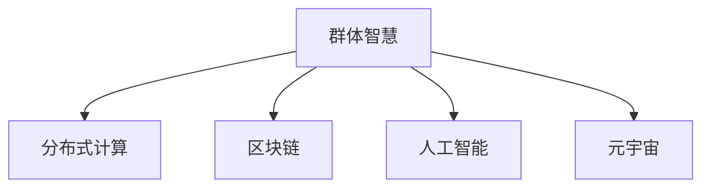

                 

# 元宇宙中的群体智慧：超越个体局限

## 1. 背景介绍

随着信息技术的飞速发展，元宇宙（Metaverse）这一概念逐渐成为学术界和产业界讨论的热点。元宇宙是虚拟世界和现实世界的深度融合，通过数字化技术构建起一个全新的沉浸式、交互式和共享式的数字空间。元宇宙将彻底改变人们的生产生活方式，推动社会向数字化、智能化方向演进。

在元宇宙中，庞大的用户基数和复杂多样的需求，催生了对群体智慧（Group Intelligence）的迫切需求。所谓群体智慧，是指多个智能实体协同工作，综合运用各自的知识、经验、技能，共同解决复杂问题。在元宇宙的广阔舞台上，群体智慧将在数据治理、知识共享、决策支持等方面发挥重要作用，推动社会治理、经济建设、教育普及等多个领域的数字化转型。

本文将从群体智慧的理论基础出发，探讨其在元宇宙中的应用实践，揭示其背后的算法原理，并通过具体案例分析，展示群体智慧带来的深远影响。

## 2. 核心概念与联系

### 2.1 核心概念概述

为理解群体智慧在元宇宙中的具体应用，本节将介绍几个关键概念及其联系：

- 群体智慧（Group Intelligence）：指多个智能实体通过协作，共同处理复杂问题的能力。群体智慧通常依赖协同、众包、众测等机制，具有分布式、开放性、自组织等特点。

- 分布式计算（Distributed Computing）：指将计算任务分布在多台计算机上进行并行处理，提升计算效率。分布式计算是实现群体智慧的基础，通过协同计算，各节点可以高效共享资源，加速问题解决。

- 区块链（Blockchain）：分布式账本技术，通过共识算法保证数据透明、可信，为群体智慧提供了安全的基础设施。区块链技术确保了数据交换的可靠性和安全性，适用于记录和验证群体智慧的交互过程。

- 人工智能（AI）：指通过算法使机器具备类人智能。在群体智慧中，AI技术可以用于自动化复杂任务、提取数据洞察、优化协同流程等。

- 元宇宙（Metaverse）：虚拟世界与现实世界的融合，为群体智慧提供了一个广阔的舞台。在元宇宙中，人们可以自由交互、共享知识、协同工作，推动群体智慧的发展。

这些概念之间的关系可以通过以下Mermaid流程图来展示：



这个流程图展示了群体智慧在不同技术体系中的实现路径和应用场景，其中分布式计算、区块链、人工智能以及元宇宙都是实现群体智慧的重要手段。

## 3. 核心算法原理 & 具体操作步骤

### 3.1 算法原理概述

群体智慧的核心在于协同求解，即通过多个智能实体间的互动和协作，共同解决复杂问题。其核心算法通常包括分布式算法、协同过滤、强化学习等。

1. **分布式算法**：通过将任务分割成多个子任务，并行计算，提升整体计算效率。

2. **协同过滤**：指通过智能实体间的相互推荐，提高任务解决效率。协同过滤常用于信息检索、推荐系统等领域。

3. **强化学习**：通过智能实体在特定环境中不断尝试和反馈，逐步优化决策策略，实现复杂的智能任务。

### 3.2 算法步骤详解

基于群体智慧的元宇宙应用，一般包括以下几个关键步骤：

**Step 1: 设计群体智慧系统架构**
- 明确元宇宙中的任务目标和参与实体。
- 确定分布式计算、区块链、人工智能等技术的应用场景。
- 设计数据共享、任务分派、结果聚合等协同机制。

**Step 2: 构建任务模型和协同算法**
- 根据任务特性，选择合适的分布式算法和协同算法。
- 利用区块链技术保障数据透明性和安全性。
- 使用AI技术自动化处理数据、提取洞察和优化决策。

**Step 3: 实现群体智慧系统**
- 根据架构设计，实现各个节点的分布式计算和协同算法。
- 在区块链上构建智能合约，记录和验证群体智慧的交互过程。
- 使用AI技术实现任务自动处理和智能决策。

**Step 4: 测试和优化**
- 在模拟环境下测试系统性能，发现并解决问题。
- 根据测试结果调整算法参数，优化协同效率。
- 在实际元宇宙应用中不断迭代改进，提升系统效能。

### 3.3 算法优缺点

群体智慧在元宇宙中具有以下优点：
1. 提升计算效率：分布式计算和协同过滤可以显著提升问题解决的速度。
2. 增强数据安全性：区块链技术保障了数据交换的透明性和可信度。
3. 促进知识共享：智能实体间的协作交流，加速了知识的积累和传播。
4. 提高决策质量：AI技术可以优化决策策略，提升群体智慧的决策质量。

同时，群体智慧也存在一些局限：
1. 协同成本高：构建和维护分布式系统需要较高的硬件和软件投入。
2. 数据隐私问题：区块链的透明性可能带来数据隐私泄露的风险。
3. 系统复杂度增加：多个智能实体间的交互关系复杂，可能导致系统不易维护。
4. AI依赖问题：AI技术的性能依赖数据质量，可能影响群体智慧的决策结果。

尽管如此，群体智慧在元宇宙中的优势明显，尤其是在大规模、复杂问题的解决上，具有不可替代的作用。未来研究应聚焦于如何平衡成本与效率，优化协同机制，提升数据隐私保护，增强AI技术在元宇宙中的应用。

### 3.4 算法应用领域

群体智慧在元宇宙中的应用场景广泛，主要包括：

- 数据治理：通过群体智慧，对海量元宇宙数据进行自动化处理、治理和分析，提升数据利用效率。
- 决策支持：利用分布式算法和AI技术，协同解决元宇宙中的复杂决策问题，如市场预测、风险评估等。
- 协同创造：在虚拟创作平台上，多个智能实体协同创作，提升内容生产效率和质量。
- 智能治理：构建基于群体智慧的元宇宙治理体系，提升社会管理水平，推动可持续发展。
- 社会互动：利用智能合约和区块链技术，实现元宇宙中各实体的公平交易和透明协作。

这些应用领域展示了群体智慧在元宇宙中的巨大潜力和广泛应用前景。

## 4. 数学模型和公式 & 详细讲解 & 举例说明

### 4.1 数学模型构建

在群体智慧中，分布式算法和协同过滤是两个重要组成部分。以协同过滤为例，假设用户 $i$ 对 $n$ 个物品的评分 $\{r_{ij}\}_{j=1}^n$，通过协同过滤算法 $A$ 得到用户 $i$ 对未评分物品 $k$ 的预测评分 $r_i^k$，则协同过滤模型的目标是最小化预测评分误差。

设预测评分误差为 $E_i^k$，则协同过滤模型的优化目标为：

$$
\min_{A} \frac{1}{N} \sum_{i=1}^N \sum_{k=1}^M E_i^k
$$

其中 $N$ 为用户数量，$M$ 为物品数量。

### 4.2 公式推导过程

基于协同过滤的目标函数，常用的协同过滤算法包括矩阵分解法、奇异值分解法等。这里以矩阵分解法为例，推导协同过滤的基本公式。

设协同过滤模型 $A$ 可以将用户对物品的评分矩阵 $R$ 分解为两个低秩矩阵 $P$ 和 $Q$，即 $R = PQ^T$，其中 $P$ 为 $N \times r$ 矩阵，$Q$ 为 $M \times r$ 矩阵，$r$ 为分解维度。则用户 $i$ 对未评分物品 $k$ 的预测评分 $r_i^k$ 可以表示为：

$$
r_i^k = \sum_{j=1}^n p_{ij} q_{jk}
$$

其中 $p_{ij}$ 为 $P$ 矩阵的第 $i$ 行第 $j$ 列元素，$q_{jk}$ 为 $Q$ 矩阵的第 $k$ 列第 $j$ 行元素。

通过最小化目标函数，得到协同过滤矩阵分解的具体公式：

$$
\min_{P,Q} \frac{1}{N} \sum_{i=1}^N \sum_{j=1}^n (r_{ij} - \sum_{k=1}^M p_{ij} q_{jk})^2
$$

通过对目标函数求导，得到协同过滤算法的参数更新公式：

$$
P \leftarrow P - \eta (\frac{1}{N}RQ^T - PP^TQ^T)^T (RQ^T - PP^TQ^T)
$$

$$
Q \leftarrow Q - \eta (QP^TP - \frac{1}{M}R^TP)^T (QP^TP - \frac{1}{M}R^TP)
$$

其中 $\eta$ 为学习率，$R^T$ 为评分矩阵的转置。

### 4.3 案例分析与讲解

以Google的PageRank算法为例，展示其在元宇宙中的应用。

PageRank算法是一种经典的分布式算法，用于计算网页之间的重要性排序。在元宇宙中，可以将每个用户视为网页节点，每个用户的交互行为视为网页链接。通过PageRank算法，可以计算出用户之间的影响力关系，实现对元宇宙中社交网络的高效分析。

具体来说，设用户 $i$ 和用户 $j$ 之间的交互强度为 $w_{ij}$，则用户 $i$ 的影响力 $I_i$ 可以表示为：

$$
I_i = (1 - d) \sum_{j=1}^n w_{ij}I_j + d
$$

其中 $d$ 为阻尼系数，通常在0.85左右。通过迭代计算，可以得到每个用户的影响力排序。

在元宇宙中，PageRank算法可以用于推荐系统的用户兴趣分析、社交网络的关系挖掘、用户行为预测等。例如，在推荐系统中，通过计算用户之间的影响力关系，可以发现具有相似兴趣的用户群体，提升推荐效果。

## 5. 项目实践：代码实例和详细解释说明

### 5.1 开发环境搭建

在进行元宇宙中群体智慧项目实践前，需要准备开发环境。以下是使用Python和TensorFlow进行项目开发的流程：

1. 安装Anaconda：从官网下载并安装Anaconda，用于创建独立的Python环境。

2. 创建并激活虚拟环境：
```bash
conda create -n metaverse-env python=3.8 
conda activate metaverse-env
```

3. 安装TensorFlow：根据CUDA版本，从官网获取对应的安装命令。例如：
```bash
conda install tensorflow tensorflow-gpu=2.7 -c pytorch -c conda-forge
```

4. 安装必要的第三方库：
```bash
pip install tensorflow-estimator tensorflow-addons
```

5. 安装相关硬件驱动：
```bash
apt-get install nvidia-cuda-toolkit-10-1 libnccl2 cuda-10-1 libnccl2-dev
```

完成上述步骤后，即可在`metaverse-env`环境中开始项目实践。

### 5.2 源代码详细实现

下面我们以PageRank算法为例，展示其在元宇宙中的应用。

首先，定义PageRank算法的用户交互矩阵和阻尼系数：

```python
import numpy as np

# 用户交互矩阵
R = np.array([[0.5, 0.2, 0.1],
              [0.3, 0.4, 0.0],
              [0.1, 0.1, 0.5]])

# 阻尼系数
d = 0.85
```

然后，实现PageRank算法的迭代计算：

```python
def pagerank(R, d):
    N = len(R)
    I = np.zeros(N)
    prev_I = np.zeros(N)
    
    # 迭代计算影响力排序
    while True:
        prev_I = I.copy()
        I = np.zeros(N)
        
        # 计算每个用户的影响力
        for i in range(N):
            I[i] = d + (1 - d) * np.sum(R[i, :] * prev_I)
            
        # 收敛判断
        if np.max(np.abs(prev_I - I)) < 1e-6:
            break
    
    return I

# 计算用户影响力排序
I = pagerank(R, d)
print(I)
```

通过计算，可以得到用户之间的影响力排序。在实际应用中，可以将影响力排序作为元宇宙中社交网络分析的基础，推动各类智能应用的实现。

### 5.3 代码解读与分析

让我们再详细解读一下关键代码的实现细节：

**用户交互矩阵R**：
- 用户交互矩阵 $R$ 用于表示用户之间的交互强度。在元宇宙中，可以通过各种行为数据（如好友关系、评论、点赞等）构建用户交互矩阵。

**阻尼系数d**：
- 阻尼系数 $d$ 用于控制算法迭代过程中的收敛速度。通常在0.85左右，以确保算法的收敛性和计算精度。

**迭代计算影响力排序**：
- 使用while循环进行迭代计算，直到影响力排序不再变化。在每个迭代步中，先计算当前影响力 $I$，再与前一迭代步的结果 $prev_I$ 进行比较，判断是否收敛。

**影响力排序结果I**：
- 影响力排序结果 $I$ 用于反映每个用户的重要性。在元宇宙中，可以用于社交网络分析、用户推荐、内容排序等场景。

这个PageRank算法的实现展示了如何在元宇宙中应用群体智慧算法。在实际项目中，还需要进一步优化算法性能，调整参数设置，实现更高质量的影响力排序。

## 6. 实际应用场景

### 6.1 数据治理

在元宇宙中，数据量巨大、数据类型多样，数据治理成为实现群体智慧的首要任务。通过构建数据治理平台，可以自动化处理海量数据，提升数据利用效率。

例如，某虚拟城市平台可以收集大量城市运行数据，包括交通流量、气象信息、能源消耗等。通过群体智慧算法，对数据进行去重、清洗、分类、标注等处理，构建统一的数据库。利用分布式计算和协同过滤技术，对数据进行高效的分析和处理，提升数据治理效率。

### 6.2 决策支持

在复杂多变的元宇宙中，决策支持系统需要具备强大的信息处理和分析能力。利用群体智慧，可以构建智能决策支持系统，提升决策水平。

例如，某虚拟经济平台可以收集海量市场交易数据，构建基于群体智慧的决策支持系统。通过分布式算法和协同过滤，对市场动态进行实时监控和分析，生成市场预测报告和风险评估。利用AI技术，优化决策模型，提升预测准确性和决策质量。

### 6.3 协同创造

在虚拟创作平台上，多个智能实体协同创作，可以大幅提升内容生产效率和质量。利用群体智慧，可以构建协同创作平台，支持作者之间的协作和交流。

例如，某虚拟小说平台可以构建基于群体智慧的协作创作系统。通过智能推荐，发现具有相似创作风格的作者，形成创作小组，共同创作小说。利用协同过滤算法，推荐相似的创作素材和写作技巧，提升创作质量。

### 6.4 智能治理

在元宇宙中，智能治理系统需要具备良好的社会管理能力。利用群体智慧，可以构建智能治理平台，提升社会管理水平。

例如，某虚拟城市平台可以构建基于群体智慧的智能治理系统。通过分布式算法和协同过滤，收集和分析社会事件，生成治理建议和应对策略。利用AI技术，优化治理模型，提升社会管理效率。

### 6.5 社会互动

在元宇宙中，社会互动是一个重要场景。利用群体智慧，可以构建智能互动平台，提升用户互动体验。

例如，某虚拟社交平台可以构建基于群体智慧的智能互动系统。通过智能推荐，发现具有相似兴趣的用户，形成互动社区。利用协同过滤算法，推荐合适的互动内容，提升用户互动体验。

## 7. 工具和资源推荐

### 7.1 学习资源推荐

为了帮助开发者系统掌握群体智慧的理论基础和实践技巧，这里推荐一些优质的学习资源：

1. 《群体智慧：分布式协同算法》系列博文：由群体智慧专家撰写，深入浅出地介绍了分布式算法、协同过滤、强化学习等前沿话题。

2. 斯坦福大学《分布式系统》课程：系统讲解分布式计算的基本原理和实践方法，适合进一步深入学习。

3. 《人工智能：原理与实践》书籍：全面介绍了人工智能的核心算法和技术，涵盖群体智慧等多个方向。

4. arXiv.org：学术论文库，收录了大量群体智慧和元宇宙领域的最新研究成果，是获取前沿知识的重要渠道。

5. GitHub上的开源项目：群智链（Group Intelligence）、DALL-E等，提供了丰富的代码实现和应用案例，适合学习借鉴。

通过对这些资源的学习实践，相信你一定能够快速掌握群体智慧在元宇宙中的应用原理和实践方法。

### 7.2 开发工具推荐

高效的开发离不开优秀的工具支持。以下是几款用于群体智慧开发的常用工具：

1. TensorFlow：基于Python的深度学习框架，支持分布式计算和协同过滤，适合群体智慧项目开发。

2. Hadoop和Spark：分布式计算平台，支持大规模数据处理和分析，适合处理元宇宙中的海量数据。

3. Docker和Kubernetes：容器化和编排工具，支持分布式应用的部署和运维，适合复杂分布式系统的构建。

4. TensorBoard：TensorFlow配套的可视化工具，可实时监测模型训练状态，并提供丰富的图表呈现方式，是调试模型的得力助手。

5. GitLab和JIRA：代码管理和项目管理工具，支持团队协作和代码版本控制，适合群体智慧项目的协作开发。

合理利用这些工具，可以显著提升群体智慧项目的开发效率，加快创新迭代的步伐。

### 7.3 相关论文推荐

群体智慧和元宇宙的发展源于学界的持续研究。以下是几篇奠基性的相关论文，推荐阅读：

1. Google的PageRank算法：阐述了PageRank算法的基本思想和实现方法，是分布式算法的重要代表。

2. Microsoft的LinkPrediction和Clusterprediction算法：介绍了基于协同过滤的推荐算法，可用于社交网络和推荐系统。

3. IBM的群智链（Group Intelligence）：提出了一种基于区块链的协同计算框架，用于群体智慧的应用实现。

4. Stanford的分布式协作平台：开发了一种分布式协作框架，支持群体智慧的多方协同工作。

5. 清华大学元宇宙研究报告：深入探讨了元宇宙的核心技术体系和未来发展方向，为群体智慧的应用提供了重要参考。

这些论文代表了大语言模型微调技术的发展脉络。通过学习这些前沿成果，可以帮助研究者把握学科前进方向，激发更多的创新灵感。

## 8. 总结：未来发展趋势与挑战

### 8.1 总结

本文从群体智慧的理论基础出发，探讨其在元宇宙中的应用实践，揭示其背后的算法原理，并通过具体案例分析，展示群体智慧带来的深远影响。

通过本文的系统梳理，可以看到，群体智慧在元宇宙中的优势明显，尤其是在大规模、复杂问题的解决上，具有不可替代的作用。未来研究应聚焦于如何平衡成本与效率，优化协同机制，提升数据隐私保护，增强AI技术在元宇宙中的应用。

### 8.2 未来发展趋势

展望未来，群体智慧在元宇宙中的发展趋势如下：

1. 分布式计算效率提升：随着硬件和网络技术的发展，分布式计算的效率将进一步提升，推动群体智慧的广泛应用。

2. 协同过滤算法优化：未来的协同过滤算法将更加智能和高效，支持更复杂、多样化的协作模式。

3. AI技术不断突破：AI技术的进步将为群体智慧带来新的功能和应用场景，提升决策和推荐系统的性能。

4. 区块链技术应用拓展：区块链技术将广泛应用于数据治理、智能合约等领域，保障数据安全和透明度。

5. 元宇宙场景多样化：随着元宇宙的不断发展，将涌现更多应用场景，推动群体智慧的创新和应用。

### 8.3 面临的挑战

尽管群体智慧在元宇宙中的优势明显，但在迈向更加智能化、普适化应用的过程中，仍面临诸多挑战：

1. 分布式系统复杂度高：构建和维护分布式系统需要较高的硬件和软件投入，技术门槛较高。

2. 数据隐私保护困难：区块链的透明性可能带来数据隐私泄露的风险，需采取更严格的隐私保护措施。

3. 协同成本高昂：协同计算和数据处理需要大量的计算资源和时间，可能带来高昂的成本。

4. AI技术依赖数据：AI技术的性能依赖数据质量，可能影响群体智慧的决策结果。

5. 系统复杂度高：多个智能实体间的交互关系复杂，可能导致系统不易维护。

尽管如此，随着技术的不断进步和应用的不断深入，群体智慧在元宇宙中的潜力将不断释放，推动社会治理、经济建设、教育普及等多个领域的数字化转型。

### 8.4 研究展望

面向未来，群体智慧研究需要在以下几个方面寻求新的突破：

1. 分布式系统简化：通过优化分布式算法，提升分布式计算的效率和可扩展性，降低系统复杂度。

2. 数据隐私保护：利用差分隐私、联邦学习等技术，保护数据隐私，增强数据安全性。

3. 协同机制优化：通过智能推荐、动态组群等方式，优化协同机制，提高协作效率。

4. AI技术改进：通过模型压缩、迁移学习等技术，提升AI算法的效率和准确性，增强群体智慧的应用效果。

5. 元宇宙应用拓展：利用群体智慧，拓展元宇宙的更多应用场景，推动社会治理、教育普及、智能制造等领域的创新。

只有勇于创新、敢于突破，才能不断拓展群体智慧在元宇宙中的边界，让智能技术更好地造福人类社会。面向未来，群体智慧将在构建安全、可靠、可解释、可控的智能系统中扮演越来越重要的角色。

## 9. 附录：常见问题与解答

**Q1: 如何构建高效的分布式计算系统？**

A: 构建高效的分布式计算系统需要考虑多个因素：
1. 选择合适的分布式算法，如MapReduce、Spark等。
2. 合理设计系统架构，如任务分派、数据存储和传输等。
3. 使用多机协同的优化技术，如任务调度、数据复制等。
4. 监控和管理系统的性能，确保系统稳定运行。

**Q2: 如何在元宇宙中保护数据隐私？**

A: 在元宇宙中保护数据隐私需要考虑多个措施：
1. 使用差分隐私技术，保护用户数据的匿名性和不可逆性。
2. 使用区块链技术，记录和验证数据交换过程，增强数据透明性。
3. 实现数据去标识化处理，去除与用户身份相关的信息。
4. 采用联邦学习技术，在本地设备上训练模型，避免数据传输。

**Q3: 如何优化协同过滤算法的性能？**

A: 优化协同过滤算法的性能需要考虑多个方面：
1. 选择合适的分解算法，如矩阵分解、奇异值分解等。
2. 调整分解维度和学习率，平衡模型复杂度和收敛速度。
3. 使用数据增强技术，如近义替换、回译等，提高协同过滤的效果。
4. 利用分布式计算，提升协同过滤的计算效率。

**Q4: 如何提升群体智慧系统的可解释性？**

A: 提升群体智慧系统的可解释性需要考虑多个因素：
1. 使用可解释性较强的算法，如决策树、线性回归等。
2. 记录和可视化算法的决策过程，提供详细的解释报告。
3. 引入人工智能解释工具，生成模型特征和决策规则的解释。
4. 使用自然语言生成技术，生成模型输出的自然语言解释。

**Q5: 如何构建高效的智能治理系统？**

A: 构建高效的智能治理系统需要考虑多个因素：
1. 选择合适的群体智慧算法，如PageRank、协同过滤等。
2. 设计合理的智能合约，记录和验证治理过程。
3. 引入人工智能技术，优化决策模型和推荐系统。
4. 结合实时数据，生成动态治理建议和应对策略。

通过对这些常见问题的解答，相信你一定能够更好地理解群体智慧在元宇宙中的实现原理和应用方法，掌握相关的开发技术和实践技巧。

---

作者：禅与计算机程序设计艺术 / Zen and the Art of Computer Programming

