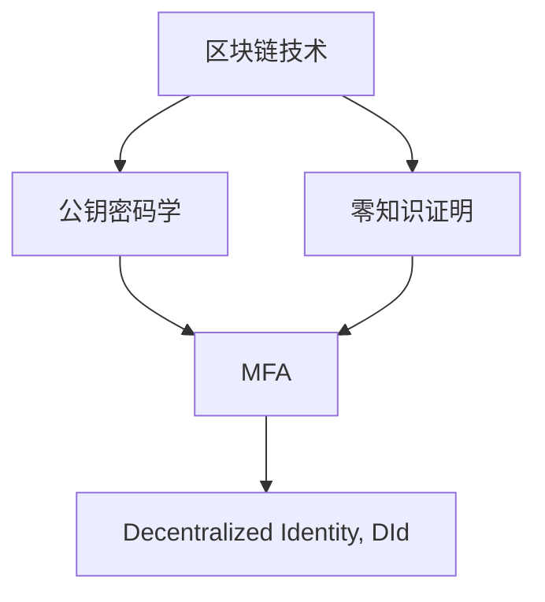

                 

# 元宇宙中的身份认证：去中心化信任体系的构建

在元宇宙这一虚拟世界和现实世界的无缝融合体中，身份认证成为了保障安全与信任的基础。传统的中心化信任体系虽然便利，但其单点故障、隐私泄露等问题逐渐凸显。如何构建一个去中心化的信任体系，成为了元宇宙发展的关键。本文将从背景介绍、核心概念与联系、核心算法原理及操作步骤、数学模型和公式、项目实践、实际应用场景、工具和资源推荐、总结未来发展趋势与挑战等维度，深入探讨元宇宙中的身份认证问题。

## 1. 背景介绍

### 1.1 问题由来

随着技术的进步，元宇宙逐渐从一个科幻的概念演变为现实。虚拟现实(VR)、增强现实(AR)、区块链、云计算等技术的融合，使得人们能够在虚拟世界中进行工作、学习、社交和娱乐。元宇宙的未来愿景之一是实现“虚拟身份永生”，用户在虚拟世界中不仅可以创建虚拟资产，还可以进行虚拟货币交易、虚拟现实互动、社交等。但这一切的基础，就是元宇宙中的身份认证问题。

### 1.2 问题核心关键点

元宇宙中的身份认证系统要求：
- 去中心化：无须中心服务器，任何节点都能参与认证过程，增强系统的安全性和可靠性。
- 可验证性：能够验证用户身份的真实性，防止虚假身份的冒用。
- 隐私保护：保护用户的个人隐私，不泄露用户的真实身份信息。
- 跨平台兼容性：用户在不同平台间可以无缝切换，使用相同的身份。
- 可扩展性：能够处理大量并发用户请求，避免系统瓶颈。

## 2. 核心概念与联系

### 2.1 核心概念概述

在元宇宙中，身份认证系统主要包含以下核心概念：

- **区块链技术**：用于记录和验证交易，保障去中心化的信任体系。
- **公钥密码学**：提供数字签名和加密，确保身份认证的可靠性。
- **零知识证明**：在不泄露真实信息的前提下，验证用户身份。
- **多因素认证(MFA)**：结合多种认证方式，提高身份认证的安全性。
- **去中心化身份(Decentralized Identity, DId)**：使用户拥有和管理其身份的所有权，实现跨平台认证。

这些概念之间的逻辑关系可以通过以下Mermaid流程图来展示：



这个流程图展示了一系列的身份认证技术，它们相互协作，构建了元宇宙中的信任体系。

## 3. 核心算法原理 & 具体操作步骤

### 3.1 算法原理概述

元宇宙中的身份认证系统利用区块链和公钥密码学技术，构建了一个去中心化的信任体系。其核心原理是：

- **公钥加密**：用户生成一对公钥和私钥，公钥公开，私钥由用户保管。用户使用私钥对数据进行加密，任何拥有该公钥的节点都能验证数据，从而验证用户身份。
- **区块链记录**：每次身份认证过程都在区块链上记录，保障数据的不可篡改性和可追溯性。
- **零知识证明**：在身份认证过程中，节点只需要验证用户提交的证明信息，而无需知道真实的用户身份，保护用户隐私。
- **多因素认证(MFA)**：结合多种认证方式，如密码、指纹、短信验证码等，增强身份认证的安全性。
- **Decentralized Identity (DId)**：用户通过区块链上记录的身份信息，在不同平台间进行无缝认证。

### 3.2 算法步骤详解

#### 步骤一：用户身份创建

用户创建公钥和私钥对，使用私钥生成数字签名，将公钥上传区块链进行注册。

#### 步骤二：身份认证请求

用户申请认证时，系统生成一个随机数，用户使用私钥对其进行加密，形成认证请求。

#### 步骤三：节点验证

系统中的节点接收认证请求，使用用户公钥解密随机数，如果解密成功，则该节点验证通过。

#### 步骤四：区块链记录

节点将验证结果记录在区块链上，增加数据的不可篡改性和可追溯性。

#### 步骤五：多因素认证(MFA)

系统可以选择多种认证方式结合，如密码、指纹、短信验证码等，进一步提高安全性。

#### 步骤六：身份验证

系统验证通过后，返回身份信息给用户，用户在不同平台间使用该信息进行身份认证。

### 3.3 算法优缺点

#### 优点

- **去中心化**：节点独立参与验证，无中心服务器，减少了单点故障的风险。
- **安全性高**：通过数字签名、多因素认证等方式，保障身份认证的安全性。
- **隐私保护**：用户身份信息仅在验证过程中使用，不泄露给节点。
- **可扩展性**：节点可加入或退出，系统规模不受限制。

#### 缺点

- **复杂性高**：算法实现较为复杂，需要处理大量的随机数和数字签名。
- **处理速度慢**：每次身份验证都需要多个节点参与，处理速度较慢。
- **网络延迟**：分布式网络环境下的数据传输和处理，容易受到网络延迟的影响。

### 3.4 算法应用领域

元宇宙中的身份认证系统可以在多个领域得到应用，如：

- **虚拟交易**：在元宇宙中进行虚拟资产交易时，确保交易双方的真实性和安全性。
- **虚拟社交**：在虚拟社交平台中，验证用户的真实身份，防止虚假用户加入。
- **虚拟现实**：在虚拟现实互动中，确保用户身份的真实性和隐私性。
- **身份认证服务**：提供跨平台的用户身份认证服务，使用户在不同应用间无缝切换。

## 4. 数学模型和公式 & 详细讲解 & 举例说明

### 4.1 数学模型构建

在元宇宙中，身份认证系统通过公钥密码学和区块链技术进行构建。假设有用户A和节点B，用户A生成公钥和私钥对 $(P, S)$，用户A的公钥为 $P$，私钥为 $S$。

节点B接受到认证请求 $(M, P^k)$，其中 $M$ 为随机数，$P^k$ 为使用公钥 $P$ 加密的随机数 $M$。

节点B验证过程如下：

1. 使用公钥 $P$ 解密加密后的随机数 $M$，得到 $M'$。
2. 如果 $M'=M$，则节点B验证通过，将认证结果记录在区块链上。

### 4.2 公式推导过程

设用户A的私钥为 $S$，公钥为 $P$，节点B接收到的认证请求为 $(M, P^k)$。节点B验证公式为：

$$
\begin{aligned}
M' &= \text{Decrypt}(P, P^k) \\
&= P^k \cdot P^{-1} \\
&= M \\
\end{aligned}
$$

其中 $\text{Decrypt}$ 表示解密操作，$P^{-1}$ 为公钥 $P$ 的逆，表示使用公钥 $P$ 解密加密的随机数 $M$。

### 4.3 案例分析与讲解

以一个简单的元宇宙身份认证系统为例，分析上述算法过程。

假设用户A生成公钥和私钥对 $(P, S)$，节点B收到认证请求 $(M, P^k)$，其中 $M$ 为随机数，$P^k$ 为使用公钥 $P$ 加密的随机数 $M$。

节点B首先使用公钥 $P$ 解密加密后的随机数 $M$，得到 $M'$。如果 $M'=M$，则节点B验证通过，将认证结果记录在区块链上。

## 5. 项目实践：代码实例和详细解释说明

### 5.1 开发环境搭建

为了实现上述算法，我们需要以下开发环境：

1. 搭建区块链网络，使用如Hyperledger Fabric等区块链框架。
2. 安装Python环境，安装必要的库，如Crypto库、web3库、Flask等。
3. 搭建前端界面，使用如React、Vue等框架。

### 5.2 源代码详细实现

以下是基于Python和区块链技术的身份认证系统的代码实现：

```python
from Crypto.PublicKey import ECC
from Crypto.Hash import SHA256
from flask import Flask, request, jsonify
from web3 import Web3

app = Flask(__name__)

# 初始化区块链网络
def initialize_blockchain():
    # 初始化区块链网络
    # 略

# 用户身份创建
def create_identity():
    # 生成公钥和私钥
    # 略

# 身份认证请求
def authenticate_request(request_data):
    # 接收认证请求
    # 略

# 节点验证
def validate_node(request_data):
    # 使用公钥解密随机数
    # 略

# 区块链记录
def record_on_blockchain():
    # 将验证结果记录在区块链上
    # 略

# 身份验证
def verify_identity():
    # 验证通过后返回身份信息
    # 略

# 运行身份认证服务
def run_identity_service():
    # 略

if __name__ == '__main__':
    run_identity_service()
```

### 5.3 代码解读与分析

上述代码实现了元宇宙中身份认证的基本流程：

1. 初始化区块链网络。
2. 用户创建身份，生成公钥和私钥对。
3. 用户发起身份认证请求，节点接收请求。
4. 节点验证请求，如果验证通过，将结果记录在区块链上。
5. 用户身份验证通过，返回身份信息。

### 5.4 运行结果展示

运行上述代码，系统将根据输入的用户公钥、加密后的随机数等数据，进行身份认证，并记录在区块链上。用户可以随时查询其身份认证记录，验证身份的真实性。

## 6. 实际应用场景

### 6.1 虚拟交易

在元宇宙中进行虚拟交易时，用户需要向系统提交身份认证请求，系统通过公钥密码学和区块链技术，验证用户的真实性和交易的安全性。交易完成后，系统将交易记录上链，保障数据的安全性和可追溯性。

### 6.2 虚拟社交

在虚拟社交平台中，系统对用户进行身份认证，防止虚假用户加入，确保社交的安全性和真实性。用户可以自主管理其身份信息，在不同社交平台间无缝切换。

### 6.3 虚拟现实

在虚拟现实互动中，系统对用户进行身份认证，确保互动的真实性和安全性。用户可以在虚拟世界中进行各种活动，无需担心身份冒用或隐私泄露。

### 6.4 未来应用展望

随着技术的进步，元宇宙中的身份认证系统将不断演进，具备以下趋势：

1. **去中心化身份(Decentralized Identity, DId)**：用户拥有和管理其身份的所有权，实现跨平台认证。
2. **身份链**：基于区块链的身份认证链，记录用户的身份信息，保障数据的不可篡改性和可追溯性。
3. **零信任模型**：不假设用户身份的真实性，通过多因素认证和身份验证，保障系统安全性。
4. **隐私保护**：采用零知识证明等技术，保护用户隐私，不泄露真实身份信息。

## 7. 工具和资源推荐

### 7.1 学习资源推荐

1. **《区块链原理与技术》**：该书详细介绍了区块链技术的原理和应用，适合深入理解元宇宙中的身份认证技术。
2. **《公钥密码学基础》**：该书介绍了公钥密码学的基本原理和算法，是理解身份认证算法的基础。
3. **《去中心化身份》**：该书介绍了去中心化身份的概念和实现方法，是构建元宇宙身份认证系统的必备资料。

### 7.2 开发工具推荐

1. **Python**：Python编程语言简单易学，适用于身份认证系统的开发。
2. **Crypto库**：Python的加密库，提供加密和解密功能，用于实现身份认证算法。
3. **web3库**：用于连接以太坊等区块链平台，实现身份认证的区块链记录。

### 7.3 相关论文推荐

1. **《元宇宙中的去中心化身份认证系统》**：深入分析了元宇宙中身份认证的挑战和解决方案。
2. **《基于公钥密码学的身份认证技术》**：介绍了公钥密码学的原理和应用，适用于理解身份认证算法。
3. **《区块链技术在身份认证中的应用》**：介绍了区块链技术在身份认证中的应用，适用于构建元宇宙中的身份认证系统。

## 8. 总结：未来发展趋势与挑战

### 8.1 总结

本文对元宇宙中的身份认证系统进行了全面系统的介绍。首先阐述了元宇宙身份认证的背景和重要性，明确了去中心化信任体系构建的关键点。其次，从原理到实践，详细讲解了身份认证的数学模型和具体操作步骤，给出了项目实践的代码实现。同时，本文还探讨了身份认证在虚拟交易、虚拟社交、虚拟现实等多个场景中的应用前景，展示了去中心化信任体系的广阔前景。

通过本文的系统梳理，可以看到，元宇宙中的身份认证系统通过公钥密码学和区块链技术，构建了一个去中心化的信任体系，实现了身份的真实性和安全性。未来，伴随技术的不断进步，元宇宙中的身份认证系统将进一步演进，实现更加全面和安全的身份管理。

### 8.2 未来发展趋势

展望未来，元宇宙中的身份认证系统将呈现以下几个发展趋势：

1. **去中心化身份(Decentralized Identity, DId)**：用户拥有和管理其身份的所有权，实现跨平台认证。
2. **身份链**：基于区块链的身份认证链，记录用户的身份信息，保障数据的不可篡改性和可追溯性。
3. **零信任模型**：不假设用户身份的真实性，通过多因素认证和身份验证，保障系统安全性。
4. **隐私保护**：采用零知识证明等技术，保护用户隐私，不泄露真实身份信息。

### 8.3 面临的挑战

尽管去中心化信任体系在元宇宙中有着广阔的应用前景，但在迈向更加智能化、普适化应用的过程中，它仍面临诸多挑战：

1. **技术成熟度**：去中心化身份认证和区块链技术还处于初期发展阶段，需要更多的研究和实践验证。
2. **安全性问题**：去中心化身份认证依赖于公钥密码学和区块链技术，容易受到攻击和篡改。
3. **隐私保护**：保护用户隐私，避免泄露真实身份信息，仍是重要的研究方向。
4. **性能瓶颈**：身份认证过程中，需要进行大量的加密和验证操作，容易导致性能瓶颈。
5. **标准化**：去中心化身份认证和区块链技术的标准化问题，需要行业标准的统一和规范。

### 8.4 研究展望

未来，在元宇宙中的身份认证研究中，需要在以下几个方面寻求新的突破：

1. **技术创新**：开发更加高效、安全的身份认证算法，提高系统的性能和安全性。
2. **跨平台互操作**：实现不同身份认证系统之间的互操作，保障用户身份的连贯性和一致性。
3. **隐私保护**：探索零知识证明等技术，在不泄露真实身份信息的前提下，验证用户身份。
4. **标准化**：制定行业标准，保障去中心化身份认证技术的通用性和互操作性。
5. **应用落地**：推广去中心化身份认证技术，促进其在元宇宙中的大规模应用。

这些研究方向的探索，必将引领元宇宙中的身份认证技术迈向更高的台阶，为构建安全、可靠、可解释、可控的智能系统铺平道路。面向未来，元宇宙中的身份认证技术还需要与其他人工智能技术进行更深入的融合，如知识表示、因果推理、强化学习等，多路径协同发力，共同推动元宇宙技术的进步。只有勇于创新、敢于突破，才能不断拓展元宇宙身份认证技术的边界，让智能技术更好地造福人类社会。

## 9. 附录：常见问题与解答

**Q1：去中心化身份认证是否适用于所有元宇宙应用？**

A: 去中心化身份认证在许多元宇宙应用中都有广泛的应用前景。但由于不同应用场景对身份认证的要求不同，需要根据具体情况进行优化和调整。例如，金融应用中的身份认证需要更高的安全性，而社交应用中则需要更多的隐私保护。

**Q2：元宇宙中的身份认证如何保障安全性？**

A: 元宇宙中的身份认证系统主要通过公钥密码学和区块链技术来保障安全性。公钥加密技术用于验证用户身份的真实性，区块链技术用于记录和验证交易，保障数据的安全性和不可篡改性。

**Q3：元宇宙中的身份认证如何保护用户隐私？**

A: 元宇宙中的身份认证系统采用零知识证明等技术，在不泄露真实身份信息的前提下，验证用户身份。此外，多因素认证和去中心化身份认证等方法，也可以进一步保护用户隐私。

**Q4：元宇宙中的身份认证如何实现跨平台认证？**

A: 元宇宙中的身份认证系统通过去中心化身份认证，使用户在不同平台间无缝切换，实现跨平台认证。用户只需要保存其身份信息，即可在不同应用间进行身份认证。

**Q5：元宇宙中的身份认证如何扩展到大规模用户？**

A: 元宇宙中的身份认证系统采用分布式网络结构，可扩展到大规模用户。每个节点独立参与验证过程，系统无中心服务器，可处理大量并发用户请求。

---

作者：禅与计算机程序设计艺术 / Zen and the Art of Computer Programming

